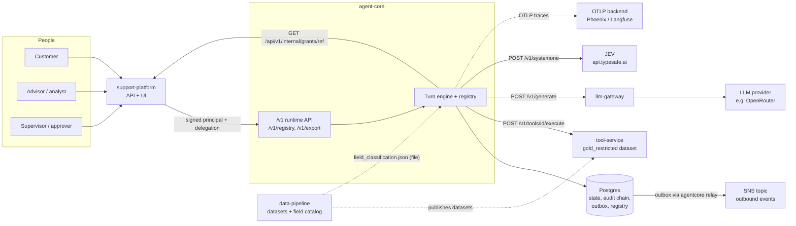
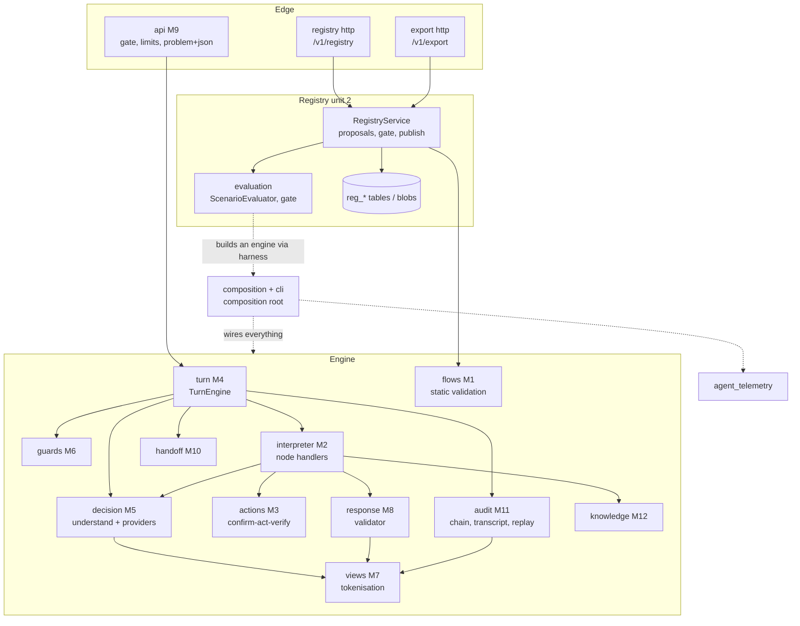
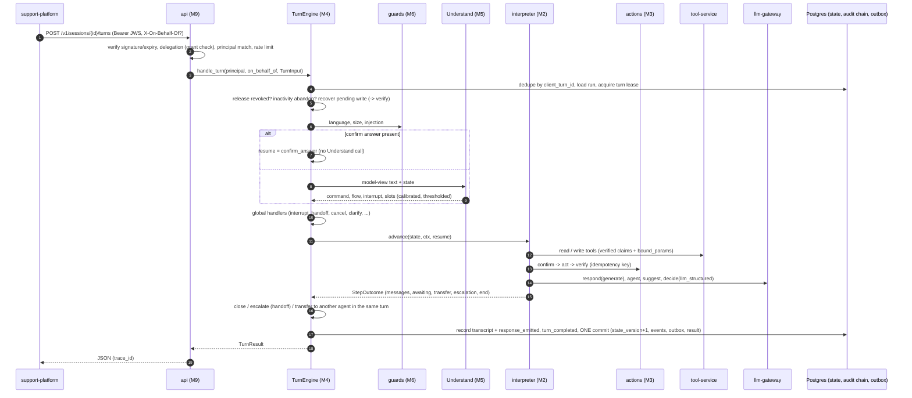
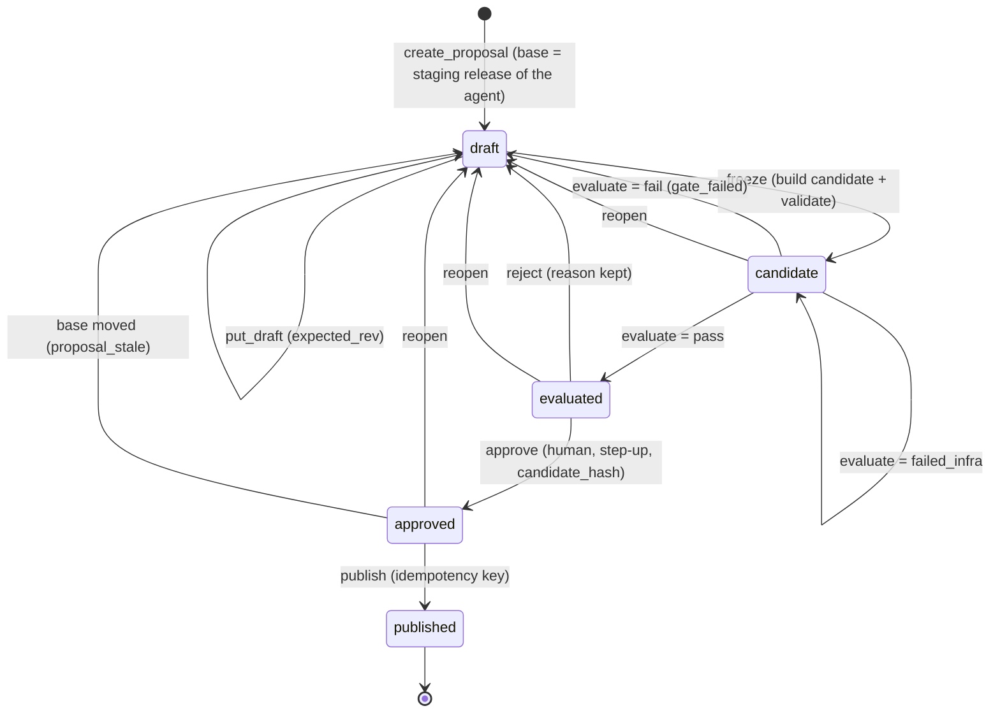
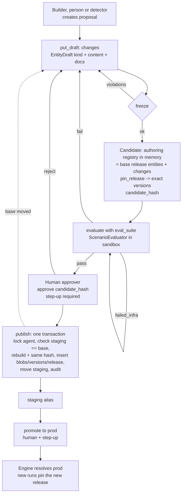
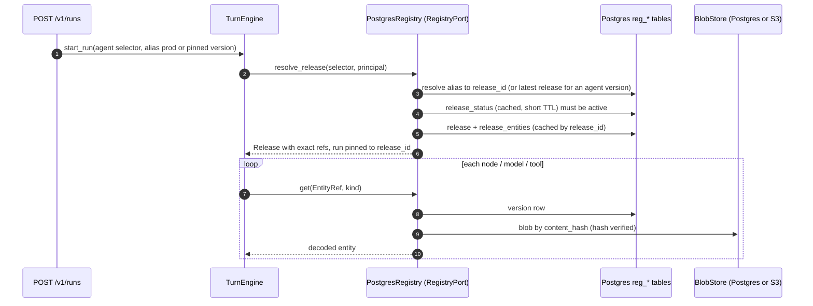
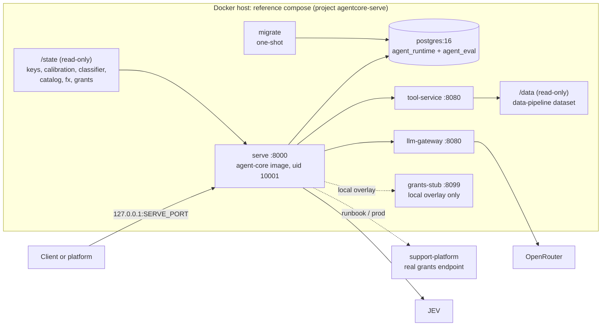
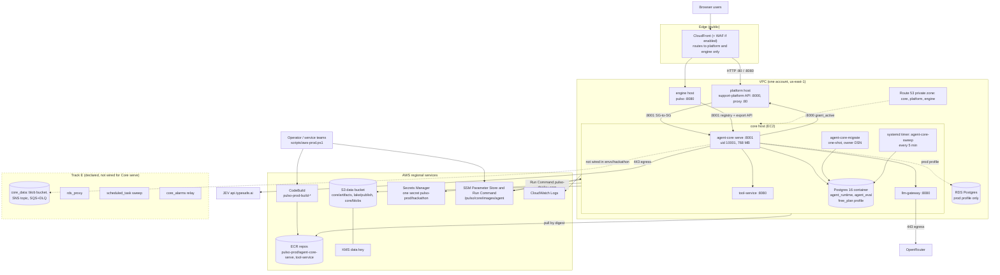
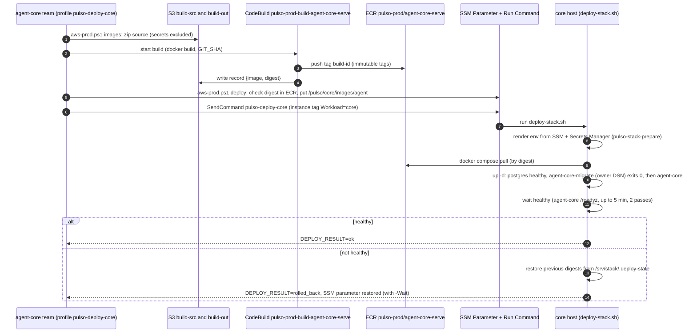
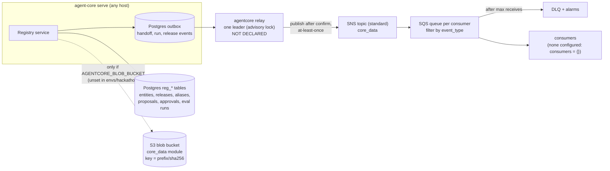

# agent-core: technical documentation

> **Audience:** engineers who build, operate or integrate `agent-core`. **Language:** English (code comments, specs and ADRs in the repository are in Spanish; identifiers are quoted as they appear). **Generated from code and docs; nothing was executed.**

## Executive summary

`agent-core` is a Python/FastAPI service that runs **agents described as versioned data** (flows, decision models, policies, prompts, templates, tools). For each message it understands what the person wants (Understand, with a calibrated JEV or classifier decision), follows a statically validated flow, writes only through confirm, act, verify, validates every generated answer against facts, and leaves a hash-chained audit trail that can be replayed. It is business-agnostic: banking concepts live in registry data.

- **Who calls it:** support-platform (customers and advisors, signed credentials). **What it calls:** tool-service (data tools), llm-gateway (LLM), JEV (decision model), the platform (delegation grant check).
- **Where change happens:** the **registry** (section 4). Every change is a proposal that must pass an evaluation gate and a human approval before a new immutable release is published and promoted.
- **Where it runs:** in the reference compose locally (section 8) and, per the infra repo, on an EC2 core host behind CloudFront-fronted platform/engine hosts (section 9). **No evidence exists that any of it is applied in AWS.**
- **State of quality:** engine and registry are implemented and tested with doubles and, where applicable, Postgres. Real calibration/classifier artifacts, real field grants, judges, `relay` deployment and audit-mode replay of real runs are open (section 11).

## Quick facts

| Item | Value | Source |
|---|---|---|
| Repository | https://github.com/pulso-factored/agent-core (local checkouts are stale feature branches and were not used) | git |
| Stack | Python 3.12 (`>=3.12,<3.13`), FastAPI, Pydantic v2, Postgres 16, `uv`, docker-compose; no Redis, no vector DB | `pyproject.toml`, `CLAUDE.md` |
| Entry point | CLI `agentcore` (`serve`, `migrate`, `sweep`, `relay`, `registry`, `validate`, `replay`, `record`, `contracts`, `blobs-backfill`, `llm-smoke`) | `agent_core/cli.py` |
| Ports | Image default 8000; 8001 on the infra core host | `Dockerfile`; infra `docs/agent-core-serve.md` |
| Probes | `GET /healthz` (liveness), `GET /readyz` (dependencies), `GET /version` | `agent_core/api/app.py` |
| Runtime API | `POST /v1/runs`, `POST /v1/sessions/{id}/turns`, `GET /v1/runs/{id}`, transcript, lineage, handoffs | `contracts/openapi.json` |
| Contract version | `SCHEMA_VERSION` 1.7.0 (205 files in `contracts/schemas`, 32 in `contracts/registry`) | `contracts/VERSION` |
| Code size | about 299 tracked files under `agent_core/`, 703 under `tests/`, 27 ADRs | counted at `6d09dfa` |
| Image | multi-stage, bases pinned by digest, uid 10001, no secrets, `ENTRYPOINT agentcore` | `Dockerfile` |
| State | Postgres (state, audit chain, outbox, registry, evaluations in a second DB); blobs in Postgres or S3 | section 4.3 |
| External dependencies | tool-service, llm-gateway, JEV, platform grants endpoint, optional S3/SNS, OTLP backend | section 6 |
| Documented commits | agent-core `eb33f5c` (code read), `6d09dfa` (this doc published), `da491b1` (later main); tool-service `64c36bc`; infra `246ddf8` | git |

## About this document

| Convention | Meaning |
|---|---|
| **[not verified]** / "Not verified" callouts | Not confirmed in code or by execution in this pass. The list is in section 12. |
| `path` | File path relative to the `agent-core` repo unless it says infra or tool-service |
| "Spec" and "ADR" | Documents under `docs/specs` and `docs/adr` of the repo; they are the design record, this document is a map |
| Sources read | agent-core `origin/main` (code and docs), tool-service `origin/main` (registry, contracts, README), infra `origin/main` (docs, compose bundles, Terraform), `runbook-e2e-real.md`, and agent-core's own `docs/serve-env.md`, `docs/serve-readiness.md` |
| Registry | Findable at section 4; its AWS side is section 9.6 |


## Contents

- [1. Purpose and role](#1-purpose-and-role)
  - [Relationship with the other services](#relationship-with-the-other-services)
- [2. Architecture](#2-architecture)
  - [2.1 Layout and module boundaries](#21-layout-and-module-boundaries)
  - [2.2 Ports and adapters](#22-ports-and-adapters)
  - [2.3 Turn cycle](#23-turn-cycle)
  - [2.4 Run state ownership](#24-run-state-ownership)
- [3. Agents and modules](#3-agents-and-modules)
  - [3.1 Understand (understand-turno) and decision models (M5)](#31-understand-understand-turno-and-decision-models-m5)
  - [3.2 Classifier](#32-classifier)
  - [3.3 Calibration](#33-calibration)
  - [3.4 Other engine modules (short)](#34-other-engine-modules-short)
  - [3.5 Advisor copilot and suggestions](#35-advisor-copilot-and-suggestions)
  - [3.6 Improvement engine (builder)](#36-improvement-engine-builder)
- [4. Registry (in depth)](#4-registry-in-depth)
  - [4.1 What the registry is](#41-what-the-registry-is)
  - [4.2 Format on disk (authoring / import / export)](#42-format-on-disk-authoring--import--export)
  - [4.3 Storage and schema (Postgres)](#43-storage-and-schema-postgres)
  - [4.4 Lifecycle: proposals and the gate](#44-lifecycle-proposals-and-the-gate)
  - [4.5 Runtime read path: how agent-core consumes the registry](#45-runtime-read-path-how-agent-core-consumes-the-registry)
  - [4.6 Access: API, CLI, export](#46-access-api-cli-export)
  - [4.7 How to add or change an entry](#47-how-to-add-or-change-an-entry)
  - [4.8 Registry limits and open points](#48-registry-limits-and-open-points)
  - [4.9 Registry in AWS](#49-registry-in-aws)
- [5. Contracts and schemas](#5-contracts-and-schemas)
- [6. Integration](#6-integration)
  - [6.1 With the support platform](#61-with-the-support-platform)
  - [6.2 With the LLM gateway](#62-with-the-llm-gateway)
  - [6.3 With the tool-service](#63-with-the-tool-service)
- [7. Configuration and environment variables](#7-configuration-and-environment-variables)
  - [7.1 Core](#71-core)
  - [7.2 Real pieces (default factories; replaced with --<name> module:attribute)](#72-real-pieces-default-factories-replaced-with---name-moduleattribute)
  - [7.3 External dependencies and operations](#73-external-dependencies-and-operations)
  - [7.4 Observability variables](#74-observability-variables)
  - [7.5 File formats](#75-file-formats)
- [8. Running locally, tests, Docker and deployment](#8-running-locally-tests-docker-and-deployment)
  - [8.1 Quick start (no network, no Postgres)](#81-quick-start-no-network-no-postgres)
  - [8.2 Quality gates (same as CI, .github/workflows/ci.yml)](#82-quality-gates-same-as-ci-githubworkflowsciyml)
  - [8.3 CLI (agentcore, agent_core/cli.py)](#83-cli-agentcore-agent_coreclipy)
  - [8.4 Docker image](#84-docker-image)
  - [8.5 docker-compose](#85-docker-compose)
  - [8.6 Deployment](#86-deployment)
- [9. Infrastructure & deployment (AWS)](#9-infrastructure--deployment-aws)
  - [9.1 Two deployment tracks (read this first)](#91-two-deployment-tracks-read-this-first)
  - [9.2 AWS architecture (Track H, with Track E elements dashed)](#92-aws-architecture-track-h-with-track-e-elements-dashed)
  - [9.3 Inventory of AWS elements used or planned for agent-core](#93-inventory-of-aws-elements-used-or-planned-for-agent-core)
  - [9.4 Release and deploy flow (Track H)](#94-release-and-deploy-flow-track-h)
  - [9.5 Data plane: registry blobs, events and queues](#95-data-plane-registry-blobs-events-and-queues)
  - [9.6 Where the registry lives in AWS](#96-where-the-registry-lives-in-aws)
  - [9.7 Agent-core configuration as deployed by infra](#97-agent-core-configuration-as-deployed-by-infra)
  - [9.8 Discrepancies between infra documents (flagged, not resolved)](#98-discrepancies-between-infra-documents-flagged-not-resolved)
  - [9.9 Open gaps (AWS side)](#99-open-gaps-aws-side)
  - [9.10 Local counterpart (no AWS)](#910-local-counterpart-no-aws)
- [10. Observability, evaluation and calibration](#10-observability-evaluation-and-calibration)
  - [10.1 Two planes (ADR 0003)](#101-two-planes-adr-0003)
  - [10.2 Health endpoints](#102-health-endpoints)
  - [10.3 Evaluation](#103-evaluation)
  - [10.4 Calibration of Understand](#104-calibration-of-understand)
- [11. Known limits and pending items](#11-known-limits-and-pending-items)
  - [Later changes on origin/main (after the commit this document mirrors)](#later-changes-on-originmain-after-the-commit-this-document-mirrors)
- [12. Not verified in this pass (summary)](#12-not-verified-in-this-pass-summary)
- [Appendix A. Glossary](#appendix-a-glossary)

---

## 1. Purpose and role

`agent-core` is a **decision engine that runs agents described as versioned data**. It receives a message, understands what the person wants, follows a statically validated script (a *flow*), acts behind safety rails (confirm, act, verify), and leaves an auditable, hash-chained trail (README, `CLAUDE.md`). The cycle is Understand, Decide, Act, Verify, Escalate. It is business-agnostic: an agent, flow, policy or template is data; the engine only interprets it. Customer-facing agents (reception, disputes, queries) and internal ones (advisor copilot, agent builder) run on the same engine.

Guarantees stated by the repo: permissions enforced at the tool layer (the subject comes from the credential, never from the body or the model); every write goes confirm -> act -> verify with an idempotency key and crash recovery; business rules are protected policies outside the model; no `full`-view PII reaches models, logs or events; generated text is validated against facts (citations, figures, PII, language) before leaving; escalation hands off a structured packet; each run leaves a hash chain of events that can be replayed.

### Relationship with the other services

| Service | Relationship | Evidence |
|---|---|---|
| **support-platform** (other repo) | Calling application. Calls `agent-core` `/v1` API with signed identity (Ed25519 JWS) and, for advisors, a signed delegation (`X-On-Behalf-Of`). `agent-core` calls the platform back to check that a delegation grant is still active (`GET {AGENTCORE_GRANTS_URL}/api/v1/internal/grants/{ref}`). The platform issues the keys whose public halves `agent-core` loads (`identity-keys.json`, `staff-keys.json`). The platform also consumes the outbound events and the registry API (proposals, approvals). | `agent_core/adapters/grants.py`, `docs/serve-env.md` §6, runbook §2 |
| **tool-service** (other repo) | Standalone HTTP service implementing the data side of tools (`POST {url}/v1/tools/{id}/execute`). `ToolDef`s (risk class, auth level, idempotency, read-back) stay in the registry; the service implements them by name. `agent-core` sends verified claims (never a token) plus engine-controlled `bound_params`. | ADR 0025, `agent_core/adapters/tools/http_executor.py` |
| **llm-gateway** (other repo `pulso-factored/llm-gateway`) | Standalone service that talks to LLM providers (OpenRouter in the runbook). `agent-core` is a consumer: `HttpLLMGateway` calls `POST /v1/generate`, sending the `Prompt` and `ModelProfile` from the registry on every request (the service keeps no state). | ADR 0024, `agent_core/adapters/llm/http_gateway.py` |
| **data-pipeline** (other repo) | Not called at runtime. It publishes the datasets read by the tool-service and the field-classification catalog (`field_classification.json`) that `agent-core` loads from a file; `scripts/serve_state.py --data-pipeline <path>` builds local state from it. | `deploy/compose/README.md`, runbook §2 step 3 |
| **JEV** (external, `https://api.typesafe.ai`, `/v1/systemone`) | Decision-model provider used by the `understand-turno` model. API key required in production. | `agent_core/decision/providers/jev_http.py`, `docs/serve-env.md` |
| **infra** (other repo) | Owns Terraform and the AWS deployment of agent-core serve; agent-core owns the Dockerfile and the reference compose (`deploy/compose`). Details, inventory and gaps: section 9. | `docs/serve-env.md` section 7; infra `docs/agent-core-serve.md` |



Design principle (`docs/00-descomposicion-y-repos.md`): each system consumes and produces explicit contracts and does not know the internals of the others. Amendment of 2026-09-29 (ADR 0017/0018): the "agent-registry" idea became the in-repo module `agent_core.registry` with Postgres as the single source of truth; YAML is only an import/export format.

Stack (ADR 0001, `CLAUDE.md`): Python 3.12 (`>=3.12,<3.13`), FastAPI, Pydantic v2, Postgres 16, `uv`, docker-compose. No Redis, no vector DB. S3 (registry blobs) and SNS (outbox relay) are opt-in (ADR 0023).

---

## 2. Architecture

### 2.1 Layout and module boundaries

```
agent_core/
  domain/  ports/      M0: types, nodes, events, errors, JCS canonicalisation, ports
  flows/               M1  static validation of flows (rules G0-xx, MT-xx, AG-xx)
  interpreter/         M2  node interpreter (collect, decide, rule, tool, write, confirm, respond, knowledge, agent, suggest, transfer, ...)
  actions/             M3  write protocol confirm -> act -> verify
  turn/                M4  turn cycle (TurnEngine)
  decision/            M5  DecisionModel + Understand, providers: jev, classifier, rule, llm_structured; calibration
  guards/              M6  input guards: language, size, injection
  views/               M7  data views and tokenisation (model / audit / full), field fingerprints
  response/            M8  response generation and validator (numbers, PII, citations, language)
  api/                 M9  HTTP API /v1, access gate, rate limits, problem+json
  handoff/             M10 escalation and handoff packets
  audit/               M11 audit chain, transcript, replay (fixture / audit modes)
  knowledge/           M12 knowledge nodes (read implemented; navigate out of scope)
  registry/            unit 2: entities, proposals, evaluation gate, publish/promote, lineage
  outbound/            public outbound event contract (separate from M0)
  relay/               outbox -> event bus (SNS)
  adapters/            real adapters (clock, ids, keys, JWS identity, Postgres UoW/audit/transcript, HTTP LLM, HTTP tools, grants, SNS)
  composition/         composition root: builds the engine, evaluator, `serve`, registry service, CLI pieces
  cli.py               `agentcore` entry point
agent_telemetry/       OpenTelemetry spans and correlated JSON logs
testing/               in-memory fakes of every port, demo scripts, calibration tooling
contracts/             generated JSON Schema / OpenAPI (do not edit by hand)
deploy/compose/        reference compose for `serve`
scripts/               e2e helpers, `serve_state.py`, `sync_tool_contract.py`
```

Boundaries are enforced in CI by `import-linter` (`.importlinter`): a module may import only `agent_core.domain`, `agent_core.ports` and the public `__init__` of the modules permitted for it (matrix in `docs/specs/motor/00-indice.md` §3). `agent_core.composition` and `agent_core.cli` are the composition roots: they may import everything and nobody may import them. M4 (`turn`) may not import `agent_telemetry`; telemetry goes through a local port (`TurnTelemetry`).

Hard rules (`CLAUDE.md`): no `datetime.now()`, `time.time()`, `uuid4()`, `random`, `secrets` (everything through the injected `Clock` / `IdSource`, enforced by `ruff`); determinism (same ports and clock produce the same events, basis of replay); money with `Decimal`, never `float`; all JSON enters through `agent_core.domain.loads` and canonicalisation uses `canonical_bytes` (JCS); synthetic data only in fixtures and tests; nothing in `full` view goes to models, logs or events.



Arrows are the main dependency directions (simplified; the exact matrix is in `docs/specs/motor/00-indice.md` section 3 and `.importlinter`). The engine reads releases only through `RegistryPort`; the registry package is imported only by `composition`. The registry lifecycle and the runtime read path are drawn in section 4 (4.4 and 4.5); the AWS view is in section 9.

### 2.2 Ports and adapters

Ports live in `agent_core/ports/` (clock, ids, registry, tools, authz, identity, keys, uow, audit, transcript, llm, knowledge, directory, publisher, export, costs). Every port has an in-memory fake in `testing/fakes/` that passes the same contract suite (`tests/contracts/`) as the real adapter. Real adapters at this commit:

| Port | Real adapter |
|---|---|
| `ToolExecutor` | `HttpToolExecutor` (`adapters/tools/http_executor.py`), plus engine-served tools (`composition/engine_tools.py`) and builder tools (`composition/builder_tools.py`) |
| `LLMGateway` | `HttpLLMGateway` (`adapters/llm/http_gateway.py`); `LLMAgentPort` for the `agent` node |
| `IdentityVerifier` | `JwsIdentityVerifier` + key files (`adapters/jws_identity.py`, `identity_keys.py`) with hot reload |
| `AuthzPort` | `policy_authz` (`adapters/policy_authz.py`), fails closed |
| `UnitOfWork` / audit / transcript | Postgres (`adapters/postgres_uow.py`, `postgres_audit.py`, `postgres_transcript.py`) |
| `grant_active` | `http_grant_active` (`adapters/grants.py`) |
| `EventPublisher` | `SnsEventPublisher` (`adapters/sns_publisher.py`) |
| `KeyProvider` | `EnvKeyProvider` (`adapters/env_keys.py`) |
| Registry store / blobs | Postgres (`registry/postgres/`), optional S3 blobs (`registry/s3_blobs.py`) |

### 2.3 Turn cycle

`TurnEngine.handle_turn` (`agent_core/turn/engine.py`, spec `docs/specs/motor/m04-ciclo-del-turno.md` §3.1). One unit of work per turn; the two commits per write are done by M3.



Notable behaviours documented in M4 §3.1:
- Dedup by `client_turn_id`; a turn lease prevents concurrent turns (`409 turn_in_progress`); closed run gives `410 run_closed`.
- A revoked release escalates (`release_revoked`) without running nodes; inactivity beyond the TTL closes the run `abandoned` and returns 410 without processing the message.
- Recovery: a write left pending after a crash repositions the flow at its `verify` node before processing the new message.
- Understand is skipped when the request carries a confirm token/answer.
- Agent-to-agent transfer (ADR 0021) happens in the **same turn**: the destination run is created, `run_started{origin}` and `transfer_received` are emitted and both runs, their event chains and the result are committed in one transaction. The session lineage links both runs by hash.
- `start_run` is idempotent per `(principal.key, idempotency_key)`; same body returns the stored `RunResult`, a different body gives `409 idempotency_conflict`.
- Task-mode runs (no user conversation) advance to a terminal state in `start_run`; in that case `RunResult.suggestions` carries the copilot output (see §3.5).

### 2.4 Run state ownership

`RunState` is a single record, but each part has exactly one module that writes it (`00-indice.md` §5): M4 owns run identity, status, awaiting and pending intents; M2 owns `active_flow`, `slots`, `facts`, `decisions`, budgets; M3 owns `actions`; M7 owns `token_map`; M12 owns `pages`. Postgres enforces one open run per session (index `runs_one_open_per_session`, per README; **[not verified]** against a live Postgres in this pass).

---

## 3. Agents and modules

Agents are data in the registry (`Agent` entity: mode `conversational` or `task`, `entry_flow`, `invocable_by`, `min_auth_level`, `subject_kinds`, `supported_locales`, `tools_allowed`, `budgets`, `templates`, `understand`, `max_clarifications`, ...). The fixtures that ship in `tests/fixtures/registry-e2e/` (used by the e2e runbook) define the following agents; they are fixtures, not part of the engine.

| Agent | Mode / invoked by | Role | Source |
|---|---|---|---|
| `recepcion` | conversational / customer | Reception: understands the problem, reads the `atencion-cliente` directory, chooses a specialist with the `elegir-especialista` classifier and transfers | `registry-e2e/agents/recepcion@1.0.0.yaml`, `flows/recepcion@1.0.0.yaml` |
| `disputas` | conversational / customer | Dispute flow `disputa-cargo`: find the charge, `match-cargo` rule, `seleccionar`, `convertir_moneda`, confirm, `radicar_pqr`, verify with `obtener_pqr`, generated response | `registry-e2e/flows/disputa-cargo@1.0.0.yaml` |
| `consultas` | conversational / customer | Case/PQR status queries. Verified on `main`: `consulta-pqr` reads `leer_pqr_cliente@1` (limit 50), decides with the rule model `match-radicado@1` (`compare_on: full`) and picks the case with the engine tool `seleccionar_caso@1` | `registry-e2e/flows/consulta-pqr@1.0.0.yaml` |
| `copiloto-asesor` | conversational / advisor | Read-only advisor copilot (ADR 0019 §7): answers advisor questions about the customer using read tools | `registry-e2e/agents/copiloto-asesor@1.0.0.yaml`, `flows/asistir@1.0.0.yaml` |
| `copiloto-sugerencias` | task / advisor | Structured suggestions for the advisor (ADR 0026) | `tests/fixtures/copiloto-sugerencias/` |
| `constructor-chat` | conversational / builder | Agent builder (improvement engine) chat; writes drafts to the registry | `registry-e2e/agents/constructor-chat@1.0.0.yaml`, `flows/construir@1.0.0.yaml` |

### 3.1 Understand (`understand-turno`) and decision models (M5)

- `agent_core/decision/` implements `DecisionModel` entities (`DecisionModelDef`) with pluggable **providers**: `jev` (`providers/jev.py`, HTTP transport `jev_http.py`), `classifier` (`providers/classifier.py`), `rule` (`providers/rule.py`), `llm_structured` (`providers/llm_structured.py`). The provider contract (ADR 0005) treats JEV as one provider among others.
- `UnderstandService` (`decision/understand.py`) is "one more DecisionModel" with a closed schema built per release: `command` (enum), `flow` (enum of the release's flows), `interrupt` (enum of the release's interrupts), plus free-form `slots` (claimed, **not validated** by Understand; M4/M2 must not treat them as facts). It returns `UnderstandResult` with calibrated probabilities `p_cal` and an `above_threshold` mark per calibrated field. A second optional call (`slots_model_ref`, `llm_structured`) extracts slots.
- Fixture model `understand-turno@1.0.0` (`registry-e2e`): provider `jev`, model `jev-1.13.0`, `timeout_ms: 10000`, three questions (`command`, `flow`, `interrupt`) with per-value criteria in Spanish; `calibrated_fields: [command, flow, interrupt]`; `thresholds_from: cal-transfer-demo`. Commands seen in the criteria: `start_flow`, `continue`, `affirm`, `deny`, `clarify`, `cancel`, `handoff`, `out_of_scope`, `interrupt`.
- Global handlers (M4 §3.2) act on the command and on `below_threshold`: below-threshold values are not trusted (clarification, abstention or escalation per agent config, `max_clarifications`, `on_clarify_exhausted`).
- Per-turn caps: `max_model_calls_per_turn`, `max_tokens_per_run`, `max_cost_per_run`, `max_wall_ms_per_turn` (agent `budgets`).

### 3.2 Classifier

- Provider `classifier`: TF-IDF + logistic regression evaluated in pure Python (format `tfidf-logreg-v1`, JSON with `data_hash`, `vocab`, `idf`, `classes`, `coef`, `intercept`). Deterministic: NFKC lowercase, `\w+` tokens, L2-normalised, stable softmax, ties broken by value. `config.text_from` names which input key holds the text.
- Used by `elegir-especialista@1.0.0` (reception chooses `disputas` / `consultas`) with `config: {artifact: sintetico, text_from: slots.problema}`.
- Artifacts are loaded from `AGENTCORE_CLASSIFIER_ARTIFACTS_DIR` (`composition/artifacts.py`); the real artifact is to be produced by the data team. At this commit the artifact used locally is **synthetic** (`testing/serve_classifier.py`), declared in its `limitations`; the runbook records that the hand-made vocabulary misrouted some messages before it was widened. `main` has `tests/composition/test_serve_classifier.py` and history entries for the synthetic classifier (commits `6d67d5a`, `15f8a57` with Portuguese tokens), so the widening is in; its quality against real messages remains unmeasured.

### 3.3 Calibration

- `agent_core/decision/calibration/` (isotonic regression `isotonic.py`, metrics `metrics.py`: ECE, macro-F1, coverage, precision/recall at threshold; threshold selection `thresholds.py`; `calibrate.py` producing a `CalibrationArtifact`; report in `report.py`). `python -m agent_core.decision report --artifact <json> [--events <jsonl>] [--format md|json] [--out <path>]` prints per-language / per-provider metrics.
- `calibrate` is a pure function of its content (no clock, no ids): same split and provider outputs give the same artifact (`split_hash`, `run_id` by hash). Base language is `es`; Portuguese examples are synthetic (ADR 0012) and, below the minimum (200 dev examples), the Spanish calibration is copied (`testing/calibration/README.md`).
- Thresholds are referenced by `thresholds_from: <calibration id>`; served from `AGENTCORE_CALIBRATION_DIR`. A missing calibration means "nothing passes" (threshold 1.0), so `serve` refuses to start in production without the directory.
- The calibration of `understand-turno` in the repo is **synthetic/demo** (`testing/calibration/`): labelled set written by hand, recorded JEV outputs in `recorded/*.jsonl`, artifacts `cal-02942767f4c10da2` (current model) and `cal-66d5b362c5386147` (strict variant). Reported figures (Spanish, closed `test` set, n = 166): current model accuracy 92.8 % / coverage 83.1 % / precision of accepted 97.8 % / `start_flow` coverage 35.7 %; strict variant 94.6 % / 97.6 % / 96.9 % / 100 %. Known limits listed there: `interrupt` is not calibratable (single-value enum, JEV always answers `fraude` at 1.0), some labels are debatable, the strict criterion was written after seeing errors in the full set (possible overfitting; a holdout check on 42 new messages showed 0/24 foreign banking requests marked `start_flow` for the strict variant vs 22/23 for the current one). These figures are copied from the repo README and were not re-run here.

### 3.4 Other engine modules (short)

- **Guards (M6, `agent_core/guards/`)**: language detection (lingua; thresholds file `AGENTCORE_LANG_THRESHOLDS`; without it the language never switches by detection), input size (`max_input_chars`), prompt-injection ruleset (`injection_ruleset` in the release); `injection_flagged` sets `degraded=true` for the turn.
- **Views and tokenisation (M7, `agent_core/views/`)**: three views of data (`model`, `audit`, `full`), field classification (`field_class`, `tag`, `quasi`), keyed fingerprints, token vault. Unclassified fields default to `pii_direct`. ADR 0008.
- **Response (M8, `agent_core/response/`)**: `respond` generates through the gateway and validates numbers, PII, citations, language (`check_numbers.py`, `checks.py`, `validate.py`); on failure falls back to a template or escalates (`response_failed`).
- **Actions (M3)**: write protocol; risk classes include `write_draft` (ADR 0019 §5: builder-only, act -> verify without confirm), `write_reversible`, `write_irreversible`, `money_movement`.
- **Handoff (M10)**: escalation as an outbound event with a structured packet (ADR 0013); `GET /v1/handoffs/{ref}` and `POST /v1/handoffs/{ref}/resolution`.
- **Audit (M11, `agent_core/audit/`)**: hash-chained events, transcript with keyed hashes, replay (`fixture` and `audit` modes), export.
- **Knowledge (M12)**: `read` implemented (node `knowledge`, `knowledge_from`/`purpose`, G0-17..G0-21); `navigate` not built. README still says "pending"; the index says `read` was implemented 2026-09-30, and the `knowledge/` package exists on `main`.

### 3.5 Advisor copilot and suggestions

- **`copiloto-asesor`** (ADR 0019): conversational, read-only, principal `advisor` with a delegation. Uses the `agent` node (read and compute only; output marked as model-generated and barred from feeding writes, `rule`, `verify` by rule G0-22). Engine-served tools `obtener_handoff` and `leer_transcript` read the assistant session named by `input.assistant_session_id` (set by the platform, never by the model); every run in that session must belong to the call's subject, otherwise `denied`. Read tools `leer_productos`, `leer_movimientos`, `leer_pqr_cliente` go to the tool-service.
- **`copiloto-sugerencias`** (ADR 0026, status: accepted and implemented in the core; the agent, prompt, escalation policy and eval suite are explicitly **PROVISIONAL**): a `task` agent, one run per suggestion, no memory between runs. New node `suggest` producing a typed list (max 3, ordered `escalate`, `reply`, `tool`, `action`): `reply` (draft for the customer, M8-validated), `tool` (a read the advisor might run, `id@MAJOR`), `action` (prepared write, `executable` always `false`; `actions_allowed` is empty today), `escalate` (only reachable through a `rule`, rule G0-28; the model only drafts `motive_draft`, in Spanish). Output travels only in `RunResult.suggestions` (only when the run ends `completed`) and the audit event `suggestions_produced` (counters, never text). An empty list is a valid result. The flow input is flat (no object/null slots). Customer data enters the model wrapped as `untrusted_text`. Documented gaps in the ADR: M6 injection guard does not run over `input.turnos` in task runs; the eval suite covers four of seven required cases (injection, other-customer, Portuguese missing); cost cap (0.10 per run, 4 model calls, 20 s) is provisional.

### 3.6 Improvement engine (builder)

- The "improvement engine" is the **builder** principal plus the registry proposal cycle (ADR 0018/0019/0020). Agents `constructor-chat` (conversational) and a `task` twin share flows, tools and prompts.
- Builder credential: `type=builder`, `roles=["constructor"]`, no `attrs.actor`, `auth.level=session`, issued by the staff issuer; `serve` loads only its public key (`--staff-keys`). It builds drafts through `BuilderToolExecutor` (`composition/builder_tools.py`); there are no approve, publish, promote or revoke tools.
- Server-side limits (`agent_core/registry/roles.py`): the builder may create proposals, write drafts, validate, freeze, reopen, evaluate and read; approve, reject, publish, promote, revoke and seed import return **403 `forbidden_role`** (they need a human with `aprobador`/`admin` and `step_up`). Covered by `tests/composition/test_serve_engine_builder.py` per `docs/serve-env.md` section 8 (not re-run here).
- Autonomous proposals (`origin=auto_detect`) are rate limited (see section 4.4 and the quota variables in section 7.1).

> **Note.** Proposal lifecycle, evaluation gate (guardrails, double yardstick), storage and the how-to are in **section 4 (Registry)**.

---

## 4. Registry (in depth)

Sources: `agent_core/registry/` (service, candidate, validation, roles, yaml_io, postgres, evaluation), `agent_core/flows/` (loader, validators, `pin_release`), `docs/specs/2026-09-29-registry-design.md` (rev. 2), ADRs 0017, 0018, 0019, 0020, 0022, 0023, and the tool-service `registry/` directory. Where the spec and the code differ, the code is stated and the difference noted.

### 4.1 What the registry is

The registry is the module `agent_core.registry`: the **only source of truth for agent definitions**. It stores *entities* (versioned data documents), groups exact versions into immutable *releases*, and controls how changes reach production through *proposals* and an *evaluation gate*. Postgres holds everything (ADR 0017); Git is not involved, and YAML is only an import/export format. The engine reads only published releases through the `RegistryPort`. A run is pinned to one release id when it starts (`RunState.release`), so a run never sees a half-published change, and the audit trail stores just the `release_id`, which the platform expands into versions, docs and diffs ("lineage").

Entity kinds (`EntityKind` in M0 plus the registry-only `eval_suite`; folder names from `FOLDERS` in `registry/yaml_io.py` and `DIRS` in `flows/registry.py`):

| Kind | Folder | What it is |
|---|---|---|
| `agent` | `agents/` | Agent definition: mode, `entry_flow`, `invocable_by`, `tools_allowed`, `budgets`, `templates`, `understand` model, `metrics` (ADR 0020), routing card |
| `flow` | `flows/` | Node graph (collect, decide, rule, tool, write tool, confirm, respond, knowledge, agent, suggest, transfer, escalate, ...) |
| `decision_model` | `decision_models/` | Typed decision model: `output_schema`, `calibrated_fields`, `providers` (`jev`, `classifier`, `rule`, `llm_structured`), `thresholds_from` |
| `policy` | `policies/` | Protected business rule (`owner`, `expr`, `rationale`, optional `locked` guardrail) |
| `template` | `templates/` | ES/PT fixed texts |
| `prompt` | `prompts/` | Prompts for generated text or the `agent`/`suggest` nodes, bound to a model profile |
| `tool` | `tools/` | `ToolDef`: `risk_class`, `min_auth_level`, `idempotent`, `readback_by`, `source`, `description`, `args_schema` |
| `model_profile` | `model_profiles/` | Model alias, structured-output mode, timeout, price |
| `language_detection`, `injection_ruleset` | `language_detection/`, `injection_rulesets/` | Guard configuration |
| `knowledge_snapshot` | `knowledge_snapshots/` | Immutable manifest of knowledge pages (seeded by import; proposals may not change it) |
| `eval_suite` | `eval_suites/` | Versioned scenario suite bound to an agent (registry-only kind; not part of a `Release`) |

A **release** (`Release` in M0) is an immutable set of exact entity versions plus release-level settings: `interrupts`, `language_detection`, `injection_ruleset`, `knowledge_snapshot`, `max_input_chars`. Releases are per agent (`release_id = "rel-" + first 16 chars of the candidate hash`; imported seed releases keep the declared id). Aliases `staging` and `prod` point to a release per agent.

### 4.2 Format on disk (authoring / import / export)

A registry directory ("authoring registry") has one folder per kind and one file per version, named `<id>@<version>.yaml`; ids may contain `/` and become subfolders (for example `templates/t/aclarar@1.0.0.yaml`, `tools/directory/list@1.0.0.yaml`, `prompts/p/copiloto@1.0.0.yaml`). Release declarations live in `releases/<id>.yaml`.

Loader rules (`flows/yaml_loader.py`, `flows/registry.py:load_registry`): safe YAML 1.2 subset (booleans only `true`/`false`, no dates, decimals as `Decimal`, no anchors, aliases, tags or duplicate keys, single document), file at most 1 MiB, depth at most 64, at most 100,000 nodes; at most 5,000 YAML files and 20,000 directory entries in total, tree depth at most 8, no symlinks or reparse points, no reserved Windows names. Invalid files become violations (`G0-01`), never abort the load.

Real examples at the pinned commit:

- Tool (`tool-service/registry/tools/radicar_pqr@1.0.0.yaml`, identical copy in `agent-core/tests/fixtures/tool-service-contract/tools/`): `id`, `version`, `risk_class: write_reversible`, `min_auth_level: step_up`, `idempotent: true`, `readback_by: idempotency_key`, `source: customer_cases`, `description`, `args_schema` (object, `additionalProperties: false`, properties `transaction_id` and `descripcion`, both required).
- Agent (`tests/fixtures/registry-e2e/agents/recepcion@1.0.0.yaml`): `id`, `version`, `mode: conversational`, `entry_flow: recepcion@1`, `invocable_by: [customer]`, `min_auth_level: session`, `subject_kinds`, `supported_locales: [es, pt]`, `default_locale`, `tools_allowed: [directory/list@1]`, `budgets{...}`, `templates{clarify, abstain, handoff, pending_ack, pending_offer, unsupported_language, input_too_large}`, `understand: understand-turno@1`, `max_clarifications`, `on_clarify_exhausted`, `default_target_queue`.
- Release declaration (`releases/recepcion-demo.yaml`): `id`, `agents: [{agent: "recepcion@^1", aliases: [prod]}]`, `flows: ["recepcion@^1"]`, `interrupts: [{id: fraude, priority: 100, action: {type: escalate, target_queue: fraude, priority: critical}}]`, `language_detection: "lang-es-pt@1"`, `injection_ruleset: "injection-rules@1"`.
- Eval suite (`eval_suites/recepcion-suite@1.0.0.yaml`): `id`, `version`, `agent_id`, `repetitions`, `thresholds`, `scenarios[]` with `principal`, `steps` (`start`, `turn`, `confirm`), `seed.tools`, `sensitive_values`, `expect`, `assertions`.

**Version references.** In authoring files a reference is `id@version` and may be a range (`^1`, `~1.2`, or major-only like `@1` in node configs). Publishing resolves them: `pin_release` (`flows/pin.py`) rewrites every reference in the closure to an **exact** version, deterministically, and refuses to pin a closure with static-validation violations (never a partial or unvalidated release). The engine never resolves ranges (`require_exact_refs` is asserted on read).

**Tool schemas.** `args_schema` and agent output schemas use a closed JSON Schema subset (`domain/schema.py`: `type`, `enum`, `properties`, `required`, `additionalProperties` as boolean, `items`; annotations `description`, `title`, `default`, `examples` are ignored; any other keyword fails closed). The tool-service's `scripts/export_registry.py` strips everything outside this subset when it generates its YAML, and enforces the stricter limits (ranges, lengths, date format) itself at run time.

Export / import round trip: `agentcore registry export <release_id> <dir>` writes YAML (`dump_entities`, `dump_release`); `import` after `export` keeps `content_hash` identical (spec 5.6).

### 4.3 Storage and schema (Postgres)

Defined in `agent_core/registry/postgres/schema.sql` (applied by `agentcore migrate`). Tables carry the `reg_` prefix and live in the connection's `search_path`.

| Table | Mutability | Content |
|---|---|---|
| `reg_blobs` | insert-only | `hash` (sha256 of the canonical bytes), `bytes`. Optionally replaced by S3 (`AGENTCORE_BLOB_BUCKET`; `migrate` then drops the FK to `reg_blobs`, integrity is checked on every read) |
| `reg_entity_versions` | insert-only | `(kind, id, version)` to `content_hash`, `docs` (description, rationale, changelog), proposal, author, time |
| `reg_releases`, `reg_release_entities`, `reg_release_eval_suites` | insert-only | Release, its exact entity set, and the suites with which it passed the gate |
| `reg_approvals`, `reg_eval_runs` | insert-only | Human decisions (with `yardstick_loosened`) and evaluation reports with verdict (`pass`, `fail`, `failed_infra`) |
| `reg_events`, `reg_alias_log` | insert-only (sequence-numbered) | Registry audit events and every alias change with actor and reason |
| `reg_release_status` | controlled update | `active` or `revoked` (separate so `reg_releases` is strictly immutable) |
| `reg_aliases` | controlled update | `(agent_id, alias)` to `release_id`; changes only through publish (`staging`) and promote |
| `reg_agent_pause` | controlled update | Pause/resume state per agent; a paused agent leaves the `recepcion` directory |
| `reg_proposals`, `reg_proposal_changes` | mutable while `draft` | Proposal JSON and the working draft |
| `reg_publish_keys`, `reg_draft_writes` | insert-only | Publish idempotency keys and idempotent draft-write records |

Immutability is enforced by triggers (`*_no_update`, `*_no_truncate`) in addition to grants. `content_hash = sha256(canonical_bytes(entity))` (JCS). `release_hash` = hash of the release without id/status; `candidate_hash` = hash of `{release_hash, sorted (kind, id, version, content_hash)}`. Names differ slightly from the spec text (the spec calls the audit table `registry_events`; the code creates `reg_events`).

Entity content is validated by Pydantic on write and decoded with a hash check on read; a mismatch raises `IntegrityError` and the engine escalates instead of serving it. Contract schemas for the registry API are generated in `contracts/registry/` and `contracts/registry-openapi.json`.

### 4.4 Lifecycle: proposals and the gate

Every change is a **proposal** (same cycle for a person, the builder agent or the automatic detector; `origin` is `manual`, `builder_chat`, `auto_detect` or `import`).



`ProposalState` in code is exactly `draft, candidate, evaluated, approved, published`. Any other transition raises `illegal_transition` (409).



What `freeze` and `validate` check (`registry/validation.py`, `registry/candidate.py`, M1 rules):

- **Static validation (M1, `agent_core/flows/`)**: the G0 rules over every flow in the closure, per-agent checks (AG-xx), metric rules (MT-01 to MT-06) and release checks. Selected G0 rules: G0-01 schema, G0-02 dangling reference, G0-03/04 graph structure and wait-free cycles, G0-05 write invariant (every write behind `confirm` unless `write_draft`), G0-06 failure branches with a safe exit, G0-07/22 `agent` node limited to read/compute tools and its output barred from writes/rules/verify, G0-08 no business literals in `rule` expressions, G0-10 namespace reads, G0-11 `decide` branches only on calibrated fields, G0-12 template/prompt for every agent locale, G0-14 outcome/mode compatibility, G0-15 prompt needs a model profile, G0-16 task flows have no waiting nodes, G0-17..21 knowledge, G0-23/24/25 draft writes and `agent`/`suggest` documentation and prompted profiles, G0-26/27 transfer, G0-28 `suggest` node rules (ADR 0026), G0-29 `capture_start`. Run offline with `agentcore validate <dir> [--json]`.
- **Registry rules (`REG-*`)**: `REG-SCHEMA` (draft not parseable as its kind), `REG-DUPLICATE`, `REG-KIND`, `REG-AGENT`, `REG-PIN`, `REG-PROPOSAL`, `REG-UNREFERENCED`, `REG-VERSION` (new version must be greater than the base version) and `REG-VERSION-TAKEN` (that `(kind, id, version)` already exists), `REG-LIMIT` (at most 50 changes, 262,144 bytes per entity, 200 flow nodes by default), `REG-KNOWLEDGE` (proposals cannot create or change knowledge snapshots), `REG-LOCKED` (locked policies and interrupts cannot be removed, unlocked or changed; only an admin sets `locked`), `REG-SUITE` (suite problems: format, thresholds, scenario limits, disabled `dataset` source).
- **Cascade versioning**: if a changed entity is referenced by exact version from another base entity, the referrer gets an automatic patch bump (repeated to a fixed point) and generated docs; `freeze` returns them in `Candidate.auto_bumped`.
- **Release settings draft**: release-level fields (interrupts, language detection, injection ruleset, `max_input_chars` up to 100,000) change through a draft of kind `release_settings` (no `id`/`version`); replacing interrupts is treated as a sensitive change.

**Evaluation gate** (ADR 0018 amended by ADR 0020; `registry/evaluation/`): `evaluate` is synchronous and runs up to three measurements (new yardstick on the candidate; old yardstick on base and on candidate), each scenario `repetitions` times in a per-run sandbox (`LocalSandbox`: in-memory tools seeded by `seed.tools`; the evaluator refuses a `ToolExecutor` without `is_sandbox = True`). Scoring is computed from engine events. Platform guardrails count 0 tolerance (`platform_pii_leak`, `platform_unverified_success_claim`, `platform_unverified_write`, `platform_unapproved_knowledge_citation`); each agent `gate` metric must not be worse than the base beyond its `noise_margin` and must clear its `floor` if new or changed; no composite score. Infrastructure failure of the gateway, a decision provider or the sandbox makes the whole evaluation `failed_infra` (never a partial pass). A `pass` is bound to the `candidate_hash`; any edit invalidates it. If the proposal loosens the yardstick (deleting or changing existing metrics, scenarios, thresholds), the report carries `yardstick_changes` and `approve` needs `accept_yardstick_loosened=true`, otherwise `loosening_not_accepted`. No manual override of a failed gate exists. The optional `Judge` hook only adds notes; it is not implemented in `serve` (section 9).

**Roles and who may do what** (`registry/roles.py`, enforced server side, not by prompt): builder principals operate the registry (`type=builder`); `constructor` may create, draft, validate, freeze, reopen, evaluate and read; approve, reject, publish, promote, revoke, pause/resume and seed import need a **human** (`attrs.actor = "human"`) with role `aprobador` (or `admin`) and `auth.level = step_up`; `exporter` reads the export API; the builder agent's service credential cannot carry `actor=human`. Autonomous proposals (`origin=auto_detect`) are rate-limited (10 proposals per rolling 24 h, 20 evaluations per proposal; `registry/quotas.py`). Errors are `RegistryErrorCode`: `validation_failed` 422, `gate_failed` 409, `proposal_stale` 409, `candidate_changed` 409, `illegal_transition` 409, `forbidden_role` 403, `step_up_required` 403, `integrity_error` 500, `not_found` 404, `loosening_not_accepted` 409, `idempotency_conflict` 409, `quota_exceeded` 429.

**Publish and promotion** (spec 5.4 and code in `registry/service.py`): in one transaction, take an advisory lock on the agent, check `staging` still equals the proposal base (else `proposal_stale` and back to `draft`), rebuild the candidate and compare hashes (`candidate_changed`), require an approval for that hash, insert blobs, versions, release, entities, suite refs and `release_status=active`, move `staging`, write `reg_alias_log` and `reg_events`. An `Idempotency-Key` makes retries return the same release. `promote(agent, alias, release)` points an alias at an active release of that agent (rollback is promoting an older release; no new gate). `revoke(release, reason)` is immediate and ungated; a release that `prod` points to cannot be revoked first; open runs pinned to a revoked release escalate with `release_revoked`. Publish, promote and revoke feed the outbound events `release.published`, `release.promoted`, `release.revoked` through the outbox.

### 4.5 Runtime read path: how agent-core consumes the registry



`PostgresRegistry` (`registry/postgres/runtime.py`): `resolve_release` follows `prod` by default (or `staging` when the selector asks, or an exact agent version if pinned); a revoked release raises `KeyError` so the run cannot start; releases are cached by id (immutable) and status is re-read after a short TTL (5 s default) so a revocation takes effect quickly; `get` verifies the content hash. `PostgresRegistry.release` is also given to the engine as `EngineDeps.releases`. The agent directory used by `recepcion` transfers (`directory/list`) is `RegistryDirectory`: agents whose `prod` alias points to an active release and whose `Agent.routing` card carries the requested tag; pausing an agent removes it from the directory without changing `prod`. Evaluation uses `SnapshotRegistry`, an in-memory read-only `RegistryPort` built from a candidate (or the published base release), so unpublished versions never enter the published tables.

**Tools: registry versus tool-service.** The registry owns the `ToolDef` (risk class, auth level, idempotency, read-back, source, args schema); the tool-service implements the data side by tool name. They must agree, so:

- tool-service generates `registry/tools/<id>@<version>.yaml` from its own catalog (`uv run python scripts/export_registry.py`, `--check` fails on drift); at `origin/main` it ships 7 tools: `buscar_transacciones`, `leer_movimientos`, `leer_perfil`, `leer_pqr_cliente`, `leer_productos`, `obtener_pqr`, `radicar_pqr`.
- agent-core keeps a snapshot copy in `tests/fixtures/tool-service-contract/` (refreshed with `uv run python scripts/sync_tool_contract.py [--check] [path]`) and the test `tests/registry/test_tool_contract_drift.py` compares `id`, `version`, `risk_class`, `min_auth_level`, `idempotent`, `readback_by`, `source` and `args_schema` of the fixtures in `tests/fixtures/registry-e2e/tools/` with it (descriptions may differ). I diffed the snapshot against tool-service `origin/main` and all 7 files are identical.
- `registry-e2e` imports 6 of the 7 tool-service tools (not `leer_perfil`) plus engine-served tools (`seleccionar`, `seleccionar_caso`, `convertir_moneda`, `obtener_handoff`, `leer_transcript`), directory tools (`directory/list`) and the builder's registry tools (`registry/create_proposal`, `put_draft`, `validate`, `freeze`, `evaluate`, `reopen`, `get_proposal`, `get_entity`, `get_write`, `list_versions`). Each agent lists the tools it may use in `tools_allowed` (M1 checks this against the flows at freeze time); an unknown tool name at the service answers `404 unknown_tool`. Whether the runtime additionally rejects a tool outside `tools_allowed` was not traced in code.
- A change to a tool (new field, different risk class) is made in tool-service first, regenerated there, then synced into agent-core fixtures and into the registry as a new tool version through a proposal. The shared provider contract has its own version (`contracts/tool-provider-version.txt`; minor for optional additions, major otherwise).

**The builder** (ADR 0019) uses `BuilderToolExecutor` (`composition/builder_tools.py`) over `RegistryService` with its own service credential (role `constructor`, never human); there are no approve/publish/promote/revoke tools. `write_draft` tools are the only writes without `confirm`; they stay idempotent and read-back verified. The registry API and CLI exercise the same service.

### 4.6 Access: API, CLI, export

| Surface | Endpoints / commands | Credential |
|---|---|---|
| HTTP `/v1/registry` (only with `--registry-api`) | `POST/GET /proposals`, `GET /proposals/{pid}`, `PUT /proposals/{pid}/draft`, `POST /proposals/{pid}/{validate,freeze,reopen,evaluate,approve,reject,publish}`, `POST/GET /aliases/{agent}/{alias}`, `POST/GET /agents/{agent}/pause`, `POST /agents/{agent}/resume`, `GET /versions/{kind}/{id}`, `GET /entities/{kind}/{id}`, `GET /releases/{rid}`, `GET /releases/{a}/diff/{b}`, `POST /releases/{rid}/revoke`, `GET /runs/{run_id}/lineage` | staff-issued JWS (keys from `--staff-keys`) |
| HTTP `/v1/export` | `GET /runs`, `GET /runs/{id}/events`, `GET /registry-events` (paginated, `limit` max 500) | staff credential with `exporter` role |
| CLI `agentcore registry` | `import <dir>`, `export <release> <dir>`, `propose`, `draft`, `validate`, `freeze`, `reopen`, `show`, `evaluate`, `approve`, `reject`, `publish`, `promote`, `revoke`, `diff`, `lineage` | `--credential`/`AGENTCORE_CREDENTIAL` verified by `--verifier` (real: `agent_core.composition.registry:staff_verifier`); `evaluate` also needs `--harness`; the demo doubles need `AGENTCORE_ALLOW_DEMO=1` |
| CLI `agentcore validate <dir>` | static validation without a database | none |

### 4.7 How to add or change an entry

**Seed a new agent (first release; needs an admin human with step-up, only if the agent has no release):**

1. Create the files in a registry directory: the agent, its flows, decision models, policies, templates, prompts, tools, model profiles, `language_detection`, `injection_ruleset`, optional `knowledge_snapshot` and `eval_suite`, and a `releases/<id>.yaml` declaration naming the agent and its aliases.
2. Validate offline: `uv run agentcore validate <dir>` (add `--json` for stable output). CI runs the same on the demo registries.
3. Make sure every tool matches the tool-service catalog (regenerate there; run `tests/registry/test_tool_contract_drift.py`).
4. Import: `agentcore registry --verifier agent_core.composition.registry:staff_verifier import <dir>` with `AGENTCORE_REGISTRY_DSN` and a short-lived credential. Import pins the release, inserts it as published (`origin = import`) and points `staging` and `prod`; it fails if the agent already has a release, rejects a suite with problems, and takes the same per-agent lock as publish. Versions are immutable by hash: re-importing different content under an existing `id@version` fails with "ya existe con otro contenido", which is why a changed fixture needs a new version or a recreated database in local setups.

**Change an existing agent (the normal path):**

1. `propose` (or `POST /v1/registry/proposals`) naming the agent; the base is its `staging` release.
2. `draft`: send changes as `EntityDraft` (`kind`, `content` including `id` and a **higher** `version`, `docs{description, rationale, changelog}`), with the current `rev`. Use `kind: release_settings` for release-level fields. Add or change the `eval_suite` in the same proposal if the yardstick changes.
3. `validate` while iterating; `freeze` to build the candidate (violations return plain-language messages with rule, entity and path).
4. `evaluate` with the suite id; read the report (per scenario results, guardrails, `yardstick_changes`). A `fail` returns the proposal to `draft`.
5. A human approver `approve`s the exact `candidate_hash` (accepting yardstick loosening explicitly if present), then `publish` with an idempotency key (this moves `staging`), then `promote` to `prod`.
6. Verify: `GET /v1/registry/runs/{run_id}/lineage` for a new run shows the release and the changed versions; `diff` compares two releases; `revoke` or promoting the previous release rolls back.

Do not edit a published version in place: a published `(kind, id, version)` is immutable and its content hash is checked on every read. Never put real customer data in an entity or a suite (CLAUDE.md rule 5); suites use synthetic principals and `scripted` seeds.

### 4.8 Registry limits and open points

- The spec rev. 2 notes that rejecting an agent without a suite at validation time is not wired (evaluation spec 13.14); an agent without a suite simply cannot be evaluated through the gate.
- States `abandoned` and `stale` as stored states, automatic approval, per-entity autonomy settings and the `dataset` scenario source are not implemented (phase 2 in the spec).
- Judges are not implemented in `serve` (`composition/serve_registry.py`); `judge_notes` stays empty.
- Tools in evaluation are in-memory doubles by design; drift against the real tool-service is covered only by the contract drift test.
- Evaluation of LLM-dependent scenarios is noisy (identical base and candidate can disagree; `docs/serve-readiness.md`), so margins and repetitions matter.
- The marking of decision models with `compare_on: full` for mandatory human review is pending (runbook section 10).
- Whether the Postgres registry path and the S3 blob path behave as described was not exercised here; they are covered by integration tests (`tests/integration/test_registry_postgres.py`, `tests/registry`) that were not run.

### 4.9 Registry in AWS

Where the registry lives in AWS (Postgres `agent_runtime` and `agent_eval`, optional S3 blob bucket, seed in S3, who can write) is in **section 9.6**; the blob/event data plane (S3, SNS, SQS) is in **section 9.5**.

---

## 5. Contracts and schemas

`contracts/` is **generated** (`uv run agentcore contracts`; `--check` in CI). Contents at the pinned commit:

| Path | Contents |
|---|---|
| `contracts/VERSION` | `1.7.0` (equals `SCHEMA_VERSION`) |
| `contracts/schemas/*.json` | JSON Schema of the M0 domain types: `Agent`, `Flow`, all node types and configs (`CollectNode`, `DecideNode`, `RuleNode`, `ToolNode`, `WriteToolNode`, `ConfirmNode`, `RespondNode`, `KnowledgeNode`, `AgentNode`, `SuggestNode`, `TransferNode`, `EscalateNode`, `AwaitApprovalNode`, `SubflowNode`, `VerifyNode`, `EndNode`), run/turn types (`RunState`, `RunInput`, `RunResult`, `TurnInput`, `TurnResult`), every engine event and its payload (`RunStarted`, `TurnStarted`, `CommandEmitted`, `NodeEntered`, `RuleEvaluated`, `ToolCalled`, `DecisionMade`, `ActionConfirmed/Dispatched/Verified/Cancelled`, `ResponseEmitted/Failed`, `SuggestionsProduced`, `Escalated`, `HandoffResolved`, `RunTransferred`, `TransferReceived/Rejected`, `InjectionFlagged`, `AccessDenied`, `KnowledgeRead`, `StepUpRequested`, `TurnCompleted`, `RunClosed`, `ExpiryEvaluated`, `AgentStep`, `CommandEmitted`), plus `Principal`, `Policy`, `Prompt`, `ModelProfile`, `DecisionModelDef`, `MetricDef`, `Release`, `ToolDef`, `ProblemCode`, `TransferPacket`, `TransferContract`, `ActionSuggestion`/`ReplySuggestion`/`ToolSuggestion`/`EscalateSuggestion`, etc. |
| `contracts/openapi.json` | Runtime API (info version 1.7.0): `POST /v1/runs`, `GET /v1/runs/{run_id}`, `GET /v1/runs/{run_id}/transcript`, `POST /v1/sessions/{session_id}/turns`, `GET /v1/sessions/{session_id}/lineage`, `GET /v1/handoffs/{handoff_ref}`, `POST /v1/handoffs/{handoff_ref}/resolution` |
| `contracts/registry-openapi.json` + `contracts/registry/*.json` | Registry API and body/model schemas (proposals, drafts, approvals, releases, aliases, pause state, eval runs, lineage, registry events) |
| `contracts/events/OutboundEvent.json`, `events/catalog.json` | **Public outbound event contract** for other services (envelope + closed list of types): `run.started`, `run.closed`, `run.transferred`, `handoff.created`, `handoff.resolved`, `release.published`, `release.promoted`, `release.revoked`. Spec: `docs/specs/2026-10-02-eventos-salientes-design.md`. |

Stable surfaces and compatible migrations: ADR 0022; test `tests/test_stable_surface.py`.

Stable problem codes (`ProblemCode`, with HTTP status): `credentials_invalid` 401, `principal_expired` 401, `subject_forbidden` 403, `agent_forbidden` 403, `version_pin_forbidden` 403, `delegation_expired` 403, `delegation_mismatch` 403, `principal_mismatch` 403, `not_found` 404, `turn_in_progress` 409, `handoff_already_resolved` 409, `idempotency_conflict` 409, `idempotency_in_progress` 409, `run_closed` 410, `invalid_request` 422, `payload_too_large` 413, `rate_limited` 429, `cost_budget_exceeded` 429, `internal_error` 500, `identity_unavailable` 503. Errors are `problem+json` carrying a `trace_id`.

Rule from `CLAUDE.md`: if an M0 type changes, regenerate `contracts/` and flag it as an interface change for all modules.

---

## 6. Integration

### 6.1 With the support platform

- **Runtime API** (`agent_core/api/app.py`): the platform sends `Authorization: Bearer <signed principal>` (Ed25519 JWS; `IdentityVerifier`) and, for advisors acting on a customer case, `X-On-Behalf-Of: <signed delegation>`. The gate verifies signature and expiry, delegation, principal match and then rate limits (`LimitGuard`: sliding window per principal, daily USD budget). `POST /v1/runs` requires an idempotency key (header) and body `{agent, subject?, input?, lang?}`; `POST /v1/sessions/{id}/turns` body `{text, channel, lang?, client_turn_id, confirm?}` (text or confirm required). The subject comes from the credential/delegation; it is never an argument to a tool.
- **Grant check**: for each call with a delegation `agent-core` calls the platform (`GET {AGENTCORE_GRANTS_URL}/api/v1/internal/grants/{ref}` with a shared bearer, answer `{"active": bool}`; positive answers cached `AGENTCORE_GRANTS_CACHE_TTL_S`, default 5 s; fails closed; platform unreachable raises `503 identity_unavailable`). Note from the runbook: `AGENTCORE_GRANTS_URL` is the **base URL** only; the adapter appends the path.
- **Keys**: platform-generated public keys go into `identity-keys.json` (customers/advisors) and `staff-keys.json` (staff/builder credentials); format in `docs/serve-env.md` §6; reloaded every `AGENTCORE_KEYS_RELOAD_SECONDS` (default 5) without restart.
- **Registry API** (`/v1/registry`, mounted only with `--registry-api`/`AGENTCORE_REGISTRY_API=1`): proposals (create, draft, validate, freeze, reopen, evaluate, approve, reject, publish), aliases (promote, read), agent pause/resume, versions, entities, releases (get, diff, revoke), run lineage. Credential: staff issuer.
- **Export API** (`/v1/export`, staff credential with role `exporter`): `GET /v1/export/runs?after=<run_seq>`, `GET /v1/export/runs/{run_id}/events?after=<seq>`, `GET /v1/export/registry-events?after=<n>`, paginated (`limit` max 500, `next_after`), for the ingestion pipeline.
- **Outbound events** reach other services through the Postgres outbox, delivered by `agentcore relay` to an SNS standard topic (ADR 0023: at-least-once; consumer dedupes by `event_id`; message attributes `event_type`, `event_id`, `source`, `spec_version`).
- **Copilot suggestions**: the platform calls `POST /v1/runs` with agent `copiloto-sugerencias@prod` (platform setting `CC_COPILOT_SUGGESTIONS_AGENT`, per the runbook) and reads `RunResult.suggestions` from the response. Platform-side behaviours (stage gates, `copilot_unavailable`) belong to support-platform and were not verified here.

### 6.2 With the LLM gateway

- `HttpLLMGateway.generate` posts to `{AGENTCORE_LLM_GATEWAY_URL}/v1/generate` with `Authorization: Bearer {AGENTCORE_LLM_GATEWAY_TOKEN}`, sending the `Prompt` and `ModelProfile` (including price) from the release's registry entities. The service makes one provider call, prices it from the price sent and returns typed errors, which map one to one to `GatewayErrorKind` (`bad_request`, `unauthorized` and unknown kinds are treated as `unavailable`: misconfigured deployment).
- Client timeout = profile `timeout_s` + 5 s margin so the service's typed `timeout` arrives first.
- Propagates W3C `traceparent` and sends turn correlation (`run_id`, `turn_id`, `session_id`, `release`, `agent`) as `labels`. The span `chat {model}` is emitted by the service.
- URL and token go together or neither; with neither, **every generation falls back to templates** and `serve` warns at startup (plus a non-blocking probe of `/healthz`). Provider keys and `LLM_ENDPOINTS` live in the gateway deployment, not here.
- `agentcore llm-smoke --registry <dir> --profile <id@version> [--n 10]` is a manual smoke test through the gateway (needs a `model_profile` with `endpoint_alias` and `structured: prompted`). The README states this smoke test had not been run against OpenRouter; **[not verified]** whether it has been run since.
- The runbook reports a model alias `xiaomi/mimo-v2.6-flash` (and `mimo-v2.6-pro` as a judge candidate) used in the reference deployment; the model choice is configured in gateway/registry data, not in this repo's code.

### 6.3 With the tool-service

`HttpToolExecutor` posts `{tool, args, bound_params, context{run_id, release, call_id, turn_id, ...}}` plus verified claims to `POST {AGENTCORE_TOOL_SERVICE_URL}/v1/tools/{id}/execute` with a bearer token (ADR 0025). Read statuses: `ok, error, timeout, denied, step_up_required`; write statuses: `ok, denied, uncertain, step_up_required`. A write without `idempotency_key` is a programming error. Nothing logs args, results or claims. The tool contract owned by the tool-service is mirrored in `tests/fixtures/tool-service-contract/` (verified identical, file by file, to `tool-service` `origin/main` `registry/tools/`: 7 tools, provider contract version 1.0.0 on both sides; the tool-service also keeps a provider-neutral OpenAPI in `contracts/tool-provider.openapi.json`); refresh with `uv run python scripts/sync_tool_contract.py [--check] [path-to-tool-service]`; drift is caught by `tests/registry/test_tool_contract_drift.py`.

Tools served by the engine itself (`composition/engine_tools.py`, only in `serve` outside demo mode): `seleccionar` (pick an element of a list by `transaction_id`), `convertir_moneda` (amount x fixed rate from `AGENTCORE_FX_RATES_FILE`, fails closed `fx_unconfigured`; not a market source), `obtener_handoff`, `leer_transcript`. `ENGINE_TOOL_IDS` on `main` is `{seleccionar, seleccionar_caso, convertir_moneda, obtener_handoff, leer_transcript}`; `seleccionar_caso` (pick a case by `case_id`, `source: customer_cases`) is present.

---

## 7. Configuration and environment variables

Source: `docs/serve-env.md` (verified to exist at the commit) and the adapter modules. `serve` validates everything before opening the port; on problems it prints each (variable name, never value) and exits with code 2. Legend: R required in production, C required if the feature is used, O optional, S secret.

### 7.1 Core

| Variable | Kind | Default | Purpose |
|---|---|---|---|
| `AGENTCORE_REGISTRY_DSN` | R, S | none | Main database DSN (engine, audit, registry). `--dsn` exists but exposes the password in the process list. `sweep` also accepts `AGENTCORE_DATABASE_URL` as old alias (ADR 0023). |
| `AGENTCORE_KEYS_FINGERPRINT` | R, S | none | `kid:base64[,kid:base64]`, first is current, >= 32 bytes each. Field fingerprint keys. |
| `AGENTCORE_KEYS_TOKEN_MAP` | R, S | none | Same format; view token map. Rotate by prepending the new key and keeping the old. |
| `AGENTCORE_JEV_API_KEY` | R, S | none | JEV key; in production `serve` does not start without it. |
| `AGENTCORE_SERVE_AGENTS` | O | empty | Agents whose `prod` release is checked at startup (warning only). |
| `AGENTCORE_GIT_SHA` | O | none | Reported by `GET /version`; the Dockerfile sets it from `--build-arg GIT_SHA`. |
| `AGENTCORE_DB_POOL_MAX` | O | `0` | Max connections per process (0 = one per operation). |
| `AGENTCORE_LANG_THRESHOLDS` | O | none | JSON path with language-switch thresholds. |
| `AGENTCORE_FX_RATES_FILE` | C | none | JSON `{"USD":"1","MXN":"0.055"}` for `convertir_moneda`. |
| `AGENTCORE_PROPOSAL_QUOTA_PER_DAY` | O | `10` | Max proposals per rolling 24 h for `origin=auto_detect`; beyond it `429 quota_exceeded`. On `main` after commit `6d09dfa` (`agent_core/registry/quotas.py`). |
| `AGENTCORE_PROPOSAL_QUOTA_OVERRIDES` | O | empty | `principal=limit,...` own cap per principal (e.g. the engine). Same commit range. |
| `AGENTCORE_IDENTITY_KEYS_FILE` (`--identity-keys`) | R | none | Public identity keys file. |
| `AGENTCORE_REGISTRY_API` (`--registry-api`) | O | none | `1` mounts `/v1/registry` and `/v1/export`; requires the next two. |
| `AGENTCORE_STAFF_KEYS_FILE` (`--staff-keys`) | C | none | Staff issuer public keys. |
| `AGENTCORE_EVAL_DSN` (`--eval-dsn`) | C, S | none | Separate evaluation database. |
| `AGENTCORE_KEYS_RELOAD_SECONDS` | O | 5 | Key file reload period (0 disables). |

### 7.2 Real pieces (default factories; replaced with `--<name> module:attribute`)

| Argument | Factory | Needs |
|---|---|---|
| `--tools` | `agent_core.adapters.tools.http_executor:http_tool_executor` | `AGENTCORE_TOOL_SERVICE_URL`, `AGENTCORE_TOOL_SERVICE_TOKEN` (S), `AGENTCORE_TOOL_SERVICE_TIMEOUT_S` (default 10) |
| `--authz` | `agent_core.adapters.policy_authz:policy_authz` | `AGENTCORE_AUTHZ_FIELD_GRANTS_FILE` (O; without it nobody reads any PII field), `AGENTCORE_AUTHZ_BIND_KEYS` (O, default `subject_ref`) |
| `--transcript` | `agent_core.composition.transcript:transcript` | main DB |
| `--calibration` | `agent_core.composition.artifacts:calibration` | `AGENTCORE_CALIBRATION_DIR` |
| `--classifier` | `agent_core.composition.artifacts:classifier_provider` | `AGENTCORE_CLASSIFIER_ARTIFACTS_DIR` |
| `--field-classifier` | `agent_core.composition.classification:field_classifier` | `AGENTCORE_FIELD_CLASSIFICATION_FILES` (comma-separated, last wins) |
| `--grant-active` | `agent_core.adapters.grants:http_grant_active` | `AGENTCORE_GRANTS_URL` (base URL), `AGENTCORE_GRANTS_TOKEN` (S), `AGENTCORE_GRANTS_TIMEOUT_S` (3), `AGENTCORE_GRANTS_CACHE_TTL_S` (5) |

Without `AGENTCORE_ALLOW_DOUBLES=1` (legacy alias `AGENTCORE_ALLOW_DEMO`), `serve` rejects any `testing.*` path. Startup logs `serve mode=production` or `serve mode=demo doubles=a,b`.

### 7.3 External dependencies and operations

| Variable | Default | Purpose |
|---|---|---|
| `AGENTCORE_LLM_GATEWAY_URL` / `_TOKEN` | none | Both or none. |
| `AGENTCORE_BLOB_BUCKET`, `_PREFIX`, `_KMS_KEY_ARN` | none | Registry blobs in S3. With the bucket, `migrate` drops the FK to `reg_blobs`; run `agentcore blobs-backfill` first. |
| `AGENTCORE_EVENTS_TOPIC_ARN` | none | Only for `agentcore relay`. |
| `AGENTCORE_AUTO_MIGRATE` | `1` | `0`: `serve` does not migrate at startup (role without DDL). |
| `AGENTCORE_READY_REQUIRE_LLM_GATEWAY` | `1` | `0`: gateway only informs (`degraded`) in `/readyz`. |
| `AGENTCORE_READY_REQUIRE_TOOL_SERVICE` | `0` | `1`: tool-service blocks `/readyz`. |
| `AGENTCORE_MAX_INFLIGHT` | `AGENTCORE_DB_POOL_MAX // 2` (0 without pool) | Cap on simultaneous `/v1` requests; beyond it 503 with `Retry-After: 1`. Probes never count. A turn holds one connection and requests another, so more concurrent turns than half the pool exhausts it. |
| `AGENTCORE_WORKER_THREADS` | `40` | Threads for sync routes. |
| `AGENTCORE_SHUTDOWN_GRACE_SECONDS` | `25` | Graceful shutdown after SIGTERM; keep below the orchestrator's stop grace period. |
| `AGENTCORE_RATE_MAX_HITS`, `_RATE_WINDOW_SECONDS`, `_RATE_SERVICE_MULTIPLIER`, `AGENTCORE_DAILY_BUDGET_USD` | demo defaults | Per-principal limits (sliding window, daily budget). |

### 7.4 Observability variables

`OTEL_TRACES_EXPORTER` (`otlp` default or `none`), `OTEL_EXPORTER_OTLP_ENDPOINT` / `_TRACES_ENDPOINT`, `OTEL_EXPORTER_OTLP_PROTOCOL` / `_TRACES_PROTOCOL` (only `http/protobuf`), `OTEL_EXPORTER_OTLP_HEADERS` / `_TRACES_HEADERS` (S), `OTEL_SERVICE_NAME` (default `agentcore`), `OTEL_RESOURCE_ATTRIBUTES`, `OTEL_TRACES_SAMPLER`/`_ARG`, `OTEL_SDK_DISABLED`, `AGENTCORE_TRACE_CONTENT` (`1` allows prompt/response as span attributes; off by default), `AGENTCORE_TRACE_LANGFUSE` (`1` derives `langfuse.*` attributes; off by default).

### 7.5 File formats

- Identity / staff keys (YAML or JSON): `principal_keys: {kid: base64url of 32-byte Ed25519 public key}`, optional `delegation_keys`. Duplicate, empty or wrong-length keys make `serve` fail closed. A failed reload keeps the last good keys and `/readyz` shows `keys: fail`.
- Field grants: `[["field","purpose"], ...]`.
- Field classification catalog: `{"<table>.<field>" | "<field>": {"field_class","tag","quasi":{"op","width"}}}`; unclassified = `pii_direct`.
- Calibration: `<id>.json` per artifact in `AGENTCORE_CALIBRATION_DIR`; classifier: `<ref>.json` (`tfidf-logreg-v1`) in `AGENTCORE_CLASSIFIER_ARTIFACTS_DIR`.

`.env.example` at the repo root only lists `AGENTCORE_KEYS_FINGERPRINT`, `AGENTCORE_KEYS_TOKEN_MAP`, `AGENTCORE_JEV_API_KEY`, `AGENTCORE_LLM_GATEWAY_URL/TOKEN` and the `llm-smoke` instructions. The reference compose has its own `deploy/compose/.env.example` (contents of that file were not read in full; **[not verified]** its variable list).

---

## 8. Running locally, tests, Docker and deployment

### 8.1 Quick start (no network, no Postgres)

```bash
uv sync --locked
uv run pytest                     # integration tests are skipped without Postgres
uv run agentcore validate tests/fixtures/registry-demo
uv run agentcore replay tests/fixtures/runs/resuelto.yaml --mode fixture \
  --registry tests/fixtures/registry-demo --catalog tests/fixtures/catalogo-datos-prueba.yaml
```

Recorded paths in `tests/fixtures/runs/`: `resuelto`, `cancelado`, `escalado_por_monto`, `uncertain_verify`, `step_up`, `interrupcion`. Transfer demo: `tests/fixtures/registry-transfer-demo`, `tests/fixtures/runs-transfer/transferencia.yaml`.

### 8.2 Quality gates (same as CI, `.github/workflows/ci.yml`)

`uv run ruff check .`, `uv run mypy` (strict; files `agent_core`, `agent_telemetry`, `testing`), `uv run lint-imports`, `uv run agentcore contracts --check`, `uv run agentcore validate` on the demo registries, replay of the six recorded paths, `uv run pytest`. Per-module tests: `uv run pytest tests/mXX`; port contract suites: `uv run pytest tests/contracts`; Postgres integration: `docker compose up -d postgres` then `uv run pytest tests/integration` (CI sets `AGENTCORE_REQUIRE_POSTGRES=1`). Pytest markers: `perf` (only with `AGENT_CORE_PERF=1`), `integration`. Test directories: `m00`..`m12`, `contracts`, `integration`, `composition`, `registry`, `outbound`, `relay`, `gateway_http`, `u05`, `support`. Note from `docs/serve-readiness.md`: GitHub CI did not run (billing); local gates are the ones that count. No test run was done for this document.

### 8.3 CLI (`agentcore`, `agent_core/cli.py`)

| Command | Purpose |
|---|---|
| `contracts [--check]` | Regenerate / verify `contracts/` (schemas, openapi, registry-openapi) |
| `validate <dir> [--json]` | Static validation of an authoring registry (M1) |
| `replay <fixture|run_id> --mode fixture|audit` | Replay a recorded run |
| `record <scenario> --out <file> --registry <dir>` | Record a path |
| `llm-smoke` | Gateway smoke test |
| `registry [--verifier ...] import|export|propose|draft|validate|freeze|reopen|evaluate|approve|reject|publish|promote|revoke|diff|lineage` | Registry operations from the CLI (e.g. seed import needs an `admin` with `step_up`) |
| `serve [--host --port ...]` | Start the HTTP server (M9 + engine, optional registry API) |
| `migrate [--dsn] [--eval-dsn] [--app-role]` | Apply Postgres schemas idempotently with the owner role |
| `sweep --once` | Close expired runs as `abandoned` |
| `relay [--once] [--interval --batch]` | Publish the outbox to SNS; one leader via Postgres advisory lock |
| `blobs-backfill` | Copy `reg_blobs` blobs to S3 |

### 8.4 Docker image

`Dockerfile`: multi-stage, bases pinned by digest (`python:3.12-slim-bookworm`, `uv:0.8`), `uv sync --frozen --no-dev`, non-root user uid 10001, no secrets in the image, `HEALTHCHECK` on `/healthz`, `ENTRYPOINT ["agentcore"]`, default `CMD ["serve","--host","0.0.0.0","--port","8000"]`, `STOPSIGNAL SIGTERM`. Build: `docker build --build-arg GIT_SHA=$(git rev-parse HEAD) -t agent-core .`; other commands by overriding the command (`migrate`, `sweep --once`, `relay`). The CI `image` job checks `--help`, uid 10001 and that no `DSN|TOKEN|API_KEY|PASSWORD|SECRET` variable exists in the image environment. Per `docs/serve-readiness.md`: linux/amd64 321 MB and linux/arm64 351 MB (arm64 built and started under QEMU, not tested live). Gotcha recorded there and in the runbook: rebuilding with Docker Desktop cache once returned old code; use `--no-cache` (`docker compose build --no-cache migrate`).

### 8.5 docker-compose

- Root `docker-compose.yml`: only `postgres:16` (user/db `agentcore`, a dev-only password documented in the file as non-secret, bound to `127.0.0.1:5432`), for local tests.
- `deploy/compose/docker-compose.yml` (+ `docker-compose.local.yml`): reference stack that infra translates to EC2. Services described in the README and runbook: Postgres, `migrate`, `serve`, llm-gateway, tool-service; the local overlay publishes Postgres to the host and adds `grants-stub` (a **double** of the platform: every signed delegation is valid). A read-only `deploy/compose/state/` mounted at `/state` must provide `identity-keys.json`, `staff-keys.json`, `calibration/`, `classifier/`, `field-classification.json`, `fx-rates.json`, `field-grants.json`. `uv run python scripts/serve_state.py [--data-pipeline <path>]` creates synthetic state with TEST keys. Verified in `deploy/compose/docker-compose.yml`: services `postgres` (16, DB `agent_runtime`; `initdb/10-eval.sql` creates `agent_eval`), `migrate` (one-shot `agentcore migrate`), `llm-gateway` (consumer map for `agent-core`, endpoint alias `openrouter`), `tool-service` (`TOOL_DATA_DIR=/data`, dataset mounted read-only), `serve` (all `AGENTCORE_*` wiring, `./state:/state:ro`, port `127.0.0.1:${SERVE_PORT:-8000}`, `stop_grace_period: 30s`, depends on migrate, llm-gateway and tool-service). The local overlay adds Postgres on host port `${PG_PORT:-55435}` and `grants-stub`. `deploy/compose/.env.example` lists (names only) `POSTGRES_PASSWORD`, `AGENTCORE_KEYS_FINGERPRINT`, `AGENTCORE_KEYS_TOKEN_MAP`, `AGENTCORE_JEV_API_KEY`, `OPENROUTER_API_KEY`, `GATEWAY_TOKEN_AGENT_CORE`, `TOOL_SERVICE_TOKEN`, `TOOL_DATA_HOST_DIR`, `AGENTCORE_GRANTS_URL` (base URL) and `AGENTCORE_GRANTS_TOKEN`, plus optional image, context, port and pool variables.



The AWS topology (EC2 hosts, SSM deploys, optional RDS, ECS declarations) is described in section 9.
- Local stack procedure (verified by the runbook on 2026-10-05, not re-run here): worktrees of the four repos, generate platform keys, build `state/`, copy platform public keys into it, create `deploy/compose/.env`, `docker compose -p agentcore-live -f deploy/compose/docker-compose.yml -f deploy/compose/docker-compose.local.yml --env-file deploy/compose/.env up --build -d`, check `GET :8001/readyz`, import agents from `tests/fixtures/registry-e2e` with a short-lived staff credential, link simulator customers to real dataset ids. Use a dedicated compose project name (`-p`) to avoid reusing a Postgres volume with a different password. `scripts/e2e/` is a separate, older local E2E kit (verified from file headers): `compose.yml` runs only a dev Postgres on port 55432 (project `agentcore-e2e`); `setup.ps1` prepares Postgres, llm-gateway, migrations, registry import and test credentials (`-ResetDb` recreates the databases because versions are immutable by hash); `serve.ps1` starts the server; `check.py` is an HTTP-only platform and conversation check that uses credentials signed with the repo's TEST identity keys (`testing.demo_identities`). The setup script generates demo keys and asks the user to add the OpenRouter and JEV keys. Not executed here.

### 8.6 Deployment

AWS deployment (infra repo) is documented in **section 9**. In short: images are deployed by immutable digest; `agentcore migrate`, `sweep --once` and `relay` are separate processes (see `docs/serve-env.md` section 7); `serve` itself runs no background tasks beyond the startup migration, guarded by an advisory lock (six simultaneous instances applied it once, per `docs/serve-readiness.md`). Scale-out (ADR 0023): stateless `serve` scales horizontally; size `AGENTCORE_DB_POOL_MAX` and Postgres connections (>= 2 pools x pool max per process, or use RDS Proxy); S3 blobs and the SNS relay are opt-in.

---

## 9. Infrastructure & deployment (AWS)

> **Source and scope.** Read from the infra repo `origin/main` at commit `246ddf8` (`C:\Users\JUAN\Documents\factored\infra`; all file paths below are relative to that repo). Every status below comes from reading Terraform, compose bundles and docs. The infra docs themselves state that "Terraform declarations are not evidence of an applied AWS environment" (`docs/architecture/deployment-status.md`) and that nothing is applied (`docs/agent-services.md`, `docs/adr/0002-terraform-first-ownership.md`). **No file in the repo proves that any resource exists in an AWS account**, so the third status level (applied) is "no evidence in repo" for every element.
>
> **Not verified:** nothing was planned, applied or called against AWS; no image was built or run from the infra repo.

### 9.1 Two deployment tracks (read this first)

The infra repo contains two different ways to run Core. They share modules, but they are not the same system, and some infra docs describe one while others describe the other (see 9.8).

| | Track H: hackathon single-host (the one the agent-core docs describe) | Track E: ECS/Fargate staging and prod (ADR 0003 / 0005) |
|---|---|---|
| Root | `terraform/envs/hackathon` (+ `terraform/bootstrap`) | `terraform/envs/staging`, `terraform/envs/prod` |
| Compute | 3 EC2 hosts (core, platform, engine), Docker Compose per host, access by SSM only | ECS/Fargate services, Cloud Map, one security group per workload |
| Agent-core runs as | `agentcore serve` (agent-core's own image) on the **core host, port 8001**, with `agent-core-migrate` one-shot and a systemd sweep timer, behind `agent_services_enabled` (default `false`) | Core **workload is not declared** (no ECS service, DB, secrets, Cloud Map for it). Only the ECR repo, the data plane, and unwired modules exist |
| Database | Postgres 16 container on the core host (`free_plan` default) or one RDS instance (`prod` profile) | Separate Core RDS per ADR 0003 (not declared); `rds_proxy` module (not wired) |
| Governing ADRs | 0007, 0008, 0009 (all "Proposed" or profile decisions) | 0002, 0003 ("Accepted, provisional"), 0005 ("Accepted") |
| Status per infra docs | documented as deployable by `scripts/aws-prod.ps1`, nothing applied | `docs/architecture/deployment-status.md`: "Core workload: Not declared" |

The legacy `core-runtime` / `core-exporter` / `core-migrate` services (the improvement-engine's composed `core-bridge` image, not agent-core's `serve`) exist in both tracks (compose profile `legacy-core-bridge` in H, `bridge_services` module in E). ADR 0009 says the shared Core is agent-core's own `serve`.

### 9.2 AWS architecture (Track H, with Track E elements dashed)



Trust boundaries (from `docs/security-model.md`, `deploy/hackathon/README.md`, `terraform/modules/hackathon_network/`):

| Boundary | Rule | Evidence |
|---|---|---|
| Internet to hosts | Only CloudFront reaches the platform (:80) and engine (:8080) hosts; the core host has no edge path; no SSH, SSM sessions only | `terraform/modules/hackathon_network/main.tf` (ingress rules), `hackathon_edge` |
| Core port 8001 | Admits only the platform and engine security groups (no CIDR) | `terraform/modules/hackathon_network/agent_services.tf` |
| Platform API :8000 | Admits core (grant checks) and engine only | same file |
| Postgres :5432 | Core SG admits platform and engine SGs; no TLS inside the VPC for the container database | `docs/shared-postgres.md` (Network) |
| Egress | 443 to the internet via NAT (`prod` profile) or public IPs (`free_plan`); destination control (which hosts) is not implemented | `terraform/modules/hackathon_network/main.tf`; `docs/gaps/OPEN_GAPS.md` "Controlled external egress" |
| Secrets | One secret readable by all three host roles; the key prefix selects what a host renders, it is not an access boundary | `docs/security-model.md` ("single-secret trade-off") |
| Trust grant to the engine | The engine's Ed25519 key sits in agent-core's staff-keys file, so it can in principle sign any role; "the engine never approves" is engine code discipline | `docs/adr/0009-shared-core-is-agentcore-serve.md` (Trust implication) |

### 9.3 Inventory of AWS elements used or planned for agent-core

Three status levels, as requested: **Declared** (a Terraform module or file defines it), **Wired** (an environment root instantiates it, possibly behind a flag that defaults to off), **Applied** (no evidence in repo for any row). Track: H = `envs/hackathon`, E = `envs/staging`/`envs/prod`, B = `terraform/bootstrap`.

| # | AWS element | Purpose for agent-core | Terraform module / file | Declared | Wired into an env | Applied |
|---|---|---|---|---|---|---|
| 1 | ECR repo `pulso-prod/agent-core-serve` (and `tool-service`) | Image of `agentcore serve`; digest-pinned, immutable tags, scan on push | `terraform/bootstrap/oidc_ecr.tf` (module `ecr`, default `ecr_repositories` in `terraform/bootstrap/variables.tf`) | yes | B (bootstrap root, separate from the env) | no evidence |
| 2 | ECR repo `<env>/pulso-core` | Core image repository of ADR 0005 | `terraform/modules/ecr`; `terraform/envs/staging/main.tf` and `prod/main.tf` (`core_ecr`) | yes | E | no evidence |
| 3 | CodeBuild project `pulso-prod-build-agent-core-serve` (+ build-source/output prefixes in S3, log group, per-service role) | Builds the image in the cloud from a source zip and pushes to ECR | `terraform/modules/image_builder`; `terraform/envs/hackathon/main.tf` (`agent_build_services`) | yes | H, only when `agent_services_enabled = true` (default false); `enable_image_builder` default true | no evidence |
| 4 | EC2 core host | Runs agent-core serve, tool-service, llm-gateway and (free_plan) Postgres | `terraform/modules/hackathon_compute` (`module.compute_core`) | yes | H (always created; agent-core only with the flag) | no evidence |
| 5 | EC2 platform host | support-platform; calls agent-core :8001; receives grant checks :8000 | `hackathon_compute` (`compute_platform`) | yes | H | no evidence |
| 6 | EC2 engine host | Improvement engine; calls agent-core registry/export API :8001 | `hackathon_compute` (`compute_engine`) | yes | H | no evidence |
| 7 | EBS data and DB volumes + DLM daily snapshots (3 kept) | Postgres data, tool-service filed PQRs | `hackathon_compute/main.tf` (`aws_ebs_volume`, `aws_dlm_lifecycle_policy`) | yes | H | no evidence |
| 8 | Postgres 16 container on the core host (databases `agent_runtime`, `agent_eval`; roles `agent_owner`, `agent_app`) | Registry, runs, audit chain, outbox, evaluations | `deploy/hackathon/core/compose.postgres.yaml`, `compose.agents.postgres.yaml`, `terraform/modules/hackathon_data/sql/20_agent_databases.sql` | yes | H when `database_mode = container` (`free_plan` default) and `agent_services_enabled` | no evidence |
| 9 | RDS PostgreSQL 16 (single-AZ `db.t4g.micro`) | Same databases in the `prod` profile (`database_mode = rds`); separate Core instance of ADR 0003 is not declared | `terraform/modules/hackathon_data/rds.tf`; `terraform/modules/database` (E) | yes | H (rds mode); E (`module.database`) | no evidence |
| 10 | RDS Proxy | Connection pooling in front of the Core DB (ADR 0005) | `terraform/modules/rds_proxy` | yes | **not wired anywhere** | no evidence |
| 11 | S3 data bucket (SSE-KMS, deny-only policy) with prefixes `core/artifacts/` (calibrations, classifiers, registry seed), `lake/publish/` (dataset + `field_classification.json`), `core/blobs/` | Artifacts read by serve; publication read by tool-service; legacy blob prefix | `terraform/modules/hackathon_data/main.tf`, `s3_access.tf`; `hackathon_iam` | yes | H | no evidence |
| 12 | S3 registry blob bucket (versioned, private, deletes denied) | Registry blobs when `AGENTCORE_BLOB_BUCKET` is set | `terraform/modules/core_data` | yes | E (staging, prod); **not in `envs/hackathon`** (serve leaves the variable unset, blobs stay in Postgres `reg_blobs`) | no evidence |
| 13 | SNS topic (standard) for outbound events | Target of `agentcore relay` | `core_data` | yes | E | no evidence |
| 14 | SQS consumer queues + DLQs + DLQ/age alarms (filter by `event_type`) | Consumers of outbound events (handoff router, analytics) | `core_data` (`var.core_event_consumers`) | yes | E, but consumers default to `{}` so no queue is created | no evidence |
| 15 | `agentcore relay` service (outbox to SNS, one leader) | Delivers events | none: ADR 0005 says it is built with `workload`, but no env declares it | **no** | no | n/a |
| 16 | CloudWatch alarms for the relay (`failed=N`, no running task) | Relay health | `terraform/modules/core_alarms` | yes | **not wired anywhere** | no evidence |
| 17 | EventBridge Scheduler sweep (`rate(5 minutes)`, ECS RunTask) | `agentcore sweep --once` in ECS | `terraform/modules/scheduled_task` (referenced only by the unwired `data_pipeline`) | yes | **not wired for Core** | no evidence |
| 18 | systemd timer `pulso-agent-sweep.timer` + service (docker compose run `agent-core-sweep`) | Sweep on the hackathon host, every 5 min | `deploy/hackathon/core/sweep/*`; `terraform/modules/hackathon_compute/templates/prepare.sh.tftpl` | yes | H, only with `agent_services_enabled` | no evidence |
| 19 | SSM Parameter Store: image digests `/pulso/core/images/agent` and `.../tools`; optional `/pulso/core/agent/<VAR>`; engine addresses `PULSO_CORE_ADDR` (`<core ip>:8001`), `PULSO_REGISTRY_ADDR` | Digest pinning, non-secret config, engine wiring | `hackathon_compute/main.tf` (`aws_ssm_parameter.image`); `hackathon_data/ssm.tf`; `envs/hackathon/main.tf` | yes | H | no evidence |
| 20 | SSM Run Command document `pulso-deploy-core` | Remote deploy of a digest to the core host | `hackathon_compute/main.tf` (`aws_ssm_document.deploy`) | yes | H | no evidence |
| 21 | Secrets Manager: one secret `<prefix>/hackathon` (`AGENT__*`, `TOOLS__*`, `GATEWAY__*`, `DB__*`, `FILES__AGENT__*`) | DSNs, key fingerprint/token map, JEV key, tokens, identity and staff key files | `hackathon_data/secrets.tf`, `generated.tf`, `wiring.tf`; `docs/secrets-wiring.md`, `docs/secrets-keys.md` | yes | H | no evidence |
| 22 | Secrets Manager `core/*` entries (`core/db-app`, `core/keys`, `core/jev`, `core/llm-endpoints`, ...) | Per-workload secrets of ADR 0003 | no module creates them (`bridge_services` consumes them by ARN; `modules/secrets` creates only a runtime-secret container in E) | **no** (names only in ADR 0003) | no | n/a |
| 23 | KMS data key | Encrypts the data bucket objects; hosts hold `kms:Decrypt`/`GenerateDataKey`; the secret uses the AWS-managed key | `hackathon_data/main.tf`; E: `var.kms_key_arn` input | yes | H | no evidence |
| 24 | CloudWatch Logs: docker log group `/<name_prefix>/docker` (CloudWatch agent, flag `enable_cloudwatch_agent`); CodeBuild log groups | Container and build logs | `hackathon_compute` (`user_data.sh.tftpl`); `image_builder` | yes | H | no evidence |
| 25 | Security groups core / platform / engine / db and the agent-service rules (8001, 8000, 8080, 5432, DNS 53, egress 443) | Network trust boundaries | `terraform/modules/hackathon_network/main.tf`, `agent_services.tf` | yes | H | no evidence |
| 26 | Route 53 private zone (`core.`, `platform.`, `engine.<zone>`) | Host-to-host names; `AGENTCORE_GRANTS_URL=http://platform.<zone>:8000` | `hackathon_network/main.tf`; `hackathon_compute` (`aws_route53_record`) | yes | H | no evidence |
| 27 | CloudFront distribution (+ WAF, VPC origins) | Public edge for platform and engine; **no path to agent-core** | `terraform/modules/hackathon_edge` | yes | H (`edge_enabled`, default on) | no evidence |
| 28 | NAT gateway or public IPs; egress 443 to OpenRouter (via llm-gateway) and JEV | Model and JEV calls | `hackathon_network` (`enable_nat`; `free_plan` = public IPs, no NAT) | yes | H | no evidence |
| 29 | VPC endpoints for private workloads (S3, ECR, logs, ...) | Egress for ECS tasks without NAT | `terraform/modules/core_vpc_endpoints` | yes | E, behind `private_endpoints_enabled` (default off) | no evidence |
| 30 | IAM host roles + permissions boundary (core role reads `lake/publish/*`, `core/artifacts/*`, uses `core/blobs`) | Least-privilege host identity | `terraform/modules/hackathon_iam` | yes | H | no evidence |
| 31 | IAM deployer policy for the agent-core team (`deployer_policy_json_core`) | Build, push, SSM put-parameter, SendCommand for core services only | `terraform/modules/deployer_policies`; `envs/hackathon/main.tf` (`module.deployers`) | yes | H (policy JSON as an output; attached by a human) | no evidence |
| 32 | IAM per-workload roles and the generic ECS `workload` module | Roles and service definition for ECS Core/engine workloads | `terraform/modules/workload_iam`, `workload` | yes | E only through `engine_platform` and `bridge_services` (flags default off); not for agent-core serve | no evidence |
| 33 | CI roles (GitHub OIDC plan/apply/deploy) | CI plan and deploy | `terraform/modules/ci_roles`; `terraform/bootstrap/oidc_ecr.tf` | yes | `count = 0` until inputs exist; bootstrap OIDC role only if `github_org`/`github_repo` set | no evidence |
| 34 | ECS services `core-runtime`, `core-exporter` (legacy core-bridge image) | Pulso's own bridge, not agent-core serve | `terraform/modules/bridge_services` | yes | E, behind `bridge_services_enabled` (default false) | no evidence |
| 35 | ECS service/task, Cloud Map name and security group for agent-core serve (ADR 0003 "Core workload slice") | Core as a private ECS service | none | **no** | no | n/a |
| 36 | Separate Core RDS instance (`core_database`) | ADR 0003 default topology | none on `main` (a parked local branch is mentioned in `docs/architecture/agent-core-overlap-and-engine-plan.md`) | **no** | no | n/a |
| 37 | Terraform state bucket | Remote state | `terraform/bootstrap/main.tf` | yes | B | no evidence |

Counts (37 rows):

| Status | Rows |
|---|---|
| Not declared (planned or described in ADRs only) | 4 (rows 15, 22, 35, 36) |
| Declared but wired nowhere | 3 (rows 10, 16, 17) |
| Declared and wired into Track E only (staging/prod) | 7 (rows 2, 12, 13, 14, 29, 32, 34) |
| Declared and wired into Track H (`envs/hackathon`) | 20 (rows 3 to 9, 11, 18 to 21, 23 to 28, 30, 31) |
| Declared and wired only in the bootstrap root | 3 (rows 1, 33, 37) |
| Applied with evidence in the repo | 0 |

Row 33 is counted in the bootstrap group because its roles are created with `count = 0` until external inputs exist. Row 3 and row 18 additionally depend on the flag `agent_services_enabled`, which defaults to `false`; rows 4 to 6 exist regardless.

### 9.4 Release and deploy flow (Track H)

Sources: `docs/service-deployment.md` (build, deploy, rollback), `docs/agent-core-serve.md` (ordering), `deploy/hackathon/deploy-stack.sh` (via the docs; the script itself was not executed), `deploy/hackathon/core/compose.agents.yaml`.



Rules to remember (all from `docs/service-deployment.md` and `docs/agent-core-serve.md`):

- Images are pulled **by digest only**; a deploy never replaces an EC2 instance; secrets, volumes and the database are untouched.
- `agentcore migrate` runs on every deploy (advisory lock, schema digest, re-applies `agent_app` grants). `serve` runs with `AGENTCORE_AUTO_MIGRATE=0` because its role has no DDL. Schema changes are expand-only (agent-core ADR 0022), so a rollback is "redeploy the previous digest"; **code rollback does not roll back the schema**.
- Rollback by hand: `aws-prod.ps1 deploy -Service agent-core-serve -Rollback -Wait` (previous value from the SSM parameter history).
- Config changes (secrets or SSM values) take effect at the next `sudo systemctl restart pulso-stack` on the host; key files for identity/staff keys are rewritten in place so `serve` reloads them without restart (5 s).
- Container health = `/readyz` (15 s interval, 60 s start period); `pulso-autoheal.timer` restarts an unhealthy `agent-core` at most 6 times per hour. Load caps by instance size are in `docs/agent-core-serve.md` section 4 (e.g. `m7i-flex.large`: in-flight 32, threads 16, pool 10; these numbers are not load-tested per the doc).
- `AGENTCORE_ALLOW_DOUBLES` and `AGENTCORE_ALLOW_DEMO` can never reach the container: no bundle sets them, `agent_serve_args` rejects them, and `pulso-stack-prepare` aborts if either name appears in an env file (`terraform/modules/hackathon_compute/templates/prepare.sh.tftpl`, `docs/agent-core-serve.md` section 8). This resolves, **for Track H**, the earlier agent-core note that infra only forbade `ALLOW_DEMO`; the ECS `workload` module (Track E) still only checks `AGENTCORE_ALLOW_DEMO` (`terraform/modules/workload/main.tf`).
- First bring-up order (`docs/deploy-readiness.md`): bootstrap (ECR + state), builder stage, build images, set flags, plan and review offline, apply, set provider keys, start core (postgres, migrate, agent-core healthy), then platform and engine hosts.

Track E release contract (declared, not implemented): a joint `deploy-manifest.json` (digest pair, `schema_digest`, `compat`, approvals, smoke, rollback) validated offline by `release/validate_manifest.py`; deploy order migrate, then runtime, then engine; rollback is a new plan with the previous manifest (`docs/adr/0003-agent-core-workload.md`, decisions 8 to 11).

### 9.5 Data plane: registry blobs, events and queues



| Piece | What the infra repo says | Source |
|---|---|---|
| Blob bucket | Versioned, private, plain HTTP refused, `DeleteObject`/`DeleteObjectVersion` denied to everyone except `blob_admin_principal_arns` (empty by default); SSE-S3 by default (a customer-managed key would need a key policy naming the Core task role, which ADR 0003 forbids as `kms:` in a task role). Integrity then rests on the hash checked at each read | `terraform/modules/core_data/main.tf`, ADR 0005 choice 2 and 3 |
| SNS topic | Standard, not FIFO (consumer dedupes by `event_id`; no global order guarantee); unencrypted by default because events carry no PII | ADR 0005 choices 1 and 2 |
| SQS | One queue and one DLQ per consumer, filter on `event_type`, DLQ-not-empty and queue-age alarms | `core_data/main.tf` |
| Wiring | `core_data` is instantiated in `staging` and `prod` with `consumers = var.core_event_consumers` (default `{}`), so by default only the bucket and the topic exist; **not instantiated in `envs/hackathon`** | `terraform/envs/staging/main.tf`, `prod/main.tf` |
| Relay | `AGENTCORE_EVENTS_TOPIC_ARN` is "unset: only `agentcore relay` reads it, a separate process nobody deploys yet" (Track H). Track E: no relay service is declared | `docs/agent-core-serve.md` section 3.3; `docs/gaps/OPEN_GAPS.md` ("Agent Core scale-out wiring", "event consumers") |
| Enabling blobs in S3 | `agentcore migrate` then drops the FK to `reg_blobs`; `agentcore blobs-backfill` must run first; the Core task role needs the `task_statements` output of `core_data` | ADR 0005; `docs/gaps/OPEN_GAPS.md` ("blob migration order") |
| Legacy blob prefix | SSM `core/core/AGENTCORE_BLOB_BUCKET = s3://<bucket>/core/blobs` is derived for the **legacy core env only**; serve's `agent.env` does not set it | `terraform/modules/hackathon_data/ssm.tf`, `docs/agent-core-serve.md` section 3.3 |

### 9.6 Where the registry lives in AWS

| Registry part | Location in AWS (Track H) | Location in Track E | Notes |
|---|---|---|---|
| Entities, versions, releases, aliases, proposals, approvals, eval runs, events, outbox (`reg_*` and run tables) | Database `agent_runtime` of the Postgres container on the core host (or RDS in `prod` profile), reached by `AGENTCORE_REGISTRY_DSN` as role `agent_app` (DML only); migrations by `agent_owner` in the one-shot | Core database per ADR 0003 (not declared); `rds_proxy` would sit in front (not wired) | `agent_runtime` and `agent_eval` are created by `terraform/modules/hackathon_data/sql/20_agent_databases.sql` |
| Evaluation results | Database `agent_eval` (`AGENTCORE_EVAL_DSN`, distinct from the main DSN) | same | Required by `serve --registry-api` |
| Blob content (entity bodies) | `reg_blobs` in Postgres (default) | S3 blob bucket from `core_data` if `AGENTCORE_BLOB_BUCKET` is enabled | See 9.5 |
| Seed (first release of each agent) | Directory uploaded to `s3://<bucket>/core/artifacts/registry-seed/`, mirrored to `/srv/data/agent/artifacts/registry-seed/` at host start, imported once with `agentcore registry --verifier agent_core.composition.registry:staff_verifier import /artifacts/registry-seed` using a 2-minute staff credential signed by the platform | n/a | `docs/agent-services.md` "Loading the agents (registry seed)". Today the seed is agent-core's `tests/fixtures/registry-e2e`; the seed's decision models name calibration runs that must exist in `core/artifacts/calibrations/` |
| Calibration and classifier artifacts | `s3://<bucket>/core/artifacts/{calibrations,classifiers}/` mirrored to `/artifacts`; a missing calibration means threshold 1.0 (nothing passes) | n/a | Real artifacts do not exist yet (data team) |
| Who may write the registry | Platform staff keys (humans, approvals) and the engine's builder key (`constructor`, `exporter`), both in `FILES__AGENT__STAFF_KEYS` | same | The 403 on approve/publish/promote for the builder is enforced by agent-core roles (section 4.4), but ADR 0009 points out that a staff-keys entry can claim any role |
| Tool definitions | Imported with the seed; must match tool-service (section 4.5) | n/a | tool-service image published separately (`pulso-prod/tool-service`) |

### 9.7 Agent-core configuration as deployed by infra

Infra renders agent-core's environment from `deploy/hackathon/core/compose.agents.yaml` (literals), the one Secrets Manager secret (`AGENT__*` keys into `agent.env`, `FILES__AGENT__*` into files under `/run/files`) and optional SSM parameters `/pulso/core/agent/<VAR>`. Every variable of agent-core's `docs/serve-env.md` is accounted for in `docs/agent-core-serve.md` section 3. Selected values:

| Setting | Value in infra | Note |
|---|---|---|
| Port | 8001 (image default 8000) | The address is baked into the platform (`CC_AGENT_CORE_URL`), the engine (`PULSO_CORE_ADDR`, `PULSO_REGISTRY_ADDR`), security groups and SSM |
| `AGENTCORE_AUTO_MIGRATE` | `0` | The app role has no DDL |
| `AGENTCORE_READY_REQUIRE_LLM_GATEWAY` / `_TOOL_SERVICE` | `1` / `1` | Both run on the same host |
| `AGENTCORE_REGISTRY_API` | `1` | The engine and platform use `/v1/registry` and `/v1/export` |
| `AGENTCORE_GRANTS_URL` | `http://platform.<private zone>:8000` | Base URL, as the agent-core runbook confirms |
| `AGENTCORE_SERVE_AGENTS` | `recepcion,disputas,consultas,copiloto-asesor` | Startup warning only |
| `AGENTCORE_PROPOSAL_QUOTA_PER_DAY` / `_OVERRIDES` | `30` / `pulso-engine=600` | Infra variables `agent_proposal_quota_per_day`, `agent_proposal_quota_overrides`; the matching agent-core code is on `main` after the documented commit (section 11, "Later changes") |
| `AGENTCORE_BLOB_*`, `AGENTCORE_EVENTS_TOPIC_ARN`, rate limits, `AGENTCORE_DAILY_BUDGET_USD` | unset | serve defaults |
| Secrets generated by Terraform | fingerprint and token-map keys, gateway/tool/grants tokens, identity-keys and staff-keys documents (four Ed25519 keys), engine seed | Generated once; the secret version ignores later changes; humans supply only the OpenRouter, JEV and optional Langfuse keys (`docs/human-secrets-only.md`) |
| Calibration/classifier/catalog/grants | S3 artifacts, data-pipeline catalog `field_classification.json` + overlay, authored `field-grants.json`, `lang-thresholds.json`, `fx-rates.json` (invented rates, finance owns real ones) | Authored defaults are flagged for review by agent-core and data teams |

Cost and sizing (`docs/costs.md`, `docs/shared-postgres.md`): the `free_plan` default core host is `m7i-flex.large` (8 GiB) and also runs Postgres; container limits are about 4.9 GiB (postgres 2048 MB, agent-core 768, tool-service 1024, gateway 128); Postgres `max_connections=100` is shared by platform, tools, agent-core and engine (about 65 budgeted). Estimates in that doc are unverified planning numbers.

### 9.8 Discrepancies between infra documents (flagged, not resolved)

| # | Statement A | Statement B | Impact |
|---|---|---|---|
| D1 | `docs/architecture/deployment-status.md` (last change 2026-10-03): "Agent Core workload: **Not declared**", "Agent Core can only run in demo mode today" | `docs/service-deployment.md`, `docs/agent-services.md`, `docs/agent-core-serve.md`, `docs/adr/0009-...` (2026-10-05): a documented, flag-gated deployment of `agentcore serve` in real mode on the core host (Track H) | Both can be true: A is about the ECS Core workload slice (Track E), B about `envs/hackathon`. Neither doc says so; A is stale for Track H |
| D2 | ADR 0003: outside demo mode serve lacks real pieces, so a deployment can run "only with `AGENTCORE_ALLOW_DEMO=1` and synthetic data" | `docs/agent-core-serve.md` and agent-core `docs/serve-readiness.md`: the seven real pieces are `serve` defaults; the doubles flag is forbidden and never set | ADR 0003 text predates agent-core PRs 62 to 70 |
| D3 | ADR 0003 (and `docs/adr/0003...` "Corrections"): the Core image is built Pulso-side from the `core-bridge` Dockerfile; "the pinned agent-core tree has no Dockerfile" | ADR 0009 and `docs/agent-core-serve.md`: the image is agent-core's own `Dockerfile`; infra neither builds nor owns it | ADR 0003 text stale; `docs/service-deployment.md` still lists `core-runtime` with alias `agent-core` plus a separate `agent-core-serve` row, which reads ambiguously |
| D4 | ADR 0003: separate Core RDS instance, `core/*` per-workload secrets, Cloud Map private service | Track H: one Postgres container, one secret `pulso-prod/hackathon`, host-to-host by Route 53 names and private IPs; `docs/db-bootstrap.md` describes one RDS instance with Core roles `core_*` while `docs/shared-postgres.md` (2026-10-05) says one container Postgres and Core agent databases `agent_*` | Three different database topologies are documented; which is "the" deployment depends on profile and flags |
| D5 | ADR 0007 decision 6: "SSM Parameter Store instead of Secrets Manager" | Implementation: one Secrets Manager secret plus SSM parameters (`docs/security-model.md`, `docs/secrets-keys.md`) | ADR 0007 text is stale (`docs/costs.md` also counts Secrets Manager) |
| D6 | Agent-core port 8000 (ADR 0003 interface contract, image default, ADR 0007 core SG "8000") | 8001 on the hackathon host (`docs/agent-core-serve.md`, SG rules in `agent_services.tf`) | Deliberate; some docs (e.g. `docs/architecture.md`) still show 8000 |
| D7 | `docs/architecture.md`: core host runs core-runtime/exporter/gateway on RDS with 3 x t3.small | `docs/costs.md`, `terraform/envs/hackathon/variables.tf`: `free_plan` is the default profile (container Postgres, `m7i-flex.large` core, no NAT/WAF) | `architecture.md` describes the `prod` profile and the legacy core |
| D8 | `docs/costs.md`: "ECR (6 repositories)" | `terraform/bootstrap/variables.tf`: 10 repositories by default | Minor, cost doc stale |
| D9 | ADR 0005: relay runs as a service built with `workload`; sweep as `scheduled_task` | Nothing wires them for Core; Track H uses a systemd timer for the sweep and has no relay | Gap list item, not an error |
| D10 | ADR 0009 status "Proposed" | `docs/agent-core-serve.md` treats it as the contract ("The shared Core of ADR 0009") | Decision recorded as accepted risk in the PR per the ADR |
| D11 | `docs/gaps/OPEN_GAPS.md` (2026-10-03): image publication, outside-demo pieces and sweep DSN are open | Closed in later docs (Dockerfile + build via CodeBuild, real pieces, `sweep` reads `AGENTCORE_REGISTRY_DSN`) | Gap list not refreshed |

### 9.9 Open gaps (AWS side)

| Gap | Detail | Source |
|---|---|---|
| Nothing applied | No evidence of a live account; all verification is mocked-provider `terraform test` and static tests | `docs/architecture/deployment-status.md`, `docs/deploy-readiness.md` |
| Relay not deployed | Outbox events never leave the database on either track; no consumers configured | ADR 0005, `docs/agent-core-serve.md` 3.3, OPEN_GAPS |
| Registry blobs stay in Postgres in Track H | `core_data` not wired in `envs/hackathon` | `terraform/envs/hackathon/main.tf` (no `core_data`) |
| Backups | Daily EBS snapshots; logical dump script is manual; automation is open; restore drill not run | `docs/shared-postgres.md` |
| No TLS inside the VPC to the container Postgres; no CloudTrail, budget or CI role by default | | `docs/shared-postgres.md`, `docs/security-model.md` |
| One secret readable by all host roles; staff-keys trust grant for the engine key | Split per host or per-kid role ceiling in agent-core (agent-core feature) | ADR 0009, `docs/security-model.md` |
| Controlled egress | Which hosts agent-core may reach (JEV, provider hosts) is not enforced | OPEN_GAPS |
| Load caps and sizes untested | | `docs/agent-core-serve.md` |
| Real calibration and classifier artifacts, field grants, FX rates | Data and finance owners; authored defaults only | `docs/secrets-wiring.md` |
| Existing-secret handling | An apply does not change an existing secret; use `seed-secret-keys`; never `terraform apply -replace` on the secret version | `docs/secrets-keys.md` |
| Not exercised | `/readyz` green on the real host, `AUTO_MIGRATE=0` with an app role, key reload through the bind mount | `docs/agent-core-serve.md` ("What is not verified") |

### 9.10 Local counterpart (no AWS)

For development the agent-core repo has its own reference compose (`deploy/compose/`, section 8.5) and the E2E runbook (`docs/runbook-e2e.md`, and `C:\Users\JUAN\Documents\factored\runbook-e2e-real.md` with the real-stack findings). The infra bundle and agent-core's compose express the same contract (same `serve-env.md` variables, `migrate` one-shot before `serve`, state files mounted read-only). Differences: agent-core's compose builds the llm-gateway and tool-service from sibling checkouts and uses port 8000 inside compose (published as `SERVE_PORT`), while infra pulls digest-pinned images and serves on 8001; agent-core's local overlay uses a `grants-stub` double, infra points `AGENTCORE_GRANTS_URL` at the real platform host. `prodlike-rehearsal.md` in the infra repo rehearses the host stacks with Podman (`scripts/prodlike`); it was not read in detail.

---

## 10. Observability, evaluation and calibration

### 10.1 Two planes (ADR 0003)

1. **Operational traces and logs** (`agent_telemetry/`): OpenTelemetry with GenAI semantic conventions, exported by OTLP/HTTP-protobuf only when an endpoint is configured; JSON logs to stderr always (level INFO, httpx/httpcore silenced below WARNING; uvicorn access log off; for exceptions only `exc_type` is logged). `agent_telemetry` creates its own tracer provider and does not install a global one.
   - Spans: `agentcore.api.request` (one per HTTP request; extracts incoming `traceparent`), `invoke_agent` (one per turn, live, opened by M4 through the local `TurnTelemetry` port; implementation `OtelTurnTelemetry` in `composition/telemetry.py`), children derived from audit events with their `ts`/`latency_ms`: `agentcore.decide`, `agentcore.rule`, `execute_tool`; `chat {model}` from the gateway; `agentcore.transfer` (validation of an agent transfer; the destination `invoke_agent` carries a span link to it).
   - Attributes pass through a closed list `ALLOWED_ATTRIBUTES` (ids, enums, counters). Content attributes only with `AGENTCORE_TRACE_CONTENT=1`; `langfuse.*` only with `AGENTCORE_TRACE_LANGFUSE=1`. Never emitted: customer text, tool args/results, prompts/responses (by default).
   - Telemetry is best-effort and deterministic-safe: it only reads events already built; replay uses the no-op implementation; recording the six paths with real telemetry gives the same bytes as the fixtures (T-M11-15 per ADR 0003).
   - The `trace_id` in every API response and problem+json is the request's trace id; without OTLP endpoint a server-generated id still correlates logs.
   - Local backend suggestion in README: Arize Phoenix (`docker run -p 6006:6006 arizephoenix/phoenix`); Langfuse works by pointing the OTLP endpoint at it (ADR 0003 amendment). The docs record that exporting from the image to Langfuse had not been tested.
2. **Audit log** (M11): per-run hash-chained events persisted in Postgres (`audit_events.sql`), with PII only in `audit` view and keyed fingerprints; transcript store separate; `GET /v1/runs/{id}/transcript` renders for the reader.

### 10.2 Health endpoints

`GET /healthz` (liveness; no dependencies), `GET /readyz` (200 `ready` / 503 `unavailable`; checks `postgres`, `keys`, `schema`, `llm_gateway`, `tool_service`; `failed`, `degraded` lists), `GET /version` (`{package, contract, sha}`). All outside `/v1`, no credential, no error details. `/readyz` probe timeout 0.8 s per dependency. Postgres down at start: `serve` still starts (`/healthz` 200, `/readyz` 503 until it returns) per the readiness inventory.

### 10.3 Evaluation

- Gate on publish: see section 4.4 (`eval_suite`, guardrail/gate/monitor metrics, double yardstick). The metric catalogue lives in `agent_core/domain/metric_catalog.py`; evaluation in `agent_core/registry/evaluation/`.
- Reported results (from `docs/serve-readiness.md`, 2026-10-05, run against a reference compose; not re-run): native evaluation of the base suites (104 cases): `recepcion` 28/28 pass; `disputas` and `consultas` `gate_failed`; copilot `failed_infra`. Causes listed: noisy LLM-dependent scenarios (identical base and candidate disagree), copilot flash model omitting the `kind` envelope and pro model rejected by M8, `consultas` negative scenarios expecting `abstained`.
- Judges (`judge` metrics) are **not implemented**: `ScenarioEvaluator` is built without `judge` (`composition/serve_registry.py`), reports show `judge_notes: []`.
- Replay (`agentcore replay`): `fixture` mode runs in CI over the six recorded paths; `audit` mode against real runs **diverges** (see section 11).

### 10.4 Calibration of Understand

See section 3.3. Reproduce offline: `uv run python -m testing.calibration.calibrate_understand_turno --raw testing/calibration/recorded/understand_turno_raw.jsonl --out-dir testing/calibration/recorded`; `collect_jev.py` re-records JEV outputs (needs `AGENTCORE_JEV_API_KEY`); a test (`tests/m05/test_understand_turno_calibration.py`) checks the versioned artifact is exactly derivable from the recording. The calibration used in the live runbook stack is synthetic and the engine decided with it (runbook §5: `command` p_cal 0.51 to 0.57 observed).

---

## 11. Known limits and pending items

From `docs/serve-readiness.md` §4 (2026-10-05, base `356c837`, older than the pinned commit; items may have changed since, so treat as **[not re-verified at 437824f]**):

- Replay in `audit` mode of real runs diverges (one instant per turn vs several clock reads, `tool_called.result_fp` re-projected, `response_emitted` without a draft with citations); `replay <run_id>` and sessions with transfers are unsupported; `audit/replay/` unchanged since 2026-10-02.
- Judges not implemented.
- With the database down, endpoints return 500 `internal_error` (`PoolTimeout`) instead of 503.
- `/readyz` takes ~1.2 s when a dependency does not answer (1 s deadline).
- `match-cargo` only sees the last 50 transactions (tool-service maximum); the slot is the full phrase.
- Real calibration and classifier artifacts, real field grants and the real platform for grants are blocked on other teams; local runs use synthetic artifacts and a platform double (`grants-stub`) unless pointed at the real platform (the runbook did).
- Infra side (section 9): Track H forbids both `AGENTCORE_ALLOW_DOUBLES` and `AGENTCORE_ALLOW_DEMO` and schedules `sweep` with a systemd timer; **no `relay` is deployed on either track**; the ECS `workload` module checks only `AGENTCORE_ALLOW_DEMO`.
- Copilot (`copiloto-asesor` and suggestions) quality with real models is unproven: `invalid_output` with the flash model, M8 rejection with the pro model; the suggestion agent, prompt, escalation policy and eval suite are provisional (ADR 0026).
- Open from the e2e runbook: the `consulta-pqr` / `obtener_pqr(radicado)` problem is fixed on `main` (the flow now uses `leer_pqr_cliente`, `match-radicado` and `seleccionar_caso`; `docs/serve-readiness.md` still lists it as open because it predates the fix). Amounts in free text tokenised by the PII detector are addressed by ADR 0027 (`compare_on: full`), on `main`. Still open per the runbook (not re-tested): the dispute flow asking twice after "No encontré ese cargo"; the platform stage gate blocking the copilot (platform side).
- Transfer demo through `serve`: the README says the real provider for specialist choice was still open (classifier artifact synthetic) and specialists' flows did not read the transferred `problema` slot. The README also notes the one-open-run-per-session Postgres path was unverified when written.
- README "Estado" is stale: it says real adapters for tools/authz/transcript do not exist, but they exist on `main` (`adapters/tools`, `policy_authz`, `postgres_transcript`).
- Knowledge (M12): `navigate` mode is out of scope; the runtime returns `not_found` for it.
- `AGENTCORE_ALLOW_DEMO` is deprecated in favour of `AGENTCORE_ALLOW_DOUBLES`.
- Registry marking of decision models with `compare_on: full` for human review is pending (runbook §10).
- The adapter for the "agent" node needs `structured: prompted` model profiles.
- Docs index for further reading: `docs/specs/motor/00-indice.md` (start here), `docs/adr/`, `docs/specs/TEMAS-ABIERTOS-PENDIENTES.md`, `docs/golive-checklist.md`, `docs/runbook-e2e.md`, `docs/plan-e2e-produccion.md`, `docs/tool-grants.md`.

### Later changes on `origin/main` (after the commit this document mirrors)

At `da491b1` (agent-core `origin/main`, read from the local fetch; later than `6d09dfa`) the repository also contains: a configurable autonomous-builder proposal quota per principal (`AGENTCORE_PROPOSAL_QUOTA_PER_DAY`, `AGENTCORE_PROPOSAL_QUOTA_OVERRIDES`, PR #82); `gate_failed` responses that carry a `gate_summary` listing failing items and scenarios (PR #83); a Dockerfile project layer without the uv cache plus a build-time installed-code check (`scripts/verify_installed_code.py`, PR #84); a startup warning when the DB pool is smaller than 2 x max-inflight and pool-sizing guidance in `docs/serve-env.md` (PR #85); and one bounded retry of an `agent` step on gateway `invalid_output` (PR #86). These were read from the diff only (`git diff 6d09dfa origin/main`), not exercised.

---

## 12. Not verified in this pass (summary)

Resolved in the second pass (checked in code at `eb33f5c`): compose files and `.env.example` (variable names only), `scripts/e2e` headers, presence on `main` of `seleccionar_caso`, `consulta-pqr` with `leer_pqr_cliente` and `match-radicado`, `compare_on: full`, the widened synthetic classifier, and parity of the tool contract snapshot with tool-service.

Still not verified:
- No code was executed: tests, linters, containers, replay and calibration figures are quoted from repo docs.
- `docs/golive-checklist.md` (only its header), `docs/runbook-e2e.md` and `docs/plan-e2e-produccion.md` were not read in full.
- Infra repo (section 9): read at commit `246ddf8`; nothing planned, applied or run against AWS; `deploy-stack.sh`, `docs/prodlike-rehearsal.md` and `docs/auto-loader.md` were not read line by line; `terraform/modules/hackathon_compute` and `hackathon_network` were inspected by resource names and selected rules only.
- Platform-side behaviour (support-platform), tool-service and llm-gateway internals are described only from `agent-core`'s side.
- Real Postgres behaviour (one open run per session, advisory locks) and the S3/SNS paths were not exercised.

---

---

## Appendix A. Glossary

| Term | Meaning |
|---|---|
| Agent | Registry entity: mode (`conversational` or `task`), entry flow, allowed tools, budgets, templates, metrics |
| Flow | Validated graph of nodes (collect, decide, rule, tool, confirm, respond, agent, suggest, transfer, escalate, ...) |
| Run / session / turn | A run is one agent execution for a subject; a session maps to the open run; a turn is one user message and the engine's answer |
| Understand | First decision of a turn: command (`start_flow`, `continue`, `affirm`, `cancel`, `handoff`, `interrupt`, ...), flow, interrupt and claimed slots |
| Decision model | Registry entity with a closed output schema and providers (`jev`, `classifier`, `rule`, `llm_structured`) |
| Calibration artifact | Per-field probability calibration and thresholds produced from labelled data (isotonic regression); `thresholds_from` references it |
| JEV | External decision-model provider (`api.typesafe.ai`) used for Understand |
| Entity / version | A registry document identified by `(kind, id, version)`; immutable once published |
| Release | Immutable set of exact entity versions plus release settings; the unit a run is pinned to |
| Alias | `staging` or `prod` pointer from an agent to a release |
| Proposal / candidate | A change in progress; a frozen proposal is a candidate identified by `candidate_hash` |
| Gate / yardstick | Evaluation rule set a candidate must pass (guardrails at zero tolerance, per-metric noise margins and floors); "double yardstick" = old and new suites |
| Sandbox | In-memory tool environment used when evaluating candidates |
| Principal / subject / delegation | Who calls (`customer`, `advisor`, `service`, `builder`), whom the data is about, and a signed advisor-for-customer grant |
| Step-up | Stronger authentication level required for writes and for registry approvals |
| View (`model`, `audit`, `full`) | Data renderings; only `model` may reach an LLM; `full` is plaintext PII and never leaves the engine |
| Outbox / relay | Transactional table of outbound events and the process that publishes them to SNS |
| Handoff | Structured escalation packet delivered to a human queue |
| Digest pinning | Deploying an image by `repo@sha256:...`, never by tag |
| Track H / Track E | Hackathon single-host deployment vs ECS/Fargate staging and prod declarations (section 9.1) |
| SSM | AWS Systems Manager: Parameter Store (config, image digests) and Run Command (deploys) |
