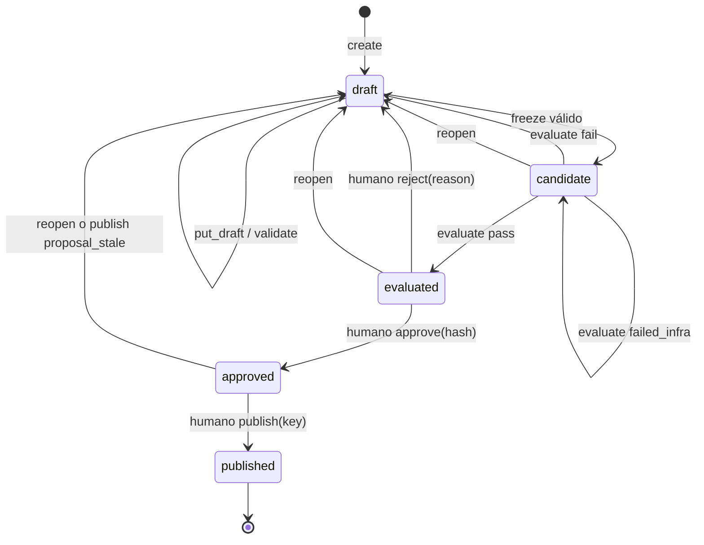

# Agent Core: contratos y alineación de Pulso

**Revisión 01-10-2026:** pin `53e729d624c8284e906249df84c1a1df84cc8d40` sustituye 98d3836. VERSION/SCHEMA_VERSION ahora dicen 0.5.0 aunque docs nuevas citan 1.0.0/1.2.0: no deducir compatibilidad por esa cadena. Fijar SHA/digests y probar paridad. V2 §29 define tanto outputs Core como Agents/Flows del sistema evolutivo, sin implementar un segundo runtime Rust.

Capacidades nuevas: serve con registry opt-in y verificador staff; knowledge read con fuente inyectada; write_draft/verify, BuilderToolExecutor, claves/get_write en métodos del servicio y cuotas auto_detect. La API HTTP no transporta todavía esas claves/readback: su matriz de recuperación sigue distinta de las tools locales. Agent.metrics/DSL y funciones de doble vara existen, pero RegistryService aún importa la EvalSuite antigua de registry.suite. No serializar registry.evaluation.suite como si fuese el wire publicado ni afirmar que ese gate reemplazó el anterior. Transferencia tiene módulos/eventos pero Agent/schema no exponen routing/accepts necesarios; mantener dependency_blocked hasta paridad y smoke. KnowledgeSnapshot por propuesta sigue REG-KNOWLEDGE; read disponible no significa publicación dinámica disponible.

Estado: referencia técnica para implementar los dobles de contrato; no integración ejecutada. Fuente fijada: [`pulso-factored/agent-core`](https://github.com/pulso-factored/agent-core/tree/53e729d624c8284e906249df84c1a1df84cc8d40), commit `53e729d624c8284e906249df84c1a1df84cc8d40`, documentación rev. 2 del registry y contratos M0 `SCHEMA_VERSION=0.5.0`, inspeccionados el 01/10/2026. Checkout de referencia: `references/agent-core`. Al actualizar el SHA se vuelven a revisar schemas, ejemplos y pruebas de compatibilidad; este documento no sigue `main` automáticamente.

## 1. Frontera y fuentes de autoridad

Agent Core posee las entidades ejecutables, las propuestas de cambio del registry, sus evaluaciones habilitantes, las aprobaciones humanas, las releases y los alias. Pulso posee detección, investigaciones, oportunidades, evidencia, memoria de automejora, planificación de cambios y evaluaciones adicionales de valor. Una propuesta Pulso puede originar una propuesta registry mediante `origin=auto_detect`, conservando la relación entre ambos identificadores. La revisión de Pulso no sustituye la evaluación ni la aprobación del registry.

Fuentes principales: `docs/specs/2026-09-29-registry-design.md` rev. 2; ADR0017, ADR0018 con su enmienda del 30/09, ADR0019; `agent_core/registry/http.py`, `models.py`, `service.py`, `candidate.py`, `suite.py`, `evaluation/report.py`, `evaluation/gate.py`, `roles.py`, `errors.py`; `agent_core/domain/json.py` y `version.py`. Para el wire observado prevalecen HTTP/modelos/código de este SHA; una diferencia con el diseño se registra, no se corrige inventando un endpoint.

| Concepto Pulso | Contrato Agent Core | Regla de integración |
|---|---|---|
| Árbol determinista | `flow` | Generar un Flow válido de M0/M1, no un schema Tree independiente |
| Agente de atención o task | `agent` con refs a capacidades | La entidad Agent identifica modo, invocación y capacidades; no es un modelo LLM por sí sola |
| Comprensión tipada Jev | `decision_model` | Jev es proveedor detrás del contrato DecisionModel; no es otra entidad |
| Prompt/modelo de generación | `prompt`, `model_profile` | Referencias exactas al publicar |
| Herramienta | `tool` | Publicar su definición no implementa el adaptador ni provisiona autoridad bancaria |
| Skill reutilizable | Sin `EntityKind.skill` | Representar con composición de entidades admitidas y metadatos propios Pulso; no enviar kind inventado |
| Política, plantilla, idioma, protección de injection | `policy`, `template`, `language_detection`, `injection_ruleset` | Respetar schemas y validación upstream; no asumir owner approval ya construido |
| Conocimiento usado en atención | `knowledge_snapshot` | Semilla importada; modificación por propuesta bloqueada en rev. 2 |
| Memoria wiki de automejora | Artefacto propio Pulso | No confundir `publish_memory` con actualización de conocimiento runtime |
| Propuesta de mejora | Pulso proposal + registry `Proposal` | Registry propuesta por `agent_id`, con cambios múltiples a entidades |
| Bundle candidato | `changes: list[EntityDraft]` + candidata congelada | No es un objeto executable Bundle enviado al registry |
| Suite habilitante | Registry `eval_suite` | Por agente; versionada, guardada como entity_version, excluida de Release.entities |
| Evaluación de valor/holdout | Artefacto propio Pulso | Gate adicional; su pase no equivale a registry EvalRun pass |
| Release ejecutable | Registry Release publicada | El registry es dueño; Pulso guarda refs y receipts |
| Shadow/canary/exposición | Sin API registry rev. 2 | Puerto de plataforma eventual y simulación propia diferenciados; no atribuir soporte existente |

## 2. Ciclo exacto y autonomía



Estados wire: `draft`, `candidate`, `evaluated`, `approved`, `published`. No enviar `validated`, `stale`, `abandoned` ni `rejected` como estado. `freeze` incluye validación. `reject`, `reopen`, evaluación fallida y rebase por `proposal_stale` invalidan candidate_hash y requieren nuevo freeze/evaluación/aprobación. `published` es terminal.

Pulso puede detectar, investigar, construir, iterar, congelar y evaluar autónomamente hasta `evaluated`. En este SHA, aprobar, **rechazar**, publicar y promover requieren principal `builder` humano con rol `aprobador`; revocar/importar requiere `admin`. Ambas clases exigen `attrs.actor="human"` y `auth.level=step_up` en credencial staff firmada. Un grant interno Pulso no levanta esta restricción. Un humano con roles `constructor` y `aprobador` puede aprobar su propia propuesta. La futura aprobación automática es una capacidad pendiente, no un comportamiento del mock compatible.

Un constructor autentica con credencial propia de principal `builder` y rol `constructor`; no hereda permisos del usuario que conversa con él. ADR0019 prohíbe al bot/supervisor builder acceder datos de clientes. Excepción ADR0006: administrador builder humano admin+step_up con scope de subject y concesión (campo,purpose); nunca prestar su credencial al bot. La exploración anonimizada de Pulso sucede en su perímetro de datos separado; no se convierte en acceso bancario del constructor runtime.

## 3. API HTTP y payloads

Base `/v1/registry`, autenticación JWS de staff; sólo builders en todas las rutas, lineage exige constructor. Customer/advisor/service rechazados aun con roles. Cada body de entidad usa los nombres de M0/M1. `EntityDraft` tiene exactamente `kind`, `content`, `docs`; `content` contiene `id` y `version` como strings. No existe `new_version` separado en el body HTTP.

`ProposalDetail.last_eval` es `EvalRun | null`: `{eval_run_id,proposal_id,candidate_hash,base_release_id,suite,verdict,report,at}`. El POST evaluate retorna EvalReport; recuperar los identificadores y bindings por GET, no agregar campos al reporte. La recuperación compara también el ID anterior: un reporte previo idéntico no demuestra una ejecución nueva.

Cambios observados en 0.5.0: `agent_step.kind=failed` con `error_kind` registra errores GatewayError del nodo agente; `GenerationResult.usage_known=false` señala uso ausente, aunque tokens/costo tengan cero de relleno. El adaptador LLMAgentPort aún pierde esa marca: costo desconocido no equivale a gratuito. M12 read y knowledge_read existen; navigate y publicación por propuesta siguen pendientes. Ver perfiles, restricciones staff y regresiones en V2 §27.5.

| Método/ruta | Body/header | Respuesta normal |
|---|---|---|
| `POST /proposals` | `{agent_id,origin:"auto_detect",title}` | 201 `Proposal` |
| `GET /proposals/{id}` | — | 200 `{proposal,changes,last_eval}` |
| `PUT /proposals/{id}/draft` | `{expected_rev,changes:[{kind,content,docs}]}` | 200 `Proposal` |
| `POST /proposals/{id}/validate` | Sin body | 200 `ValidationReport` incluso con violations |
| `POST /proposals/{id}/freeze` | Sin body | 200 `CandidateView` |
| `POST /proposals/{id}/evaluate` | `{suite_id,suite_version?}` | 200 `EvalReport`, ejecución síncrona |
| `POST /proposals/{id}/reopen` | Sin body | 200 `Proposal` |
| `POST /proposals/{id}/approve` | `{candidate_hash}` | 200 `Approval` |
| `POST /proposals/{id}/reject` | `{reason}` | 200 `Proposal` draft |
| `POST /proposals/{id}/publish` | Header `Idempotency-Key`, sin body | 200 `ReleaseDetail` |
| `POST /aliases/{agent}/{alias}` | `{release_id,reason?}` | 200 `AliasChange` |
| `POST /releases/{id}/revoke` | `{reason}` | 200 `ReleaseDetail` |
| `GET /entities/{kind}/{id:path}` | Query `version` opcional | 200 `EntityVersion`; id puede contener `/` |
| `GET /releases/{id}` | — | 200 `ReleaseDetail` |
| `GET /releases/{a}/diff/{b}` | — | 200 `ReleaseDiff` |
| `GET /runs/{id}/lineage` | — | 200 `RunLineage`, si RunReleaseReader está cableado |

No hay HTTP para listar propuestas/evaluaciones/eventos, importar/exportar o resolver por command_key. `list_versions`, import y export existen en servicio/CLI; no inventar esas rutas para el adaptador. El job asíncrono de Pulso puede envolver POST evaluate síncrono; no lo presenta como start/get evaluation upstream.

```json
{
  "expected_rev": 0,
  "changes": [
    {
      "kind": "prompt",
      "content": {"id": "p/ejemplo", "version": "1.0.1"},
      "docs": {
        "description": "Descripción de la entidad",
        "rationale": "Evidencia y razón del cambio",
        "changelog": "Diferencias frente a la versión base"
      }
    }
  ]
}
```

El ejemplo anterior muestra sólo la envoltura; `content` debe incluir los campos obligatorios del schema específico. **No es un Prompt válido completo.** PUT reemplaza toda la lista de cambios, no aplica un patch. Pulso conserva la lista completa deseada y expected_rev leído para evitar eliminar cambios propios inadvertidamente.

`Proposal={proposal_id,agent_id,origin,state,rev,base_release_id,title,created_by,candidate_hash?,updated_at}`. `origin` admite `manual|builder_chat|auto_detect|import`. `CandidateView={proposal_id,candidate_hash,release_id_preview,new_versions,auto_bumped}`. `ValidationReport={violations,candidate_hash,auto_bumped}`. `VersionRef={kind,id,version}`; `VersionDocs={description,rationale,changelog}`. Description 1–4000 chars, rationale ≤4000, changelog ≤8000. Modelos registry estrictos y frozen; envolturas HTTP no declaran extra=forbid, pero Pulso nunca depende de que ignoren extras.

Errores `application/problem+json`: `{type:"urn:agentcore:registry:<code>",title,status,code,detail,trace_id}`; validation_failed añade `violations`, otros errores con información añaden `payload`. No usar ProblemCode de M0 para interpretar códigos registry.

| Código | HTTP | Comportamiento relevante |
|---|---|---|
| `validation_failed` | 422 | Freeze inválido mantiene draft; validate devuelve reporte200 en código |
| `gate_failed` | 409 | Evaluación fail devuelve EvalReport en payload y vuelve draft |
| `proposal_stale` | 409 | expected_rev viejo; o staging distinto de base al publicar |
| `candidate_changed` | 409 | Hash distinto o candidata ya no válida al reconstruir |
| `illegal_transition` | 409 | Estado/alias/operación no permitidos; reutilización de publish key en otra propuesta |
| `forbidden_role` | 403 | Tipo no builder, rol insuficiente o actor no humano para decisión |
| `step_up_required` | 403 | Builder humano aprobador/admin sin autenticación reforzada |
| `not_found` | 404 | Objeto inexistente o lineage sin lector de runs |
| `integrity_error` | 500 | Hash corrupto; nunca servir contenido |
| `credentials_invalid` | 401 | Autenticación inválida (M9) |

## 4. Hashes, semver y publicación

`content_hash=SHA256(canonical_bytes(entidad.model_dump(mode="json",by_alias=True)))`. VersionDocs queda fuera del hash de contenido. Usar codec canónico upstream: no suponer que stringify de Rust/JavaScript produce exactamente los mismos bytes.

`release_hash=SHA256(canonical_bytes(Release excluyendo id y status))`.

Código de candidata: `candidate_hash=SHA256(canonical_bytes({"release_hash":release_hash,"versions":sorted([[str(VersionRef),content_hash],…])}))`, donde `str(ref)="kind:id@version"`. Incluye las suites incluidas en el borrador, aunque no entren en la Release. `release_id="rel-"+candidate_hash[:16]`. Una suite ya publicada elegida al evaluar se fija mediante EvalRun.suite y **no se añade retroactivamente al candidate_hash**; Pulso debe fijar suite_version y conservar ref/hash de evaluación.

Cada entidad tiene semver exacto numérico `major.minor.patch`; el borrador puede referenciar rangos y freeze los fija a exactos. Quien propone elige la versión, mayor que base para entidades existentes. Una entidad inicial puede comenzar en cualquier semver válido. Cambios de dependencias exactas provocan bump patch automático en cascada hasta punto fijo; CandidateView informa auto_bumped. No se recomputa esa cascada con reglas distintas en Pulso.

Freeze construye SnapshotRegistry en memoria; draft/candidate nunca aparecen como entity_versions publicadas. Publish es transacción que verifica base staging, reconstruye hash, exige aprobación vigente, inserta versiones/releases y mueve staging. Un run fija su release al comenzar. Promover a prod es otra operación humana; sólo admite alias staging/prod y release active del agent_id. Volver a una release anterior se hace con promote, sin gate nuevo. Revoke no admite la release apuntada por prod: promover una segura antes; promote requiere aprobador humano step_up; revoke admin humano step_up. No existe ACK de activación por cohortes en este contrato.

## 5. Idempotencia, concurrencia y recuperación

En la superficie HTTP del registry sólo publish acepta Idempotency-Key (máximo255 caracteres). Misma key/misma propuesta retorna la misma release; misma key/otra propuesta falla illegal_transition. HTTP no expone key para create, draft, freeze, evaluate, approve, reject, promote o revoke. Los métodos del servicio y BuilderToolExecutor sí ofrecen key/get_write para operaciones de borrador soportadas: no extrapolar la limitación HTTP al servicio local.

PUT usa CAS expected_rev: si respuesta se pierde, reenviar recibe proposal_stale después de que el primer intento haya tenido éxito. Pulso lee la propuesta y compara su lista íntegra/revisión antes de decidir otro PUT. Create con respuesta desconocida no puede reconciliarse mediante lista o client key inexistentes: registrar unknown, bloquear reintento automático ciego y permitir reconciliación puntual. Esta limitación no debe ocultarse en un mock que deduplica todas las rutas.

Pulso serializa evaluación por proposal_id/candidate_hash mediante su cola. El registry ejecuta evaluación fuera de la transacción y vuelve a comprobar estado/hash; dos solicitudes concurrentes pueden duplicar trabajo. Publish toma lock por agente y staging. Si staging cambió, devuelve proposal_stale **después de actualizar** base a staging vigente, volver draft, limpiar hash y subir rev; Pulso vuelve a freeze/evaluate/aprobación. Promote no tiene expected_active_head ni CAS público; timeout no autoriza a inventar un ack o retry idempotente.

## 6. Evaluación habilitante y sandbox

Suite por agente `EvalSuite={id,version,agent_id,repetitions,noise_margin,floor,scenarios}`. Repetitions1–10 (default3), scenarios1–200, steps1–50, IDs de escenario únicos; margen/piso Decimal entre0y1. Cada escenario empieza con un único start.

```yaml
id: ejemplo-suite
version: 1.0.0
agent_id: soporte
repetitions: 3
noise_margin: 0.05
floor: 0.70
scenarios:
  - id: caso-sintetico
    principal: {id: synthetic-customer-1, attrs: {country: CO}}
    steps:
      - {op: start}
      - {op: turn, text: "Necesito revisar un cargo", auth: step_up}
      - {op: confirm, answer: "yes"}
    seed:
      tools:
        buscar_transacciones:
          - {status: ok, result: []}
    sensitive_values: []
    expect: {outcome: escalated, actions_verified: [], escalated: true}
```

El outcome `escalated` existe en `agent_core/domain/outcomes.py`; el ejemplo ilustra el formato y requiere un agente/flow concreto para convertirse en prueba de comportamiento. Steps admiten op start/turn/confirm, text opcional, answer yes/no, lang opcional y auth anonymous/session/step_up. ToolReply tiene status del enum ToolStatus, result JSON y error opcional. Expect tiene outcome opcional, actions_verified y escalated opcional. Datos de suite/seed deben ser sintéticos: sintetizar casos derivados de patrones del dataset, conservar evidencia de origen separada y no copiar PII histórica.

ScenarioEvaluator corre base/candidata con la misma suite fijada, sandbox separado por corrida y seed igual. Califica expect desde eventos. Guardrails candidata ≤base (sin base≤0); primary proporción de runs que cumplen expect ≥base−noise_margin (sin base≥floor). **Pass admite degradación dentro del margen, no demuestra mejora económica**. Gate Pulso de valor/seguridad/holdout sigue siendo adicional. Juez LLM sólo notas; no influye verdict.

`EvalReport={verdict:pass|fail|failed_infra,checks,candidate?,base?,results,judge_notes,detail?}`. MetricCheck tiene name/value/base?/threshold?/passed; SuiteMetrics primary/guardrails/runs; ScenarioResult scenario_id/label candidate|base/repetition/score. Decimales conservan serialización del codec M0 en fixtures. Una falla gateway/sandbox/timeout invalida toda evaluación como failed_infra, mantiene candidate y no permite aprobar.

`SandboxPort.provision(seed,target)→handle`, `tools(handle)→ToolExecutor`, `teardown(handle)`. ToolExecutor exige `is_sandbox=True`. LocalSandbox actual usa respuestas en memoria; no demuestra acciones contra servicios realistas. Pulso puede implementar sandbox con dependencias locales reales mediante este puerto, conservando aislamiento por corrida y sin credenciales/endpoints de producción. serve ya ofrece raíz de composición; los adapters específicos de tools, identidad, conocimiento y laboratorio de Pulso requieren cableado y pruebas.

## 7. Matriz de compatibilidad del doble

El doble implementa los cuerpos/respuestas, estados, códigos y restricciones anteriores. No necesita copiar el almacenamiento interno del registry; no comparte tablas reg_* con Pulso. Fixtures se extraen del SHA y se versionan con su provenance. Una validación sólo JSON no demuestra G0: se distinguen pruebas de wire, máquina de estados y validación semántica, y no se etiqueta compilable una entidad sin pasar el validador upstream fijado.

| Prueba requerida | Resultado verificable |
|---|---|
| Golden request/response de cada ruta | Formato exacto, Decimal, slash en id, null/defaults y tipos |
| Bot builder con rol aprobador intenta decisión | 403; no aplica a builder humano aprobador con step_up válido |
| PUT respuesta perdida y retry | CAS stale; comparación/readback recupera sin duplicar cambios |
| Freeze inválido / validate inválido | Freeze422 mantiene draft; validate200 con violations |
| Eval pass/fail/infra | evaluated/draft/candidate respectivamente; fail payload contiene reporte |
| Reopen/reject | Hash invalidado, rev+1, evaluación/aprobación previa no habilita publish |
| Base staging cambió | Publish409 y draft con base nueva; iteración completa otra vez |
| Publish repetido | Misma key devuelve misma release; key otra propuesta409 |
| Promote/revoke | Builder humano step_up; promote aprobador, revoke admin; active/agent correcto; prod impide revoke |
| Hashes canónicos/cascada | Coinciden con golden upstream; suite draft influye candidate hash |
| Runtime lectura | Nunca ve draft/candidate; release fija por run |
| Conocimiento/skill no soportados | REG-KNOWLEDGE/kind desconocido; ningún éxito ficticio |
| Evaluate timeout/unknown | No inventa pass, evaluación parcial ni activación |
| Sandbox | Base/candidate seed igual, aislamiento por run, is_sandbox verificado |
| Compatibilidad al actualizar SHA | Diff de schema/API + revisión explícita antes de sustituir fixtures |

## 8. Diferencias documentales y capacidades pendientes

| Fuente | Diferencia encontrada | Interpretación vigente |
|---|---|---|
| ADR0017 | Dice esquema registry; rev2/código usa reg_* en search_path | Usar código rev2, sin dependencia a tablas internas |
| ADR0018 cuerpo antiguo | Estados validated/rejected/stale, evaluación por entidad y autoaprobación abierta | Enmienda30/09 y rev2 prevalecen |
| ADR0019 contexto | Dice registry sólo spec y nodo agent rechazado | Contexto histórico; encabezado/código actualizado indica node read-only implementado, write_draft implementado hasta BuilderToolExecutor, constructor publicado pendiente |
| Registry §7.4 | validate con violaciones422 | Código devuelve200 ValidationReport; freeze sí422 |
| Registry §7.2 | ProposalDetail con violations/candidate | Código sólo proposal/changes/last_eval; obtener validate/freeze receipts por operaciones respectivas |
| Registry §3.4 | Toda versión existente se rechaza | Código admite ref ya publicada de contenido idéntico en construcción; mantener regla >base y detectar conflictos reales |
| Registry §18 | «Nada construido» y forbidden_role pendiente | Intro actualizada y código ya cubren parte; no heredar la frase vieja |

Pendientes upstream: canary/exposición y porcentajes; costo por propuesta; secret scanner y ReDoS; aprobación owner de políticas; knowledge navigate/publicación por propuesta; cuatro ojos; aprobación automática; evaluación asíncrona; scopes finos de lineage; spans OTel registry; readback/idempotencia HTTP del constructor; cableado productivo específico de Pulso y sus agentes constructores. `LLMAgentPort` read/compute sí existe en este SHA, no se lista como pendiente. Puertos futuros pueden quedar unsupported/blocked; demo compatible llega a evaluated, aprobación humana y publicación/promoción rev2.

La afirmación upstream de tests en verde no es verificación local de Pulso: esta consolidación inspeccionó fuentes, sin ejecutar su suite. La bitácora debe distinguir fixtures revisados, validación de schemas, tests del doble, tests contra Agent Core y conexión desplegada.
