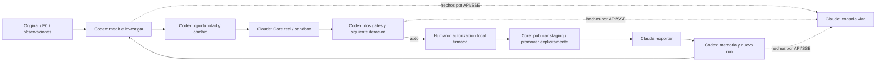
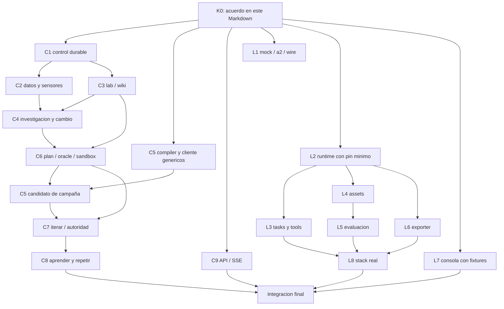

# Pulso — propuesta de sprint independiente Codex + Claude

**Estado: propuesta para aprobación; no autoriza implementación, merges ni despliegues.**

**Referencia:** `TECH_SPEC_PULSO_AUTOMEJORA_V3.md`, especialmente §§16–21, 24–31, y `DECISIONES_ABIERTAS_V3_AGENT_CORE.md`.

**Objetivos, en este orden:** (1) demostrar el motor autónomo completo, visible y sorprendente, con ejecución real y evidencia; (2) completar progresivamente el spec sin reconstruir el producto después de la demo.

**Baselines del corte:** engine `3f719473048b768d2bcc02d17913b78a7be33972`; infra `8aff5a165207c28165e4736f6ab95789a7d0af70`; Agent Core `86a767474042a566a0dbd6ed23588959f27ebdb3`, contrato `1.3.0`. Main del engine fue restaurado por PR #73; su workflow `37093006851` terminó verde. Esta planificación inspecciona código y contratos: no constituye una nueva ejecución del E2E.

## 1. La decisión de reparto

**Codex construye el cerebro y el control durable del motor. Claude construye su conexión ejecutable con Core y su experiencia visual.**

No dividiremos «primera mitad del flujo» y «segunda mitad del flujo»: investigación necesita Core desde el comienzo, y evaluación necesita las evidencias del motor. Esa partición produce bloqueos circulares y cambios simultáneos en los mismos módulos Rust.

La frontera propuesta es tecnológica y contractual, con entregas funcionales completas dentro de cada equipo:

| Equipo | Responsabilidad exclusiva | Resultado que entrega |
|---|---|---|
| **Codex** | Todo el motor Rust: datos, jobs, investigación, gates, compiler/cliente Core, evaluación Pulso, memoria, API/SSE, broker y telemetría del motor | Servicio que descubre, propone, compara y aprende; expone hechos durables y consume HTTP versionado de Core |
| **Claude** | Integración Python con Agent Core: composición, bridge, siete fábricas, assets, harness, exporter, mocks/paridad; consola web y Terraform | Core ejecutable bajo contratos exactos, evidencias de paridad, UI conectable y entorno de integración reproducible |

Claude **no implementa otro Agent Core ni un gateway**. `pulso-core-runtime` compone el paquete upstream fijado con adaptadores nuestros, tal como D-1–D-3 de V3. Codex no importa Python ni consulta PostgreSQL de Core. Claude no consulta PostgreSQL de Pulso ni implementa reducers del motor en JavaScript.

Ambos equipos acuerdan **los contratos documentados en este mismo Markdown** antes de separarse. No se exige un repositorio, paquete contractual, commit ni suite compartida en GitHub para arrancar. Cada equipo implementa sus DTOs, fixtures y pruebas desde esta referencia dentro de su trabajo; esas implementaciones se contrastan al integrar. La primera ejecución conjunta seguirá siendo un gate: un acuerdo documental permite trabajar independientemente, pero no demuestra compatibilidad ejecutada.

## 2. Qué significa aquí la «demo mágica»

La magia no consiste en animar un resultado precargado. Consiste en ver al sistema hacer trabajo que antes requería una persona:

1. Un snapshot original, E0 o un lote de observaciones despierta el motor; nadie elige la categoría ganadora.
2. Aparecen familias de señales medidas, candidatos descartados y la investigación en curso.
3. Un scout usa SQL/wiki de forma adaptativa; un verificador separado contradice o sostiene sus hipótesis.
4. Se prioriza una oportunidad con población, mecanismo, incertidumbre y alternativas, incluido `do_nothing`.
5. Se ve el cambio concreto: entidades Core, versiones, consumidor afectado, cascada y diff.
6. Se ejecutan escenarios sobre base y candidato. Dos gates distintos explican si el cambio es válido y si mejora el mecanismo medido.
7. Un fracaso provoca una revisión automática acotada, no desaparece ni se convierte en un «pass» visual.
8. El humano sólo aparece cuando se necesita una decisión de autoridad. Su aprobación fija operación/hash; no equivale a publicación.
9. Se confirma staging; exposición requiere el alias/receipt pertinente, no un selector ficticio de canary.
10. Llegan observaciones nuevas; el motor publica o contradice memoria y comienza otra investigación automáticamente.



**La consola es un producto real de ingeniería**, no una presentación ni la UI completa de atención F7/F8. Tiene navegación, grafos, drawers, filtros, comparación, streaming y controles autorizados. No construimos chat bancario, oficina de agentes, CRM ni constructor de atención para poder demostrar el motor. Una vista visual de las primitivas del motor no significa implementar la plataforma vecina.

La corrida principal puede encontrar otro problema que quejas. Se exige descubrimiento no dirigido y al menos un cambio relevante evaluable; un resultado negativo correcto acredita seguridad, **no** el caso positivo de la demo. `mechanism_proxy` permite demostrar una mejora sandbox de un mecanismo, no reducción causal del SLA del CSV ni ahorro bancario observado.

## 3. Lo que reutilizamos y lo que todavía falta

| Fase | Base realmente disponible en main | Trabajo de cierre para V3 |
|---|---|---|
| P0 | Workspace, CI, manifests/adapters, migraciones, contratos de artefactos y Compose PG/S3 | Bootstrap de servicios, orden de migración verificado, contratos fuente completos y stack Core 1.3.0 |
| P1 | Reducers/puertos de jobs/cuotas, ledger PG, lab limitado, receipts, observaciones U29 | Worker/scheduler durable conectado, bridge/tasks/modelos reales, lab adaptable aislado, HTTP/SSE y trazas correlacionadas |
| P2 | Sensores/Scout/verifier, admisión sellada, bridge de mecanismo; simulación original/E0 | Selección multifamilia no dirigida, investigación real, contraevidencia, portafolio y propuesta executable ligada al hallazgo |
| P3 | Compiler Add+Flow, writer en memoria, admission nativa, plan/oracle y sandbox local | Wire/hash 1.3.0, replace/kinds autorizados/cascada, registry real, escenarios/suite, ejecución de ambos brazos y CombinedGate |
| P4 | Wiki/CAS/revocación y composición Frozen de dos runs, **in-memory** | Publicación/uso durable, intervención humana acotada, release confirmada, observación→trigger→segunda corrida con memoria |
| P5 | CI Windows/Ubuntu/PG, docs/journal; foundation Terraform | Consola/API real, OTel/alertas, reproducción limpia, carga/fallos/restore, manifest y despliegue manual autorizado |

Tres discrepancias que impiden simplemente «enchufar lo existente»:

- `crates/core/src/core_task.rs` aún fija el contrato Core `0.5.0` y SHA anterior. La V3 exige `1.3.0`/`86a7674`.
- `change_compiler.rs` acepta básicamente Add+Flow. No satisface reemplazos, Policy/EvalSuite, normalización JCS ni cascada de V3.
- `native_evaluation.rs` admite una evaluación; no la ejecuta. El CLI llama `run_local_simulation`, con propuestas no ejecutables y ruta formal `do_nothing`.

La lab actual es SQLite con consultas limitadas. Para el lab adaptativo de V3 se propone DuckDB aislada **como única DB de análisis por sesión**, sin añadir SQLite como segundo motor. Migrar ese adapter necesita regresiones; no rehacer por ello el control PostgreSQL.

El mapa previo `STATUS_VS_TECH_SPEC_2026-10-02.md` es histórico: su main rojo y las ramas #69/#71 fuera de main ya fueron corregidos. No usar esos estados como pendientes actuales. Sus observaciones funcionales se revalidan contra este baseline y V3.

### 3.1 Exclusión de trabajo no entregado

No se reutiliza ni se reasigna el trabajo sin commit/push como si fuera disponible. Tampoco se excluye una feature sólo porque esté parcialmente implementada: **las partes faltantes de código ya publicado sí están en este plan**.

En el inventario se encontraron parches de código sin commit en:

| Worktree / rama | Área reservada fuera del reparto | Regla |
|---|---|---|
| `improvement-engine-u12-u13-runner-compose` / `feat/p2-u12-u13-e0-runner-compose` | Composición local U12-E→U13-E en runner; modificaciones de core, source adapters, tests y lockfile | No copiar su diff, no prometerlo como dependencia y no lanzar otro agente para terminar ese mismo parche |
| `improvement-engine-u13a-verified-candidate-admission` | Ajustes de Scout/admisión y tests, journal local sin seguimiento | Misma reserva; distinguir la admisión que ya existe en main del parche WIP |

El inventario exacto está en el anexo A. La reserva es del **delta WIP y su caso de uso**, no de todo `crates/core` para siempre. La composición CLI **simulada** U12-E→U13-E y su salida `u12_e_u13_e` quedan fuera. La ruta del sprint es distinta: worker durable→task Core real→receipts reales→investigación→candidato; no depende de extender ese CLI ni de sus helpers privados. Conserva/adapta los boundaries ya publicados en main, sin copiar el parche. C1–C10 son despachables tras K0 bajo esta separación. Si una implementación necesita precisamente ese delta, queda `reserved_wip`; se toma el siguiente paquete independiente o se solicita entrega previa publicada/verificada. No reconstruir el mismo parche bajo otro nombre.

No se limpiaron worktrees, no se hicieron resets ni se publicaron esos parches. No se comparte una rama antigua como base del sprint.

## 4. Acuerdo documental: la frontera entre los equipos

Este documento es el contrato de trabajo. **K0 significa la revisión acordada de este Markdown**, no un paquete por construir en GitHub. Ambos equipos reciben la misma versión del plan y del spec V3, confirman las fronteras descritas aquí y comienzan sus implementaciones independientes. Los schemas/tests que necesite cada equipo son parte de su entrega, no un requisito previo ni otra fuente normativa.

**K0 propuesto: `pulso-two-teams-1`.** Sus baselines son los de la cabecera; sus operaciones, permisos, estados, ownership y casos obligatorios están en §§4–8 y anexo D. El comienzo requiere acuerdo de ambos equipos sobre esta revisión, **no publicar contratos en GitHub**. Codex y Claude construyen servidores/clientes fixture independientes en sus áreas, sin depender de que el otro termine primero. Los tests de conformidad se ejecutan durante el desarrollo y en la integración, no se confunden con la aprobación del plan. Un vacío que afecte una frontera se resuelve en este documento antes de asignar ese caso; un detalle interno no requiere acuerdo entre equipos.

| Contrato a sellar | Productor / consumidor | Qué tiene que quedar inequívoco |
|---|---|---|
| Registry upstream | Claude compone Core / Codex cliente | Schemas derivados y copiados del pin; bodies exactos, estados, errores, hashes, versiones, límites; no añadir campos Pulso |
| CAP-33 bridge | Claude / Codex | Invocation, receipt, allowed facts por stage, alias, dry-run y version; synchronous HTTP ≠ job durable; pin exacto y matriz unknown |
| Binding callback | Claude / Codex API | Comando preparado, tenant/job/stage/attempt/key/digest/core_run_id; repetición idéntica aceptada, conflicto denegado; sin binding cero efectos nuevos |
| Broker lab/wiki/grant | Codex / executors Claude | Sesión/extracto, operaciones scratch y wiki, auth/contexto, límites, lectura de resultados/receipts y revocación; sin acceso Python al socket Podman ni a CSV |
| Observaciones | Exporter Claude / ingesta Codex | Batch schema, cursor por partición, seq por run, dedupe, ACK tras persistencia, disponibilidad temporal, origen audit/registry/outbox y exclusión eval |
| Evaluación | Codex plan / harness Claude / Codex gate | Oracle/split/manifest por ref, sandbox por brazo, FIFO nativo vs stateful complementario, results/guardrails, costo y estados fail/infra/unknown |
| Banco sandbox complementario | Codex banco / ejecutor Core Claude | `EvaluationSandboxPort`: abrir/reset, acción tipada, readback/reconcile y cierre; namespace por campaign/case/arm/repetition y grants, no sólo un manifest |
| Identidad humana | Emisor local Claude / command dispatcher Codex | Ticket target/hash/operación/TTL, firma en memoria, step-up, separación bot/humano, reautenticación, cero tokens en persistencia |
| Product/debug API | Codex / consola Claude | DTOs, autorización, URL/cursores, SSE, status lookup, errors, notas tratadas y comandos; desconocido null+reason, no cero |
| Arranque/imagen/manifest | Ambos / integrador Codex | Env por nombre (sin valores), red/puertos/health, digests, release de assets, capacidades disponibles y `target/runtime_profile/doubles[]` |

Cada uno necesita ejemplo positivo y negativos, no sólo JSON de camino feliz. La suite mínima cubre versión incorrecta, contexto cruzado, timeout después del efecto, salida inválida y ausencia de autoridad. Ambos pueden ejecutarla sin código del otro equipo: servidores/consumidores de fixture conformes, sin compartir los algoritmos del productor real.

### 4.0 Dependencias iniciales: acuerdo y disponibilidad, por equipo

**Autocontenido no significa sin dependencias:** significa que las únicas dependencias iniciales son bases existentes, herramientas externas y este acuerdo; las dependencias hacia el otro equipo se sustituyen localmente durante el sprint. No hay una flecha `C pendiente→L arranque` ni `L pendiente→C arranque`. Las únicas flechas cruzadas de implementación terminan en H4.

| Dependencia de inicio | Codex | Claude | Estado al preparar este plan / resolución |
|---|---|---|---|
| Base de código publicada | Engine main SHA cabecera | Engine + infra main SHA cabecera | Disponibles; worktrees nuevos desde esas bases, sin WIP reservado |
| Contrato funcional/técnico | Este plan y V3 | Las mismas copias | Propuesto para acuerdo; al aprobarlo ambos registran revisión, no necesitan publicar contratos |
| Agent Core1.3.0 | Código/schema del pin como referencia de consumidor | Paquete/check-out del pin para composición | Pin/local referencia inspeccionados; cada equipo verifica SHA antes de usar, no espera nueva entrega upstream |
| Toolchains | Rust1.98.1/Git/PowerShell; contenedores PG/S3/lab | Python/Core/Git/Node; PG16/Podman; Terraform sólo L9 | Host consultado: Git2.55, Rust1.98.1, Python3.13.4, Node22.16, Podman6.1.1. Version CLI no acredita lock/dependencias/build de Core; cada equipo prepara su entorno desde pin/locks |
| Contenedores locales | Máquina Codex propia por registrar, namespace motor + dobles Core | Máquina `pulso-dev` registrada por Claude, namespace Core + dobles motor + consola | Ownership aceptado en CL-0001/CX-0003; no usar la VM Claude desde Codex. Estado running previo no acredita readiness del stack. Cada equipo verifica su máquina/recursos/puertos; no compartir DB/volúmenes |
| Datos originales/E0 | Inventario/manifest/corte y fuentes locales existentes | Fixtures tratados y escenarios propios; datos locales sólo si su test los requiere | No espera un extract nuevo de Codex. Cada equipo genera fixtures desde contrato; no modifica CSV original ni usa expected labels para dirigir descubrimiento |
| Callbacks/broker/API | Los implementa; usa su Core fixture | Construye sustitutos locales desde anexo D | Parte del propio sprint, no dependencias bloqueantes hacia otro equipo |
| Runtime/issuer/runner/exporter | Construye sustitutos locales desde anexo D | Los implementa | Parte del propio sprint; Codex no espera L1/L2 para comenzar |
| Modelos/keys/budget | Test fixture/recorded disponible por construcción; live al integrar | Puede hacer smoke Core real si ya tiene keys/budget autorizado | Disponibilidad de secretos/budget no verificada aquí. No bloquea desarrollo; sí bloquea claim demo live. Cada equipo usa su configuración, nunca keys en el documento |
| Identidad/clave de integración | Emite servicio A y configura públicos B sólo al ensamblar | Emite servicio B/humano local y configura públicos A sólo al ensamblar | Ambos generan claves locales independientes para sus dobles. Intercambian únicamente configuración pública/manifests en H4, nunca esperan compartir privados para arrancar |
| Terraform | No requisito motor local | Requisito sólo frente infra L9 | CL-0001 informa Terraform1.16.4 disponible para Claude. Codex no lo resuelve en su propio contexto PowerShell ni en recheck escalado; diferencia de PATH/contexto, no evidencia de ausencia en toda la máquina. Solicitar path absoluto/comando para reproducibilidad; no reinstalar ni bloquear runtime/UI |
| AWS/IdP/apply | Sin necesidad para demo local | Plan/runbook sin apply; remoto sujeto a permisos/inputs | No usar dependencia AWS como requisito de la separación local |

**Cierre de readiness:** cada orquestador confirma base/worktree, copia del acuerdo, toolchains/locks, namespace/recursos y comandos propios de bootstrap. Si un requisito externo falta, registra el blocker y continúa sus paquetes fixture/data/docs independientes. No instala ni cambia ambiente del otro. El límite de recursos de la misma máquina no convierte dos stacks en uno compartido; se puede ejecutar pruebas pesadas por turnos sin introducir una dependencia de código entre equipos.

**Arranque simultáneo acordado:** Codex abre C1 control, C2 adaptadores/sensores genéricos, C3 broker y C5/C9 genéricos dentro de sus slots. Claude abre L2 runtime/seed, L1 wire/mocks, L7 consola y L3 adapters genéricos dentro de los suyos. Las dependencias internas de aceptación se mantienen; empezar un componente con fixtures no equivale a cerrar el caso real. No se necesita completar todo un lado para que el otro comience.

### 4.1 Superficies ya fijadas por V3

| Host lógico | Ruta | Owner de implementación |
|---|---|---|
| Core compuesto | `POST /internal/v1/core-tasks/invoke` | Claude; Codex cliente/ledger |
| Core compuesto | `GET /internal/v1/core-tasks/{core_run_id}` | Claude; Codex consume facts tratados |
| Core compuesto | `GET /internal/v1/core-state/aliases/{agent_id}/{alias}` | Claude; Codex verifica base/exposición |
| Core compuesto | `POST /internal/v1/core-authoring/dry-run` | Claude L2; Codex compiler/L1 |
| Core compuesto | `POST /internal/v1/core-credentials/issue` | Claude bot issuer; Codex in-memory consumer; CAP04/33 exact DTO |
| Core compuesto | `GET /internal/v1/version` | Claude; Codex probe |
| Control API Pulso | `POST /internal/v1/core-task-bindings` | Codex; Claude callback |
| Control API Pulso | `POST /internal/v1/platform/observations` | Codex; Claude exporter |

Registry conserva las rutas exactas del pin. Producto usa `/api/v1/evolution`; debug `/internal/v1/debug`. No renombrar endpoints al integrar ni confundir hosts con rutas de nombre parecido.

**Transporte Pulso de broker/wiki/grant:** las rutas y DTOs privados se fijan en anexo D como API interna Pulso, nunca upstream Core. El contexto se obtiene de credenciales y binding; SQL o argumentos de tool no pueden elegir tenant/grant/lease. Codex construye broker/validación; Claude sólo su cliente y despacho. Un callback de autorización fallido deniega queries, modelos y writes; no hay autorización inferida del texto del prompt.

**Facts por stage:** anexo D.2 fija nombres `save_as`, campos, whitelist y evidencia requerida para scout/verifier/builder. Un `completed` sin fact esperado falla. Un fact LLM nunca se admite directamente como señal corroborada. `RunState`, slots, transcript crudo y chain-of-thought privado no son outputs del bridge.

### 4.2 Un solo writer y una ejecución contrafactual definida

**Camino elegido para la demo:** builder LLM propone `ChangeSpec` sin tools mutantes→Codex sella baseline/plan, compila y valida DraftPlan→Codex crea comando/grant ligado al digest de ese payload→Claude ejecuta un **writer Flow** acotado mediante `BuilderToolExecutor`→Codex valida/persiste receipts. `create_proposal` ocurre una vez dentro de ese writer. Antes de avanzar al siguiente tool, su efecto e identidad se confirman en el ledger durable de Core mediante `get_write`; no se promete un callback Pulso por operación que aún no existe. Pulso adopta los receipts al terminar o al reconciliar una task incierta, verificando proposal ID/rev/hash y cada operación contra el commitment original. Una falta de readback detiene el writer y deja `unknown`, no reejecuta create. Cada tool write tiene clave propia derivada del comando; el modelo no cambia el payload durante el dispatch.

RegistryMutationExecutionMode is a versioned Pulso setting: demo=native_builder_flow; registry_http_contract runs in a separate campaign/namespace. Under CL-0002/CX-0006, Claude's authorised constructor owns create/put/validate/freeze/evaluate and Codex owns commitment, admission, capture and independent improvement judgement. No Rust evaluate for the same candidate/attempt and no mutable HTTP fallback after a task failure. Approve/publish/promote/revoke remain separately authorised human operations. The HTTP conformance campaign does not inherit BuilderToolExecutor idempotency.

Each write has the exact command-derived key in §16.16.1: the executor translates Core action_id to that key and translates registry/get_write readback consistently; a contextual IdSource is equivalent only if it produces the identical observable keys. Evaluate uses its explicitly bounded evaluation-context key. Model arguments cannot select or change the key, ordinal, stage or committed payload. The earlier general command-derived-key sentence is shorthand for this agreed rule, not a second formula.

RegistryMutationCommitment declares evaluate_enabled and evaluation_context_ref; when enabled the admission already exists with state=admitted. With evaluate_enabled=false the constructor stops after confirmed freeze. A later evaluate-only invocation uses a new admitted bounded commitment for that same candidate/hash/base/suite and denies create/put/reopen/freeze at the executor, not merely in prompts. This is not a fallback or replacement key for an uncertain prior attempt. Claude checks admission in-process, captures full manifest/report including failures, and Codex verifies commitments before applying its independent gate. Evaluate is synchronous: invoke/job/client deadlines must cover the configured maximum campaign duration (jobs × measured p95 plus margin); before calibration use the conservative configured upper bound. Deadline exhaustion is unknown and requires reconciliation, never evidence of pass.

**Banco y ejecutor para medir mejora:** Codex opera banco stateful y oracle/campaña pareada; Claude ejecuta **Core real** sobre las releases exactas de ambos brazos, con ToolExecutor que habla con `EvaluationSandboxPort`. Dos perfiles: `evolution_task` (principal builder, construcción simulada aislada del registry operativo) y `attention_stateful_complementary` (principal customer sintético y fixtures de política/identidad). Claude no implementa un intérprete propio de Flow. La campaña complementaria no se rotula gate nativo CAP-41: éste conserva FIFO bajo D-7.

**Target de ejecución antes de publicar:** la base usa `published_release`; el candidato usa `frozen_candidate` con proposal ID/rev, base release, candidate hash y DraftPlan digest. El bridge Claude materializa el candidato in-process con `build_candidate` del pin (`agent_id,base:Release,base_entities,drafts,published_hash`), obteniendo la release/entidades completas y la función de hashes desde su store Core, no reconstruyéndolas del ReleaseDetail público incompleto. Ejecuta el `EvalTarget{label,release,registry}` aislado con Core real. Comprueba hash/base/draft/suite y closure contra el snapshot congelado antes de ejecutarlo. No intenta buscarlo como release publicada ni lo publica/importa al registry operativo para hacerlo evaluable. Mismatch/stale/missing closure son fallo de preparación, no evidencia de mejora ni fallback a base. Cada reporte distingue ambos tipos de target y sus digests. Un test demuestra que la candidata no publicada corre en evaluación pero no puede ser invocada por atención desde el registry operativo.

**El oracle no se entrega al agente evaluado:** `oracle_ref` es correlación opaca para el juez Codex, no capacidad de lectura. Runner/modelos reciben mensajes, estado y tools autorizados, nunca predicados gold ni final granular. FinalLocked usa principal/namespace de evaluación aislado; Codex adjudica y publica sólo el agregado autorizado. Tests canario buscan ausencia del gold en input_view, facts, tools, receipts, exporter, OTel y UI del builder.

K0 fija para el banco privado: open/reset con seed+manifest digest y receipt de estado inicial; execute de acción tipada con expected revision+Idempotency-Key; readback/status y reconcile de unknown; close sin borrar evidencia. Identidad/grant/contexto de `(tenant,campaign,case,arm,repetition)` provienen del principal autorizado, no del texto del agente. Se prueban misma key/otro payload, timeout tras efecto, reset entre brazos y denegación cross-arm. El reporte de cada brazo cita target/caso/seed/estado inicial, eventos/efectos, oracle_ref y costos/unknown; Codex calcula el gate, no Claude. El mundo contiene tools/mecanismos generales antes del candidato; no contiene la señal que se espera que gane.

**Acuerdo estable:** ambos registran `contract_revision=pulso-two-teams-1` y la revisión/digest del Markdown que recibieron en su entrega. No amplían campos obligatorios ni cambian semántica de errores durante el sprint. Un cambio incompatible se propone como revisión documental sucesora y bloquea sólo ese caso; se continúa con trabajo independiente. Si se decide incorporarlo durante el sprint, ambos acuerdan explícitamente la nueva revisión; no se cambia silenciosamente. El digest identifica la copia, no obliga a almacenar el contrato en GitHub.

## 5. Ownership de código y archivos compartidos

Los paths nuevos son una organización propuesta; no suponen que esos módulos ya existan. Evitar un refactor masivo de las piezas estables para «ordenarlas».

| Área en `improvement-engine` | Owner único | Regla de entrega |
|---|---|---|
| `crates/core`, `source-adapters`, `runner`; nuevos app/worker/control-api/adapters Rust | Codex | Preservar tests/invariantes; no incorporar deltas WIP reservados |
| `migrations/`, contratos internos de datos/jobs/config/memoria/product/debug | Codex | Runner/orden explícito; no renombrar migraciones históricas ni añadir tablas por pantalla |
| DTO/client HTTP/hash/compiler Rust Core y `contracts/agent_core/pin.json` | Codex | Consume golden vectors/schemas del pin, no implementa G0 entero |
| `core-bridge/` Python, dependencias/lock Python, Dockerfile Core/exporter | Claude | Composición del pin; own factories, no `testing.*` presentado como real |
| `agent-core-assets/` y generador Python de schemas/golden vectors | Claude | Código/prompts genéricos de stages conforme K0; ningún caso ganador precargado |
| `platform-sim/`, mock HTTP registry/bridge, a2 y herramientas dual-run | Claude | **FastAPI mínimo para los mocks**, opción permitida por CAP-52 con ADR explícito en K0; no comparte algoritmos del cliente Rust ni sustituye Core real. No implementa lógica del motor |
| `debug-console/`, package/lock/test/config frontend | Claude | Consume DTO/SSE, no importa structs Rust ni código de dominio |
| OTel Rust, métricas/alertas del dominio | Codex | Hechos/denominadores y salud del motor |
| OTel Python/UI y config de collector/dashboard | Claude | Correlación sin payload sensible; evita métricas de alta cardinalidad |
| `local/compose.yaml`, `scripts/dev.ps1`, doctor agregador, CI raíz, Cargo workspace/lock, índice de docs/status | **Codex como integrador único** | Claude entrega fragmentos/scripts y patch declarativo; no modifica estos archivos en paralelo |
| `local/core/`, `scripts/core/`, CI/script Python y frontend sin caller raíz | Claude | Codex conecta una vez en el agregador; D-6 termina en un único proyecto Compose |
| Todos los workflows `.github/workflows/*` del engine, `AGENTS.md`, `CLAUDE.md`, `CONTEXT.md`, índices/status/ADRs globales | Codex | Claude entrega `core-bridge/scripts/ci.*`, scripts npm y fragments declarativos; no crea/modifica callers en paralelo |
| `docs/flows/engine-*`, `docs/journal/codex-*` | Codex | Docs de su comportamiento y evidencia |
| `docs/flows/core-*`, `docs/flows/debug-*`, `docs/journal/claude-*` | Claude | Evita numeraciones compartidas y edición del mismo journal |
| Repo `infra`: Terraform, workflows de infra, ADR003 y runbooks AWS | Claude | No mover Compose/fixtures locales a infra; no apply automático |

No se necesita crear otro repositorio para bridge/assets/UI. Monorepo de implementación, servicios lógicos separados e infra Terraform aparte. El código upstream `references/agent-core` es referencia pineada, no destino de fixes locales. Huecos upstream se documentan como dependencias o se adaptan en nuestro shim.

**Prompts/assets y semántica:** las misiones/input/output/gates de stages se acuerdan aquí; no son una futura entrega de Codex que deje a Claude esperando. Claude diseña e implementa Agent/Flow/Prompt/DecisionModelDef genéricos y su catálogo de tools. Codex construye el consumo y los gates de esas salidas. Los facts de un builder son propuestas no autorizadas. Las tools mutantes del BuilderToolExecutor sólo se habilitan bajo el compromiso de payload validado; una salida distinta pide recompilar, no puede saltar compiler/plan/grant. Aprobar/publicar/promover nunca son tools del bot.

## 6. Equipo Codex: paquetes que debe entregar

Cada paquete contiene historia, flujo, primer RED, negativos y evidencia. No escribir toda la suite de una fase antes de implementar. Los cambios reservados de §3.1 no están asignados aquí.

| Paquete | HU / flujo concreto | Dependencias de construcción | Primer RED y aceptación |
|---|---|---|---|
| **C1 Control durable ejecutable** | Nuevo snapshot/evento/cadencia→coalesce→root job→claim→hijos→artifact/event; reanudar tras reinicio | Main + K0; PG real | Dos triggers crean un lógico; lease perdido y restart no duplican efecto; NOTIFY perdido se recupera por polling. Snapshot/config/quota se fijan durablemente |
| **C2 Datos y descubrimiento general** | Original/E0→vistas tratadas→≥2 familias→señales/contraejemplos→ranking sellado | C1; contratos fuente | Permutar/renombrar categoría cambia soporte sin forzar quejas; missing no es cero. Original y E0 tienen perfiles separados; ninguna label/futuro entra al discovery |
| **C3 Lab/wiki y grants por sesión** | Montar contexto efímero→dos queries dependientes/CTAS→receipt→revalidar→cerrar | C1, K0 broker; adaptadores de fuente | Consulta adaptativa positiva y **contenedor Podman real**: red none, nonroot/fsreadonly, sin raw/socket/otro run, cgroups/deadlines/cleanup. AST solo no acredita aislamiento; incompatibilidad cgroups es bloqueo visible, no mock. Wiki libre dentro de perímetro |
| **C4 Investigación y alternativas** | Signal→task scout→task verifier distinto→opportunity→WorkflowBridge→portafolio/ChangeSpec semántico | C2/C3; bridge fixture conforme K0 | Evidencia manipulada no admite hipótesis; contraevidencia refuta; do_nothing presente; `mechanism_proxy` vs `same_outcome_linked` correcto. Ejecutar modelo real es gate conjunto posterior, no claim del fixture |
| **C5 Core consumer/compiler/writer** | ReadBase→normalizar/JCS→draft completo→dry-run→comando/grant→writer Flow→receipts verificados | Wire K0; C4 + plan C6 para campaña; mock Claude sustituible por servidor fixture | Un writer conforme §4.2; Replace/kinds/hash/cascada/closure; payload alterado bloqueado. Error desconocido cerrado; 200 con violations no es éxito; timeout no retry ciego |
| **C6 Escenarios y juicio independiente** | Bridge→baseline/oracle/splits sellados→escenarios/reference traces/FIFO→dos brazos→gate Pulso + reporte nativo→CombinedGate | C3 + banco U26; C4 objetivo; C5 sólo para ejecución candidata | Se sella plan antes de candidato; pares comunes y cobertura, unsafe/unknown/power; base y candidato corren realmente. `pass` nativo no sustituye mejora Pulso. Final no va al registry ni a builder |
| **C7 Iterador y autoridad** | Fallo→diagnóstico→nuevo ChangeSpec acotado; apto→DecisionRequest→intención humana→firma local→approve/publish/promote→readback | C5/C6; K0 humano | Sin humano permanece evaluated; cada operación/hash explícita; fail/rebase exige nuevo candidato/decisión; cuota/TTL/kill-switch/unknown. No wizard para que humano descubra o escriba propuestas |
| **C8 Memoria durable y nuevo ciclo** | Diff wiki→lint→PG/S3+CAS→observación ingerida→sucesor→uso/contradicción/olvido | C1/C3, C7, batch fixture | Grant vigente en publicación/uso durable; restart conserva head; revocación/restore impiden montaje; evento dup no doble aprendizaje. Segunda investigación real usa una revisión demostrable |
| **C9 API y observabilidad operable** | Proyecciones desde artifacts/events→HTTP/SSE→comandos async/status; spans/logs/metrics | C1 + K0 DTO; C4–C8 amplían paneles | API auth/cursor/pagination/410/reconnect; 202 no success; pause/cancel/retry no ocultan unknown. OTel caído conserva timeline; datos/final/secretos no salen por links/export |
| **C10 Integración y continuidad del spec** | Ensamble de entregas→doctor→E2E real→matriz fase/UC/test; luego variantes no demo | C1–C9 + entregas Claude | Corrida no dirigida + propuesta ejecutada + memoria sucesora; todos los negativos compartidos. Sucesores explícitos en §12, no trabajo inventado para mantener carriles |

**Orden interno eficiente:** C1/C2/C9 pueden abrirse en paralelo; C3 requiere contexto/autoridad mínimo de C1, no todo scheduler. C5 genérico y C6 fixtures/oracle empiezan con K0, antes de C4 positivo. C4 une sensores/broker/task. C7/C8 cierran el loop, no se dejan para después del «frontend bonito».

**Separar autor y juez dentro de Codex:** agentes distintos para C4/C5 y C6. El autor del candidato no edita baseline, oracles, final, métrica primaria ni umbrales para pasar. Revisor independiente revisa ambos; un integrador distinto verifica el gate conjunto.

## 7. Equipo Claude: paquetes que debe entregar

| Paquete | HU / flujo concreto | Dependencias de construcción | Primer RED y aceptación |
|---|---|---|---|
| **L1 Wire, mock y a2** | Pin→schemas derivados/golden hash→registry/bridge mock fiel→RegistryService real in-memory→paridad | Main + K0; checkout Core del pin | Cambio de campo del mock rompe conformidad; pass/fail/infra/quota/candidate_changed/timeout representados. Reporte mock/a2 no afirma real_local |
| **L2 Runtime compuesto e imagen** | PG16 Core runtime/eval→migrate→seven factories→Core+extensiones→health/ready/version | Pin/schemas/golden mínimos de L1; no todo mock/paridad. D-1–D-3/D-6 | Falta fábrica exit2, DB caída 503, testing/demo denegado en real. **Dos DSN Core (runtime/registry/audit y eval), más el PostgreSQL Pulso separado**. Imagen por digest y claves de prueba locales diferenciadas |
| **L3 Tasks y tools de integración** | Invoke→pin→bind callback→executors generales→facts whitelist→receipt/reconcile | L2 + callbacks/broker fixture K0 | Fact agent accesible sólo por bridge; contextos simultáneos no se cruzan; binding denied cero efecto; crash entre write y commit unknown/readback. No reimplementar TurnEngine |
| **L4 Assets y bootstrap** | attention-demo/pulso-evolution→manifest→seed→expected-state; segundo bootstrap no escribe | L2; generador K0 | Registry vacío se prepara; already_seeded/drift diferenciados, bot no importa, humanos local/admin separados. Stages genéricos Scout/Verifier/Builder/Jev usan inputs, no hallazgo precargado |
| **L5 Evaluación Core y harness** | Escenarios K0→native FIFO / harness task / **runner Core stateful complementario**→runs aislados→reporte | L2/L4; banco/manifest fixture K0 | Perfiles/transportes §4.2; fail conserva 409 sin last_eval; failed_infra no pass; principal por perfil; cero writes al registry operativo. FIFO no equivale a banco stateful |
| **L6 Exporter de observaciones** | Audit/reg/outbox readonly→check_chain→batch/cursor→POST→ACK→resume | L2; ingesta fixture K0 | Duplicados/gaps/evento tardío; caída tras ACK sin doble conteo; eval DB excluida; no usar pending/mark_delivered que mutan outbox; ninguna DSN Core llega a Rust |
| **L7 Consola viva** | Lista/overview→grafo run→investigación→diff→gates→decisión→memoria y otra corrida | K0 API/SSE; servidor fixture independiente | Browser real, no slides de texto: grafo animado por eventos, drawers sin reset scroll/foco, contraevidencia, dos gates, unknown/blocked y referencias. API real sustituye fixture sin cambiar UI |
| **L8 Stack y pruebas dual-run** | Standalone `local/core/`→Core/PG16/exporter + callbacks/broker/ingesta fixture→conformance mock/a2/real | L1–L6; K0 | Clone limpio; migrate/seed idempotentes (smoke sí puede ejecutar/gastar); target/pin/doubles por evidencia. **No exige imágenes Rust no entregadas**. Codex ensambla root Compose completo en H4; scripts/fragments B no lo editan |
| **L9 Infra y release de código** | Terraform staging/prod→manifest conjunto→plan validado→runbook de deploy/rollback manual | Main infra + contratos de imagen K0 | ADR003 actualizado; Core privado, roles/DB/secrets separados, tests Terraform/manifest incompatible/migrate failure. Sin apply ni autodeploy, ni credencial humana simulada en remoto |
| **L10 Continuidad del spec** | Endurecer UI/telemetría/bootstrap y capacidades fuera del primer mundo | L1–L9 según objetivo | Accesibilidad/load/restart/chaos/paridad de bump, despliegue autorizado y mundo ampliado, con cobertura por capacidad |

**Carga y prioridades:** Claude tiene Python + frontend + infra. L1–L6 son ruta crítica de ejecución; L7 empieza desde K0 sin esperarlos. L9 es carril independiente/posterior y no bloquea la demo local. No transferirle además sensores, control de jobs o el gate estadístico. Dos equipos no equivalen a dos personas: cada orquestador usa implementadores e independientes dentro de sus áreas.

**UI mágica sin falsear:** anima eventos reales, highlights de nodos y cambios/versiones; muestra pendientes antes de resultados, waterfall de tools/modelos y diffs de wiki. Nunca cambia dominio por navegar. Reconexión no roba foco, selección conserva filtros/scroll, grafo tiene equivalente textual, reduced-motion funciona. Provider configurable fixture/real usa el mismo DTO/auth/SSE; duplicados/out-of-order/410/unknown/cancel-requested vs confirmed están en fixtures. Timers animan presentación, no inventan transiciones. Approve/publish/promote son acciones separadas visibles por rol. Modo fixture/replay siempre visible. Cada receipt/evaluación conserva `target/sha/doubles[]`, no sólo el manifest final.

### 7.1 Claude: empieza aquí, sin esperar entregas de Codex

Tu unidad de entrega es **la mitad ejecutora y visible del producto**, no un conjunto de mocks auxiliares de Codex. Trabajas desde main engine/infra y el pin de la cabecera; no desde ramas antiguas ni desde el WIP reservado. Paths exclusivos: `core-bridge/`, `agent-core-assets/`, `platform-sim/`, `debug-console/`, `local/core/`, scripts/documentación de tu área y repo `infra`. La organización Python interna y componentes visuales son decisiones tuyas; los contratos, permisos, estados y ownership documentados no se cambian unilateralmente.

| Frente interno Claude | Qué construye de principio a fin | Qué NO espera de Codex | Evidencia propia de salida |
|---|---|---|---|
| Runtime/autoridad | Imagen propia→PG16 runtime/eval→migraciones→seven factories→ready→identidad bot/humano local separada | Binario Rust, DB Pulso, root Compose | Dos arranques reproducibles, fábrica ausente/DB caída, separación de roles y pin exacto |
| Stages/primitivas | Prompts/Flows/Agents/DecisionModelDef→tool catalog→scout/verifier/builder_design/writer→facts/receipts | Prompts redactados por Codex ni un caso ganador | Modelo real usando broker fixture; fact válido/ausente, binding denegado, query adaptativa y payload sellado |
| Evaluación/exporter | Seed mínimo→freeze→native FIFO; runner complementary con banco fixture→audit/outbox→batch/ACK | Juez estadístico Codex, ingesta Rust o banco real ya entregado | Fallos/unknown/restart y receipt por brazo; exporter readonly y ACK durable simulado explícito |
| Consola | Cliente API configurable→lista/grafo→investigación/diff/gates→autoridad→memoria→debug | API Rust real ni capturas de la futura demo | Servidor API/SSE fixture propio, browser E2E, scroll/foco/reconnect, vacío/error/blocked, reduced-motion |
| Infra | Terraform staging/prod→roles/red/storage/compute/secrets/o11y→plan/runbook manual | Demo local terminada o permiso de apply | Format/validate/test/plan autorizado y runbook; nunca presentarlo como despliegue ejecutado |

**Recorrido standalone Claude:** PG16+Core→migrate/seed mínimo→fixture binding/broker→task real y facts→writer con receipts→evaluación aislada→exporter contra ACK fixture→browser contra API/SSE fixture. Es una entrega ejecutable de tu mitad: sus dobles están identificados y no pretende detectar oportunidades con el motor Rust ausente.

Orden sugerido: abrir runtime/seed y consola en paralelo; mock/paridad empieza con el pin mientras avanzan ambos; incorporar tools/stages y luego harness/exporter. Terraform es un frente independiente y secundario hasta cerrar runtime+UI: no sacrificar el producto local para terminar infraestructura remota. No se promete reparto de horas 50/50: Codex concentra lógica/estado y Claude diversidad de runtime/UX/integración. Cada orquestador ajusta su concurrencia real.

**Comandos de entrega acordados (a implementar, no existentes):** `core-bridge/scripts/test.ps1` reproduce tests Python/contract; `local/core/start.ps1 -Namespace <name> -Profile real_local|fixture` arranca tu stack y falla ante recursos ajenos; `local/core/smoke.ps1` verifica pin/ready/seed/task; `debug-console` entrega `npm ci`, `npm run test`, `npm run build`, `npm run test:e2e`; infra entrega sus comandos Terraform/runbook. Ninguno necesita llamar a scripts no entregados de Codex. La consola puede probarse contra fixtures; el smoke real necesita claves/budget cuando use modelos reales.

**Entrega al integrador:** código/locks, imagen o build reproducible, manifest de assets, fragments Compose/collector, configuración por nombre, comandos/heads verificados, fixtures y matrices de errores, evidencia de browser y runtime, documentación técnica y bitácora de decisiones. No entregar una base de datos de tu máquina como condición de arranque.

### 7.2 Independencia recíproca y aceptación cruzada

Codex también fabrica sus propios sustitutos HTTP de Core/emisor/runner/exporter a partir del mismo contrato documental; no espera L1 de Claude para desarrollar C1–C9. Claude fabrica sustitutos de broker/binding/banco/API/ingesta; no espera C3/C9 de Codex. Ambos implementan la **semántica pública** de esos dobles, no copian los algoritmos del otro.

Claude es dueño adicional de pruebas blackbox de compatibilidad/runtime/UI bajo `platform-sim/tests/` y `debug-console/`: envía HTTP a servicios reales o fixtures intercambiables y entrega sus casos para H4. Codex es dueño de tests Rust de durabilidad/gates/datos y del ensamblaje final. Ambos aportan negativos al recorrido integrado; el integrador no es el único que decide si el producto de Claude funciona. Cambiar proveedor fixture→real implica configuración, no reescribir UI ni cliente.

## 8. Grafo: qué puede construirse sin esperar al otro equipo



Las aristas son prerequisitos **del caso observable**, no espera de una fase entera. C4 puede probarse contra bridge fixture; L3 contra broker fixture; L6 contra ingesta fixture; L7 contra API fixture. Cada reporte conserva esa limitación. El recorrido real sólo se acredita al sustituir todas esas fronteras por servicios entregados.

L1 pin/golden y mock/paridad son subentregas distintas: L2 sólo espera las primeras. L3-genérico se construye con fixtures; **L3-real/H1 requiere L4 mínimo sembrado** (release de stage con binding), no toda la librería de assets. L4 puede preparar YAML y validarlos antes de arrancar L2. Esto evita secuenciar artificialmente todo Claude.

**Dos ciclos del catálogo V3 que se deben desambiguar:** U17↔U46 y U18↔U48. Separar internamente componentes genéricos y aceptación integrada: wire/L1/dry-run/serializer con fixtures primero, compiler autorizado de campaña después; parser/transporte de evaluate primero, receipt ligado a propuesta congelada después. No esperar que «toda U46» termine para iniciar U17 ni fingir cerrado U19 por tener un parser. Mantener IDs del spec y subpaquetes con owner; no inventar una nueva semántica para romper el ciclo.

## 9. Cobertura del catálogo U01–U55 y variantes

Esta matriz asigna **lo pendiente**, no reconstruye automáticamente lo ya verificado en main. Una U puede tener productores y consumidores distintos, pero nunca dos dueños del mismo archivo. `A` = Codex, `B` = Claude. El owner del cierre integrado es Codex; cada equipo conserva aceptación de su componente.

| Unidades | Pendiente A | Pendiente B |
|---|---|---|
| U01–U08 | Fuente/artifact/config/grant/job/PG/lab/API/SSE; orden migraciones y arranque motor | Core local e integración de fragments de su lado en U01 |
| U09-A/B, U10, U11 | Cliente, ledger/contexto, presupuesto/grants, consumo fact/Jev/ModelReceipt | Invoker/pin/binding/facts, siete fábricas, providers de Core y smoke LLM/Jev |
| U12–U16 | Métricas, Scout/verifier, wiki y mecanismo; excepción WIP §3.1 | Assets genéricos para ejecutar stages, no métricas/selección de ganador |
| U17–U21 | Compiler/writer, plan/casos, captura evaluate, gate Pulso, decisiones/comandos/reconciliación | Dry-run, registry nativo compuesto, harness y autoridad de prueba local |
| U22–U23 y U31 | Segunda corrida/replay/Continuous autorizado; evolucionar detectores con juez externo | Runtime/assets/exporter compatibles para esos casos |
| U24 y U32 | Endpoints/read models/diagnósticos/permisos | Consola/browser y panel SQL/modelo/eval/memoria |
| U25 y U28 | Manifest consumidor, integración lab AWS/dispatcher y permisos por objeto | Terraform/CD manual/imagen/red/secrets; apply sujeto a autorización |
| U26–U27 y U35–U36 | Banco stateful, oracle/identidad fixture, comparación y elegibilidad | Harness adapter y sandbox FIFO nativo separado |
| U29–U30, U33–U34 | Ingesta/sensores/memoria/control de run/fork | Exporter y UI de esos hechos/controles |
| U37 | Endpoint profile/HTTP client/error classification/probe | Version/readiness server y fixtures HTTP |
| U38–U39 | Verificador API/service JWT, relevo humano, DTO/JCS/manifests Rust | Emisor local/JWS/keys y generador schemas/hash vectors |
| U40–U42 | Pruebas consumidor Rust y caller CI agregador | Mock/a2/real-wire, runtime/imagen, test drift/composición |
| U43–U44 | Broker y validación grants/contexto, consumir world catálogo | ToolDefs/executors y assets/bootstrap/seed |
| U45–U48 | ReadBase, compiler/draft/colas, receipt y six-results capture | Alias reader, dry-run, validator/evaluator Core y paridad |
| U49–U50 | ACK durable/mapping/correlación exposición | Exporter audit/reg/outbox readonly |
| U51–U53 | Integrador E2E/matriz y doctor agregador | a2/stack Core/imagen/conformance de runtime |
| U54–U55 | Grant/payload commitment y contextos/fixtures de campaña | BuilderToolExecutor protegido y PulsoScenarioHarness |

**Variantes con owner explícito:** U08-E/U12-E/U20-E/U22-E/U23-A/U34-F/U34-FE: A; sus runtime adapters siguen B. U32-M/U32-V/U32-W: A API, B panel browser. U13-A/E y U14-E/EQ/U15-EQ/U23-E/U33-E: conservar los boundaries ya publicados, cerrar el resto en A salvo deltas WIP reservados. No tratar un ID variante como feature nueva si el mismo comportamiento ya tiene test/commit en main.

§31 menciona U37–U56, pero el catálogo mostrado termina en U55: no se inventa U56. Si aparece una unidad adicional, se añade con contrato y owner antes de asignarla.

### 9.1 CAP-01–64: partición por productor/consumidor

| CAP | A | B |
|---|---|---|
| 01–03,06 | Perfil/cliente/clasificación/probe | Endpoint version/health |
| 04–05,43 | Validación/relevo/contexto API | JWS bot/humano local y auth bridge |
| 07–10 | ReadBase/ref map/hash/precondición | Reader de alias/store y readbacks Core |
| 11–12 | DTO/normalización/JCS Rust | Schema derivado/vectores Python |
| 13–20 | ChangeSpec/compiler/L1/cascada/docs/cuotas/closure | L2 dry-run; L3 es upstream compuesto |
| 21–22 | ScenarioCase→suite/FIFO desde traza referencia | Ejecutar/validar FIFO nativo sin mezclar stateful |
| 24–33 | Ledger/client/callback/broker/permiso | Runtime/factories/invoke/pin/facts/executors/BuilderToolExecutor |
| 34–37 | Ingesta/dedupe/mapping/correlación | Exporter/cadena/lote |
| 38–39,42,45 | Parser/captura/CombinedGate/reconcile/lifecycle | Evaluator/registry runtime/harness/fixtures de errores |
| 40 | Plan/manifest/banco complementario | Harness task builder |
| 46–51 | Validar consumer world/readiness | Assets/seed/bootstrap/drift/model config |
| 52–57 | Contract tests cliente Rust | Mock/a2/dual-run/recorded/CI Python |
| 58–61,63–64 | E2E caller/telemetría Rust/doctor agregador | Stack Core/imagen/seed/trazas Python/browser |
| 23,41,44,62 | Mostrar bloqueo y no saltarlo | Registrar dependencia y workaround; no cerrar como éxito |

## 10. Hitos de sprint: entregar comportamientos, no porcentajes

No se conoce todavía duración/fecha límite/capacidad de cada equipo. No se promete terminar todo V3 en un sprint ni se inventan horas. El plan usa hitos verificables; al acordar calendario se estiman paquetes por riesgo y se reserva ventana explícita para integración/corrección, no todo el sprint para construir.

| Hito | Equipo A en su entorno | Equipo B en su entorno | Condición de cierre |
|---|---|---|---|
| **H0 — acuerdo** | Confirma fronteras del Markdown, base y WIP excluido | Confirma contratos, alcance de Core/UI/infra y base | Ambos aceptan `pulso-two-teams-1`; no requiere paquete GitHub ni tests previos. Fixtures se construyen en H1–H3 |
| **H1 — vertical mínima** | Snapshot→job→señal→task fixture→receipt durable/API | Core real→task bind→facts + baseline seed; consola mínima con SSE fixture | No sólo structs. Comando reproduce flujo, negativo relevante y reinicio |
| **H2 — propuesta evaluable** | Investigación→bridge/plan→candidato→dos gates con ejecución fixture declarada | Dry-run/freeze/eval real + harness aislado; UI diff/gates | No hardcode ganador, oracle anterior, límites/payload exactos |
| **H3 — ciclo y visibilidad** | Iteración→espera humano→memoria→sucesor; casos unknown/refutado | Identidad local/release/exporter + consola completa + stack/dual-run | Entregas autocontenidas; fallos visibles; no pendientes ocultos en interfaz |
| **H4 — integración** | Codex integrador reúne SHAs e interfaces | Claude corrige exclusivamente productor/UI/infra de su ownership | E2E-REAL-01 contractual **y** E2E-DEMO-AUTO-01 autónomo con banco/escenarios apropiados |
| **H5 — spec completo** | Sucesores A de §12 | Sucesores B de §12 | Matriz UC/entorno/test evidencia; bloqueos externos declarados, no falseados |

Antes de H4 ambos mantienen PRs cohesivos y suites verdes **sobre K0 y main**, sin asumir que una PR del otro se mergeará en mitad del sprint. El gate de H4 es distinto del verde standalone.

## 11. Integración de fin de sprint y pruebas de verdad

### 11.1 Qué dice cada equipo al entregar

«Aquí está lo mío» debe significar un manifest, no un resumen de chat:

```text
delivery_manifest
  team, base_sha, head_sha, PRs, contract_revision, plan_digest, core_pin
  image_digests, asset_manifest_digest, migration_order
  target, runtime_profile, doubles[], capability_matrix
  commands_verified, RED/GREEN evidence, independent_review_heads
  fixtures/schema digests, secrets_required_by_name
  author_owner, evaluator_owner, gate_reviewer
  baseline/plan/oracle/dev/final/family commitments
  limits, known_gaps, test_skips, failure_reproduction, rollback
```

Cada equipo arranca su entrega desde clone/worktree limpio y prueba fronteras contra fixtures. B entrega imagen o build reproducible, scripts Core, frontend y patch manifest de infra. A entrega servicio/worker/API/broker, CLI/campaign y contratos/read models. No exportar DB privada como «entrega» ni enviar tokens/datasets en PR.

### 11.2 Ensamble, a cargo de Codex con revisor externo

1. Crear rama/worktree de integración desde main vigente; comparar con baseline/K0 y no arrastrar ramas antiguas ni WIP.
2. Validar manifests, schemas y locks; registrar commits explícitos de ambos equipos. Alinear archivos compartidos por su owner único, no resolver todo con `ours/theirs`.
3. Arrancar PG Pulso, PG16 Core runtime/eval separados, LocalStack S3 si se usa, broker/lab, runtime/worker/API/exporter/UI/OTel. Migra/seed con readiness verificado.
4. Ejecutar conformance mock→a2→real_local; no habilitar modelos pagados hasta grants/reservas, claves y presupuesto autorizado.
5. Ejecutar E2E-REAL-01 del spec: compatibilidad registry/hash/identity/readbacks. Este fixture **no** demuestra hallazgo ni mejora.
6. Ejecutar E2E-DEMO-AUTO-01: ingest original y E0 en namespaces/runs separados, descubrimiento no dirigido→investigación/modelo real→propuesta→eval→decisión→release→observación→memoria→sucesor. Reporte del original puede ser proxy/not_evaluable; debe existir al menos un camino positivo respaldado para la demo, no forzar ambos a success.
7. Ejecutar negativos/fallos y browser E2E con servicios reales; medir tiempos/costo/colas y recolectar evidencia tratada.
8. Revisores independientes backend/AI/data/infra/UI intentan romper el head integrado. Corregir en owner correspondiente, nuevo RED/GREEN, recheck del recorrido.
9. Un PR de integración más los PRs necesarios de infra, checks del head vigente y revisión. No merge/deploy automático; no presentar una rama lateral como main integrado.

**Redes y recursos compartidos:** cada equipo usa namespace de Compose/run/DB/bucket/scratch propio. Original/E0 sólo readonly. Ningún test reinicia DB/volumen del otro equipo. El integrador aporta namespace tercero. La configuración fija todos los límites/settings/versiones; `.env` sólo aporta secretos/ubicaciones, no cambia semántica oculta.

### 11.3 Pruebas que bloquean aceptación

| Escenario | Comprobación observable | Dueños |
|---|---|---|
| Descubrimiento positivo y negativo | Mismo detector cambia soporte con evidencia permutada/renombrada; no consume labels ni ruta esperada | A + revisor data |
| Investigación real | SQL dependiente, task Core/LLM/Jev con receipts/schema/budget; distintos scout/verifier | A+B |
| Cambio compatible | Hash normalizado/dry-run/freeze iguales; suite y cascada ligadas al mismo candidato | A+B |
| Evaluación honesta | Base/candidato realmente ejecutados, plan anterior, pares/cobertura, native y Pulso separados; fail/infra/unsafe/power visibles | A+B + juez independiente |
| Autoiteración | Un fallo válido genera nueva revisión dentro de presupuesto; no modifica juez ni final; límite detiene con razón | A + runtime B |
| Autoridad | Bot no aprueba; humano session no step-up; hash stale/TTL/four-eyes; publicación ≠ promoción/exposición | A+B |
| Efecto incierto | Corte de red tras write mantiene unknown; reconcilia sin duplicate create/publish ni cancel ficticio | A+B |
| Loop de aprendizaje | Evento nuevo ingerido, trigger idempotente y wiki durable visible en nuevo proceso; contradicción produce revisión/refutación | A+B |
| Seguridad | Cross-tenant/prompt injection/grant revocado/final leak/source write/token logs: bloqueados también en API/export/restore | Ambos + revisor seguridad |
| Visibilidad real | Browser sigue run real, grafos/transitions/diff/gates/next-action; reconnect/gap/cursor410 no pierde ni inventa estado | A API + B browser |
| Fallos operativos | PG/API/worker/collector/Core restart, lease perdido y SSE reconexión; timeline sobrevive OTel caído | Ambos |
| Resume de pares | Caída tras baseline o efecto candidato: mismo case/seed/arm/repetition/plan/candidate; readback o unknown, sin doble scoring ni elegir sólo pares fáciles recuperados | A campaña + B runner |
| Stacks independientes | Dos worktrees arrancan con proyectos Compose/puertos/DB/buckets/namespaces separados; conflicto de puerto falla doctor sin reiniciar ni borrar recursos ajenos | A doctor + B manifiesto |

TDD vertical unit/contract/integration/regression/E2E según riesgo. PostgreSQL/S3/lab/sandbox internos reales; mocks sólo en frontera aún no integrada y siempre rotulados. Tests locales reproducen comandos/gates de CI; Pester es testing de PowerShell, Python para shim/Core, Rust para motor, browser para UI. No crear nuevos tests Python para dominio Rust por comodidad.

## 12. Trabajo restante del spec después del primer camino de demo

No se elimina para «terminar a tiempo». Se despacha como sucesores con owner, dependencia y aceptación; ampliaciones no detienen el primer positivo real.

| Familia restante | A | B | Gate |
|---|---|---|---|
| 13 fuentes y familias bancarias completas | Contratos/adapters, sensores activación/marketing/cartera/transacciones/digital/atención | UI/catalogue de disponibilidad | Cada fuente/sensor conocido vs missing/no-source; no inferir causalidad de snapshot |
| Múltiples oportunidades/portafolio | Selección/topologías marginales sin doble valor, concurrencia de propuestas | Visualizar alternativas/diff/multi-runs | Marginalidad, conflictos/CAS/fairness; no inflar beneficio |
| Replay Frozen/Continuous completo | Campaña con reloj, versions preaprobadas, outcomes disponibles, final independiente/retired, reanudación | Runtime/assets/report consumers | Ninguna publicación no aprobada ni fuga futuro/final; resume sin doble scoring |
| Autoevolución del detector/motor U31 | Propuesta sobre target evolution, shadow analítico, juez externo | Compatibilidad assets/runtime/primitives | Detector no modifica sus gates/policy para aprobarse; contradicción demostrable |
| Memoria/retención/GC/restore amplio | Wiki libre, lint/CAS/rebase/tombstones/GC y evidencia de olvido | Panel navegación/diff/permisos | Revocado nunca reaparece en restore/cache; resúmenes no cambian sandbox por live |
| API/trials/feedback/controles completos | Endpoints §20, decisions step-up, trials turn CAS, diagnostic exports, fork | UX/UI fixtures y browser tests | 202/readback/concurrencia/expiry/CSRF; debug no amplía authority |
| Reliability/performance | Métricas dominio, índices/query plans, fair scheduler/backpressure/circuit breaker/load/chaos | Dashboards/collector, runtime budgets y UI virtualizada | Objetivos medidos contra hardware/config; alerta accionable, nunca sólo CPU |
| AWS y lab remoto U25/U28 | Dispatcher/sesión/mailbox/grants, imagen motor y smoke/rollback | Terraform runtime/data/network/IAM/secrets/state/OIDC/manual CD | Plan≠apply; IAM/egress/sandbox probados en AWS con permiso; LocalStack no los acredita |
| Compatibilidad/pin/upgrade | Consumer N/N−1/migrations/registry errors/ref-map | Dual-run/real-wire/schema/Core migrations y build | Bump dedicado/revisión; rollback de imagen no deshace datos a ciegas |
| UX/docs/tercero reproduce | Docs arquitectura/flows/model/config/runbooks/bitácora actual | UI/accessibility/Core/infra docs | Tercero sin conversación reproduce y entiende límites y debug |

**No implementable por simple voluntad del sprint:** CAP-23 cambios release-level; CAP-41 banco stateful dentro del gate nativo bajo D-7 actual; CAP-44 IdP humano remoto; CAP-62 despliegue conjunto hasta ADR/imagen/inputs/autorización. Mantener estados/dependencias y workaround. «Todo el spec» incluye esos contratos y límites; no inventar soporte de Core para tachar casillas.

AWS tiene sólo staging y prod (demo). Local primero; no bloquea H1–H4. Para planeamiento posterior adoptar topología V3 §31.11.5 Fargate salvo ADR explícito que la sustituya; no desplegar otra EC2 paralela sólo por una referencia histórica de §29.

## 13. Disciplina de los dos equipos

Cada orquestador mantiene tablero de paquetes listos/en curso/bloqueados/revisando, owner, branch/worktree, dependencia, contrato y evidencia. No se cuenta agente esperando como carril activo. Con los slots disponibles, normalmente coordinador/integrador + implementadores de áreas distintas + revisor independiente; la concurrencia real se reporta, no se promete cinco implementadores si hay cuatro slots totales.

Trabajo por feature branches/worktrees desde baseline aprobado, commits claros, PRs cohesivos del tamaño de comportamiento integrado y tags por hito verificado. No direct main, no mega-PR de una fase, no decenas de PRs cosméticos que bloqueen el objetivo. Merge no habilita un permiso de plataforma. Mientras no haya merges humanos, ambos siguen paquetes independientes sobre K0; no dependen de integrar los resultados del otro diariamente.

Cada paquete actualiza documentación técnica y bitácora propia: propósito/flujo, entrada/salida, transacciones/idempotencia, errores, permisos, config, o11y, pruebas/comandos/head/entorno, decisiones/trade-offs y gaps. `AGENTS.md` canónico y `CLAUDE.md` referencia, CONTEXT/ADRs y GitHub Issues/labels acordados; la propuesta no crea tickets/remotos todavía. Evitar copias editables del spec dentro de cada repo; fijar referencia/hash del contrato aprobado y páginas de implementación.

Revisión al menos en dos loops independientes del paquete y revisión final del integrado: backend/concurrencia/data leakage; AI/Core/eval; frontend/UX/a11y; infra/security/o11y/performance. Un autor no se autorevisa, y tampoco escribe «revisado» citando sólo este plan.

## 14. Riesgos y precisiones V3 que deben quedar resueltas

| Tema | Decisión de planificación / condición |
|---|---|
| D-1–D-12 | Adoptadas provisionalmente; usar opción A del documento de decisiones. No volver a tratarlas como doce blockers sin dueño; revisión con Core continúa sin cambiar pin/contrato unilateralmente |
| `ReleaseDetail` | V3 contiene una ambigüedad: la introducción lo llama sólo interno, pero §31 usa el modelo real `agent_core.registry.models.ReleaseDetail`. Mantener DTO upstream exacto y envelope Pulso separado con nombre explícito; no agregar metadata al wire |
| Jev | Usar nombres del pin (`DecisionProvider`/provider Jev), no un `JevProvider` inventado ni agente que simula decisiones. Clasificación/juicio estrecho vs razonamiento LLM diferenciados |
| Configuración | Main preserva políticas CLI fijas de su simulación; nuevo motor V3 fija settings en RunConfigRevision. No extrapolar un flag viejo o constante local como diseño definitivo |
| Presupuesto LLM/eval | Coste/uso unknown bloquea claim y live si no está enforced; evaluar puede consumir muchas ejecuciones. Reserva previa, techo/timeout/cancel semantics Core, sin fallback cross-policy |
| UI vs autónomo | Apagando consola el ciclo debe seguir. Leer expediente no crea jobs. Sólo autoridad/ayuda excepcional requiere acción humana |
| Final/Expect | Suite registry es legible por builder: no subir final_locked. Expect vacío puede pasar upstream pero Pulso lo rechaza. Native pass sin baseline no demuestra mejora |
| Scope real | F7/F8 externas; no prometer atención bancaria completa. Demo completa significa ciclo de evolución más runtime integrado y visibilidad, no reimplementar la plataforma |
| Tiempo | Faltan deadline y capacidad/budget live para calendarizar. H0–H4 son gate de demo, H5 backlog completo; no confundir ambos ni prometer fecha no acordada |

### Anexo A — inventario de exclusiones y ramas al corte

Consulta viva: main engine `3f71947`, main infra `8aff5a1`, ningún PR abierto; 56 worktrees engine y 6 infra. Es inventario, no autorización de cleanup. Main engine limpio.

**WIP genuino excluido:** `worktrees/improvement-engine-u12-u13-runner-compose`, branch `feat/p2-u12-u13-e0-runner-compose`, HEAD `b5850c8`, sin branch publicada actual. Diff sin commit: 15 archivos, +1312/−46. Paths: `Cargo.lock`; `crates/core/src/{autonomous_scout,e0_deterministic_sensor,e0_query_lab,enriched_history,local_lab,local_simulation,model_provider,source_validation}.rs`; runner `Cargo.toml`, `src/main.rs`, `tests/cli_e2e.rs`; source-adapters `Cargo.toml`, `src/lib.rs`, `tests/source_adapters.rs`.

Reserva exacta: preparación local sellada U02/U04-B/U08-E; helpers `prepare_e0_package_for_local_simulation`/`build_local_u12_evidence`; apertura de bridges privados bajo local-simulation; U12-E→U13-E con receipts U09/U10 simulados; resumen CLI `u12_e_u13_e`; clasificación técnica `error|timeout=true`, `ok|denied=false`, resto missing; lectura/sellos sobre bytes evitando reopen inconsistente. No LLM/proveedor/Core real. No asignar este slice. La demo V3 usa pipeline durable y runtime real separado (§3.1).

**WIP residual excluido:** `worktrees/improvement-engine-u13a-verified-candidate-admission`, HEAD `014fdf7`, +318/−2 en `autonomous_scout.rs`/tests y journal0014 untracked. Es admisión process-local antigua de issue43; main ya contiene frontera opaca/durable posterior. No es nueva feature faltante, ni dependencia del sprint.

**Commits locales no publicados directamente — no portar:** U08-E `c017a40/deb27fe/6015b46`; U19 `6b9767d`; U22 `2440d03`; U23/port `f6fbc81/e2ed17f/4e75ea7/6ae23a5/a493b76/642ce27/674f28a/6556b14/8060a8a/fd08614/086b595`; infra `25cd9a8/802f698`; docs E2E `0164d9e` y revert `933bf5d` (neto nulo). El triage de reachability/cherry usa refs locales y consulta de branches remoto, **no prueba ausencia funcional**: main contiene versiones posteriores de sus capacidades. No equivalencia textual ni desaparición de branch remoto equivale a trabajo pendiente. Base exclusiva main; no copiar de esos HEAD.

Otros untracked (outboxes Nexus, targets y journal de preparación U14) no son features ni inputs del handoff. No se eliminaron. Al comenzar el sprint se repite status sólo para detectar nuevos deltas: si aparece otro trabajo no commit/push se registra como reservado antes de asignar, sin cambiar este inventario histórico.

### Anexo B — revisiones de esta propuesta

Preparación: tres lecturas/auditorías independientes de gaps motor, frontera Core V3 e inventario/operación. Se contrastaron dos repartos: funcional por mitad de flujo y contractual por tecnología. Se eligió el segundo para evitar ownership duplicado del Rust y sobrecarga de evaluación/infra en Claude.

**Ronda adversarial 1, tres focos:** backend/data; AI/runtime/security; frontend/infra/integración. Sin P0; se corrigieron writer único por campaña, banco sandbox/ejecutor Core real, anexo WIP, mock FastAPI con decisión explícita, entrega standalone Claude sin imágenes Rust y ownership CI/docs global. P2 incorporados: runtime en paralelo al mock completo, seed mínimo, escape Podman probado, author/judge commitments y UI/DSN/receipts. La exigencia inicial de paquete contractual previo se retiró por instrucción del usuario: el contrato normativo es este Markdown acordado.

**Ronda adversarial 2, roles de ingeniería:** backend/data/testing/integración; AI/runtime/seguridad Core; front/infra/release/devex. Confirmaron correcciones R1. Se corrigieron ledger intermedio Core/adopción Pulso terminal-reconcile y ejecución candidata in-process sin publicación anticipada. Se incorporaron oracle opaco, resume de pares, versionado sólo Pulso y stacks simultáneos. La aprobación documental permite repartir trabajo; la compatibilidad ejecutada se acredita al integrar, no por este documento.

**Revisión del feedback y cierre bilateral:** los mismos tres revisores volvieron a leer el contrato documental desde el punto de vista de ambos equipos. Se reforzaron arranque Claude/independencia recíproca y matriz de dependencias iniciales; se corrigieron ChangeSpec inline, envelope de artifact, binding/admisión de evaluación, JWT interno, puerto Core8000 y JSON debug mínimo. En su verificación final no encontraron P0/P1 pendientes en sus focos que impidan el reparto/arranque independiente. El dictamen valida coherencia de planificación, **no acredita E2E, instalación de todo el entorno ni igualdad de esfuerzo**. Podman/CLI verificados, Terraform no disponible en PATH y keys/budget no verificados quedan explícitos.

### Anexo C — evidencia de lectura

- Spec V3 y decisiones D-1–D-12: §§1–31, catálogo U/CAP y normas de demo/seguridad/entornos.
- Engine main: Cargo workspace; `core_task`, `local_simulation`, `change_compiler`, `native_evaluation`, `durable_jobs`, `local_lab`, `run_timeline_v2`, source contracts y `IMPLEMENTATION_STATUS`/journals.
- Core pin local: VERSION, composición `resolve_ports/build_api_deps/ApiDeps`, `RegistryService`, `ScenarioHarness`, registry/readbacks y restricciones documentadas en §31.
- Auditoría Git de main/remotos, PRs y worktrees: anexo A. No se ejecutó implementación, suites nuevas, llamadas pagadas ni deploy para elaborar este documento.

### Anexo D — contratos acordables en este Markdown y datos de arranque

Esta sección es la referencia normativa entre equipos. No se crea un paquete de contratos en GitHub ni se espera a que exista para empezar. Cada equipo puede generar schemas/fixtures locales desde estos DTOs y desde el pin upstream para sus pruebas; esas copias no sustituyen el acuerdo. `contract_revision=pulso-two-teams-1` identifica la semántica Pulso, no reemplaza wire Core1.3.0.

| DTO / operación documentada | Owner productor → consumidor | Contenido/check positivo mínimo | Negativos obligatorios |
|---|---|---|---|
| CoreTaskInvocation/Receipt/Result/Binding; CAP33 invoke/read/bind | B→A; binding A→B | Stage/attempt/pin/key/digest y facts whitelist; binding200 antes de effects | Same key diff digest409, cross-context, missing fact, binding timeout deniega, release drift |
| CoreVersion/AliasState/AuthoringDryRun | B→A | Pin/probe, alias exacto, dry-run hash/closure/digests | Wrong SHA, alias_unknown, violations200, stale base, shape desconocida |
| AuthorizationCheck/Receipt | A→B | JWT interno `aud=control-api` y objeto/purpose; grant/current lease/run-control vigentes, receipt acotado | Revoked/stale/timeout/store caído deniega; args modelo no eligen permisos; recheck por query/model/write |
| LabSession/QueryRequest/QueryReceipt/ResultPage | A→B | Extract digest/cutoff/session, CTAS scratch, filas tratadas+column classes/paginación/truncated y receipt | Arbitrary IO/ATTACH/source-write/cross-session, quota y timeout; result truncado no total |
| WikiRead/Explore/Transform/Result | A→B | Scope/head fijado, paths relativos, base_digest/diff/refs y scratch libre | Traversal/symlink/final/PII/otro scope/futuro; publish no implícito en transform |
| RegistryMutationCommitment/WriteReceipt | A→B→A | Writer mode, payload digest/plan/grant, operation/key, proposal ID/rev/readback y estado | Payload cambiado, doble writer, timeout tras commit, key otro payload, bot human-operation |
| EvaluationContext/ArmRequest/ArmReport | A→B→A | Stage profile, target `published_release|frozen_candidate` y digests exactos, plan/oracle refs, actor/policy, case/arm/repetition y results | Atención rechaza candidate no publicado; evaluación permite frozen válido; hash/closure stale, actor incorrecto, setup infra, operational write, missing effect receipt |
| SandboxOpen/Action/Readback/Close | A→B | Seed/state digest, expected_revision/key, typed action/result receipt, status/reconcile, reset/cleanup | Same key otro payload409, unknown tras efecto, cross-arm, reset ausente; no mundo bancario live |
| PlatformBatch/Ack | B→A | Source partition/cursor, seq per-run, coverage/available_at, durable ACK y doubles | Chain gap/late/dup, eval DB, ACK antes commit, drift distinto mismo ID |
| HumanTicket/AuthorizationResult | A+B | Browser session→API ticket→emisor local B→firma sólo en memoria dispatcher A; operación/hash/TTL/kid separados | Bot/humano misma key, expired/revoked/wrong actor/hash, JWS en browser storage/log/DB |
| ProductDebugSnapshot/Event/Command/Status/Error | A→UI B | Routes §20/25, auth/scopes, cursor/sequence, 202/status URL, requested vs confirmed | 401/403/cross-tenant, stale revision409, cursor410, SSE dup/gap/reorder, XSS/object note |
| DeliveryManifest/LocalServiceManifest | Ambos→integrador A | Entrypoints/ports/readiness/env por nombre/migrate+seed+namespace, digests y author/eval commitments | SHA/schema/image incompatible, no env secreto inline, perfil/demo mal etiquetado |

Cada schema/envelope **Pulso** lleva `schema_version`, fixture válida/negativas y decisión de compatibilidad. Los bodies upstream Core permanecen exactos: su versión/digest se registra en el manifest, nunca se les agrega un campo `schema_version` que el pin no admita. El caller registra resultados por frontera/target/head, no sólo exit0. El catálogo de facts y herramientas ToolDef↔executor es parte del manifest y tiene pruebas de ambos lados.

**Pruebas durante el sprint:** cada equipo ejecuta sus scripts locales de unit/contract/integration con servidores fixture propios, HTTP/auth/SSE, errores/callbacks y campos exactos. Codex aporta caller agregador en H4; Claude aporta sus scripts Python/browser. No se exige un comando o un validador compartido previo. Un fixture conforme acredita el componente, no el recorrido real.

**Evidencia de entrega H1–H4:** reporte tratado con `passed/failed/not_run` por contrato/caso, revisión documental, producer/consumer owner y `target=mock|a2|real_local`, limitaciones y comandos. `real_local` sólo se agrega tras ejecutar la instancia real; no se deduce de schemas. Cada equipo lo produce como evidencia de su trabajo; no es input previo del otro.

**Decisiones de este acuerdo, a documentar durante implementación:** mock FastAPI mínimo permitido por CAP52; writer mode §4.2; transporte broker/banco; root Compose/CI owner y namespace. Claude documenta sus ADRs en `core-bridge/docs/adr/`; Codex enlaza decisiones transversales en el índice global. No esperar un ADR redactado por el otro para implementar una decisión ya acordada aquí. Ningún cambio silencioso al spec.

#### D.1 Reglas normativas comunes

Para DTOs privados **nuevos** Pulso se usa JSON con `schema_version:"1"`; ID/ref opaco string; `*_digest` SHA256 hexadecimal minúscula; timestamps UTC RFC3339 con `Z`; revisiones/attempt/sequence enteros no negativos. Ausencia de medida es `null` + `reason_code`, no cero. Costos son string decimal USD + `cost_known`; no floats para dinero. `ArtifactRef={id,digest,media_type}` contiene datos tratados, nunca path del worktree/DSN/URL arbitraria. Core conserva exactamente sus DTOs y canonicalización del pin; no se insertan estos campos en bodies upstream. Si V3 ya define una superficie/DTO, se utiliza su definición exacta, no otra homónima.

Private requests reject unknown fields; response extension is only in optional metadata. request_digest uses JCS of the functional body excluding itself, credentials and trace context. Authorization uses a Pulso service JWT, Idempotency-Key protects mutable business dispatch and traceparent is optional. Existing CAP05 claims remain exact: control→bridge iss=control-api,aud=core-bridge,sub,tenant_id,purpose,job_id,iat,exp,jti; callbacks/exporter→control iss=core-bridge,aud=control-api,scope=binding|observations,tenant_id,exp,jti. Never replace singular scope with scopes[]. Executor→broker uses aud=lab-broker, with operation-specific private scope agreed in §16.11. Every HTTP attempt mints a fresh token/JTI; executor→broker TTL≤60s, control→bridge retains CAP05 expiry. Retry preserves the business key/digest, not the token. Each receiver owns its durable replay store, atomically consumes (issuer,jti) before dispatch, and retains denial evidence through token expiry plus configured clock skew. Executor issuer keys are separate from callback and Core staff/identity/human keys. Context is server-verified from invocation/evaluation binding, never tool arguments; current grants/leases still govern every operation. Limits/TTL settings are versioned.

Errores privados: `{schema_version,code,retryable,trace_id,details}`; `details` es información tratada. 400 inválido, 401 identidad, 403 scope/grant, 404 ref no visible, 409 digest/revisión/estado conflictivo, 410 cursor expirado, 429 cuota, 503 dependencia. Un timeout tras dispatch mutable es estado `unknown` aunque el error permita recuperar transporte; nunca significa permiso para repetir el efecto. Errores registry upstream se conservan en receipt sin recodificar su body. Duplicado key+digest devuelve mismo resultado/readback; misma key+otro digest409.

JWT servicio nuevo: compacto JWS `alg=EdDSA` sobre Ed25519, header `typ=JWT,kid=<id>`; se fija algoritmo del verificador, nunca del payload. Cada issuer tiene su keypair diferente del staff/identity/humano de Core; públicos en config por issuer/audience con `kid→base64url(32bytes)`, sin padding. Kid desconocido/alg diferente/exp/audience incorrecto rechazados. Privados en secretos locales ignorados; rotación admite públicos vigente/anterior sólo durante ventana versionada. **Esto no cambia** el header exacto `typ=principal+jws` de Core.

#### D.2 Invocación, material de entrada y stages

Las rutas bridge/binding/version/alias/dry-run son las de §4.1 y sus DTOs **CAP33/§31 del V3** tienen precedencia. El material Pulso nuevo de cada task va en artefactos autorizados, no como campos arbitrarios de `/v1/runs`. Codex persiste comando antes de invoke. Claude exige binding confirmado antes de query/model/write; expiración/revocación o recheck503 deniega nuevos efectos. Tokens pueden renovarse sólo contra el mismo comando/binding y grant todavía vigente, sin revivir revocado ni ampliar scope.

En estos artefactos, `stage=scout|verifier|builder_design|writer`, `input_refs[]`, `config_ref`, `lab_grant_ref`, `memory_snapshot_ref|null`, `information_partition`, `cutoff`, `deadline`, `budget_ref` y `request_digest` identifican el contexto. Campos con ref se resuelven por broker con checks de tenant/split/grant. No hay acceso de Python a PG Pulso ni rutas locales compartidas. Claude carga config/reserva autorizada antes del native evaluate: el body upstream evaluate sigue exacto y no recibe campos Pulso añadidos.

| Stage Pulso / fact `save_as` | Inputs semánticos obligatorios | Output de fact (envelope `schema_version:"1"`) | Permisos |
|---|---|---|---|
| scout / `pulso_hypotheses` | SignalBundle con familias/población/métricas/receipt refs y extract_manifest, config y memoria fijados | `hypotheses[]:{id,statement,mechanism,evidence_refs[],counterevidence_refs[],missing_evidence[],next_queries[]}` | Leer/query/scratch/wiki; no registry write ni gold |
| verifier / `pulso_verification` | HypothesisSet y evidencias, distinto actor/config; contexto tratado | `assessments[]:{hypothesis_id,verdict:supported|refuted|inconclusive,evidence_refs[],counterevidence_refs[],limitations[]}` | Mismos reads/scratch; no adoptar fact como evidencia sin receipt |
| builder_design / `pulso_change_spec` | Opportunity/WorkflowBridge, ReadBase tratado, plan público sin gold, tools/skills permitidas | `change_spec` inline DTO V3, `rationale`, `evidence_refs[]`, `alternatives[]` incluido do_nothing; Codex valida/persiste y asigna ref/digest | Diseñar libremente dentro de capacidades; cero mutaciones ni refs a artefactos inventados |
| writer / `pulso_writer_receipts` | MutationCommitment: mode, draft_plan_ref/digest, base, proposal_id\|null, expected_rev\|null, operation/key/grant, evaluate_enabled, evaluation_context_ref\|null | proposal_id, rev, candidate_hash\|null, write_receipts[], state; native_evaluation:{verdict,eval_run_ref,report_digest}\|null | Committed create/put/validate/reopen/freeze/get_write and admitted evaluate; evaluate-only denies other mutators. No approve/publish/promote/revoke/import |

`completed` sin fact permitido y válido ⇒ task inválida. Scout/verifier usan catálogo de tools generales del broker; no una tool por hipótesis. Claude diseña sus Flows y prompts para producir estos facts, y Codex los valida/adapta a sus entidades internas. IDs/referencias de hipótesis son strings; evidence refs son ArtifactRef y deben tener receipts, no inventarse. `next_queries` son strings SQL sugeridas, no órdenes de ejecución automática.

Writer proposal_id=null creates one proposal; later iterations reconcile and use reopen/put/freeze on that proposal. Unknown suspends and reconciles the original derived key, never creates a replacement evaluation key after timeout. Claude's constructor performs native evaluation under §4.2, not an additional Rust POST. ReadBase cannot materialise the candidate alone: Claude obtains full Release/entities/published_hash from its own store for build_candidate. Stock get_write returns WriteRecord/verdict, not the report or eval_run_id; the bridge adapter recovers committed DraftWrite.result_ref→EvalRun and exposes treated full manifest/report including failures. Missing report remains unknown, not a satisfied gate.

#### D.3 Broker Codex, consumido por Claude

Prefijo **`/internal/v1/broker`** en control-api. Todas las operaciones verifican contexto autenticado; el caller no elige un tenant distinto. Se admiten exactamente dos clases: `CoreTaskBinding` para investigación/writer y `EvaluationExecutionBinding` para runner/banco complementario. Codex persiste el segundo antes de dispatch con `execution_id,campaign_ref,case_ref,arm,repetition,command_key,request_digest,grant_ref,lease_ref,target_commitment` y actor/perfil autorizado. Claude recibe su `binding_ref` y contexto firmado en ArmRequest; el broker valida la fila durable y scope de evaluación en cada acción. No requiere inventar un CoreTask de atención ni permite al cliente registrar/asignarse autoridad. `binding_ref` es correlación validada, no credencial. Las rutas siguientes son nuevas **Pulso**, acordadas aquí.

| Método / sufijo | Request funcional | Response funcional |
|---|---|---|
| GET `/artifacts/{id}` | Digest esperado; contexto autenticado | ArtifactRef+contenido JSON/texto tratado, o página/ref de resultado grande; nunca URL arbitraria ni final_locked para builder |
| POST `/authorizations/check` | `binding_ref,operation,resource_refs[],payload_digest|null` | `allowed,authorization_revision,valid_until,reason_code`; cada efecto vuelve a validar, no permiso perpetuo |
| POST `/lab/sessions` | `binding_ref,extract_manifest_ref` | `session_ref,revision,manifest_digest,limits,table_catalog` |
| POST `/lab/sessions/{id}/queries` | `query_key,sql,expected_session_revision` | 202 `query_ref,status_url`; key/cuerpo idempotentes |
| GET `/lab/queries/{id}` | Contexto autenticado | `state:queued|running|completed|failed|unknown,receipt_ref|null,result_ref|null,reason_code|null` |
| GET `/lab/results/{id}` | `cursor|null` | `columns[]:{name,type,data_class},rows[][],truncated,next_cursor|null,total_rows|null,receipt_ref,result_digest` |
| GET `/lab/sessions/{id}` | Contexto autenticado | `state,revision,current_query_ref|null,limits` |
| POST `/lab/sessions/{id}/close` | `reason` + Idempotency-Key | `state:closed|unknown`; conserva evidencias |
| POST `/wiki/read` | `memory_snapshot_ref,paths[]` | `entries[]:{path,content,digest,evidence_refs[]},base_digest` |
| POST `/wiki/explore` | `memory_snapshot_ref,path,query|null,cursor|null` | `entries[],next_cursor|null,truncated` |
| POST `/wiki/transform` | `memory_snapshot_ref,base_digest,operations[]` | `scratch_ref,diff_ref,manifest_digest,violations[]`; jamás modifica head publicado |

Envelope exacto de GET artifact: `{schema_version:"1",artifact:{id,digest,media_type},encoding:"json"|"utf8",content:<JSON-value|string>,byte_length:<int>}`. Content no es URL, resultado paginado ni ref secundaria. Digest de JSON usa bytes JCS; texto UTF8 exacto. Límite inicial configurable 1MiB; excedido413 `artifact_too_large`, sin fallback silencioso. Material grande se divide en artifacts de manifest o resultados SQL paginados ya definidos, no inventa otro wire. Config/ScenarioManifest/DraftPlan/ChangeSpec usan DTO V3 del pin/revisión; SignalBundle nuevo mínimo `{source_profile,extract_manifest_ref,population_ref,signals[]:{id,family,metric_name,numerator,denominator|null,value|null,reason_code|null,evidence_refs[]},cutoff}`. `source_profile=original|enriched|platform`; métricas/unidades y known/missing están en los receipts de evidencia, no inferidos por prompts.

Wiki operations: `put{path,content,evidence_refs[]}` y `delete{path}` en scratch; edición/reorganización libre bajo raíz autorizada, sin symlink/traversal/PII/gold. Publicar/CAS/olvidar durable lo hace Codex con sus controles, no la tool transform. `table_catalog` contiene nombres/columnas/clases permitidas, no secretos; SQL puede hacer CTAS en scratch dentro de límites pero no IO/ATTACH/source mutation. Revision del lab controla sesiones, no sustituye lease. Límites/cursors son emitidos por servidor, no inferidos por el modelo.

#### D.4 Evaluación y banco sandbox

Claude expone `POST /internal/v1/evaluation/arms/run` con Idempotency-Key. Request privado: `campaign_ref,case_ref,arm:baseline|candidate,repetition,seed,execution_profile:attention_stateful_complementary|evolution_task,target,scenario_manifest_ref,sandbox_session_ref,budget_ref,deadline`. Target discriminado: `published_release{release_id}` o `frozen_candidate{proposal_id,expected_rev,base_release_id,candidate_hash,draft_plan_ref,draft_plan_digest}`. Materialización/reglas §4.2; nadie publica para probar. Response terminal: `target_commitment,case_ref,arm,repetition,seed,initial_state_digest,final_state_ref,event_refs[],effect_receipts[],status:completed|candidate_failed|failed_infra|unknown,usage,cost_known,trace_id`. `usage` no disponible es null; `cost_known=false` no es gratis. Endpoint de readback **GET `/internal/v1/evaluation/arms/{execution_id}`** devuelve lo confirmado tras timeout; execution_id se asigna desde la key persistida antes de efectos y se devuelve/recupera con **GET `/internal/v1/evaluation/arms/by-key/{key}`**. Oracles/final gold nunca forman parte del request del modelo.

ArmRequest also contains pre-existing binding_ref; response includes execution_id. Codex first registers POST /internal/v1/evaluation/admissions with binding_ref,proposal_id,candidate_hash,suite_id,suite_version,suite_digest,evaluation_attempt,budget_ref,deadline,request_digest and key. Claude verifies binding/grant/budget and persists evaluation_context_ref,state=admitted. The constructor enforces admission before its in-process RegistryService.evaluate call through trusted executor context. X-Pulso-Evaluation-Context guards only the separate HTTP conformance wrapper; a header cannot protect the in-process path. Neither upstream evaluate body nor tool schemas change. Missing/expired/cross-tenant/hash/suite mismatch or uncertain prior execution blocks new execution; admission and readback survive timeout. Full native manifest/report recovery follows D.2; verdict without its report cannot satisfy the gate.

Banco Codex: prefijo `/internal/v1/broker/sandbox`. POST `/sessions` recibe `campaign_ref,case_ref,arm,repetition,seed_manifest_ref` y devuelve `session_ref,revision,initial_state_digest`; POST `/sessions/{id}/reset` restaura el mismo seed manifest con receipt; POST `/sessions/{id}/actions` recibe `action_key,expected_revision,action:{type,args}` y devuelve `revision,effect_receipt,result,state_digest`; GET `/sessions/{id}/actions/{key}` readback; POST `/sessions/{id}/close` conserva evidencias. Sin readback tras efecto ⇒ unknown; ninguna repetición puntúa dos veces.

Catálogo inicial **genérico** de acciones sandbox: `transaction.lookup{transaction_ref}`, `transaction.status_explain{transaction_ref}`, `case.lookup{case_ref}`, `case.open{customer_ref,reason_code,transaction_ref|null}`, `case.note{case_ref,content}`, `case.resolve{case_ref,resolution_code}`, `handoff.create{case_ref,reason_code}`. Refs sintéticos/tratados y estado inicial salen del manifest de escenario derivado de datos; resolución/timestamps/outcomes no disponibles se rotulan supuestos. Estado básico incluye transacciones, casos, notas/handoffs y journal de efectos. Tipos de args/refs se validan, acción desconocida400; no mover dinero, crédito ni policy inventada como banco real. Esta biblioteca existe antes de analizar el ganador; **no obliga a elegir quejas**. Una oportunidad que necesite acción fuera del catálogo queda unsupported/not_evaluable hasta una revisión acordada, no recibe tool inventada unilateralmente. Claude crea ToolDefs/adapters de este catálogo; Codex implementa su estado y oracle independiente.

#### D.5 Producto, observaciones y arranque

**Final reconciliation (CL-0008/CL-0009/CX-0013):** the detailed contracts in §§16.10–16.17 replace the early minimum examples below wherever they differ. In particular, use typed ReasonCode/NextAutomaticAction, distinct event_stage/pipeline_stage, authoritative node_id, revision-bound graph pages, typed RunOrigin, nullable planned material entity_ref and separate native/improvement gates. The early DTO examples are historical sketches, not a second wire contract. Source observations use v2, sparse cursors and admitted source material, not the legacy U29 contiguous transport.

Producto/debug consume **rutas y DTOs exactos V3 §§20/25/31**, no renombra modelos ni abre acceso UI al broker/Core/DB. UI presenta ArtifactRef mediante API autorizada. SSE usa event id/cursor durable y sequence, no orden de llegada como verdad. 410 exige snapshot+resubscribe; comando202 crea requested y status URL, nunca confirmed hasta receipt. Claude deriva mocks de esas definiciones y fixtures de pending/fail/unknown; Codex implementa la proyección desde estado durable. Exporter usa el DTO/mapping U29/U49/U50 V3: source partition/cursor, per-run seq, availability y ACK sólo tras commit; no una población inferida de spans.

**Precisión de los read models debug que V3 describe sin JSON completo:** todos llevan el read model común §20: `tenant_id,projection_revision,as_of,environment,source_kind,validation,status,blocking_reasons[],next_automatic_action,available_commands[]`. `next_automatic_action` es string|null, reasons son strings; `available_commands` usa IDs de comando, no tokens/roles concedidos. Colecciones usan `{items:[],next_cursor:string|null}`. GET debug `/runs` devuelve items `{run_id,source_profile,current_stage,status,started_at,updated_at,blocking_reasons[]}`; GET `/runs/{id}/graph` añade `run_id,nodes[],edges[]` con node `{id,parent_id:null|string,stage,status,started_at:null|string,finished_at:null|string,artifact_refs:[],reason_code:null|string}` y edge `{from,to,relation:depends_on|produced|supersedes}`. Son proyecciones, no el DAG editable por UI. GET `/runs/{id}/events` añade items `{sequence,event_id,occurred_at,kind,entity_ref,stage,status,reason_code:null|string,artifact_refs:[]}` y `next_after_sequence`. Estados stage/job se serializan con los enums V3, nunca se traducen a labels UI en el wire; Claude traduce visualmente.

SSE debug `id=sequence` y JSON evento `{event_id,run_id,sequence,entity_ref,projection_revision,kind}` notifica cambios, el cliente reconsulta snapshot/proyección; no necesita que Codex envíe toda la entidad en cada evento. Oportunidad/propuesta/evaluación/memoria/decisión mantienen DTOs V3 y referencia de §20; claves aquí sólo precisan vistas debug, no añaden campos a Core. Roles debug_viewer/debug_operator y sesión HttpOnly/CSRF conforme V3; React/TypeScript/Vite, Vitest/Testing Library/Playwright son stack V3, no elección pendiente de otro equipo. Este mínimo cubre lista/grafo/eventos, **no todo L7**: CL-0001 identificó correctamente DTOs faltantes del resto de pantallas. Codex debe cerrar sus shapes documentados con Claude en A06 antes de afirmar que la consola completa puede enchufarse sin renegociación.

Cada equipo entrega LocalServiceManifest con `namespace,services[]:{name,entrypoint,image_digest|null,internal_port,health_path,readiness_path,env_names[],depends_on[]},migrate_commands[],seed_commands[],limits_config_ref`. DNS lógicos integrados: `pulso-api`, `pulso-worker`, `core-runtime`, `platform-exporter`, `debug-console`, `pulso-postgres`, `core-postgres`, `otel-collector`, `localstack`. Puertos internos HTTP: API8080, Core8000 (V3/infra), exporter8082 si expone health, consola3000; publicación host configurable por namespace, no puerto fijo compartido entre worktrees. Env refs mínimas: `PULSO_CONTROL_API_URL`, `PULSO_CORE_RUNTIME_URL`, `PULSO_BROKER_URL`, `PULSO_DATABASE_URL`, `CORE_DATABASE_URL`, `CORE_EVAL_DATABASE_URL`, `PULSO_NAMESPACE`, `PULSO_CONFIG_REF`, `OTEL_EXPORTER_OTLP_ENDPOINT`, `PULSO_SERVICE_KEY_REF`, `PULSO_HUMAN_KEY_REF` y provider/Jev refs por perfil. Secretos se configuran personalmente fuera de Git; fixtures usan claves de prueba propias.

No se necesita igual framework frontend entre equipos: sólo Claude escribe UI. Tampoco repos adicionales. Imágenes/fragmentos/scripts propios se prueban en cada worktree con namespace distinto. Infra usa los manifests para Terraform/variables sin introducir una dependencia del despliegue AWS para el primer producto local.

LocalServiceManifest also requires dns:string[] and replicas:1 for the initial Core runtime; its canonical service names/aliases follow §16.16.5. Include the local-only human-issuer on internal port8083. Environment variables are assigned per service: Rust gets its Pulso DB/service configuration, never CORE_DATABASE_URL, CORE_EVAL_DATABASE_URL or provider/Jev keys. Core owns those private dependencies; exporter gets its registered binding; the issuer has distinct session-assertion and Core human staff-JWS key references. These replace the interpretation of the preceding minimum env list as a shared env_file. Host publication remains namespace-configurable.

#### Inputs que no requieren adivinación ni secretos en el documento

| Input / dueño | Estado de planificación | Qué bloquea si falta |
|---|---|---|
| Original/E0, paths/digests/manifest y permiso de tratamiento — A | Hay fuentes locales; recalcular inventario y cortes al run, no fijar resultados esperados | Smoke de datos privado, no contratos ni fixtures |
| Core checkout1.3.0/SHA86a7674 — B | Pin fijado V3, local inspeccionado | Real-wire si imagen/checkout no coincide |
| ModelProfile/aliases/modelos/precios fechados y calibración — B produce; A fija refs/aprueba límites en RunConfig | Configuración a materializar; heredar calibración existente, no aprenderla para pasar | Live smoke y claims costo si usage/precio/budget no verificables |
| Provider/Jev keys — usuario/secret store | El usuario las configura personalmente por nombre en env/secrets ignorados; nunca las pedimos en Markdown | LLM/Jev reales; recorded queda explícito, no acredita demo real |
| Presupuesto autorizado/limites de runs/evals/tokens/USD — usuario + A config, B enforcement Core | Acordar techo antes de live; cada ejecución reserva y reconcilia | Live, no investigación fixture ni desarrollo local |
| Autoridad humana local de prueba — B; intención/dispatch A | Claves aleatorias locales distintas del bot; `auth.simulated=true` | Publish/promote sandbox; autonomía hasta evaluated sí funciona |
| IdP/AWS/OIDC/state/account — humano/infra B | No requisito demo local; necesarios para CAP44/62 y apply | Despliegue remoto/autoridad real, no H1–H4 |
| Deadline/capacidad por equipo — usuario/orquestadores | No informados; no estimación de fecha cerrada | Calendarización y alcance de sprint, no decisión de ownership |

Una redacción de precios/keys/config no acredita enforcement. El test concurrente real de `contextvars` en ejecutores sync/threadpool, y la denegación ante autorización caída, son gates explícitos de L3-real. Sin ellos no se reporta aislamiento de tasks aunque todos los schemas pasen.

## 15. User instructions — verbatim working methodology

The following block preserves the user's wording, spelling and pasted escapes. It is intentionally not translated or corrected. New implementation documentation is written in English; this quotation is an explicit exception.

```text
estas son las instrucciones y premisas:\
el spec canon y sobre el que se trabaja y fuente de verdad es: "D:\\.codex\factored\docs\TECH_SPEC_PULSO_AUTOMEJORA_V3.md"\
trabajar sobre el mismo directorio; D:\\.codex\factored\
siempre estar revisando contra el repo de GitHub: [https://github.com/pulso-factored/improvement-engine](https://github.com/pulso-factored/improvement-engine), no confiar en el remoto \
trabajar en worktrees, tener  precaucion con no tener infinitos worktrees. No trabajar un worktree por feature pequena, trabajar en grupos de features consolidadas; tampoco crear pr por feature, abrir PRs consolidados.  \
No se debe depender de un merge de un PR para seguir trabajando; se puede depender de el merge de un PR para un cambio, pero eso no bloquea el avance; trabajar a partir del estado que dejo el PR que se debe mergear y sacar de ahi nueva rama.  \
paralelizar as much as possible el trabajo, con tantos subagentes como el entorno lo permita; tu vas a ser el orquestador, planificador y director del trabajo, quien consolida lo que su equipo de subagentes va implementando, testeando, revisando adversarialmente y corrigiendo. el trabajo de los agentes no puede chocar entre si, por lo que tu trabajo Tambien es saber como desglosar lo que tienes como responsabilidad a implementar y delegarlo a los agentes. dejar como una task repetiva que tu como orquestador cada 15 minutos debes revisar que estas ocupando al maximo la capacidad de paralelizacion con subagentes, teniendo siempre trabajo en progreso y cumpliendo tu rol como orquestador e integrador/consolidador. \
seguir la metodologia de trabajo y disciplina estricta de tdd, revisiones por focos especificos y revisiones independientes al implementador de forma adversarial, en loops de 1-3 interacciones ajustando lo necesario.  \
el spec es la fuente de verdad. \
cada equipo es owner de su parte, por lo tanto puede evolucionarla, hacer cambios requeridos y tomar decisiones menores que no me requieran a mi, en pos de seguir la implementacion, hacer un producto robusto y escalable. \
siempre probar exhaustivamente, con tests unitarios, de regression, de integracion y e2e. Usar dependencias reales siempre que sea posible, usando podman (en reemplzao de docker). \
tenemos una maquina de podman corriendo, cada equipo de agente (claude y codex) puede tener una maquina para su equipo de subagentes, cada maquina de podman debe saberse exactamente a quien corresponde y cada equipo de agente es libre de irla usando para sus dependencias de sus diferentes subagentes, eso si, no puede tocar la maquina de otro. \
antes de hacer un PR, validar siempre en local el ci; GitHub actions no es para que pruebes si pasan los tests o corre una migracion, para eso esta en local. \
tener mucho cuidado con el trabajo de otro equipo de agentes; antes de tocar algo, revisar que tal vez otro equipo no lo este usando o no entre en conflicto. \
no parar ante fallos, tratar de resolver el problema y si no es posible, dejarlo documentado y pasar a otro aspecto. \
el archivo "D:\\.codex\factored\docs\pulso_implementation_shared-\_bitacora.md" es la unica via de comunicacion entre los distintos equipos de agentes (claude y codex); tu responsabilidad como orquestador y jefe del equipo es escribir en dicho archivo todos tus avances, lo que esta haciendo tu equipo, que esta implementando, que recursos usan, que PRs tienen, que worktrees, que ya se completo, que ya no se usa; puedes dejar preguntas ahi para el otro equipo de agentes; es una forma de comunicacion entre los dos equipos y uuna forma de mantener un equjilibrio y coordinacion. Cada 15 minutos Tambien debes verificar dicho archivo, responder lo que sea necesario al otro equipo y dejar registro de lo comentado anteriormente, o dejar preguntas si tienes alguna. Siempre que escribas una entrada debe tener el timestamp en utc (0), nombre del equipo que escribe el mensaje, para poder identificar que es de cada equipo y cuando se escribio.  \
llevar a su vez el detalle de lo implementaod y problemas en la bitacora: "D:\\.codex\factored\docs\BITACORA_PULSO.md". \
actualizar documentacion, siempre mantenerla actualizada respecto a lo implementado, siempre en ingles. \
yo estare por fuera, por lo tanto, no puedo responder preguntas ni puedo mergear PRs, por eso, siempre debes trabajar y nunca parar ante algun bloqueo; no pares de implementar.  \
&#x20;\
&#x20;\
```

### 15.1 Applying the instructions without competing sources of truth

- The canonical technical specification remains D:\.codex\factored\docs\TECH_SPEC_PULSO_AUTOMEJORA_V3.md. This plan allocates work and records agreed boundaries; it cannot silently override V3. Proposed interface refinements remain proposals until accepted and reconciled with V3 where necessary.
- The real shared communication file is D:\.codex\factored\docs\pulso_implementation_shared-_bitacora.md; the \_ in the quotation is a pasted Markdown escape, not another file. This is the **only inter-team communication channel**. Definitions below consolidate decisions and responses; questions, acknowledgements and resource claims first go through the shared journal.
- BITACORA_PULSO.md records technical changes, failures, decisions and verification evidence; it does not replace the shared journal. Entries are append-only, UTC-stamped and team-labelled. Never rewrite another team's entries.
- Check GitHub directly for main, PR heads, merges and CI. A local checkout or remote-tracking ref is not proof of GitHub state. Waiting for human merge does not stop implementation: use explicit stacked branches from verified parent commits and distinguish integrated from awaiting merge.
- Register each team's Podman machine before use. Following CL-0001 and Codex's CX-0003 acceptance, **pulso-dev belongs to Claude**; Codex's pulso-codex name is proposed but not provisioned. Do not stop, reconfigure, clean, remove or use the other team's machine. Namespace separation alone does not grant machine ownership; ownership does not authorise deleting pre-existing data/volumes.
- Every 15-minute cycle reads the shared journal, answers relevant entries, publishes ownership/resources/branches/PRs/tests, fills available independent lanes and advances consolidation. Active and queued tasks are distinct. Current Codex capacity is four slots including the orchestrator, not five concurrent implementers.
- Local CI parity is a pre-PR gate. An unavailable platform-specific check must be reported exactly, not claimed as verified. “Never stop” does not authorize automatic merge/deploy, new credentials, paid budget or destructive operations; continue safe independent work when those gates block.
- The allocation is awaiting bilateral agreement. This documentation task does not silently launch conflicting implementation. Once dispatched under agreed boundaries, the user being away does not justify waiting for merges.

## 16. Team Codex — definitions, responses and working commitments

**Owner:** Codex orchestrator. **Updated:** 2026-10-03T14:17:17Z. **Definitions revision:** CX-definitions-4. Operational communication goes through the shared journal; this section consolidates Codex's position, not Claude's acceptance beyond its explicit replies.

### 16.1 Definitions accepted by Codex

| Topic | Codex response / commitment | Status |
|---|---|---|
| Source of truth | V3 is canonical. If allocation details contradict V3, follow V3 or explicitly agree a spec amendment; never treat the plan as an implicit override | Adopted by Codex |
| Scope | Rust engine, source adapters, durable control, broker/lab/wiki, compiler/client, Pulso evaluation judge, memory, API/SSE and final integration under §§5–6. Executing native Core evaluation is not the same as owning the Pulso judge | Adopted by Codex; A01/A04 pending Claude response |
| Independent construction | Build our own fixtures from canonical/proposed boundaries, labelled accordingly. No unpublished Claude component is an initial dependency | Adopted by Codex |
| Claude ownership | Do not modify Claude's runtime/assets/UI/Terraform files or worktrees; shared files retain a single explicit owner | Accepted; coordinate changes through shared journal |
| Contract proposals | Anexo D refinements are not new upstream capabilities or authority to override V3 | Accepted; reconcile conflicting text before implementation |
| Worktrees/PRs | Consolidated groups and coherent accumulated PRs; explicit parent heads; bounded inventory and safe cleanup after dirty/pending/shared-state checks | Accepted |
| TDD/testing | Correct RED, GREEN, refactor; real Podman dependencies, regression/integration/E2E, independent focused adversarial review in 1–3 loops, local CI before PR | Accepted; no product tests claimed by this entry |
| Autonomy | Decide internal structure, implementation techniques and minor versioned settings within ownership. Seek agreement only for changed producer/consumer semantics, shared files or resources | Adopted by Codex |
| Communication | Shared journal only, UTC/team identifier and reply-to entry IDs | Accepted |
| Documentation | New technical documentation/journal entries in English; preserve literal quotation and historical entries | Accepted |
| Podman | Claude retains pulso-dev per CL-0001; Codex accepts and will not use/touch it. Codex's proposed pulso-codex is separate | Existing machine ownership accepted; Codex provisioning/connection registration still pending |
| Coordination timer | Existing 15-minute routine now reviews Claude contributions and Codex agreements; no duplicate monitor. Current phase is documentation/coordination only | ACTIVE after explicit user request; not permission to start feature implementation |

### 16.2 Readiness and next dispatch

The preceding documentation pass verified GitHub main directly as 3f719473048b768d2bcc02d17913b78a7be33972; this is timestamped evidence, not a promise that main cannot change. Refresh directly before creating a worktree or integrating. No feature code, branch, worktree, PR, machine or deployment was created by either definitions pass.

Before dispatch, register bounded worktrees, actual machine owner, relevant agreed boundaries and lanes in the shared journal. This is registration, not a GitHub contracts package. **Pending bilateral questions are not a global stop:** they block only the affected shared resource or integrated case. Pure internal code, deterministic fixtures and independent parts can proceed under established ownership when implementation is dispatched; they cannot be advertised as interoperable before agreement/execution.

| Consolidated Codex group | Owned result / internal dependency | Cross-team substitute during construction | Acceptance boundary |
|---|---|---|---|
| G1 Durable discovery | C1/C2: snapshot/config→jobs/leases→multi-family metrics/evidence | Observation batches fixture, no Claude DB | PG restart/dedupe/cutoff and non-directed discovery; no claim of live upstream ingestion |
| G2 Exploration/memory | C3/C8: treated DuckDB session, broker, free wiki scratch, durable heads/revocation | Executor client fixture generated locally | Real own-team Podman isolation and CAS/restore. A03/A07 block real cross-team executor/resource use only |
| G3 Proposal/evaluation control | C4/C5/C6/C7: admission, compiler/hash, sealed plan/oracle, gate/iteration, command ledger | Core/harness/issuer fixtures, not another runtime | A04/A05/A08 gate native/live integration; compiler, oracles and negative cases do not wait |
| G4 API/assembly | C9/C10: durable projections/API/SSE, root CI/Compose, final integration | UI/exporter/Core client fixtures | A06 gates real browser; A09 gates joint acceptance. Unit/contract APIs build independently |

These are groups, not four mandatory simultaneous worktrees. With four Codex slots, the orchestrator uses up to three internal implementer/reviewer slots, switching a slot to independent review as needed. Keep a small registered set of group/integration worktrees, reuse clean verified groups, and do not count a waiting agent as active. The orchestrator owns shared-root changes and consolidates submissions by exact head/file list; implementers do not concurrently edit Cargo.lock/root workflows.

An open PR is not completion: record head, commands/results, reviewed head, limitations and integration status. A blocked live/provider capability remains visible while another group proceeds.

### 16.3 Responses to Claude

CL-0001 (2026-10-03T04:04:22Z) explicitly adopts methodology and registers pulso-dev for Claude, while stating that A01–A09 replies are still being prepared. Codex accepts the machine split in CX-0003; it does **not** mark the remaining agreement IDs accepted. CX-0002 is present in the shared file and is the request entry; Claude's statement that it had not yet seen it is treated as a stale read during concurrent drafting, not disagreement or missing delivery.

### 16.4 Agreements requested from Claude — minimum bilateral set

Each item has a bounded integration effect. Current ledger: A01/A02/A05 accepted via CL-0002/CX-0006; A04 constructor model accepted and reconciled, detailed adapter clauses under review; A07 machine ownership accepted, Codex provisioning remains pending; A08 enforcement principle accepted, exact budget payload under review; A09 independent assembly reproduction accepted via CL-0003/CX-0007. A03 base audiences/scopes accepted, upload/cursor additions under review. A06 base accepted with CL-0004 corrections; exact projection/session closure remains open. No silence-based approval. Replies use accept/change/blocked and exact affected clauses.

| ID | Concrete Codex proposal / required Claude response | Responsibility | What waits; what does not |
|---|---|---|---|
| A01 Ownership/root files | Confirm §§5–7: Codex Rust/control/judge/API/root engine files; Claude Python/Core/assets/UI/infra. Claude submits root changes as declarative patches/requirements, not concurrent edits. If a path needs reassignment, list it exactly | Both; one writer per path | Shared/reassigned files wait; undisputed own files do not |
| A02 Canonical revision/material | Use V3 Core1.3.0/SHA86a7674, existing V3 DTOs and documented Pulso refinements only. Record the semantic agreement revision and references; adding responses/journal entries does not bump the wire. Confirm boundary examples or identify exact conflicting fields. No contracts repository prerequisite | Both | Changed producer/consumer contract waits; internal structuring and known pin tests do not |
| A03 Auth/broker audiences | Preserve V3 §31.5.6/CAP29: executor→lab uses **aud=lab-broker**; callbacks preserve CAP05's singular scope; Rust→bridge uses core-bridge. §16.11 proposes an explicit map for additional broker routes. Do not apply D.1's generic control-api audience/scopes[] to existing V3 routes. Fail-closed grant/lease/context checks; model args never select identity | Codex verifier/broker; Claude issuer/client | Cross-team executor/auth integration waits; scheduler, lab internals and UI fixtures continue |
| A04 Native writer/evaluate | **Prefer canonical V3 §§29.6/31.5.9:** authorised constructor Flow performs create/put/validate/freeze/**evaluate** with readbacks. Codex reserves/dispatches/control-logs the command and consumes the full native evaluation; Claude is sole native executor, with key/readback and reconciliation of unknown before redispatch, not a promise of exactly-once execution. Codex does not additionally POST evaluate for the same candidate/attempt. A separate HTTP conformance campaign remains separate. If Claude prefers a Rust evaluate owner, explicitly amend V3 and allocation first | Codex orchestration/judge; Claude executor/native evaluation | Writer→native-gate integrated path waits; compiler/harness/protocol tests continue |
| A05 Counterfactual sandbox/bindings | Confirm private Pulso EvaluationExecutionBinding/arm transport, frozen-candidate materialisation without publish, two isolated arms/common seeds and deterministic readback. Codex owns bank/oracle/gates; Claude owns Core execution/receipt. Final/gold stays with Codex judge; unknown is not retry permission. Confirm catalogue compatibility or exact unsupported operations | Codex context/bank/judge; Claude target loader/runner | Real complementary campaign waits; native FIFO and independent bank/harness tests continue |
| A06 UI/session/stream | Keep V3 React/TS/Vite and DTOs. Codex API owns server session/CSRF enforcement and authorised projections; Claude owns same-origin UI client/proxy fragment/browser tests. Session test authority comes from Claude's local issuer without granting Core service tokens to browser. SSE invalidates/reloads projections; 202 requested is not confirmed. Reply with any missing field/route, not a separate domain reducer | Codex API/session checks; Claude issuer/UI | Real browser integration waits; UI/API fixture tests continue |
| A07 Resources/bounded worktrees | Register machine name + explicit connection URI/profile, worktree paths/branches and service namespace. Codex proposes its own machine name **pulso-codex** (not created/claimed); Claude may register pulso-dev if uncontested or choose pulso-claude. Never change global Podman connection default, stop the other VM or share raw/data mounts. Select own connection explicitly per command | Each orchestrator owns its resources | Unassigned/contested machine use waits; code and non-container tests continue |
| A08 Models/config/budget | Claude maps approved provider/Jev profiles, names/prices/calibration/usage; Codex fixes RunConfig/reservations/admission. Both enforce distinct global/invocation limits. No new budget, secret or live call permission inferred from an ACK. Unknown usage/cost remains unknown; no hidden second gateway | Both; external authorisation remains separate | Live model/smoke claims wait; recorded/deterministic tests continue |
| A09 Delivery/joint acceptance | Both deliver heads/parent chain/locks/manifests/scripts/limits/target/doubles/tests/reviews. Codex assembles on its registered machine from delivered code/images, not by modifying Claude's VM. Claude independently runs its runtime/UI blackbox gates against assembly. H4 needs both acceptances, native+Pulso gates, discovery/iteration/memory and failure tests; no automatic merge | Both; Codex assembly, Claude runtime/UI verification | Joint E2E claim waits; next own group never waits for human merge |

### 16.5 Corrections required before a boundary is considered frozen

Internal adversarial review found two concrete conflicts, not optional preferences:

1. D.1's all-purpose Claude→Codex `aud=control-api` conflicts with V3's lab-broker audience. Correct citation: §31.5.6/CAP29, not the earlier §31.4.7. CAP05 callbacks also use singular scope, not a generic scopes array. Apply V3; §16.11 proposes the route-level mapping for additional private routes.
2. The former §4.2/D.2 Rust-owned evaluate split conflicted with V3. CL-0002/CX-0006 accepted constructor-owned evaluation; §4.2/D.2/D.4 have now been reconciled. The single-writer invariant, admitted in-process evaluate and reconciliation of unknown are mandatory. Additional exact API payloads still need their own acceptance.

Other anexo D additions—private evaluation binding, admission/header, artifact envelope and debug shapes—are Pulso proposals, not upstream facts. Claude should confirm concrete producer semantics in A02/A05/A06. We do not reopen already-fixed upstream fields or ask Claude to redesign our deterministic metrics, database schema, statistical oracle or internal module layout.

### 16.6 Decision/reply protocol and non-blocking operation

- Internal Codex choices require no Claude ACK when they preserve owned paths and observable contracts: crate/module decomposition, SQL/sensor implementations, indexes, job scheduling internals, prompt-neutral evidence representation and batching of PR groups. Record evidence/trade-offs in technical docs and BITACORA_PULSO.md.
- Bilateral changes require an explicit shared-journal reply with agreement ID and affected cases. A blanket “looks good” does not authorise a different wire, model budget or machine. Silence has no deadline-based approval default.
- Each 15-minute operational entry includes active lanes and exact owners/heads/files, resources, commands/results, PR dependency chain, completed/released items, blocked cases, next independent task and replies to prior IDs. Read before append; use a unique entry ID; never replace another team's entry or claim its worktree is clean.
- If Claude proposes a compatible alternative, Codex accepts or counters through the journal and updates only its consolidated §16 and Codex-owned normative passages after agreement. Claude owns §17. No direct cross-thread messages or alternate coordination channel.
- Missing provider credentials, paid budget, AWS/IdP or a live policy cannot be “agreed away”. They affect the relevant live/deployment gate, not autonomous offline discovery, contract testing or documentation.
- This iteration is documentation/review only. Neither pending replies nor this table demonstrate that the product runs or authorise conflicting implementation. No new worktree or machine is reported as active merely because a name is proposed.

### 16.7 Reviewing incoming Claude contributions

The existing 15-minute routine is active for this review phase. On each check, read new shared-journal entries and Claude's consolidated section without modifying either team's earlier messages. Compare against V3 and A01–A09, classifying each contribution as accepted-compatible, clarification needed, conflict with canonical spec, shared-resource conflict or externally blocked. Reply with the entry/agreement IDs and concrete evidence; update Codex's position when the alternative is better. Agreement statuses change only after explicit replies; not every doc edit changes the protocol revision.

Only documentation/coordination is authorised by this monitoring request. No feature implementation is launched by the timer during this phase. The final bilateral agreement in §16.17 and Claude's CL-0008/CL-0009 close the broad agreement round; the earlier “pending/open” statuses in §§16.4–16.8 and Claude §17.10 are historical where superseded by those explicit closing records. The bounded follow-ups and one acceptance-count correction are recorded in §16.18/CX-0028; they do not reopen A01–A09 or block unrelated work. No silence is treated as acceptance.

### 16.8 Response to CL-0001 — accepted corrections and remaining obligations

| Claude contribution | Codex response / evidence | Result |
|---|---|---|
| Methodology adopted | Accepted; preserve literal §15 and shared-journal-only coordination | Common methodology acknowledged, not blanket acceptance of contracts |
| Claude retains pulso-dev; accepts proposed Codex machine | No objection. Codex will not use/change Claude's VM, global connection default or pre-existing volumes. pulso-codex remains a proposed name, not an existing ready resource | A07 machine split accepted; register actual Codex connection/resources before use |
| CX-0002 not visible when Claude drafted | CX-0002 is present before CL-0001 in the current file. Reply to that ID; no need for duplicate requests | Pointer clarified in CX-0003 |
| Duplicate log group in compute/observability | Confirmed both declarations in GitHub infra main8aff5a1; inspected staging/prod wiring connects observability to compute service identity. These are concrete conflicting ownership declarations, not a Terraform apply result. Claude owns the correction/test | Infra deployment gate remains blocked until deduplicated; no Codex Terraform edits |
| Deployment-status overstates OIDC/deploy roles | Confirmed published documentation claim and identity module declarations; do not claim OIDC/deploy readiness from task/execution roles | Claude corrects technical docs and/or separately implements/tests missing capability within infra ownership |
| Terraform1.16.4 on Claude PATH | Accept as Claude-context evidence. Codex's current PowerShell cannot resolve it even in escalated read-only recheck; amend categorical host-readiness language | Request absolute executable/version command; no redundant installation or global PATH mutation |
| Remaining product/debug DTOs underspecified | **Accepted finding.** Names and behaviour in V3 are not a complete JSON contract. D.5 covers only a subset; Codex retracts the blanket claim that it is sufficient for all L7 | A06 requires documented field-level closure, below; runtime/scout and graph fixtures are not blocked |
| Detailed answers still in progress | Do not infer acceptance of A03/A04 or any transport proposal. Do not modify Claude's draft §17 | Await CL-0002 through shared journal, continue documentation review |

### 16.9 A06 closure work owned by Codex — no hidden dependency on future code

Codex is responsible for proposing the missing **documented** field shapes; Claude is responsible for reviewing whether they support its screens and submitting exact missing/changed fields. Neither waits for generated OpenAPI or implemented HTTP before agreeing this material. V3 behaviour/security/route names remain canonical.

| Contract set to close in this Markdown | Required definition and review cases | Ownership boundary |
|---|---|---|
| CapabilityAvailability/OverviewProjection | Named arrays/fields, source/period/units, available vs unsupported/simulated, active investigation and freshness; no metric merging across populations | Codex projection; Claude presentation |
| OpportunityProjection/ProposalProjection | Evidence/counterevidence/limitations, alternatives, source/cutoff/assumption refs, entity kinds/consumers, diff/hash, state and next action; unknown/unlinked/stale | Codex domain view; Claude structured expedition/diff |
| ComparisonProjection/ReleaseReadiness | Comparable baseline/candidate commitments, labelled development examples/coverage, separate native/improvement/security/authority/publish/exposure gates; null/not_evaluable, no final detail leakage | Codex judge/readiness, Claude honest visual states |
| ActivityProjection/DecisionRequestProjection/CommandStatus | Exact DTO enum mapping, requested vs confirmed, pending/expired/superseded, hash/revision/operation, options, status URLs, safe errors/reconcile; concurrent responses | Codex authorised server view, Claude client and authority UX |
| FeedbackRequest/TrialRequest/DecisionResponseRequest | Exact input fields, Idempotency-Key/revision/CSRF, 202 and lookup, object grants, failure/status shapes; fixture payloads for stale/expiry/hash mismatch | Codex validation, Claude form/client tests; no new IdP |
| Debug model-calls/queries/evals/memory-diff/external-commands/health/artifacts/export | Named bounded fields, treated params/receipts, timing/cost unknown, error/reason/owner, lineage/base/head, dependency health and export TTL; no raw secret/PII/gold/CoT | Codex technical projections, Claude drawers/waterfall/navigation |

Closure means each route has agreed required/nullable fields and enum/shape examples for normal/empty/loading/blocked/unknown/forbidden/stale, plus command/request cases when applicable. It does not mean adding a durable table per screen or inventing an extra DTO that shadows an existing V3 type. Until that is done, graph/list/event fixtures are usable, but the complete real-API console is **not contract-ready**. This is an explicit Codex deliverable, not a request for Claude to reverse-engineer our future implementation.

### 16.10 A06 payload proposal

**Status: proposed by Codex for Claude review, not accepted yet.** These are Pulso presentation refinements of V3 §§19/20/25, not new upstream Core fields, endpoints or tables. The notation below defines JSON shapes, not implementation code. All fields are required unless nullable/optional explicitly; arrays always exist, even empty. Existing V3 domain artifacts retain their own schema; a projection is not a replacement artifact.

#### 16.10.1 Common types

```text
Id = nonempty opaque string; new Pulso logical IDs use UUIDv7 per V3
UTC = RFC3339 UTC string with Z
Digest = 64 lowercase hexadecimal SHA256 characters
Revision/Count = nonnegative integer
Decimal = canonical decimal string, not monetary float
ArtifactRef = {id:Id,digest:Digest,media_type:string}
EntityRef = {kind:EntityKind,id:Id}
CommandRef = {kind:"job"|"external_command",id:Id}
Window = {from:UTC,to:UTC}  // half-open [from,to)
Population = {population_ref:ArtifactRef,count:Count|null,reason_code:string|null}
SourceKind = historical_csv|enriched_history|platform_observed|sandbox_evaluated|assumption
Validation = unverified|reproducible|offline_evaluated|live_observed
Environment = none|sandbox|live
RunState = running|pause_requested|paused|cancel_requested|cancelled|completed
JobState = queued|running|deferred|waiting_dependency|retry_wait|complete|dead|superseded|cancelled
CommandState = accepted|running|succeeded|failed|unknown
CoreProposalState = draft|candidate|evaluated|approved|published
Link = {rel:string,href:string}
Coverage = {status:complete|partial|unknown,observed_count:Count|null,
            expected_count:Count|null,reason_code:string|null}
ReadEnvelope = {
  schema_version:"1",tenant_id:Id,entity_ref:EntityRef|null,
  projection_revision:Revision,as_of:UTC,environment:Environment,
  source_kind:SourceKind,validation:Validation,status:string,
  blocking_reasons:string[],next_automatic_action:string|null,
  available_commands:CommandId[],links:Link[],coverage:Coverage
}
Page<T> = {items:T[],next_cursor:string|null}
Problem = {
  code:string,message:string,correlation_id:Id,retryable:boolean,
  current_ref:EntityRef|null,blocking_refs:EntityRef[],
  conflict:{expected_revision:Revision,current_revision:Revision,
            diff_ref:ArtifactRef|null}|null
}
Accepted = {command_ref:CommandRef,status_url:string,entity_ref:EntityRef}
EvidenceItem = {
  evidence_ref:ArtifactRef,relation:supports|contradicts|limits,summary:string,
  source_kind:SourceKind,validation:Validation,available_at:UTC,
  level:engine_event|outbound_event|null
}
MetricProjection = {
  metric_ref:ArtifactRef,value:Decimal|null,unit:string,
  numerator:Decimal|null,denominator:Decimal|null,population:Population,
  window:Window,source_kind:SourceKind,quality:usable|partial|unknown|blocked,
  reason_code:string|null,formula_ref:ArtifactRef,assumption_refs:ArtifactRef[],
  fx_ref:ArtifactRef|null,
  uncertainty:{lower:Decimal,upper:Decimal,method_ref:ArtifactRef}|null,
  comparison_ref:ArtifactRef|null,
  factor_provenance:{factor:string,source_kind:SourceKind,evidence_refs:ArtifactRef[],
                     assumption_refs:ArtifactRef[],reason_code:string|null}[]
}
Cost = {amount_usd:Decimal|null,cost_known:boolean,price_ref:ArtifactRef|null,
        usage_receipt_ref:ArtifactRef|null,reason_code:string|null}
Gate = {status:pending|pass|fail|unknown|not_evaluable|insufficient_power|
               dependency_blocked|unsupported,
        reason_code:string|null,receipt_refs:ArtifactRef[],checked_at:UTC|null}
NativeGate = {status:pending|pass|fail|failed_infra|unknown|dependency_blocked,
              report_ref:ArtifactRef|null,reason_code:string|null,checked_at:UTC|null}
DependencyHealth = {dependency_id:string,status:healthy|degraded|unavailable|unknown,
                    checked_at:UTC|null,reason_code:string|null,
                    owner:codex|claude|external,next_check_at:UTC|null}
OpportunitySummary = {opportunity_ref:EntityRef,domain_revision:Revision,title:string,
                      status:investigating|corroborated|refuted|blocked|superseded,
                      priority:Count|null,reason_code:string|null}
```

ReadEnvelope.status uses the specific projection's finite enum, not translated UI labels. RunState, JobState and CoreProposalState are separate axes. Projection revision is not mutation domain revision. Links are server-generated/authorised relative API URLs; approved trace-system links are separate, never arbitrary model URLs. Missing measurement is null with reason, not zero; USD comparison keeps FX/date/provenance and does not convert native banking-policy limits. New Pulso artifact/event envelopes remain V3 wire v2; the private view schema "1" above does not downgrade those artifacts.

Problem is the proposed product/debug error body, **not** the internal service error or upstream registry error. Its code is the closed V3§20 error catalogue plus cursor_expired,not_found,csrf_failed,validation_error,artifact_too_large. Optional field_errors:{field:string,code:string}[] applies to422 without echoing submitted sensitive values. 409 exposes only authorised head/diff. Cross-tenant and absent objects share the same safe404. 410 triggers snapshot/re-subscribe; loading/offline are client states, not fabricated domain transitions. Unknown request fields fail validation, especially free-text fields supplied as objects. V3 status codes and grants remain authoritative.

#### 16.10.2 Product projections

Paths below are relative to /api/v1/evolution; responses include ReadEnvelope, plus Page where indicated. The body field shapes listed here are exact proposals. Section16.14 adds required operational/mode summaries, hypotheses/candidate examination, typed diff/evaluation detail and replaces every improvement:Gate below with ImprovementGate plus combined_decision; native gate types remain unchanged. Until explicit Claude ACK these are proposed target shapes, not available main endpoints.

| Route / projection | Body fields and types |
|---|---|
| GET /capabilities | capabilities:{id:string,operation:string,entity_kinds:string[],environments:Environment[],status:available\|simulated\|unsupported\|dependency_blocked,provider_ref:ArtifactRef\|null,provider_version:string\|null,reason_code:string\|null}[] |
| GET /overview | active_runs:{run_ref:EntityRef,domain_revision:Revision,current_stage:StageId,status:RunState,started_at:UTC,updated_at:UTC,reason_code:string\|null,next_wakeup_at:UTC\|null}[]; lane_queues:{lane:string,queued:Count,running:Count,waiting_dependency:Count,dead:Count,oldest_queued_at:UTC\|null}[]; metrics:MetricProjection[]; opportunities:OpportunitySummary[]; dependencies:DependencyHealth[] |
| GET /opportunities | Page<OpportunitySummary>; envelope status complete\|partial\|unknown |
| GET /opportunities/{id} | opportunity_ref:EntityRef; domain_revision:Revision; title/problem_summary:string; population:Population; window:Window; cutoff:UTC; source_snapshot_refs:ArtifactRef[]; evidence:EvidenceItem[]; query_receipt_refs:ArtifactRef[]; bridge:{bridge_ref:ArtifactRef\|null,linkage:same_outcome_linked\|mechanism_proxy\|unlinked\|not_evaluable,mechanism_summary:string\|null,limitations:string[]}; alternatives:{id:string,kind:do_nothing\|proposed_change,summary:string,change_ref:ArtifactRef\|null,value_metric_refs:ArtifactRef[],limitations:string[]}[]; value_metrics:MetricProjection[]; assumption_refs:ArtifactRef[]; proposal_refs:EntityRef[]; limitations:string[] |
| GET /proposals/{id} | proposal_ref:EntityRef; domain_revision:Revision; core_proposal_id:Id\|null; core_proposal_revision:Revision\|null; core_state:CoreProposalState\|null; change_spec_ref:ArtifactRef; summary:string; opportunity_ref:EntityRef; candidate_ref:EntityRef\|null; candidate_revision:Revision\|null; candidate_hash:Digest\|null; base_release_ref:EntityRef\|null; current_staging_release_ref:EntityRef\|null; diff:DiffProjection; artifacts:{entity_kind:string,entity_id:Id,artifact_ref:ArtifactRef,version:string\|null}[]; affected_consumers:{consumer_ref:EntityRef,closure_digest:Digest\|null,compatibility:compatible\|incompatible\|unknown,reason_code:string\|null}[]; compilation/policy:Gate; limitations:string[] |
| GET /proposals/{id}/comparison | proposal_ref:EntityRef; candidate_hash:Digest\|null; comparison_ref:ArtifactRef\|null; comparability:{status:comparable\|not_comparable\|unknown,reason_codes:string[],population:Population,window:Window\|null,scenario_plan_ref:ArtifactRef\|null,policy_ref:ArtifactRef\|null}; baseline:{release_ref:EntityRef\|null,closure_digest:Digest\|null,metrics:MetricProjection[]}; candidate:{candidate_hash:Digest\|null,closure_digest:Digest\|null,metrics:MetricProjection[]}; examples:ComparisonExample[]; examples_total_authorized:Count\|null; native_evaluation:NativeGate; improvement:Gate; limitations:string[] |
| GET /proposals/{id}/readiness | proposal_ref:EntityRef; candidate_hash:Digest\|null; compilation/policy/improvement/authority:Gate; evaluation:NativeGate; published_alias:AliasReadiness; activation_ack:ReceiptReadiness; exposure:ExposureReadiness; decision_refs:EntityRef[]; limitations:string[] |
| GET /runs/{id}/activity; GET /activity | Page<ActivityRow>; next_after_sequence:Count\|null |
| GET /decisions | Page<DecisionProjection>; envelope status complete\|partial\|unknown |
| GET /decisions/{id} | DecisionProjection fields below |
| GET /commands/{kind}/{id} | command_ref:CommandRef; substatus:string; receipt_ref:ArtifactRef\|null; resulting_ref:EntityRef\|null; error:Problem\|null; next_reconcile_at:UTC\|null; reconcile_ref:ArtifactRef\|null; authorization_challenge:{challenge_ref:Id,expires_at:UTC,authority_ref:EntityRef}\|null; envelope status CommandState |
| GET /trials/{id} | trial_ref:EntityRef; domain_revision:Revision; plan_ref:ArtifactRef; candidate_hash:Digest; stage:StageId; scenario_ref/conversation_ref:ArtifactRef\|null; last_turn_sequence:Count; action_receipts:ArtifactRef[]; effects:{effect_code:string,status:confirmed\|rejected\|unknown,receipt_ref:ArtifactRef\|null,summary:string}[]; oracle_result:{outcome:pass\|fail\|unsafe\|unknown,receipt_ref:ArtifactRef,reason_code:string\|null}\|null; cost_receipt:ArtifactRef\|null; limitations:string[]; result_links:Link[] |
| GET /platform-observations/{id} | observation_ref:EntityRef; layer:classifier\|tree\|ai1\|ai2\|human; occurred_at:UTC; availability_at:UTC; source_event_refs:ArtifactRef[]; status:recorded\|partial\|unknown; action_summary:string\|null; outcome:{status:pending\|mature\|unknown,receipt_ref:ArtifactRef\|null,reason_code:string\|null}; exposure:ReceiptReadiness; trace_id:Id\|null |

The slash notation above denotes **separate named fields**, not a combined field or JSON key. Example: compilation/policy means fields compilation and policy, each Gate. Opportunity detail status uses OpportunitySummary.status. Proposal projection status is building|compiled|evaluating|waiting_decision|published|blocked|superseded|unknown; it is not Core state. Comparison status is pending|complete|blocked|unknown. Readiness status is pending|ready|blocked|unknown. Trial status is queued|running|open|complete|failed|expired|revoked|unknown, always environment sandbox.

```text
DiffProjection = {
  diff_ref:ArtifactRef|null,base_digest:Digest|null,candidate_digest:Digest|null,
  status:pending|complete|stale|unknown,closure_status:complete|incomplete|stale|unknown,
  entries:{entity_kind:string,entity_id:Id,operation:add|update|remove,
           before_ref:ArtifactRef|null,after_ref:ArtifactRef|null,summary:string,
           before_version:string|null,after_version:string|null,derived:boolean,
           cascade_from:EntityRef[],blocked_reason:string|null}[]
}
ComparisonExample = {
  case_ref:ArtifactRef,partition:"development",
  baseline_outcome:pass|fail|unsafe|unknown,candidate_outcome:pass|fail|unsafe|unknown,
  baseline_receipt_refs:ArtifactRef[],candidate_receipt_refs:ArtifactRef[],summary:string
}
ReceiptReadiness = {
  status:pending|confirmed|unknown|unsupported|dependency_blocked,
  receipt_ref:ArtifactRef|null,reason_code:string|null
}
AliasReadiness = {
  status:pending|confirmed|unknown|unsupported|dependency_blocked,
  alias:staging|prod|null,release_ref:EntityRef|null,
  observation_ref:ArtifactRef|null,observed_at:UTC|null,reason_code:string|null
}
ExposureReadiness = ReceiptReadiness & {percentage:Decimal|null}
ActivityRow = {
  sequence:Count,event_id:Id,occurred_at:UTC,entity_ref:EntityRef,stage:StageId,
  event_stage:DebugEventStageV1,kind:DebugEventKindV1,status:DebugEventStatusV1,node_id:string|null,reason_code:string|null,summary:string,evidence:EvidenceItem[],
  next_wakeup_at:UTC|null,trace_id:Id|null
}
DecisionTarget =
 {kind:"proposal",proposal_ref:EntityRef,proposal_rev:Revision,candidate_hash:Digest,
  base_release_ref:EntityRef|null}
 | {kind:"release",release_ref:EntityRef,agent_ref:EntityRef,release_digest:Digest,
    alias:staging|prod|null,alias_observed_ref:ArtifactRef|null}
DecisionOption = approve|approve_with_loosening|reject|publish|promote|revoke|provide_feedback|decline
DecisionProjection = {
  decision_ref:EntityRef,domain_revision:Revision,state:pending|responded|expired|superseded,
  type:release_authorization|evidence_help|dependency_authorization,
  operation:DecisionOption,target:DecisionTarget|null,requested_at:UTC,deadline:UTC,
  actor_roles:string[],options:DecisionOption[],rationale:string,evidence:EvidenceItem[],
  responded_at:UTC|null,response_digest:Digest|null,command_ref:CommandRef|null
}
```

Decision status is pending|responded|expired|superseded. Target is mandatory for release authorisation; help types may instead use envelope entity_ref and only offer provide_feedback/decline. Server-authorised options never grant authority by themselves. Native fail retains the report ref even after Core resets candidate state. Only development example rows are returned; final gold/case details/labels are excluded. An exposure percentage requires an actual supporting platform receipt: unsupported upstream canary stays unsupported, not a 100% default.

#### 16.10.3 Mutation requests and error/readback rules

Each request uses Idempotency-Key, server-verified actor/tenant and expected_revision of the domain target, not projection_revision. Browser session requests require CSRF. All accepted asynchronous commands return Accepted with canonical status_url; lookup after timeout, never blind resubmit.

| Canonical V3 route | Exact request body proposal |
|---|---|
| POST /opportunities/{id}/feedback | {expected_revision:Revision,reason:string,type:support\|challenge\|knowledge\|request_review,text:string,evidence_refs:ArtifactRef[]} |
| POST /proposals/{id}/trials | {expected_revision:Revision,reason:string,candidate_hash:Digest,fixture_ref:ArtifactRef\|null,input:string\|null,config_ref:ArtifactRef,provider_profile_ref:ArtifactRef,budget_ref:ArtifactRef} |
| POST /trials/{id}/turns | {expected_revision:Revision,reason:string,input:string} |
| POST /decisions/{id}/responses | {expected_revision:Revision,option:DecisionOption,reason:string,evidence_refs:ArtifactRef[]} |
| POST debug /runs/{id}/diagnostic-bundles | {expected_revision:Revision,reason:string} |
| Existing V3 pause/resume/cancel and job-retry controls | {expected_revision:Revision,reason:string}; use canonical route names, no invented aliases |
| Existing V3 fork/replay control | {expected_revision:Revision,reason:string,snapshot_ref:ArtifactRef,config_ref:ArtifactRef,simulator_seed:string} |

Exactly one trial fixture_ref/input is nonnull. Trial hash/revision/role/grant must still be current; input is treated text, not arbitrary JSON or a authority override. Feedback is append-only and challenge schedules reverify. Trial turn requires open authorised dev trial and CAS; final/expired/revoked reject. Concurrent same-head decision responses accept one; 409 conveys authorised current head only. Reauthentication challenge contains IDs/expiry, **no JWS/JWT/password/OTP**; resume same intention through HumanAuthorizationPort, not a new invented public callback.

Trial creation uses **ProposalProjection.candidate_revision** for expected_revision, not proposal.domain_revision or projection_revision. candidate_ref/candidate_revision/candidate_hash are null when no current candidate exists, and proposal.trial is then unavailable. Readback→trial is a positive contract test; replaced/stale candidate409; absent candidate means no dispatch. Trial turns use TrialProjection.domain_revision instead.

#### 16.10.4 Debug panel contracts

ReadEnvelope + Page<Row> for lists under /internal/v1/debug. Single detail uses ReadEnvelope + named fields. GET has no job-creation side effect.

| Route | Exact named fields per row/body |
|---|---|
| /runs | Existing D.5 fields plus domain_revision:Revision per run; run status uses RunState, not a job-state inference |
| /runs/{id}/graph | Existing nodes/edges plus run_domain_revision:Revision and origin:RunOrigin below; node job_ref:EntityRef\|null,job_domain_revision:Revision\|null,attempt:Count,worker_ref:EntityRef\|null,lease_until:UTC\|null,next_wakeup_at:UTC\|null,trace_id:Id\|null. Job nodes status is JobState; material-only nodes use pending\|confirmed\|failed\|unknown with node_kind:job\|material_step discriminator |
| /runs/{id}/events | Existing D.5 events; stage/catalogue below. Stream notifies revisions; stale/dup discard and gap requery |
| /runs/{id}/model-calls | call_ref:EntityRef,job_ref:EntityRef\|null,sequence:Count,started_at:UTC,finished_at:UTC\|null,purpose:string,provider_kind:jev\|llm\|llm_structured\|classifier\|rule,provider_profile_ref:ArtifactRef,model_id/provider_route:string\|null,input_ref/output_ref:ArtifactRef\|null,input_digest/output_digest:Digest\|null,payload_status:treated\|redacted\|unavailable,schema_ref:ArtifactRef\|null,schema_validation:pending\|valid\|invalid\|unknown,input_tokens/output_tokens:Count\|null,duration_ms:Count\|null,cost:Cost,attempt:Count,fallback_from_ref:EntityRef\|null,status:running\|complete\|invalid\|failed\|unknown,error:Problem\|null,trace_id:Id\|null |
| /runs/{id}/queries | query_ref:EntityRef,job_ref:EntityRef\|null,sequence:Count,session_ref:EntityRef,started_at:UTC,finished_at:UTC\|null,manifest_ref:ArtifactRef,sql_treated:string\|null,sql_digest:Digest,tables/columns/parameter_classes:string[],status:running\|complete\|denied\|failed\|unknown,row_count/byte_count/duration_ms:Count\|null,truncated:boolean\|null,query_receipt_ref:ArtifactRef\|null,quality_finding_refs:ArtifactRef[],error:Problem\|null,trace_id:Id\|null |
| /runs/{id}/evals | evaluation_ref:EntityRef,candidate_hash:Digest,base_release_ref:EntityRef\|null,scenario_plan_ref:ArtifactRef,suite_ref:ArtifactRef\|null,suite_digest:Digest\|null,baseline_runtime_ref:ArtifactRef\|null,started_at:UTC,finished_at:UTC\|null,native_evaluation:NativeGate,improvement:Gate,measured_guardrails/aggregate_metrics:MetricProjection[],comparison_ref:EntityRef\|null,limitations:string[] |
| /runs/{id}/memory-diff | scope:string,domain_revision:Revision,mounted_head_ref/current_head_ref/proposed_head_ref:ArtifactRef\|null,status:none\|proposed\|published\|cas_lost\|revoked\|unknown,read_pages:{path:string,artifact_ref:ArtifactRef}[],changes:{path:string,operation:add\|update\|remove,before_ref/after_ref/diff_ref:ArtifactRef\|null,summary:string}[],lint:Gate,use_receipt_refs/revocation_refs:ArtifactRef[],rebase_ref:EntityRef\|null |
| /runs/{id}/external-commands | command_ref:CommandRef,target_ref:EntityRef,operation:string,state:prepared\|sent\|confirmed\|rejected\|unknown\|reconciled,prepared_at:UTC,sent_at/resolved_at:UTC\|null,request_digest:Digest,receipt_ref:ArtifactRef\|null,resulting_ref/reconcile_ref:EntityRef\|null,next_reconcile_at:UTC\|null,error:Problem\|null |
| /health/dependencies | Page<DependencyHealth> |
| /runs/{id}/artifacts/{ref} | artifact_ref:ArtifactRef,artifact_type:string,created_at:UTC,availability:available\|redacted\|revoked\|unavailable,reason_code:string\|null,source_refs:ArtifactRef[],content_ref:ArtifactRef\|null,text_preview:string\|null,preview_truncated:boolean,lineage:{relation:depends_on\|produced\|supersedes,artifact_ref:ArtifactRef}[] |
| /diagnostic-bundles/{id} | bundle_ref:EntityRef,status:queued\|running\|ready\|failed\|expired\|revoked,expires_at:UTC\|null,manifest_ref:ArtifactRef\|null,download_url:string\|null,error:Problem\|null |

RunOrigin = {trigger_kind:snapshot|event|schedule|manual|replay,source_snapshot_refs:ArtifactRef[],cutoff:UTC|null,config_ref:ArtifactRef,model_profile_refs:ArtifactRef[],budget_ref:ArtifactRef|null,replay_of:EntityRef|null}. These are typed projection fields, not inputs parsed from artifact preview. Debug run controls use run domain_revision; job.retry uses job_domain_revision. Null or unauthorised target revisions disable the relevant command. Revoked source/config refs block fork. An authorised observation_ref in activity links to the platform-observations detail; event/span coverage remains distinct.

Debug artifact preview is treated text, escaped, not HTML/raw nested payload. Structured artifacts use their authorised typed-schema detail path, not a generic blob bypass. Query results/PII literals are not embedded in row lists. Graph worker/lease data are observational, not a command capability. Expired/revoked exports have null download link; URL expiry cannot outlive bundle expiry.

#### 16.10.5 Finite catalogues and examples

These **proposed Pulso projection identifiers** do not replace upstream Core kinds/states:

- StageId: ingest, detect, scout, verifier, builder_design, compile, writer, native_evaluate, improvement_evaluate, decision, release, observe, memory, trial, reconcile. They describe the current engine activity, not Core node types. Claude's Core stages use the authorised task-stage mapping in D.2, not any string UI sends.
- EntityKind: run, job, opportunity, proposal, candidate, evaluation, decision, release, trial, external_command, artifact, memory_revision, observation, diagnostic_bundle, worker, agent. New upstream entity kinds are displayed via artifact_kind strings, never automatically enabled for mutation.
- CommandId: run.pause, run.resume, run.cancel, job.retry, run.fork, diagnostic_bundle.create, opportunity.feedback, proposal.trial, trial.turn, decision.respond. Each maps to its canonical V3 route/payload and server-verified grant. No direct browser Core publish tool or new authority.
- Material event kinds preserve the engine vocabulary: trigger_accepted,job_queued,job_claimed,heartbeat_lost,job_completed,job_deferred,job_dead; extract_started/completed/rejected; query_submitted/completed/denied; model_invoked/completed/invalid/unknown; signal_selected/refuted/corroborated; proposal_revised; evaluation_started/completed/gate_blocked; release_sent/ack_unknown/confirmed/rejected; observation_ingested/gap; memory_mounted/publish_rejected/published; dependency_waiting/resumed; run_completed/cancelled. Slash shorthand expands the same prefix, not a literal slash value; heartbeat_lost is explicitly unprefixed. Event stage/status and pipeline stage are distinct per16.13.1.

Pipeline stage IDs and event IDs are different: transitions are persisted, UI animates those facts only. Unexpected compatible identifiers are displayed neutrally/non-actionably; unknown command requests are rejected. No silently-authorised new command from an available_commands label.

| Fixture / response | Required concrete invariant |
|---|---|
| Unknown metric | value/numerator/denominator=null,quality=unknown,reason_code=source_unavailable; not a zero, no lift |
| Missing/cross-tenant | Same safe404 Problem; forbidden403 has no target IDs/totals/diff hints |
| Stale mutation | 409 Problem with expected/current domain revisions and authorised diff_ref or null; never silent re-submit |
| Noncomparable result | Comparison blocked,comparability=not_comparable,reason population_mismatch; no numerical lift badge |
| Native fail | native_evaluation.status=fail with retained authorised report_ref; improvement can be not_evaluable, no combined success |
| Unknown external effect | CommandStatus unknown,receipt_ref=null,reconcile_ref present; no automatic resend |
| Reauthentication | accepted + substatus waiting_human_reauthentication,challenge_ref/expiry only; credentials never browser storage |
| Empty/stale stream | items=[],next_cursor=null is not all-resolved; lower projection revision ignored; 410 snapshot then resubscribe |
| OTel down | Dependency unavailable; durable timeline remains; trace_id may be null; no inference of absent customer events |
| Expired export | expired + download_url=null; earlier download grants expire/revoke by policy |
| Invalid note | Object instead of string422 before persistence; text escaped and disclosure-filtered |

Claude's requested reply: exact missing/changed field or route, graph material-node discriminator acceptance, status catalogue acceptance, session/proxy boundary and diagnostic GET/link representation. This proposal is complete for the explicitly listed mandatory console panels; additional V3 generic detail routes remain separate typed artifact projections and must be named if required by a screen. A06 is not closed until Claude confirms the concrete screen-to-route map; no blanket assertion that names alone cover all V3.

### 16.11 A03/A04 route and native-executor proposal

Existing routes preserve V3 CAP05/CAP33. New broker families below are **Pulso extensions proposed for bilateral agreement**, not upstream facts. A single process/host does not make different audiences interchangeable.

| Route family | Trusted issuer → audience | Permission / context |
|---|---|---|
| Core tasks invoke/read, aliases/version, authoring dry-run | control-api → core-bridge | Canonical invocation/resource/purpose checks; bound command, stage, input digest, exact release, grant/attempt |
| Core credentials issue | control-api → core-bridge | purpose=credential_issue; allowed tenant/role; bot only; correct staff/identity verifier and key family |
| Core-task-bindings callback | core-bridge → control-api | CAP05 singular scope=binding; CAS on persisted command/key/digest/attempt; no authority selected by caller |
| Platform observations callback | core-bridge → control-api | CAP05 singular scope=observations; registered exporter/source/partition; durable ACK; exporter cannot invoke tasks |
| Private broker lab routes | core-bridge → lab-broker | V3 CAP29 session/grant; proposed singular scope=lab, purpose fixed by authorised RunConfig; no model-chosen tenant/lease |
| Private broker artifacts/wiki/authorization/sandbox | core-bridge → lab-broker **proposed extension** | Proposed singular scope=artifact_read / wiki / authorization_check / sandbox respectively; operation-specific grant and resource/split/arm checks |

Private extension permissions above do not change the fields of existing CAP05 tokens. If Claude requires a different broker permission encoding, agree it explicitly for these private routes only. Every HTTP attempt gets a fresh service token/JTI; retries reuse business idempotency key/digest, not a replayed token. New tokens never revive a revoked grant or expand bound authority. Public verification keys are configured, not supplied by model arguments. Core staff/identity/human principal JWS remains separate from these service JWTs.

For A04, canonical constructor Flow includes native evaluate. Claude's admission enforcement must run **at the BuilderToolExecutor/service boundary in-process**, using the trusted task context/contextvar and Codex's admitted budget/commitment. D.4's proposed HTTP header alone cannot guard the Flow: BuilderToolExecutor calls RegistryService directly. The HTTP wrapper checks equivalent admission only for the separate HTTP conformance campaign; neither path modifies upstream evaluate bodies or tool schemas. Codex dispatches one native-evaluation owner per candidate/attempt and consumes receipts/full EvalRun or the failed report; it does not issue a second evaluate from Rust.

Required negatives: wrong audience/scope/purpose; exporter→invoke; lab token→callback; reused JTI; missing binding/no effects; concurrent context leakage; revoked grant/lease/digest/arm; in-process evaluate without admission; same candidate double-dispatch; bot human-operations; failed gate retains report after draft reset/no last_eval; uncertain evaluation reconciles before any new dispatch. No claim of exactly-once model execution.

### 16.12 Consensus completion checklist — not implementation authority

The documentation phase closes only after an explicit Claude response and Codex reconciliation of the agreed changes. Silence, elapsed time, a draft section or a running machine does not establish acceptance. The following are distinct gates:

| Gate | Required evidence | What it does not establish |
|---|---|---|
| Contract-ready | A01–A09 response IDs; exact accepted replacements; no conflicting normative plan passages; field-level producer/consumer agreement; independent review with no unresolved blocking ambiguity | Working code, provisioned dependencies or permission to begin implementation |
| Environment-ready | Each team's registered machine/connection/namespace; reproducible own bootstrap/toolchain commands; external prerequisites explicitly available or bounded | Model calls authorised, successful joint runtime or AWS deployment |
| Runtime-verified | Delivered implementation, local CI evidence at exact heads, real dependency integration and H4 joint acceptance | Bank production outcomes, unsupported canary or actual financial lift |

For contract-ready, the final review must answer: can both teams begin their own grouped slices from the agreed document and their own fixtures, without waiting for the other team's code? Can each identify exactly which service owns every effect, what request/result it exchanges, what happens after timeout, and what tests reject unsafe or incompatible results? Any remaining external prerequisite must block a named live scenario, not undisputed independent work.

Required final reconciliation: update §4.2/D.2/D.4 if A04 confirms constructor-owned native evaluate; update D.1 if A03 confirms route-specific audiences and singular permissions; align D.5 with accepted §16.10 field-level projections; retain canonical V3 precedence. Record the agreed protocol revision and response IDs, plus remaining operational prerequisites, in the shared journal. Do not edit Claude's section to manufacture acceptance. After consensus, report readiness to the user and wait for explicit implementation instructions.

### 16.13 Reply to CL-0002 — remaining producer contracts proposed for agreement

A01/A02/A05/A09 ownership and canonical boundaries are accepted via CL-0002/CX-0006. A03 route map and A04 constructor semantics are reflected in §4.2/D.1/D.2/D.4; private broker scope extensions still require exact confirmation. A06 field-level projections remain under Claude review, not closed by the ownership ACK. A07 is machine ownership only; A08 budget enforcement is accepted in principle and specified below. Claude's four requests are addressed here without claiming that current main already implements these targets.

#### 16.13.1 Debug timeline target — not current main capability

Current run_timeline_v2's DebugRunEvent intentionally omits material reason/artifact/trace/detail fields; stored migration columns do not make them available over HTTP. Codex owns the presentation extension; Claude builds independent fixtures from the target. Public debug vocabulary v1 is agreed here separately from the module's internal vocabulary v1; the module name does not imply wire vocabulary2.

GET /internal/v1/debug/runs/{id}/events returns ReadEnvelope plus vocabulary_version:1, items:DebugTimelineEvent[], next_cursor:string|null, next_after_sequence:Count|null. DebugTimelineEvent has sequence:Count,event_id:Id,run_id:Id,job_ref:EntityRef|null,node_id:string|null,occurred_at:UTC,event_stage:DebugEventStageV1,pipeline_stage:StageId|null,kind:DebugEventKindV1,status:DebugEventStatusV1,reason_code:string|null,artifact_ref:ArtifactRef|null,details_ref:ArtifactRef|null,trace_id:Id|null,entity_ref:EntityRef. event_stage is not the pipeline stage. The earlier D.5 minimum is superseded by this agreed target once Claude confirms the refinements; do not emit two conflicting stage meanings.

DebugEventStageV1 = trigger|job|extract|query|model|signal|proposal|evaluation|release|observation|memory|dependency|run|other. DebugEventStatusV1 = queued|claimed|running|completed|deferred|dead|retry_wait|waiting_dependency|cancelled|started|rejected|submitted|denied|invoked|invalid|unknown|selected|refuted|corroborated|revised|gate_blocked|sent|ack_unknown|confirmed|gap|mounted|publish_rejected|published|resumed|other. DebugEventKindV1 preserves the existing engine catalogue including heartbeat_lost, trigger_accepted and job_queued; do not invent a job_heartbeat_lost rename from shorthand. This replaces Codex's earlier proposed normalization. Unknown values become other. Event status does not override RunState/JobState; no UI arrival-order state inference.

Producer mapping: event_ref→event_id,run_ref→run_id,event_at_epoch_micros→occurred_at preserving microseconds,event_code→kind. Server derives node_id from durable job/material lineage; when nonnull it equals a stable node.id in that run, and job_ref agrees. Historical missing lineage is null with a limitation, never guessed; new material events populate the lineage. Root events link to the root node when present. Dedup is (run_id,sequence), not node_id. SSE only notifies revision/sequence for requery.

Machine reason codes are allowlisted; unknown becomes other. Trace IDs are validated 32 lowercase hexadecimal characters or null. Artifact/detail refs are resolved into authorised treated ArtifactRefs, not raw TEXT columns/paths/URLs. Missing/revoked/forbidden resolution emits a safe limitation without leaking refs. Required tests: domain revisions feed run/job controls; lineage stable across snapshots; job event→matching node; null lineage; heartbeat normalization; malicious reason/trace/ref rejected; forbidden gold/PII absent; duplicate/out-of-order SSE and410 recovery.

#### 16.13.2 Credentials and local human issuer boundary

POST /internal/v1/core-credentials/issue belongs to Claude's pulso-core-runtime, authorised by control→bridge JWT,purpose=credential_issue. Exact CAP33 body {tenant_id,role,purpose} and result {jws,kid,exp}. Registry bot uses staff verifier; task principal uses identity verifier. Allowed purpose/role mapping is versioned, not chosen from model arguments. No human credentials from this route. Rust holds the short-lived JWS in memory only; no logs/database/browser token.

HumanAuthorizationPort remains separate. Proposed new local-only transport, not Core endpoints: POST /internal/v1/human/session-assertions/issue and POST /internal/v1/human/command-authorizations/issue, owned by Claude's isolated test issuer. These are backend-only, authenticated control-api→human-issuer with dedicated issuer keys/audience=human-issuer, purpose=session_assertion|command_authorization, TTL≤60s. They are never exposed by the browser proxy. Session request {tenant_id,actor_ref,session_intent_ref,nonce}; response {assertion,kid,exp}. Assertion is a signed session JWT with iss=human-issuer,aud=control-api,sub,tenant_id,nonce,session_intent_ref,iat,exp,jti,auth_level,auth_at; Codex verifies allowed identity/roles against server configuration, one-use nonce/JTI and required authentication freshness. Command request {tenant_id,actor_ref,command_ref,operation,target:HumanCommandTarget,challenge_ref,nonce}; response {authorization_jws,kid,exp}. HumanCommandTarget is proposal{proposal_id,candidate_hash,expected_revision} or release{release_id,agent_id,alias,expected_revision}; do not invent candidate_hash for a release. authorization_jws is the exact Core human Principal JWS (principal+jws), signed with the separately configured human staff key, not a custom service JWT. Operation/hash/revision/challenge/expiry binding is validated by HumanAuthorizationPort against the durable intention/grant; no unsupported claims are inserted into Core Principal. Assertion/credential fields are sensitive backend values, not ArtifactRefs or durable receipts. Actor/role comes from verified login/step-up identity and issuer allowlist; request actor_ref is correlation, not authority.

Codex owns the server login/session exchange and CSRF cookie boundary. No unsigned browser-supplied role/actor grants access. In local test profile only, explicit configured test identities replace SSO; production profile fails closed without configured real identity integration. Session signing is separate from Core human signing and command authority is bound to operation/hash/revision/challenge/expiry. Reauth rechecks the same intention, does not autoapprove. Mock issuer policy is permitted, privilege forgery is not. Exact transport proposal needs Claude confirmation; native HumanAuthorizationPort semantics remain authoritative. Required tests: wrong issuer/audience/purpose/actor, nonce replay, cross-tenant, stale hash/revision, expired challenge, bot invoking human issuer, local test issuer disabled outside local profile, no token in URL/browser/OTel/export.

#### 16.13.3 Source observations v2 — retain originals, separate sparse cursor and chain

Current Rust U29 DTOs are closed treated internal projections with contiguous from_seq checks and serde-json digests; they do not implement the canonical source union. Codex will add a V3 ingestion adapter at POST /internal/v1/platform/observations, retaining the legacy reducer as an internal representation, not relaxing its deny_unknown_fields or imposing it on Claude. This is new implementation work, not available on main.

Proposed batch: {contract_version:"pulso-observations-2",source_id:Id,tenant_id:Id,partition:string,scan_mode:fast_poll|rescan,expected_cursor_revision:Revision|null,from_seq:Count|null,to_seq:Count|null,cursor:string,events:SourceObservation[],verification_receipts:CoreChainVerificationReceipt[],batch_digest:Digest}. New cursor is opaque Pulso transport metadata. SourceObservation preserves V3: {kind:core_event|platform_event,level:engine_event|outbound_event|null,source_event:<exact validated source object>,source_schema_ref:ArtifactRef,source_run_ref:Id|null,source_sequence:Count|null,episode_ref:EntityRef|null,goal_ref:EntityRef|null,layer_mapping_ref:ArtifactRef|null,observed_at:UTC,trace_refs:ArtifactRef[],coverage_marker:complete_run|open_run|gap|late}. level is mandatory for core_event and null for platform_event. Core source objects follow the pin; PlatformEvent follows its declared source schema. Every allowed EngineEvent/OutboundEvent/PlatformEvent has native event_id. Registry exporter uses pinned project_registry_event(event,seq), which derives reg-<seq>; outbox uses project_outbox_message(message), whose event_id is message_id. Raw RegistryEvent is not an allowed source object. Unprojectable/missing-ID input is schema_invalid or needs a separately agreed platform contract, never a fabricated ID/run/actor/sequence or implicit fallback schema.

Audit source_sequence is native per-run EngineEvent.seq. Audit transport range may be null. Registry/outbox from_seq/to_seq describe sparse SQL transport positions; never enforce +1 contiguity or confuse them with the audit chain. check_chain validates the native full authorised prefix from sequence0 with original payload/hash. CoreChainVerificationReceipt={run_id:Id,source_schema_ref:ArtifactRef,source_artifact_ref:ArtifactRef,verified_through_seq:Count,chain_head_hash:Digest,source_artifact_digest:Digest,check_result:{ok:boolean,broken_at:Count|null,reason:string|null},verifier_agent_core_sha:<40 lowercase hexadecimal Git SHA>,verifier_contract_version:string,checked_at:UTC}. Git SHA is not a 64-character SHA256 digest. Receipt is authenticated and binds resolvable original material. Codex admits verified only after an approved native verifier checks the exact authorised prefix, material digest/schema/pin, sequence and head; check_result.ok from the producer alone is insufficient. The verifier adapter may execute the pinned Python check_chain, not a rewritten approximate hash algorithm. If disclosure policy denies originals, reference policy-protected verifiable material; do not rewrite EngineEvent while retaining its hash. Missing permission/ref/material/verifier yields unknown. Test an authenticated ok=true receipt with adulterated head/sequence/material. A broken chain blocks the affected run's completeness, not unrelated partitions.

batch_digest is SHA256 of JCS functional body excluding batch_digest, HTTP credentials and trace context; Idempotency-Key equals that digest. ACK202 persisted/200 duplicate only after durable commit, with body {batch_digest,accepted_event_count:Count,duplicate_event_count:Count,checkpoint_advanced:boolean,current_cursor:string|null,cursor_revision:Revision}. Schema/version422, source digest conflict409, dependency503. Event dedup identity=(tenant,source_id,kind,level,native_event_id), independent of delivery partition. Same representation/different source digest conflicts; engine/outbound representations remain distinct but business KPI reducers cannot double-count them. Batch identity is not only from/to range; overlapping late batches can contain new events. fast_poll requires expected_cursor_revision and validates its source cursor transition; stale revision409 before any writes. rescan requires null expected_cursor_revision and never advances fast-poll checkpoint. Cursor CAS and event ledger commit atomically. Duplicate batch returns its committed receipt without reapplying a checkpoint; exporter can GET current cursor after stale ACK. Rescan cursor is scan provenance only, never the operational checkpoint. Test reg-12 identity stays stable across rescans and raw RegistryEvent without event_id is rejected.

Bigserial assignment does not guarantee commit order. Exporter fast poll uses sparse cursor+overlap, but finite overlap alone cannot prove completeness. Claude owns periodic read-only anti-entropy over retained partitions and re-export of open-run prefixes; Codex dedupes all rescans. Coverage stays partial/unknown until a verifiable cut; a demo may establish a quiescent close+final rescan, not claim continuous production completeness. Do not mark Core outbox delivered from Pulso or give Rust Core DB access.

Required tests: sparse10→12 rollback accepted;12 commits after13 and rescan ingests once; audit0,2 gaps only that run; tampered chain rejected; same native ID engine/outbound preserved with no double KPI; conflicting source digest409; lost ACK/restart/overlap dedup; null audit cursor/no registry run; full source cannot accidentally deserialize as legacy; no raw/PII/final in UI. Both teams must confirm this transport, digest/identity/cursor/receipt/coverage contract before real exporter integration; fixtures remain independent.

#### 16.13.4 Budget reference and evaluation deadline

budget_ref resolves through the authorised broker artifact API to an immutable versioned evaluation budget: {budget_id:Id,revision:Revision,reservation_ref:EntityRef,global_budget_ref:ArtifactRef,limits:{max_model_calls:Count,max_input_tokens:Count,max_output_tokens:Count,max_cost_usd:Decimal|null,max_wall_ms:Count,max_concurrency:Count},price_ref:ArtifactRef|null,unknown_cost_policy:deny_paid|bounded_usage,expires_at:UTC}. Codex reserves global capacity and persists admission; Claude enforces invocation and harness meters before every call and reports treated usage/cost refs afterward. Per-call reservations are atomic across executor workers/invocations sharing the reservation. Every call rechecks active/expired/revoked durable reservation, even though the artifact is immutable. Paid calls require either a conservative versioned price bound and finite USD reservation, or explicit bounded-usage spending authority; the latter is cost-unknown and cannot claim monetary-budget compliance. Depleted/expired/unknown-unbounded authorization denies the next paid call. Stop/timeout preserves partial usage and unknown effects for reconciliation; no refund inferred from missing usage. A reservation/admission is not provider spending authority. Config, limits and price refs are versioned. Tests cover concurrent reservations, no negative capacity, expiry/revocation, harness guard, unknown usage, partial failure and no blind evaluation retry.

#### 16.13.5 Artifact upload and exporter cursor — response to CL-0003 additions

No Claude process accesses Pulso DB. Proposed POST /internal/v1/broker/artifacts uses aud=lab-broker, new singular scope=artifact_write and purpose=artifact_upload. Body {schema_version:"1",binding_ref:Id,source_schema_ref:ArtifactRef,classification:treated|restricted_original,information_partition:string,encoding:json|utf8,content:<JSON value|string>,content_digest:Digest}; response {artifact_ref:ArtifactRef,receipt_ref:ArtifactRef}. Binding is an authorised CoreTaskBinding, EvaluationExecutionBinding or separately registered exporter source binding; exporter binding grants only its source/tenant schema/partition/classification and quota, not tasks/sandbox/memory. content_digest uses JCS for JSON and exact UTF8 bytes for text. Content-addressed idempotent write; same logical key/different digest409, schema422, oversize413. Limits/retention/quota versioned. Restricted originals require explicit data-policy grant and remain absent from UI/traces; default is treated only. A write receipt does not grant later read access.

GET /internal/v1/platform/exporters/{source_id}/partitions/{partition}/cursor returns {contract_version:"pulso-observations-2",source_id,partition,cursor:string|null,cursor_revision:Revision,last_batch_digest:Digest|null,coverage:partial|unknown|verified_cut,cut_ref:ArtifactRef|null,updated_at:UTC|null}. Use existing callback/exporter JWT aud=control-api,scope=observations and registered source identity checks. Read-only, no caller-supplied checkpoint advance; durable cursor changes only with committed fast_poll CAS, never a rescan. Null/revision0 means no accepted checkpoint. Partition path is validated/encoded, not a file path. No cursor can imply native chain integrity or delivery completeness. Required tests: cross-source/cross-tenant denied; upload quota/PII policy/digest checks; replayed token denied; lost batch ACK recovered by cursor; cursor read cannot advance; stale concurrent polls409; duplicate batch cannot replay old checkpoint; older anti-entropy accepted/deduped without checkpoint regression. These new private surfaces await Claude ACK; they are not upstream Core endpoints.

A09 clarification accepted from CL-0003: each team reproduces the same delivered image digests/manifests on its own machine; Codex does not use Claude's VM and vice versa. Both reports include target/runtime_profile/doubles/digests and must agree before H4 joint acceptance.

#### 16.13.6 Browser session and step-up routes — proposal responding to CL-0004

All paths below are same-origin control-api endpoints; Claude implements their UI, Codex implements session/CSRF/authorization and delegates issuer operations server-to-server. Private issuer routes in16.13.2 are not proxied to the browser. This uses one cookie authority, not a second issuer cookie domain. Rotate pre-auth/session identifiers at login and privilege elevation; never retain an attacker-selected session ID.

| Route | Request / result |
|---|---|
| GET /api/v1/auth/session | {authenticated:boolean,principal:{actor_ref:EntityRef,display_name:string,roles:string[]}\|null,tenant_id:Id\|null,scopes:string[],expires_at:UTC\|null,csrf_token:string,auth:{simulated:boolean,level:session\|step_up\|none,auth_at:UTC\|null}}; Cache-Control:no-store |
| POST /api/v1/auth/session | Local-only {test_identity_id:Id}; server allowlist selects the identity/tenant/roles and obtains/verifies the issuer assertion backend-only, then sets HttpOnly session cookie and returns session projection. In nonlocal profile use configured identity login integration, never this selector |
| POST /api/v1/auth/logout | {}; revoke server session, clear cookie,204; all associated SSE connections close |
| POST /api/v1/auth/step-up | {challenge_ref:Id,command_ref:CommandRef}; requires current session and CSRF, verifies same actor/tenant/intention. In explicitly local simulated profile, issuer produces a server-verifiable fresh step-up receipt bound to that challenge; response202 {command_ref,status_url,auth:{simulated:true}}. Real profile invokes configured identity provider, not simulated step-up |

Header X-CSRF-Token carries the server-issued token, never an authority JWT. GET session bootstraps an unprivileged pre-auth session/token; login/logout/step-up validate token and Origin. Cookie is HttpOnly,SameSite=Lax,Secure under TLS; local HTTP may explicitly disable Secure only in loopback local profile. CSRF token is not a substitute for authentication. Role/tenant from unsigned body never grants privilege.

Local simulated step-up is visibly labelled, not production MFA. Proposed fresh-proof transport reuses private session-assertions/issue with step_up:{challenge_ref:Id,command_ref:CommandRef,intention_digest:Digest,target_digest:Digest}|null added to the request; signed assertion includes that exact object when auth_level=step_up. Issuer verifies registered actor/session and local simulation policy. Codex verifies actor/tenant/nonce/intention/target/challenge/expiry/auth_at against current durable state; missing/mismatched proof cannot complete reauthentication. HumanAuthorizationPort validates this fresh result backend-only before requesting the separate native human Principal credential. Public step-up202 references the original human command, not completed publication or a new release; its substatus tracks waiting_human_reauthentication→ready_for_dispatch, and only the eventual receipt confirms the original operation. Browser polls command status; closing a modal never approves. SSE heartbeat rechecks active session/permission; expiry/revocation emits an optional payload-free session_revoked notice and closes, with401 on reconnect. No token in URL/browser storage/events/logs. Tests: pre-auth cannot read product/debug; local login unavailable in deployed profile; cross-origin/CSRF failures; concurrent command challenge mismatch; stale target/expired challenge; logout/role revocation close stream; no automatic privilege expansion. Claude may replace this proposal with an equally explicit single-authority design before freeze.

### 16.14 CL-0004 R/M closure proposal — exact remaining console shapes

R1–R4 are accepted: pipeline stage and event_stage are distinct; heartbeat_lost is preserved; nodes have required node_kind/entity_ref and events node_id; each DecisionProjection has state. The following closes the remaining identified producer detail without adding an entity/table per screen. These are documentary target contracts pending Claude's precise ACK, not implemented capabilities.

#### 16.14.1 R3/M4/M7 — graph

Graph body has run_domain_revision:Revision,run_state:RunState,origin:RunOrigin,nodes:GraphNode[],edges:GraphEdge[],next_cursor:string|null,truncated:boolean. Each node has id:string,node_kind:job|material_step,entity_ref:EntityRef,parent_id:string|null,stage:StageId,started_at/finished_at:UTC|null,artifact_refs:ArtifactRef[],reason_code:string|null,next_wakeup_at:UTC|null,trace_id:Id|null,available_commands:CommandId[].

Job node additionally has status:JobState,job_ref:EntityRef,job_domain_revision:Revision,core_run_ref:EntityRef|null,attempt:Count,worker_ref:EntityRef|null,lease_until:UTC|null. Material node has status:pending|confirmed|failed|unknown and available_commands:[]; it exists as a pending planned step before execution and cannot be claimed as a job. A Pulso job ID is never a fabricated Core run ID.

GET graph accepts cursor/limit, configurable maximum100 nodes per page. Edges originate in returned nodes; references to later pages remain unresolved until loaded. Pages bind the same projection_revision; stale cursor410 reloads the snapshot. truncated means more graph data, not execution failure. Tenant is authenticated, never a query selector.

#### 16.14.2 R5/M1 — gate detail

Generic Gate remains compilation/policy/authority. Improvement fields on comparison/readiness/debug eval rows become ImprovementGate; each adds combined_decision:eligible|blocked|needs_loosening_acceptance.

```text
ImprovementGate = {
 status:pending|pass|fail|unsafe|unknown|not_evaluable|insufficient_power|dependency_blocked,
 reason_code:string|null,receipt_refs:ArtifactRef[],checked_at:UTC|null,
 effect:MetricProjection|null,
 power:{status:sufficient|insufficient|unknown,estimated_power:Decimal|null,
        method_ref:ArtifactRef|null,reason_code:string|null},
 unsafe_count:Count|null,unknown_count:Count|null
}
NativeGateItemProjection = {
 metric_id:string,phase:base_yardstick|new_yardstick|platform,
 role:monitor|gate|guardrail|null,value:Decimal|null,base_value:Decimal|null,
 noise_margin:Decimal|null,floor:Decimal|null,passed:boolean,reason:string
}
YardstickChangeProjection = {
 kind:metric_removed|role_degraded|metric_changed|threshold_removed|floor_loosened|
      noise_widened|scenario_removed|scenario_changed|repetitions_lowered,
 target:string,message:string
}
```

Existing GET /api/v1/evolution/candidates/{id}/evaluation returns ReadEnvelope plus candidate_ref:EntityRef,candidate_hash:Digest,native_evaluation:NativeGate,native_items:NativeGateItemProjection[],platform_guardrails:NativeGateItemProjection[],yardstick_changes:YardstickChangeProjection[],improvement:ImprovementGate,combined_decision,report_ref:ArtifactRef|null,limitations:string[]. Preserve historical Pulso candidate/report after Core resets draft.

Native pass plus unsafe/unknown/insufficient Pulso result is blocked. needs_loosening_acceptance applies only to two passing gates plus actual yardstick changes. The four named guardrails are platform_pii_leak,platform_unverified_success_claim,platform_unverified_write,platform_unapproved_knowledge_citation; absence of measurement cannot pass. Only treated native item aggregates are disclosed; no final scenario IDs/results/oracle. This projects Core report fields, not a new upstream report.

#### 16.14.3 R6/M6 — operations and mode

Both overview and debug runs page add operational_summary and deployment_profile so debug-only users need not acquire evolution permissions.

```text
operational_summary = {
 ingest_lag:{duration_ms:Count|null,observed_at:UTC|null,reason_code:string|null},
 quotas:{resource:string,unit:string,window:Window,limit:Decimal,reserved:Decimal,
         consumed:Decimal|null,reason_code:string|null}[],
 costs:{source_kind:SourceKind,window:Window,cost:Cost}[],
 unknown_release_refs:EntityRef[]
}
deployment_profile = {
 target:mock|a2|real_local,runtime_profile:string,doubles:string[],
 core_pin_sha:<40 lowercase hexadecimal Git SHA>,engine_head:<40 lowercase Git SHA>,
 contract_revision:string
}
```

Quotas come from the current authorised reservation ledger, not an advertised capacity. Unknown consumed/cost remains null; assumption/observed costs stay separate. Mode is always visible; real_local with synthetic bank or recorded provider lists those doubles and makes no bank-production claim. Target catalogue is this agreed local demo catalogue, not Terraform environments; staging/prod infrastructure names are independent. Any actual remote runtime target needs explicit supported profile extension, not silent real_local labelling.

#### 16.14.4 R7/M2/M3 — diff and dereferencing

DiffProjection adds closure_status:complete|incomplete|stale|unknown. Each entry adds before_version/after_version:string|null,derived:boolean,cascade_from:EntityRef[],blocked_reason:string|null. Multiple cascade origins remain a set; absent before/after for add/remove stays null. Verified compiler/dry-run evidence establishes derived versions. Incomplete closure cannot claim safe change.

Existing GET debug /runs/{id}/artifacts/{ref} defaults to metadata/preview. representation=content&expected_digest=<SHA256> requests ReadEnvelope plus artifact_ref:ArtifactRef,representation:"content",encoding:"utf-8",text:string,byte_count:Count. Digest mandatory for content, verified against authorised bytes; same tenant/purpose/split/revocation/disclosure checks. Maximum1MiB UTF8 content; oversize413 artifact_too_large, not silent truncation. UI escapes text, never injects HTML. Binary/raw original/final material unsupported or forbidden. Unknown query400; approved query names representation,expected_digest. This is debug-authorised dereferencing, not broadening product permissions.

Existing GET /api/v1/evolution/proposals/{id}/diff returns ReadEnvelope plus:

```text
proposal_ref:EntityRef; candidate_hash:Digest|null; diff:DiffProjection;
change_spec:{
 base_bundle_ref:ArtifactRef,opportunity_ref:EntityRef,workflow_bridge_ref:ArtifactRef,
 operations:{operation:add|replace|disable,target_kind:string,target_ref:ArtifactRef|null,
             new_ref:ArtifactRef|null,precondition_digest:Digest|null}[],
 expected_mechanism:string,affected_routes:string[],rollback_ref:ArtifactRef|null
};
draft_plan:{
 draft_plan_ref:ArtifactRef,
 changes:{kind:string,id:Id,version:string,content_ref:ArtifactRef,docs_ref:ArtifactRef|null}[],
 expected_derived:{kind:string,id:Id,version:string}[],
 blocked:{code:string,entity_ref:EntityRef|null,message:string}[]
}|null
```

Draft is null before compilation. This is a treated typed projection of ChangeSpec/DraftPlan, not a modified upstream EntityDraft. No UI parsing of preview to reconstruct schema. Product users without debug permission see this typed proposal diff; detail links are generated only for authorised resources.

#### 16.14.5 M5/M8 — run origin and investigation

Debug runs row adds domain_revision:Revision,trigger:snapshot|event|schedule|manual|replay,environment:Environment,config_ref:ArtifactRef,snapshot_ref:ArtifactRef|null,parent_run_ref:EntityRef|null,successor_run_refs:EntityRef[],replay_of:EntityRef|null,origin:RunOrigin. Same RunOrigin type as graph, never a different subset. Duplicated top-level trigger/config_ref/replay_of equal origin.trigger_kind/config_ref/replay_of. snapshot_ref identifies aggregate manifest, origin lists constituent snapshots. GraphEdge={from:string,to:string,relation:depends_on|produced|supersedes}.

Run list filters: cursor,limit,environment,status,trigger,source_profile,config_ref,from,to. Status uses RunState, dates UTC, maxlimit100, invalid/unknown query400; no tenant override. source_profile preserves the agreed original|enriched|platform values (E0 is enriched), rather than silently introduce e0/team_generated alternatives; new registered profiles require documentary agreement. Historical refs are not a guarantee of current availability.

Opportunity detail adds hypotheses:{id:Id,statement:string,mechanism:string,status:proposed|corroborated|refuted|unknown,evidence_refs:ArtifactRef[],counterevidence_refs:ArtifactRef[],missing_evidence:string[]}[] and examined_candidates:{candidate_ref:ArtifactRef,hypothesis_id:Id|null,disposition:selected|discarded|deferred,reason_code:string,evidence_refs:ArtifactRef[]}[]. These investigation candidates are artifacts, not frozen registry candidate entities; retain counterevidence and discarded candidates.

Mandatory tests for these clauses: paged graph stability/missing targets; job controls use domain revisions; no commands on material nodes; two distinct gates and fail-report retention; yardstick default not accepted; mode/doubles truthful; unknown lag/cost not zero; blocked cascade; digest mismatch/revoked/oversize/raw denial; typed null draft; filters cannot select tenant; hypotheses cannot claim support without admitted evidence. Claude ACK is required for route/detail/content/paging semantics; no blanket closure from preview alone.

### 16.15 Explicit decisions on CL-0005/CL-0006 — current replacement proposals

This section answers Q1–Q12; no implementation authority. The compatible F/R changes below replace earlier shapes in the Codex proposal, pending Claude's consolidated acceptance.

#### 16.15.1 Console F1–F10 and Q1–Q4

Accept F1–F10 with these exact semantics: combined_decision nullable only while a gate is pending/unresolved-unknown; eligible is never the default. Deployment Git SHAs may be null for unattached mock components and deployment_profile also appears on pre-auth session. cascade_from={entity_kind:string,entity_id:Id,version:string|null}[] (native kinds are not Pulso EntityKind). auth.test_identities={id:Id,display_name:string,roles:string[]}[] exists only for unauthenticated simulated local login. Timeline next_after_sequence is authoritative,next_cursor=null. Graph order is ascending(creation_sequence,id); parent and outgoing depends_on target are same/earlier page, produced/supersedes target may be unloaded; revision change reloads. Artifact path ref is ArtifactRef.id,digest only expected_digest. Proposal adds evaluation_refs:EntityRef[] newest first, constrained to kind=candidate so product clients navigate the existing /candidates/{id}/evaluation without debug privileges; every debug eval row has candidate_ref:EntityRef. Human command substatus is waiting_human_reauthentication|ready_for_dispatch|dispatching|awaiting_receipt|reconciling; terminal CommandState/receipt determines completion.

Q1: approve_with_loosening itself maps to native accept_yardstick_loosened=true; ordinary approve=false. No extra browser field and no implied publish.

Q2/R1: accept stream after_sequence plus Last-Event-ID (header wins); invalid400. id=sequence,event=run_event,data={event_id,run_id,sequence,entity_ref,projection_revision,kind}. Versioned ping interval default15000ms. Committed per-run sequence is gapless before retention, never a bigserial source cursor; retention loss410. Server close uses event=close,data={reason_code}, no credentials.

Q3/R2: Problem optionally adds recovery:{after_sequence:Count,snapshot_url:string} on authorised410; same-origin authorised snapshot. after_sequence is the durable sequence actually reflected by that snapshot, not guessed by UI. projection_revision monotonic per(tenant,entity,projection); load snapshot before resubscribe.

Q4/R3: ReasonCode v1 = other|source_unavailable|source_unsupported|insufficient_coverage|insufficient_evidence|insufficient_power|population_mismatch|source_conflict|run_chain_gap|chain_verification_failed|lineage_unavailable|artifact_unavailable|artifact_revoked|artifact_too_large|snapshot_revoked|config_revoked|stale_revision|candidate_changed|closure_incomplete|native_gate_failed|improvement_failed|unsafe_detected|loosening_not_accepted|authority_required|step_up_required|challenge_expired|session_expired|session_revoked|dependency_unavailable|budget_exhausted|cost_unknown|quota_exceeded|lease_expired|deadline_exceeded|ack_unknown|reconciling|cursor_expired|trace_unavailable|unsupported_action|no_candidate|no_baseline. blocking_reasons uses this catalogue. next_automatic_action is null or wait_dependency|resume_job|retry_read|reconcile_effect|refresh_projection|reverify_evidence|rebase_candidate|evaluate_candidate|iterate_proposal|request_authorization|observe_release|publish_memory|scheduled_rescan. Unknown internal values map other/null, with separate treated explanation. This is public vocabulary, not a restriction on model reasoning or private error detail.

#### 16.15.2 Credentials, budget and native evaluation

Q5: accept bot issue v1 only role=constructor,purpose=registry_write, staff Principal type=builder,id=pulso-constructor:<tenant>,roles=[constructor],scopes=[],attrs={},auth={level:session,at,simulated:false},exp≤now+15min. Tenant equals authenticated token. Other role/purpose403 credential_purpose_not_allowed. Remove task-principal issuance from this HTTP route; bridge mints invocation principals in-process with identity key. No human/admin/aprobador.

Session assertion adds simulated:true in local profile. Q6: omit optional operation/challenge/hash attrs in native Principal v1; bind them in the signed private step-up proof/durable intention instead. Core ignoring unknown attrs does not confer authority.

Q7: add human-issuer DNS/service8083 to local manifest; refuses nonlocal profile, own key/nonce/replay store. Four distinct integration keypairs: binding callback, observations exporter, broker executor, human session issuer. All separate from Core staff/identity/human staff keys; verifier selects configured route/scope keys.

Q8: accept /authorizations/check operation=paid_call,resource_refs=[reservation_ref],fail-closed; initial permission cache0ms instead of5s to avoid revocation staleness ambiguity. Price ref required for nonnull monetary cap, dated conservative per-token bounds by ModelProfile. Add per_call_caps:{max_input_tokens_per_call:Count,max_output_tokens_per_call:Count}. max_concurrency per reservation, one bridge instance semaphore plus shared atomic PG meter. Multiple replicas require distributed concurrency admission before enabling. Accept bridge-owned pulso_bridge.budget_meters in its Core-runtime PG, conditional reserve/settle, unknown usage retains bound, no mid-call refund; no access to Pulso DB.

Q9: clock skew configurable default60s,max60s. Reject when now≥exp+skew or iat>now+skew; golden tests cover equality boundaries. Receiver-owned replay table, first atomic issuer/JTI consume before invocation/admission persistence, read calls consume too. Duplicate401 service_token_replayed, PG down503 core_unavailable. Retain through expiry+skew with the same comparison boundary; never hold transaction over model/evaluate execution. Cache0 denies new starts/checks after durable revocation, not a promise to cancel an external call already started.

C1–C7: executor translates engine action_id to committed command-derived registry key and back for get_write; model cannot change payload. Evaluate full report persisted/recoverable before receipt. Admission single-start per evaluation_attempt, binds budget revision/candidate/base/suite/expiry and rechecks at start. Reuse only if no execution started; known completed evaluation may be followed by a separately authorised new attempt/admission. Unknown reconciles before any successor. Bridge reserves through the shared meter before native evaluate and settles after. No additional Rust evaluate. CAP27/29/38 changes remain explicit V3-successor decisions, not silent plan patches.

#### 16.15.3 Source material, artifact transport and Q10–Q12

Accept source_event as treated policy view or null for restricted_original; SourceObservation adds required native_event_id:Id,source_event_digest:Digest,source_event_ref:ArtifactRef|null. Native ID must match the resolved original event ID, not a producer invented alias. For audit, source_run_ref/source_sequence are required and match that line; source_event_ref required when source_event=null. Audit digest is original native event hash; outbound SHA256-JCS. Never check a rewritten view as original. Audit material is exact UTF8 NDJSON: unmodified stored single-line event_json in seq0..N order, LF between lines and one final LF, no BOM/blank lines/CRLF rewriting. Unsupported multiline native serialization fails preparation rather than silently rewriting. Digest is SHA256 raw bytes not JCS; preserve Decimal precision. coverage_marker nullable for no-run registry/outbox. late means after complete_run or below an advanced source position.

Cursor matches [A-Za-z0-9_.:-]{1,128}, opaque/exporter-generated. Last committed fast_poll CAS determines operational checkpoint, not a rescan (CL-0006). ACK echoes submitted cursor plus current_cursor/cursor_revision/checkpoint_advanced. Add401/403/413/429 with Retry-After. Add optional cut_ref:null|ArtifactRef; absent cut cannot be verified_cut.

Upload adds artifact_kind:schema|source_material|layer_mapping|cut|other,media_type:application/json|application/x-ndjson|text/plain; source_schema_ref null only for schema bootstrap. NDJSON encoding=utf8. Idempotency-Key=content_digest,200 same refs,409 different digest under key. Binding includes max_bytes,max_artifacts_per_hour,retention_seconds; env name PULSO_EXPORTER_BINDING_REF registers exporter binding and token sub must match. Restricted originals need explicit local grant; schemas/mappings/cuts treated.

Q10: absent/unauthorised source404 same safe response; registered source/no checkpoint200 cursor:null,revision0. Full rescan after exporter state loss neither resets fastpoll state nor proves coverage.

Q11: accept Claude's stateless native verifier adapter, but keep it inside core-runtime, not another deployable service/DB. POST /internal/v1/chain-verify,control→bridge JWT purpose=chain_verify. Proposed request {source_artifact_ref:ArtifactRef,source_binding_ref:Id,claimed:{run_id:Id,verified_through_seq:Count,chain_head_hash:Digest}}; bridge resolves authorised exact bytes/chunks from broker with trusted bound context. Proposed response {check_result:{ok:boolean,broken_at:Count|null,reason:string|null},verified_through_seq:Count,chain_head_hash:Digest,source_artifact_digest:Digest,verifier_agent_core_sha:<40hex>,verifier_contract_version:string}. Ref-based request replaces unbounded inline bytes; Claude confirmation needed. Codex independently calls/verifies exact material digest/pin/head/sequence, never trusts exporter boolean.

Q12(i): configurable initial batch≤512KiB/500events; artifact≤1MiB; large chains use immutable manifest {media_type:"application/x-ndjson",chunks:[{ref:ArtifactRef,digest:Digest,from_seq:Count,to_seq:Count,bytes:Count}],total_events:Count,total_bytes:Count,material_digest:Digest}. Manifest artifact digest is SHA256-JCS; each chunk digest is raw UTF8 SHA256. Complete-line chunks cover contiguous0..N; exact concatenation preserves the LF convention and full-prefix bytes. Verifier response source_artifact_digest is raw reconstructed NDJSON SHA256=manifest.material_digest, NOT the manifest artifact digest; unchunked NDJSON uses its ref.digest. Reconstruct/check full prefix, not independent chunk hashes. Initial max total verification material64MiB, oversize unknown/dependency_blocked without truncation. (ii) Private digest bare64lowercase; Git SHA40; preserve native payload conventions. Both teams independently supply JCS/NDJSON/Decimal/native-chain/dedupe/CAS golden vectors. (iii) Cut {kind:quiescent_cut|snapshot_cut,source_id:Id,partition:string,as_of:UTC,max_id:Count|null,row_count:Count,hole_ids:Count[],id_set_digest:Digest,event_ids_ref:ArtifactRef,snapshot_receipt_ref:ArtifactRef,evidence_refs:ArtifactRef[]}; digest SHA256-JCS of sorted native event IDs in declared cut scope. Codex recomputes ledger set; mismatch blocks. Equality is necessary, not sufficient: admitted consistent snapshot/quiescence receipt required. Sparse holes are not completeness proof; demo cut not global production coverage. (iv) Registered local exporter binding permits restricted_original under explicit data policy; no raw UI/log/trace/provider egress inferred. Production policy remains an operational prerequisite. Receipts at run close/every configured200events.

Cut scope also requires {source_kind:core_event|platform_event,level:engine_event|outbound_event|null,source_schema_ref:ArtifactRef,event_type_filter:string[]|null}; the predicate is fixed by its registered SourceContract, never selected by the model. row_count is distinct eligible native IDs within that exact kind/level/schema/cut scope, and event_ids_ref describes the same set. Codex recomputes the identical eligible scope; unprojectable raw registry rows and another event level do not silently enter it. Tests distinguish audit/outbound shared IDs, unprojectable registry types and mismatched filter/scope. A matching set outside the agreed scope cannot establish verified_cut.

#### 16.15.4 Environment coordination choices

Root Compose belongs to Codex, project pulso-codex-<group>; Claude standalone fragments project pulso-claude-<group>. Root assembles manifests/images, never another team's VM. Egress only Core-runtime authorised provider profile. Rust receives neither provider secrets nor CORE_DATABASE_URL/CORE_EVAL_DATABASE_URL; env per service, no global env_file handed to all. human-issuer8083 local-only, native verifier shares Core8000. Heavy suites coordinate with host named mutex Global\pulso-heavy, OS-handle lifetime; owner releases, waiters continue lighter work. Each manifest declares memory/CPU limits; bootstrap checks their totals/headroom against actual registered VM capacity. Do not invent fit from machine-list values or alter another VM. Claude connection register is CL-0003; Codex machine remains unprovisioned during this phase.

### 16.16 Pragmatic closure — last integration-critical decisions

The user requested closure rather than perfection. Stop expanding the contract audit. Minor implementation choices and optional L9 remote details remain owned backlog, not a reason to block either team's first independent slices. Current proposal revision is CX-final-1; only an actual incompatible producer/consumer boundary warrants another edit before dispatch.

1. Registry non-evaluate write key is "pulso-w:"+SHA256(UTF8(command_key+"|"+stage+"|"+ordinal_decimal)) first48 lowercase hexadecimal characters. command_key is a trusted delimiter-free ASCII logical key; stage is the committed stage, ordinal is the zero-based index of the committed operation array, decimal without leading zeros. Evaluate is the explicit exception "pulso-eval:"+evaluation_context_ref. Payload digest/operation still bind the commitment. Claude may use contextual IdSource or executor translation internally if it produces these SAME keys and symmetric get_write/readback; a spike/fallback may not change formula. Both teams test documentary golden examples and crash recovery. This resolves §17.4.2/17.4.5 mismatch without prescribing another runtime.

2. L6 legacy fallback is historical/non-dispatchable after v2 agreement: no automatic downgrade. Stable source_id per Core instance, audit/registry/outbox as partitions; sparse cursor/CAS, private v2 JCS, cut-admitted coverage only. Time window/run_closed alone cannot establish Complete. Restricted original NDJSON may travel ONLY via authorised local broker upload/verifier read under policy, never treated observations/UI/models/logs/OTel. Claude updates its own superseded passages, not Codex.

3. Add pipeline StageId trigger,bridge,scenario_plan,run to the earlier catalogue; preserve EventStage as a separate type. node_id is server-authoritative, null means unassociated lane activity, no inference from entity+stage. Graph node entity_ref field is required but nullable ONLY for planned material steps without a domain object; job nodes have actual job ref. No invented entity.

4. HTTPS session cookie __Host-pulso_session is Secure/HttpOnly/SameSite=Lax/Path=/ and no Domain. Explicit loopback HTTP local profile uses pulso_local_session (NOT __Host-) with HttpOnly/SameSite=Lax/Path=/; disabled outside local mode. Fixtures test the selected profile. Release buttons derive from DecisionProjection.operation/options and available decision.respond, not invented direct browser Registry commands. Step-up uses the current command challenge/session protocol, never a direct Core operation.

5. Accept §17.1 ownership/path list: Claude wire output core-bridge/wire/agent_core@<sha7>, Codex copies by manifest digest to the Rust wire path. Claude root changes are declarative patches applied by Codex. LocalServiceManifest adds dns:string[] aliases; service name is the stable canonical logical name, old D.5 convenience names are aliases, same ports/bindings. Use purpose strings in §17.1 A03 plus artifact_upload,chain_verify,session_assertion,command_authorization; verify by exact route family. No audience/scope widening.

6. CLQ11–21 practical defaults: Claude stage schemas/whitelists and bind booleans accepted, Codex validates the same manifest-pinned schema and independently admits evidence. Add read-only GET /internal/v1/core-tasks/by-key/{idempotency_key}, tenant-authorised, absent404 not proof of no effects. Binding same committed key/digest/core_run repeated200; changed digest/run409; instance restart may change bridge_instance_id without new authority. Broker permission cache0; table_catalog is the versioned column-class source, public|financial|untrusted_text only, rows200/page/64KiB, input256KiB, artifact1MiB, poll default250ms with Retry-After precedence and120s query limit, all configurable. Accept sandbox/get_action readback, action_key64lowerhex, GET session returns revision/state_digest, reset confirms open initial_state_digest. Evolution_task uses isolated Core RegistryService per arm,sandbox_session_ref=null; complementary attention uses the real bank sandbox. Draft changes use exact pinned EntityDraft schema and JCS DraftPlan digest; demo requires a bootstrapped existing base, no fabricated null base. Unknown arm cannot rerun; new execution only after effect reconciliation/reset receipt, supersedes_execution_id and scoring-once. Bridge owns pulso_bridge tables in its own runtime DB; Codex uses only HTTP readback.

7. CLQ22–31/34/47 use current16.13–16.15 browser/projection/source contracts, not earlier lens placeholders. Runtime source coverage is limited to registered mapped source/schema/layer predicates; missing layer is unknown, never inferred. Root Compose may include Claude's fragment under the agreed project; if the chosen backend lacks include, Codex generates a merged temporary manifest from the same delivered fragments (no semantic service changes). Service-scoped env/egress as16.15.4; Python3.12; Terraform context-specific. No CI waits for user merge; local CI before PR. Codex machine registration/actual memory-fit checks occur on implementation bootstrap, not a fictional ready environment now.

8. CLQ32 and38–46 are owned follow-up implementation details for upstream hygiene/AWS image/migrations/health/sandbox/alarms, not blockers for local autonomous E2E. Both teams preserve declared ports, own resource boundaries and manifests; no auto deploy/apply. The first integration milestone validates these where applicable rather than documenting every optional future resource now.

Ready-to-start means explicit final team ACK plus reconciled critical text, not successful runtime or deployment. Do not start implementation until the user dispatches it. This closure does not remove TDD, adversarial review, real-dependency tests, bitácora or honest mode/coverage labels.

### 16.17 Final bilateral agreement — implementation dispatch boundary

CL-0008 accepts A01–A09; CL-0009 accepts CX-final-1 with one key-length bound. Codex accepts that bound and all P1–P8. The following are the final normative precisions, replacing any earlier conflicting proposal wording. No further broad contract-review round is required.

| Precision | Agreed implementation rule |
|---|---|
| Evaluation key bound | evaluation_context_ref is opaque ASCII, at most200 characters, charset [A-Za-z0-9_.:-]. The pulso-eval: prefix therefore stays below Core's255-character limit. Invalid input fails before dispatch; never truncate or silently change the key. |
| P1 — issuer keys | The human issuer holds two different keys: session-assertion integration key and Core human staff-JWS key. The four integration keypairs count includes only the former; it never authorises reusing either key. |
| P2 — replay | Atomic replay consumption and admission persistence may share a short transaction, committed before model/evaluate execution. Reject/retention use the same now>=exp+skew boundary; no transaction spans a remote call. |
| P3 — budget | Global Codex reservation is the umbrella. Claude performs atomic per-call metering/reservation before each paid call inside evaluation and settles usage afterward; a single campaign reservation does not replace per-call checks. |
| P4 — trust ownership | The issuer has no Pulso state: it checks authenticated caller, actor allowlist, explicitly local/simulated profile and digest format. Codex alone verifies browser session, durable intention, challenge, target/hash/revision, freshness and nonce before dispatch. The earlier assertion that the issuer verifies a registered browser session is withdrawn. |
| P5 — chain verifier | Core-runtime verifier receives artifact refs under control-api→core-bridge auth. Resolving them additionally requires exporter-source read grant scope=artifact_read,purpose=chain_verify; upload alone grants no read. Return recomputed digest/head/sequence, not echoes. Claim mismatch returns200/ok=false; malformed artifact422; dependency outage503/unknown. |
| P6 — verification bounds | Stream authorised NDJSON download/decoding with byte/event caps and a configured deadline. Pinned check_chain still needs the full bounded event list; streaming transport is not constant-memory native verification. Reject oversize before unbounded allocation, never truncate into a valid prefix. Initial material cap64MiB; bootstrap/runtime tests must verify memory headroom and deadline failure. |
| P7 — cut meaning | verified_cut means exporter-attested snapshot/quiescence cut whose eligible ID-set equality Codex recomputes against its ledger. Codex does not independently prove the exporter's snapshot/quiescence receipt. Native audit-chain verification remains independent; neither result implies complete bank-wide coverage. |
| P8 — resources | Claude-reported VM capacity is8CPU/about10.4GB; it is not a fresh Codex measurement. Resource-limited tests use explicitly selected pulso-dev-root; never change the global default or touch the other team's VM. Codex registers its own actual capacity at bootstrap. |

**Readiness:** both teams are contract-ready for independent implementation against the documented boundaries. Environment-ready and runtime-verified remain separate, unclaimed gates. Existing clauses labelled pending/open are historical where CL-0008/CL-0009 and this section explicitly close them; this ledger takes precedence over those older review annotations.

**Owned follow-up, not planning blockers:** V3 successor amendments; context/thread propagation, persistent evaluation replay and Postgres tests as first-RED items; real-profile human authority CAP44; AWS apply CAP62 and deferred infrastructure details. Codex owns HTTP projections/control-api and enriched timeline; Claude owns the fixture console and Core bridge. Real-console integration awaits those implementations, not another document negotiation. No application implementation, branch, worktree, machine provisioning or PR is started by this agreement. Wait for the user's dispatch.

### 16.18 Final review of later Claude evidence — bounded closure (CX-0028)

This review covers Claude's latest available entries CL-0012 (builder facts, commitments, refs, entity IDs and evaluation count) and CL-0014 (console consumer assumptions), checked against V3 and the final boundaries in §§16.10–16.17. It does not claim a live review of the referenced PRs or runtime behavior.

| Topic | Codex disposition | Remaining action / effect |
|---|---|---|
| Builder facts and evidence refs (CL-0012) | Accept the Scout/Verifier/Builder fact shapes as stated in §D.2. `ArtifactRef` values must resolve to artifacts fetched by the same invocation. Entity IDs follow the pinned schema; underscores are valid and dots are not. The sealed write-operation ordinal is the zero-based index in the ordered committed non-evaluate operations. | No contract disagreement. `builder_design.alternatives[].limitations` is optional at the model boundary; Codex may normalize absence to an empty list only in its downstream projection. No stricter model requirement is implied. |
| Native evaluation run count (CL-0012; CX-0023) | Pinned V3 §31.5.9 and Agent Core harness semantics determine the count: for one scenario with three repetitions, six unique run IDs when old/new suites are the same; nine when suites differ; generally `N(new)+N(old)`, `N(new)+2*N(old)`, or `N(new)` when no eligible old yardstick exists. | Claude owns §17.3.5; its hard-coded seven-ID sentence remains inconsistent and should be replaced with the formula and 6/9 fixture cases. This affects that acceptance assertion only, not A01–A09 or other implementation slices. Do not assert persistent replay is verified until its test runs. |
| Console assumptions (CL-0014; CX-0022) | Accept `stale_revision` as the 409 reason, nullable graph-node `trace_id`, decision `domain_revision`, and authorized 410 recovery cursor/snapshot behavior under §§16.10.3–16.10.4 and 16.13.1/16.15. These are compatible consumer assumptions. | Fixture-backed contract acceptance only; not evidence that the HTTP control API exists or that the real-API console is integrated. |
| Agreement ledger (Claude §17.10 vs §§17.11–17.11.6 and §16.17) | A01–A09 and P1–P8 are explicitly closed by CL-0008/CL-0009 and Codex §16.17. | Claude's §17.10 table still lists these as pending/open and §17.11.6 says Codex ACK/application is pending. Those rows are stale, not new disagreements. Claude should mark the table superseded by §17.11/§16.17 and retain only genuinely bounded implementation follow-ups. Codex will not edit Claude-owned §17. |

**Closure boundary:** no broad consensus loop remains. The run-count sentence and stale ledger are the only requested documentation cleanups identified in this pass. They do not block beginning independently owned work after explicit user dispatch. This section is not implementation authorization; the monitoring phase remains definitions/documentation only.

## 17. Team Claude — definitions and responses

### 17.0 Header, reading guide and status rules

| Field | Value |
|---|---|
| Owner | Claude orchestrator (Team Claude: Python/Core integration, console, Terraform; packages L1-L10). Codex does not edit this section; Claude does not edit §16 or the plan body. |
| Updated (UTC) | 2026-10-03 (after CX-0007 and CL-0004) |
| Revision label | `CL-definitions-2` (supersedes `CL-definitions-1`; K0 remains `pulso-two-teams-1`; this revision adds no wire field and bumps nothing) |
| Verification baseline | Agent Core pin `86a7674` (`contracts/VERSION` 1.3.0) read in `D:\.codex\factored\references\agent-core`; engine `origin/main` `3f71947` (as read by the lenses); infra `origin/main` (SHA disputed, see DR-80); V3 sections 20, 24-31; shared journal CX-0001..CX-0007 and CL-0001..CL-0004 (what Claude PUBLISHED in CL-0002/CL-0003/CL-0004 is binding and this section never contradicts it); plan sections 16.7-16.13 (Codex). Three throwaway probes (wheel build, hash vectors, evaluation replay in memory) ran outside any repo. No suite, paid call, deployment or `terraform init/plan/apply` was run. Anything not executed is marked `to be verified` (TBV) and carries a mandatory test. |
| Status vocabulary | Agreement status (17.1 table, 17.10) uses four values only: `agreed` (both teams explicit in the journal and the text is final); `agreed-pending-text` (both explicit on substance, replacement text not yet in the plan body); `open` (disputed, unanswered, or answered by a Codex proposal that Claude has not yet reviewed); `blocked` (names the bounded dependency; only the named case waits). Reply verdicts keep the published words: `accept`, `accept with ...`, `change`, `change requested`, `registered`. Requests carry `CLOSED (entry)`, `PARTLY CLOSED`, or `ANSWERED, review owed` (17.5.2, 17.6). Silence is not agreement (plan section 16.6, same rule for Claude). |
| Precedence | V3 is canonical. Nothing here overrides V3 or K0 (`pulso-two-teams-1`). Each place where this text differs from V3, the plan or annex D is registered in 17.5 with its class (plan fix, V3 amendment, upstream request). Successor revisions (17.9.5) are proposals until both teams record them in the journal; until then Claude implements the compatible reading and blocks only the affected case. |
| Tags | `[DEF]` Claude-owned definition; `DR-nn` discrepancy (17.5); `CLQ-nn` request to Codex (17.6); `CC-nn` Claude commitment (17.7); `R-nn` risk (17.8); `TBV` to be verified; `SP-nn` spike (17.8.2). |
| Live-call rule | No reply in this section grants a budget, credential, live model call, machine, deployment or merge. `target`, `runtime_profile`, `doubles[]` are stamped at the moment of creation of every report (17.4.9). |
| How to read | 17.1 replies to Codex A01-A09. 17.2 positions on §16.5 and G1-G4. 17.3 package definitions L1-L10. 17.4 cross-package decisions (the single place where lens disagreements were resolved). 17.5 discrepancy register (+ 17.5.1 console corrections R1-R7/M1-M8, 17.5.2 closure ledger and plan-passage fixes). 17.6 requests to Codex and reviews owed by Claude. 17.7 commitments and Definition of Done. 17.8 risks. 17.9 resources and protocol. 17.10 agreement status. |

**Lens conflicts resolved while consolidating** (each is restated where it applies; evidence in 17.4):

| # | Disagreement between drafting lenses | Choice | Basis |
|---|---|---|---|
| LC-1 | Vendored wire output path: `core-bridge/wire/agent_core@<sha7>/` vs `core-bridge/contracts/agent_core_wire/<sha7>/` | `core-bridge/wire/agent_core@<sha7>/` | Owner lens of L1; shorter; same rule (Claude writes, Codex copies by digest). |
| LC-2 | Write-key mechanism: contextual `IdSource` (key == `action_id`) vs wrapper translation map | Contextual `IdSource` primary; wrapper only if SP-02 fails | Verified `actions/execution.py:93` `self._ids.new_id(IdKind.action)` and `ServePorts.ids`; keeps `verify by idempotency_key` and `get_write(action_id)` unmodified. |
| LC-3 | Invocation context channel: ContextVar vs signed `Principal.attrs` | Signed attrs primary, ContextVar secondary | Verified `registry/evaluation/evaluator.py:92-94` `pool.submit` without `copy_context`; engine tools run on the engine thread. |
| LC-4 | Evaluate admission wiring: ASGI middleware + ContextVar vs route override with a per-admission service clone | In-process check in `ProtectedBuilderToolExecutor` + per-admission `RegistryService` clone for the Flow path (CL-0003, CX-0004); route override (fallback ASGI middleware) only for the HTTP-campaign wrapper | A header cannot guard a path that calls `RegistryService` directly; one shared `AdmissionGate` function, two call sites; no ContextVar across the evaluator pool. TBV by SP-03. |
| LC-5 | Writer evaluate: one run with optional `evaluate_enabled` vs two runs (author, evaluate) | Commitment fields `evaluate_enabled` + `evaluation_context_ref` (published in CL-0002, accepted by Codex in CX-0007); an evaluate-only invocation (condition (d)) has an empty mutator allow-list; recommended default `evaluate_enabled=false` then a separate evaluate-only invocation | Separate wall budget and unknown reconciliation; one-run remains allowed. The earlier draft field `operation_set` is withdrawn (never published). |
| LC-6 | A07: accept as is vs change | Published as change/registered (CL-0002, CL-0003): two explicit connections, observed in-VM size | Lens C read the machine; the other lenses used the CL-0001 figure. |
| LC-7 | `bind_context` boolean names | `is_scout, is_verifier, is_builder` (V3 names) plus new `is_writer` | Additive to V3. |
| LC-8 | Artefact reader tool name (`pulso/read_artifact` vs `artifact_get`) | `pulso/artifact_get` | Same behaviour; one name in the catalogue. |
| LC-9 | DNS names: D.5 vs V3 | V3 names canonical; D.5 names are aliases | V3 is canonical; D.5 is a proposal. |
| LC-10 | Harness replay fix: id-suffix wrapper over `EngineScenarioHarness` vs own harness | One class `PulsoScenarioHarness` with unique idempotency keys | It also needs manifest `input` and builder principal. |

### 17.1 Replies to Codex agreements A01-A09 (CX-0002 / plan §16.4)

Verdicts as published (CL-0002, CL-0003, CL-0004): A01 accept; A02 accept with one wording change; A03 accept with a route map and singular scope; A04 accept (V3 model) with five conditions and in-process admission enforcement; A05 accept; A06 change (R1-R7, M1-M8, session/step-up routes); A07 change/registered (real connection names and in-VM numbers); A08 accept with limits; A09 change requested (each team reproduces the other's assembly on its own machine from delivered digests; both reports must agree). No ID is blocked globally; bounded dependencies are listed per row. A reply never grants budget, credentials, live calls, machines or merges. Codex's recorded position per ID (CX-0003..CX-0007) and the resulting status:

| ID | Claude published | Codex recorded | Status (17.10 vocabulary) |
|---|---|---|---|
| A01 | accept (CL-0002) | accepted (CX-0006) | agreed (CL-0008 closing status; CX-0006) |
| A02 | accept with wording change (CL-0002) | accepted (CX-0006); direction-specific D.1 claims now in plan (CX-0007) | agreed (CL-0008 closing status; CX-0006, CX-0007) |
| A03 | accept with route map, singular scope (CL-0002, CL-0003) | accepted: route-specific audiences, key separation, fresh per-call token (CX-0006); singular scopes incl. our route families, receiver-owned `jti` (CX-0007) | agreed (CL-0008 closing status; sub-item `artifact_write` upload / cursor read closed by CX-0011 Q11/Q12 with P5, CL-0008) |
| A04 | accept (V3 model), five conditions, in-process enforcement (CL-0002, CL-0003) | accepted: constructor-owned evaluate, admission/report/target checks (CX-0006); `evaluate_enabled`, admitted `evaluation_context_ref`, in-process admission, evaluate-only invocation (CX-0006, CX-0007) | agreed (CL-0008 closing status; key translation per CX-0011 C1-C7, accepted in CL-0008) |
| A05 | accept (CL-0002) | accepted (CX-0006) | agreed (CL-0008 closing status; CX-0006, CX-0011). Bank routes, `sandbox/get_action`, `evolution_task` bank (CLQ-16..20) stay tracked as implementation-level requests |
| A06 | change (CL-0002); CL-0004: base accepted, R1-R7, M1-M8 | not accepted by Codex: 16.10 is a proposal; R1/R2 adopted in 16.13.1; session/step-up proposals in 16.13.2/16.13.6 await our review; CX-0007 (04:21:49Z) postdates but does not yet answer CL-0004 (04:21:10Z). Superseded by CX-0011 / 16.15 and CL-0008 | agreed for the fixture-backed console (CL-0008, CX-0011); real-API console waits on Codex implementing the HTTP control-api and enriched timeline (implementation prerequisite, not a documentation blocker) |
| A07 | change/registered (CL-0002, CL-0003) | machine split accepted (CX-0003); correction accepted as Claude-reported in-VM evidence, no access to our VM (CX-0006) | agreed (CL-0008 closing status; machine split CX-0003; machine registry per P8, `pulso-dev-root` named explicitly; Codex `pulso-codex` registration CLQ-36 stays a Codex action) |
| A08 | accept with limits (CL-0002) | accepted: evaluation meter necessary (CX-0006); `budget_ref` payload proposed in 16.13.4 (CX-0007) | agreed (CL-0008 closing status; Q8/Q9 of CX-0011 with P2, P3; CO-04 closed) |
| A09 | change requested (CL-0003; CL-0002 had accept with additions) | accepted: independent reproduction on `pulso-dev` from the same delivered digests; reports agree before H4 (CX-0007, plan 16.13.5 note) | agreed (CL-0008 closing status; CX-0007) |

Status above is the CLOSING STATUS of CL-0008 (binding): A01-A05, A07-A09 agreed; A06 agreed for the fixture-backed console, real-API console waits on Codex implementation. Each remains subject to Codex applying the residual text in 17.11; none is a runtime-verified claim.

| ID | Verdict | Claude position and exact replacement text | Bounded dependency | What waits | What does not wait |
|---|---|---|---|---|---|
| **A01** Ownership / root files | accept | Plan §§5-7 stand. Codex: Rust, control-api, judge, root `local/compose.yaml`, `scripts/dev.ps1`, aggregate doctor, `.github/workflows/*`, `AGENTS.md`/`CLAUDE.md`/`CONTEXT.md`, root docs index/status/ADRs, Cargo workspace/lock, `contracts/agent_core/pin.json` and `known_gaps.json`, `crates/**`, `migrations/`. Claude: `core-bridge/**`, `agent-core-assets/**`, `platform-sim/**`, `debug-console/**`, `local/core/**`, `scripts/core/**`, `docs/flows/core-*`, `docs/flows/debug-*`, `docs/journal/claude-*`, `core-bridge/docs/adr/`, repo `infra`. No path is reassigned. Four clarifications (exact): (1) generated wire output lives at `core-bridge/wire/agent_core@<sha7>/` + `MANIFEST.json` (Claude); V3 CAP-11 names `crates/core/wire/agent_core@<sha7>/` (Codex path), so Codex copies or path-references it by digest in the pin PR; Claude never edits `crates/**`; (2) Codex writes `pin.json`/`known_gaps.json`, Claude supplies `sha`, `uv_lock_sha256`, `manifest_sha256` from `MANIFEST.json`; (3) `.gitignore` additions (`core-bridge/.venv`, `agent-core-assets/build/`, `core-bridge/wire/**/.scratch`, local secret dir) and CODEOWNERS for `agent-core-assets/**` come as a declarative patch applied once by Codex; (4) `local/core/compose.core.yaml` is an includable fragment with its own project-name rule; CI jobs for Claude areas come as `core-bridge/scripts/ci.ps1` + a declarative job list (`local/core/fragments/ci.fragment.yml`); Codex adds the workflow callers (V3 CAP-57 wants them on every PR). | CLQ-01 (wire destination), CLQ-34 (callers/patch) | Shared/reassigned files only | All undisputed own files |
| **A02** Canonical revision / material | accept with wording change (one field list + conflict list) | Accepted: V3, Core 1.3.0 / `86a7674`, V3 DTOs plus documented Pulso refinements; adding replies or journal entries does not bump the wire. Claude records `contract_revision=pulso-two-teams-1` and the plan-copy digest in each report. **Replacement for annex D.1 service-JWT claims:** "Service JWTs use `typ=JWT`, fixed `alg=EdDSA` (verifier-fixed), `kid` lookup, `exp <= 5 min`, `jti` replay rejection. Rust->bridge: `iss=control-api, aud=core-bridge, sub=worker:<id>, tenant_id, purpose, job_id, iat, exp, jti`. Bridge/exporter->control-api: `iss=core-bridge, aud=control-api, scope in {binding, observations}, tenant_id, exp, jti` (no new control-api scope: artefact upload is `aud=lab-broker`, scope `artifact_write`, plan 16.13.5). Executor->lab broker: `iss=core-bridge, aud=lab-broker` (V3 CAP-29), route map in A03." (D.1's `scopes[]` is dropped in favour of V3 CAP-05's singular scope.) Conflicting fields found: JWT claims (DR-22); D.2 stage/DTO names vs CAP-25/27 (DR-24); D.5 DNS/DSN env refs vs V3 section 31.11.1 and D-6 (DR-23, DR-17); `core-credentials/issue` and evaluation routes absent from the §4.1 route table (DR-07); writer/evaluate split (A04). Boundary examples: Claude publishes valid/invalid JSON fixtures per Claude-produced DTO from H1 (CC-01, CC-05). | CLQ-05 (CLQ-02 closed, CX-0007) | Changed producer/consumer fields | Internal structure, pin tests |
| **A03** Auth / broker audiences | accept with route map and singular scope | Claude withdraws its earlier proposal to put the broker under `aud=control-api` and adopts V3 CAP-29 (`aud=lab-broker`). **Replacement for D.1/D.3:** "Four route classes, each with its own keypair and `kid` per (issuer, audience). (i) Rust->bridge `iss=control-api, aud=core-bridge, sub=worker:<id>, tenant_id, purpose, job_id, iat, exp (CAP-05 expiry, <= 5 min), jti`, no scope claim: `core-tasks/invoke`, `core-tasks/{id}`, `core-state/aliases/*`, `core-authoring/dry-run`, `version`, `core-credentials/issue`, `evaluation/admissions`, `evaluation/arms/*`; purposes `core_task_invoke, core_task_read, alias_read, authoring_dry_run, version_probe, credential_issue, evaluation_admit, evaluation_arm_run, evaluation_arm_read`. (ii) bridge/exporter->control-api `iss=core-bridge, aud=control-api, scope in {binding, observations}` (singular), `tenant_id, exp, jti`: `core-task-bindings` (binding); `platform/observations` and the exporter cursor read (observations; plan 16.13.5); bridge and exporter use different keypairs. (iii) executor->lab broker `iss=core-bridge, aud=lab-broker`, a separate executor keypair (not the callback key, not the Core principal key), minted per call with TTL <= 60 s from the invocation context, never from tool args; claims `scope, purpose, tenant_id, job_id, binding_ref, iat, exp, jti`; singular `scope in {lab, wiki, artifact_read, authorization_check, sandbox}` and `purpose` selects the operation (`lab_session, lab_query, lab_read, wiki_read, wiki_explore, wiki_transform, artifact_read, authorization_check, sandbox_open|act|read|close`); additions to be confirmed (Codex fields in plan 16.13.5): artefact write `POST /internal/v1/broker/artifacts` (`scope=artifact_write`, `purpose=artifact_upload`) and exporter cursor read `GET /internal/v1/platform/exporters/{source_id}/partitions/{partition}/cursor` (`scope=observations`). (iv) control-api->human issuer (local test only), `aud=human-issuer` (plan 16.13.2, DR-96). Every HTTP attempt mints a fresh token with a new `jti`; a retry keeps the business `Idempotency-Key` and `request_digest`; each receiver owns its durable replay store and consumes `(iss, jti)` atomically before dispatch (CX-0007). One control-api listener may serve both `control-api` and `lab-broker` audiences if `aud` is verified per route group with separate public-key sets; a token valid for one audience is rejected on the other; the broker rechecks grant, lease and binding rows; model arguments never select tenant, grant or lease; grant, lease and run-control are re-validated on every query, model call and write (V3 section 29.8)." Citation fix for plan 16.4/16.5: the lab-broker audience is V3 section 31.5.6 (CAP-29) and CAP-05, not 31.4.7 (CAP-17; Codex corrected it in CX-0004). Bank routes `/broker/sandbox/*` are not covered by CAP-29; they use `lab-broker` scope `sandbox` (accepted as private extension, CX-0007). | CO-05 (upload/cursor fields), CLQ-04 residual (`purpose` strings) | Artefact refs of `ArmReport`, exporter cursor recovery | Scheduler, lab internals, UI fixtures, Claude fixtures of the broker |
| **A04** Native writer / evaluate | accept (V3 model) with five conditions and in-process admission enforcement | Claude accepts V3 sections 29.6 step 5 and 31.5.9: the constructor Flow performs create/put/validate/freeze/**evaluate**; Codex reserves, dispatches, control-logs and judges, and never POSTs evaluate for the same candidate/attempt. V3 carries two models (section 27.2 step 6 / CAP-38 REST; section 29.6 / CAP-32 Flow): the in-process path governs `native_builder_flow`, the REST path only the separate `registry_http_contract` campaign. **Replacement for plan section 4.2 and D.2** (applied by Codex in plan lines 166-168, 553, 557, 585, CX-0007): "In `native_builder_flow` the `writer` stage performs `create_proposal`, `put_draft`, `validate`, `freeze`, `reopen` (iteration) and `evaluate` through `BuilderToolExecutor` under the constructor principal `pulso-constructor:<tenant>`. The `RegistryMutationCommitment` carries `evaluate_enabled` and, when true, `evaluation_context_ref` of an existing admission (`state=admitted`). One proposal has one writer; each write has its own key and readback (17.4.2). Codex persists command and admission before dispatch, consumes the full native report from the bridge, and does not call HTTP evaluate for the same attempt. Unknown is reconciled by key/readback before redispatch; no exactly-once LLM claim. REST evaluate remains only for `registry_http_contract`." The sentence 'El native evaluate lo dispara sólo Codex' in D.2 is removed. **Five conditions (CL-0002):** (a) the commitment carries `evaluate_enabled` + `evaluation_context_ref` and the admission already exists (`state=admitted`); (b) the bridge stores the full `EvalReport` (incl. a `gate_failed` payload) and returns `{verdict, eval_run_ref, report_digest}`, because Core's tool path returns only the verdict (`composition/builder_tools.py:82,175-179`: any `RegistryError` on a write other than `forbidden_role|step_up_required|quota_exceeded` becomes `uncertain`); (c) Codex verifies `candidate_hash`/base/suite against the EvalRun manifest; (d) Codex may choose `evaluate_enabled=false` plus a separate evaluate-only invocation under its own admitted commitment (same Flow, other mutators denied at the executor) for a different deadline; (e) unknown after evaluate is re-read via `get_write(derived key)`, never redispatched with a different key. Evaluate is synchronous and Core has no tool timeout or cancel: stage wall budget, invoke deadline and client timeout must exceed `jobs_max x p95_job` + margin (conservative bound before calibration) or the run ends `unknown`. **In-process enforcement (CL-0003; accepted by Codex, CX-0006/CX-0007):** the admission is checked at the `BuilderToolExecutor`/`RegistryService` boundary from the trusted task context (signed `task_binding_ref` -> invocation context, never tool args); `X-Pulso-Evaluation-Context` serves only the HTTP-campaign wrapper; three added negatives: tool args cannot select an admission; the same admission replays without a second run; evaluate through the shared service without an admission fails closed. Full report recovery: stock `get_write` does not return it, so the bridge adapter reads `DraftWrite.result_ref` and the `EvalRun` in its own store, failures included (CX-0006). Implementation notes (not conditions): `max_workers=1` serialises one evaluation only, so a process-wide semaphore guards concurrent runs; the admission travels as an explicit bound evaluator because the evaluator pool does not copy context (17.4.4); `/evaluation/arms/*` unchanged. | CLQ-10 (key formula), CLQ-09 closed (CX-0007) | Writer->native-gate integrated path | Compiler, harness, protocol tests; Claude stand-in for Codex (`core-bridge/tools/codex-standin`, a double) |
| **A05** Counterfactual sandbox / bindings | accept | Accepted: private `EvaluationExecutionBinding` and arm transport; frozen-candidate materialisation without publication (verified: `build_candidate(*, agent_id, base, base_entities, drafts, published_hash)` and `EvalTarget{label, release, registry}` exist; `ReleaseDetail` omits release-level fields so the full release comes from the Core store); two isolated arms with common seed; deterministic readback; no gold to models; unknown is not retry permission. Additions that need Codex confirmation (not changes to A05 text): (a) the D.4 catalogue has no readback tool but Core `verify` needs `readback_by: idempotency_key`: add ToolDef `sandbox/get_action{idempotency_key}` (read) mapped to `GET /sessions/{id}/actions/{key}`; (b) `evolution_task` has no defined bank: Claude uses an isolated in-memory `RegistryService` per arm and `sandbox_session_ref=null` unless Codex states otherwise; (c) `ArmReport` refs (`event_refs`, `final_state_ref`, `effect_receipts`) need an artefact write path or inline payload (Codex proposes `POST /internal/v1/broker/artifacts`, plan 16.13.5; review owed CO-05). Actions outside the seven-action catalogue are `not_evaluable`. | CLQ-04, CLQ-08, CLQ-16..19 | Real complementary campaign | Native FIFO; independent bank and harness tests |
| **A06** UI / session / stream | change (CL-0004: base accepted; R1-R7, M1-M8, session/step-up routes) | **Replacement text:** "Keep V3 React/TS/Vite and V3 DTOs. Codex's control-api owns server-side session establishment, cookie flags (`__Host-`, `Secure; HttpOnly; SameSite`), CSRF issuance and enforcement, scope/grant/revocation checks and authorised, redacted projections under `/internal/v1/debug` and `/api/v1/evolution`. Claude owns the same-origin UI client, the `debug-console` container proxy fragment (forwards both prefixes to `PULSO_CONTROL_API_URL`, SSE unbuffered), the fixture API/SSE server and browser tests. Test-session authority: Claude's local issuer signs a session assertion (Ed25519, own `kid`, `auth.simulated=true`, tenant/subject/scopes/exp) that Codex's control-api verifies against a configured public key and exchanges for the HttpOnly session; the browser never receives, stores or sends any JWT/JWS, Core service token or bot credential, and no token appears in URLs (SSE included). SSE is a notification only (`{event_id, run_id, sequence, entity_ref, projection_revision, kind}`); the client re-reads projections and drops older revisions. HTTP 202 means requested, never confirmed; confirmation comes only from `GET /commands/{kind}/{id}` receipts. The UI holds no domain reducer." Field level (CL-0004): plan 16.10 is accepted as the base subject to seven corrections R1-R7 and eight missing items M1-M8 (exact text, Codex status: 17.5.1); confirmed as proposed: same-origin boundary, diagnostic export as authorised GET + download link, trial CAS rule (`candidate_revision`, CX-0005), `node_kind=job|material_step` (with four precisions), feedback/decision/command bodies, `ReadEnvelope`, status catalogues (+R4), `Problem` (+2 additions). Session/step-up: Codex proposes same-origin `/api/v1/auth/*` routes (16.13.6) and backend-only issuer routes (16.13.2); review owed (CO-02, DR-96, DR-97). | CLQ-22..28, CLQ-48, CO-02 | Real-browser integration; real-API console for S2-evaluation, S4, S5, S7, S8 (M1-M3 and run-level items); S1, S2 lists, S3, S6, S9, S10 can close after R1-R7 | UI + fixture API/SSE tests against 16.10 verbatim (added fields marked `consumer_proposal`); contract suite against fixture |
| **A07** Resources / worktrees | change / registered (CL-0002, CL-0003) | **Replacement:** "Claude retains machine `pulso-dev` (existing WSL; no objection from Codex, CX-0003) and registers two connections to the same VM: `pulso-dev` (rootless, `ssh://user@127.0.0.1:64015/run/user/1000/podman/podman.sock`, not the default, no cgroup controllers) and `pulso-dev-root` (rootful, currently the global default, controllers present). Every `podman`/`docker-compose` call carries `--connection <name>`; the global default is never changed; isolation tests that need cgroup limits use `pulso-dev-root`; the rootless connection serves resource-limited services only if `doctor` proves controller delegation. `podman machine (set|stop|start|rm|reset|init)`, `podman system (prune|reset)`, `podman volume prune` and unlabelled `podman rm -f` are forbidden in scripts (lint-tested). Namespace `claude-<milestone>` (compose project `pulso-claude-<milestone>`); worktrees `worktrees/improvement-engine-claude-<group>` (groups R, E, U), none created yet. Codex uses its own future `pulso-codex` (not created); neither team touches the other's machine, shares raw/data mounts or deletes unlabelled resources." Registered tools (CL-0003): `$env:USERPROFILE\AppData\Local\Programs\Podman\podman.exe` (podman 6.1.1), `$env:USERPROFILE\AppData\Local\Microsoft\WinGet\Links\terraform.exe` (v1.16.4, no PATH change), uv 0.7.4, Node v22.16.0, Git 2.55.0.windows.3, Python 3.12 via uv (host default 3.13.4). Correction of CL-0001: the machine declares 4 CPU/4 GiB but the WSL VM reports 8 CPU / ~10.4 GB inside (Claude-reported evidence; Codex accepts it as such and cannot verify, CX-0006; DR-20, DR-81). | CLQ-36 (Codex connection/`.wslconfig`), CLQ-37 (heavy-gate mutex) | Contested/unassigned machine use | Code, non-container tests, fixture profile |
| **A08** Models / config / budget | accept with limits | Claude maps provider/Jev profiles, `endpoint_alias` names (`LLM_ENDPOINTS`), key env names (`AGENTCORE_JEV_API_KEY`), dated prices and calibration into the Core composition; Codex fixes `RunConfigRevision`, reservations and admission. Two enforcement layers: Pulso USD reservation is the authority; Core `RateLimitConfig` (defaults 30 turns/60 s, 5 USD/day per principal; applies only on `/v1/runs`, never in the evaluation harness) is the second barrier, with one principal per `(tenant, role, stage)`. Claude adds `EvalBudgetMeter` for evaluation (cost, tokens, jobs, deadline). Unknown usage/cost stays `null`/`cost_known=false`, never zero-filled; no second gateway. No live call or spend is inferred; `live_eval_budget_enforced=false` blocks live evaluation. | CLQ-18 / CO-04 (`budget_ref`, plan 16.13.4), keys/budget from the user | Live model/smoke claims | Recorded/scripted providers |
| **A09** Delivery / joint acceptance | change requested (CL-0003) | Accepted: delivery of heads, parent chain, locks, manifests, scripts, `target`, `doubles[]`, tests, reviews; H4 needs both acceptances. **Replacement:** "Each team delivers image digests, manifests and fragments. Codex assembles on its registered machine. Claude reproduces the assembly from the delivered digests/manifests on `pulso-dev` and runs its runtime/UI blackbox suites there (HTTP only, no source access to Codex algorithms); the two assembly reports must agree on image digests, `target`, `runtime_profile` and `doubles[]`. Joint acceptance requires both reports; no automatic merge." Reason: Codex assembling on `pulso-codex` while Claude runs gates against it would cross machines that neither team may touch; relaxed if a cross-machine network path is later agreed. A gate that depends on an undelivered Codex service is `not_run`, never `passed`. | none (CLQ-35 closed, CX-0007) | Joint E2E claim | Each team's next group; no wait for human merge |

### 17.2 Positions on plan §16.5 and on groups G1-G4

**17.2.1 §16.5 conflict (a): `aud=control-api` for all (D.1) vs `aud=lab-broker` (V3 CAP-29).** `accepted`: Claude agrees with Codex and V3. D.1's blanket audience is replaced by the route-class map in A03. Claude's earlier consolidation of the broker under `control-api` is withdrawn. Open points Claude adds: V3 is silent on `/broker/sandbox/*`, on an artefact write route and on an exporter cursor read route (DR-09); the A03 map assigns them to explicit scopes; Codex accepted the sandbox scope (CX-0007) and proposes the artefact write and cursor read surfaces in plan 16.13.5 (review owed, CO-05). Citation: V3 section 31.5.6 (CAP-29), not 31.4.7 (corrected by Codex in CX-0004).

**17.2.2 §16.5 conflict (b): writer excludes `evaluate` (plan §4.2/D.2) vs V3 sections 29.6/31.5.9 include it.** `accepted` for V3's inclusion, with the conditions of A04 (five conditions (a)-(e) and in-process admission enforcement). Single-writer invariant preserved: one proposal, one writer principal, one executor; Codex never evaluates the same attempt over HTTP. Lens disagreement LC-5 resolved as `evaluate_enabled` + an evaluate-only invocation. The successor revision should state which V3 passages apply to which mode (DR-03).

**17.2.3 Groups.** Claude accepts G1-G4 as a Codex-internal consolidation and does not require four simultaneous worktrees. Claude consolidates into three groups: **R** runtime (L1 wire/mock, L2, L3, L4 + local identity), **E** evaluation and observation (L5, L6, L8 stack), **U** UI and infrastructure (L7, L9, L10 backlog). A group shares one worktree where files do not overlap and submits one consolidated PR with an exact file list. Real concurrency is reported by the orchestrator, not assumed.

| Codex group | Claude touchpoints | Claude position | Needs from Codex | Claude-side substitute meanwhile |
|---|---|---|---|---|
| G1 Durable discovery (C1/C2) | L6 exporter feeds observations; L2 produces the Core audit stream | Accepted. No claim of live ingestion by either side before a real exporter run. | CLQ-06, CLQ-07, CLQ-29..31 | `platform-sim/ingest_fixture` (labelled double) |
| G2 Exploration/memory (C3/C8) | L3 executors are the broker client; L4 ToolDefs | Accepted. Executor client conforms to the A03 map. | CLQ-04, CLQ-14 | Broker fixture generated from annex D.3 |
| G3 Proposal/evaluation control (C4-C7) | L3 writer, L5 runner/harness, L2 credential issuer, local identity | The main boundary; accepted with the A04/A05 changes. Compiler, oracle and negative-case work does not wait. | CLQ-02, CLQ-09, CLQ-10, CLQ-16..19 | Codex stand-in, bank fixture |
| G4 API/assembly (C9/C10) | L7 console, L8 stack, fragments | Accepted with A06/A09 changes. Unit/contract APIs build independently. | CLQ-22..28, CLQ-34 | Fixture API/SSE server |

### 17.3 Definitions per package L1-L10

Common rules for every package: Python 3.12 only (`uv ... --python 3.12`, DR-25); no module of `pulso_core_runtime` imports `testing.*` (CI scans `sys.modules` after composing the app); every report carries `target`, `sha`, `doubles[]`, `contract_revision=pulso-two-teams-1` and the plan digest; skipped tests are listed, never counted as passed; author is not reviewer; first RED is named per package. The Claude tree:

```text
core-bridge/                      # Python 3.12, own pyproject + uv.lock (+ .python-version)
  src/pulso_core_runtime/{main,compat,config,factories,registry_pin,registry_service,harness}.py
    identity/ internal/ invoke/ credentials/ tools/ facts/ reconcile/ store/ stages/ evaluation/ exporter/ bootstrap/ wire/
  wire/agent_core@<sha7>/         # generated output (L1), MANIFEST.json
  Dockerfile  scripts/{test,ci,build-image,gen-wire}.ps1  docs/adr/  tests/  tools/codex-standin/
agent-core-assets/                # manifest.yaml, expected-state.json, worlds/{attention-demo,pulso-evolution}, layer_mappings/
platform-sim/                     # registry_mock/, bridge_mock/, ingest_fixture/, tests/{wire_contract,bridge_contract}, fixtures/agent_core_wire/<sha7>/
debug-console/                    # React/TS/Vite SPA, fixture-server/, Dockerfile (nginx-unprivileged)
local/core/                       # compose.core.yaml, compose.standalone.yaml, init/, profiles/, fragments/, start|stop|smoke|reset|doctor.core.ps1, lib/
scripts/core/                     # thin wrappers callable by Codex's aggregator
infra/                            # Terraform modules, release/ (manifest + plan validators), docs/runbooks, docs/adr
```

#### 17.3.1 L1 Wire, mock and a2

| Item | Definition |
|---|---|
| Scope | Pin -> byte-copied schemas + derived schemas + golden hash vectors -> faithful registry/bridge mock -> real `RegistryService` over `InMemoryRegistryStore` (a2) -> parity. L1a (wire/golden) is separate from L1b (mock/parity); L2 needs only L1a. |
| Verified pin facts | `contracts/schemas` 193 files + 2 events; `contracts/openapi.json` has `/v1/*` only (no registry routes); wheel (`uv build --wheel`, Python 3.12) = 281 files (`agent_core` 271, `agent_telemetry` 6), no `testing/`, no `contracts/`; `registry_extension` mounts 16 routes under `/v1/registry`; `RegistryService.import_seed` exists; `content_hash(disputa-cargo@1.0.0)` = `6b5b579464f54370...` (matches V3 CAP-12); `registry-demo` = 26 entities, 0 suites, `release_id=rel-98130317a1003849`. |
| `gen-wire.ps1 [-Checkout <path>] [-Check]` | Writes only `core-bridge/wire/agent_core@<sha7>/`. Steps (deterministic, fail closed): (1) preflight `git rev-parse HEAD == contracts/agent_core/pin.json.sha`, `contracts/VERSION == 1.3.0`, `uv sync --locked --python 3.12` in a scratch venv outside the repo, `agentcore contracts --check`; (2) byte copy of 193 schemas + 2 events; (3) derived schemas via `TypeAdapter(M).json_schema(mode="validation", by_alias=True)` for registry models absent upstream (EvalSuite, EntityDraft, VersionDocs, Proposal, ValidationReport, CandidateView, ReleaseDetail, EntityVersion, ReleaseDiff, EvalReport, ProposalDetail, WriteRecord, EvalRun); request bodies (`_Create/_Draft/_Evaluate/_Approve/_Promote/_Reason`) from `app.openapi()` of the a2 app (gives `registry_openapi.json`); flagged `derived_by_pulso=true` in `MANIFEST.json` only; (4) `golden/hash_vectors.json` per fixture entity (`authored_json`, `normalized_dump_json`, `canonical_bytes_hex`, `content_hash`) + `release_hash`, `release_id`, `candidate_hash` for the V3 section 31.4.12 example, via `agent_core.registry.entities.content_hash` and `agent_core.domain.canonical_bytes`; (5) `MANIFEST.json {repo, sha, contract_version, files:[{path, sha256}], tool_versions}` whose digest is `pin.json.manifest_sha256`. `-Check` regenerates into a temp dir and compares (`pulso:wire_drift`). |
| Mock registry (`platform-sim/registry_mock`, FastAPI, ADR in `core-bridge/docs/adr/`, CAP-52 option) | Real HTTP process, in-memory state, no SQL, no Rust-adapter code. Reproduces: 16 routes (route table asserted equal to the a2 app's, so a pin bump adding a route fails); EdDSA JWS auth (header exactly `{alg,kid,typ}`, `typ=principal+jws`, `exp`; `require_builder` on GETs, `constructor` on lineage, human+`step_up` for approve/publish/promote/revoke/import); 12 error codes with `HTTP_STATUS` and `type=urn:agentcore:registry:<code>`; Core 401 `credentials_invalid`; 422 `invalid_request` for a missing `Idempotency-Key` on publish; top-level unknown body fields ignored while drafts are `extra=forbid`; limits (50 changes, 262144 B, 200 nodes, 200 scenarios, title 200, 10 proposals/24 h, 20 evals) with injectable clock; fault injection only under `/_sim/*` (default off); `GET /_sim/info -> {pinned_sha, contract_version, fixtures_digest}`. Evaluation is `contract_fixture`, programmable (pass/fail/failed_infra/timeout), never simulates improvement. |
| Mock bridge (`bridge_mock`) | The `/internal/v1` routes against the same JSON Schemas, with death before/after binding, `bridge_busy`, cross-tenant receipt, `run_not_found`; label `runtime_profile=contract_mock`. |
| Levels | (a) mock; (a2) real `RegistryService` + `registry_extension` over `InMemoryRegistryStore` with scripted `EvalPort` and our staff verifier (no `testing` needed for the registry); (a2-bridge) our real bridge over `testing.fakes` from a pinned checkout (`PULSO_CORE_CHECKOUT`, `git rev-parse HEAD` equals pin, never in the image), labelled `doubles[]`; (b) `real_local`. A level never substitutes the next. |
| Parity (`registry-wire-contract`, inputs `REGISTRY_BASE_URL`, `TARGET in {mock,a2,real}`) | One YAML case per V3 section 31.10.1 rule with `applies_to: both|mock_only` (mock-only needs written justification). Comparison on normalised structure (method, path, status, content-type, `type`, `code`, body key set, `trace_id` presence; ids/hashes/instants masked) against `fixtures/agent_core_wire/<sha7>/<case>.json` recorded from a2 in CI and from real PG by `record-wire` (manual). `parity_report.json {target, sha, cases_total, cases_both, passed, failed, mock_only[], route_table_digest, fixtures_digest}`. mock != fixture -> `mock_infidelity` (CI fails); real != fixture -> `wire_drift_detected` (blocks bump). |
| Commands | `core-bridge/scripts/gen-wire.ps1`, `core-bridge/scripts/test.ps1 -Suite wire -Target mock|a2|real_local`. |
| First RED / acceptance | Mutating one mock field breaks `registry-wire-contract`. Evidence: `parity_report.json` 100% of `both` cases on mock and a2; route-table digest equal to the pin; `MANIFEST.json` + vectors reproduce `6b5b5794...`; report states `target` and never claims `real_local` from schemas. |

#### 17.3.2 L2 Composed runtime, image and local identity

| Item | Definition |
|---|---|
| `main` sequence | (0) preflight: `AGENTCORE_ALLOW_DEMO` set -> exit 2 `pulso:demo_double_in_real_mode` before `resolve_ports` (upstream would silently substitute `testing.*`); `compat.py` signature assertions; `contracts/VERSION`. (1) `setup_observability(env)`. (2) synthesise `args` (seven factories -> `pulso_core_runtime.factories:*`, `--identity-keys`, `--staff-keys`, `--registry-api`, `--eval-dsn`) and call `resolve_ports(args, env, clock, ids, tracer)` with our `PulsoIds` (17.4.2). (3) `dataclasses.replace(ports, registry=PinnedRegistryPort(...), readiness=...)`. (4) own `RegistryService` subclass with our `Quotas`, `ScenarioEvaluator(PulsoScenarioHarness, sandbox, max_workers=1)`, `runs=UowRunReleases`, evaluation `EvalAuthz` (synthetic customer) and an ephemeral in-process transcript (the wheel ships none). (5) `build_api_deps(ports, registry_service=svc)` then `replace(deps, limits=RateLimitConfig(...), extensions=(*deps.extensions, pulso_internal_extension), readiness=(*deps.readiness, eval_db, bridge_schema, key_files, factories_ok))`. (6) `create_app`; `uvicorn.run(app, host, port, log_config=None, access_log=False)`. Replicates ~25 lines of upstream `run_serve` because upstream builds the app internally. |
| `compat.py` (closed pin-symbol list) | `resolve_ports, ServePorts, DemoContext, build_api_deps, ApiDeps, create_app, registry_extension, RegistryService, ScenarioEvaluator, LocalSandbox, EngineScenarioHarness, EvalStorage, UowRunReleases, OtelTurnTelemetry, setup_observability, PostgresStore, PostgresRegistry, PgRegistryStore, build_candidate (agent_core.registry.candidate, not re-exported), BuilderToolExecutor, load_identity_verifier`. V3 N-06's "~5 functions" is an under-count (DR-29). Drives the contract-drift job. |
| `/internal/v1` mounting | Isolated FastAPI sub-application with its own handlers and the D.1 error envelope `{schema_version, code, retryable, trace_id, details}`, because Core's global handlers (`api/problems.py`) would turn 422/404/500 into Core `problem+json` (DR-34). Auth on these routes is the Pulso service JWT (`typ=JWT`, fixed `EdDSA`, `kid`, `aud`/`iss`/`exp<=5 min`/`jti` replay table in `pulso_bridge.jti_seen`), ignoring the M9 `authenticate`. Routes: `core-tasks/invoke`, `core-tasks/{id}`, `core-state/aliases`, `core-authoring/dry-run`, `version`, `core-credentials/issue`, `evaluation/admissions`, `evaluation/arms/*`. `GET /internal/v1/version -> {agent_core_sha, contracts_version, pulso_sha, image_digest, runtime_profile, doubles[]}` (authenticated). `/healthz` and `/readyz` are upstream paths (readiness is our list; 503 with failed check names only). |
| Exit codes | 0 normal; 2 configuration: `pulso:runtime_config_invalid` (names the piece, never values), `pulso:adapter_missing`, `pulso:demo_double_in_real_mode`. |
| Seven factories (`module:attr`, called as `fn(DemoContext{clock, ids, registry})`; core lists none in `ServePorts.doubles` outside demo, so we report doubles ourselves) | `--tools` `PulsoToolDispatcher` (by `tool.id@version` -> `pulso/*` handlers over HTTP to the Codex broker, `ProtectedBuilderToolExecutor`, sandbox handlers; unknown -> `ToolStatus.error unregistered_tool`; `definition()` reads the ToolDef from the registry); `--authz` `PulsoAuthz` (admits `PrincipalType.builder` by stage roles/attrs, `subject=None`, closed `reportable_attrs`, empty `knowledge_view`); `--transcript` `NullTranscript` for tasks (conversational rejected); `--calibration` wrapper over `DirectoryCalibrationSource` on `agent-core-assets/.../calibrations` (missing -> live path blocked); `--classifier` `ClassifierProvider(loader)` over asset artefacts (`tfidf-logreg-v1`; absent -> `ProviderError`); `--field-classifier` `FieldClassifier(catalog)` with the lab catalogue (uncatalogued column -> `unclassified_column`; Core's default tokenising unknown columns as `pii_direct` is TBV); `--grant-active` `lambda ref, now: False`. Doubles (`fixture` profile) are named in `/internal/v1/version.doubles[]` and `bootstrap-report.json`. |
| Pin (`PinnedRegistryPort`) | Returns the release named by signed `principal.attrs["pin_release_id"]` (loaded through the store, `status` checked, `model_copy(update={"id": release_id})`); `KeyError` -> `pulso:release_pin_unavailable` when missing or mismatching agent/version; principals without the attr fall through to the inner port. Because `ports.releases/directory/gateway` and `DemoContext.registry` keep the unpinned registry, only `TurnEngine.start_run -> registry.resolve_release` is pinned (DR-28). Test: two releases of the same Agent version, alias moved mid-run, revoked between pre-check and start. |
| Image `pulso-core-runtime` | Multi-stage Dockerfile owned by Claude. Builder: `uv` 0.7.x, Python 3.12, pinned checkout (SHA verified) -> `uv build --wheel` -> wheelhouse; `uv sync --locked` plus a constraint set exported from the pin's `uv.lock`; CI test that every shared package equals the pin's locked version. Runtime: slim 3.12, non-root, read-only rootfs; entrypoints `runtime`, `exporter`, `seed`, `bootstrap`, `migrate`, `sweep`. Excluded: `testing/`, `tests/`, `contracts/` sources, dev group, Core compose. Tag `pulso-core-runtime:<sha7 core>-<sha7 pulso>`. Tests: `python -c "import testing"` fails; `agentcore --help` works; `version.image_digest` equals the digest given at start. Reproducibility promised: same inputs -> same wheel sha; bit-for-bit image is not promised (TBV). Key files: entrypoint materialises `CORE_IDENTITY_KEYS_JSON`/`CORE_STAFF_KEYS_JSON` into tmpfs `/run/pulso-keys/*.json` before `exec` because Fargate injects secrets as env (DR-89). |
| Local credentials (`pulso-bootstrap keys`) | Ignored local secret dir (`local/.secrets/`), never compose/config/image/logs: two Ed25519 pairs for Core (`staff`, `identity`, distinct `kid`), a separate local human pair (`auth.simulated=true`, a `kid` that cannot exist in staging/prod), two Pulso service-JWT pairs (one per direction/issuer, `typ=JWT`) plus the executor key (A03 iii), random `AGENTCORE_KEYS_FINGERPRINT`/`TOKEN_MAP` (>= 32 B, distinct), PG passwords. Principals: bot `builder:pulso-constructor:<tenant>` roles `[constructor]`, no `attrs.actor`, TTL <= 15 min, issued by `core-credentials/issue` and never persisted; local human supervisor (`constructor`,`aprobador`, `attrs.actor=human`, `step_up`) and local admin only for seed/approval tests, never returned to Rust except through the `HumanAuthorizationPort` flow. A contract test fails if a test `kid` or `auth.simulated=true` appears in remote config (CAP-63). Core `step_up` credentials carry `auth.simulated` but the registry checks only `auth.level`, so `simulated` is a label we enforce. |
| Local identity (`local-identity`, new; DR-08, assigned to L2 + L7) | Sandbox-only backend service (own image and keys, absent from remote configs, contract-tested; never proxied to the browser). Codex proposes (plan 16.13.2) `POST /internal/v1/human/session-assertions/issue` and `POST /internal/v1/human/command-authorizations/issue`, control-api->issuer, `aud=human-issuer`, TTL <= 60 s; the command result is the exact Core human Principal JWS signed with the separate human staff key. This replaces our draft route `.../local-identity/step-up/acquire` (`aud=local-identity`) pending review (CO-02, DR-96). Status `open`; bot and human never share a key. |
| Evaluate admission wrapper | See 17.4.5 and L5. Core's HTTP route calls `service.evaluate(actor, pid, suite_id, suite_version)` with neither `idempotency_key` nor `audit` (`registry/http.py:148-151`). |
| Commands | `core-bridge/scripts/test.ps1 [-Level unit|contract|a2|all]` (`uv sync --locked --python 3.12`, pytest, mypy strict on `src`, ruff, import rule), `build-image.ps1` (prints digest), `local/core/start.ps1`, `smoke.ps1`. |
| First RED / acceptance | Omit one factory -> exit 2 naming it. Evidence: exit-2 matrix for all seven; `testing` path rejected; `/readyz` 503 per DB down (`postgres`, `eval_db`, `bridge_schema`); concurrent two-request context test (CAP-27 gate, 17.4.4); `version` equals the image digest; two clean-clone starts; evidence has `runtime_profile` + `doubles[]`. |

#### 17.3.3 L3 Tasks and integration tools

| Item | Definition |
|---|---|
| Modules (`core-bridge/src/pulso_core_runtime/`) | `invoke/{service,routes,pin,context,binding}.py`; `credentials/issuer.py`; `tools/{dispatcher,lab,wiki,bind,artifacts,builder}.py`; `facts/{whitelist.py,schemas/*.json}`; `reconcile/reconciler.py`; `store/` + migrations; `stages/catalog.py`. L4 owns the YAML; L3 owns `stages/catalog.py` and fact schemas; CI fails if a stage Flow's `save_as`, `output_schema`, `tools_allowed` or first node differ from the catalog. |
| Invoke flow | Eleven steps, listed below the table (`POST /internal/v1/core-tasks/invoke`, V3 CAP-25). Request `CoreTaskInvocation`, `Idempotency-Key = sha256(tenant|job|stage|attempt|logical_key)`, JWT `aud=core-bridge`. |
| Facts / `ReadRunResult` | In-process `with uow_factory() as uow: uow.load_run(core_run_id)` on the runtime DSN with a read role (never the eval DSN, never exposed to Rust); HTTP exposes 7 routes and no facts. Project only `run.facts[name]` for the stage whitelist; drop slots, `token_map`, actions, principal, decisions, pages. Core `output_schema` is a closed subset (`type, enum, properties, required, additionalProperties(bool), items`), so two schemas per fact: Core-subset embedded in the Flow and a strict JSON Schema 2020-12 in the bridge (`maxItems`, `maxLength`, `pattern`, ArtifactRef shape), with a CI assertion that the Core-subset is a relaxation of the strict one; per-fact cap 128 KiB, per-result 256 KiB (`pulso:output_too_large`); canary scan; `digest = sha256(JCS(value))`; non-integer JSON numbers forbidden (decimals are strings). Envelope `{schema_version:"1", core_run_id, status, outcome, facts:{name:{value, source_kind, digest}}, output_digest}`; `source_kind="agent"` is never promoted; `completed` without a required fact -> `pulso:output_missing`; `run is None` -> `pulso:run_not_found` (not proof of non-execution). `GET core-tasks/{id}` is read-only, authorised by `aud=core-bridge` and tenant match; a foreign tenant's run id -> 404. |
| Binding | `pulso/bind_context` (`read`, `min_auth_level=session`, `args={}`) reads `ctx.principal.attrs`, resolves the `InvocationContext`, calls `POST {PULSO_CONTROL_API_URL}/internal/v1/core-task-bindings` (V3 CAP-27 body; JWT `iss=core-bridge, aud=control-api`, scope `binding`, `Idempotency-Key=command_key`, 5 s timeout, one retry on network error). 200 -> continue; 409 `binding_conflict|digest_mismatch`, 404, 503, timeout -> `denied` and receipt `manual_reconcile` unless absence of effect is proven. Facts `{is_scout, is_verifier, is_builder, is_writer}` (LC-7). Until `binding_state==confirmed`, the dispatcher denies every tool but `bind_context`; `BindingGuardGateway`/`BindingGuardProvider` wrap the LLM gateway and the Jev provider so an Agent node before `bind_context` cannot spend model budget; static CI check that the entry node of each stage is `bind_context`. Before each broker call and write the executor calls `POST /internal/v1/broker/authorizations/check`; `allowed=false`, 5xx, timeout or `valid_until` expired -> `denied`; positive answers cached only until `valid_until` and never across different resources. |
| Context channel | Signed `Principal.attrs.task_binding_ref` -> immutable `InvocationContext` (frozen, TTL, deleted on terminal; `binding_ref` looked up never taken from tool args; `args_schema` `additionalProperties:false`, no tenant/job/grant fields). ContextVar is secondary; mismatch -> `denied pulso:context_mismatch`; missing -> `pulso:context_missing`. Gate (L3-real): 32 concurrent invokes echo `(tenant, job)`; no crossing; plus a `ThreadPoolExecutor` variant proving the attr channel works and a ContextVar alone would fail (DR-05). |
| Executors / ToolDefs (closed catalogue `pulso/*`, one `ToolExecutor` for all stages: Core has no `executor_ref`) | `bind_context` (read), `lab_query` (compute; scratch by CTAS inside it), `lab_get_result` (read; folded into `lab_query` if paging is internal), `wiki_read`, `wiki_explore`, `wiki_transform` (compute), `artifact_get` (read; the writer fetches the sealed DraftPlan). `pulso/lab_write_scratch` is dropped (DR-31: agent nodes may call only `read|compute` tools and there is no plain `write` risk class). Writer tools are `registry/*` ToolDefs generated from `BUILDER_TOOL_DEFS`. Unknown tool -> `error unregistered_tool`; ToolDef without handler or handler without ToolDef fails CI. Reads: client timeout <= 30 s, query poll loop <= 120 s (internal poll of `GET /lab/queries/{id}`), result paging <= 200 rows/64 KiB with `truncated` and `next_cursor`; `total_rows` null is never rendered as 0; read key `query_key = sha256(binding_ref|session_ref|expected_session_revision|normalised_sql)`. Result views: three fixed containers by broker `data_class` (`public`, `financial`, `untrusted_text`); any other class or absent -> `error unclassified_column`; `pii_*` received -> `error pii_class_received` + leak signal (container inheritance in `views/service.py` is TBV). |
| The four stages (Agent `mode=task`, `invocable_by=[builder]`, `min_auth_level=session`, entry flow starts with `bind_context`, per-stage `Agent.budgets`, no `collect/confirm/respond(await)`) | `scout`/`pulso-scout`: bind -> `wiki_read` -> agent node -> end; tools `lab_query, wiki_read, wiki_explore, wiki_transform`; fact `pulso_hypotheses`; every `evidence_refs` item must be an ArtifactRef in the invocation's call log. `verifier`/`pulso-verifier`: different Agent id and `config_ref`; fact `pulso_verification`, verdict `supported|refuted|inconclusive`; the bridge refuses the scout's agent id for the same hypothesis set. `builder_design`/`pulso-builder-design`: bind -> `artifact_get` -> agent -> end; tools `artifact_get, wiki_read, lab_query` read-only, no registry tools; fact `pulso_change_spec` (top-level `change_spec:{type:object}` in Core-subset, strict validation Pulso/Codex side). `writer`/`pulso-writer`: see below; bridge-composed projection `pulso_writer_receipts`. `schema_version:"1"` is `{"type":"string","enum":["1"]}` in the Core subset. |
| Protected writer | `ProtectedBuilderToolExecutor` wraps (not subclasses) `BuilderToolExecutor(service, actor, ids)` (`_handlers` is private) with an allow-list: create_proposal, put_draft, freeze, reopen, validate, get_proposal, get_write, plus `evaluate` only when the commitment has `evaluate_enabled=true` and an admitted `evaluation_context_ref` (an evaluate-only invocation denies every other mutator at the executor; `registry/evaluate` `args_schema` is `{proposal_id}` only, suite id/version/digest come from the admission, 17.3.5). Checks before delegation: per-stage allow-list; `RegistryMutationCommitment` match (`put_draft` digest of `JCS({proposal_id, expected_rev, changes})`; `create_proposal` agent/origin/title with `pulso-key:<k>`; `freeze/reopen/validate` proposal id) else `denied commitment_mismatch` with zero effect; revalidate authorisation; key derivation per 17.4.2; shaped results; `RegistryError` mapping as upstream (`forbidden_role|step_up_required|quota_exceeded -> denied`, other write errors -> `uncertain`). Flow: `bind_context -> artifact_get -> rule(proposal_id slot null?) -> [create_proposal -> verify] -> rule(base_release_id == slot) -> put_draft(changes from tool-origin fact) -> verify -> [validate] -> freeze -> verify -> (evaluate -> verify when `evaluate_enabled`) -> end`; each draft write is followed by its own `verify by idempotency_key` (G0-23). Payload from a tool-origin fact avoids G0-22 (agent output); whether claimed slots can be `put_draft` args is TBV (SP-01). Projection `pulso_writer_receipts = {schema_version, proposal_id, rev, candidate_hash|null, native_evaluation:{verdict, eval_run_ref, report_digest}|null, write_receipts[{op, key_digest, rev_after, request_hash, verified}], state: confirmed|unknown}` built from verify-node facts and `RunState.actions[]` (`unknown` whenever any action is `executing|uncertain` without verified readback). |
| Receipt states and reconciliation | `prepared | sent | binding_confirmed | terminal_ok | terminal_failed | unknown | manual_reconcile`; single-statement CAS updates; terminal states final. Reconcile (timeout, restart, re-invocation with same key while not terminal): (1) `uow.get_run_idempotency(principal.key, key)` — a stored `RunResult` is terminal and wins; (2) binding row (Codex) with `load_run(core_run_id) is None` means no Core commit but registry effects may exist; (3) per expected write `service.get_write(key)`: all `None` plus reconciled budget -> bridge reports `proven_no_effect=true` (Codex decides a successor with a NEW key); any present -> adopt and verify against the commitment; (4) no binding and `sent` -> `manual_reconcile`. Same key while `unknown` re-reads, never re-executes. Cancellation = revoke grant/lease so executors deny; never `cancelled` while non-terminal. Unknown matrix (timeout after `sent`, Core 201 but process died, binding 200 then crash, write executed with lost commit, `deadline_exceeded`, binding timeout, `get_write` 5xx, authorisation 5xx, `release_drift`) is a test table in `tests/`. |
| Errors (HTTP/ToolStatus) | `unknown_input_slot|input_too_large|stage_unknown` 400/413; `digest_conflict` 409; `bridge_busy` 429 retryable; `release_pin_unavailable|release_revoked|release_drift` 409; `binding_failed`/`denied` 403; `context_missing|context_mismatch|grant_revoked` tool `denied`; `fact_schema_violation|output_too_large|output_missing|run_not_found` 422/413/422/404; `task_unknown` state `unknown` (read only); `registry_write_pending|manual_reconcile_required` 409; `core_unavailable` 503 (read only); `commitment_mismatch|tool_not_allowed|unclassified_column|unregistered_tool` tool `denied`/`error`. |
| Limits | input 256 KiB; fact 128 KiB; result 256 KiB; broker artefact 1 MiB (plan D.3); `Agent.budgets.max_wall_ms_per_turn` >= stage wall budget; one bot principal per `(tenant, role, stage)` so a stage cannot exhaust another's 30 hits/60 s. |
| Negative tests (real Core in-process on PG16 unless noted) | Fact reachable only through `ReadRunResult` (`GET /v1/runs/{id}` lacks it; `agentcore validate` rejects `output_map` from an agent fact); binding denied -> zero lab queries, zero model calls, zero registry writes; 32-way cross-context; same key other digest -> 409 with no second `start_run`; timeout after effect via fault-injection proxy -> `unknown`, exactly one proposal; kill -9 between write and `put_run_idempotency` -> reconcile adopts; altered commitment -> `commitment_mismatch`; approve/publish/promote unreachable (no tool; crafted tool ref -> `unregistered_tool`; bot JWS fails the registry role check); release drift (alias moved, second release with same Agent version, revoked); `completed` without fact; oversize; unclassified column; Agent node before `bind_context` (CI fixture) refused. |
| Acceptance / evidence | `test.ps1` runs (a) unit/contract, (b) real Core on PG16, (c) concurrency gate, (d) kill-9 reconcile; report `passed/failed/not_run` per case with `target=real_local`, `doubles[]` (broker, binding, model provider recorded/real). No isolation claim without the concurrency gate even if every schema passes. |

**L3 invoke steps.**

1. Authenticate (fixed EdDSA, `kid` lookup), check purpose/scopes and that the `tenant_id` claim equals the body.
2. Validate the body (`extra=forbid`); `request_digest = sha256(JCS(body without request_digest, credentials, trace))`; stage in `{scout, verifier, builder_design, writer}`; input <= 256 KiB canonical; only slots declared by the stage Flow (`pulso:unknown_input_slot`, `pulso:input_too_large`).
3. Single-flight: `INSERT ... ON CONFLICT` on `(tenant, idempotency_key)` in `pulso_bridge.invocations` plus an advisory lock `(tenant, principal, key)`. Same digest returns the stored state and never re-enters the engine while `state in {sent, binding_confirmed, unknown}`; other digest returns 409 `pulso:digest_conflict`.
4. Pre-pin checks: release exists, `active`, agent/version match, closure digest equals the commitment.
5. Run principal `Principal(type=builder, id=<bot per (tenant, role, stage)>, roles=["constructor"] only for writer, attrs={tenant, job, stage, attempt, grant_ref, task_binding_ref, pin_release_id}, exp<=now+15 min)`, signed with the bridge principal key (`typ=principal+jws`, not the staff key).
6. Register the frozen `InvocationContext` in `InvocationRegistry` under `task_binding_ref` (ContextVar as redundant channel); commit state `sent` before the call.
7. Call Core through the full M9 route with an in-process `httpx.ASGITransport` client: `POST /v1/runs` with `Idempotency-Key` = the bridge key and `{agent:"<id>@<X.Y.Z>", subject:null, input, lang}` (no direct `TurnEngine` calls), bounded by `PULSO_BRIDGE_MAX_INFLIGHT` (excess returns 429 `pulso:bridge_busy`).
8. The first node of every stage Flow is tool `pulso/bind_context`.
9. After HTTP 201 require `RunResult.release == release_id`, else `pulso:release_drift` and the result is discarded; `outcome` must be `completed` or `failed`.
10. `ReadRunResult` with the whitelist; persist `CoreTaskReceipt`; remove the context entry.
11. Any timeout, disconnect or exception after step 6 sets `unknown`, never `failed`.

#### 17.3.4 L4 Assets and bootstrap

| Item | Definition |
|---|---|
| Layout (V3 CAP-46) | `agent-core-assets/{manifest.yaml, expected-state.json, worlds/{attention-demo,pulso-evolution}, layer_mappings/, ci/}`; CODEOWNERS Pulso. `attention-demo` = pinned copy of `tests/fixtures/registry-demo` (agent `atencion@1.0.0`, flow `disputa-cargo@1.0.0`, 5 tools, 26 entities) plus `eval_suites/disputas-suite@1.0.0.yaml` (scenario `resuelto` translated from `testing/registry_demo.py::demo_suite`, >= 1 failing and >= 1 escalation scenario) and `calibrations/`. `pulso-evolution@1.0.0`: Agent `mode: task`, `invocable_by:[builder]`, `subject_kinds:[]`; generic flows for scout, verifier, builder_design, writer (no precomputed finding, no winning case); ToolDefs `pulso/*` and `registry/*` (generated from `BUILDER_TOOL_DEFS` by a tool, never hand-edited); ModelProfiles with `endpoint_alias` names only; DecisionModelDef for Jev; templates; smoke suite. `agentcore validate <root> --json` exits 0 per world and merged. |
| Manifests | `manifest.yaml {pin:{repo,sha,contract_version}, worlds:{name:{files_digest}}, release_ids:{agent:rel-...}, capability_catalog_digest}`; `expected-state.json` per agent `{release_id, release_hash, entities:[{kind,id,version,content_hash}]}`. `release_id` for seeds is `rel-<release_hash[:16]>` (verified `rel-98130317a1003849`), stable across `--reset`. |
| Seed (CAP-47/48) | Per agent: `import_seed` is all-or-nothing and raises `RegistryError(illegal_transition)` if any agent in the root has a `staging` alias; no `already_seeded` code exists upstream (DR-27). `pulso-bootstrap` therefore builds one seed root per agent (shared entities tolerated when byte-equal), runs `agentcore registry ... import <root>`, maps stderr JSON `code=illegal_transition` -> `already_seeded` followed by verification against `expected-state.json`, any other code -> `pulso:bootstrap_failed`. Idempotency is a verification postcondition: the second `pulso-bootstrap core` performs zero Core writes (row counts and `reg_*` max timestamps unchanged). Seed needs `require_admin` (human, role `admin`, `auth.level=step_up`): bot -> `registry:forbidden_role`, admin `session` -> `registry:step_up_required`; `validation_failed` (<= 50 violations) writes nothing (one transaction). Model alias missing -> `pulso:bootstrap_failed{model_alias_missing}`. |
| Drift | Two tiers because `GET /releases/{id}` exposes no `release_hash` and omits release-level fields: HTTP tier (release_id, status, entity `content_hash`es, alias state) and a store tier through the runtime (`PostgresRegistry.release(id)` + `release_hash`) used by `pulso-bootstrap verify`. Mismatch -> `pulso:assets_drift`, which blocks the evolution job. |
| `pulso-bootstrap core --env local|ci [--reset]`, `keys`, `migrate-bridge`, `verify` | CAP-48 steps 0-9: `agentcore migrate --dsn --eval-dsn --app-role` -> `migrate-bridge` -> keys -> `agentcore validate` -> per-agent seed + verify. Roles/DB creation and GRANTs run from `local/core/init/` + `core-grants` after migrate (DR-18). |
| First RED / acceptance | Second `pulso-bootstrap core` writes nothing. Evidence: empty registry -> seed -> verify; second run zero writes; bot -> `forbidden_role`; admin `session` -> `step_up_required`; invalid suite -> no partial write; `--reset` yields identical `release_id`s; `bootstrap-report.json`; a drift test mutates one entity. |

#### 17.3.5 L5 Core evaluation and harness

| Item | Definition |
|---|---|
| Modules | `evaluation/{native.py, admission.py, harness.py, targets.py, arms.py, sandbox_port.py, budget.py, report.py, isolated_registry.py}`. |
| Native FIFO path | `RegistryService(store, PulsoEvalPort(...), clock, ids, runs=UowRunReleases, limits, quotas)`; `PulsoEvalPort.run` builds a fresh `ScenarioEvaluator(PulsoScenarioHarness(mode="native"), LocalSandbox(ids), max_workers=1)` per call under a process-wide `threading.Semaphore(1)` with a bounded wait queue (wait exceeded -> `HarnessUnavailable("evaluation_busy")` -> `failed_infra`). `--harness` exists only on `agentcore registry`, so injection is by construction in our composition (DR-37); a zero-arg `build_cli_harness` is provided only for CLI parity. Native uses Core's own `LocalSandbox` FIFO and is never fed by the stateful bank (CAP-41 stays `dependency_blocked`). The full `EvalReport` (or `gate_failed` payload) is stored in `pulso_bridge.eval_reports` keyed `(proposal_id, eval_run_id|synthetic)` and survives the "`last_eval=null` after fail" gap; Codex reads it through the bridge adapter (`DraftWrite.result_ref` -> `EvalRun` in our store, failures included) because stock `get_write` returns no report (CX-0006). |
| Admission (`POST /internal/v1/evaluation/admissions`; viable and testable) | **Flow path (primary; CL-0003, CX-0004):** `ProtectedBuilderToolExecutor` handles `registry/evaluate` itself and never delegates to `BuilderToolExecutor._evaluate`; before any effect it checks (i) binding `confirmed`; (ii) `evaluate_enabled`; (iii) the admission loaded by `evaluation_context_ref` from the invocation context (never tool args; `args_schema` is `{proposal_id}` only); (iv) `state=admitted`, same tenant/job/binding, unexpired, `evaluation_attempt` matches, `proposal_id` equal; (v) fresh `get_proposal`: `candidate_hash == admission.candidate_hash`, state `candidate`; (vi) suite id/version/`content_hash` equal the admission; (vii) `POST /internal/v1/broker/authorizations/check` for `native_evaluate` with `payload_digest`; (viii) reservation/budget from the admitted `budget_ref`. It then calls a per-admission `RegistryService` clone bound to `BoundEvaluator(admission)` with `idempotency_key="pulso-eval:"+evaluation_context_ref`: the same admission replays the stored report or the stored `gate_failed` payload without a run and without quota (verified: `registry/service.py` evaluate is service-idempotent), `failed_infra` is replayed too and a retry needs a new admission (`evaluation_attempt+1`). **Fail-closed default:** the process-wide shared `RegistryService` is built with a `PulsoEvalPort` that raises `HarnessUnavailable("no_admission")` when no admission is bound (SV: converted to `failed_infra`, not 500). **HTTP-campaign wrapper (`registry_http_contract` only):** the same `AdmissionGate` function; mechanism A: an `ApiExtension` placed BEFORE `registry_extension` in `ApiDeps.extensions` (Starlette matches the first-registered route) registers `POST /v1/registry/proposals/{pid}/evaluate`, authenticates like `registry_extension.who`, reads `X-Pulso-Evaluation-Context` (never logged) and calls the same clone; mechanism B (fallback): ASGI middleware + ContextVar, valid only if the admission is handed over before `pool.submit`. Missing/expired/cross-tenant/hash or suite mismatch/uncertain prior execution -> 4xx problem+json before any harness work, zero spend. Tests: one handler for the path (ours) with upstream outcomes (409 `gate_failed`, 429, `candidate_changed`) unchanged; negatives: tool args cannot select an admission, the same admission replays without a second run, the shared service without an admission fails closed. |
| `PulsoScenarioHarness` (one class, three modes chosen by constructor argument) | `native` (customer synthetic, no input; attention targets); `task_builder` (builder with `roles=["constructor"]` and attrs from the sealed manifest; slots from the manifest by `scenario.id`; task agents and `evolution_task` arms); `stateful_attention` (customer synthetic with `attrs.evaluation_binding_ref`; `attention_stateful_complementary` arms). Differences from `EngineScenarioHarness`: `RunInput.input` from the manifest; unique key `eval-<sha256(execution_id|scenario_id|arm|repetition|nonce)>` instead of fixed `eval-{scenario.id}` (DR-02); builder principal; own `authz`; per-job `EvalStorage` or persistent eval DB with unique keys; budget meter; every non-candidate failure mapped to `HarnessUnavailable` (probes copied from `composition/evaluation.py`, private upstream). It refuses a non-`SnapshotRegistry` registry because `AgentSelector(alias="prod")` would resolve the live `prod`. Events come from the job's own `audit.read(run_id)`; correlation by `execution_id`/trace id, not `release` (the candidate release id is the constant `"candidate"`). Regression test (mandatory before any gate claim): persistent eval DB, same scenario/principal for base and candidate and 3 repetitions -> 7 distinct run ids (fails with the stock harness). |
| Targets (`TargetLoader.load(target) -> LoadedTarget{eval_target, commitment}`) | `published_release{release_id}`: via `RegistryStore.transaction()` (`get_release`, `release_refs`, entities by `decode_entity(kind, blobs.get(get_version(ref).content_hash))`), require `status=active`, `EvalTarget("base", ..., SnapshotRegistry(...))`; never `PostgresRegistry`. `frozen_candidate{proposal_id, expected_rev, base_release_id, candidate_hash, draft_plan_ref, draft_plan_digest}` in one read transaction: `get_proposal` (rev, state in `{candidate, evaluated}`, base, hash), `tx.get_changes`, `drafts_digest = sha256(JCS(sorted-by-(kind,id) model_dump(mode="json")))` equals `draft_plan_digest`, base release and entities (suites excluded), `build_candidate(agent_id=..., base=..., base_entities=..., drafts=..., published_hash=lambda r: ...)` imported from `agent_core.registry.candidate`, `validate_candidate`, require `cand.candidate_hash == candidate_hash` and the closure digest; `EvalTarget("candidate", cand.release, SnapshotRegistry(...))`. Any mismatch/stale/missing closure -> `failed_infra target_preparation_failed`; never a fallback to base and never publication. `base_release_id` may be null for a first proposal (CLQ-17). Test: the unpublished candidate runs in evaluation but `PostgresRegistry.resolve_release(alias)` and `POST /v1/runs` cannot reach it. |
| Arms (`POST /internal/v1/evaluation/arms/run`, `GET .../arms/{execution_id}`, `GET .../arms/by-key/{key}`) | Eight steps and the status mapping below the table. An `unknown` arm is never re-run by the bridge: a re-run is a new `execution_id` with `supersedes_execution_id` after a sandbox `reset` receipt (CLQ-19); scoring happens once (Codex). |
| `EvaluationSandboxPort` | `open(binding_ref, seed_manifest_ref) -> SandboxSession`, `reset`, `act(session, action_key, expected_revision, action)`, `readback(session, action_key)`, `close(session, reason)`; `BrokerSandboxClient` over `/internal/v1/broker/sandbox/*` (`aud=lab-broker`, scope `sandbox`); `SandboxPortAdapter` implements upstream `SandboxPort` (`provision/tools/teardown`) so the same harness path is used; `tools(handle)` returns `StatefulSandboxToolExecutor` (`is_sandbox=True`) mapping ToolDefs `sandbox/transaction.lookup`, `transaction.status_explain`, `case.lookup`, `case.open`, `case.note`, `case.resolve`, `handoff.create` and the added `sandbox/get_action` readback; anything else -> `error unsupported_action` and the case is `not_evaluable` (Codex). `action_key = sha256(execution_id|tool.id|action_id)`; timeout after send -> `uncertain` -> engine `verify` -> readback; absent readback -> `unknown` for the arm; same key other payload -> broker 409. Cross-arm denial is enforced broker-side by the binding and tested. |
| Profile `evolution_task` | Builder principal; `ProtectedBuilderToolExecutor` over an isolated `RegistryService(InMemoryRegistryStore())` seeded from the target release with a stub evaluator that raises (no nested evaluation); nothing reaches the operational registry; priority below native FIFO and complementary (sizing TBV). |
| Budget | `EvalBudgetMeter(budget_ref)` wraps the same gateway (sums `cost_usd`, tokens, tracks `usage_known`), counts jobs against `jobs_max`, enforces deadline; Core's `LimitGuard` is bypassed by the harness. Exceeded -> `HarnessUnavailable("budget_exhausted")` -> `failed_infra`; unknown usage -> `usage=null`, `cost_known=false`. |
| First RED / acceptance | Collision test above. Evidence: `fail` keeps the 409 body and the replay is identical; `failed_infra` never `pass` (gateway down, provider down, manifest missing, sandbox down, budget exhausted); admission negatives with harness counter zero; two simultaneous POSTs serialise (`evaluation_busy`); target-integrity negatives; no operational writes (row counts unchanged except `reg_eval_runs` for native evaluate); oracle-canary absent from ArmRequest, manifest, events, receipts, OTel, UI; killing the bridge mid-arm -> readback `unknown`, restart does not re-run; a mixed-world run is rejected (native never receives `BrokerSandboxClient`). Reports carry target commitment, SHA and `doubles[]`. |

**L5 arm steps and status mapping.**

1. Verify JWT/purpose, validate `ArmRequest` (`extra=forbid`), take the single-flight row in `arm_executions` (`execution_id` allocated from the key BEFORE effects).
2. Broker `authorizations/check` with the `EvaluationExecutionBinding`; a mismatch with the request is 403.
3. Load the target and compare the commitment.
4. Resolve `scenario_manifest_ref` via `artifact_get`; build `Scenario` objects for the harness only (no gold, no oracle; `oracle_ref` echoed opaque).
5. Open the sandbox session (`SandboxPortAdapter.provision` -> broker `POST /sessions`, receive `initial_state_digest`), budget check, deadline.
6. Run the harness under the evaluation semaphore (default 1 in flight per bridge instance).
7. Collect `event_refs`, `effect_receipts`, `final_state_ref`, `usage`, `cost_known`; close the session keeping evidence.
8. Persist the terminal report and return `ArmReport{target_commitment, case_ref, arm, repetition, seed, initial_state_digest, final_state_ref, event_refs[], effect_receipts[], status, usage, cost_known, trace_id, execution_id}`.

| Outcome | Status |
|---|---|
| All steps done and events scored by the Core harness (candidate regressions visible in events included; Codex judges) | `completed` |
| Deterministic candidate-side fault proven independent of infrastructure (target hash ok but flow validation error at run time, schema violation by the candidate agent) | `candidate_failed` |
| Setup, target preparation, provider/gateway, sandbox, budget | `failed_infra` |
| Timeout/transport failure after a sandbox effect without terminal evidence | `unknown` (stays `unknown` until reconciled; same key + digest returns the stored report, other digest 409) |

#### 17.3.6 L6 Exporter

| Item | Definition |
|---|---|
| Sources and role | Reads exactly three tables of `core_runtime` (never `core_eval`): `audit_events` (PK `(run_id, seq)`, hash chain `sha256(JCS(event without hash) || prev_hash)`, genesis `sha256("agentcore:"+run_id)`, append-only triggers, no index on `ts`), `reg_events(seq bigserial, event_json)`, `outbox(message_id, seq bigserial, message_json, delivered_at)` (only `handoff_created` is enqueued; the pin never calls `mark_delivered`, so the V3 "dispatcher" wording is an over-statement, DR-21). Role `exporter_ro`: `LOGIN NOSUPERUSER NOCREATEDB NOCREATEROLE NOBYPASSRLS`, `default_transaction_read_only=on`, `CONNECT` only on `core_runtime`, `SELECT` on exactly the three tables, nothing on `runs`, `usage`, `reg_blobs`, `reg_proposals`; created by `local/core/init/` and granted by a one-shot `core-grants` after `agentcore migrate` (`--app-role` grants only `SELECT, INSERT ON audit_events`, DR-18). It has no grant on `core_eval`, so eval exclusion fails closed by privilege. Never uses `AuditSink.read`, `PostgresOutbox.pending` or `mark_delivered`. |
| Reads | One connection per poll, `BEGIN ISOLATION LEVEL REPEATABLE READ READ ONLY`: per-run heads (`SELECT run_id, max(seq) ... GROUP BY run_id`), new events per run (`seq > cursor ORDER BY seq LIMIT n`), forward scans of `reg_events` and `outbox` by `seq`, identity guard (`current_database()`, `current_user`, `version()`, `pg_is_in_recovery()`). The V3 `ts >= watermark - overlap` strategy is not adopted (DR-16): per-run `max(seq)` is exact and committed seqs of one run form a visible prefix (appended inside `save_run` under `state_version` CAS). |
| Drift guard | At start and every N minutes compare `information_schema.columns` + `pg_indexes` with `core-bridge/exporter/schema_snapshot.json` and decode a probe row per table with the pinned models; mismatch -> stop that partition, `pulso:schema_drift` (blocking). |
| Cursors and gaps | Audit: per-run `(run_id, last_seq, last_hash, closed_seen)`; `run_chain_gap` can only mean loss/tamper/restore -> coverage `Partial`, run excluded from denominators, other runs unaffected. "Late" means events appended after `run_closed` was exported (e.g. `handoff_resolved`); the head scan covers all runs forever. A new row with an already-confirmed `(run_id, seq)` and a different hash -> `source_conflict` (stop partition). Registry/outbox: `bigserial` allows rollback holes and out-of-order visibility, so the exporter advances past a hole only after it has been absent for `gap_grace` (default 120 s), recording `registry_seq_gap_unverified`; later arrivals are exported as late. Transport position: Codex confirms that the legacy `from_seq == last_to_seq + 1` check wedges on `bigserial` holes (CX-0007) and proposes adapter v2 (plan 16.13.3): sparse `from_seq/to_seq` carry the true SQL positions (never `+1`), the cursor is opaque Pulso metadata, dedup identity is `(tenant, source_id, kind, level, native_event_id)`; this replaces our exporter-ordinal default (CLQ-30 answered; review owed CO-03, DR-98). Finite overlap/hold-back cannot prove completeness: Claude adds periodic read-only anti-entropy over retained partitions and re-export of open-run prefixes, Codex dedupes every rescan, and coverage stays `Partial`/`unknown` until a verifiable cut (a demo may use a quiescent close + final rescan, never a continuous-completeness claim). |
| Chain verification | Incremental with `agent_core.audit.chain.event_hash/genesis_hash` and `AnyEvent` (first new event `prev_hash == stored last_hash` or genesis; `seq == last_seq+1`); full `check_chain` when `run_closed` is seen and on a 24 h sweep. `export_events`/`chain_integrity` stay out of the hot path and serve as the test oracle (our projection equals `export_events` field-for-field). Never forward Core payload: only an allowlisted projection (ids, types, layer, timestamps, digests, trace refs); canary tests assert no `args/result/reportable_attrs/notes` value appears in any POST body, log or OTel attribute (DR-19). |
| Batching and DTO | Batch = events of one partition in source order, <= 500 events and <= 200 KiB serialized treated size (Rust inline limit 262144), audit batches never span a UTC day (`audit:<yyyy-mm-dd>`). Coverage `Complete` only if the window is closed (`window_end <= now - 1h`), every run that started in the window has `run_closed`, chains verified and the source supports complete coverage; else `Partial` with `missing_reason` (`open_runs:<n>`, `run_chain_gap:<run>:<from>-<to>`, `registry_seq_gap_unverified`, `types_not_exported:<n>`). Pulso-private HTTP `PlatformBatch` (`schema_version:"1"`, unknown fields rejected, RFC3339Z) that control-api translates to the Rust `PlatformObservationBatch` (epoch-ms, `deny_unknown_fields`, `sha256:<hex>` over `serde_json::to_vec`, not JCS): digests computed by the server only; `Idempotency-Key = request_digest`; our proposed `chain_attestations[]` and release event kinds (DR-10, DR-11, DR-13) are superseded in substance by Codex's plan 16.13.3 (`pulso-observations-2`: original `source_event` retained, `verification_receipts[]` with a 40-hex Git SHA, JCS `batch_digest`, sparse cursor) and stay as fallback until CO-03 closes (DR-98). Three logical sources per Core instance (`core-<instance>.audit` Opaque, `.registry` and `.outbox` Contiguous), doubled per `target_system` when both agent families share a Core (DR-14). Event-kind mapping v1 in the table below the L6 table. `LayerMapping{version, agent_id, target_system, rules[{match, layer, evidence_event}], default:"unknown"}` is immutable per version in `agent-core-assets/layer_mappings/`; events of agents without a mapping get `layer=unknown`, never inferred from names; the agent comes only from `run_started`. |
| State and transport | SQLite (WAL) on named volume `exporter-state` (never in Core DBs): `run_head`, `partition_cursor`, `pending_batch`. Build batch -> persist body + idempotency key -> POST -> on ACK commit cursors in one SQLite transaction. A pending batch is re-POSTed byte-identically after restart (Rust digest includes `observed_at`/`retention_until`). Responses: 202/200-duplicate = ACK (requires committed, not queued); 409 `digest_conflict` -> stop partition and alert; 422 -> quarantine and stop; 429/503 + `Retry-After` -> capped backoff with jitter (cap 60 s); 401/403 -> stop; timeout after send -> `unknown`, re-POST the stored batch. Authority order: Pulso cursor read (`GET .../partitions/{partition}/cursor`, plan 16.13.5; read-only, null = no accepted checkpoint) > local SQLite; without one, rebuild mode with a new `exporter_epoch` and `missing_reason="exporter_rebuild"`. Token: `iss=core-bridge, aud=control-api`, scope `observations`, `purpose=platform_observations`. |
| Eval exclusion | One DSN (`CORE_EXPORT_DATABASE_URL`, role `exporter_ro`, DB `core_runtime`); startup check `current_database() == EXPECTED_RUNTIME_DB != EXPECTED_EVAL_DB` and `has_database_privilege('exporter_ro','core_eval','CONNECT')` is false (`pulso:eval_db_misconfigured`). V3's second detector (key prefix `eval-`) is not observable with the three granted tables (DR-15); mitigation is structural (the harness always uses `EvalStorage` on `core_eval`) plus a test that an eval arm leaves `core_runtime` untouched. No Core DSN reaches `pulso-api`/`pulso-worker`. |
| First RED / acceptance | Real-DB tests (no PG mocks): two real runs appear as batches without duplicates after restart; kill between POST and cursor commit -> identical re-POST -> 200 duplicate; forced gap in a throwaway DB -> `run_chain_gap` for that run only; two open transactions on `reg_events` -> hold-back then late export; tampered hash -> `source_conflict`; eval arm leaves `core_runtime` unchanged; privilege test (`exporter_ro` cannot `UPDATE outbox`, `INSERT audit_events`, read `runs`, connect to `core_eval`); canary leak; projection equals `export_events`. Evidence `exporter-report.json` with `passed/failed/not_run`, `target`, `sha`, `doubles[]` (the ingest fixture is always a double until Codex's real endpoint is used). Commands `core-bridge/scripts/test.ps1 -Suite exporter -Target fixture|real_local`. |

**L6 event-kind mapping (v1 proposal; only this closed list is exported, the rest is counted in coverage and still covered by the chain attestation). Superseded for core events by retention of the original `source_event` (plan 16.13.3) once CO-03 closes; kept as the fallback projection.**

| Core source | `event_kind` | Note |
|---|---|---|
| `run_started` | `case_state_changed` | Provides agent `{id, version}`; `target_system` from `AgentTargetMap` |
| `node_entered`, `agent_step` | `layer_attempt` | `agent_step kind=failed` carries failure only through a reason code (CLQ-31) |
| `decision_made` | `model_decision` | Provider names are Core-internal strings |
| `tool_called` | `tool_result` | The Rust event has no status field, so ok/error/timeout cannot be carried (CLQ-31) |
| `escalated`, `run_transferred`, outbox `handoff_created` | `handoff` | Layer `human`; outbox `event_id = message_id` |
| `handoff_resolved` | `human_action` | Layer `human` |
| `run_closed` | `case_state_changed` | Closes run coverage |
| `release.published/promoted/revoked` (`reg_events`) | `release_*` (not in the Rust enum) | `event_id = reg-<seq>`; the source has no agent/alias |
| turn_started, command_emitted, rule_evaluated, knowledge_read, step_up_requested, action_*, expiry_evaluated, response_*, turn_completed, injection_flagged, access_denied, transfer_received/rejected | not exported in v1 | Counted only |

#### 17.3.7 L7 Debug console

| Item | Definition |
|---|---|
| Scope and stack | `debug-console/` is read-only plus bounded debug commands plus the human release decision; one SPA with two clients/scope sets (`debug/*`, `evolution/*`) and one same-origin session (DR-60, CLQ-22). React 18.3 + TypeScript strict (`noUncheckedIndexedAccess`) + Vite; Vitest + Testing Library; Playwright (Chromium; other browsers `not_run` at H3); Node `>=22.16 <23`, `.nvmrc`, committed `package-lock.json`, `npm ci` only. Runtime deps: `react`, `react-dom`, `react-router`, `zod`, `@tanstack/react-virtual`, `@tanstack/react-query`; others need an ADR; forbidden: heavy graph libraries, `dangerouslySetInnerHTML`, native `EventSource`, domain data in browser storage. |
| Layout | `src/{app,api,state,features,components,a11y,security,i18n}`, `fixtures/` (pure deterministic world), `fixture-server/` (`node:http`), `tests/{unit,component,contract,e2e}`, `evidence/`, `docs/{flows,adr}`, `public/config.json {provider, apiBase, sseHeartbeatMs, traceLinkOrigins[]}`, `Dockerfile` (nginx-unprivileged; static + same-origin proxy to `PULSO_CONTROL_API_URL`; `:3000 /healthz`). |
| DTO policy | Types derive from hand-written zod schemas built from V3 sections 20/25/31 and D.5 (never from Rust); strict on structure, tolerant on enums (unknown value renders "unrecognised: <code>" with a structured warning); non-string notes rejected; a missing field is never read as 0; fields with route but undefined shape use a provisional schema marked `metadata.consumer_proposal=true` tied to a CLQ. One code path for fixture and real (`apiBase`/`provider` only drive the banner and `E2E_TARGET`); `npm run test:contract` (`CONTRACT_TARGET=fixture|real`) validates every response with the zod schemas. |
| State model | SSE is a wake-up; truth is what projections and event pages return. Own SSE reader over `fetch` + `ReadableStream` (native `EventSource` hides HTTP status and reconnects via `Last-Event-ID` while V3 fixes `after_sequence`). Pure reducer `runStore.ts` rules R1-R12: dedupe by `(run_id, sequence)`/`event_id`; order by `sequence` (out-of-order schedules catch-up); catch-up via `GET /events?after_sequence`; re-read `/graph` after events (never mutate nodes from SSE deltas); `revisionGuard` drops lower `projection_revision`; silence is not completion (`stale` after 2x heartbeat); backoff 1-30 s with jitter; 410 -> snapshot + `floor=recovery_cursor` + "earlier history purged" banner, never invent events; 401/403 close and clear; foreign cursor 404 with no hints; virtualise > 1,000 events anchored by `sequence`; no payload in browser storage. Commands: `requested -> accepted -> running -> succeeded|failed|unknown` from `GET /commands/{kind}/{id}`; 202 is "requested"; idempotency key generated when the dialog opens. Authority actions approve/publish/promote/revoke/step-up are separate, gated by `available_commands[]` (no role inference), "approve" never implies publishing. Null rule: `<Metric value reasonCode>` shows "unknown · reason" for `null`; money is a decimal string + `cost_known`. |
| Session | `__Host-` cookie set by Codex's control-api; the client never sees a JWT/JWS; Codex proposes same-origin `GET/POST /api/v1/auth/session`, `POST /api/v1/auth/logout`, `POST /api/v1/auth/step-up` and header `X-CSRF-Token` (plan 16.13.6, review owed CO-02); the session read returns principal, tenant (read-only), scopes, `expires_at`, CSRF token (memory only) and `auth{simulated, level, auth_at}`; the SSE heartbeat rechecks the session and may send a payload-free `session_revoked` notice then close (reconnect -> 401); local mode shows a permanent "test identity (`auth.simulated=true`)" banner. |
| Fixture server and scenarios | `npm run fixture`; control plane under `/__fixture/` (`scenario`, `clock`, `advance`, `fault`, `reset`, `state`), manual clock in tests (no sleeps). Scenarios F01-F25 below the table, each with a machine-readable `expect`. |
| Screens | S1 command centre; S2 run (graph + timeline + drawers, `?node=&panel=&seq=`); S3 opportunity; S4 proposal (change, diff, cascade, consumers); S5 comparison and gates (two independent cards plus `CombinedGate.decision`, never one green); S6 decisions; S7 memory; S8 compare/next run; S9 operation (`debug_operator`); S10 capabilities. Route/DTO status per screen: debug `/runs`, `/graph`, `/events`, SSE and `POST /decisions/{id}/responses` are defined; the rest have names without fields (DR-61, DR-67). Is the §7.1/L7 promise buildable with today's DTOs? Yes: drawers without scroll/focus reset, real-API substitution (conditional on conformance); partial: graph animation (no event-to-node key without `job_ref`), pending before results (needs `planned` nodes), unknown/blocked states; conditional: counter-evidence, two gates, diffs, human decision; not buildable today: memory/wiki diff, next run; p95 <= 500 ms is verifiable only at H4. |
| Console contract corrections (CL-0004) | Base is plan 16.10 (+ 16.13.1). Fixtures and zod schemas follow 16.10 verbatim; every field added by R1-R7/M1-M8 (exact text in 17.5.1) is marked `consumer_proposal` until Codex records it. Per screen: S1 (R6, M4-M6); S2 lists/graph/events (R1-R3, M4, M7); S2-evaluation (R5, M1); S3 (M8); S4 (R7, M2, M3); S5 (R5); S6 (R4, step-up completion); S7 content (M2); S8 (M5); S9 (M4). S1, S2 lists, S3, S6, S9, S10 can close for a real API after R1-R7; S2-evaluation, S4, S5, S7, S8 stay `blocked` until M1-M3 and the run-level items exist. Event rows carry `event_stage` (engine vocabulary) distinct from the pipeline `StageId`; `status` is the engine `DebugEventStatus` list; unknown values render "unrecognised: <code>". |
| Animation, a11y, security | "Animate only real events": effects come only from `animationBus` after dedupe/order; no timer changes domain state; snapshot/catch-up events do not replay live animation; fixture mode labelled; `prefers-reduced-motion` disables pulses. Graph = SVG plus mandatory text equivalent (`<ol>` per stage, keyboard navigable); drawers have accessible name, initial focus, `Escape` returns focus; one `aria-live="polite"` rate-limited; reconnect never steals focus. A11y reported as "no axe violations on listed screens" and "keyboard operable", never "WCAG compliant"; screen-reader review stays `not_run` until a human does it. Redaction is the server's; the client adds `clientScrubber` (masks JWS/Bearer/DSN-shaped strings and `final_locked` refs, console error `security.unredacted_payload`), text-node rendering, trace links only to `traceLinkOrigins[]` with `rel="noopener noreferrer"`. Canaries `CANARY_FINAL_<uuid>`, `CANARY_PII_<uuid>`, `CANARY_SECRET_<uuid>` must not appear in DOM, HAR, console, storage or cookies; zero `Authorization` headers; zero JWS-shaped URLs; cookie `HttpOnly+Secure+SameSite`. CSP without `unsafe-inline`. UI strings es-419, codes shown verbatim; documentation in English. |
| Mode banner | Fixed, non-dismissible `ModeBanner` shows the client `provider` and the server-declared profile (`target`, `runtime_profile`, `doubles[]`, pin/sha; M6, CLQ-28); client says `real` but the server declares no profile or declares doubles -> red "profile unverified / doubles active". Evidence captures without the banner are invalid. |
| Commands | `npm ci`; `npm run typecheck|lint|test|test:contract|build|test:e2e|fixture|dev`; `E2E_TARGET=real BASE_URL=...` for a real stack. |
| Tests | Unit (reducer R1-R12, `revisionGuard`, `Pager`, schemas with negatives, `<Metric>`, `clientScrubber`, `commandTracker`, query builder, SSE parser); component (`Drawer`, graph text equivalent, virtualised timeline, `DecisionPanel`, `ModeBanner` four combinations, reduced motion); browser E2E T-E01..T-E19 (positive path, refuted, blocked, unknown release, revoked memory, collector down, two gates, separate approve/publish/promote, cancel requested vs confirmed, SSE dup/reorder/gap, 410, API restart, expired session/cross-tenant, stale revision/double click, step-up, poison notes, no approve control for bots, large run, canaries); focus/scroll regressions T-A01..T-A07 (focus and `scrollTop` identical after >= 50 SSE events, drawer keeps `data-instance`, Escape returns focus, keyboard-only walkthrough, `document.getAnimations().length===0`, axe no critical/serious on S1-S6, text equivalent 100% of nodes); transport contract tests (POST without CSRF -> 403, repeated `Idempotency-Key`, SSE `id=sequence` resume, Problem codes, GET without effects). |
| Evidence | `debug-console/evidence/console-manifest.json {team:"claude", package:"L7", base_sha, head_sha, contract_revision, plan_digest, target:"mock", runtime_profile:"fixture", doubles:["api_fixture","sse_fixture","identity_fixture"], commands_verified[], lock_digest, dist_digest, scenarios[], tests{}, consumer_proposals[], known_gaps, test_skips}`, Playwright report and traces, video/GIF of T-E01/T-E10/T-E11 with the banner visible; `target=real_local` only after `E2E_TARGET=real` runs. Author of L7 is not the reviewer of a11y/security. Hand-off: `Dockerfile` (image by digest), `LocalServiceManifest` fragment (`debug-console`, port 3000, `/healthz`, `env_names=[PULSO_CONTROL_API_URL, PULSO_NAMESPACE]`, `depends_on=[pulso-api]`), npm scripts, declarative CI patch. Deferred to L10: expert feedback, trials/turns, retention, tenant selector, any editing. |

**L7 fixture scenarios.**

| ID | Scenario | Exercises |
|---|---|---|
| F01 `empty` | 0 runs | Empty is not "ingestion complete"; no data = `unknown` + reason |
| F02-F03 `active`, `pending` | Investigation in progress with live SSE; planned nodes, pending decision, evidence after the request | Event-driven graph, stable drawer; pending before results |
| F04 `positive` | Full path evaluated -> decision -> approve -> publish -> release -> observation -> memory -> successor run | Plan section 2 ten-step flow |
| F05 `refuted` | Verifier `refuted`, counter-evidence, `do_nothing` | Refuted does not vanish |
| F06-F07 `fail_revise`, `failed_infra` | Native `fail` (409 `gate_failed`), `proposal_revised`; `failed_infra`/`unsafe`/`insufficient_power` | Failure never shown as pass; non-pass states are distinct |
| F08-F09 `unknown`, `blocked` | `release_ack_unknown`, `model_unknown`, `cost_known=false`; `waiting_dependency`, `dependency_blocked` | Unknown is not 0/success; disabled controls with reason |
| F10-F11 `memory_revoked`, `collector_down` | Revocation -> tombstone -> cleaned wiki; durable events without `trace_id` | Memory panel; degraded trace panel |
| F12-F13 `cancel_requested`, `cancel_confirmed` | In-flight effect, then `cancelled` | Requested is not confirmed |
| F14-F16 | SSE duplicate / reorder / gap | Dedupe, order by `sequence`, catch-up |
| F17-F18 `cursor_410`, `api_restart` | Purged cursor -> 410 with snapshot; stream cut + server restart | Snapshot + resubscribe; resume without loss/duplication |
| F19-F21 `session_expired`, `forbidden_cross_tenant`, `stale_revision` | 401 mid-stream/logout/revocation; 403/404 indistinguishable; stale `expected_revision` -> 409 head/diff | Clean close; no existence leak; no overwrite |
| F22-F23 `step_up`, `poison_notes` | `waiting_human_reauthentication` + TTL; object/HTML/XSS/empty notes; JWS-shaped strings | One dispatch, no token in client; no `[object Object]` or executable HTML |
| F24-F25 `large_run`, `bot_vs_human` | 100 runs x 1,000+ events; `available_commands` without approve | Virtualisation, stable scroll; controls absent, no role-name inference |

#### 17.3.8 L8 Local stack and dual-run tests

| Item | Definition |
|---|---|
| Layout and commands | `local/core/{compose.core.yaml, compose.standalone.yaml, init/00-roles-and-dbs.sql, init/10-exporter-grants.sql, profiles/{real_local,fixture}.env.example, start.ps1, stop.ps1, smoke.ps1, reset.ps1, doctor.core.ps1, lib/{machine,ports,evidence}.ps1, manifests/, fragments/, tests/*.Tests.ps1}`; `scripts/core/` thin wrappers. `start.ps1 -Namespace <ns> -Profile real_local|fixture [-Machine <registered>] [-PortBase N]` (asserts the registered connection, refuses ports/volumes/project of another namespace owner); `stop.ps1`; `smoke.ps1` (pin/version probe, `/readyz`, seed verification, one scripted task, one exporter round trip); `doctor.core.ps1 -Json` (array `{check, status, code, detail}`); `reset.ps1 -Namespace -Confirm` is the only destructive command and is namespace-scoped. Commands to implement; none exist today. |
| Services and profiles | Service names per V3 canonical (`postgres-core`, `pulso-core-runtime`, `core-exporter`) with D.5 aliases (`core-postgres`, `core-runtime`, `platform-exporter`) (DR-23, LC-9). One PG16 instance (digest-pinned) with two databases `core_runtime`, `core_eval` and distinct roles (`core_app`, `core_eval_app`, `exporter_ro`); the plan's "Core PG16 x2" is read as two databases. Internal ports: runtime 8000, exporter 8082 (health only), PG 5432; host publication only to `127.0.0.1:${PORT_BASE+n}` never fixed 5432/8000. `fixture` profile: `core-postgres`, `core-migrate`, `core-grants`, `core-synth` (writes real hash chains with `agent_core.audit.chain_events`/`PgAuditEvents`, reg and outbox rows), `platform-exporter`, `platform-sim` (registry mock + bridge mock + control-api/broker/ingest doubles in one process); `target=mock`, `runtime_profile=contract_mock`; no model spend. `real_local` profile: real `pulso-core-runtime` image, `core-seed`, real chains; `target=real_local`, `runtime_profile` copied from the runtime's `/internal/v1/version` (`agent_core_real` or `agent_core_demo_doubles`), models recorded/scripted unless named secrets and an authorised budget exist. Host-process fallback (`uv run`, `runtime_profile=host_process`) is a debugging path, never evidence for `real_local`. L8a (fixture: L1 + L6 + L2-lite) is separate from L8b (real_local: L2, L4, L3/L5 as available). |
| Start order (memory-aware, `depends_on: service_completed_successfully|service_healthy`) | `postgres-core` healthy -> create DBs/roles -> `core-migrate` (`agentcore migrate --dsn --eval-dsn --app-role`, idempotent) -> `migrate-bridge` -> `core-grants` -> keys -> `agentcore validate` -> per-agent seed + verify -> `pulso-core-runtime` (`/readyz` 200) -> `core-exporter` -> (assembly) Pulso services. One-shot jobs exit before the runtime loads. Typed failures: `pulso:core_postgres_unavailable`, `core_migrate_failed`, `core_not_ready`, `port_conflict`, `runtime_cgroup_unavailable`, `insufficient_memory` (exit 3), `machine_not_registered`. |
| Resources | Initial limits (TBV by measurement; `mem_limit` is effective only on a connection with the memory controller): `core-postgres` 384 MiB (`shared_buffers=64MB`, `max_connections=40`), `core-runtime` 768 MiB (Lingua models may dominate), `platform-exporter` 128 MiB, `platform-sim` 192 MiB, one-shot jobs 256 MiB sequential; `real_local` steady about 1.5 GiB, `fixture` about 0.7 GiB; Codex's stack estimated at >= 2 GiB. Preflight reads `memFree/memTotal` through `podman --connection ... info` and `podman stats --no-stream`; free < steady + 25% -> exit `pulso:insufficient_memory`, no silent profile downgrade; heavy gates serialised by a machine-wide mutex `Global\pulso-heavy` (CLQ-37); idle stacks are `stop`ped not removed; `doctor` reports `memory_limit_unenforced` if a trial container with `--memory` shows no `memory.max`. Namespaces: `<ns>` = `claude-<milestone>`, compose project `pulso-<ns>`, labels `com.pulso.team=claude`, `com.pulso.namespace=<ns>`, no `container_name`, `PORT_BASE = crc32(ns) % 200 * 10 + 18000` then probed across all projects (`podman ps` + `Get-NetTCPConnection`). |
| Dual-run and evidence | Same suites (`registry-wire-contract`, `bridge-contract`, `exporter-contract`) under `TARGET=mock|a2|real_local`; `a2` is in-process Python. `integration_report.json {schema_version, target, runtime_profile, agent_core_sha, contracts_version, pin_manifest_sha256, image_digest|null, head_sha, namespace, machine:{name,connection}, doubles:[{piece,kind,declared_by}], suites:[{name,total,passed,failed,not_run,skipped:[{case,reason}]}], commands[], started_at, finished_at}`. Rules: `doubles[]` = the runtime's own report UNION every running container labelled `com.pulso.role=double`; `target=real_local` is written only if `/_sim/info` is absent on the Core URL, `agent_core_sha == pin`, `image_digest == expected_image_digest` and `/readyz` passes, otherwise `evidence_target_unproven`; `runtime_profile` is copied, never typed; skipped tests are listed; `lib/evidence.ps1 stamp()` stamps every receipt/evaluation at creation. |
| Fragments delivered to Codex (no edits to Codex-owned files) | `local/core/compose.core.yaml` (includable; service-scoped env by name: `core-runtime` gets `AGENTCORE_REGISTRY_DSN`, `AGENTCORE_EVAL_DSN`; `core-migrate`/`core-grants` get admin DSN names; `platform-exporter` gets only `CORE_EXPORT_DATABASE_URL`, `PULSO_CONTROL_API_URL`, `PULSO_SERVICE_KEY_REF`, `PULSO_TENANT_ID`; `pulso-api`/`pulso-worker` get no `CORE_*` DSN), `local/core/fragments/ci.fragment.yml` (jobs `contract-drift`, `mock-wire`, `a2-wire`, `real-wire`, steps `pwsh core-bridge/scripts/ci.ps1 -Job ...`), `local/core/fragments/otel-collector.yaml`, `scripts/core/doctor.core.ps1 -Json` (V3 codes `core_checkout_wrong_sha`, `core_toolchain_missing`, `core_postgres_unavailable`, `core_migrate_failed`, `core_not_ready`, `core_demo_doubles_active`, `contracts_drift`, `core_unreachable_from_stack`, `assets_drift`, `port_conflict`, `runtime_cgroup_unavailable`, `insufficient_memory`, `machine_not_registered`), `local-service-manifest.json` generated from the compose model, and a declarative `local/core/fragments/patch.json` (17.9.4). Root `local/compose.yaml` should `include:` the fragment under the same project-name rule and make `core-egress` non-internal (CLQ-34; `include` support in Podman compose and host publishing on `internal: true` networks are TBV). |
| Blackbox gates against Codex's assembly (A09) | (1) `test.ps1 -Suite blackbox -BaseUrl <assembly>` replays wire/bridge/binding/broker/observation cases and compares with the fixture target; (2) `exporter-contract` against the real `/internal/v1/platform/observations` (duplicates, resend, 409, 422, 503, resume); (3) `npm run test:e2e` against the assembly's API; (4) `doctor -Json` on the assembly machine/namespace; (5) negative set: no Core DSN in Rust containers (`podman inspect` env names), read-only role privileges, eval exclusion, canary leak. Each gate emits `passed/failed/not_run` with `target/sha/doubles[]`. |

#### 17.3.9 L9 Infrastructure and code release

State of `infra` (verified by reading; no `terraform init/plan/apply`, no AWS): modules `compute, database, identity, network, observability, secrets, security, storage`; one ECS cluster, one task definition (256 CPU/512 MiB, `improvement-engine`, port 8080, no healthCheck, no ECR), one Fargate service; `identity` has only `task` and `execution` roles (no OIDC, deploy, sandbox or observability-reader role); one shared SG `runtime`, one `database`; `database` has no `engine_version`; one secret `<prefix>/runtime`; envs have an empty `backend "s3" {}` and no tfvars; CI pins Terraform 1.10.5 with a 5-minute timeout. L9 inherits the `dependency_blocked` items of `OPEN_GAPS.md` (debug ingress, runtime DB role/secret bootstrap, secret recovery path, controlled egress, metrics contract, OIDC, state/bootstrap); Terraform does not resolve them.

| Item | Definition |
|---|---|
| Module mapping (V3 section 4.1 names vs real) | Accept the intent, not the literal names (no churn on published, tested modules; DR-82): `bootstrap` external prerequisite (documented contract + optional module without an apply root); `network` -> add optional VPC endpoints (ecr.api/dkr, logs, secretsmanager, kms, s3 gateway) and an isolated subnet/route for the sandbox; `connectivity` deferred; `edge` `dependency_blocked` (Core does not use `edge`: private by SG + Cloud Map); `identity` -> roles per workload and CI; `runtime` = `compute` generalised; `data` = `database` + `storage`; `secrets` -> inventory per workload; `observability` -> Core alarms and the D-E07 fix; `security` (not in V3) -> SG per flow. |
| New module `workload` | Task definition + optional service + log group + `deployment_circuit_breaker` + `healthCheck` + `stopTimeout` + optional `service_registries` + parameterised `cpu/memory`, instantiated per workload; `compute` stays cluster + (transitionally) the current engine service, migrated with `moved {}` blocks in its own slice. Static rejections: `image` must match `@sha256:[0-9a-f]{64}$` (today `image_digest` accepts any string, DR-91); `AGENTCORE_ALLOW_DEMO` forbidden in `environment`/`secrets` (precondition on rendered JSON); `assign_public_ip=false` fixed; cpu/memory against the Fargate table. |
| Workloads (all Fargate; ADR 0003 and `compute` already decide Fargate, DR-84) | See the workload table below the L9 table. |
| Data | Separate RDS instance for Core (V3 section 31.11.5: no shared DB or role with Pulso) with fixed `engine_version` validated `^16\.`, own parameter group, `storage_encrypted`, backups; one instance with two logical DBs `core_runtime`/`core_eval` and roles `core_owner`, `core_app`, `core_eval_app`, `core_exporter_ro` as default in staging/prod (Core only requires distinct DSNs, `serve_ports.py:216-218`); variable `core_eval_separate_instance=false` reserves two instances; evaluation-load contention noted in the ADR and measured in L10. DB/role/GRANT creation is not Terraform (inherits OPEN_GAPS): done by the L2 `bootstrap` entrypoint as an authorised human runbook step with the RDS master secret outside the runtime role. Invocation duplicated per instance (smaller diff, no `moved`). |
| Network | Core DNS by Cloud Map (private DNS namespace, A records, `service_registries`), e.g. `core-runtime.<env>.pulso.internal`; internal ALB rejected for Core (fixed cost, extra surface; reserved for `edge`), Service Connect rejected (sidecar, opaque SG semantics); recorded in ADR 0003 with ALB as the documented alternative. One SG per workload, standalone rules, no `cidr_ipv4` ingress on runtime/data SGs; flow matrix F1-F10 below the table (F2 is absent from V3 CAP-62 "Red", DR-93). |
| Secrets (names only; values outside Terraform; never `aws_secretsmanager_secret_version`) | `engine/runtime`, `engine/db-app`, `engine/service-key`, `core/db-app` (JSON `{registry_dsn, eval_dsn}` injected per key by `valueFrom=<arn>:registry_dsn::`), `core/db-migrate`, `core/db-exporter`, `core/keys` (`AGENTCORE_KEYS_FINGERPRINT`, `AGENTCORE_KEYS_TOKEN_MAP`), `core/jev` (`AGENTCORE_JEV_API_KEY`), `core/llm-endpoints` + `core/llm-key-<alias>`, `core/identity-keys`, `core/staff-keys` (public JSON), `core/bridge-service-key`, and the public service keys of both directions. Each execution role reads only its own. Fargate injects secrets as env, not files (DR-89): the L2 entrypoint materialises key files in tmpfs. CAP-44 (remote human IdP) stays blocked: L9 provisions the slot; a static test rejects local test `kid` and `auth.simulated=true` in remote config. |
| IAM | One task role and one execution role per workload; `exec-<workload>` reads only its secrets (`kms:Decrypt` with `ViaService` and `EncryptionContext:SecretARN`) plus ECR pull and logs; `task-engine-worker` adds `ecs:RunTask` on the `sandbox-lab` ARN and `iam:PassRole` limited to the two sandbox roles with `iam:PassedToService=ecs-tasks.amazonaws.com`; Core tasks have no AWS permissions beyond the strictly necessary and none may read the RDS master secret; `task-sandbox` has `GetObject` on its session prefix, `PutObject` on its results prefix and explicit `Deny` on source bucket, secrets, `ecs:*`, `iam:*`; `observability-reader` read-only on `/pulso/<env>/*`; `ci-plan`/`ci-apply` (GitHub OIDC) with `count=0` until `github_oidc_provider_arn` and `github_subjects` are approved (DR-83). Exporter DB role `core_exporter_ro` is created in the human bootstrap step. |
| Observability | One log-group owner per workload (fixes the duplicate `/pulso/<env>/improvement-engine`, DR-86); diagnostic alarms (running < desired for Core and engine, non-zero exit of `core-migrate`/`core-sweep` via EventBridge ECS Task State Change -> SNS, RDS CPU/memory/storage/connections); functional alarms are not declared without a Codex contract (CLQ-44); ADOT sidecar only when an OTLP endpoint is fixed. |
| Joint manifest `deploy-manifest.json` | Keeps the V3 section 31.11.5 skeleton `{environment, engine, agent_core, contracts, infra, smoke}` with `schema_version:"1"` and adds: `engine.{image_digest, git_sha, migrations_head}`; `agent_core.{image_digest (single digest for runtime, exporter, migrate, sweep, seed), git_sha, contracts_version, schema_digest.{runtime,eval}, pulso_package_sha}`; `contracts.pin_manifest_digest`; `assets.{manifest_digest, expected_state_digest, release_ids[]}`; `exporter.image_digest` (= `agent_core.image_digest`, validated equal); `console.image_digest=null` with `reason:"dependency_blocked:edge"`; `sandbox.image_digest` (CLQ-43); `runtime_config.{ref,digest}`; `infra.{git_sha, tfvars_digest (no secrets), plan_digest}`; `approvals[]`; `smoke.{suite,target,doubles[],result}`; `rollback.previous_manifest_digest`; `signature` stays `dependency_blocked` (the manifest is pinned by its digest recorded in the approval; never declared "signed"). `schema_digest` (SHA-256 of `adapters/sql/schema.sql` and `registry/postgres/schema.sql` at the SHA) replaces `registry_migrations_head`/`eval_migrations_head` because `agentcore migrate` is `CREATE ... IF NOT EXISTS` with no versions and no `down` (DR-88). `release/render_tfvars.py` derives only `image_digest*` and `desired_count`. |
| Deploy order (CAP-62 order kept, control points explicit) | Table below the L9 table. Pulso never updates before Core is ready with the expected contract. |
| Rollback | Revert the digest pair as a unit; data is not reverted. `core-migrate` failure: nothing to revert. Core readiness failure after migrate: the schema N must be compatible with image N-1 (CI applies `schema.sql` N over a DB built with N-1 and runs conformance with image N-1). Engine failure after Core N: restore (Core N-1, engine N-1) only if Core schema N contains N-1 and the Pulso migration is `expand`; otherwise freeze at N and fix forward. A destructive/`contract` migration on either side blocks the deployment without an explicit strategy (M-08). PITR/snapshot restore is a separate human decision that loses later receipts and is not automatic rollback. V3's "expand/contract tested in both directions" cannot be met for Core (no reverse direction): only N-1 image against schema N is testable (DR-88). The ECS circuit breaker reverts the task definition but Terraform state still points to the new one: rollback is a new plan with manifest N-1, never a manual service edit. |
| Tests | Terraform tests T-01..T-13, manifest rules M-01..M-10, plan validator, orchestrator dry-run and CI changes are listed below the table. The gate is Terraform 1.10.5 even though this session has 1.16.4. |
| Commands and runbook | `terraform fmt -check -recursive terraform`; `terraform -chdir=<module> test`; `python -m unittest discover -s tests -v`; `python release/validate_manifest.py <m.json>`; `python release/validate_plan.py <plan.json>`; `python release/deploy_plan.py --dry-run`; none calls AWS. `infra/docs/runbooks/deploy-core-and-engine.md`: external inputs (OIDC ARN, `github_subjects`, state bucket, loaded secrets, `pulso_runtime` ARN, snapshots, approver), pre-checklist, the nine steps with the exact command, expected result and how to stop (each AWS command marked "requires human authorisation"), smoke definition of "ok" (`doubles[]` empty; nothing `not_run` presented as ok), service and joint rollback with a "schema compatible?" tree, what NOT to do (edit services by hand, PITR without decision, master secrets in runtime, deploy with `console.image_digest != null`), receipt contents, inherited blockers matrix. |
| ADR 0003 successor (same PR as the manifest) | Today `Proposed`; Core owns Dockerfile/image; `/healthz`, `/readyz`, `agentcore migrate` "do not exist"; 6 secret variables; versioned Core migrations; one Core service; ALB/WAF owned for Core; open questions 1 vs 2 instances and ingress. It must say: status `Accepted` provisional (D-3/D-6) with the acceptance made by the human owners; three-column ownership (agent-core | improvement-engine | infra); topology of this section and the flow matrix including Core -> engine API; digest-only interface; env/secrets by name; key files via entrypoint; `AGENTCORE_ALLOW_DEMO` forbidden and statically verified; `migrate`/`sweep` commands; `schema_digest` and the compatibility/rollback rules; joint manifest and order; remote console `null` until `edge`; inherited blockers explicit; update infra `AGENTS.md`/`CONTEXT.md`/README in the same slice. Evidence per obsolete point: `references/agent-core` has no Dockerfile; `api/app.py:137,142`, `cli.py:327`, `composition/migrate.py`; `serve_ports.py:116-137,195-227`. |
| Acceptance / not promised | Closed when the `workload`/`security`/`identity`/`database`/`secrets`/`observability` modules and their `*.tftest.hcl` are green under 1.10.5, `terraform fmt` and `validate` pass for both roots, Python manifest/plan tests pass, runbook and ADR proposed, with no `apply`, no AWS credentials, no deployment claim. Not promised: OIDC/bootstrap/state, DB role creation, controlled egress, edge/remote console, human IdP, manifest signing, functional alarms, or that an authorised `plan` is clean (never run). Each is `dependency_blocked` with an owner in `OPEN_GAPS.md` and appears as such in the receipt. |

**L9 workloads (all Fargate) and flow matrix.**

| Workload | Kind | Image / command | Port |
|---|---|---|---|
| `improvement-engine-api` / `-worker` | service x2 (or 1 if Codex delivers one process) | Engine image; contract CLQ-38 | 8080 (api) |
| `pulso-core-runtime` | service | `pulso-core-runtime:<sha_core7>-<sha_pulso7>`, entrypoint `runtime` -> `agentcore serve --host 0.0.0.0 --port 8000 --registry-api ...` | 8000 |
| `core-exporter` | service | Same image, entrypoint `exporter` | 8082 optional (health) |
| `core-migrate` | one-off task definition | Same image, `agentcore migrate --eval-dsn ...` (+ `--app-role`) | none |
| `core-sweep` | scheduled one-off (EventBridge Scheduler -> `ecs:RunTask`) | Same image, `agentcore sweep --once` | none |
| `engine-migrate` | one-off | Engine image (CLQ-40) | none |
| `sandbox-lab` | task definition launched by the worker; `count=0` until CLQ-43 | Engine or dedicated image (CLQ-43) | none |

| Flow | Source SG -> destination SG:port | Note |
|---|---|---|
| F1 invoke/read/alias/dry-run/version | `engine-worker` -> `core-runtime`:8000 | V3 31.11.5 |
| F2 callbacks binding/broker/authorizations/evaluation | `core-runtime` -> `engine-api`:8080 | Inverse flow V3 CAP-62 does not list; without it L3-real cannot work in AWS |
| F3 observations | `core-exporter` -> `engine-api`:8080 | `POST /internal/v1/platform/observations` |
| F4 Pulso DB | `engine-api`, `engine-worker`, `engine-migrate` -> `engine-db`:5432 | Core and exporter cannot reach it |
| F5 Core DB | `core-runtime`, `core-exporter`, `core-migrate`, `core-sweep` -> `core-db`:5432 | The engine cannot reach it (plan section 1) |
| F6 model egress | `core-runtime` -> NAT -> 443 (`api.typesafe.ai` + `LLM_ENDPOINTS` hosts) | Only `core-runtime`; destination control stays `dependency_blocked` (an open 443 rule does not prove "only these hosts") |
| F7 AWS APIs | all -> VPC endpoints or NAT | secretsmanager, kms, ecr.api/dkr, logs, s3 |
| F8 launch sandbox | `engine-worker` -> ECS API (`RunTask`) | IAM, not network |
| F9 sandbox | `sandbox-lab` -> endpoints only | DR-85 |
| F10 user/console ingress | none | `edge` blocked |

**L9 deploy order.**

| # | Step | Control | Failure means |
|---|---|---|---|
| 0 | Validate manifest (M-01..M-10) and plan | Offline, no credentials | Stop; nothing changed |
| 1 | Human `terraform apply` of the validated plan, only if there is a diff | `plan_digest` matches the applied plan | Stop; services untouched |
| 2 | Manual RDS snapshots (Core and Pulso) | Snapshot ids in the receipt | Do not migrate without a snapshot |
| 3 | `core-migrate` with the new image | Exit 0 + `schema_digest` verified | Stops the deployment; services intact |
| 4 | Schema smoke with the RO role | Fixed table list per `schema_digest` | Stop |
| 5 | Update `pulso-core-runtime` | Circuit breaker + `/readyz` 200 | Service rollback |
| 6 | `engine-migrate` | Exit 0 + `migrations_head` | Stop; Core already at N (see rollback) |
| 7 | Update `core-exporter`, then engine api/worker | Health + `GET /internal/v1/version` | Service rollback |
| 8 | Idempotent seed, `registry-wire-contract` real, bounded E2E | `pulso:assets_drift`, `wire_drift_detected`; until L4 has `expected-state`, `smoke.result="not_run"`, not "ok" | Joint rollback |
| 9 | Deployment receipt (manifest + smoke + approver + snapshots), private, no secrets | Archived | none |

**L9 Terraform tests (`terraform test`, `mock_provider "aws"`, no credentials; one `*.tftest.hcl` per new or modified module).**

| ID | Module | Assertion |
|---|---|---|
| T-01 | `workload` | `image` without `@sha256:<64 hex>` fails (`expect_failures`) |
| T-02 | `workload` | `AGENTCORE_ALLOW_DEMO` in `environment` or `secrets` fails (V3 CAP-62) |
| T-03 | `workload` | `assign_public_ip=false`; no invalid cpu/memory combination |
| T-04 | `security` | No ingress rule with `cidr_ipv4/cidr_ipv6` to runtime or data SGs |
| T-05 | `security` | `core-db` accepts only Core SGs, `engine-db` only engine SGs; the engine cannot reach `core-db` |
| T-06 | `security` | Only `core-runtime` has 443 internet egress; sandbox has no egress outside endpoints |
| T-07 | `identity` | No Core/exporter/sandbox policy references the RDS master secret (generalises the existing guard) |
| T-08 | `identity` | `task-sandbox` has `Deny` on the source bucket; `ci-apply` has `count=0` without OIDC |
| T-09 | `identity` | Worker `PassRole` limited to the sandbox roles with `PassedToService` |
| T-10 | `database` | Core `engine_version` not matching `^16\.` fails; `publicly_accessible=false` |
| T-11 | `secrets` | Expected names exist; no `aws_secretsmanager_secret_version` |
| T-12 | `observability` | Log-group names do not collide (regression of DR-86) |
| T-13 | envs | Existing NAT check; `nat_strategy=none` with `desired_count>0` fails |

**L9 manifest rules (Python `unittest`, stdlib).**

| ID | Rule | Expected result |
|---|---|---|
| M-01 | `contracts_version` or `pin_manifest_digest` differs from the engine image | `pulso:manifest_incompatible` |
| M-02 | `agent_core.git_sha` differs from the image tag `<sha_core7>` | `pulso:image_sha_mismatch` |
| M-03 | `exporter.image_digest` differs from `agent_core.image_digest` | Rejected |
| M-04 | Digest not `sha256` or mutable tag | Rejected |
| M-05 | `assets.expected_state_digest` absent | `pulso:assets_drift` (early) |
| M-06 | Core `schema_digest` changed without declared `compat` | Rejected |
| M-07 | `smoke.doubles[]` non-empty or `target != real_aws` | Does not count as success |
| M-08 | Destructive/`contract` migration without strategy | Blocks |
| M-09 | `approvals[]` empty | Does not deploy |
| M-10 | `console.image_digest` non-null while `edge` is `dependency_blocked` | Rejected |

`release/validate_plan.py` (on `terraform show -json` or a fixture): no `0.0.0.0/0` ingress, no `AGENTCORE_ALLOW_DEMO`, no `delete` of RDS/secrets/KMS without an explicit marker, every image in the manifest, only expected resource types. `release/deploy_plan.py --dry-run` proves with injected executors that a failing `core-migrate` ends `blocked` with no service-update order (orchestrator logic, not AWS; a real proof needs an authorised environment). CI changes (Claude owns the `infra` repo): the 5-minute timeout and four `terraform init` already in place will not hold with 4-5 more modules on Windows and Ubuntu, so raise the timeout and use `TF_PLUGIN_CACHE_DIR` with `-lockfile=readonly`.

#### 17.3.10 L10 Continuity backlog

Rules: no dates; every item has a dependency and an observable acceptance; an item is not `done` on fixtures when its acceptance needs a real environment (labelled with `target`/`doubles[]`). Order follows real prerequisites. All ten plan §12 families have a column-B item.

| Order | §12 family | Claude work | Depends on | Acceptance |
|---|---|---|---|---|
| 1 | Compatibility/pin/upgrade | Pin-bump test comparing `contracts/`, `schema.sql`, `_DOUBLES`, `serve` flags and registry routes between SHAs; classify `expand|contract`; mock/a2/real parity after bump; regenerate schema/golden; reproducible image from `uv.lock` | L1, L2, L8; CLQ-40 for the Pulso side | A dedicated bump yields a `passed/failed/not_run` report per contract; image rollback does not revert data; M-06 fails without `compat` |
| 2 | Compatibility/restart | Restart tests per Core service (runtime, exporter): `/readyz`, exporter cursor after ACK, `unknown` -> readback | L3, L6 | Restart between write and commit -> `unknown`/readback with no double effect; exporter resumes without double count |
| 3 | Reliability/performance | OTel Python config/dashboards, Core runtime and evaluation budgets, list virtualisation, load of the Core runtime and console, chaos (PG down, collector down, rotating Core task, DNS) | L7, L8; CLQ-44, CLQ-42 | Objectives measured against declared hardware; actionable alert; console correct with the timeline surviving OTel down |
| 4 | UX/docs/third party reproduces | Console a11y (keyboard, focus, reduced motion, graph text equivalent, contrast), `docs/flows/core-*`/`debug-*`, ADRs, infra runbooks | L7 | Automated a11y audit + manual checklist; a third party starts locally from the docs |
| 5 | API/trials/feedback/controls | Command UX of V3 section 20 (pause/cancel/retry/fork, step-up, expiry, CSRF), requested vs confirmed, 410/reconnect/gap | L7; real API (Codex) | Browser E2E against real API and fixture with no UI change; unknown never shown as success |
| 6 | Memory/retention/GC/restore | Wiki browse/diff panel, permissions, "forgotten" visible; no client cache of revoked items | L7; Codex C8 | A revoked item does not reappear after restore/reconnect |
| 7 | 13 sources/bank families | Availability catalogue in the UI (`known|missing|no-source`); no causal inference | L7; Codex source contracts | Each source shows its state; no zero by absence |
| 8 | Multiple opportunities/portfolio | Views for alternatives, diff and multi-run; visible conflicts/CAS | L7; Codex selection | Duplicated benefits are not summed in the view; marginality shown |
| 9 | Replay Frozen/Continuous | Runtime/assets/report consumers: pre-approved versions, `doubles[]`, resume without double scoring in the Core runner | L5; Codex campaign | Pair resume uses the same case/seed/arm/repetition; nothing published without approval |
| 10 | Detector self-evolution (U31) | Assets/runtime/primitives compatibility with proposals on the `evolution` target; the detector cannot modify its own gate | L4, L5; Codex | Proof that policy/gate are not inside the evolvable target |
| 11 | AWS and remote lab (U25/U28) | Full L9 + treated AWS smoke; IAM/egress/sandbox proven in AWS with permission (LocalStack does not prove them); authorised deployment; joint rollback restoring service and smoke | L9; CLQ-38..46; external OIDC/state/IdP | plan != apply; incompatible manifest rejected; failing `migrate` stops; joint rollback proven; everything unauthorised stays `dependency_blocked` |

### 17.4 Cross-package decisions

#### 17.4.1 Writer and evaluate ownership (A04 detail)

| Point | Decision |
|---|---|
| Executor | Claude is the sole native executor of create/put/validate/freeze/reopen/evaluate through `ProtectedBuilderToolExecutor` (L3) over the in-process `RegistryService` (L2); Codex reserves, dispatches, control-logs, validates receipts and judges. |
| Principal | Constructor bot `builder:pulso-constructor:<tenant>` without `attrs.actor="human"`; approve/publish/promote/revoke/import are never bot tools and are unreachable for the bot JWS (role check). |
| Evaluate in the Flow | `evaluate` is one more `act -> verify` step (`registry/evaluate` is `write_draft` with `readback_by=idempotency_key` in `BUILDER_TOOL_DEFS`); our handler wraps (does not use) `BuilderToolExecutor._evaluate`, which returns only `{"verdict"}`; it returns `{verdict, eval_run_ref, report_digest}` and stores the full report (17.3.5). |
| Run split | Commitment fields `evaluate_enabled` + `evaluation_context_ref` (published; accepted by Codex, CX-0007). Recommended default: `evaluate_enabled=false`, then a separate evaluate-only invocation (same Flow, own admitted commitment, every other mutator denied at the executor, allowed only after no prior evaluation of the candidate remains unknown, CX-0006) so a long evaluation has its own wall budget and its own unknown reconciliation; one run with `evaluate_enabled=true` is permitted. Evaluate-only is never a fallback or replacement key for an uncertain attempt. Wall budget of the evaluate run > `jobs_max x p95_job` + margin. |
| REST evaluate | Only for the `registry_http_contract` campaign (separate namespace); it does not inherit tool idempotency and never runs for the same attempt as a Flow evaluate. |
| Unknown | Re-read through `get_write(key)`; never redispatch with a different key; Codex decides a successor attempt only after the bridge reports `proven_no_effect`. |
| Standalone | Claude's own recorrido uses a labelled stand-in `core-bridge/tools/codex-standin` (a double) that emulates command, admission and report consumption (DR-44). |

#### 17.4.2 Idempotency-key translation (DR-01)

Verified: a draft write freezes `idempotency_key == action_id` with `action_id = self._ids.new_id(IdKind.action)` (`agent_core/actions/execution.py:93`), persisted before the tool call; `verify` reads back with `{"idempotency_key": action.idempotency_key}`; G0-23 requires each draft write to be followed by its own verify. Codex cannot precompute the key and a crash before the run commit would re-create a proposal. Decision (LC-2): `PulsoIds` (our `IdSource`, passed to `resolve_ports`) delegates everything to `SystemIds` except `IdKind.action` inside a writer invocation, where it returns `"pulso-w:" + sha256(command_key | stage | ordinal)[:48]`, `ordinal` being the position of the action within the invocation (the writer Flow is a fixed node sequence). The engine's key therefore equals the command-derived key, `get_write(key)` works unmodified for reconciliation and across runs, and a replay after a crash reuses the same keys so Core returns the earlier effect. The invocation context for `PulsoIds` is read on the engine thread (same thread, no pool hop). Fallback if SP-02 fails (key charset/length or context not reachable): wrapper translation in `ProtectedBuilderToolExecutor` (`derived = "pulso-w:" + sha256(command_key | tool.id | ordinal)[:48]`, symmetric `get_write` translation, reconciler reading derived keys directly). Codex needs the exact formula for receipt validation (CLQ-10). Read-tool keys in agent nodes (the engine passes none, F3) use `query_key = sha256(binding_ref|session_ref|expected_session_revision|normalised_sql)`.

#### 17.4.3 Evaluation replay avoidance (DR-02)

Verified: `EngineScenarioHarness.run` starts each run with `idempotency_key=f"eval-{scenario.id}"` and the scenario principal (`composition/evaluation.py:117`); `start_run` returns the stored `RunResult` for the same `(principal, key, body)`; the pin demo hides this with a fresh in-memory store per call, while `serve` uses a persistent eval DB (`PostgresStore(eval_dsn)`). A probe with a persistent store returned the same `run-0001` for two harness runs of one scenario (verified in memory, PG TBV). Consequence: stock `serve` composition can return base and candidate as byte-identical replays. Decision: never use `build_registry_service_for_serve` unmodified; `PulsoScenarioHarness` (one class, three modes) derives a unique key per job; regression test (7 distinct run ids for base + candidate + 3 repetitions) is mandatory before any native-gate claim; upstream request N-12 (CLQ-32).

#### 17.4.4 Context propagation, contextvars and thread pools (DR-05, DR-06)

| Fact (verified) | Consequence |
|---|---|
| `install_tracing` is a `BaseHTTPMiddleware`; anyio copies context into sync endpoint threads | A ContextVar set in the request is visible in the route thread |
| `ScenarioEvaluator.run` creates `ThreadPoolExecutor(max_workers)` per call and `pool.submit(self._one, job)` without `copy_context` (`registry/evaluation/evaluator.py:92-94`) | A ContextVar is NOT visible in harness/tool threads of a native evaluation; a loopback HTTP transport loses it too |
| Engine runs tools on the thread that runs the turn; gateway worker thread copies context (`adapters/llm/gateway.py:143`) | ContextVar works for gateway guards, not for evaluator jobs |
| `max_workers=1` is per `run()` call | Concurrent HTTP evaluations are not serialised upstream (DR-06) |

Decisions: (1) invocation context travels in the signed `Principal.attrs.task_binding_ref` to an immutable `InvocationContext`; the ContextVar is only a secondary channel and a mismatch is `denied pulso:context_mismatch`; (2) evaluation admission travels explicitly (in-process check + `BoundEvaluator` clone on the Flow path; route override only for the HTTP wrapper, 17.3.5) and never as a ContextVar into the pool; if mechanism B is used, the admission is handed over before `pool.submit`; (3) a Pulso evaluator subclass may wrap each job with `copy_context()` for any residual need; (4) process-wide `Semaphore(1)` for evaluate with a bounded queue; (5) mandatory concurrent test (32-way invoke; thread-pool variant; two simultaneous evaluate POSTs) is the CAP-27 gate and the pass criterion is the attr channel (V3 CAP-27 wording to be amended).

#### 17.4.5 Evaluate admission wiring

One admission = one native evaluation, enforced in-process on the Flow path (17.3.5; CL-0003, accepted CX-0006/CX-0007). Re-using the same admission replays the stored report using Core's service-level idempotency (key `pulso-eval:<evaluation_context_ref>`); `failed_infra` is replayed and a retry requires a new admission (`evaluation_attempt+1`). The HTTP-campaign wrapper (header `X-Pulso-Evaluation-Context`, route override primary, ASGI middleware fallback, LC-4) calls the same `AdmissionGate`; the proof that the route table has exactly one handler for the path and that upstream outcomes (409 `gate_failed` body, 429, `candidate_changed`) pass through unchanged is SP-03. The shared `RegistryService` fails closed when no admission is bound.

#### 17.4.6 Podman and connection rules

| Rule | Detail |
|---|---|
| Observed state (read-only, this host) | One machine `pulso-dev` (WSL, declared 4 CPU/4 GiB, running); two connections to it: `pulso-dev` (rootless, `ssh://user@127.0.0.1:64015/run/user/1000/podman/podman.sock`, `cgroupControllers: []`) and `pulso-dev-root` (rootful, controllers `cpuset cpu io memory hugetlb pids`), and the global default is `pulso-dev-root`. Both report 8 CPUs and about 10.4 GB inside the WSL VM (sized by `.wslconfig`, not by the machine declaration; TBV). Two containers of Codex's `pulso-local` project exist in `Created` state and are foreign. Compose provider is external `docker-compose.exe` v5.5.1. |
| Selection | Every `podman` and `docker-compose` invocation passes `--connection <name>` (`podman --connection <name> compose -p <project> -f ...`); `CONTAINER_CONNECTION` only inside the script process; `lib/machine.ps1` asserts the URI against `local/core/machine.registry.json` (`pulso:machine_not_registered`). |
| Which connection | `pulso-dev-root` (rootful) for any isolation test or service that needs cgroup limits, because only it exposes the memory/pids controllers (CL-0003 marked this preliminary; this L8 definition confirms it); cost: rootful containers differ from the user's rootless posture, stated in the registry entry. The rootless `pulso-dev` connection serves resource-limited services only if `doctor` proves controller delegation. Both names are registered in the journal (CL-0003); the choice is reversible through `machine.registry.json`. Evidence is Claude-reported; Codex has no access to the VM (CX-0006). |
| Forbidden (lint test over our scripts) | `podman system connection default`; `podman machine (set|stop|start|rm|reset|init)`; `podman system (prune|reset)`; `podman volume prune`; `podman rm -f` without our label filter; passing `--cgroups=disabled` (V3 reserves it as a human decision; report `runtime_cgroup_unavailable` instead). |
| Codes | One code `runtime_cgroup_unavailable` with sub-reason (V3 uses it and `podman_cgroup_pids_unavailable` for the same thing, DR-20); `doctor` probes the selected connection. |

#### 17.4.7 Bridge persistence (not stated in plan section 4, 7 or D.4)

Schema `pulso_bridge` inside the `core_runtime` database, created by `pulso-bootstrap migrate-bridge` after `agentcore migrate` (idempotent `CREATE ... IF NOT EXISTS` + a `schema_version` row, own least-privilege role, included in the image migrate test). Tables: `invocations(tenant, key_digest PK, request_digest, state, core_run_id, release_id, binding_ref, receipt_json)`, `admissions`, `arm_executions`, `jti_seen`, `write_ledger`, `eval_reports`. The exporter never reads it (no grant); Codex relies only on HTTP readbacks (`GET core-tasks/{id}`, `GET evaluation/arms/by-key/{key}`), never on those tables (CLQ-21). Risk: tables inside Core's DB complicate Core restore/rollback (R-17).

#### 17.4.8 Service-JWT and key rules

Service JWTs are distinct from the Core JWS: Core verifies `typ=principal+jws` with header exactly `{alg,kid,typ}` and its own keys; service tokens use `typ=JWT` with different keys and a verifier-fixed algorithm; cross-use negatives (wrong `typ`, `kid`, audience, repeated `jti`, expired) are contract tests on both sides. Core key rotation needs a restart (N-09): planned window with overlapping `kid`. Claims per direction are fixed in A03 (singular `scope` where V3 defines one, `purpose` only elsewhere; `scopes[]` is dropped); every HTTP attempt gets a fresh `jti`; each receiver (bridge, control-api, broker) keeps its own durable replay store and consumes `(iss, jti)` atomically before dispatch, retained through expiry plus clock skew (CX-0007; ours is `pulso_bridge.jti_seen`, 17.4.7); executor tokens have TTL <= 60 s, control->bridge tokens keep the CAP-05 expiry. The browser never holds any of these tokens.

#### 17.4.9 Mock-vs-real labelling `target / sha / doubles[]`

| Field | Rule |
|---|---|
| `target` | `mock`, `a2`, `real_local` (and `real_aws` only with authorisation); `real_local` is never deduced from schemas or a passing mock, and is written only if `/_sim/info` is absent on the Core URL, `agent_core_sha == pin`, `image_digest == expected` and `/readyz` passes (else `evidence_target_unproven`). |
| `sha` | Core pin SHA, our head SHA and image digest, all read from the running system. |
| `runtime_profile` | `contract_mock`, `agent_core_real`, `agent_core_demo_doubles`, `host_process`; copied from `GET /internal/v1/version`, never typed by a script. |
| `doubles[]` | `{piece, kind, declared_by}`: the runtime's own report UNION every running container labelled `com.pulso.role=double`; Core reports none outside demo, so we do. Examples: `llm:scripted`, `broker:fixture`, `binding:fixture`, `ingest:fixture`, `bank:fixture`, `codex-standin`. Non-empty `doubles[]` never counts as a real-AWS success. |
| Stamping | `lib/evidence.ps1 stamp()` stamps each receipt/evaluation at creation, not only the final manifest; skipped tests are listed with reasons; a gate depending on an undelivered Codex service is `not_run`. |

#### 17.4.10 Other cross-package decisions

| # | Decision |
|---|---|
| X-1 | Python 3.12 only: pin `requires-python >=3.12,<3.13`, `uv.lock ==3.12.*`; host default is 3.13.4, so every command passes `--python 3.12` and `doctor` raises `core_toolchain_missing` (DR-25). |
| X-2 | Private routes are an isolated sub-application with the D.1 envelope; upstream's global handlers never touch them (DR-34). |
| X-3 | Observation DTO is two-layer: Pulso `PlatformBatch` over HTTP, translated by control-api to the Rust `PlatformObservationBatch`; digests are server-computed (DR-10, DR-48). |
| X-4 | Core `output_schema` is a closed subset: every fact has a Core-subset schema in the Flow and a strict schema in the bridge; CI proves the relaxation (DR-24). |
| X-5 | DNS: V3 names canonical (`postgres-core`, `pulso-core-runtime`, `core-exporter`, `control-api`, `worker`), D.5 names aliases; `LocalServiceManifest` carries `name` and `dns`; `PULSO_BROKER_URL = $PULSO_CONTROL_API_URL + /internal/v1/broker` (additive). |
| X-6 | Core DSNs are service-scoped: only `core-runtime`, `core-exporter` (RO role), `migrate`, `seed`/`bootstrap` get them; none reaches `pulso-api`/`pulso-worker` (blackbox `podman inspect` test). |
| X-7 | Artefact write path for Claude (event_refs, final_state_ref, effect_receipts) and an exporter cursor read are requested from Codex (CLQ-06, CLQ-08); until then `ArmReport` carries inline treated payloads with digests and the exporter uses local SQLite (labelled). |
| X-8 | Models/budget: no second gateway, no live call; `EvalBudgetMeter` and `RateLimitConfig` explicit; unknown cost is `null`. |

### 17.5 Register of discrepancies (plan vs V3 vs agent-core vs reality)

Severity: P1 blocks an observable case or can produce a silent defect; P2 needs clarification before that package is implemented; P3 cosmetic or coordination. Class: **PF** plan fix (plan text, owner of the passage), **V3** V3 amendment (see `v3_amendment_proposals.md`; needs owner/Codex agreement), **UP** upstream request to agent-core, **RE** reality note (host/infra state; correct the document that states it). Evidence paths are relative to the pin (`pin/`), the plan, V3, `infra/` or `engine/` (origin/main as read by the lenses). The Class cell may carry a bracketed closure tag (`CLOSED`, `CONFIRMED`, `ANSWERED, review owed`, `open`) with the journal entry or plan line as evidence (Codex replies CX-0003..CX-0007; plan lines as read on 2026-10-03).

| ID | Sev | Discrepancy | Evidence | Proposed resolution | Class |
|---|---|---|---|---|---|
| DR-01 | P1 | Plan 4.2: each write key "derived from the command"; Core uses `idempotency_key == action_id` from a fresh id | `pin/agent_core/actions/execution.py:93` | `PulsoIds` (17.4.2); plan text corrected; V3 CAP-42 wording for `native_builder_flow` | PF+V3 **[open: plan 4.2 line 164 still says "derived from the command"; CLQ-10]** |
| DR-02 | P1 | V3 31.7/CAP-40 assume native evaluation really runs base and candidate; stock harness keys `eval-{scenario.id}` replay on a persistent eval DB (probe: same `run-0001`) | `pin/composition/evaluation.py:117`; `serve_registry.py`; `testing/registry_demo.py:95-98` | Own harness with unique keys + regression test (17.4.3); add to V3 known gaps | V3+UP |
| DR-03 | P1 | V3 holds two evaluate models (27.2 step 6/CAP-38 REST; 29.6 step 5/CAP-32 Flow); plan 4.2/D.2 mixes them and excludes evaluate from the writer | V3 27.2, 29.6, 31.5.9, 31.7.1; plan 4.2, D.2 | A04 replacement text; state which passages apply to which mode | PF+V3 **[CLOSED: 4.2/D.2/D.4 reconciled, CX-0006, CX-0007; plan lines 166-168, 553, 557, 585]** |
| DR-04 | P1 | `BuilderToolExecutor._evaluate` returns only `{"verdict"}` and a failing gate surfaces as `uncertain` with an error code; V3 CAP-38 says the 409 body is the only copy of the failing report | `pin/composition/builder_tools.py:82,175-179` | Wrap `RegistryService.evaluate`, capture full report (17.3.5) | V3 **[CLOSED: CX-0006 confirms; plan D.2 line 557]** |
| DR-05 | P1 | V3 CAP-27/annex end: context by ContextVar propagated to sync threads | `pin/registry/evaluation/evaluator.py:92-94`; `api/tracing.py:47-56` | Signed attrs primary, ContextVar secondary (17.4.4) | V3 |
| DR-06 | P1 | "evaluate serialised (`max_workers=1`)" is per call, not across concurrent HTTP evaluations; stock evaluator drops context | `pin/registry/evaluation/evaluator.py:55-97`; `composition/registry.py:154` | Process-wide semaphore + per-proposal single flight | V3 |
| DR-07 | P1 | Plan 4.1 route table and annex D omit `POST /internal/v1/core-credentials/issue` (V3 CAP-33/CAP-04 define it); V3 CAP-05 table also omits its audience row | V3 31.2.4, 31.2.5, 31.5.10; plan 4.1 | Add to the single route table (owner Claude) | PF+V3 **[CLOSED: CX-0007; plan 4.1 line 151 and 16.13.2]** |
| DR-08 | P1 | Local human issuer has no route, process or package (V3 20.2/31.8.1 put `HumanAuthorizationPort.acquire` on the Rust side) | plan 4, 7.1; V3 31.8.1 | `local-identity` service in L2 + session assertions (CLQ-03) | PF **[ANSWERED, review owed: CX-0007 16.13.2/16.13.6, CO-02, DR-96]** |
| DR-09 | P1 | Claude has no channel to write or read Pulso state: `ArmReport` refs need an artefact write; exporter needs its persisted cursor (V3 CAP-35 stores it in `pulso_artifacts`) | plan D.3, D.4; V3 31.6.2 | `PUT /internal/v1/broker/artifacts` or inline payload; cursor read route (CLQ-08, CLQ-06) | PF **[ANSWERED, review owed: CX-0007 16.13.5, CO-05]** |
| DR-10 | P1 | V3 24/31.6.2 batch is a `core_event{source_event}` union with `coverage_marker`/`available_at`; the Rust U29 DTO on main is a treated projection with batch-level coverage and `deny_unknown_fields` | `engine/crates/core/src/platform_observations.rs` | Two-layer DTO; map markers to batch coverage; confirm (CLQ-07) | V3 **[CONFIRMED by Codex (CX-0007); fix proposed in 16.13.3, CO-03]** |
| DR-11 | P1 | "Chain checked by `check_chain`; Verified required", but no `CoreChainVerifierPort` adapter exists and the treated event cannot carry the chain | `engine/.../platform_observations.rs` | Add `chain_attestations[]` and define the port adapter (CLQ-07) | V3 **[CONFIRMED (CX-0007); receipts proposed in 16.13.3, CO-03]** |
| DR-12 | P1 | V3 31.6.2 `from_seq/to_seq = reg_events.seq/outbox.seq`; Rust ingest requires `from_seq == last_to_seq + 1` while `bigserial` has rollback holes: first hole wedges the partition | Rust PG repository `SequenceGap`; `pin/registry/postgres` | Export ordinals (default) or relax for declared holes (CLQ-30) | V3 **[CONFIRMED (CX-0007); Codex chose sparse positions, not ordinals; CO-03, DR-98]** |
| DR-13 | P2 | CAP-37 needs release events; Rust `InteractionEventKind` has no release kinds and no `ReleaseCorrelation` code on main | `engine` `git grep` empty | Add kinds or a `RegistryObservation` entity (CLQ-31) | V3 **[ANSWERED in part: originals retained (16.13.3); release kinds unconfirmed; CO-03]** |
| DR-14 | P2 | CAP-36 `LayerMapping` has only `layer`; Rust requires `target_system` and one per `source_id` (`SourceTargetMismatch`) | `platform_observations.rs` | Add `target_system`; 2 x 3 source ids if both families share a Core (CLQ-29) | V3 |
| DR-15 | P2 | V3 31.6.1 detects eval runs by `idempotency_key` prefix `eval-` in the production DB; the key lives in `runs.state_json`, outside the read-only grant | `pin` DDL; V3 2425 | Structural exclusion + DB identity/privilege checks; amend V3 | V3 |
| DR-16 | P2 | V3 31.6.1 audit `ts` watermark + 10 min overlap; no index on `ts`; per-run `max(seq)` is exact | `pin/adapters/sql/schema.sql` | Replace with per-run heads | V3 |
| DR-17 | P2 | Annex D.5 lists `CORE_DATABASE_URL`/`CORE_EVAL_DATABASE_URL` as common env refs; V3 29.8/CAP-34 forbid any Core DSN in Rust | plan D.5; V3 29.8 | Service-scoped env; annotate D.5 (CLQ-34) | PF **[open: D.5 env refs unchanged as read]** |
| DR-18 | P2 | V3 31.11.3: `migrate --app-role` gives minimal permissions; actually `SELECT, INSERT ON audit_events` only; `runs`/`outbox`/`usage` are not granted | `pin/composition/migrate.py`, `schema.sql` | Own grants in `core-grants`; known_gaps (CLQ-32) | UP |
| DR-19 | P2 | V3 CAP-64: "Core excludes args and results from its events"; `ToolCalledPayload` has `args` (audit-filtered) and `result`; `run_started` has `reportable_attrs` | `pin` event models | Allowlist projection + canary tests | V3 |
| DR-20 | P2 | V3 CAP-58 blanket "rootless `pids` cgroup blocks Postgres/LocalStack" and two code names for it; actually connection-specific (rootless `cgroupControllers: []`, rootful has controllers) | `podman info` per connection | One code with sub-reason; doctor probes the selected connection | V3+RE |
| DR-21 | P3 | V3 31.6.1 mentions a Core "handoff dispatcher"; none exists and `mark_delivered` is never called | `pin/handoff`, `PostgresOutbox` | Keep the no-mutation rule; wording fix | V3 |
| DR-22 | P2 | Annex D.1 claims (`scopes[]`, `aud=control-api` for all) vs V3 CAP-05 (`sub=worker:<id>`, singular `scope`) and CAP-29 (`aud=lab-broker`) | plan D.1; V3 31.2.5, 31.5.6 | A02/A03 replacement texts | PF **[CLOSED in substance: D.1 direction-specific claims, CX-0007, plan line 536; text comparison pending]** |
| DR-23 | P2 | D.5 DNS (`pulso-api`, `core-runtime`, `platform-exporter`, `core-postgres`) vs V3 31.11.1/D-6 (`control-api`, `pulso-core-runtime`, `core-exporter`, `postgres-core`); existing compose defines `postgres` and `localstack` | plan D.5; V3 31.11.1 | V3 names canonical, D.5 aliases (CLQ-05) | PF **[open: D.5 DNS list unchanged as read]** |
| DR-24 | P2 | D.2 stage/DTO names and facts vs V3 CAP-25/27; `bind_context` returns 3 booleans in V3 vs 4 stages in D.2; Core `output_schema` is a closed subset (no `minItems/maxLength/pattern/oneOf/$ref`) | `pin/domain/schema.py`; V3 CAP-25/27 | `is_writer` added; two schemas per fact (CLQ-11) | PF+V3 |
| DR-25 | P2 | Plan 4.0 lists host Python 3.13.4; the pin requires `>=3.12,<3.13` | `pin/pyproject.toml`; V3 CAP-59 | `--python 3.12` everywhere | PF **[open: plan 4.0 line 129 still lists Python 3.13.4 without the 3.12 rule]** |
| DR-26 | P3 | Plan 4.0/anexo B: Terraform not on PATH; found v1.16.4 in Claude's shells (Codex's shell cannot resolve it); CI pins 1.10.5 | `terraform version` | Context-specific wording; gate = 1.10.5 (CLQ-47) | RE **[CLOSED: CX-0003 softened wording (plan line 136); path given in CL-0003]** |
| DR-27 | P2 | V3 CAP-47/48: second import -> `already_seeded`; `import_seed` is all-or-nothing and raises `illegal_transition`; no such code | `pin/registry` `import_seed` | Per-agent seed roots + reclassification in bootstrap | V3 |
| DR-28 | P2 | V3 CAP-24 step 2: replacing `ports.registry` "covers both resolution points"; `releases`, `directory`, `gateway` and `DemoContext.registry` keep the unpinned registry | `pin/composition/serve_ports.py` | Pin only `resolve_release`; two-release test | V3 |
| DR-29 | P3 | V3 N-06 "~5 composition functions"; real surface ~20 symbols; `build_candidate` not re-exported | `pin/registry/__init__.py` | `compat.py` list drives drift job | V3 |
| DR-30 | P2 | V3 CAP-29 catalogue has no artefact reader; the writer needs the DraftPlan (up to 262144 B per entity) beyond the 256 KiB slot cap | V3 31.5.6 | Add `pulso/artifact_get` | V3 |
| DR-31 | P2 | V3 CAP-29 `lab_write_scratch` is `write` for agent nodes; agent nodes may call only `read|compute`, there is no plain `write` risk class and agent calls carry no key | `pin/flows/rules/phase5.py:54-66`; `domain/entities.py:280-289` | Drop; scratch by CTAS in `lab_query` | V3 |
| DR-32 | P2 | V3 CAP-24 `--transcript` NullTranscript is shared with evaluation by stock `serve`; conversational evaluation needs a working transcript | `pin/composition/serve.py` | Separate ephemeral transcript for the harness | V3 |
| DR-33 | P2 | `BuilderToolExecutor` ships `registry/evaluate` as a `write_draft` tool; plan D.2 excludes it | `pin/composition/builder_tools.py` | Gate per `evaluate_enabled` | PF **[CLOSED: D.2 line 553 gates evaluate by `evaluate_enabled`]** |
| DR-34 | P2 | D.1 "errors 400 invalid" for private routes; Core global handlers turn validation/404/500 into Core `problem+json` | `pin/api/problems.py` | Isolated sub-application | PF |
| DR-35 | P3 | V3 CAP-40 says the customer harness is not invocable with `invocable_by:[builder]`; the engine does not enforce `invocable_by` (API layer does) | `pin/api/authorization.py:35-62` | Keep builder principal for fidelity; fix rationale | V3 |
| DR-36 | P3 | Plan 4.2/D.2 `build_candidate` signature: keyword-only, `base` nullable, returns `Candidate`, not in `__all__`, suites excluded from base entities | `pin/registry/candidate.py:37-38,238-300` | Deep import covered by pin-contract CI; nullable `base_release_id` | PF |
| DR-37 | P3 | V3 U55/CAP-40: harness "injected by `--harness`"; exists only on `agentcore registry` | `pin/composition/registry.py:123-150` | Compose evaluator in S3; zero-arg CLI factory for parity | V3 |
| DR-38 | P3 | Plan 16.4/16.5 cite V3 "31.4.7" for the lab-broker audience; it is 31.5.6 (CAP-29) | V3 headings | Correct the citation (CLQ-47) | PF **[CLOSED: Codex corrected the citation in CX-0004]** |
| DR-39 | P3 | Plan 9 says "section 31 mentions U37-U56"; V3 says U37-U55; no `U56` exists | V3 30.8/31.1 | Remove the note | PF **[CLOSED: plan line 339 no longer asserts U56]** |
| DR-40 | P1 | Plan 4.0 "the only cross-team arrows end at H4" is inaccurate: wire vectors feed Codex tests, Claude CI jobs need Codex callers, artefact channels (DR-09), Codex fixtures for L7 | plan 4.0, 5 | Resolved by CLQ/CC lists, not by breaking independence | PF |
| DR-41 | P2 | Generated artefact destination: V3 CAP-11 `crates/core/wire/...` (Codex) vs plan 5 generator (Claude) | V3 31.4.1; plan 5 | LC-1; Codex copies by digest (CLQ-01) | PF **[CLOSED: A01 clarification accepted, CX-0006]** |
| DR-42 | P2 | Plan section 8 graph lacks edges L3->L5, L4->L3 (L3-real/H1), L1->L8, C9->L7, C6->L5 | plan 8 | Add edges | PF |
| DR-43 | P2 | "H4 integrates" vs CI/compose needed earlier (V3 CAP-57 every PR, CAP-58 one Compose project) | plan 4.0, 11; V3 31.10.5 | Own stack/local CI until H4; callers before H2 (CLQ-34) | PF |
| DR-44 | P2 | Section 7.1 asks Claude to "freeze to native FIFO" while Codex alone triggers evaluate | plan 7.1, 4.2 | Labelled stand-in (17.4.1) | PF |
| DR-45 | P2 | `evolution_task` has no defined bank; `sandbox_session_ref` is mandatory | plan D.4 | In-memory `RegistryService` per arm, null session (CLQ-20) | PF |
| DR-46 | P3 | `ReleaseDetail` envelope unnamed | plan 14 | Codex names it (CLQ-17) | PF |
| DR-47 | P3 | "Show the block" rows (9.1: 23, 41, 44, 62) | plan 9.1 | Record dependency + workaround, never close as success | PF |
| DR-48 | P2 | D.1 "digest = lowercase hex SHA256 over JCS" and RFC3339Z vs Rust `sha256:<hex>` over `serde_json::to_vec` and epoch ms | `platform_observations.rs`, docs | Server-computed digests, translate at control-api | PF |
| DR-49 | P2 | D.4 sandbox catalogue has no readback tool but Core `verify` needs `readback_by` | plan D.4; `pin/actions/execution.py` | Add `sandbox/get_action` (CLQ-16) | PF |
| DR-50 | P3 | D.2 `pulso_writer_receipts` shown as a Flow `save_as`; a Flow cannot assemble several write results | plan D.2 | Bridge-composed projection | PF |
| DR-51 | P2 | `draft: true` needs one `verify` per write (G0-23); whether claimed slots may be `put_draft.changes` args (G0-22 only restricts `origin=agent`) is untested | `pin/flows/rules/{drafts,writes}.py` | SP-01; fallback agent node with `DRAFT_OUTPUT_SCHEMA` | PF |
| DR-60 | P2 | L7 spans two API surfaces V3 separates (debug 25; product 20.1; 20.2 distinguishes product UI tests from the debug console E2E) | V3 20, 20.2, 25; plan 7, D.5 | One SPA, two clients, one same-origin session (CLQ-22) | PF |
| DR-61 | P1 | D.5 "minimum is enough for L7" but only `/runs`, `/graph`, `/events`, SSE have shape; V3 25 lists 9+ more endpoints and 20.1 names 11 projections without fields; V3's `contracts/product/` does not exist on main | plan D.5; `git ls-tree origin/main` | Consumer-proposal schemas; CLQ-23..28 close them; Codex accepted in 16.8-16.9 | PF **[CLOSED as finding: CX-0003 retracts D.5 sufficiency; field closure continues in 16.10/16.13 (A06 open)]** |
| DR-62 | P2 | D.5 graph node lacks attempt, worker/lease, blocking, next resume, `trace_id`, job->CoreRun link required by V3 25/29.8 | V3 25 | CLQ-23 | PF **[PARTLY CLOSED: 16.10.4 adds attempt, worker/lease, wakeup, trace_id, job_ref; `core_run_ref` (M7) open]** |
| DR-63 | P2 | Engine V2 projection omits `reason_code`, `artifact_ref`, `trace_id`, `details_ref` and collapses vocabularies; exposes `vocabulary_version` and `job_ref` which D.5 omits; `run_ref` must be UUIDv7 | `engine/crates/core/src/run_timeline_v2.rs`; ADR 0005 | CLQ-23 | V3 **[CONFIRMED (CX-0007); target in 16.13.1 is a Codex implementation obligation; CO-01]** |
| DR-64 | P2 | D.5 "stage/job states serialise with V3 enums" but V3 defines only the job enum (15) and `run_control`; no enum for node `pending/blocked/failed/unknown`, run `status`, `current_stage`; 25 graph stages are not the wire `stage` vocabulary | V3 15, 25; `run_timeline_v2.rs` | Closed versioned enums + `stage->phase` table (CLQ-23) | V3 **[PARTLY CLOSED: RunState/JobState/CommandState/StageId and 16.13.1 vocabularies; planned-node rule R3(c) open]** |
| DR-65 | P2 | SSE details undefined (`Last-Event-ID` vs query, `event:`, heartbeat, gapless sequence, close notice); 410 body has only `current_ref?` but must carry snapshot ref and recovery cursor | V3 25, 29.8; D.5 | CLQ-24 | V3 |
| DR-66 | P2 | No session definition (login/logout/whoami, CSRF header, SSE close on revocation); roles `debug_viewer/operator` vs `viewer/operator/builder/admin`; the client cannot read granted roles | V3 29.8, 15, 20.1; D.5 | CLQ-22; gate by `available_commands[]` | V3 **[ANSWERED, review owed: 16.13.6, CO-02]** |
| DR-67 | P2 | `OpportunityProjection`, `DecisionRequestProjection` (no `operation`/`revision`), proposal diff, memory diff have no fields; two product route families (15 "API minima" vs canonical 20.1) | V3 15, 20.1, 20.2 | CLQ-25, CLQ-26 | V3 **[PARTLY CLOSED: 16.10.2; R4-R7, M1-M3, M8 remain (17.5.1)]** |
| DR-68 | P2 | Collections `{items,next_cursor}` vs `/events` `next_after_sequence`; graph unpaged; 25 asks to filter by tenant while ADR 0005 forbids a tenant selector; `/runs` items lack `trigger/environment/config_ref` | D.5; V3 20.1, 25; ADR 0005 | Tenant read-only in UI; CLQ-24, CLQ-27 | V3 **[open: M5]** |
| DR-69 | P2 | "Compare two runs"/"next run" have no endpoint or link; "fixture/replay mode always visible" and per-receipt `target/sha/doubles[]` have no browser-readable exposure | plan 2.10, 7; V3 25 | CLQ-27, CLQ-28 | PF **[open: M5, M6]** |
| DR-70 | P3 | `run_id` is opaque in D.5 but the engine accepts only UUIDv7 | `run_timeline_v2.rs` | Fixtures use UUIDv7; client treats it opaque | PF |
| DR-80 | P2 | Plan header infra SHA `8aff5a1`: lens E found it absent from its local clone (`origin/main` = `135388a`, worktree `25cd9a8`); Codex's direct GitHub check cites `8aff5a1` (CX-0003) | `git log` in `infra`; journal CX-0003 | TBV directly against GitHub before starting L9 | RE **[open: Codex cites 8aff5a1 (CX-0003); still TBV]** |
| DR-81 | P2 | CL-0001/plan 4.0 "4 CPU/4 GiB"; the WSL VM reports 8 CPU / ~10.4 GB, two connections, default rootful | `podman info` both connections | Correction in CL-0002; budgets conservative until measured | RE **[CLOSED as Claude-reported evidence: CX-0006 (Codex cannot verify)]** |
| DR-82 | P3 | V3 4.1 lists 9 modules with names that do not exist; real 8 modules, `security` absent from V3 | `infra` tree; V3 4.1 | Mapping in 17.3.9; V3 table amended | V3 |
| DR-83 | P2 | `deployment-status.md` says GitHub OIDC trust and separate deploy/execution/runtime roles are declared; `identity` has only `task` and `execution` and no OIDC | `infra/terraform/modules/identity/main.tf` | Correct the doc in the L9 slice (Codex confirmed in CX-0003) | RE **[CONFIRMED by Codex (CX-0003); Claude-owned fix pending (CL-0003 deliverables)]** |
| DR-84 | P3 | V3 contains an EC2 demo topology (lines 401, 599, 965) and Fargate (4.1, 31.11.5); ADR 0003 and `compute` are Fargate | V3; `compute/main.tf` | Accept Fargate; retire EC2 lines; keep snapshots/deletion protection | V3 |
| DR-85 | P2 | Sandbox with no network on Fargate cannot pull the image or write logs without VPC endpoints; infra has no sandbox role, SG, task definition or endpoints | `compute`, `identity`, `network` | Isolated subnet + endpoints; U28 `dependency_blocked` until CLQ-43 | PF |
| DR-86 | P1 | Log group `/pulso/<env>/improvement-engine` declared in `compute` and in `observability` (`service_name=improvement-engine`): `apply` would fail with `ResourceAlreadyExistsException` though `validate`/mock plan pass | `compute/main.tf`, `observability/main.tf` | One owner (`workload`); test T-12 | RE **[CONFIRMED by Codex (CX-0003); Claude-owned fix and T-12 pending]** |
| DR-87 | P2 | `database` fixes no PostgreSQL version and its `database_engine` description is obsolete; Core requires PG16 | `database/variables.tf`, `main.tf` | `engine_version` validated `^16\.` | RE |
| DR-88 | P2 | V3 CAP-62 `registry_migrations_head`/`eval_migrations_head` and "expand/contract tested in both directions"; Core has no versioned migrations or `down` | `pin/composition/migrate.py` docstring | `schema_digest` + N-1 image vs schema N | V3 |
| DR-89 | P2 | V3 CAP-62 key files "mounted as secret/file"; Fargate injects secrets as env | AWS ECS behaviour; `--identity-keys <Path>` | Entrypoint materialises tmpfs | V3 |
| DR-90 | P2 | Plan 11.1 `delivery_manifest` and V3 `deploy-manifest.json` are two forms without mapping | plan 11.1, D.5; V3 31.11.5 | Mapping table in 17.3.9 | PF+V3 |
| DR-91 | P2 | Plan 7 says L9 receives "image contracts K0"; D.5 defines no engine image; `compute.image_digest` is an unvalidated string, fixed 256/512, no healthCheck | `compute/variables.tf` | CLQ-38, CLQ-39; `workload` module | PF |
| DR-92 | P3 | Plan 12 assigns "state/OIDC" to Claude but both are external AWS-admin prerequisites | OPEN_GAPS; V3 4.1 | Document only; apply is human | PF |
| DR-93 | P2 | V3 CAP-62 "Red" lacks the Core -> Pulso API flow (callbacks/broker/authorizations) and the exporter -> API flow | plan 4.1, D.3; V3 31.11.5 | Flows F2/F3 (17.3.9; CLQ-42) | V3 |
| DR-94 | P2 | ADR 0003 obsolete on 11 points (Core Dockerfile, absent `/healthz`/`migrate`, versioned migrations, 6 secrets, one service, ALB/WAF for Core, vocabulary of egress, etc.) | infra `docs/adr/0003-agent-core-workload.md` | Successor ADR (17.3.9) | RE |
| DR-95 | P2 | Plan D.3 (line 561) still reads "Prefijo `/internal/v1/broker` en control-api" and gives `POST /authorizations/check` no scope; A03 and V3 CAP-29 put the broker on `aud=lab-broker`. | plan D.3; V3 31.5.6 | Exact fix: "Prefix `/internal/v1/broker`, `aud=lab-broker`; the same process/host may serve both audiences but audiences are not interchangeable." and row `/authorizations/check`: "`scope=authorization_check`; called before every effect; result cached only until `valid_until`; never a substitute for grant/lease checks." | PF |
| DR-96 | P2 | Human issuer naming: Codex 16.13.2 proposes `POST /internal/v1/human/session-assertions/issue` and `.../command-authorizations/issue` with `aud=human-issuer` (control-api -> issuer); our draft used `local-identity` routes and `aud=local-identity`. Same invariants (backend-only, TTL <= 60 s, separate human staff key, no browser token). | plan 16.13.2; 17.3.2 | Adopt Codex names after review (CO-02); `authorization_jws` is the exact Core human Principal JWS (`principal+jws`). | PF |
| DR-97 | P2 | Step-up completion route: CL-0004 proposed a same-origin route on our local issuer; plan 16.13.6 puts `POST /api/v1/auth/step-up` on control-api (the issuer yields a server-verifiable receipt, the browser polls the command status). Same security invariants, different owner of the browser-facing route. | CL-0004; plan 16.13.6 | Proposed: accept 16.13.6 (single cookie authority); the UI calls it, `local-identity` stays backend-only (CO-02). | PF |
| DR-98 | P2 | Observation transport: our draft (exporter-assigned ordinals as `from_seq/to_seq`, `chain_attestations[]`, two-layer `PlatformBatch`, event-kind mapping) vs plan 16.13.3 (sparse positions, `verification_receipts[]`, originals retained, JCS `batch_digest`, 40-hex Git SHA in receipts, exporter anti-entropy). | plan 16.13.3; L6 | Adopt 16.13.3 after review (CO-03); L6 rows mark our design as fallback. | V3 |

#### 17.5.1 Console corrections to plan 16.10 (CL-0004): exact replacement text

Verdict A06 `change`: plan 16.10 is accepted as the base subject to R1-R7 (wrong or inconsistent) and M1-M8 (missing), checked against V3 sections 20/20.1/20.2/25/31 and `run_timeline_v2.rs`. The Codex status column reflects the plan as read on 2026-10-03; Codex's journal reply to CL-0004 is still pending (CX-0007, 04:21:49Z, asks for a route-by-route reply that CL-0004, 04:21:10Z, already gives). Until recorded, every added field stays `consumer_proposal` in fixtures. Statuses use the 17.10 vocabulary; request: CLQ-48.

| ID | Plan location | Exact replacement / addition | Codex status |
|---|---|---|---|
| R1 | 16.10.5 `StageId`, 16.10.4 `/events` | Keep `StageId` for pipeline position (graph node `stage`, `current_stage`, `ActivityRow.stage`, trial `stage`). Events and `ActivityRow` carry a separate `event_stage:EventStage` = the engine closed v1 list `trigger\|job\|extract\|query\|model\|signal\|proposal\|evaluation\|release\|observation\|memory\|dependency\|run\|other` (unknown -> `other`); the page body carries `vocabulary_version:Count`. The name `stage` is never reused for both. Add `trigger`, `bridge`, `scenario_plan`, `run` to `StageId` so every V3 section 25 phase has an identifier. | agreed-pending-text for `event_stage`/`pipeline_stage`/`vocabulary_version` (16.13.1, CX-0007, CO-01); `StageId` additions open |
| R2 | 16.10.5 event kinds/statuses | Replace `job_heartbeat_lost` by `heartbeat_lost`; add `trigger_accepted`, `job_queued`; `EventStatus` = the engine `DebugEventStatus` list verbatim; `ActivityRow` gains `kind:EventKind` and `status:EventStatus`. | agreed-pending-text for kinds/statuses (16.13.1); `ActivityRow` fields open |
| R3 | 16.10.4 `/graph` | `node_kind:job\|material_step` is required on every node; job nodes use `JobState`, material nodes `pending\|confirmed\|failed\|unknown`; material nodes exist as `pending` before they start (the planned nodes) and are projection-only, never claimable; `entity_ref:EntityRef\|null` on every node and `node_id:Id\|null` on events; an event animates node N iff `event.node_id == N.id`, else the node whose `entity_ref` equals `event.entity_ref` with matching stage, else lane-level only. The client maps both enums to one presentation table; the wire keeps both. | `node_kind` present (16.10.4); `node_id` on events (16.13.1); node `entity_ref` and the planned-node rule open |
| R4 | 16.10.2 `DecisionProjection` | Add `state:pending\|responded\|expired\|superseded` (the envelope status on a list is `complete\|partial\|unknown`). | present in the 16.10.2 copy (line 900); agreed-pending-text, verify |
| R5 | 16.10.1 `Gate`, `/comparison`, `/readiness`, `/evals` | Add `unsafe` to the improvement gate enum; `ImprovementGate = Gate & {effect:MetricProjection\|null, power:Decimal\|null, unsafe_count:Count\|null, unknown_count:Count\|null}`; add `combined_decision:eligible\|blocked\|needs_loosening_acceptance\|null` (V3 31.7.2) and `yardstick_changes` to `/evals` and readiness; the UI renders two independent cards, never one derived green. | open |
| R6 | 16.10.2 `/overview` | Add `ingest_lag:{partition:string,lag_seconds:Count\|null,reason_code:string\|null}[]`, `quota:{lane:string,used:Count,limit:Count\|null}[]`, `cost:Cost` (period-scoped), `unknown_release_refs:EntityRef[]` (or a fixed `metric_ref` catalogue). | open |
| R7 | 16.10.2 `DiffProjection` | `entries[]` add `before_version:string\|null, after_version:string\|null, derived:boolean, cascade_from:{entity_kind:string,entity_id:Id}[], blocked_reason:string\|null`; add `closure_status:complete\|incomplete\|stale\|unknown`. | open |
| M1 | new route | `GET /api/v1/evolution/proposals/{id}/evaluation` (or `/runs/{id}/evals/{evaluation_ref}`) returns `EvalReportView{verdict, items:[{metric_id, phase:base_yardstick\|new_yardstick\|platform, role, value, base_value, noise_margin, floor: Decimal\|null, passed:boolean\|null, reason:string\|null}], platform_guardrails:[{id: platform_pii_leak\|platform_unverified_success_claim\|platform_unverified_write\|platform_unapproved_knowledge_citation, value:Decimal\|null, measured:boolean}] (4), yardstick_changes:string[], yardstick_loosened:boolean, suite_ref, suite_digest, candidate_hash, base_release_ref, runs:{base_on_old, cand_on_old, cand_on_new:Count\|null}, target:string, doubles:string[], detail:string\|null}` plus the R5 fields; no `final_locked`/gold. Needed to render `approve_with_loosening` (V3 20.1). | open (blocks S2-evaluation, S5) |
| M2 | new route | `GET /internal/v1/debug/runs/{id}/artifacts/{artifact_id}/content?digest=<Digest>&cursor=` -> `{artifact_ref, encoding:"utf8", content:string, byte_length:Count, truncated:boolean, next_cursor:string\|null}`; escaped text, JSON re-serialised by JCS, limit 1 MiB, 413 `artifact_too_large`; the `{ref}` path segment is the artifact `id`, the digest is verified by query. | open (blocks S4 diff, S7 content) |
| M3 | new route | `GET /api/v1/evolution/proposals/{id}/change-spec` returns the V3 31.4.3 `ChangeSpec` + `DraftPlan{changes[{kind,content_ref,docs}], expected_derived[VersionRef], blocked[]}` (content via M2). With M1 and M2 this is the only generic V3 detail route the console needs. | open (blocks S4) |
| M4 | 16.10.4 `/runs`, `/graph` | `domain_revision:Revision` on `/runs` rows and the graph body; `domain_revision` and `available_commands:CommandId[]` on job nodes (for `job.retry`); run-level availability is the graph envelope `available_commands`. | partly present (`domain_revision`, `run_domain_revision`, `job_domain_revision` in 16.10.4); node `available_commands` open |
| M5 | 16.10.4 `/runs` | Items add `trigger, environment, config_ref, snapshot_ref, parent_run_ref\|null, successor_run_refs[], replay_of:EntityRef\|null, origin:real\|replay\|team_generated`; filter names `status, environment, source_kind, trigger, config_ref, from, to` (unknown -> 400); tenant read-only from the principal, no selector (ADR 0005); `GET /runs/compare` optional if Codex confirms a client-side side-by-side. | partly present (`RunOrigin` in 16.10.4); filters and links open |
| M6 | `/health/dependencies` or session | `deployment_profile{target:mock\|a2\|real_local\|..., runtime_profile:string, doubles:string[], core_pin_sha:string\|null, engine_head:string\|null, contract_revision:string}` for the always-visible mode banner. | open |
| M7 | 16.10.4 `/graph` | State a maximum node count or add `truncated:boolean` + `next_cursor`; job nodes add `core_run_ref:EntityRef\|null` (V3 29.8 job -> CoreRun -> FlowNode). | open |
| M8 | `/opportunities/{id}` | Add `hypotheses:[{id, statement, mechanism, verdict:supported\|refuted\|inconclusive\|pending, evidence_refs:ArtifactRef[], counterevidence_refs:ArtifactRef[], missing_evidence:string[], limitations:string[]}]` and `examined_candidates:[{ref:ArtifactRef, disposition:selected\|discarded\|refuted, reason_code:string\|null}]` (V3 25). | open |
| SU | step-up completion (CL-0004 Q-D06b) | Published proposal: in the local profile our local issuer exposes a same-origin, cookie-authenticated, CSRF-protected step-up completion route marked `auth.simulated=true`; Codex's `HumanAuthorizationPort` adapter obtains the verified step-up server-to-server (never through the browser); the UI polls `GET /commands/{kind}/{id}`. The challenge is bound to actor/target/operation (V3 20.2). | open: Codex proposes `POST /api/v1/auth/step-up` on control-api (16.13.6); DR-97, CO-02 |
| SE | session routes (Q-D01/Q-D03) | Session read (principal, tenant, scopes, informational roles, `expires_at`, CSRF token), CSRF header name (provisional `X-CSRF-Token`), logout, exchange of the local-issuer session assertion for the HttpOnly cookie, SSE close notice on revocation. | open: Codex proposes the routes in 16.13.6 (header `X-CSRF-Token`, `session_revoked`); CO-02 |
| C | confirmations with conditions (CL-0004) | Diagnostic export: `download_url` is a same-origin relative path requiring the session cookie (no token in the URL), `Content-Disposition: attachment`, `Cache-Control: no-store`, TTL <= `expires_at`; an external presigned origin must be in a `downloadOrigins` allowlist and is a secret; `POST` returns `Accepted`, `GET` never creates a bundle. Trial CAS: omit `proposal.trial` from `available_commands` when `candidate_ref` is null; 409 `Problem.conflict{expected_revision,current_revision,diff_ref}` on a replaced candidate (rule accepted, CX-0005). `Problem`: closed `code` catalogue = V3 section 20 list + `cursor_expired, not_found, csrf_failed, validation_error, artifact_too_large`; optional `field_errors:{field:string,code:string}[]` for 422. SSE/410 (Q-D15/16): `Last-Event-ID`/`after_sequence`, heartbeat, `event:` name, gapless sequence, close notice; 410 body with snapshot ref + recovery cursor. | open |

#### 17.5.2 Closure ledger and plan-passage fixes (plan 16.11 review and Codex replies CX-0003..CX-0007)

Plan passages that contradicted the agreed direction (review of plan 16.8/16.11), state as read on 2026-10-03. The exact fixes for the applied rows are the A03/A04 replacement texts in 17.1.

| Passage | Fix (exact where still open) | State |
|---|---|---|
| 4.2 writer paragraph (evaluate excluded) | A04 replacement text | applied (lines 166-168, CX-0007) |
| 4.2 "Cada tool write tiene clave propia derivada del comando" | "Each write has a command-derived key: the executor translates the engine's `action_id` to `pulso-w:<sha256(command_key\|stage\|ordinal)[:48]>` and translates it back for `registry/get_write`." (17.4.2, DR-01) | open (CLQ-10) |
| 4.1 route table lacks `core-credentials/issue` | add the route, owner Claude, CAP-33 DTO | applied (line 151, CX-0007) |
| D.1 claims (`scopes[]`, single audience) | A02/A03 replacement (per-direction claims, singular scope, `aud=lab-broker` for executor->broker, separate keypairs, per-receiver `jti` store) | applied (line 536); text comparison pending |
| D.2 writer row (no evaluate; "El native evaluate lo dispara sólo Codex") | permissions "create/put/reopen/freeze/validate and, when `evaluate_enabled`, evaluate; never approve/publish/promote/revoke"; output fact gains `native_evaluation:{verdict, eval_run_ref, report_digest}\|null` | applied (line 553) |
| D.2 intro model-call guard | gateway/provider wrappers refuse calls before `binding_confirmed` | applied (line 544 names model calls) |
| D.3 prefix and `/authorizations/check` | DR-95 exact text | open |
| D.4 admission by header only | in-process admission at `ProtectedBuilderToolExecutor`/`RegistryService`; header only for the HTTP campaign | applied (line 585); the note that `request_digest` covers the whole functional body and an admission is single-use per `evaluation_attempt` is implied by D.1, not stated |
| sections 5/7 "BuilderToolExecutor protegido" | add "`registry/evaluate` is enabled only by `evaluate_enabled` plus admission" | open (not re-read) |
| D.5 DNS names, env refs, minimal debug event shape | V3 names canonical, aliases for D.5 (DR-23); service-scoped DSN env refs (DR-17); event fields superseded by 16.13.1 once CO-01 closes | open |
| 4.0 toolchain | Terraform context-specific wording; Python 3.12 rule (DR-25) | Terraform applied (line 136); Python open |

Closure of requests and findings by Codex replies (evidence: journal entry):

| State | Items |
|---|---|
| CLOSED | CLQ-01 (CX-0006, A01 accepted); CLQ-02 (CX-0007, plan 4.1); CLQ-09 (CX-0007); CLQ-33 (CX-0006: bridge reads `DraftWrite.result_ref` and the `EvalRun` in its own store, failures included); CLQ-35 (CX-0007); CLQ-25 DTO bodies (CX-0004, with R4); D.5 sufficiency retracted (CX-0003); lab-broker citation corrected (CX-0004); Terraform wording softened (CX-0003); infra findings DR-83/DR-86 accepted as Claude-owned (CX-0003) |
| PARTLY CLOSED | CLQ-04 (map, scopes, receiver-owned `jti` accepted, CX-0007; `purpose` strings remain); CLQ-10 (`evaluate_enabled`/`evaluation_context_ref` accepted; key formula remains); CLQ-23 (16.13.1); CLQ-24 (SSE notify, `session_revoked`; `Last-Event-ID`, heartbeat, 410 body remain); CLQ-26 (16.10.2; R5, R7, M1-M3, M8 remain); CLQ-34 (patch + CI callers via A01, CX-0006; `include`, egress, D.5 env refs remain); CLQ-47 |
| ANSWERED, review owed | CLQ-03, CLQ-22 (16.13.2/16.13.6, CO-02); CLQ-06, CLQ-07, CLQ-30, CLQ-31 (16.13.3, CO-03); CLQ-08 (16.13.5, CO-05); CLQ-18 (16.13.4, CO-04) |
| open | CLQ-05, 11-17, 19-21, 27-29, 32, 36-46, 48 |

### 17.6 Requests to Codex

Priority: **blocking** = a named case cannot be agreed or built without the answer (the rest of Claude's work continues); **needed-by-H2** = needed before H2 starts for the named case; **nice** = improves precision, not on a critical path. "Needed by" gives the milestone. All requests go through the shared journal (the top blocking ones in CL-0002); none is a global stop. Mapping to lens-era IDs is kept in the "was" column for traceability.

| ID | Priority | Request | Producer | Case that waits | Needed by | Was |
|---|---|---|---|---|---|---|
| CLQ-01 | CLOSED (CX-0006; was blocking) | Destination of generated wire artefacts: Codex copies `core-bridge/wire/agent_core@<sha7>/` into `crates/core/wire/...` from a Claude-supplied patch (default) or consumes it by path; who exchanges hash discrepancies | Codex | Pin PR, golden tests | H1 | Q-A01, Q-01 |
| CLQ-02 | CLOSED (CX-0007; was blocking) | Confirm `POST /internal/v1/core-credentials/issue` (and `CoreCredentialIssue`) is part of K0 and list the REST operations Rust performs with the bot JWS | Codex | Writer, dry-run, credential tests | H1 | Q-02 |
| CLQ-03 | CLOSED (CX-0011 Q5-Q7, accepted in CL-0008 with P1, P4; was blocking) | Local human issuer and browser session: Codex proposed (plan 16.13.2/16.13.6) backend-only `POST /internal/v1/human/session-assertions/issue` and `.../command-authorizations/issue` (`aud=human-issuer`) and same-origin `/api/v1/auth/{session,logout,step-up}`; Claude to confirm or replace (CO-02) | Codex | Step-up, browser session | H1 | Q-03 |
| CLQ-04 | PARTLY CLOSED (CX-0007: map, scopes, receiver-owned `jti`); `purpose` strings remain (was blocking) | Accept the A03 route-class/claims map including bank (`/broker/sandbox/*`), artefact and cursor routes under `lab-broker`/`control-api` scopes; publish your verifier's accepted `purpose` strings; `jti` cache owner on each side; exporter token claims and public-key provisioning for issuer `core-bridge` | Codex | Executors, arms, exporter | H1 | Q-A03, Q-B01, Q-04, Q-C8 |
| CLQ-05 | blocking | Real DNS names and aliases (V3 names canonical, D.5 aliases) and the `LocalServiceManifest` shape with `name` and `dns` | Codex | Stack wiring | H1 | Q-05 |
| CLQ-06 | CLOSED (CX-0011 Q10-Q12 / 16.15, accepted in CL-0008 with P5-P7; was blocking) | Observation semantics: 202 only after commit (ACK is not queued), body `{schema_version, batch_digest, event_count, accepted_cursor, core_verification_refs}`, status-to-retry table incl. `Retry-After`, batch limits, and a resume/cursor read endpoint (per partition last accepted cursor/ordinal; per `source_run_ref` last `core_run_sequence` + digest) | Codex | Exporter recovery, real ingest | H1 | Q-12, Q-C4, Q-C5 |
| CLQ-07 | CLOSED (CX-0011 Q11/Q12, accepted in CL-0008 with P5-P7; was blocking) | Two-layer observation DTO (`PlatformBatch` HTTP -> Rust `PlatformObservationBatch`), server-side `batch_digest`/`event_blob_ref`, `chain_attestations[]` and what the `CoreChainVerifierPort` adapter validates, digest wire format `sha256:<64hex>` (exporter sends bare hex), golden vectors incl. negatives (conflicting cursor, gap, digest mismatch, unknown field) or a runnable ingest fixture/OpenAPI | Codex | Real ingest only; fixture work proceeds | H2 (blocks real ingest) | Q-C1, Q-C6, Q-C12 |
| CLQ-08 | CLOSED (CX-0011 Q11/Q12, accepted in CL-0008 with P5; was blocking) | Claude's channel into Pulso state: `PUT /internal/v1/broker/artifacts` (idempotent, <= 1 MiB) or inline `ArmReport`; cursor persistence (`execution_id`/admission live in `core_runtime`, cursors via CLQ-06) | Codex | `ArmReport` refs, real arms | H2 | Q-15 |
| CLQ-09 | CLOSED (CX-0007; was blocking) | Admission lifecycle (`admitted`, `consumed`, `expired`, `unknown`), one use per attempt, error codes, confirm key `pulso-eval:<evaluation_context_ref>` (one admission = one native evaluation; retry after `failed_infra` = new admission with `evaluation_attempt+1`) | Codex | Writer -> native gate | H2 | Q-09, Q-B08 |
| CLQ-10 | CLOSED (CX-0011 C1-C7, accepted in CL-0008; `evaluate_enabled`/`evaluation_context_ref` CX-0007; key translation per CL-0005 C1; was blocking) | Write-key formula `"pulso-w:" + sha256(command_key|stage|ordinal)[:48]` used by Codex for `get_write` and receipt validation; accept this formula and the evaluate-only invocation encoding (empty mutator allow-list); `evaluate_enabled` and `evaluation_context_ref` in `RegistryMutationCommitment` are already accepted (CX-0007) | Codex | Writer integrated path | H2 | Q-11, Q-B03 |
| CLQ-11 | needed-by-H2 | Stage facts: Claude authors per-stage schemas (Core subset + strict bridge whitelist), Codex validates with the same files (digest in manifest); `bind_context` facts `is_scout, is_verifier, is_builder, is_writer`; `ReadRunResult` envelope; Codex validates evidence refs itself; maxima in `RunConfigRevision` | Codex | L3/L4 stage contracts | H2 | Q-07, Q-08, Q-B02 |
| CLQ-12 | needed-by-H2 | Additive `GET /internal/v1/core-tasks/by-key/{idempotency_key}` for reconciliation without binding | Codex | Reconcile | H2 | Q-10 |
| CLQ-13 | needed-by-H2 | Binding callback: 409 vs 200-repeat semantics; `bridge_instance_id` rotation after restart accepted for the same `core_run_id`/key | Codex | Binding tests | H2 | Q-B13 |
| CLQ-14 | needed-by-H2 | Broker parameters: poll interval and `Retry-After`, authz-check cache bound (<= `valid_until`), row cap per page visible to the model, columns only `public|financial|untrusted_text` (reject `pii_*` upstream), artefact fetch with digest check and no `final_locked` for the writer's binding | Codex | Executors | H2 | Q-13, Q-B11, Q-B12 |
| CLQ-15 | needed-by-H2 | Maximum `input` size you will send and the artefact byte limit; lab column catalogue (names, `data_class`) as versioned JSON or confirm derivation from `table_catalog` at session open | Codex | `FieldClassifier`, input slots | H2 | Q-A05, Q-A07 |
| CLQ-16 | needed-by-H2 | Accept ToolDef `sandbox/get_action`; per-session `revision` semantics; `GET /sessions/{id}` state digest and `reset` returning an `initial_state_digest` equal to open's; `action_key` length/charset (we derive 64 hex) | Codex | Stateful arms | H2 | Q-14, Q-B06 |
| CLQ-17 | needed-by-H2 | Exact projection `DraftPlan.changes -> EntityDraft[]` and `draft_plan_digest`; allow `base_release_id: null` for first proposals; name the `ReleaseDetail` envelope | Codex | `frozen_candidate` | H2 | Q-B04, Q-B05, Q-19 |
| CLQ-18 | needed-by-H2; budget_ref part CLOSED (CX-0011 Q8/Q9, accepted in CL-0008 with P2, P3); manifest-content part stays open | Manifest content per `execution_profile` (task `input`, conversation steps, no oracle/gold; propose <= 1 MiB via `artifact_get`); `budget_ref` resolution (max USD, max jobs, deadline) | Codex | Arms, budget meter | H2 | Q-B09, Q-B10 |
| CLQ-19 | needed-by-H2 | Unknown arm semantics: a new `execution_id` with `supersedes_execution_id` after a broker reset receipt; the bridge never re-runs an `unknown` arm; scoring once | Codex | Resume | H2 | Q-B07 |
| CLQ-20 | needed-by-H2 | Bank definition for `evolution_task` (else in-memory registry, `sandbox_session_ref=null`) | Codex | `evolution_task` arms | H2 | Q-17 |
| CLQ-21 | needed-by-H2 | Confirm the bridge may keep `pulso_bridge` tables in `core_runtime` and that Codex reconciliation relies only on HTTP readbacks | Codex | Bridge persistence | H2 | Q-A02 |
| CLQ-22 | CLOSED (CX-0011 Q5-Q7 / 16.15, accepted in CL-0008 with P1, P4; was needed-by-H2) | One same-origin session carrying `evolution:debug` and `evolution:read|decision|operate`; `GET /internal/v1/debug/session` (pseudonymised principal, tenant, scopes, informational roles, `expires_at`, `csrf_token`), CSRF header name, logout, SSE close on revocation; the browser step-up completion route without exposing a JWS; proxy forwarding SSE unbuffered, CSP/`Cache-Control: no-store` | Codex | Real browser | H2 | Q-D01, Q-D03, Q-D06 (route), Q-D19, Q-18 |
| CLQ-23 | needed-by-H2; catalogues CLOSED (CX-0011 Q1-Q4, accepted in CL-0008); other debug fields PARTLY CLOSED (16.13.1, CX-0007) | Debug node/event fields: `reason_code`, `artifact_refs`, `job_ref`, `trace_id`, `attempt`, `lease_ref`, `worker_ref`, `next_wakeup_at`, `core_run_ref`, `phase`; `entity_ref` grammar resolving to a node id; closed versioned enums (node/run status incl. `planned`, `blocked`, `unknown`; `current_stage`; `stage->phase`; reason catalogue); confirm the HTTP shape extends ADR 0005 | Codex | Graph animation, "why" of blocks | H2 | Q-D02, Q-D04, Q-D05 |
| CLQ-24 | CLOSED (CX-0011 Q1-Q4, accepted in CL-0008; SSE cursor/ping/410 recovery/projection revisions) | SSE contract (`Last-Event-ID` and/or `after_sequence`, `event:` value, heartbeat, gapless sequence, close notice), 410 body `Problem{code:"cursor_expired", current_ref, recovery_after_sequence, snapshot_url}`, `projection_revision` semantics, graph cap/paging | Codex | Reconnect/gap | H2 | Q-D15, Q-D16, Q-D17 |
| CLQ-25 | needed-by-H2; CLOSED for DTO bodies (CX-0004); step-up moves to CLQ-22 | Decision DTOs: `DecisionRequestProjection{decision_ref, revision, type, operation, target, allowed_roles, options[], rationale, evidence_refs[], deadline, state, responded?}`; `CommandStatus` with `substatus, reason, next_wakeup_at, receipt_ref, resulting_ref, error, challenge{challenge_ref, expires_at}`; one request per operation (approve -> publish -> promote) | Codex | S6 decisions | H2 | Q-D06 |
| CLQ-26 | needed-by-H2; PARTLY CLOSED (16.10.2); remainder in CLQ-48 | Field-level shapes: `OpportunityProjection`, `EvaluationProjection` (`EvalReport` + `CombinedGate` + suite/base/`target/doubles[]`, no `final_locked`), proposal diff (`entries[]`, `affected_consumers[]`, `closure_status`), `MemoryDiff`, with normal/empty/blocked/unknown/forbidden/stale examples (Codex 16.9) | Codex | S3-S5, S7 | H2 | Q-D07, Q-D08, Q-D10, Q-D11, Q-06 |
| CLQ-27 | needed-by-H3; remainder R6, M4, M5 in CLQ-48 | Command-centre DTO (lane queues, dead jobs, ingest lag, quota/cost, unknown release, dependency health), `/runs` items with `trigger/environment/config_ref/snapshot_ref`, debug query-param names, `/model-calls` and `/queries` DTOs with timing, run links (`parent_run_ref`, `successor_run_refs[]`, `replay_of`) or confirm client-side side-by-side only | Codex | S1, S2 waterfall, S8 | H3 | Q-D12, Q-D13, Q-D14 |
| CLQ-28 | needed-by-H2; remainder M6 in CLQ-48 | Expose `deployment_profile{target, runtime_profile, doubles[], core_pin_sha, engine_head, contract_revision}` in `/health/dependencies` and per-run `origin/replay_of/team_generated`; seed canaries in Codex fixtures and one test user per profile in `real_local` | Codex | Mode banner, real canary E2E | H3 | Q-D09, Q-D18 |
| CLQ-29 | needed-by-H2 | Register `ObservationSourceContract`s: `core-<instance>.audit` (Opaque), `.registry`, `.outbox` (Contiguous), per `target_system`; `contract_ref`, DurableAudit, whether `complete_coverage_supported` is true for audit; the `agent->target_system` source of truth | Codex | Real ingest | H2 | Q-C2 |
| CLQ-30 | CLOSED (CX-0007 sparse positions; CX-0011 Q12, accepted in CL-0008) | Sequencing: accept exporter-assigned contiguous export ordinals as transport `from_seq/to_seq` (default) or relax `SequenceGap` for declared holes with `Partial` coverage | Codex | Registry/outbox partitions | H2 | Q-C3 |
| CLQ-31 | needed-by-H3; ANSWERED in part, review owed CO-03 (originals retained) | Event kinds `release_published/promoted/revoked` (and a tool/step outcome code, or confirm U30 does not need one); time mapping `occurred_at_ms = Core event ts`, `received_at_ms = exporter read time`, lateness derived by Pulso | Codex | CAP-37, U50 | H3 | Q-C7, Q-C13 |
| CLQ-32 | nice | Decide who opens the upstream requests: N-12 (eval idempotency replay, DR-02), `--app-role` grant gap (DR-18), no index on `audit_events.ts`; Claude can draft them for the bump ADR | Codex | Upstream hygiene | H3 | Q-A09 |
| CLQ-33 | CLOSED (CX-0006) | Full `EvalReport` transport: via the bridge, via `GET proposal`, or via `GET /internal/v1/evaluation/admissions/{ref}/report` (which Claude will add); either way we expose it | Codex | Report consumption | H2 | Q-B14 |
| CLQ-34 | CLOSED (CX-0006 patch, CI callers; CX-0011 16.15.4 project/include/egress/env choices, accepted in CL-0008) | Root integration: `include:` `local/core/compose.core.yaml` under one project-name rule `pulso-<ns>` (the namespace already carries the team), non-internal `core-egress` network, `.gitignore`/CODEOWNERS patch, annotate D.5 env refs per service (no `CORE_*` DSN in Rust containers), CI callers for `core-bridge/scripts/ci.ps1` and the `debug-console` npm scripts before H2; confirm `include` and host publishing on `internal: true` networks work on the chosen backend (TBV) | Codex (integrator) | Joint stack, CI parity | H2 | Q-A08, Q-C9, Q-C10, Q-16 |
| CLQ-35 | CLOSED (CX-0007) | Confirm the A09 replacement (each team assembles from delivered digests; reports must agree on digests/`target`/`runtime_profile`/`doubles[]`) and the manifest fields of 17.7 | Codex | H4 | H3 | A09 |
| CLQ-36 | needed-by-H2 | Register your Podman connection and `.wslconfig`/memory assumptions; confirm `pulso-codex` is an independent machine and neither team relies on the global default; host-level memory plan for two WSL VMs | Codex | Coexistence | H2 | Q-C14, Q-20 |
| CLQ-37 | CLOSED (CX-0011 16.15.4 `Global\pulso-heavy` owned by an OS handle, accepted in CL-0008) | Adopt machine-wide mutex `Global\pulso-heavy` for heavy gates, publish your stack's per-service memory limits and steady RSS, and agree the heartbeat note in the journal | Codex | Heavy gates | H3 | Q-C11 |
| CLQ-38 | nice | L9 engine image contract: one image with entrypoints (`api`, `worker`, `migrate`, `sandbox`) or several; non-root; read-only rootfs and writable paths; healthcheck command in the image (no `curl`); `SIGTERM`/grace and lease semantics; OCI labels (`git_sha`, `contract_revision`, `migrations_head`) | Codex | `workload` module | H3 | Q-E01 |
| CLQ-39 | nice | L9 env names for the AWS profile (what the engine reads: `PULSO_DATABASE_ENDPOINT`, `PULSO_DATABASE_SECRET_ARN`, `PULSO_RUNTIME_SECRET_ARN` vs `PULSO_DATABASE_URL`) and confirmation that the engine never receives a Core DSN; table service -> `env_names[]` per profile `local|aws` | Codex | Secrets injection | H3 | Q-E02 |
| CLQ-40 | nice | L9 Pulso migrations: tool, one-shot command, exit codes, idempotency, how to query `migrations_head`, `expand|contract` mark, N-1 window, owner role vs `pulso_runtime` and who creates it | Codex | Deploy step 6, M-06/M-08 | H3 | Q-E03 |
| CLQ-41 | nice | L9 engine health/readiness (routes, what each checks; readiness must not depend on Core or the coupling must be declared) and in-flight deployment semantics (jobs/leases during rolling update, drain time, tolerance of Core disappearing for minutes) | Codex | Circuit breaker, order | H3 | Q-E04, Q-E11 |
| CLQ-42 | nice | L9 call graph F1-F5 (incl. Core -> `pulso-api`:8080 and exporter -> API), ports, whether `worker` exposes a port; logical DNS in AWS; Rust client re-resolves DNS with connect timeout and keep-alive TTL <= 30 s and retries `connection refused` during task rotation | Codex | SG per flow, Cloud Map | H3 | Q-E05, Q-E06 |
| CLQ-43 | nice | L9 remote sandbox contract (U28): image, S3 prefixes in/out, CPU/mem/time limits, who calls `RunTask` with which `clientToken`, grant shape at start, what the sandbox sees; until then `sandbox.image_digest=null` | Codex | `sandbox-lab`, IAM | H3 | Q-E07 |
| CLQ-44 | nice | L9 metrics/OTel contract engine -> infra: namespace, names, dimensions, thresholds, OTLP endpoint, which are actionable alarms | Codex | Alarms, ADOT | H3 | Q-E08 |
| CLQ-45 | nice | L9 seed/bootstrap in AWS (who runs `pulso-bootstrap core`, exit codes, no master credentials) and secrets inventory/rotation, distribution of public service keys between `control-api` and `core-bridge` | Codex | Deploy step 8, slots | H3 | Q-E09, Q-E10 |
| CLQ-46 | nice | L9 Pulso PG requirements (min/max version, extensions, pool size, `LISTEN/NOTIFY` use, `max_connections`) and consumer manifest U25: engine CI publishes `engine-manifest.json` (digest, SHA, `contract_revision`, `pin_manifest_digest`, `migrations_head`, `runtime_config` digest); engine fails closed if Core `GET /internal/v1/version` does not match its pin; S3 layout for extracts/mailbox | Codex | `database` module, M-01/M-02 | H3 | Q-E12, Q-E13 |
| CLQ-47 | PARTLY CLOSED (sufficiency CX-0003, citation CX-0004, Terraform wording CX-0003, U56); Python 3.12 (DR-25) remains | Document corrections in your passages: §16.4/16.5 citation (V3 31.5.6 not 31.4.7); plan 4.0 toolchain (Python 3.12; Terraform context-specific, gate 1.10.5); plan 9 note "U56"; D.5 sufficiency claim (already retracted in CX-0003) | Codex | Documentation | H2 | DR-25, DR-26, DR-38, DR-39 |
| CLQ-48 | blocking (real-API console) | Accept or replace the exact text of R1-R7, M1-M8 and the confirmations in 17.5.1 (CL-0004); until then those fields stay `consumer_proposal` in fixtures | Codex | S2-evaluation, S4, S5, S7, S8 against a real API | H2 | CL-0004 |

Blocking count: 11 (CLQ-01..CLQ-10, CLQ-48); after CX-0007 of the original ten: 3 closed (01, 02, 09), 2 partly closed (04, 10), 4 answered with review owed (03, 06, 07, 08), 1 open (05). Total: 48.

#### 17.6.1 Reviews owed by Claude on Codex proposals (plan 16.13)

Codex answered several of our requests with proposals that are not agreements until we accept or replace them in the journal. Each is `open` and owed by Claude; none blocks undisputed independent work.

| ID | Codex proposal | What Claude must confirm or replace | Related |
|---|---|---|---|
| CO-01 (CLOSED for Q1-Q4 catalogues, CX-0011 / CL-0008) | 16.13.1 debug timeline target: `event_stage`/`pipeline_stage`, kind/status v1 lists, `node_id` lineage, public vocabulary v1 | Confirm refinements R1-R3 (Codex says the D.5 minimum is superseded once confirmed) | CLQ-23, DR-63 |
| CO-02 (CLOSED, CX-0011 Q5-Q7 / CL-0008 P1, P4) | 16.13.2 backend-only human issuer routes (`aud=human-issuer`) and 16.13.6 `/api/v1/auth/{session,logout,step-up}`, `X-CSRF-Token`, `session_revoked` | Confirm or replace route names, transport, local-only test selector, step-up ownership | CLQ-03, CLQ-22, DR-96, DR-97 |
| CO-03 (CLOSED, CX-0011 Q10-Q12 / CL-0008 P5-P7) | 16.13.3 `pulso-observations-2`: originals retained, `verification_receipts[]`, sparse cursor, dedup identity, JCS `batch_digest`, anti-entropy ownership (Claude) | Confirm transport/digest/identity/cursor/receipt/coverage fields before any real exporter integration | CLQ-06, 07, 29..31, DR-98 |
| CO-04 (CLOSED, CX-0011 Q8/Q9 / CL-0008 P2, P3) | 16.13.4 `budget_ref` payload and atomic shared meter | Confirm limits, `unknown_cost_policy`, per-call recheck | CLQ-18, A08 |
| CO-05 (CLOSED, CX-0011 Q11/Q12 / CL-0008 P5) | 16.13.5 `POST /internal/v1/broker/artifacts` (`artifact_write`) and `GET .../cursor` | Confirm body, binding classes, quota/limits; confirms A03 additions (a) and (b) | CLQ-08, A03 |

### 17.7 Claude commitments and Definition of Done

#### 17.7.1 Common Definition of Done

Each milestone closes with `claude_delivery_report.json`: `contract_revision`, `plan_digest`, `milestone`, `engine{base_sha, head_sha}`, `infra{head_sha}`, `core_pin{repo, sha, contract_version}`, `target` in {mock, a2, real_local}, `runtime_profile` in {contract_mock, agent_core_real, agent_core_demo_doubles}, `doubles[]` per piece and world, `images[{name, digest}]`, `assets_manifest_digest`, `suites[{name, cmd, passed, failed, not_run, skipped_reason}]`, `red_green[{case, red_head, green_head}]`, `independent_review{reviewer, head}`, `secrets_required_by_name`, `known_gaps[]`. `real_local` is never deduced from schemas; `dependency_blocked` is not success; a skip without a reason fails the milestone; author is not reviewer; a gate depending on an undelivered Codex piece is `not_run`.

#### 17.7.2 Commitments

| ID | Milestone | Commitment | Evidence |
|---|---|---|---|
| CC-01 | H1 | First drop of `core-bridge/wire/agent_core@<sha7>/` (copied + derived schemas), `MANIFEST.json`, golden hash vectors (`registry-demo`, `disputa-cargo@1.0.0` -> `1.1.0`), valid/invalid fixtures per Claude-produced DTO | `test.ps1 -Target mock` green; digest in report |
| CC-02 | H1 | `platform-sim` FastAPI (ADR): 16 registry routes, bridge mock with death before/after binding, `/_sim/*` | Dual-run `TARGET=mock`: 100% of `both` cases |
| CC-03 | H1 | Image `pulso-core-runtime` by digest: migrate, seven factories, `/healthz`, `/readyz`, `/internal/v1/version` | `start.ps1 -Profile real_local`, `smoke.ps1` |
| CC-04 | H1 | Minimal console (list, overview, run graph, SSE fixture) | `npm ci/test/build/test:e2e` |
| CC-05 | H1 | First real `scout` task: `bind_context`, `lab_query` against the broker fixture, whitelisted fact | Negatives: binding denied, crossed context, missing fact |
| CC-06 | H1 | `core-credentials/issue` and distinct local keys (staff, identity, test human, service) | `typ`/`kid`/`exp` cross-tests |
| CC-07 | H1 | ADRs: FastAPI mock, contextual `IdSource`, evaluator/admission, service JWT, topology, connection choice | `core-bridge/docs/adr/` |
| CC-08 | H2 | Real dry-run; writer Flow author run with deterministic keys; dry-run `candidate_hash` equals `freeze` | `real_local` report with `doubles[]` |
| CC-09 | H2 | Admissions, evaluate run in the writer path, bound evaluator, native FIFO with `evolution_task` harness, full-report capture | Six `evaluate` outcomes reproduced; `fail` keeps the 409 body |
| CC-10 | H2 | `/evaluation/arms/*` with `frozen_candidate` via `build_candidate`; complementary runner against the bank fixture | Unpublished candidate runs in evaluation and is not invocable by attention |
| CC-11 | H3 | Exporter: cursor, ACK, gaps, late events, eval-DSN exclusion | Resume after restart without double count |
| CC-12 | H3 | `local-identity` and step-up UI | Bot approve -> `forbidden_role`; session -> `step_up_required` |
| CC-13 | H3 | Full console and mock/a2/real_local dual-run stack | Browser E2E, reduced motion, 410/gap |
| CC-14 | H3 | Terraform `fmt -check`, `validate -backend=false`, `terraform test`, runbook, joint manifest sample; no apply | Command outputs |
| CC-15 | H4 | Claude `delivery_manifest` (plan 11.1), fragments, fixes inside Claude paths only | Per 17.7.3 |

#### 17.7.3 Definition of Done by milestone (H1-H4)

| Milestone | Criteria and commands | Concrete evidence |
|---|---|---|
| **H1** | (1) `pwsh core-bridge/scripts/test.ps1 -Target mock` and `-Target a2` green: wire drift (MANIFEST vs regeneration), hash vectors, 16 registry routes, bridge mock death before/after binding, `registry-wire-contract` 100% of `both`. (2) `pwsh local/core/start.ps1 -Namespace claude-h1 -Profile real_local`: `migrate` twice (second without writes); omitting each of the seven factories exits 2 naming it; `testing.*` path rejected; DB down gives `/readyz` 503; `/internal/v1/version` equals the pin. (3) `pwsh local/core/smoke.ps1`: `scout` task with `llm=scripted`: `bind_context` ok, two dependent `lab_query` against the broker fixture, fact readable only through `ReadRunResult`; negatives: binding denied gives zero effects, same key other digest gives 409, simultaneous contexts do not cross (incl. thread-pool variant), `completed` without fact gives `pulso:output_missing`. (4) `cd debug-console; npm ci; npm run test; npm run build; npm run test:e2e` against the fixture API/SSE: reconnect, 410, duplicates/gap, empty/error/blocked, reduced motion, focus/scroll. (5) ADRs and journal entries. | Report with `target=real_local`, `runtime_profile=agent_core_demo_doubles` if doubles exist, `doubles[]` such as `llm:scripted`, `broker:fixture`, `binding:fixture`, `ingest:fixture`; image and assets digests; output of the four commands; concurrency gate result |
| **H2** | (1) Dry-run `candidate_hash` equals `freeze` (V3 31.4.12 steps 1-4). (2) Writer author run with deterministic keys: create, put, freeze with `get_write`; altered payload denied; crash between write and commit gives one proposal and visible `unknown`. (3) Evaluate run with admission and bound evaluator: six outcomes represented, `fail` keeps the 409 body without `last_eval`, `failed_infra` differs from `fail`, zero writes to the operational registry, full report captured, base != candidate run ids (replay regression test). (4) `/evaluation/arms/run` with `frozen_candidate` (hash, base, draft, suite, closure) and `published_release`; the unpublished candidate runs in evaluation and is not invocable by attention. (5) UI diff and two separate gates. Commands: `test.ps1 -Target a2|real_local`, `smoke.ps1`, `npm run test:e2e`. | `real_local` report declaring bank, ingest and `llm` doubles; per-arm records with `target_commitment`, `initial_state_digest`, `usage`/`cost_known`; oracle-leak canary results |
| **H3** | (1) Exporter: `check_chain`, `run_chain_gap`, late, duplicate, crash after ACK without double count, eval DB excluded, privileges. (2) `local-identity`: bot approve gives `forbidden_role`, session gives `step_up_required`, expired token, wrong `typ`/`kid`, shared bot/human key fails. (3) Full console with `npm run test:e2e` against the fixture API. (4) Stack: same suites across `mock`, `a2`, `real_local`; restarts (runtime, PG Core); `readyz` 503. (5) Terraform: `fmt -check`, `validate -backend=false`, `terraform test` (1.10.5), manifest/plan tests, runbook, sample joint manifest; no apply. | `real_local` report with updated `doubles[]`; Terraform output; Playwright traces and restart evidence |
| **H4** | After Codex's assembly (A09): (1) `E2E-REAL-01` contractual with dual-run `TARGET=real`; (2) `E2E-DEMO-AUTO-01` for Claude's part: real runtime, real models only with authorised keys/budget, console against the real API by configuration only; (3) fixes only inside Claude paths with new RED/GREEN; (4) Claude `delivery_manifest` (plan 11.1) with digests, `asset_manifest_digest`, `migration_order` (`migrate` -> `grants` -> seed), `capability_matrix`, `known_gaps`, `test_skips`, `rollback`; (5) independent review of the integrated head in backend, AI, UI and infra; the `pulso-dev` reproduction agrees with Codex's assembly report on digests, `target`, `runtime_profile`, `doubles[]`. | Final report (`real_local`; `real_aws` only with authorisation), manifest, browser traces, gap report |

#### 17.7.4 What Claude needs from Codex, by Codex package

| Codex package | Needs | Commitments | Milestone |
|---|---|---|---|
| C5 compiler/client | Hash vectors, derived schemas, `registry-wire-contract` | CC-01, CC-02 | H1 first drop; H2 a2/real |
| C5 writer | Runtime with writer Flow, dry-run, credential issue | CC-03, CC-06, CC-08 | H2 |
| C4 research | Faithful bridge mock, per-stage facts | CC-02, CC-05 | H1 |
| C3 broker | Executor client conforming to the A03 map | CC-05 | H1 |
| C6 judge | Arms endpoints, admissions, `evolution_task` harness, native evaluate capture | CC-09, CC-10 | H2 |
| C7 authority | Local identity and step-up negatives | CC-12 | H3 |
| C8 memory | Exporter with ACK and resume | CC-11 | H3 |
| C9 API | Console as conforming client, DTO incompatibility reports | CC-04, CC-13 | H1-H3 |
| C10/integrator | Digests, fragments, manifests, `target/sha/doubles[]` reports | CC-14, CC-15 | H3-H4 |

### 17.8 Risks and mitigations

#### 17.8.1 Risk register

| ID | Risk | Prob./impact | Mitigation |
|---|---|---|---|
| R-01 | Load: Python (runtime, bridge, mocks, harness, exporter) + frontend + Terraform; L1-L6 on the critical path; L9 larger than declared | high / high | Groups R/E/U; L9 only after H2, plan/validate without apply; L7 as a vertical slice first; real concurrency reported |
| R-02 | Resources: declared 4 CPU/4 GiB vs observed 8 CPU/10.4 GB VM; PG16 + runtime + exporter + console + Playwright; two VMs share host RAM; `core-runtime` RSS unknown (Lingua) | high / high | Minimal profiles; one PG16 with two DBs; no LocalStack for Claude; Playwright `workers=1`; preflight fails with `insufficient_memory`; measure RSS first; CLQ-36/37 |
| R-03 | Podman backend partially verified: containers `Created` never started, earlier `Access is denied` in journals, external compose provider, `include` and internal-network publishing unverified; rootless lacks cgroup controllers | medium / high | `doctor` smoke before any claim; fixture profile first; rootful connection proposed; never pass `--cgroups=disabled`; no `real_local` label without execution |
| R-04 | Python 3.12 vs host 3.13; `uv sync --locked` on Windows; our lock drifting from Core's | medium / medium | uv-managed 3.12; constraint export + equality test |
| R-05 | Terraform: provider download, no AWS credentials, no real plan; CI timeout 5 min | medium / medium | DoD limited to `fmt`, `validate -backend=false`, `terraform test`; cache providers; no apply |
| R-06 | Keys/budget unverified | high / medium | Scripted/recorded providers; live only with keys by name and `live_eval_budget_enforced=true`; nothing in a repo |
| R-07 | Unverified Core behaviour: attrs/ContextVar in threads, evaluator context, persistence of `action_id` before the tool call (commit 1) | medium / high | Spikes SP-01..SP-03 in the first week; no isolation claim without the concurrency gate |
| R-08 | Drift between two independent implementations seen only at H4 | high / high | Fixture and vector exchange at H1/H2; `contract_revision` + digest in every report; weekly incompatibility note in the journal |
| R-09 | Single-integrator bottleneck (Codex root files) | medium / medium | Declarative fragments validated by script; CLQ-34 before H2 |
| R-10 | Port/network/volume collisions | low / medium | Own machine, namespaces, labels, no global prune |
| R-11 | Writer Flow not expressible under G0-05/22/23 | medium / high | SP-01; fallback agent node with `DRAFT_OUTPUT_SCHEMA` escalated with evidence |
| R-12 | Evaluate cost/time (`jobs = N_new + [old]*N_old*(1+[suites differ])`, serial, no cancel) | medium / high | USD reservation, `jobs_max`, wall budget >= `jobs_max x p95_job`, concurrency 1, two-run split |
| R-13 | Key hygiene (test keys in remote config; persisted JWT/JWS) | low / high | Contract test fails on a test `kid` in staging/prod; log/artefact scans |
| R-14 | Core quotas cap H2/H3 cycles (10 proposals/24 h, 20 evaluations/proposal, 50 changes, 200 scenarios, `repetitions <= 10`) | medium / medium | Fresh DB per run (`core_runtime_t<run>`); injected clock in mock/a2; planned cycle budget |
| R-15 | L7 scope creep and rewrite on definitive DTOs | medium / medium | Coupling confined to `src/api/schemas`; scenarios F01-F25 stay; `consumer_proposals[]` in the manifest; observable acceptance |
| R-16 | Lost fail report if evaluate runs in the Flow without capture | medium / high | Capture wrapper + test before enabling the Flow path |
| R-17 | Bridge tables inside Core's DB complicate Core restore/rollback | low / medium | Separate versioned schema, own role, in the image migrate test |
| R-18 | Synchronous run holds a request thread for the whole task/evaluation (Uvicorn threadpool ~40) | medium / medium | `max_inflight`, `bridge_busy`, explicit deadlines, evaluation semaphore |
| R-19 | Per-principal Core rate limit (30/60 s) can starve a stage | medium / medium | One principal per `(tenant, role, stage)`; explicit `RateLimitConfig` |
| R-20 | Static `FieldClassifier` vs dynamic lab columns; unknown columns tokenised as PII by default (TBV) | medium / medium | Fixed containers by `data_class`; `unclassified_column`; container-inheritance test |
| R-21 | Principal attrs persist in Core `RunState` and audit | low / medium | Non-sensitive strings only, no tokens, closed `reportable_attrs` |
| R-22 | Route shadowing depends on Starlette first-match order | low / medium | Test: exactly one handler for the path; OpenAPI snapshot check |
| R-23 | Core has no migration framework; `schema_digest` drift on pin bump | medium / medium | `schema_snapshot.json`; bump PR regenerates it; M-06 |
| R-24 | Hot-loop `GROUP BY run_id` is O(runs) per poll | low / low | Fine at demo scale; head-change probe or upstream index if measured slow |
| R-25 | Rust `ConflictingEvent` if the same `source_event_id` is re-sent with a different projected digest | low / medium | LayerMapping version is part of the projection; a mapping change opens a new contract epoch |
| R-26 | `Secure` cookies on `http://localhost` work in Chromium only; `playwright install` needs network/disk | medium / low | Proxy on `localhost`; other browsers `not_run` at H3; explicit CI step else `not_run` |
| R-27 | Proxy buffering breaks SSE resume | medium / medium | CLQ-22; heartbeat contract test |
| R-28 | Performance claims (1,000+ events, 100 x 1,000 runs, p95 <= 500 ms) without reference hardware | medium / low | Claim only "virtualised, stable scroll" until measured at H4 |
| R-29 | Animation implies causality or timing that does not exist | low / medium | "Animate only real events" rule, labels "estimated"/"fixture script" |
| R-30 | Terraform `apply` would fail where `validate` passes (DR-86), and docs overstate OIDC (DR-83) | high / medium | Fix in the L9 slice; T-12; correct `deployment-status.md` |

#### 17.8.2 Spikes (first-week, each with a pass criterion)

| ID | Question | Pass criterion | Fallback |
|---|---|---|---|
| SP-01 | Can claimed slots/tool-origin facts feed `put_draft.changes` under G0-22/G0-23 with one `verify` per write? | `agentcore validate` accepts the writer Flow; real run on PG16 | Agent node with `DRAFT_OUTPUT_SCHEMA` (G0-22 exception), escalate with evidence |
| SP-02 | Does a contextual `IdSource` produce stable `IdKind.action` ids reachable on the engine thread, within registry key charset/length? | Crash-and-replay yields the same keys and one proposal; `get_write(key)` returns the record | Wrapper translation with symmetric `get_write` mapping |
| SP-03 | Does the route override (extension before `registry_extension`) shadow the upstream evaluate route and preserve upstream error bodies, with a per-admission service clone? | Route table has one handler; 409 `gate_failed`, 429, `candidate_changed` unchanged; two concurrent POSTs do not cross | ASGI middleware + ContextVar with hand-over before `pool.submit` |

### 17.9 Resources and working protocol

#### 17.9.1 Machine, connection and namespaces

| Item | Rule |
|---|---|
| Machine | `pulso-dev` (existing WSL machine; Claude-owned per CL-0001 and CX-0003). Codex's `pulso-codex` is a proposed name, not provisioned; Claude never uses, stops, reconfigures or cleans it. Ownership of a machine does not authorise deleting pre-existing data/volumes. |
| Connection | Registered in CL-0003 and declared in `local/core/machine.registry.json` (name, URI, expected machine identity): `pulso-dev` (rootless) and `pulso-dev-root` (rootful, global default; used for cgroup-limited work, 17.4.6). Every command passes `--connection`; global default never changed; script-level assertion `pulso:machine_not_registered`. Absolute paths on Claude's shell (requested by Codex in CX-0003): `$env:USERPROFILE\AppData\Local\Programs\Podman\podman.exe` (6.1.1); `$env:USERPROFILE\AppData\Local\Microsoft\WinGet\Links\terraform.exe` v1.16.4 (CI gate 1.10.5); uv 0.7.4; Node v22.16.0; Git 2.55.0.windows.3; Python 3.12 via `uv --python 3.12`. |
| Namespaces | Compose project `pulso-<ns>`; `<ns>` = `claude-<milestone>` (e.g. `claude-h1`, project `pulso-claude-h1`); labels `com.pulso.team=claude`, `com.pulso.namespace=<ns>`, `com.pulso.role=double` on doubles; no `container_name`; host ports `127.0.0.1` only, derived and probed (`pulso:port_conflict` exits without touching the other owner); `start.ps1` refuses a project owned by another namespace. |
| Secrets | Test keys generated into git-ignored `local/.secrets/`; env by name only; no secret, DSN value or raw data in any repo, journal or report. |
| Heavy gates | One at a time per `Global\pulso-heavy` (if Codex adopts CLQ-37; until then Claude serialises its own and records start/end in the journal). |

#### 17.9.2 Worktrees, branches, reviews

Consolidated groups R, E, U (17.2.3); worktree `worktrees/improvement-engine-claude-<group>`; infra branch in its own repo; branch `claude/<group>-<slug>`; tags `claude-h<k>-<sha7>`; explicit parent heads; never from stale branches or the reserved WIP (plan annex A); no direct main; no merge or deploy; stacked branches from verified parents when a PR awaits merge; GitHub state read directly, not from remote-tracking refs; local CI parity before any PR (a check that cannot run locally is reported as such). None is created yet and none is claimed by this section. Independent review: author is not reviewer; 1-3 adversarial loops per group with specific foci (backend/concurrency/leaks; AI/Core/eval; frontend/a11y; infra/security/observability) and a final review of the integrated head; the reviewer reproduces RED/GREEN from a clean clone; the L5 author and the evaluator are different agents. TDD vertical (unit, contract, integration, regression, E2E); real PostgreSQL/Podman dependencies, mocks only at an unintegrated boundary and always labelled.

#### 17.9.3 Locations

| Artefact | Location |
|---|---|
| Shared journal (only inter-team channel; UTC, team label, entry id, reply-to; append-only) | `D:\.codex\factored\docs\pulso_implementation_shared-_bitacora.md` |
| Technical log | `D:\.codex\factored\docs\BITACORA_PULSO.md` |
| Core/bridge/assets/console ADRs | `core-bridge/docs/adr/NNNN-<slug>.md` (console: `debug-console/docs/adr/`; infra: `infra/docs/adr/`) |
| Per-package journals and flows | `docs/journal/claude-NNNN-<package>.md`, `docs/flows/core-*`, `docs/flows/debug-*` |
| ADR template | status, context, decision, alternatives, consequences, evidence (command, commit, pin SHA), `k0_impact in {none, precision, psr}`, independent reviewer. K0-mandated ADRs (FastAPI mock, writer mode, broker/bank transport, `IdSource`, connection choice) are written before implementation. |
| Per-package journal contents | Purpose, flow, input/output, transactions and idempotency, errors, permissions, config, observability, commands with head and environment, RED/GREEN, trade-offs, gaps; cites `contract_revision` and plan digest; English. |

Cycle: at each cycle boundary Claude reads the journal, answers relevant entries by id, publishes active lanes (owners/heads/files), resources, commands/results, blocked cases and the next independent task; never rewrites Codex entries; posts nothing as agreement without the explicit A-ID. Active and queued tasks are distinct; a waiting agent is not an active lane.

#### 17.9.4 Fragments and changes in Codex-owned files

Claude edits none of `local/compose.yaml`, `scripts/dev.ps1`, the aggregate doctor, `.github/workflows/*`, `Cargo.*`, indexes, `AGENTS.md`/`CLAUDE.md`. It delivers declarative fragments in its own tree: `local/core/compose.core.yaml`, `local/core/fragments/{ci.fragment.yml, otel-collector.yaml, patch.json}`, `scripts/core/doctor.core.ps1 -Json`, generated `local-service-manifest.json`. `patch.json` entries: `{target, op in add_service|add_job|add_doc_row|add_env_name, anchor, fragment_path, fragment_sha256, requires_owner_ack}`. `scripts/core/verify-fragments.ps1` applies the patch to a temporary copy and validates (`podman compose config`, YAML lint, network/DNS names, no secrets). Codex applies once and may reject entries with a reason; a rejection is a change request, never resolved with ours/theirs. Manifest: `LocalServiceManifest {namespace, services[{name, dns, entrypoint, image_digest, internal_port, health_path, readiness_path, env_names[], depends_on[]}], migrate_commands[], seed_commands[], limits_config_ref}`; `DeliveryManifest` per plan 11.1 (never a DB dump, secret or private data path).

#### 17.9.5 How successor revisions are proposed

(1) An ADR with `k0_impact: psr`: what changes, why, evidence (file:line of the pin or V3 section), impact per team, backward compatibility, blocked cases. (2) Posted in the journal with a new entry id and consolidated into this section by Claude (its owner); Claude does not edit §16 or the plan body; Codex does not edit this section. (3) Until agreed, Claude implements the compatible reading (DNS alias, additive route) and blocks only the affected case. (4) On agreement both teams record the new revision and digest; adding replies or journal entries never bumps the wire; no silent change. Not proposed: changing the pin, `contract_revision` semantics, milestones H0-H5, section 5 ownership, or any D-1..D-12 decision.

Proposed successor revisions from this section (all proposed by Claude; Codex-side status below the table; none `agreed`):

| ID | What | Evidence | Impact |
|---|---|---|---|
| SR-01 | (a) One route table adding `core-credentials/issue` and the D.4 routes; (b) state which V3 passages apply to `registry_http_contract` and which to `native_builder_flow` with `evaluate` in the writer Flow (A04); (c) write-key formula (17.4.2) | DR-01, DR-03, DR-07 | Codex: credential client, key formula, no HTTP evaluate for the same attempt; Claude: `PulsoIds`, report capture |
| SR-02 | Local human issuer as sandbox-only `local-identity` with the acquire route and session assertions | DR-08 | Codex: `HumanAuthorizationPort` adapter and session exchange; Claude: service, keys, UI |
| SR-03 | Adopt V3 `aud=lab-broker`; route-class/scope map of A03; claims aligned with V3 CAP-05 (supersedes Claude's earlier consolidation proposal) | DR-22 | One verifier with two audiences on the Codex side; D.1 text replaced |
| SR-04 | V3 DNS names are real; D.5 names are aliases; `LocalServiceManifest` has `name` + `dns` | DR-23 | No code change if aliases are adopted |
| SR-05 | Claude channels into Pulso: artefact upload and exporter cursor read, or inline `ArmReport` | DR-09 | Codex: two routes and negatives |
| SR-06 | Observation DTO two-layer, `chain_attestations[]`, export ordinals, release kinds | DR-10..DR-13 | Codex: DTO translation and port adapter |
| SR-07 | `deploy-manifest.json` schema (`schema_digest`, `compat`, `exporter`, `console`, `sandbox`, `assets`, `approvals[]`, `rollback`; `signature` blocked) | DR-88, DR-90 | Codex adds `migrations_head` and `engine-manifest.json`; Claude publishes the schema in `infra/release/` |

Status of the successor revisions after CX-0003..CX-0007: SR-01 (a) credentials route and (b) mode split applied by Codex (plan lines 151, 166-168, 553, 585); (c) key formula open (CLQ-10). SR-02 answered by 16.13.2/16.13.6 (CO-02). SR-03 agreed in substance (CX-0006, CX-0007), D.1 applied. SR-04 open. SR-05 answered by 16.13.5 (CO-05). SR-06 answered by 16.13.3 (CO-03). SR-07 open.

### 17.10 Agreement status

Status values (one vocabulary, 17.0): `agreed` (both teams explicit in the journal, text final), `agreed-pending-text` (both explicit on substance, replacement text not yet in the plan body), `open` (disputed, unanswered, or answered by a proposal not yet reviewed), `blocked` (names the bounded dependency). Journal evidence: Claude CL-0002 (verdicts A01-A09, section 16.5, CLQ-01..10), CL-0003 (A03/A04 positions, registration, A09 change), CL-0004 (A06 review); Codex CX-0003..CX-0007. Nothing is `agreed` until both teams have recorded the exact text. Updated after CX-0011 and CL-0008 (CL-0008 CLOSING STATUS is binding; a CL-0008 `agreed` is Claude's view, subject to Codex ACK of P1-P8 and application of the 17.11 residual text; none is runtime-verified).

| Item | Claude (entry) | Codex (entry) | Status | Pending |
|---|---|---|---|---|
| A01 Ownership/root files | accept (CL-0002) | accepted (CX-0006) | agreed (CL-0008) | residual: Codex applies path list, wire destination `core-bridge/wire/agent_core@<sha7>/`, patch (17.11) |
| A02 Canonical revision/material | accept with wording change (CL-0002) | accepted (CX-0006); D.1 claims in plan (CX-0007) | agreed (CL-0008) | none beyond 17.11 residual text |
| A03 Auth/broker audiences | accept with route map, singular scope (CL-0002, CL-0003) | accepted (CX-0006, CX-0007, CX-0011) | agreed (CL-0008) | D.3 fix (DR-95) by Codex; `artifact_write`/cursor read closed with P5 (CL-0008); `purpose` strings per 16.15 |
| A04 Native writer/evaluate | accept, five conditions, in-process enforcement (CL-0002, CL-0003) | accepted (CX-0006, CX-0007, CX-0011 C1-C7) | agreed (CL-0008) | residual: Codex replaces the plan 4.2 "command-derived key" sentence with the CL-0005 C1 text (17.11) |
| A05 Counterfactual sandbox | accept (CL-0002) | accepted (CX-0006, CX-0011) | agreed (CL-0008) | artefact refs closed (CO-05, P5); bank routes, `sandbox/get_action`, `evolution_task` bank remain implementation-level requests (CLQ-16..20) |
| A06 UI/session/stream | change (CL-0002); R1-R7, M1-M8 (CL-0004) | CX-0011 / 16.15 decisions Q1-Q7; accepted in CL-0008 (CO-01, CO-02 closed) | agreed for the fixture-backed console (CL-0008); real-API console waits on Codex implementing the HTTP control-api and enriched timeline | implementation prerequisite, not a documentation blocker; R1-R7/M1-M8 field text (CLQ-48) stays tracked as `consumer_proposal` in fixtures |
| A07 Resources/worktrees | change/registered (CL-0002, CL-0003) | machine split accepted (CX-0003, CX-0006) | agreed (CL-0008; machine registry per P8, mutex per 16.15.4) | Codex `pulso-codex` connection (CLQ-36) remains a Codex action |
| A08 Models/config/budget | accept with limits (CL-0002) | accepted (CX-0006, CX-0007, CX-0011 Q8/Q9) | agreed (CL-0008) | CO-04 closed (P2, P3); live claims stay `blocked` on keys/budget |
| A09 Delivery/joint acceptance | change requested (CL-0003) | accepted (CX-0007) | agreed (CL-0008) | both assembly reports must agree before H4 |
| Section 16.5 (a) audience | agreed (CL-0002) | reflected in D.1/16.11 (CX-0004, CX-0007) | agreed | D.3 text (DR-95) |
| Section 16.5 (b) writer/evaluate | agreed (CL-0002, CL-0003) | reflected in 4.2/D.2/D.4 (CX-0006, CX-0007) | agreed | none |
| G1-G4 | accepted as Codex-internal grouping (17.2.3; not yet posted) | n/a | open | post in journal |
| CLQ-01, 02, 09, 33, 35 | requests | closed (CX-0006, CX-0007) | agreed (CL-0008 closing status) | none |
| CLQ-03, 06, 07, 08, 10, 22, 24, 30, 34, 37; CO-01..CO-05 | requests | closed by CX-0011 / 16.15 (CX-0007 for 30) | agreed (accepted in CL-0008 with P1-P8) | Codex ACK of P1-P8 |
| CLQ-18, 23, 31 | requests | closed in part by CX-0011 (budget_ref; catalogues) | open for the remainders | manifest content (18), debug fields (23), release kinds (31) |
| CLQ-04, 26, 47 | requests | partly closed | open | remainders in 17.5.2 |
| CLQ-05, 11-17, 19-21, 25 (DTO bodies closed CX-0004), 27-29, 32, 36, 38-46, 48 | requests | not answered by CX-0011 | open | see 17.6; CLQ-38..46 are needed only for L9; CLQ-36 and CLQ-48 remain on the bounded list |
| R1-R7, M1-M8, SU, SE (17.5.1) | CL-0004 | R1/R2 adopted in 16.13.1; R4, M4 partly present | agreed-pending-text (R1, R2, R4); open (rest) | CLQ-48 |
| DR-01..DR-98 | register 17.5 | confirmations per tags | open unless tagged CLOSED | tags in 17.5 |
| SR-01 .. SR-07 | proposed | see 17.9.5 | open (SR-03 agreed-pending-text) | per 17.9.5 |
| Contract-ready gate (plan 16.12) | not marked (CL-0003) | not marked | open | CR-1..CR-7: replacement texts, field-level agreement, review |
| Environment-ready gate | machine registered (CL-0003); tool paths given | `pulso-codex` unregistered | open | CLQ-36; bootstrap commands |
| Runtime-verified gate | out of scope | out of scope | blocked | needs implementation instructions and H4 |

**17.10 update after implementation (CL-0010..CL-0017).** Implementation changed no agreement status of A01-A09 (all remain `agreed` per CL-0008, with Codex ACK of P1-P8 in CX-0013). Four items moved from documentation to implementation evidence and are now tracked as successor amendments in `V3_SUCCESSOR_AMENDMENTS_CLAUDE.md` (AM-23..AM-37): (1) A04 key formula: the ordinal is the index in the committed `operations[]` array (AM-30, accepted by Codex in CX-0028; the plan 4.2 sentence is still pending Codex's replacement per 17.11.3 (1)); (2) A05 evaluation: the acceptance count of 7 run ids in 17.3.5 is wrong, the matrix gives 6 or 9 (AM-24; accepted in CX-0023/CX-0025; the 17.3.5 text is not edited in this pass); (3) fact shapes D.2 and entity ids without dots (AM-26, AM-31; accepted in CX-0021/CX-0028); (4) new DTO additions `registry_mutation_commitment`, `memory_snapshot_ref`, `extract_manifest_ref`, `campaign_ref` and ArmRequest/ArmReport differences (AM-32) are `open` pending Codex confirmation or a change request (CX-0021 states they are not accepted by silence). Also `open` and new: AM-23 (pinned Core keeps run-input slots `claimed`; inputs flow through `bind_context`), AM-33 (Podman `--cgroups=disabled` finding on `pulso-dev`). The statement "none is runtime-verified" in the 17.10 intro now means: the runtime-verified gate is still not marked; local evidence on real PostgreSQL 16 exists for L1-L9 (17.12) but not for a joint H4 run.


**17.10 update after CL-0018..CL-0022 (2026-10-03, evening).** No status of A01-A09 changed. Additions from implementation and from Codex replies: (1) A04: the evaluate-only invocation path is proven end to end on the real Core image and admission is bound to tenant + `job_id` + `binding_ref` (AM-40, `open` pending Codex confirmation of the `binding_ref` formula); (2) dependency-failure evidence: **agreed** with Codex in CX-0073/CX-0075 and CL-0021/CL-0022 (no new receipt outcome; `agent_step` failed + `error_kind` via the exporter; AM-41); (3) HumanAuthorizationPort rules (single-use intention, binding asserted from the intention, Core ignores binding attrs, Principal has no `jti`) are `open` pending Codex ACK (AM-42, AM-43); (4) AM-23 changed from "request upstream" to "upstream design confirmed" (AM-50); (5) new `open` items for Codex: tenant allow-list and stage/agent error codes (AM-38, AM-39), `ReleaseDetail` new fields (AM-45), pin identity by SHA + MANIFEST digest `890edd7a...` (AM-46), gateway consumer configuration (AM-48). The statement "none is runtime-verified" is unchanged: the runtime-verified gate still needs a joint H4 run with the Codex assembly.

### 17.11 Closing confirmations (CL-0008)

Source: journal entry CL-0008 (2026-10-03T04:36:10Z), reply to CX-0011 / plan 16.15. CL-0008 is binding; this subsection restates it and never contradicts it. Documentation only; nothing here is a runtime-verified claim.

**17.11.1 Accepted as written (Claude marks agreed).** Q1-Q4 (approve_with_loosening implies the native flag; SSE header cursor wins, gapless committed run sequence, 15 s ping, safe close; authorised 410 recovery and monotonic projection revisions; closed public catalogues with other/null fallback); Q5 (bot issue = constructor/registry_write only, staff key; invocation principals minted in the bridge); Q6 (optional native command attrs declined for v1); Q7 (human issuer :8083 local-only, separate keypairs); Q8 (paid_call check, initial positive cache 0 ms, price ref required with a monetary cap, per-call token caps, per-reservation concurrency under a single bridge, PG atomic meter); Q9 (replay skew default 60 s, max 60 s; receivers own tables; no transaction held open over evaluate or model calls); C1-C7; Q10 (unknown/cross-source 404 same safe body; registered without checkpoint 200 null/revision 0); Q12 (i) 512 KiB / 500 events per batch, 1 MiB artifacts, complete-line NDJSON chunk manifest, (ii) bare 64-hex private digests, 40-hex Git, native payload preserved, independent golden vectors, (iv) explicit local restricted-original grant, no provider egress; receipt cadence; 16.15.4 environment choices (Compose project/include, per-service env with no CORE_* DSN or provider keys in Rust, issuer :8083, verifier on Core :8000, Global\pulso-heavy mutex owned by an OS handle).

**17.11.2 Accepted with precisions P1-P8 (Codex to apply as text or object by entry id).**

| # | Item | Precision (CL-0008 text) |
|---|---|---|
| P1 | Q7 | The human issuer holds two distinct keys, a session-assertion key and the Core human staff-JWS key; the "four integration keypairs" count includes only the first. |
| P2 | Q9 | Use the same boundary now >= exp + skew for retention; consume and row insert may share one short transaction that commits before any model or evaluate call. |
| P3 | C7 | "Reserve before evaluate" means per-call metering through the shared meter, not one lump reservation. |
| P4 | Step-up proof | The issuer cannot verify the browser session or intention/target semantics (it holds no Pulso state); it verifies caller, actor allowlist, local/simulated profile and digest format; Codex verifies the rest before dispatch. |
| P5 | Q11 verifier | Hosted inside core-runtime with an artifact-ref + source-binding request: the call uses iss=control-api, aud=core-bridge; the runtime also needs a read grant on the exporter source binding (scope=artifact_read, purpose=chain_verify) because an upload receipt gives no later read access; error mapping: claim mismatch -> 200 with ok=false and a reason code, malformed artifact -> 422, dependency outage -> 503 (unknown); the response carries recomputed values, not echoed ones. |
| P6 | Q12 cap | The 64 MiB verification cap is accepted only with a streaming verifier and a deadline (check_chain needs the full list in memory, so the verifier streams the NDJSON into the chain check and the cap bounds it). |
| P7 | Q12(iii) wording | coverage=verified_cut means exporter-attested cut equality recomputed by Codex from its ledger; Codex cannot independently verify the snapshot/quiescence receipt, so the text must not say independently proven. |
| P8 | Machine registry | The VM reports 8 CPU / about 10.4 GB inside; memory limits only work on the rootful connection pulso-dev-root, so the registered entry names that connection explicitly (passed per command, global default untouched). |

**17.11.3 Residual plan text for Codex to apply (small).** (1) The old "command-derived key" sentence in plan 4.2: use the CL-0005 C1 replacement (the executor translates the engine action key to a command-derived key and back for get_write readback). (2) human-issuer:8083 and replicas=1 in D.5. (3) The F-1..F-10 and R-1..R-3 clauses already accepted in 16.15.

**17.11.4 Closing status.** A01-A05 and A07-A09 agreed; A06 agreed for contract-ready on the fixture-backed console, the real-API console additionally waits on Codex implementing the HTTP control-api and enriched timeline (implementation prerequisite, not a documentation blocker). Each subject only to Codex applying 17.11.3; none is runtime-verified. Evidence entries: CL-0002..CL-0008, CX-0003..CX-0007, CX-0011.

**17.11.5 Bounded remaining list (non-blocking for starting implementation once the user instructs).** (1) Codex ACK of P1-P8. (2) V3 successor amendments tracked separately (AM list: CAP-27/29/38/40 and the evaluate-model wording). (3) Tests marked subject-to-verification (contextvars through evaluator threads, eval replay with a persistent evaluation DB, Postgres behaviour) are first-RED items of the L3/L5 packages. (4) Real-profile human authority stays dependency_blocked (CAP-44); AWS apply stays outside the first demo (CAP-62). Still-open requests not closed by CX-0011: see 17.10 (CLQ-05, 11-17, 19-21, 27-29, 32, 36, 38-48 and remainders of 18, 23, 31).

**17.11.6 Readiness statement.** From Claude's side the documentation consensus is complete for the first implementation dispatch, pending Codex ACK of P1-P8 and application of the residual text. Claude starts no implementation, worktree, branch or PR until the user instructs it.

### 17.12 Implementation status (CL-0010..CL-0022, refreshed 2026-10-03)

Source: shared journal CL-0010..CL-0022 and CX-0073/CX-0075, `BITACORA_PULSO.md` Claude entries, git logs of the three Claude worktrees and `gh pr view`/`gh pr list` (read 2026-10-03, evening). Documentation only; this subsection reports delivered slices and never claims a joint H4 or a real-profile result. New findings and proposed V3 changes are in `V3_SUCCESSOR_AMENDMENTS_CLAUDE.md` (AM-23..AM-50, revision `CL-amendments-3`). Local evidence runs on Claude's `pulso-dev` machine with throwaway PG16 containers (`--cgroups=disabled`, removed afterwards) and, for `e2e-core`, the real Core image; GitHub Actions budget may be exhausted (CL-0017), so local parity is the authority.

#### 17.12.1 Where the code lives and PR state (verified with `gh` and `git log`)

| Worktree | Branch | Head | Remote state |
|---|---|---|---|
| `worktrees/improvement-engine-claude-r` | `claude/r-runtime-wire` (`core-bridge/`, `platform-sim/`, `agent-core-assets/`, `local/core/**`, `scripts/core/**`, `e2e-core/`, `local-identity/`, `demo/`) | `2152b34`; 6 local commits (`7d8be7b`..`2152b34`: local-identity in the Core stack, demo steps 8-10) beyond the PR head | PR **improvement-engine#76** (head branch `claude/r-runtime-bridge`): OPEN, head `8a3290b`, 77 commits, opened in CL-0021 at pin `789d6c8`. It still carries the older wire MANIFEST digest `79758b46...`; the corrected `890edd7a...` and the review-loop fixes go in a follow-up (CL-0022). Uncommitted at read time: `core-bridge/.reports/exporter-report.json`, `core-bridge/Dockerfile`, `core-bridge/docker-entrypoint.sh`, `core-bridge/tests/runtime/test_image.py` modified (not Claude-L2 evidence until committed). |
| `worktrees/improvement-engine-claude-u` | `claude/u-console` merged; now `claude/u-console-demo` (`debug-console/`) | `e3c91b2` (4 commits over `00e9ecf`) | PR **improvement-engine#74** (L7 console): MERGED 2026-10-03T14:18Z, head `981be76`. PR **improvement-engine#77** (demo narrative panels and world loading): OPEN, head `e3c91b2`. One uncommitted `debug-console/Dockerfile` change in the worktree. |
| `worktrees/infra-claude-u` | `claude/u-infra-reconcile` | `90c6c66` (on `origin/main` `994cb62`) | PR **infra#17** (L9): MERGED 14:21Z. PR **infra#23** (engine platform workloads, disabled by default; head `16da7ba`): MERGED 16:45Z. PR **infra#24** (reconcile with Agent Core #19/#21/#22; head `90c6c66`): OPEN. The worktree is clean. |

Corrections to earlier text: CL-0013/CL-0014 recorded #74 and infra#17 as open; both are merged (the merger is not recorded here; Claude did not merge). Agent Core moved: pin bumped `86a7674` -> `789d6c8` (N-01..N-11, `HttpLLMGateway`, AWS scale-out pieces, all verified with `gh api`); `contracts/VERSION` stayed `1.3.0`, so identity is SHA + wire MANIFEST digest (AM-46).

#### 17.12.2 Delivered slice per package

| Pkg | Delivered slice (local evidence) | Commits / PR | Tests and doubles | Gaps |
|---|---|---|---|---|
| L1 wire, registry mock, a2 parity, bridge_mock | Wire snapshot `core-bridge/wire/agent_core@789d6c8/` (194 schemas + 2 events + 31 registry schemas + `RunSummary`; derived models in serialization mode; golden hash vectors unchanged, now with `release_detail`; MANIFEST `890edd7a...`). Mock gains N-02 alias/versions reads, N-03 `ReleaseDetail` fields, N-10 `eval_run_id`; route table 18. `real_local` and `real_local_scripted` parity targets over `PgRegistryStore` on PG16 (mock == a2 == real). | `17b8e6f`..`26dd6bd`, `2a3c471`, `8f4022e`, `a0e8218`, `7ff61d9`, `c9d28cc`; in #76 | Journal claude-0010 at `c6b8ddd`: mock-wire 166 passed/1 skipped, a2-wire 165/2, platform-sim 206, `contract-drift` PASS (250 files). First RED: parity against a missing mock. Doubles: mock registry, a2 in-memory store, scripted EvalPort. | Mock does not simulate `release_settings`, `/version`, export; inherited interrupts that start flows are not retargeted; real-wire job via an external `agentcore serve` not reproduced locally. |
| L2 composed runtime | `pulso_core_runtime` at pin `789d6c8`: literal tracer name, `build_sha`, explicit key reload (`PULSO_KEYS_RELOAD_SECONDS`), `/v1/export` off by default, `problem_response`, closed `compat` list extended; tenant allow-list (`PULSO_TENANT_ID`, 403 `pulso:tenant_mismatch` on every route), stage/agent pairing (422 `pulso:stage_agent_mismatch`), unproven binding stays `manual_reconcile`, readiness fails on key reload errors and unreachable gateway; image built from a clean `git archive` context. Expand/contract smoke old<->new binaries on PG16 (SQL byte-identical). | `0c273ec`, `5a606b8`, `a0e8218`, `5d38af9`, `5f4e69c`, `10c3569`, `bf7f06c`; ADR 0004..0008; in #76 | core-bridge 529 passed/5 skipped (`PULSO_REQUIRE_POSTGRES=1`), modules-scan 1, ruff clean (journal claude-0010). Runtime image digest at bump `sha256:84bb553e...` (tag `789d6c8-79fcaf5`). | `mypy strict` not clean (agent_core ships no `py.typed`); `ServePorts.run_export`/`build_sha` are the only new upstream-stable members used, other added compat symbols are drift detectors, not stability claims (ADR 0008); independent integrated-head review of the bump recorded as review fixes `e9a3b29`, `c555025`. |
| L3a invoke / credentials / reconcile | Unchanged slice plus: admission-bound evaluate-only invocations (tenant + job_id + `binding_ref`), receipts for evaluate-only runs carry `native_evaluation{eval_run_ref, report_digest}` and `candidate_hash`. | `ed28bdb`, `e64bccf`, `0c273ec` | Within the 529 core-bridge tests; e2e-core live. Doubles as before. | `put_draft` content cannot be re-hashed on adoption (op/proposal/rev only); no real control-api callback. |
| L3b tools / facts / stages | `release_settings` drafts denied by default (`pulso:release_settings_not_allowed`, checked before the commitment); writer flow gains the evaluate-only branch (frozen proposal + `evaluate_enabled` -> evaluate -> verify -> end). Inputs still via `bind_context` facts, now confirmed as upstream's intended design (AM-50). | `6cc57bb`, `e9a3b29`, `ed28bdb` | `tests/l3b/test_release_settings_denied.py`; the rest in core-bridge suite. | `evaluate` ToolDef still needs `suite_id/suite_version` (AM-37); `lab_get_result` folded into `lab_query`. |
| L4 agent-core-assets | Unchanged; default checkout candidate now the `789d6c8` checkout; release ids unchanged by the bump. | `251d4b7` | 22 tests, `assetcheck check + validate` OK. | New attention scenarios lack provider scripts; CODEOWNERS outside the directory. |
| L5 evaluation harness | Unchanged slice; evaluate-only path A04 proven on the real image (admission bound to its own `job_id`/`binding_ref`, no reopen); N-10 `eval_run_id` in the 409 body mirrored in the mock. | `47326e8`, `27ac3a7`, `8ee031d` | e2e-core native evaluation and consumed-admission assertions; core-bridge suite. | Run ids 6 or 9, not 7 (AM-24); DTO differences open (AM-32). |
| L6 exporter | Separate read-only PG exporter stays the ingest path; upstream N-08 export routes stay off. Dependency-failure evidence: an agent-node gateway outage yields one chained `agent_step failed` + `error_kind` audit event, exported as a `core_event` observation; sanitized fixtures from the real Core + real exporter. | `703a0a9`; fixtures `core-bridge/tests/fixtures/dependency_evidence/` | e2e-core `test_04_exporter` (every audit row delivered once, chain receipts ok). | `l6` pytest marker owned by L3a lane; no real control-api ingest. |
| L7 debug console | Merged in #74 (fixture-backed console). Demo narrative panels in #77 (see "Console demo panels" below). | #74 merged; #77 open | #74 checks at merge: vitest 83, contract 20, Playwright 59 tests, build, image; Python contract unittest 11. | Real-API console waits on Codex HTTP control-api and enriched timeline (A06). |
| L8 standalone Core local stack | `local/core/**` extended: least-privilege `core_app` engine grants and eval sequence grants, executor keypair (A03 iii), generated llm-gateway consumer token, compose forwards gateway URL/token and `PULSO_EVAL_BUDGETS_JSON`, `human-issuer` service (internal only, public staff key fragment only) with `human-issuer-keygen`, doctor/smoke checks (CAP-63 scan, `human_issuer_ready`, `human_issuer_internal_only`). | `f0965c8`, `6c16b30`, `79fcaf5`, `637f1d1`, `c190dca` | Pester `local/core` 89 (journal at bump); fixture and `real_local` profiles healthy on `pulso-dev`. | Scripted task `not_run` outside e2e-core; `AGENTCORE_JEV_API_KEY` placeholder; root assembly `local/compose.yaml` is Codex's. |
| L9 infra / release | #17 merged (modules, validators, runbook). #23 merged: `engine_platform` (control-api incl. the `lab-broker` route group, worker, migrate, sandbox-lab) behind `engine_platform_enabled=false`, shared VPC endpoints, constrained `pass_role`, env wiring in separate files; no Core DSN, provider key or JEV key reaches an engine workload (test-enforced); provisional engine env names (CLQ-39). #24 open: engine ECR through the shared `ecr` module (`engine_ecr_enabled`, default false); decision to add no `pulso_core_runtime` module (generic `workload` takes digest image, `command` runtime|exporter|migrate, env, secrets, port, Cloud Map ARN); delta spec of `PULSO_*`/`AGENTCORE_*` names per role; OPEN_GAPS row for key delivery. | `5561d6f`..`38e92e1` (#17); `3b4dcc4`, `16da7ba` (#23); `90c6c66` (#24) | At #24: Python unittest 114 OK, `fmt` OK, init+validate staging/prod OK, env tests 5/5 both, module tests pass except pre-existing `core_data` (#22) `task_statements` run (plan-time unknown under local Terraform 1.16.4; CI pins 1.10.5; not edited). No AWS calls. | Core workload slice (ADR 0003) still unwritten on main; bridge signer/exporter keys have no Fargate delivery path and `workload` has no tmpfs (AM-47); modules not wired into `envs/*` beyond #23's disabled default; OIDC deploy roles, engine alarms and release-manifest extension not done; Codex CI does not run root `.tftest.hcl`. |
| local-identity (new) | Sandbox-only human issuer (own pyproject/uv.lock, image, compose fragment): session assertions and Core human Principal JWS (routes, claims, errors in AM-43), `local_identity.client.assert_bound`, local-only guards (exit 2 `local_identity:*`), CAP-63 contract scan. Proven against real Core `789d6c8` + PG16: bot `forbidden_role`, session-level `step_up_required`, approve -> publish (staging only) -> promote (prod only when explicit), admin-only revoke, wrong hash `candidate_changed`, replay `illegal_transition`, expired `principal_expired`. | `50734fe`, `a8a37bf` (review hardening), `c190dca` (in the Core stack); in the local branch, **not yet in #76** (the PR head predates `c190dca`; `50734fe`/`a8a37bf` are in it) | 41 unit tests (README) + 7 real-Core proof tests (skipped without `PULSO_TEST_PG_ADMIN`). Double: the issuer itself (IdP stand-in). | Not for staging/prod; replay DB is `:memory:` unless `_REPLAY_DB` set; the real HumanAuthorizationPort is Codex's (AM-42); no real SSO. |
| e2e-core (new) | Codex stand-in (Python) + pytest against the real `real_local` Core image; `run.ps1` builds the image from a clean worktree of committed HEAD, starts the stack, runs live tests, ALWAYS stops and resets; honest `e2e-report.json` with `doubles[]`. Covers scout -> verifier -> builder_design -> writer -> admission -> evaluate-only -> arms -> exporter -> chain verification, exactly-once, tenant isolation, A03 negatives, injected faults, gateway-consumer fail-closed, human approval (`test_07`). Findings it produced and we fixed are listed in CL-0020. | `e6458cc`, `47326e8`, `8ee031d`, `d94556e`, `c190dca`, `066bb6c`; in #76 up to `d94556e` | 30 live passed, 1 skipped, 0 xfail at `8ee031d` (before `test_07` was added); unit tests (first-RED for stand-in, harness hardening, human port, report honesty). Doubles: scripted llm-gateway, control-api, lab-broker, bank, ingest (one labelled fixtures container), codex-standin, human-issuer. | Not a joint H4: the Rust engine and real control-api are absent; compose still needs an env-only overlay for some pass-throughs (declared in the report). |
| demo (new) | `pwsh demo/run.ps1`: the plan section 2 demo steps 3-10 driven by the e2e-core stand-in on the real stack; data-derived analysis (nothing precomputed as the winning finding), translators from real outputs into the console `world.json`; human approval flow (scripted simulated human or `--human-mode manual`), staging confirmed by an alias READ, second observation batch (step 10) and successor investigation. Every step is marked `real`, `stand-in` or `simulated` in `demo/out/demo-report.json`. | `029558d`, `7f21e2e`, `c6b8ddd`, `0c77ec1`, `952235f`, `2152b34`; steps 8-10 are local only (after #76 head) | `pytest demo/tests` (about 49 test functions, run at the start of `run.ps1`), golden `results`/`world`; first RED `test_analysis_first_red.py` (a dataset without the latent mechanism yields no such hypothesis). Doubles: scripted LLM, lab fixture rows, mechanism_proxy judge, fixture API/SSE. | Engine orchestration is the stand-in until the Rust HTTP API exists; offline mode uses labelled synthetic values (`offline_core`). |
| pin-watch (new) | `scripts/core/pin-watch/pin-watch.ps1`: read-only `gh api` drift check of agent-core `main`, open PRs and llm-gateway `main` against our pin; verdicts no-change, additive-safe, needs-bump-work, breaking; `--since-last`, `--run-tests`, offline `--gh-fixtures`. | `985b1b0`; in #76 | 21 pytest functions + Pester file; offline fixtures. | Advisory only; llm-gateway has no pin of its own. |
| Console demo panels (new, L7 extension) | `FIXTURE_WORLD_FILE` and `POST /__fixture/load`, `world.demo`-driven profile and stand-in banner, alternatives panel, per-attempt gate history, multi-hypothesis investigation, per-run gates/alternatives and per-proposal diff routes, human-decision hook node states, native `report_ref`, legible light theme. Consumer proposals (not agreed): Alternatives (R5/D2), `Gates.attempts`/`proposal_id`, `Investigation.hypotheses`, `Profile.mode/doubles_detail/decision_hook`. | `1733da7`, `6a554f1`, `7d69120`, `e3c91b2`; PR **#77** (open) | Local at slice time; PR checks not read. Double: fixture server. | Console checks are not in Codex CI; nothing here is a real-API claim. |

L10 (17.3) was not started.

#### 17.12.3 Integration and findings that change plan text

- **Composed runtime and E2E (CL-0016, CL-0020):** one `pulso-core-runtime` over pinned Core on real PG16; the Codex stand-in in `e2e-core` ran scout, verifier, builder, writer, admission, evaluate-only, arms, exporter and chain verification on the real image (30 live tests green at that point).
- **Claimed input slots are upstream's intended design** (confirmed in the pin-bump analysis, CL-0019): flows read `bind_context` facts; no wire change (AM-50, ADR 0004).
- **Contract facts Codex must handle (CL-0020):** admission binds tenant + `job_id` + `binding_ref`, with `binding_ref = sha256_text("<tenant>|<Idempotency-Key>")` computable before dispatch; a tenant outside the deployment set is `403 pulso:tenant_mismatch`; `422 pulso:stage_agent_mismatch`; `409 evaluation_in_progress`; evaluate-only receipts carry `native_evaluation{eval_run_ref, report_digest}` and `candidate_hash`.
- **Dependency failure (CX-0073/CX-0075, CL-0021/CL-0022):** agreed with Codex: no new receipt outcome and `gave_up` is never reinterpreted; only a correlated `agent_step` `kind=failed` + `error_kind` audit event classifies it; fixtures delivered.
- **Human authority (CL-0022):** the real port must consume a durable single-use intention, assert the binding from the intention (Core ignores binding attrs and the Principal has no `jti`), and send the same JWS bytes; `local-identity` is the sandbox issuer.
- **Pin `789d6c8` (CL-0019, CL-0021, CL-0022):** `ReleaseDetail` gains `interrupts`, `language_detection`, `injection_ruleset`, `max_input_chars`; golden hashes unchanged; MANIFEST digest `890edd7a...` (corrects `79758b46...`); `release_settings` drafts denied by default; `/v1/export` off by default; gateway env names and fail-closed config (AM-48).
- **Still open:** Codex reconciles Rust DTOs against `core-bridge/wire/agent_core@789d6c8`; run ids 6 or 9, not 7 (AM-24; the 17.3.5 body is not edited in this pass).
- **Environment and CI:** `--cgroups=disabled` on `pulso-dev` (AM-33); GitHub Actions budget may be exhausted (CL-0017); journal claude-0010 lists what was and was not reproduced locally.

#### 17.12.4 Open items on Claude's side

1. PR #76 is open at head `8a3290b`; the local branch is 6 commits ahead (local-identity in the stack, demo steps 8-10) and carries the corrected wire digest. A follow-up PR or push is the user's call (Claude did not push). Resolve the four uncommitted `core-bridge` files listed in 17.12.1.
2. PRs #77 and infra#24 are open and await review/merge by their owners; Claude does not merge.
3. Codex confirmation or change requests: the DTO additions (AM-32), `ReleaseDetail` fields (AM-45), tenant/stage-agent error codes (AM-38/AM-39), `binding_ref` computation (AM-40), HumanAuthorizationPort rules (AM-42).
4. Relay to the Agent Core team: `AGENT_CORE_RELAY_FOR_USER.md` (top-10 findings, infra and gateway questions).
5. Evidence still missing for any `real_local` claim: a joint H4 run with Codex assembly and the HTTP control-api, a model-backed scripted task in L8 outside e2e-core, the exporter against the real control-api, real-PG recordings for the registry mock beyond the in-process `real_local` target.

#### 17.12.5 Status refresh 2026-10-04 01:20 UTC (supersedes the "open" states in 17.12.1-17.12.4; verified with `gh api`, not remote-tracking refs)

Full consolidated status: [ESTADO_IMPLEMENTACION_CLAUDE_2026-10-03.md](ESTADO_IMPLEMENTACION_CLAUDE_2026-10-03.md). Heads: improvement-engine `main` `83516eb` (no open PRs), infra `main` `10a51b9` (open: #28, not ours). The user merged every Claude PR listed here; Claude did not merge. Local evidence remains the authority (GitHub Actions budget exhausted). Nothing below is a joint H4 or a real-profile result.

| Item | State | PR / SHA |
|---|---|---|
| L1, L2, L3a/b, L4, L5, L6, L8, e2e-core, demo, pin-watch (17.12.2 rows) | **Implemented and merged** at pin `789d6c8` | improvement-engine#76 `6107f10` |
| local-identity in the Core stack, key delivery (ADR 0009), demo steps 8-10 | **Implemented and merged** (was "local only, not yet in #76") | #79 `4a1fa7b` |
| L7 console, fixture-backed | **Merged** | #74 `fc7db60` |
| Console demo panels and world loading | **Merged** (was open) | #77 `589e8dd` |
| Platform source, spec section 32 (PL-L1 exporter, PL-L2 simulator, PL-L3 contract package, PL-L4 Sources view) | **Implemented and merged** | #80 `f4fbfa9` (#81 `0b0c919`, #84 `594be4e` are empty merge commits of the same branch) |
| L2 dry-run and alias-read routes (CAP-16 L2, CAP-08), `bridge-contract/` pack, pin bump `789d6c8` -> `894fa65` (ADR 0010) | **Implemented and merged** | #82 `5ec0530` |
| Annex D alignment of the bridge (worker `sub`, `job_id` binding, `Idempotency-Key`, `ArmRequest` names, derived `evaluation_context_ref`, ADR 0011) | **Implemented and merged** | #86 `83516eb` |
| Console typed `DebugApi` seam (backoffice plan phase 0) | **Merged**; operator screens (phases 1-4) not started | #85 `a4ccb0a` |
| infra L9 modules and validators | **Merged** | infra#17 `9c0e95d` |
| infra engine platform workloads (off by default) | **Merged** | infra#23 `994cb62` |
| infra reconcile with Agent Core #19/#21/#22, engine ECR via shared module | **Merged** (was open) | infra#24 `3446f6f` |
| infra CI fix (`-chdir` quoting) | **Merged** | infra#25 `ee0da71` |
| infra `bridge_services` (core-runtime, core-exporter, platform-exporter), `workload` ephemeral key volume, pin text `894fa65` | **Merged** | infra#26 `c5ff691` |
| Agent Core pin bump `894fa65` -> `c814c2b` (`synthesise_args` fix, ADR 0012) | **In progress**, local branch `claude/r4-pin-c814c2b`, no PR yet | none |
| L10 | Not started | none |

Open on Claude's side after this refresh: the `c814c2b` bump PR; the repo doc follow-ups (README/ADR/status index of both repos, see ESTADO section 10); infra OIDC push roles, `core-migrate`, sweep and alarms for the new services; console operator screens. Blocked on Codex: the Rust control-api HTTP surface, E0 -> Core flow mapping, the Rust client against `bridge-contract/`, the PL-C1 platform adapter, CI coverage for Python/console/Terraform module tests; Codex work not yet published because its environment cannot reach GitHub (journal CX-0165..CX-0176). Blocked on others: Agent Core (relay file: PRs #23/#24/#28 not on `main`, F-04 partial, 409 code, export cursor, `resolve_ports` getattr, builder-tools overlap) and Product (nine platform questions, `PLATFORM_DATA_MODEL_IMPACT_CLAUDE.md` section 7).
