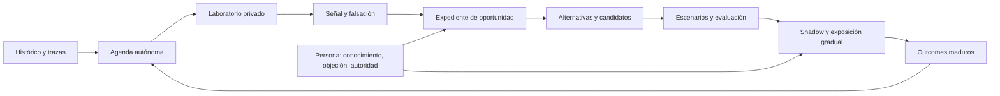
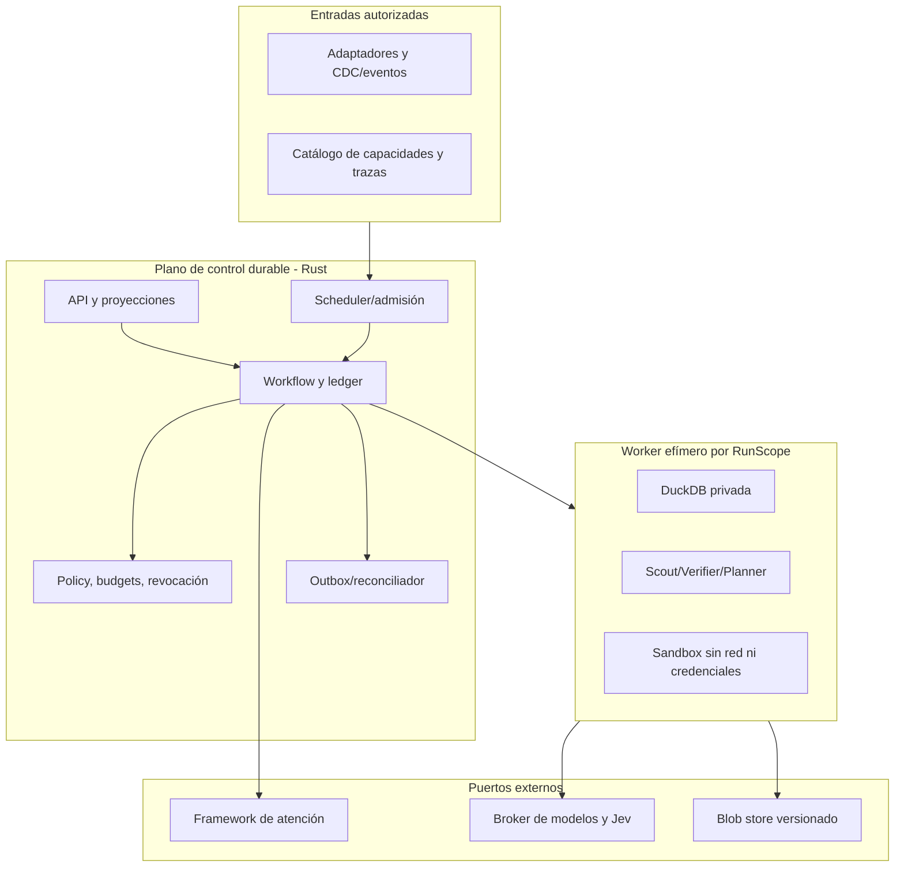
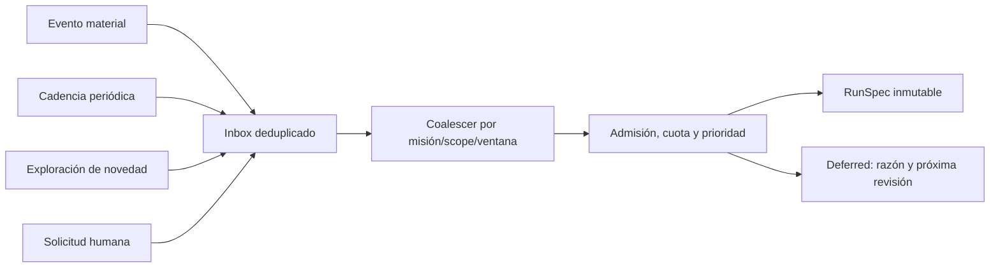
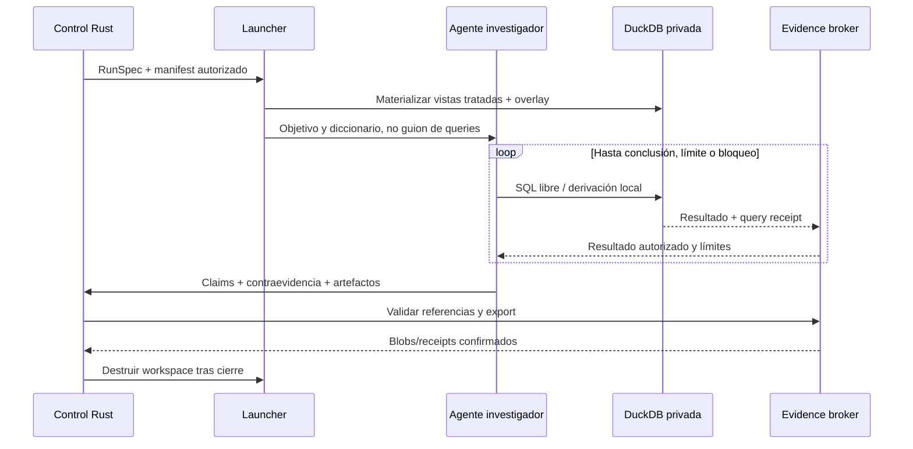
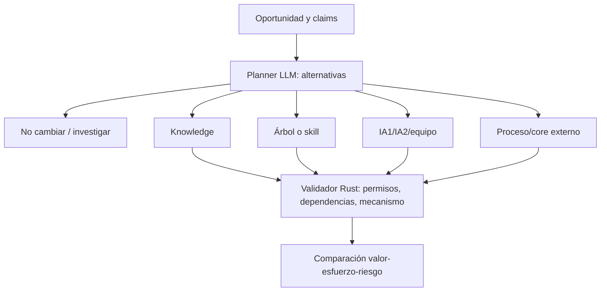
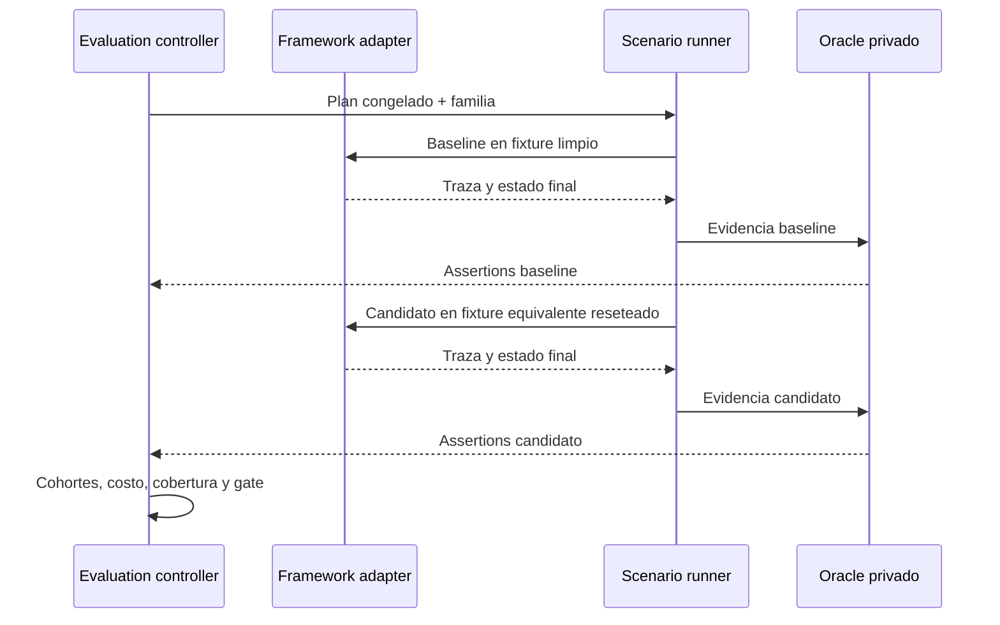
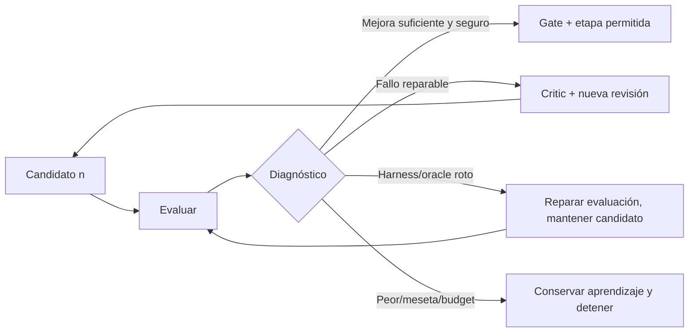
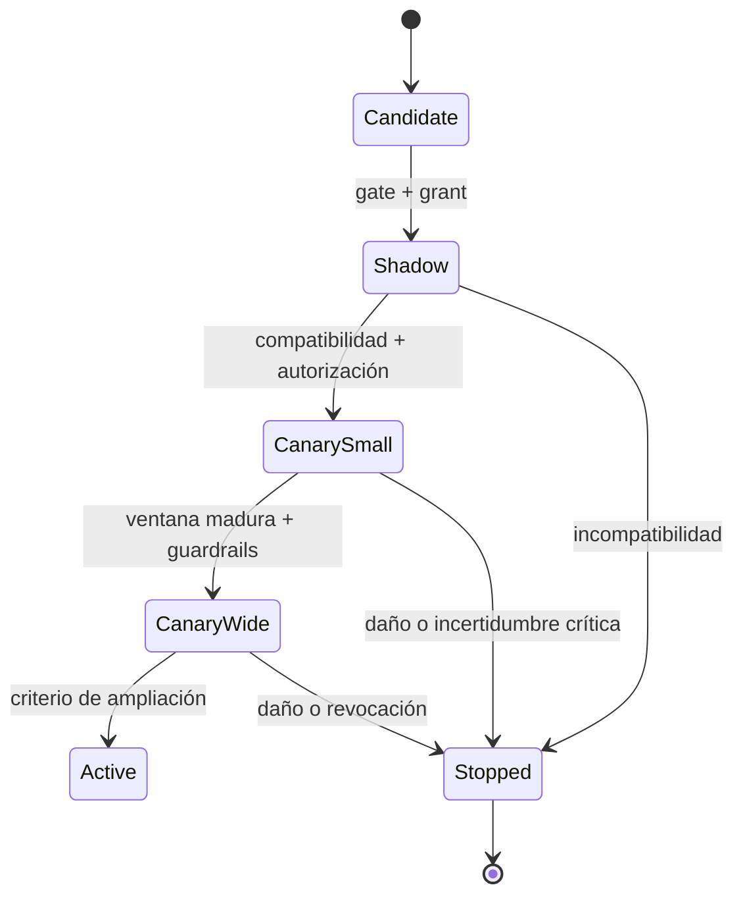
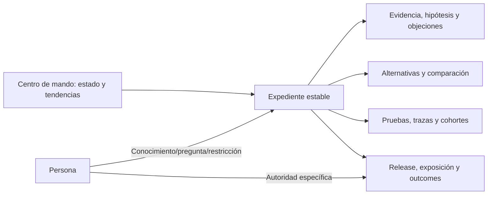
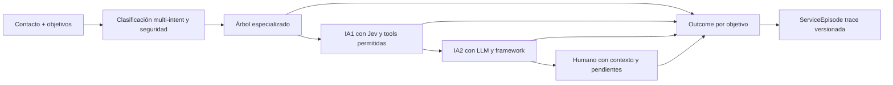

# Pulso | Especificación implementable del motor autónomo

> Versión de diseño para revisión. Arquitectura propuesta para un banco real; no describe acceso concedido, integración terminada, resultados observados ni aprobación de riesgo. Complementa, no reemplaza, la guía `SPEC_VISUAL_PULSO.md`. Los umbrales y políticas que dependen del banco son parámetros explícitos, no cifras inventadas.

## 0. La historia completa en una página

Pulso atiende con capacidades estables mientras un sistema separado aprende de la operación. Este último no espera una instrucción humana: recibe eventos, corre barridos periódicos y reserva capacidad para exploración abierta. Cuando ve algo anómalo o desaprovechado, crea una investigación reproducible, busca explicaciones alternativas, conserva el resultado en un expediente, diseña más de una intervención, prepara candidatos mediante el framework, los somete a pruebas independientes, itera y, dentro de autoridad delegada, expone gradualmente una versión mejor. Los resultados posteriores regresan al descubrimiento. La persona aporta conocimiento, objeta o autoriza efectos que exceden la delegación; no opera una cadena de botones.

La unidad de autonomía es una **Mission** (propósito y delegación de largo plazo), no una sesión de chat. Su ejecución concreta es un **Run** con entradas congeladas, presupuesto y salida verificable. La unidad analítica es un laboratorio DuckDB desechable por `InvestigationRun` y ámbito de autorización; un agente paralelo obtiene rama privada. Ninguna base DuckDB global mutable sirve a todos los agentes. La metadata transaccional y el log de decisiones pertenecen al plano de control durable, que puede usar PostgreSQL; no se instala SQLite adicional en el laboratorio.

## 1. Decisiones, límites y lenguaje del equipo

**Decidimos como default de diseño:** núcleo y scheduler en Rust; snapshots tratados e inmutables; DuckDB privada por run; SQL libre en el laboratorio; Jev para preguntas semánticas cerradas; LLM para exploración y diseño abiertos; framework propio como dueño de construir/ejecutar capacidades; promociones graduadas por delegación y riesgo. Versiones activas de atención no cambian mientras una investigación itera.

**No decidimos todavía:** cadencias, umbrales, costos máximos, fuentes efectivas, residencia y egress por país, permisos de herramientas bancarias, clases que pueden alcanzar canary automáticamente, diseño interno del framework y calidad de etiquetas históricas. En el software deben aparecer como `PolicyRevision`, `SourceContract` o `DependencyBlock`, nunca como constantes ocultas.

**Hecho, inferencia e intervención son distintos.** `Signal` comunica una desviación medida; `Claim` declara lo observado o una hipótesis; `Opportunity` agrupa una necesidad accionable; `Proposal` predice un mecanismo de cambio; `Evaluation` informa comportamiento bajo condiciones fijadas; `OutcomeObservation` describe lo observado después. Ni un cierre administrativo ni una respuesta amable prueban resolución. Un agente de atención, una skill, un árbol, un detector de problemas y un agente investigador son roles distintos.

**Lectura libre no significa salida libre.** El LLM recibe una sesión analítica genérica: ve esquema, ejecuta SQL y deriva tablas locales sin elegir entre tools de consulta de negocio. Escribir scratch en la DB privada no es efecto bancario. Toda información que salga del laboratorio hacia un proveedor o hacia el expediente pasa por un broker de autorización, tratamiento, límites y procedencia. Tools tipadas se reservan para mutaciones fuera del laboratorio: cambiar catálogo/routing, enviar mensajes, operar cuentas y otras acciones con secuelas.

## 2. Topología física: quién vive dónde

El plano de control guarda misiones, IDs, transiciones, delegaciones, budgets, receipts, referencias a blobs y outbox. Un solo backend transaccional debe resolver CAS, leases y orden de eventos; para una instalación real proponemos PostgreSQL como opción inicial, no como dependencia semántica. El blob store contiene snapshots, artefactos de evidencia, escenarios y revisiones; los bytes son inmutables y se referencian por digest más productor y esquema. Retención, supresión y borrado legal siguen políticas propias: inmutabilidad de una revisión lógica no significa conservar datos personales indefinidamente.

**Frontera de repositorios y ejecución (I03).** El servicio y su entorno ejecutable pertenecen a `improvement-engine`: Compose/Podman, PostgreSQL y LocalStack efímeros, fixtures, simulador y CI que los arranca. `infra` sólo materializa la infraestructura AWS declarativa y sus controles de despliegue; no aloja el harness del motor ni workflows reutilizables para ejecutarlo. Así, un clone del motor puede validar sus dependencias de integración sin permisos ni SHA de otro repositorio; un plan Terraform puede cambiar sin alterar los tests de dominio. El costo es mantener manifests separados para local y AWS, mitigado por contratos de conexión y manifest de release por digest, no por compartir un stack de CI.

Los workers efímeros no tienen acceso directo a sistemas bancarios ni a la DB del control plane. Reciben entradas autorizadas mediante el launcher. El broker de modelos controla contexto y salida; el framework recibe `CandidateBuildRequest` o `ReleaseOperation` tipados. Un fallo de Pulso no debe tumbar la atención estable ya publicada.

## 3. Autonomía operativa: cuándo despierta el sistema

Cada misión declara `mission_id`, problema amplio, partición/tenant, fuentes y capacidades permitidas, cobertura que quiere observar, presupuesto, colas prioritarias, ventana de ejecución, autonomía máxima y política de retención. Su `MissionRevision` se fija en cada run. **Siempre activo** significa inbox de eventos, agenda recurrente y workers durables, no inferencia LLM continua.

**Evento.** Adaptadores publican `SourceChange` (nuevos contactos, fallo de tool, corrección, cambio de capacidad, outcome que alcanzó madurez, incidente). Inbox registra source ID, revisión, tiempo ocurrido/recibido y key. Un evento no equivale automáticamente a nuevo run: el coalescer reúne los que afectan la misma misión, ámbito y ventana, aplica cooldown y reabre si hay novedad material. Un cambio que invalida evidencia activa prioriza revalidación.

**Periódico.** Cada `MonitorBinding` define versión de métrica, población, ventanas comparadas, watermark, frecuencia y tolerancia a llegada tardía. La agenda calcula la próxima ventana elegible y reserva un run; catch-up después de una caída usa ventanas explícitas, no `now` sobreescribiendo la historia.

**Exploración abierta.** Una cuota reservada busca motivos desconocidos, rutas humanas repetidas, cambios de mezcla, comportamientos raros y segmentos sin cobertura aun cuando ningún detector dispare. El LLM puede formular consultas nuevas, pero no registrar automáticamente cada consulta como monitor permanente: un detector candidato necesita prueba fuera del periodo explorado y registro por política.

**A demanda.** `RequestResearch` define pregunta, expediente opcional y ámbito. Entra en el mismo mecanismo de admisión y deja atribución de la hipótesis al usuario; no obtiene privilegios adicionales por venir de una persona. En todas las rutas `RunSpec` congela trigger(s), mission revision, `AnalysisInputManifest`, scope, policy, model/capability refs, budget, deadline y key de deduplicación.

La cola prioriza seguridad/incidente, revalidación por corrección, degradación y exploración dentro de reservas. Límite de runs concurrentes por tenant/misión, CPU, memoria, tokens y egress; backpressure devuelve `Deferred`, nunca pérdida silenciosa. Evento producido por la propia mejora no puede disparar recursión sin novedad y cooldown. Lo que agota presupuesto termina `BudgetExhausted` con trabajo y evidencia parciales, no `NoProblem`.

## 4. Ingesta: del banco al contexto que un agente puede explorar

Cada fuente tiene un `SourceContract`: identidad estable, versión de esquema, actor productor, grain, timestamps, frecuencia, política de correcciones y borrados, clasificación de datos, propósito autorizado y reglas de unión. El adaptador no interpreta un `closed=true` como éxito del cliente ni rellena texto ausente. Valida y registra registros defectuosos aparte; no los elimina del denominador sin declararlo.

El `SnapshotBuilder` resuelve una revisión por registro lógico en un corte de ingesta y un corte de negocio (`as_of`), preservando el histórico original y la regla de precedencia. Produce tablas tratadas de contactos, PQR, clientes/productos, transacciones, eventos digitales, trazas IA/humano, catálogo, evaluaciones y outcomes solo donde existan y sean autorizadas. Cada tabla lleva diccionario, grain, cobertura, faltantes, quality checks y lineage. Vincular interacciones a episodio exige evidencia de relación y método; proximidad temporal no prueba misma causa.

`AnalysisInputManifest` fija fuentes, revisiones de episodios/outcomes, tratamiento, taxonomía, capacidades, ventanas, watermark y política de madurez. Un hash de ese contenido entra en cache, identidad de señal y reproducibilidad. Una corrección tardía crea un manifest nuevo y marca derivaciones dependientes como stale; no reescribe una investigación histórica.

Para evitar multiplicación de joins: primero universo de unidades únicas (episodio, contacto, transacción o cliente según métrica), luego indicadores agregados por unidad, al final tasas. Un contacto con tres eventos y dos transacciones puede producir seis filas en un join, pero sigue siendo una unidad si la métrica mide contactos. El `MetricSpec` declara cardinalidad esperada y las pruebas rechazan desviaciones.

## 5. Laboratorio efímero y libertad analítica

`InvestigationRun` crea una DuckDB **privada para ese run y scope**, no por mensaje. Launcher materializa vistas de un snapshot tratado e inmutable, diccionario, manifests y un overlay escribible para derivaciones. Ninguna credencial ni ruta de la máquina host aparece dentro del sandbox. Una rama de agente concurrente recibe copia o nueva vista aislada del mismo parent; comparte artefactos confirmados, no scratch mutable.

El agente puede explorar esquema, filtrar, unir, agrupar, crear tablas temporales y buscar contraejemplos sin una lista de herramientas de negocio. El canal SQL sigue siendo brokerizado: tiempos, filas, bytes y salida acumulativa por run/tenant limitan costo y exfiltración por muchas consultas pequeñas. Prohibir red/extensiones/rutas externas dentro del proceso ayuda, pero DuckDB advierte que SQL no confiable debe aislarse a nivel de sistema operativo. [DuckDB security](https://duckdb.org/docs/current/operations_manual/securing_duckdb/overview). Un proceso puede escribir su DuckDB; ramas en procesos distintos usan DBs propias. [DuckDB concurrency](https://duckdb.org/docs/current/connect/concurrency).

El controlador no obliga a una secuencia de pensamiento. Ofrece operaciones genéricas (`inspect`, `query`, `derive`, `inspect_result`) y recibe conclusiones tipadas; política valida entradas/salidas, no orden de razonamiento. Cada query produce `QueryReceipt` con SQL, parámetros, manifest, engine version, columnas, filas, estado completo/truncado, hash y costo. Derivaciones útiles se publican mediante rama temporal → export consistente → blobs verificados → CAS del head. Si cae antes de CAS, se reconstruye desde parent; si cae después, se devuelve receipt. La DB puede desaparecer sin que desaparezca evidencia confirmada. No se promete reproducir exactamente la misma respuesta de un LLM; sí saber qué vio y qué produjo en aquella ejecución.

## 6. Qué medimos: cartera de sensores y definiciones

Un detector no es simplemente `SELECT count(*)`. `MetricSpec` fija objetivo, unidad y clave, universo elegible, numerador, denominador, periodo por event-time, watermark, cohortes, comparador, exclusiones, estado unknown, mínimos de cobertura y versión de taxonomía. Los umbrales son configurables y se validan por fuente/país, no asumidos universales.

| Familia | Medidas iniciales (definición que debe fijarse) | Por qué podría importar |
|---|---|---|
| Atención | Recontacto por episodio/motivo dentro de ventana madura; escalamiento correcto; minutos y costo desde inicio hasta resultado verificable | Volumen, experiencia y carga humana |
| PQR | Nuevas quejas por población expuesta; edad hasta resolución verificada; reaperturas; vencimientos según regla vigente | Dolor persistente y riesgo operativo |
| Canales/transactions | Intentos con error por intentos elegibles; reintentos, abandono y contacto posterior por cliente/cohorte; rechazo legítimo separado de falla técnica | Fricción que puede preceder contacto o pérdida de operación |
| Cobertura de atención | Porcentaje de episodios elegibles que termina en árbol/IA1/IA2/humano, con resultado y excepciones; handoff incompleto | Automatización desaprovechada, costo y seguridad |
| Producto/negocio | Activación y uso por población elegible, leads contactables y conversión madura; fricción previa sin reclamar causalidad | Posibles ingresos o retención |
| Riesgo/cartera | Estados de mora por producto, vencimiento, saldo y cliente activo/inactivo bajo definición contractual; contacto y fricción asociados | Ayuda a segmentar, no explica por sí sola por qué no pagó |
| Salud de Pulso | Señales duplicadas, hallazgos confirmados/refutados, costo por oportunidad sustentada, drift de etiquetas/modelos, cobertura de fuentes | Detectar sesgo, fatiga y gasto del propio motor |

Para cada métrica, el `DetectorRun` calcula nivel y cambio contra baseline comparable, intervalos/incertidumbre apropiados, tamaño poblacional, calidad, exclusiones y diferencia de composición. La señal contiene `metric_ref`, `population_ref`, `numerator`, `denominator`, ventana, comparador, `effect_or_delta`, interval, missingness, QueryReceipts y `freshness`. Si no hay comparador o resultado maduro, es una observación candidata y así se muestra. Un riesgo raro pero crítico puede disparar por regla de seguridad sin esperar significancia estadística.

La arquitectura admite detectores declarativos y exploración generativa. Los primeros dan vigilancia barata y repetible. El LLM descubre nuevas preguntas y puede proponer `DetectorSpec` posterior. Jev se reserva para juicios breves y tipados, por ejemplo clasificar motivo conocido o evaluar una rúbrica puntual; no sustituye la investigación abierta. Su documentación lo define en términos de estado y preguntas tipadas, y recomienda descomponer problemas que requieren razonamiento extendido. [Jev introduction](https://docs.typesafe.ai/introduction).

## 7. De señal a problema: verificación adversarial

Una señal no abre automáticamente una oportunidad nueva. `VerificationJob` recibe observación, manifest y contexto de detector; otro agente, preferiblemente con contexto separado, intenta explicar o falsar el patrón. Debe producir al menos: (1) replicación de métrica y grain; (2) contraste en otra ventana/cohorte elegible; (3) chequeo de correcciones/faltantes; (4) alternativa de mezcla de producto/canal o incidencia externa; (5) resultado `supported`, `refuted`, `uncertain` o `blocked`. Si la señal proviene de exploración abierta, una partición temporal o familia reservada evita aceptar un hallazgo solo porque se buscó entre miles de cortes.

Dos modelos de acuerdo no bastan: el verificador debe adjuntar consultas y contraejemplos ejecutados. Un cambio de mix puede mantener el total estable y esconder un grupo deteriorado; también puede hacer crecer un total sin que empeore ninguna tasa por grupo. La salida `VerificationReport` explicita ambas posibilidades. Error de fuente, duplicación de join, window inmadura o SQL truncado no se transforman en `refuted`; quedan `uncertain` con reparación propuesta.

El `OpportunityMatcher` busca expedientes existentes por ámbito, población, tema y evidencia. Similitud textual es pista, no identidad causal. Puede adjuntar señal a expediente, crear otro o marcar relación sin fusión. Un merge/split versionado conserva referencias originales y las métricas no se reparten proporcionalmente sin evidencia. El expediente diferencia `observed_fact`, `hypothesis`, `assumption`, `counterevidence` y `decision` y mantiene una revisión estable aunque sigan llegando runs.

## 8. Planear una intervención que pueda cambiar algo

El Planner recibe oportunidad verificada, mapa de capacidades reales, dependencias y autoridad. Produce alternativas **heterogéneas**, no un agente por defecto: no cambiar, mejorar conocimiento, árbol/skill verificable, ajustar agente IA1 o IA2, equipo multiagente, herramienta/dato pendiente, mejora del proceso externo o reparación en core bancario. Cada alternativa declara mecanismo esperado `causa candidata → acción posible → resultado comprobable`, población elegible, exclusiones, limitaciones, dependencias y cómo fallaría.

`DecisionComparison` primero elimina alternativas inviables, luego presenta escenarios con población, horizonte, USD o unidad original y FX, costos de construcción/operación/integración, incertidumbre y riesgos. No suma ahorros de contacto y de recontacto si comparten episodios. Prioridad de **investigar** y prioridad de **construir** son distintas: un tema de alto valor pero causalidad incierta puede merecer una investigación barata sin justificar un release. Si la causa es un fallo del core, una explicación mejor puede reducir contactos, pero no se presenta como reparación de la transacción.

La salida `ImprovementProposalRevision` fija base exacta y `ChangeSpec` tipado; `ToolRequirement` o `DataRequirement` declara dependencia, no instala una integración. Un agente puede proponer y refinar la explicación; un validador determinista confirma referencias, límites y nivel de evidencia antes de pedir preparación al framework. El mismo `CandidateBuildRequest` sirve al builder conversacional humano y al motor autónomo.

## 9. Construir candidato sin alterar la versión activa

`CandidateBuildRequest` incluye `proposal_revision`, `base_capability_revision`, `change_spec`, tool/data/knowledge refs, ámbito, policy, assurance solicitada y key. El framework propio devuelve `ready`, `dependency_block`, `incompatible` o `failed`, con `CandidateManifest` y bindings exactos. No aceptamos que un campo `ready=true` escrito por el LLM certifique ejecutabilidad. Un adapter autenticado del framework atesta qué se preparó: solo schema, simulación o runtime ejecutable. Si aún no existe el interior del framework, el puerto fixture puede probar contratos, pero no tasas reales de resolución.

Para árbol/skill, un `ProcedureSpec` representa `Check`, `Read`, `Act`, `Respond`, `Handoff`, `Finish`; predicados y entradas distinguen valor conocido, ausencia conocida y desconocido. Unknown, timeout y error de tool llevan ruta explícita; un falso implícito sería peligroso. Para agentes/equipos, ChangeSpec fija objetivo, inputs/outputs, skills/tools, delegación, contexto compartido, regla de agregación, límites y escalamiento. Validación estática verifica tipos, referencias, alcance de permisos, rutas de salida, ciclos y precondiciones. La construcción automática y la humana atraviesan la misma ruta; ninguna activa producción por crear artefacto.

## 10. Fábrica de escenarios: de dónde salen y qué prueban

`ScenarioFactory` combina cuatro fuentes. **Histórico tratado:** episodios y trazas con estado verificable, eliminando identificadores directos y conservando procedencia. **Variaciones controladas:** fechas, canal, idioma, saldo, estados y permisos dentro de un contrato; son contrafactuales sintéticos, no hechos del banco. **Regresiones:** errores reales de candidato, incidentes, respuestas incorrectas y defectos de handoff. **Clientes adversariales:** un simulador LLM aislado intenta confundir o presionar al agente bajo CustomerView mínimo; nunca ve el estado privado ni el resultado del oráculo.

Cada `ScenarioCase` tiene familia/linaje, precondiciones, objetivo del cliente, fixture inicial, vista visible para el actor, respuestas de tools simuladas con fallas controladas, acciones permitidas/prohibidas, salida esperada, oracle refs y calidad/procedencia. La fábrica divide por familia y periodo en desarrollo, validación y final reservado **antes** de iterar. Paráfrasis del mismo caso no cuentan como muestras independientes. Casos sin estado final confiable pueden probar seguridad/handoff, pero el objetivo de resolución queda unknown. Una etiqueta histórica de cierre no se convierte en oracle de éxito.

`OracleSpec` viene de regla autorizada, experto con autoridad, histórico verificado o supuesto sintético señalado. Assertions deterministas comprueban estado final, traza, acción prohibida, handoff, contrato de salida y presupuesto. Resultado `pass/fail/unknown/not_applicable` conserva evidencia. Un juez Jev puede calificar una rúbrica cerrada; un LLM independiente puede evaluar claridad abierta, ciego a la identidad/justificación del candidato. Ninguno compensa una violación de seguridad ni inventa estado bancario.

## 11. Ejecución de pruebas, medición y atribución de fallos

`EvaluationPlan` congela población comparativa, cohortes, versiones de elegibilidad, routing, fixtures, baseline/candidate, dependencias, oracle, particiones, seeds/repeticiones cuando apliquen, límite de costo y stop conditions. Cada caso resetea entorno. El runner comprueba que produjo el fallo que dice probar: si una tool debía hacer timeout y no ocurrió, el caso es inconcluso, no aprobado. Distingue fallo del candidato, fixture, harness, oracle y proveedor.

Se publican resolución verificable por población común, cobertura específica, regresiones protegidas, errores críticos, handoffs correctos, tiempo/costo total con frontera declarada, distribución por idioma/canal/segmento, tasa unknown y variabilidad. Escalar todos los casos caros no los elimina del denominador; si la continuación humana no se simuló o midió, el costo es parcial/supuesto. Un gate es `pass/fail/inconclusive` por política. Un candidato puede ser mejor en costo y peor en seguridad: restricción dura lo bloquea. Shadow demuestra compatibilidad operacional, no lift ni resolución real.

## 12. Iterar sin sobreajustar ni cambiar lo estable

Tras cada run, el `FailureTriage` clasifica errores por candidato, entorno, datos, oracle o límite de observación. El `Critic` LLM recibe sólo artefactos autorizados de development y validation, propone cambio mínimo con hipótesis y `base_revision`; el Planner puede revisar mecanismo completo si el cambio local no basta. El framework prepara `CandidateRevision n+1`; toda suite aplicable se repite contra baseline estable y regresiones protegidas. No se retoca silenciosamente un caso para que pase. El conjunto final reservado se usa para decisión de release conforme a política, no como feedback iterativo ilimitado.

El loop termina si pasa criterios, empeora en una restricción dura, no progresa (meseta), agota tiempo/costo/rondas o pierde una dependencia. `NoImprovement`, `Worse`, `Inconclusive` y `Blocked` no se mezclan. La versión de atención activa no cambia durante iteraciones. Conocimiento útil de un intento fallido puede generar caso o detector, pero no modifica pesos/prompts/capacidades vivos por sí solo.

## 13. Shadow, canary y liberación paulatina

`AutonomyGrant` fija clase de riesgo, etapas permitidas, scope, exposición máxima, presupuesto, expiración y revocación. El motor puede preparar, probar e iniciar shadow dentro de delegación. Canary automático es posibilidad **solo** para clases y alcances previamente autorizados; acciones bancarias mutables o cambios de alto riesgo requieren autoridad adecuada. Aprobación humana no es un paso universal, pero tampoco se deduce de una frase en chat.

`ReleasePlan` fija versión, población elegible, assignment estable por cliente/episodio para no cambiar de tratamiento a mitad de contacto, etapa, porcentaje máximo, guardrails, fechas de observación y rollback. La asignación puede ser hash estable con salt y versión de plan; no se reelige en cada request. El routing externo confirma generación/fencing y exposición observada; un ack de operación no basta. Shadow no ejecuta efectos reales, aunque puede comparar decisión y costo técnico. Canary exige reportar cuántos eran elegibles, asignados, efectivamente expuestos y con outcome maduro. Si se pretende atribuir lift, diseño de asignación y comparación debe evitar selección sesgada e interferencia; sin ello se reporta asociación.

Guardrails deterministas detienen ampliación o exposición ante error crítico, violación de permisos, queja/recontacto perjudicial, regresión de resolución o falta de telemetría imprescindible. Un stop invalida promociones pendientes y reconcilia routing; rollback cambia versión/ruta, no revierte por magia efectos ya hechos en una cuenta. Expansión se evalúa por cohortes/ventanas; no se declara éxito cuando aún no maduró el resultado. La observación posterior alimenta nueva investigación, incluso si contradice la evaluación offline.

## 14. Aprendizaje que vuelve al origen

El `OutcomeObserver` une exposición exacta con resultados posteriores bajo ventana, población y cobertura definidas. Distingue `technical_success`, `customer_goal_verified`, `administrative_closed`, satisfacción por encuesta válida, recontacto, costo y ausencia de observación. Resultados desconocidos permanecen unknown. Puede abrir tres clases de trabajo: investigar una hipótesis refutada, mejorar una capacidad que falló o convertir un patrón nuevo en detector candidato. Rechazo humano por baja prioridad no marca falsa una hipótesis.

El propio sistema vigila sus detectores: drift de taxonomía, falsos positivos, costo de exploración, señales duplicadas, segmentos ciegos y cambios de mezcla. Un tema nuevo recibe `TopicRevision`; sus mappings con categorías viejas son equivalent/broader/narrower/split/merge/unresolved. No reescribe fuentes históricas ni reparte cifras de un split sin anotaciones. Un detector generado por exploración requiere prueba de semántica, cardinalidad, estabilidad fuera del periodo de descubrimiento, missingness y costo antes de ser vinculado a una misión periódica.

## 15. Experiencia: qué ve la persona, cuándo y para qué

La home no es una bandeja de tareas para operar a Pulso. Muestra **actividad autónoma agregada**: qué vigila, qué investigó, oportunidades nuevas, mejoras en prueba y cambios observados, con límites visibles. Notificaciones solo para decisión que necesita autoridad, evidencia material nueva, incidente/contención o resultados relevantes; múltiples señales de un mismo expediente no generan spam.

En el expediente: título comprensible, población/periodo, hecho observado con numerador-denominador y gráfico, calidad/faltantes, explicaciones rivales, alternativas incluyendo no cambiar, estimación con supuestos, nivel de autonomía y estado real del candidato/release. Una línea de tiempo diferencia trabajo automático de intervención humana. Cada claim abre evidencia y query; cada fallo de prueba abre caso, traza y oracle; desde ellos se vuelve a la misma comparación. La persona puede preguntar, aportar evidencia, corregir un hecho, objetar, posponer, imponer límites o autorizar una etapa. Un comentario no equivale a autorización; cambios de scope o fuente obligan revalidación. La oficina de agentes muestra versión, skills/tools, evaluaciones y actividad real, no avatares como prueba de eficacia.

## 16. Confiabilidad y seguridad del motor que trabaja solo

Cada `JobRun` consta de `JobStep` con dependencias, input refs, lease, fencing token, attempt, outputs y estado. Worker reclama con transacción, consulta política vigente antes de consulta/modelo/efecto, ejecuta, confirma blob/hash y hace CAS de metadata+outbox. Retry devuelve receipt si hubo commit; una llamada externa con respuesta perdida queda `unknown` y se reconcilia antes de repetir. No prometemos exactly-once donde el proveedor no ofrece idempotencia. Cancelar impide trabajos nuevos, pero no demuestra que una llamada externa ya enviada se haya cancelado.

`ModelOperation` registra contexto efectivo (incluidos mensajes previos), modelo/config, propósito, reserva, dispatch, usage real o pendiente, output y costo. Cache solo con contexto, permisos, versiones y tratamiento compatibles. El sandbox no ve secretos del banco; el broker de egress examina toda salida acumulada. Revocar una fuente invalida sesiones, caches y workspaces derivados; retirar la referencia sin retirar texto ya copiado no basta. Como diseño, las políticas definen retención, residencia, supresión, uso de proveedores y auditoría por jurisdicción.

Si falla el LLM, monitores deterministas continúan; si falla el laboratorio, no se publican conclusiones nuevas; si falla Pulso entero, atención continúa con versión estable ya activada. Restore abre en modo cerrado: verifica metadata/blobs, aplica revocaciones actuales, cambia epoch, reconstruye proyecciones, reconcilia routing y efectos externos y habilita clases de trabajo gradualmente. No usa permisos de un backup antiguo como autoridad presente. Seguridad crítica se contiene mediante reglas deterministas fuera del investigador generativo.

## 17. Observabilidad: demostrar que el motor funciona

Cada run emite traza con `mission → trigger → input manifest → consultas/juicios → claims → verificación → propuesta → candidato → casos → gate → release → exposición/outcome`. IDs unen logs, métricas y expediente; payload sensible se separa con controles de acceso y retención. Pantallas tipo trace muestran latencia y costo por step, versión de modelo/Jev, SQL/receipt, inputs autorizados, errores, retries, decisión de política y motivo de bloqueo. La traza nunca sustituye fuente de verdad de operación externa.

SLO/alertas a configurar: lag desde evento a señal; backlog y tiempo de admisión; tasa de runs que finalizan sustentados/refutados/inconclusos; costo por hallazgo útil; resultados sin procedencia; fuga o denegación de egress; cobertura de suites; diferencia baseline/candidate; lag de outcomes maduros; tiempo de stop/reconciliación. No fijamos 99.9% ni umbrales sin entorno y carga medidos. Una misión que produce cientos de alertas duplicadas es un fallo de producto, aunque sus workers estén saludables.

## 18. Tres recorridos completos que el equipo debe poder ejecutar

**A. Falla de canal y contacto posterior.** Llegan eventos de transacción y digital con error, más contactos posteriores. Adaptador valida identidad/tiempos, snapshot resuelve correcciones y liga episodios con grado de certeza. Monitor calcula tasa de error por intentos elegibles y contacto posterior por clientes expuestos, con baseline de canal/producto y cobertura. Coalescer crea un run; Scout explora SQL y propone que hay fricción. Verifier contrasta mix de producto, otros canales y tiempo, identifica que la relación causal aún es hipótesis. Matcher agrega señales a expediente. Planner compara explicación de estado en árbol, skill de handoff y corrección externa del canal. Framework prepara candidato de explicación sin tool mutable. ScenarioFactory incluye error, estado desconocido, rechazo legítimo y tool timeout. Eval mide comprensión/handoff, regresión y costo; Critic corrige rama que afirmaba que la transacción se reparó. Shadow comprueba rutas; canary autorizado observa recontacto maduro y quejas antes de ampliar. Si core sigue fallando, el expediente no declara resuelta la causa.

**B. Acción humana reusable.** Trazas completas muestran que asesores consultan estado y explican una excepción, con resultado de cliente verificable. Exploración periódica encuentra repetición en IA2/humano; Verifier busca casos de igual texto donde la acción sería insegura. Planner propone árbol para subconjunto bien definido y skill IA2 para excepciones. ProcedureSpec codifica checks, read, unknown y handoff. Builder prepara; factory toma episodios tratados, contraejemplos y variaciones adversariales. Eval muestra cobertura de subset y costo total incluyendo escalamiento. Si árbol falla en estado contradictorio, regression case y Critic generan nueva revisión; baseline activo queda estable. Tras gates, release gradual mide si el subconjunto se resuelve mejor sin aumentar quejas. Un resultado maduro contradictorio reabre investigación.

**C. Tema nuevo no vigilado.** Exploración abierta halla conversaciones sobre un nuevo bloqueo de producto. Jev puede etiquetar ejemplos acotados, pero no declarar magnitud causal. Scout define población y SQL; Verifier prueba otra ventana e idioma. `TopicRevision` provisional conserva ejemplos/ambigüedad. Matcher crea oportunidad o relación con una existente. Planner puede concluir que primero hace falta conocimiento oficial o una tool aún inexistente; en ese caso registra `DependencyBlock`, no construye un agente ficticio. Una consulta exploratoria solo se convierte en detector periódico tras evaluación independiente y `MonitorRegistrationDecision`. El siguiente barrido usa la versión registrada y compara sus falsos positivos.

## 19. Contratos que deben quedar implementables en el primer corte

| Contrato | Entrada mínima | Salida/estado y regla crítica |
|---|---|---|
| MissionRevision / AutonomyGrant | Objetivo, scope, fuentes, risk class, budget, etapas permitidas, expiry | Permiso efectivo = intersección con política actual; worker no amplía autoridad |
| TriggerEnvelope / RunSpec | Source/time/key, misión, manifest, deadline | Agrupar y deduplicar sin perder correcciones materiales; Deferred visible |
| AnalysisInputManifest | Source/episode/outcome/taxonomy/capability/treatment versions | Identidad y cache; cambio produce nuevo hash y revalidación |
| WorkspaceManifest / QueryReceipt | Parent, engine, SQL/params, artifacts, límites | DB desechable; evidencia confirmada reconstruible; truncado no prueba ausencia |
| MetricSpec / SignalEvidence | Grain, población, ventana, baseline, fórmula, calidad | Numerador/denominador, intervalo, unknowns y refs reproducibles |
| VerificationReport | Signal, checks alternativos, refutaciones | Supported/refuted/uncertain/blocked, nunca consenso textual vacío |
| OpportunityDossier / Claim | ID estable, hechos, hipótesis, contradicciones, scope | Revisión y owner; merge/split conservan lineage |
| ImprovementProposalRevision / ChangeSpec | Base exacta, mecanismo, elegibilidad, dependencias | Alternativas comparables; no tool/agent ficticio por describirlo |
| CandidateBuildRequest / CandidateManifest | Proposal, framework adapter, policy | Ready/dependency_block/incompatible/failed; assurance atestada |
| ScenarioFamily / OracleSpec / EvaluationPlan | Linaje, fixtures, objetivo, poblaciones, particiones, rúbricas | Baseline/candidato comparables; pass/fail/unknown separados |
| PromotionAuthorization / ReleasePlan | Gate, etapa, scope, assignment, stop conditions | Efecto confirmado externamente; shadow ≠ canary ≠ activo |
| OutcomeObservation / ImpactAssessment | Exposición, ventana madura, coverage, release exacto | Observado/unknown, causalidad con método; nueva evidencia reabre trabajo |

Cada contrato requiere schema version, owner, namespace tenant, idempotency key cuando pueda repetirse, referencias inmutables y transición explícita de error/unknown. Los estados de trabajos de investigación son `queued → admitted → materializing → investigating → verifying → publishing → complete`, con `deferred`, `budget_exhausted`, `blocked`, `failed`, `cancelled` y recovery. `FinishResearch` persiste borrador antes de validar/publicar para sobrevivir crashes. Publicación concurrente preserva comentarios/objeciones; cambio de scope o evidencia corregida requiere revalidar o crear revisión nueva, no sobrescribir el head.

## 20. Secuencia de construcción para hacer posible la magia

El primer corte debe demostrar **un recorrido completo y honesto**, no veinte pantallas con simulaciones inconexas. Entrega 0: fijar ontología/OutcomeContract y cortes temporales, SourceReadiness y suite contractual del puerto framework con fixture; no exige implementar el framework interno. Entrega 1: adaptador fixture con source contract, snapshot tratado, un monitor y `RunSpec` por evento y agenda; metadata durable, launcher DuckDB privado y consulta libre reproducible. Entrega 2: Scout + verificador separado, Claim/Signal/Opportunity y expediente con evidencia navegable; caso donde se refuta una falsa señal. Entrega 3: Planner con alternativas, un ChangeSpec de árbol/skill y adapter del framework con assurance explícita; dependencia faltante se bloquea. Entrega 4: ScenarioFactory, oracle, baseline/candidate, critic loop y reporte de costo/cobertura; fallo de harness no se computa como éxito. Entrega 5: shadow y canary solo si hay integración/autorización verificables; en fixture se declara simulated y no se habla de lift productivo. Entrega 6: observación madura, reingesta, revalidación y aprendizaje del propio detector.

Antes de conectar producción se prueban aislamiento real del launcher, scopes/identidad, egress acumulado, CAS y fencing del routing, retención/supresión, restore cerrado, carga/admisión y cohortes de rollout. Pruebas de fixture no demuestran esas propiedades del entorno bancario. Criterios de aceptación por recorrido: trigger repetido no duplica trabajo; corrección tardía no altera evidencia antigua; caída antes/después de CAS se recupera; SQL libre no sale de scope; signal espuria se refuta; candidato inseguro no se promueve; usuario puede objetar sin detener todo el motor; canary dañino se contiene; no se atribuye ahorro sin outcome/denominador.

## 21. Preguntas de diseño que dejaremos visibles al revisar

1. Qué clases de cambio pueden llegar a shadow/canary de forma automática y con qué autoridad previa. Propuesta: shadow dentro de misión delegada; canary automático solo bajo clases de bajo riesgo explícitamente autorizadas.
2. Qué datos/campos pueden entrar al laboratorio y cuáles salir al proveedor por país y propósito. No sustituir decisión de privacidad por pseudónimos.
3. Qué definición de resolución, costo de contacto, valor comercial y outcome maduro es autoritativa por producto. Sin ellas, se muestran rangos y unknowns, no ROI realizado.
4. Qué volumen de fuentes, runs y paralelismo hace viable el default de PostgreSQL control + DuckDB por run + blobs; probar carga antes de optimizar topología.
5. Qué puertos concretos proveerá el framework (build, execute, route, attest, rollback, observe), sus versiones y pruebas de compatibilidad.
6. Cómo asignar canary sin interferencia entre contactos/episodios y cómo observar continuación humana para costo end-to-end.

## 22. Protocolo exacto de eventos, admisión y cierre de runs

`DetectionIntent` contiene `{source_event_refs[], mission_ref, requested_window, input_manifest_ref, priority_class, deadline, idempotency_key}`. El adaptador avanza su cursor de fuente **solo después** de confirmar el evento en un inbox durable; deduplica por fuente+partición+registro/revisión, no por resumen de texto. El coalescer confirma un `TriggerSet` con IDs exactos. Si una corrección llega durante cooldown, no se fusiona como si perteneciera al manifest viejo: marca el run previo stale para efectos futuros y crea intención con manifest nuevo. Un evento `OutcomeMatured` puede reabrir una investigación sin borrar su resultado anterior.

`RunAdmission` devuelve `Admitted{reservation,lease,queue_class}` o `Deferred{reason,next_eligible_at}`. Reserva CPU/memoria, almacenamiento, tiempo, consultas, uso de modelos y egress; aplica cuota de tenant y deja capacidad para incidentes. Condiciones de salida: `Published`, `Refuted`, `Inconclusive`, `BudgetExhausted`, `DependencyBlocked`, `Cancelled` o `Failed` con causa y próxima condición de despertar. Un run no se reencola a sí mismo si su input hash, policy y objetivo no cambiaron. Un trigger duplicado obtiene el mismo receipt; uno materialmente diferente conserva ambos refs y decide si hace investigación nueva.

`FinishResearch` primero confirma `DraftCommitted`; luego `ValidateResearch` reabre los receipts y comprueba lineage, actualidad de fuentes, epoch de grant, scope y afirmaciones cuantitativas; `PublishResearch` hace CAS sobre el expediente. Crash después del draft reanuda validación/publicación sin repetir el razonamiento. Comentario concurrente se preserva; restricción nueva obliga a revalidar; hipótesis humana nueva queda sin probar; corrección de fuente marca resultado stale; merge/split obliga destino explícito. Reintentar a ciegas contra el último head está prohibido.

## 23. Fronteras de privacidad y de efectos comprobables

La libertad SQL se implementa en **proceso/contenedor aislado a nivel OS**: identidad no privilegiada, montajes autorizados de solo lectura para inputs, overlay cifrado efímero, sin red ni credenciales, sin swap/core dumps, cgroups y límites de CPU/memoria/disco/tiempo. Configuración DuckDB deniega extensiones, acceso externo, ATTACH y rutas no montadas como defensa adicional, no como sustituto del aislamiento. Materialización es atómica: manifest y conteos se verifican antes de entregar la sesión. Sweeper destruye scratch/spill tras cierre, kill o revocación y registra solo metadatos forenses permitidos. La factibilidad exacta depende del host elegido y debe probarse allí.

`QueryReceipt` se divide en **ProtectedExecutionReceipt** (SQL y parámetros originales, columnas sensibles, resultado/refs cifrados y retención por propósito) y **AnalyticTraceView** (SQL redactado o templated, cardinalidad, estado, hash no reversible publicado, costo y motivo), con ACL separadas. Hash no anonimiza ni da permiso; la vista humana no expone literales de clientes. El broker de salida mantiene contabilidad acumulativa por run, usuario/servicio, cohorte y propósito para prevenir reconstrucción de individuos por cien consultas pequeñas. SQL libre sobre datos tratados no implica resultados ilimitados ni copia de filas a un proveedor. Las derivaciones y prompts quedan bajo el mismo grafo de dependencia para supresión/revocación.

`ModelOperation` registra destinatario, región, manifiesto completo de contexto, estado de dispatch y uso. Si se revoca una fuente durante una llamada: bloquear nuevas salidas, invalidar cache/workspace y **no publicar ni ejecutar efecto** con respuesta tardía; intentar cancelar si es posible. El contenido ya enviado no puede retirarse por afirmación local: se conserva constancia de divulgación, se aplica procedimiento contractual de proveedor y se abre incidente/seguimiento cuando corresponda. Publicación y cada efecto revalidan policy/source/grant epoch actual incluso si el run nació autorizado.

El framework es frontera independiente. Shadow lleva `effect_mode=observe_only` verificable en receptor, no solo instrucción de prompt: una petición a tool mutable se rechaza. CandidateManifest, EvaluationReport y ReleasePlan tienen `environment` y `assurance` atestados; un `ready/pass` fixture jamás satisface un release real. Prompt injection desde contactos/documentos se trata como dato sin autoridad: ni SQL ni texto de cliente pueden invocar por sí solos una operación externa.

## 24. Validez de hallazgos y oráculos antes de optimizar

`DetectorSearchManifest` registra universo de métricas, cohortes y cortes explorados, política de múltiples búsquedas, ventanas de descubrimiento/confirmación y variantes descartadas. Una desviación hallada tras cien cortes no se promueve por un p-value aislado; exige confirmación temporal/prospectiva o control de descubrimientos falsos adecuado al objetivo. Para alertas de seguridad críticas, una regla explícita puede disparar inmediatamente sin afirmar un efecto estadístico. Tendencias comunes aplican persistencia/histeresis, tamaño mínimo de efecto, soporte, madurez y calidad versionados; inspección repetida de una ventana no crea observaciones independientes. Si confirmación falla, la señal puede seguir como hipótesis investigada, no como problema corroborado.

`OutcomeContract` por motivo fija objetivo del cliente, fuente autoritativa de estado, ventana de madurez, posibilidad de censura, definición de éxito técnico versus resolución y qué permanece unknown. Este contrato es prerequisito para afirmar resolución; si solo existe `closed=true`, la evaluación puede comprobar seguridad y handoff, no éxito del cliente. `OracleSpec` adjunta autoridad del OutcomeContract y produce assertions con `pass/fail/unknown/not_applicable`, evidencia y completitud de captura. Un resultado `unknown` en objetivo requerido bloquea gate de resolución, aunque la respuesta cumpla schema.

`ScenarioLineageGraph` conserva episodios, clientes, incidentes, plantillas y semillas. El split development/validation/final se hace por raíz de linaje y tiempo **antes** de augment; una paráfrasis no atraviesa particiones. Casos nacidos de fallos durante iteración entran en cuarentena de regresión y no se cuentan como final reservado independiente. Cada uso del holdout final se registra; tras agotarlo se requiere nueva ventana/partición sellada para otra decisión. Benchmark con modelos no deterministas usa comparación pareada, configuración/proveedor fijados, repeticiones o seeds cuando disponibles e incertidumbre; un fallo del proveedor o harness en un solo brazo es infra-inconclusive, no triunfo del otro.

`InterventionValueModel` por alternativa explicita volumen elegible, adopción alcanzable, efecto plausible por escenario, costo marginal end-to-end (incluido humano y motor Pulso), inversión/operación, canibalización, solapamientos y sensibilidad. Se presentan tres categorías distintas: beneficio potencial bajo supuestos, efecto estimado experimentalmente y resultado contable realizado. Un planner puede priorizar una investigación barata sin recomendar construir. No hay ranking único que permita ahorrar ocultando contactos, excluir abandonos o transferir trabajo al humano: denominador anclado a elegibles, recontacto/queja downstream y seguridad son guardrails.

## 25. Experimento y release como protocolo, no como porcentaje decorativo

Antes del canary, `ExperimentSpec` fija pregunta/estimando, unidad de asignación (p. ej. cliente cuando hay episodios repetidos), elegibilidad, baseline concurrente, aleatorización/estratos, ventana y criterio de madurez, mínimo de precisión/potencia, tratamiento de interferencia, regla de análisis ITT (intention-to-treat), plan de observación secuencial y umbrales de seguridad separados del criterio de éxito. Un hash estable da asignación reproducible, **no** validez causal por sí solo. La regla secuencial puede usar alpha-spending u otra política predeclarada; mirar resultados favorables cada hora sin corrección no autoriza ampliación. Si falta tamaño/madurez, permanece en etapa inconclusa, sujeto a límites de exposición.

ExposureLedger conserva `eligible → assigned → actually_exposed → outcome_matured → outcome_measured` por brazo, con versiones y motivos de exclusión/missingness. ITT usa asignados; efecto por expuestos es análisis adicional sujeto a sesgo. Se reportan pérdidas diferenciales y límites de sensibilidad; logging asimétrico bloquea afirmación de lift. Para equipos/agentes se miden esperas y costo de continuación humana, backlog, quejas y acciones reversibles/no reversibles: menor latencia IA no basta si sube el costo total o se desplaza riesgo al core.

`ReleaseOperation` lleva expected_active_revision, generation, grant_epoch, idempotency_key, stage y scope. El receptor del framework/routing hace CAS y fencing **en el momento del efecto**. Estados incluyen `Candidate → Shadow → CanarySmall → CanaryWide → Active`, y desde cualquier etapa expuesta `→ Stopping → RolledBack → Reconciled`; una respuesta tardía de promoción previa no reactiva versión detenida. Stop define destino de episodios nuevos y de los in-flight (pinning o contención según política) y registra lo efectivamente expuesto. Rollback no revierte transacciones externas; operaciones desconocidas se reconcilian. Release de código de Pulso y release de capacidad son workflows separados, con compatibilidad verificada.

## 26. Interrupciones humanas mínimas y respuestas por defecto

El motor pide a una persona solo autoridad no delegada, ambigüedad de regla/oráculo que no puede resolverse de fuentes autorizadas, dependencia de owner externo, o incidente/daño/inconclusión material. `DecisionRequest` especifica acción exacta, versión, etapa/scope/exposición, riesgo, evidencia cambiada desde última vista, vencimiento, owner y fallback. Silencio o expiración **no aprueba**: el cambio permanece bloqueado o vuelve a estado seguro, pero monitores e investigaciones independientes siguen. Una objeción causal invalida las propuestas que dependen de esa claim; no detiene todas las misiones. Aportar conocimiento crea una Source/RuleRevision con autoridad y procedencia, y gatilla revalidación; no altera retrospectivamente los hechos.

La interfaz debe mostrar, en cada expediente, `qué cambió`, `qué hace Pulso ahora`, `qué sigue automáticamente`, `qué necesita decisión y por qué`, y `qué ocurrirá si no respondo`. Toda operación humana es comando tipado con receipt, autor actual, expected_revision y auditoría; conversación libre puede redactarlo, pero no transformarse silenciosamente en permiso. El centro de mando resume actividad por misión y valor observado sin exigir inspección de cada señal. El sistema autónomo sigue funcionando aun cuando una cola de decisiones humanas crezca: reserva capacidad de observación y contención y muestra vencimientos/dependencias con dueño.

## 27. Revisión adversarial R1 y pruebas negativas derivadas

La primera revisión independiente cubrió operación/seguridad y evaluación/producto. Los hallazgos se incorporaron en §§22-26; no equivalen a pruebas ejecutadas. Casos que deben fallar de forma segura: evento duplicado/crash entre inbox y ack; corrección durante cooldown; cien consultas pequeñas que reconstruyen una persona; revocación durante llamada de modelo y antes de CAS; SQL de lectura de archivo/red/extensión/otro tenant; solicitud de tool mutable en shadow; `ready/pass` simulado intentando canary real; viejo ack de promoción después de stop; cien cortes explorados con solo uno favorable y confirmación fallida; cierre PQR sin objetivo verificable; baseline/candidato con fallo de proveedor en un brazo; candidato que baja tiempo IA pero aumenta cola humana; telemetría de exposición ausente en tratamiento; dos lecturas prematuras de canary; objeción humana que congela solo sus derivaciones; expiración de grant sin aprobación; exclusión oportunista de abandonos del denominador.

## 28. La atención real que produce la evidencia de aprendizaje

El motor autónomo no puede aprender desde un `contact_closed` plano. La atención genera un `ServiceEpisode` con uno o varios `CustomerGoal` independientes, interacciones, consentimientos/auth aplicables, hechos vinculados, y capacidad/routing efectivos. `IntentClassification` conserva taxonomía exacta, top-k motivos tipados, confianza calibrada cuando aplique, `abstain`, multi-intent, evidencia textual permitida y regla de seguridad prioritaria. Una nueva categoría no se activa hasta replay de casos históricos elegibles y rutas vecinas; una etiqueta desconocida usa fallback y nunca se enruta por afinidad textual a un árbol de bajo riesgo.

`RouteDecision` fija motivo, elegibilidad, policy/routing revision, regla aplicada y siguiente capa. `LayerAttempt` registra entrada, capacidad/version, checks, observaciones, tool invocations, errores, acciones y por qué resolvió, abstuvo o escaló. `EffectReceipt` separa intención, aceptación, efecto confirmado y estado desconocido de cualquier tool mutable. `HandoffReceipt` conserva hechos verificados con refs, autenticación vigente para el destinatario, objetivo aún pendiente, intentos/errores, operaciones externas desconocidas y razón del escalamiento. El humano no recibe simplemente una síntesis inventada; puede inspeccionar lineage. `GoalOutcome` es `verified_resolved`, `partial`, `unresolved`, `handed_off`, `unknown` o `censored` por cada objetivo y contrato de fuente; no se agrega como éxito por cerrar la sesión.

Ejemplo: una cliente pregunta por una transferencia rechazada y por el vencimiento de su PQR. Son dos objetivos. El clasificador reconoce ambos, registra una posible prioridad regulatoria del reclamo y abstiene el motivo transaccional si el texto es ambiguo. `RouteDecision` de seguridad puede saltar el árbol y pedir verificación humana; el árbol solo consulta estado si tiene un match válido. Un rechazo por control antifraude es *rechazo legítimo*, no error técnico. IA1 puede explicar el estado con Jev de pregunta cerrada; IA2 investiga una excepción con tools autorizadas si procede; el humano recibe pendiente y reloj SLA. El episodio registra éxito o incertidumbre **por objetivo**, y una PQR cerrada no implica transferencia liquidada. Esta traza alimenta detector de cobertura, ScenarioFactory y OutcomeObserver. Una acción mencionada en la conversación pero sin EffectReceipt no se considera ejecutada.

## 29. Ontología bancaria, autoridad y compatibilidad de capacidades

`DomainEventOntologyRevision` por producto/país define `transaction_attempt`, `authorization_decline`, `technical_error`, `ledger_posting`, `reversal`, `settlement` y `dispute/PQR`, con fuente de autoridad, event/effective/observed time, corrección y precedencia. No son sinónimos. `PqrClockRule` versionada fija inicio, pausa, reinicio y vencimiento por jurisdicción/producto; si falta regla autorizada, el sistema no calcula un SLA «incumplido» por intuición. `InteractionLink` entre error digital, transacción, contacto y PQR conserva método, fuerza, alternativas competidoras y orden temporal. El enlace sirve para investigar; no prueba por sí mismo por qué el cliente llamó.

`KnowledgeAuthorityRef` fija fuente, owner, rango de vigencia, ámbito, jerarquía normativa, supersession y estado de conflicto. Reglas bancarias vigentes y permisos tienen precedencia sobre trazas históricas de asesores y sugerencias de LLM. Una práctica humana frecuente pero contraria a política produce `BlockedPolicyConflict` y revisión para el owner, no árbol automático. Conocimiento aportado por usuario pasa a revisión/procedencia antes de actuar. Donde dos fuentes autoritativas discrepan, se suspende ese cambio; no se elige la más reciente por accidente.

`CapabilityBundleRevision` agrupa dependencias de taxonomía/clasificador, routing, árbol/skill, agente/equipo, knowledge, tools, políticas y casos protegidos. El validador calcula cierre de dependencias y `ImpactPreview`: rutas y poblaciones que podrían cambiar, rutas vecinas falsas positivas, regresiones afectadas, compatibilidad de interfaces y rollback. Activar una skill nueva sin routing o knowledge compatible no constituye mejora. Aplicación y rollback son coherentes a nivel de referencia de bundle/generación; la atención en curso mantiene pinning salvo contención crítica. El catálogo y oficina visual proyectan DAG versionado `agente → skills → tools → knowledge → routing`, refs activos/candidatos, diffs, evaluaciones, incidentes y operaciones permitidas. Chat produce draft; una aprobación válida es comando tipado con alcance, no texto libre.

## 30. Tiempo, preparación de fuentes y materialización eficiente

Cada registro distingue `event_time` (ocurrió), `effective_time` (desde cuándo aplica), `observed_at` (cuándo lo supo Pulso), `source_revision` y `supersedes/tombstone`. `AnalysisInputManifest` fija cortes/offsets por fuente, no un solo reloj ambiguo. Una corrección recibida el día 30 y efectiva desde el día 10 **no** aparece en la investigación cuyo corte de conocimiento fue el día 20; sí aparece en un manifest posterior, que marca dependientes stale. Un escenario retrospectivo solo ofrece al actor hechos observables en su momento, no outcome futuro.

`SourceReadiness` por métrica exige fuentes requeridas, offsets, watermark, frescura, cobertura, compatibilidad de cortes y motivo de atraso. No se llama consistente un snapshot porque tenga un hash: si contactos están actualizados y transacciones retrasadas, el detector espera o calcula resultado preliminar con cobertura/unknown explícitos. Una corrección importante rompe la readiness de la ventana afectada hasta reconstruirla. El scheduler puede ejecutar otros trabajos no dependientes mientras tanto.

Cada run mantiene **una** DuckDB privada/overlay, pero no copia todo el histórico N veces. El broker prepara shards tratados, cifrados e inmutables de solo lectura por ámbito/columnas/ventana; el launcher monta únicamente los autorizados y reserva tamaño/IO. Una rama paralela referencia shards comunes y crea overlay propio; nunca comparte DB writeable. Caché de shards usa scope, policy epoch, tratamiento, offsets y retención en su identidad. Revocación/supresión invalida montajes y llaves aplicables; un nuevo run no reusa material antiguo por hash de contenido solamente. Spill/temp tiene cuota y ciclo de limpieza, incluso tras kill. Estos son contratos físicos, a verificar con carga real antes de fijar tamaños.

La evidencia cuantitativa requiere engine/config/version, zona horaria, reloj/semilla donde aplique, SQL/params protegidos y resultado completo sellado. `random()`, `current_timestamp` o resultados truncados pueden orientar exploración, pero no ser la única base de un denominador certificado. Si replay diverge, la afirmación queda `unreproducible/unknown` y se investiga, no se corrige el número manualmente.

## 31. Colaboración entre investigadores y commits entre stores

Si Scout, Falsifier u otro especialista trabajan en paralelo, `BranchSpec` fija parent workspace revision, manifest, branch ID, policy epoch, objetivo y presupuesto. Cada rama publica artefactos sellados; `JoinResearch` acepta solo ramas con ámbito/corte/autorización compatibles. Combina **evidencia**, no archivos DuckDB mutables. Claims opuestos se conservan como contradicción que dispara chequeo, no gana el último writer ni el agente de mayor confianza textual. Una rama tardía después de revocación se rechaza para publicar aunque su proceso haya terminado.

Publicación entre blob store y metadata transaccional sigue: `stage blob → verificar digest/esquema → transacción de head CAS + refs + outbox → receipt`. Antes del CAS, staged artifacts no son evidencia publicada; después, el mismo key devuelve el mismo receipt. Sweeper solo elimina huérfanos no referenciados y elegibles según retención/supresión, nunca blobs alcanzables desde un head válido. Outbox puede entregar repetido/fuera de orden; consumidores usan IDs y revisión. `RecoveryManifest` fija high-watermark de ledger/outbox y blobs exigidos; restore cerrado verifica referencias antes de liberar efectos. Un blob faltante mantiene la parte afectada bloqueada y visible.

## 32. Puerto mínimo exigible al framework de atención

No necesitamos implementar la construcción interna de agentes en este equipo, pero sí acordar **ya** un puerto verificable. Toda llamada lleva `environment`, `assurance`, `bundle_revision`, `policy/grant epoch`, key idempotente, actor de servicio, timeout y correlación. Los resultados distinguen `confirmed`, `rejected` y `unknown`, con receipt firmado/atestación del receptor; una respuesta de modelo no certifica efecto.

| Operación | Qué pide Pulso | Qué debe garantizar el receptor |
|---|---|---|
| PrepareCandidate | ChangeSpec, base y dependency closure | CandidateManifest, compatibilidad, assurance real o bloqueo |
| ExecuteScenario | Candidate/baseline, fixture, effect_mode | Traza, estado final y efectos simulados aislados; reset por caso |
| AttestCandidate | Digest, runtime/config, bindings | Identidad de productor y nivel de ejecutabilidad, no texto autodeclarado |
| ApplyRouting | Bundle, stage, scope, expected generation, key | CAS/fence de routing y recibo de estado observado o unknown |
| ObserveExposure | Assignment/episodio/generation | Ledger elegible-asignado-expuesto sin confundir ack con exposición |
| StopRouting | Target generation, fallback, epoch | Rechazo de promociones viejas y plan para in-flight |
| ReconcileOperation | Operation key y generación | Estado externo confirmado/rechazado/desconocido antes de retry |

Adapter fixture y futuro adapter real deben pasar la **misma suite contractual** de schemas, retries, unknown, incompatibilidad y fences. Assurance `simulated_runtime` nunca es `live_runtime`; shadow real y canary real requieren atestación del entorno receptor. Timeout después de ApplyRouting obliga reconciliar antes de repetir. Un nuevo bundle incluye regresiones de clasificación y rutas vecinas, no solo el escenario feliz que inspiró la propuesta.

## 33. Interferencia entre mejoras y decisión de cartera

`InterventionRegistry` registra superficies cambiadas, bundle refs, población elegible, outcomes/guardrails, experimentos activos, assignment y presupuesto. Admission de un nuevo canary compara solapamiento de clientes/episodios, tool/core compartidos y métricas: rechaza, serializa o exige diseño factorial predeclarado. Dos iniciativas no pueden adjudicarse por separado el mismo ahorro de recontacto. Cambios de modelo/prompt/juez/routing se tratan como candidatos versionados; también pueden interferir con pruebas de árboles y no se liberan como configuración invisible.

El orden de decisión es **lexicográfico con incertidumbre visible**: primero seguridad, política y equidad aplicable; luego objetivo del cliente y experiencia mínima; entre opciones factibles, beneficio marginal neto, esfuerzo y evidencia. No se compensa un daño crítico con USD supuestos. Se muestra una frontera de alternativas cuando una mejora en costo sacrifica cobertura o tarda más en implementarse; el sistema puede escoger skill modesta frente a equipo IA complejo si cumple el objetivo con menos dependencia. Cada BusinessCase incluye costo del motor de detección/prueba, no solo costo de atender clientes.

## 34. Caso integrado de punta a punta y prueba de no respuesta humana

Supongamos un incremento de contactos sobre pagos después de intentos rechazados. SourceReadiness valida cortes de transacciones, canales y contactos. Ontología separa rechazo por regla de riesgo de error técnico; el monitor calcula ambos sobre intentos elegibles. Scout explora motivos y trazas, Falsifier busca cambio de mezcla y corrección tardía. Opportunity distingue dos subpoblaciones: rechazos válidos que necesitan explicación y errores técnicos que requieren owner del canal. La primera podría derivar en un árbol/skill informativa; la segunda en dependencia externa. Planificador compara ambas sin atribuir reparación del canal al árbol.

Builder prepara bundle que modifica motivo y routing hacia árbol para la subpoblación válida, deja casos sospechosos/escalados fuera y preserva IA2/humano. ScenarioFactory construye PQR con reloj aplicable, multi-intent, estado unknown, rechazo legítimo y error real, y replays de rutas vecinas. Evaluación comprueba objetivo por cada goal y que no se salte control antifraude. Tras shadow, `ExperimentSpec` asigna clientes elegibles a baseline/candidato; observa exposición y continuación humana. Si el árbol reduce duración IA pero sube quejas o cola humana, no se amplía. Si resultado aún no maduró, se espera. Una consulta o comentario de la persona se adjunta, pero no interrumpe ese ciclo salvo que introduzca restricción material.

Cuando se solicita autoridad para canary fuera de grant, la ficha muestra: acción exacta, cambio desde última evidencia, población, duración, riesgo, guardrails, fallback y próxima acción automática. Si nadie responde antes de vencimiento, la promoción no ocurre; el motor continúa monitoreando, aprendiendo de otros temas y conservando el candidato en estado seguro. Si una objeción invalida solo la explicación de rechazo válido, esa rama se revalida; la investigación independiente del fallo técnico sigue. Esta es la UX buscada: autonomía visible y decisiones humanas puntuales.

## 35. Revisión adversarial R2 y aceptación dirigida

La segunda revisión independiente se concentró en semántica de dominio, interfaz con atención, tiempo, concurrencia y puertos del framework; §§28-34 incorporan sus hallazgos. Pruebas negativas pendientes: rechazo válido de riesgo más PQR no se etiqueta error técnico ni salta control; multi-intent no se considera resuelto por un solo goal; nuevo topic no desvía queja de fraude a árbol genérico; workaround humano contrario a política no se automatiza; bundle con routing/skill incompatibles no se activa; dos canaries solapados no se atribuyen el mismo ahorro; corrección efectiva retroactiva no aparece en corte de conocimiento anterior; fuentes desfasadas no producen falsa caída; dos ramas con claims opuestos no publican supported por orden; crash entre blob stage/CAS/outbox no crea evidencia incompleta; `random()` no certifica denominador; fixture ready/pass no permite efecto real; ack viejo después de rollback no reactiva capacidad. Ninguna está ejecutada por escribirla aquí.

## 36. Fuentes técnicas y relación con documentos previos

- [Jev: introducción y tipos de preguntas](https://docs.typesafe.ai/introduction). Respalda su uso para juicios tipados acotados; no valida la arquitectura de Pulso.
- [DuckDB: concurrencia](https://duckdb.org/docs/current/connect/concurrency). Informa la decisión de bases privadas por proceso/run.
- [DuckDB: seguridad](https://duckdb.org/docs/current/operations_manual/securing_duckdb/overview). Advierte que SQL no confiable requiere sandbox real.
- `SPEC_VISUAL_PULSO.md` es guía de producto y arquitectura. `SPEC_DETECCION_AUTOMEJORA.md` conserva el inventario amplio de contratos y flujos. Este archivo prescribe el HOW operativo propuesto; las revisiones adversariales y correcciones se registrarán junto a esta versión.
