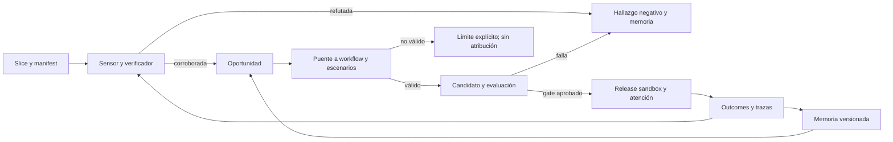
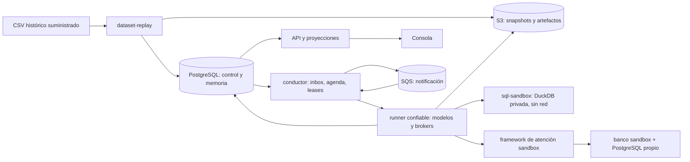
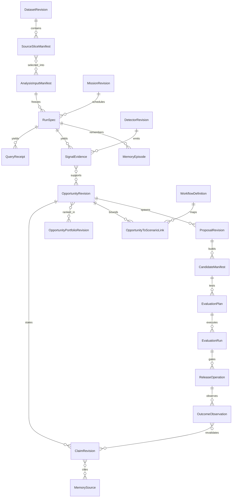
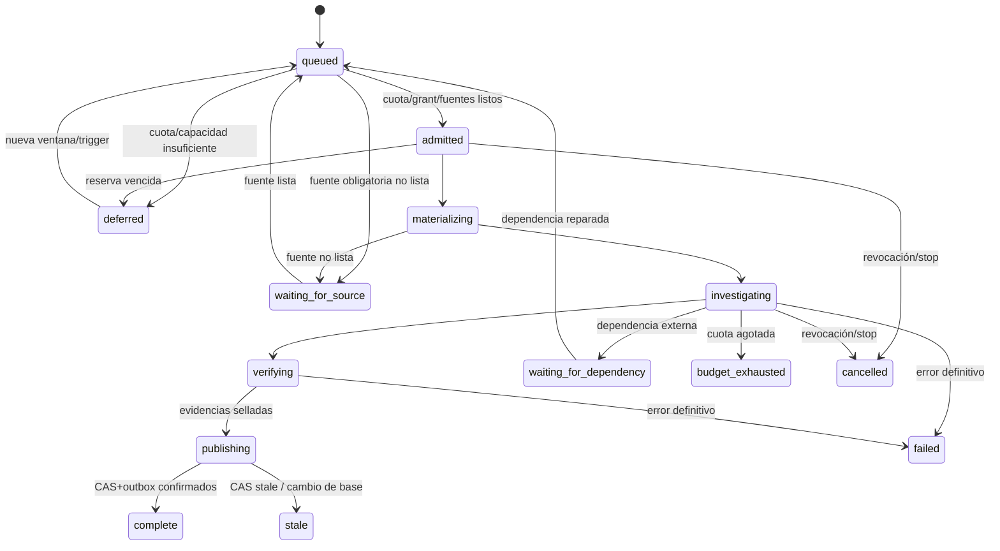
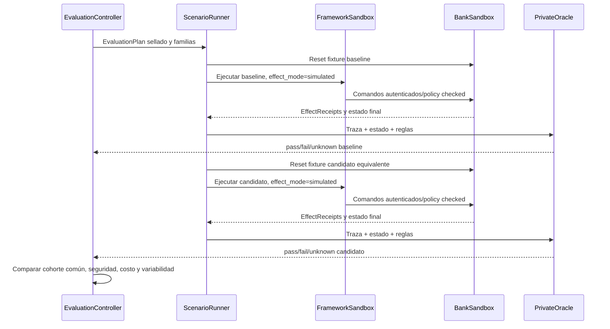
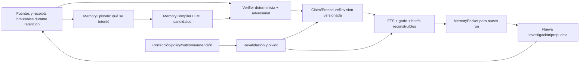
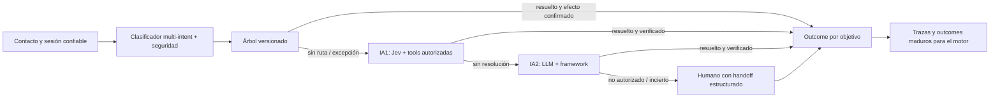

# Pulso: tech spec del motor de detección y automejora — V1 (sustituida)

> Esta versión se conserva como historial de diseño. Para implementación, revisar `TECH_SPEC_PULSO_AUTOMEJORA_V2.md`, que amplía el alcance a toda la plataforma y simplifica arquitectura y persistencia. Sus decisiones prevalecen sobre V1.

**Estado:** propuesta para revisión del usuario; no es software implementado. **Fecha:** 29 septiembre 2026. **Alcance de evidencia:** dataset sintético Factored v1.0.0 disponible localmente, PDFs de la convocatoria y fuentes técnicas enlazadas al final. **Dueño de decisiones pendientes:** equipo Pulso. Este documento es autosuficiente para el equipo de desarrollo; los specs anteriores son contexto, no contratos implícitos.

**Lectura E2E:** un slice nuevo despierta una misión; el sensor cuantifica una anomalía; un investigador intenta refutarla; si sobrevive, se abre una oportunidad y se recupera memoria pertinente; el planner propone alternativas; el builder entrega un cambio versionado; evaluador lo prueba contra la versión activa con casos separados de desarrollo y finales; policy permite sólo release sandbox; la atención genera trazas y outcomes que alimentan la próxima vuelta. Cada flecha tiene un receipt y puede terminar en `unknown`, `refuted`, `blocked` o `not_evaluable` sin fabricar éxito. Para el ejemplo de quejas, la salida sólo dirá «mejora del problema detectado» si `OpportunityToScenarioLink` demuestra que señal, población, workflow y escenario tratan el mismo objetivo.



## 1. La decisión que cambia el diseño

Construiremos un **motor general de evolución del servicio**, no un sistema codificado para quejas. Recibe fuentes históricas, telemetría de la atención que él mismo opera y restricciones de dominio; observa, investiga, recuerda, propone cambios de capacidades, ejecuta evaluaciones y libera únicamente dentro de la autoridad concedida. La demostración de la hackathon usa un **recorrido bancario enfocado** que emerge de un corte congelado del dataset y se repite de forma determinista. No creamos de antemano una `Opportunity{quejas}` ni declaramos que el motor descubrió aquello que configuramos como respuesta.

El problem statement adjunto exige un prototipo funcional de atención, con caso normal, ambiguo y humano, español y portugués, componente aprendido comparado con baseline, evaluación retenida, permisos fuera del prompt y evidencia honesta. El kickoff adjunto pide repositorio público, despliegue, 4-6 slides y video. Por tanto, el motor de automejora es el diferencial técnico, pero **no reemplaza** una atención E2E demostrable. El dataset es sintético y **todo su texto es español** según el resumen; interacciones portuguesas deben etiquetarse como casos generados/evaluación, nunca como tráfico observado.

### 1.1 Dos horizontes y tres niveles de evidencia

| Horizonte | Qué entregamos | Qué no afirmamos |
|---|---|---|
| Hackathon, 10 días | Una ruta de atención enfocada, framework adapter ejecutable en sandbox, motor que encuentra y evalúa una mejora sobre el dataset/replay, demo ES/PT, setup repetible y evaluación held-out | Banco real conectado, rollout a usuarios reales, ahorro causal medido |
| Arquitectura de producto | Contratos y módulos que admiten fuentes/atención reales, controles, memoria, canary y operación continua | Que permisos regulatorios, conectores o infraestructura productiva ya existen |

Cada artefacto lleva **`EvidenceContext` de ejes independientes**, no una escala lineal: `provenance_kind=supplied_synthetic_dataset|team_generated|authorized_future_bank|external_assumption`, `validation_level=unverified|reproducible|adjudicated|offline_evaluated|live_observed`, `effect_environment=none|sandbox|live` y refs. Así, un caso derivado de CSV sintético puede evaluarse offline en banco sandbox sin volverse resultado bancario real. `assurance_level` de docs anteriores queda sólo como etiqueta visual derivada, nunca campo de autoridad ni orden total. Correlación no es causa. Ahorro monetario usa `value_model_revision` con supuestos/rango, no margen realizado.

### 1.2 Dentro y fuera de alcance

**Dentro de arquitectura:** ingesta/replay de 13 tablas; calidad y lineage; detectores generales; investigación con SQL libre aislado; memoria versionada y olvido; planificación de alternativas; adapter de construcción/evaluación de capacidades; escenarios reales derivados y adversariales; release simulado; consola de observabilidad/decisión mínima; auth y autorización del banco sandbox; pruebas multiidioma y de seguridad; Terraform local/AWS propuesto; metodología TDD por cortes. **Dentro del corte P0 de diez días:** una partición acotada con contratos para las fuentes que usa el caso, un recorrido completo, memoria mínima funcional y reportes; las otras tablas se inventarían/validan por contrato pero no se cargan todas en la demo. §19 define la ruta crítica y el fallback sin rebajar los mínimos de Factored.

**Fuera del primer prototipo:** mover dinero, aprobar crédito, escribir en sistemas bancarios reales, entrenar modelos fundacionales, canary real de clientes, inferir outcome de producción desde el CSV, inventar políticas bancarias autorizadas. Los puertos existen para reemplazos futuros; un `NotImplemented/DependencyBlocked` visible es preferible a un éxito ficticio.

## 2. Fuentes reales, límites y regla de procedencia

El código usa `PULSO_DATA_ROOT` (mount readonly `/data`), no una API live ni una ruta Windows fija. En este workspace la fuente observada está en `data/`. El resumen oficial anuncia ~19 millones; el inventario local previamente auditado tiene 13 tablas y recuentos distintos: `customers` 150,000, `products` 400,000, `branches` 350, `service_agents` 1,200, `marketing_campaigns` 200, `daily_exchange_rates` 13,164, `transactions` 4,425,008, `call_center_interactions` 686,296, `call_transcripts` 171,321, `satisfaction_surveys` 212,759, `digital_events` 15,620,994, `complaints` 67,095 y `campaign_sends` 1,746,801. Estos números son del inventario local previo `output/eda_aggregates.json`, **no** contrato: primera ejecución recalcula filas, hashes, cobertura y nulos en `SourceSliceManifest`/`DatasetRevision`. Nunca copiar credenciales del diccionario a código, logs o repo público.

| Fuente/grano | Claves y tiempo disponibles | Permite | No permite por sí sola |
|---|---|---|---|
| `customers`/cliente; `products`/producto | `customer_id`, `product_id`, estados, `days_past_due`, `last_updated` | Segmentación, elegibilidad descriptiva, mora por producto | Motivo causal de impago, historia completa de estados |
| `call_center_interactions`/contacto; `call_transcripts`/transcripción | `interaction_id`, `customer_id`, `interaction_date`, `process_date`, `contact_reason`, `reason_category`, `was_resolved`, `requires_followup`; texto sólo para subconjunto | Demanda por categoría **gruesa**, resolución declarada, posibles temas en población con texto | Subtemas del universo total: `contact_reason` coincide con `reason_category` en audit previo; intents/temas precalculados no son gold; resolución verificada |
| `complaints`/PQR; `satisfaction_surveys`/respuesta | `complaint_id`, `origin_interaction_id` opcional en esquema pero vacío en el audit previo, fechas/SLA/estado; `interaction_id` de encuesta | Queja formal, tiempos, satisfacción respondida y cobertura | Join exacto PQR-contacto en esta copia; que CSAT/NPS representa a todos |
| `digital_events`/evento; `transactions`/transacción | `event_id`, `session_id`, `event_date`; `transaction_id`, `transaction_date`, `transaction_status`, `response_code`, `amount_usd` | Fricción digital, aprobaciones/rechazos y secuencia temporal candidata | Unión exacta entre evento digital y transacción cuando no hay ID compartido; causa de contacto por mera proximidad |
| `campaign_sends`/envío; `marketing_campaigns`/campaña | `send_id`, `campaign_id`, delivery/open/click/conversion | Embudo declarado y costo de envío | Incrementalidad causal sin asignación/control fiable |
| `branches`, `service_agents`, `daily_exchange_rates` | IDs y referencias | Cortes operativos y USD coherente | Que promedios de agentes demuestren calidad causal sin mezcla/carga |

**Regla:** `SourceContract` declara grano, clave, eventos de tiempo, esquema, columnas permitidas, clasificación, tolerancia de calidad, ventanas y semántica de actualización. La presencia de `process_date` no significa CDC, ni una partición tardía significa corrección del mismo registro. `ReplayAdapter` ordena archivos por un reloj virtual y emite `SourceChange` etiquetado `replayed`; casos de actualización/corrección que no existen en archivos se prueban con **fixtures sintéticos** etiquetados. Para la demo, una tabla derivada une por clave explícita cuando existe; cualquier vínculo por cliente+ventana temporal conserva `link_method=temporal_candidate` y jamás se reporta como verdad individual.

La auditoría previa de CSV suma **23,495,188 filas**, frente al ~19 millones nominal del PDF; no se resolverá escogiendo el número más atractivo. También encontró sólo 171,321 transcripciones frente a 686,296 contactos, encuestas de 212,759 interacciones y `origin_interaction_id` no poblado en PQR. Estas observaciones abren `DataQualityFinding` y exigen reconteo/hash/cobertura en el nuevo pipeline antes de convertirse en claims reproducibles. El histórico carece de sesiones de autenticación, políticas versionadas, herramientas/efectos, trazas de cuatro capas, asignación canary y costos reales: el prototipo deberá **producir** estas entidades en su sandbox, nunca adjudicarlas al CSV.

Una revisión adversarial recorrió los 1,097 CSV de transcripciones: 171,321 enlazan con una interacción; 162,864 (95.06%) llevan `detected_intents=consulta_general` y **171,321/171,321** contienen `saldo` en `customer_text`, incluso 29,198 clasificados como `Queja` en contactos. Es evidencia de textos plantilla/incoherencia semántica en esta copia, no evidencia de que todos los clientes preguntaron por saldo. `DataQualityFinding{text_unfit_for_intent}` bloquea usar `detected_intents`, `main_topics`, texto o `contact_reason` como gold de motivos/subtemas. Recontar en el nuevo manifest; si persiste, transcripciones sólo sirven como input sintético limitado de prueba, no como base de prevalencia semántica. `complaints.subcategory` sigue siendo demanda PQR independiente sin unión exacta a contacto.

El audit exhaustivo de `complaints.description` halló 67,095 filas pero **sólo cinco textos distintos**, plantillas de categoría. `DataQualityFinding{description_template_only}` prohíbe derivar de esa descripción un caso individual, causa concreta, transacción afectada u oracle. La fábrica puede usar categoría/subcategoría/estado/fechas como atributos estructurados, pero un relato específico de cliente sería `team_generated`. Para benchmark textual, deduplicar/particionar además por `template_family` o hash de texto normalizado, no sólo cliente; de lo contrario el held-out mediría repetición de plantilla.

### 2.1 Contrato mínimo por cada una de las 13 tablas

El archivo físico es la fuente de schema efectivo; esta matriz fija el grano y la unión admisible que el parser debe validar. Duplicados intencionales se registran en cuarentena y una vista canónica por PK se crea con regla versionada, no con `DISTINCT` indiscriminado. Toda unión 1:N debe declarar grano destino y recuento antes/después para evitar inflación.

| Tabla | Grano/PK | Reloj y enlace admisible | Gate especial |
|---|---|---|---|
| `customers` | cliente / `customer_id` | `registration_date`, `last_updated`; enlaza por customer_id | Snapshot actual, no historial de estatus; PII directa excluida de lab |
| `products` | producto / `product_id` | `opening_date`, `last_updated`; customer_id FK | `days_past_due` sólo créditos y estado al snapshot; no historia de mora |
| `branches` | sucursal / `branch_id` | `branch_opening_date`; FK de dimensiones/eventos si presente | No inferir causa geográfica por correlación |
| `service_agents` | asesor / `agent_id` | `hire_date`; FK de interacción/PQR si presente | `avg_csat` agregado no sustituye surveys con denominador |
| `marketing_campaigns` | campaña / `campaign_id` | `start_date/end_date`; FK de send | Budget no prueba gasto efectivo; status snapshot |
| `daily_exchange_rates` | fecha+moneda origen+destino | `date`; join por fecha/pares | Comprobar cobertura y dirección; preferir `amount_usd` presente validado |
| `transactions` | transacción / `transaction_id` | `transaction_date`, `process_date`; customer/product FK | Rechazo ≠ falla técnica; no enlaza contacto por transaction_id |
| `call_center_interactions` | contacto / `interaction_id` | `interaction_date`, `process_date`; customer/agent FK | reason es categoría gruesa; `was_resolved` operacional, no outcome verificado |
| `call_transcripts` | transcripción / `transcript_id` | `process_date`; `interaction_id` FK explícita | Cobertura parcial; `detected_intents/main_topics` weak labels |
| `satisfaction_surveys` | respuesta / `survey_id` | `survey_date`, `process_date`; `interaction_id` FK si presente | Filtrar `survey_type`: CSAT 1–5, NPS 0–10; denom respuestas y tasa de cobertura |
| `digital_events` | evento / `event_id` | `event_date`, `process_date`; customer/session/product | No FK a transaction/contact; `customer_id` puede ser nulo |
| `complaints` | PQR / `complaint_id` | `creation_date`, `process_date`, fechas atención; customer/product | `origin_interaction_id` vacío en audit: no join exacto; `sla_breached` es flag suministrado, no cómputo legal sin `PqrClockRule` |
| `campaign_sends` | envío / `send_id` | `send_date`, `process_date`; customer/campaign FK | `had_conversion` declarado, no uplift incremental; costo por send si presente |

Para evitar multiplicación, `contact → transcript` usa `interaction_id` y política explícita si >1 transcripción; `contact → survey` usa `interaction_id` y tipo de encuesta, con potenciales múltiples respuestas. `contact → PQR` no tiene llave poblada en esta copia: sólo asociación agregada por customer+ventana con tasa de coincidencia y control temporal, **nunca** reconstrucción de episodio individual ni causa probada. CSAT es media/distribución entre encuestas CSAT respondidas; NPS = %promotores (9–10) − %detractores (0–6), pasivos 7–8, entre encuestas NPS respondidas. Reportar tasa de respuesta por universo de contactos elegibles y sesgo posible. `PqrClockRule` debe declarar país, días hábiles/calendario, pausas y vigencia si alguna vez calculamos SLA normativo; en v1 sólo se analiza el flag y tiempos observados.

## 3. Decisiones de arquitectura y alternativas rechazadas

| Tema | Decisión v1 | Alternativa y razón de descarte ahora |
|---|---|---|
| Código | Monorepo Cargo workspace + consola web + Terraform | Microservicios por etapa multiplican contratos/deploys en 10 días; monolito único mezclaría fronteras de confianza |
| Procesos | API, conductor, runner confiable y SQL sandbox no confiable; framework/banco sandbox separables | Un proceso para todo facilita escapes y derriba atención con investigación |
| Persistencia | PostgreSQL autoridad de workflow/memoria + blobs S3; DuckDB privada por run/rama | SQLite+DuckDB duplica motores; DuckDB compartida mutable complica aislamiento; sólo blobs no hacen CAS/colas fiables |
| Mensajería | SQS para despertar, inbox/outbox en PostgreSQL para verdad durable | Confiar en entrega única/orden global de SQS no es seguro |
| Modelos | Jev para juicios tipados estrechos; LLM generativo para investigación/plan/critica; reglas para invariantes | Un LLM como policy engine o Jev como planificador abierto confunden capacidades |
| Simulación | Dependencias propias reales en contenedores; banco de prueba con datos y estado; proveedor LLM real si permitido + adaptador grabado sólo para tests deterministas | Mockear todas las llamadas no prueba integración; usar datos privados/no autorizados en un proveedor tampoco es aceptable |
| AWS | Fargate para API/conductor; RDS/S3/SQS; runner de SQL libre en host de sandbox aislado propuesto (p.ej. EC2 con Podman rootless) | Un sidecar de Fargate no demuestra aislamiento sin red; la elección AWS final exige threat-model/benchmark |

La elección de host sandbox es diseño propuesto, no seguridad demostrada. Se exige prueba de escape, egress, montaje, límites de recursos y revocación antes de cualquier uso fuera del entorno local. `podman compose` depende de un proveedor Compose externo y LocalStack califica Podman como experimental; fijar versiones y ejecutar smoke tests es un gate, no una nota al pie.

### 3.1 Topología de ejecución



El LLM no accede a credenciales del banco, Postgres de control ni S3. El runner sólo le entrega un `AnalysisInputManifest` y un canal SQL brokerizado para lectura/derivación dentro de la DuckDB efímera. Toda mutación fuera del laboratorio (construir candidato, cambiar routing, emitir notificación, publicar conocimiento, contactar cliente) pasa por comando tipado, política y receptor. Escribir una tabla scratch en la DuckDB propia no cuenta como efecto externo.

### 3.2 Repositorio y dependencias permitidas

```text
pulso/
  Cargo.toml                       # workspace, versiones fijadas
  crates/domain/                   # valores, invariantes, estados; sin IO
  crates/contracts/                # JSON Schema/proto y migraciones de contratos
  crates/application/              # casos de uso + puertos tipados
  crates/dataset-replay/           # parsers, snapshots, fuentes y lineage
  crates/detection/                # MetricSpec, sensores, verificación
  crates/investigation/            # misiones y broker de laboratorio
  crates/memory/                   # compiler, retrieval, revalidation, forgetting
  crates/evolution/                # alternativas, candidate/build/release
  crates/evaluation/               # escenarios, oráculos, experimentos
  crates/framework-port/           # cliente de capacidades de atención
  crates/policy/                   # autoridad, privacidad, presupuestos
  crates/adapters-postgres/        # repositorios, inbox/outbox/CAS
  crates/adapters-aws/             # S3/SQS y configuración de endpoints
  crates/telemetry/                # tracing, IDs, métricas
  apps/api/                        # HTTP read model + comandos autorizados
  apps/conductor/                  # scheduler, leases, workers
  apps/runner/                     # proceso confiable, brokers
  apps/sql-sandbox/                # ejecutor DuckDB aislado
  apps/console/                    # UI; consume API, no blobs directos
  fixtures/bank-sandbox/           # API de pruebas y datos semilla
  fixtures/framework-sandbox/      # adapter ejecutable y efectos aislados
  infra/aws/                       # Terraform AWS
  infra/demo/                      # VM pública de demo, sin dataset
  infra/localstack/                # Terraform S3/SQS locales
  deploy/compose.yaml              # Podman Compose con versiones fijadas
  tests/contract/ tests/e2e/ tests/security/
  docs/adr/ docs/runbooks/
```

Regla de dependencia: `domain →` nada externo; `application → domain/contracts` y puertos; módulos de negocio → application/domain; adapters → puertos; apps son composición. Ningún crate de dominio importa AWS, HTTP o SDK de modelo. No crear un crate por entidad; separar donde cambian política, ciclo de vida o frontera de confianza. `FrameworkPort` es interfaz verificable aunque el builder interno del framework sea provisional.

## 4. Modelo de datos durable: identidad, revisión y relaciones

PostgreSQL guarda metadatos/estado transaccional; S3 guarda blobs cifrados por contenido; DuckDB scratch desaparece. ID wire v1 = UUIDv7 lowercase; no implica secuencia causal. Cada **revisión de artefacto** incluye `tenant_id`, `contract_version`, `created_at`, `created_by_kind`, `revision`, `evidence_context`, `source_refs[]` y digest según tipo; ejecución mutable tiene `state_version` aparte. FKs lógicas a blobs se validan antes de commit; fila guarda `BlobRef` interno namespaceado. Proyecciones UI se reconstruyen. No se edita contenido de revisión; CAS mueve `artifact_heads.current_revision` con `expected_revision` y `grant_epoch`.



### 4.1 Entidades y constraints que el equipo implementa

| Entidad | Campos decisivos y grano | Invariante verificable |
|---|---|---|
| `SourceSliceManifest` | archivo/partición, ruta/hash, filas, columnas/tipos, min/max tiempos, clasificación, quality report | Digest apunta a bytes exactos; replay duplicado produce mismo ID |
| `DatasetRevision` | lista ordenada de slices+SourceContract refs, canonical digest | Revisión del conjunto; no confunde un archivo con el dataset entero |
| `AnalysisInputManifest` | selección de slices con observed cutoff, event window, effective rule, watermark, schema/policy e `information_partition` por fuente | Dueño único de cortes reproducibles del run; RunSpec sólo referencia digest; final holdout no es legible en desarrollo |
| `SourceContract` | fuente, schema version, grano/PK, event/observed/valid clocks, reglas de normalización, columnas permitidas | Parser rechaza grano ambiguo; unknown explícito, no relleno silencioso |
| `MissionRevision` / `RunSpec` | objetivo/ámbito, input manifest digest, policy/model/grant refs, quotas, trigger refs, replay clock | RunSpec se sella antes de ejecutar; no duplica cutoff del manifest |
| `SignalEvidence` | metric ref, población, numerador/denominador, baseline, diferencia, intervalo, calidad, query receipts | Sin denominador/frescura no hay magnitud afirmada |
| `DetectorRevision` | `MetricSpec`, versión, estado candidate/shadow/active, costos y lineage de origen | Sus propias señales no verifican la hipótesis que lo creó |
| `ClaimRevision` / `OpportunityRevision` | hecho/hipótesis/supuesto, soporte y contraevidencia, población, incertidumbre, estado, owner | Un claim refutado no puede ser soporte activo sin revisión nueva |
| `OpportunityPortfolioRevision` | miembros, solapamiento, dependencias, valor marginal y `do_nothing` | Nunca suma dos máximos monetarios sobre la misma población/causa |
| `WorkflowDefinition` / `OpportunityToScenarioLink` | objetivo, elegibilidad, acción/oráculo; prueba de concordancia entre señal histórica y caso evaluado | Si el link falla, el escenario no demuestra mejora del problema detectado |
| `ProposalRevision` / `CandidateManifest` | mecanismo, alternativas, dependencia, costo/riesgo, capability bundle, base revision, digests | No escribe versión activa; build/compatibilidad con receipt |
| `ScenarioCase` / `OracleSpec` | lineage, fixture, tarea, estado inicial, acción permitida/prohibida, resultado esperado, split | Caso final nunca entra al loop de iteración; oracle missing = unknown |
| `EvaluationPlan` / `EvaluationRun` | comparador, cortes, assignment, seeds, modelos/prompts, rubricas, budgets, results | Baseline y candidato ven misma población elegible; fallos cuentan |
| `ReleaseOperation` / `OutcomeObservation` | target bundle, expected active, grant epoch, stage, scope, assignment, exposure, efecto | Timeout externo = unknown/reconcile, nunca éxito presumido |
| `MemorySource` / `MemoryEpisode` / `MemoryClaimRevision` / `ProcedureRevision` / `MemoryEdge` | evidencia, run, proposición/procedimiento versionado, relaciones | Wiki derivada no es fuente primaria ni instrucción automática |
| `DecisionRequest` / `AuditEvent` | acto exacto, autoridad, opciones, plazo, evidencia; actor/tiempo/resultado | Silencio no aprueba; todos los cambios conservan recibo |

Índices iniciales: `(tenant_id, source, event_time)` para datos normalizados, `(tenant_id, state, next_eligible_at)` en ejecuciones, `(tenant_id, opportunity_fingerprint, current_revision)`, `(tenant_id, memory_scope, lifecycle_status, valid_to)`, `(tenant_id, case_family, split)`, `(tenant_id, release_stage, capability_scope)`; inbox de **slice** usa UNIQUE `(tenant,source,partition,digest)` y corrección **de registro** futura usa `(tenant,source,source_record_id,source_revision)` en tabla diferente; comandos UNIQUE `(tenant,namespace,key)`. Retención, PII/volumen deciden particionado; no indexar todo por intuición.

### 4.2 Esquema mínimo del control plane (migraciones P0)

| Tabla y PK | Columnas/constraints indispensables | Quién escribe y regla |
|---|---|---|
| `source_slices(tenant_id,slice_id)` / `source_partition_heads(tenant_id,source_id,logical_partition_key)` | slices: `logical_partition_key,digest,source_generation,supersedes_slice_id,contract_ref,observed_at,quality_ref,blob_ref`; UNIQUE `(tenant,source,partition,digest)` y `(tenant,source,partition,generation)`; head: `slice_id,head_version` | Dataset-replay; slice insert-only; CAS de head exige generación previa exacta |
| `dataset_revisions(tenant_id,dataset_rev)` / `analysis_manifests(tenant_id,manifest_digest)` | lista **ordenada** de slice refs; manifest: cortes, `information_partition` por fuente, treatment/policy refs y canonical JSON digest | SourceAdapter/runner; inmutables |
| `run_specs(tenant_id,run_id)` | `mission_ref,analysis_manifest_digest,policy_ref,grant_epoch,trigger_set_ref,budget_ref,supersedes_run_id,sealed_at` | Conductor; insert-only |
| `run_executions(tenant_id,run_id)` + `job_steps(tenant_id,run_id,step_id)` | `state,state_version,attempt,lease_epoch,lease_until,next_eligible_at,error_ref`; FK a run_specs | Conductor/worker; CAS `state_version` y fencing |
| `artifact_revisions(tenant_id,kind,artifact_id,revision)` | `body_blob_ref,digest,evidence_context,created_at`; no UPDATE de body | Publicadores; inmutable |
| `artifact_heads(tenant_id,kind,artifact_id)` | `current_revision,head_version,grant_epoch`; FK a artifact_revisions | PG CAS serializa publicación/rollback |
| `dependency_edges(tenant_id,from_ref,to_ref,edge_kind)` | FK lógica a revisiones, índice inverso `(tenant,to_ref)` | Publicador; invalidación transita en grafo, no sólo JSON |
| `source_inbox(tenant_id,source,partition,digest)` / `job_inbox(tenant_id,event_id)` | payload digest, receive/commit timestamps, receipt ref | Ingestor/conductor; dos granos distintos (`SliceArrived` vs job/event) |
| `outbox(tenant_id,event_id)` | type, payload ref, attempt, next_retry_at, sent_at | Misma transacción PG que cambio durable; publisher idempotente |
| `idempotency_records(tenant_id,namespace,key)` | `payload_digest,receipt_ref,status`; UNIQUE key | Receptor de comandos; mismatch = conflict |
| `memory_sources`, `memory_claim_revisions`, `memory_edges`, `memory_tombstones` | refs, scope, ejes de estado, valid/observed clocks, epochs y propagación | MemoryPort; CAS de head, bloqueo desde tombstone |
| `detector_revisions`, `opportunity_portfolio_revisions`, `workflow_definitions`, `opportunity_scenario_links` | artefacto/revisión y refs de evidencia; estado, split, población, concordancia y motivos de rechazo | Publicador con CAS; las proyecciones/revisiones antiguas no se sobrescriben |
| `evaluation_cases`, `evaluation_runs`, `release_operations`, `exposure_ledger` | split/info partition, bundle/baseline ref, estado/efecto/assignment por episodio | Evaluator/framework; sin borrar resultados fallidos |

No `ON DELETE CASCADE` sobre evidencia/lineage: supresión aplica por política/tombstone y deja auditoría mínima permitida. Migraciones expand/contract deben permitir app N y N−1 simultáneas; rollback de código no rebobina hechos. `schema_version` de tabla SQL y `contract_version` de wire son cosas distintas. Tests de dos workers, invalidación transitiva, migración rolling y recuperación desde outbox son obligatorios antes de conectar etapas.

## 5. Contratos públicos y frontera de efectos

Wire v1 = JSON/Serde + JSON Schema/OpenAPI (sin proto paralelo), IDs UUIDv7 lowercase, timestamps RFC3339 UTC, enum values `snake_case`, dinero como `decimal string` o integer minor units con currency explícita (nunca float binario). Envelope: `contract_version:{major,minor}`, `event_type`, `tenant_id`, `correlation_id`, `causation_id`, `occurred_at`, `recorded_at`, `idempotency_key`, `evidence_context`. Minor agrega campos opcionales con defaults documentados; major cambia semántica. Consumer puede ignorar campos opcionales desconocidos de minor compatible, pero rechaza major desconocido y enum desconocido que afecte decisión; persiste versión original y upcaster probado. N/N−1 contract tests cubren rolling deploy. Una misma clave+payload digest devuelve receipt existente; misma clave+payload distinto da `conflict`. `unknown` es estado de primera clase. Errores wire `snake_case`: `invalid_input`, `forbidden`, `stale_revision`, `dependency_blocked`, `budget_exhausted`, `source_not_ready`, `provider_unknown`, `inconclusive`, `external_effect_unknown`.

| Puerto | Operación/entrada → salida | Garantía |
|---|---|---|
| `SourceAdapter` | `inspect(source_ref) → SourceContract/quality`; `stage_slice(source,partition) → SourceSliceManifest`; `assemble_dataset(slice_refs) → DatasetRevision` | No confirma cursor hasta transacción PG de slice+inbox+outbox |
| `JobTransport` | `publish(job_ref)`; `receive() → job_ref`; `extend_visibility()`; `ack()`; `dead_letter(reason)` | At-least-once; ack sólo tras estado PG terminal/receipt; DLQ y sweeper |
| `SandboxPort` | `create(AnalysisInputManifest, allowed_partitions, purpose) → sandbox_id`; `query(sql, params, budget) → QueryReceipt/result`; `close()` | Sandbox por run/rama, sin red ni creds; `final_locked` no se monta en desarrollo; SQL libre dentro de límites OS/tenant |
| `ModelPort` | `judge_jev(state, typed_questions)` o `reason_llm(context, task, budget)` → resultado+`ModelReceipt` | Versiones, entradas tratadas, uso/costo; revocación revalidada al publicar o efectuar |
| `FrameworkPort` | `prepare(candidate)`, `execute_scenario(ScenarioExecutionRequest)`, `attest(digest)`, `apply_routing(ReleaseOperation)`, `stop(release)`, `observe_exposure()` | Receptor verifica base/epoch/entorno; v1 rechaza `environment=live` por tipo/política; confirmed/rejected/unknown |
| `BankSandboxPort` | `reset(fixture_ref,seed) → state_digest`; `query_state(scope)`; `reconcile_effect(key)` | Estado baseline/candidato aislado, receptor de efectos con recibos reales sandbox |
| `PolicyEvaluator` | `authorize(AuthorizationContext{tenant,actor,operation,resource,purpose,environment,policy_ref,grant_epoch}) → Permit/Deny` | Autoridad actual en cada efecto, no prompt |
| `MemoryPort` | `retrieve(scope, cutoff, information_partition, allowed_purposes, grant_epoch, source_epoch, memory_head) → MemoryPacket+Receipt`; `propose_revision(candidate)`; `revalidate(change)` | Filtra contra PG autoritativo, no sólo índice eventual; jamás devuelve contenido/derivados de holdout final a planner; CAS/epochs y lineage |
| `BlobStore` | `put_immutable(bytes, BlobPolicy{tenant,purpose,classification,retention,key_id,epoch}) → BlobRef`; `verify(ref)` | Namespace por tenant/propósito; sin dedup sensible cross-tenant; blob antes de CAS |
| `WallClock` / `ReplayClock` | `WallClock.now_monotonic/utc()` para leases, grants y deadlines; `ReplayClock.event_time()` sólo para datos/escenarios | Mover reloj de replay no extiende permiso ni lease |

**Endpoints v1** (HTTP JSON; OpenAPI se genera en CI): `POST /v1/replay-runs`, `GET /v1/runs/{id}`, `GET /v1/runs/{id}/discovery-report` (incluye hallazgo negativo; nunca 404 por no haber oportunidad), `GET /v1/opportunities?state=`, `GET /v1/opportunities/{id}`, `GET /v1/opportunities/{id}/evidence`, `GET /v1/candidates/{id}/evaluations`, `GET /v1/releases/{id}`, `GET /v1/memory/claims/{id}/lineage`, `POST /v1/decision-requests/{id}/responses`, `POST /v1/missions/{id}/run`. Un usuario puede investigar/objetar/aportar autoridad/limitar alcance; no necesita presionar «siguiente fase» en cada paso. `POST .../responses` requiere actor autenticado, permiso, `expected_revision`, opción exacta y comentario cuando rechaza/objeta. Timeout toma opción segura declarada, nunca aceptación tácita.

**Ejemplo esquemático (no wire válido) de `RunSpec`**, donde `...` representa refs/UUIDv7 que deben sustituirse por valores conformes al schema generado:

```json
{
  "contract_version": {"major": 1, "minor": 0},
  "event_type": "run_spec_sealed",
  "run_id": "run_...",
  "mission_revision": "mission_...@3",
  "trigger_refs": ["source_change_..."],
  "analysis_input_manifest_digest": "sha256:...",
  "policy_revision": "policy_...@2",
  "grant_epoch": 7,
  "model_bundle_revision": "models_...@4",
  "budget": {"cpu_seconds": 600, "memory_mb": 2048, "sql_output_bytes": 1000000, "model_usd": "2.00"},
  "evidence_context": {"provenance_kind": "supplied_synthetic_dataset", "validation_level": "reproducible", "effect_environment": "none"}
}
```

Las cifras de budget son **parámetros ilustrativos por configurar** y nunca umbrales de negocio inferidos del dataset. `AnalysisInputManifest` contiene para **cada** fuente `source_slice_digests`, `observed_cutoff`, `event_window`, `effective_rule`, `watermark`, `information_partition`, `schema_version` y política/tratamiento; hash de JSON canónico. `RunSpec` no duplica esos cortes. `SourceRef` tiene path/partición/digest, fuente, esquema, clasificación, `event_time`, `observed_at` y `effective_from`; si no existe vigencia, `unknown`. `QueryReceipt` guarda hash de SQL+parámetros, manifest, DuckDB version, filas/bytes completos o truncados, costo/error; SQL crudo y resultados sensibles quedan protegidos. `EffectReceipt` exige estado externo **confirmado por receptor**; LLM o timeout no confirman.

`ScenarioExecutionRequest` = `{scenario_id, fixture_revision, bundle_revision, seed, effect_mode, environment, policy_revision, expected_generation}`; respuesta incluye `before_state_digest`, `after_state_digest`, trace, `EffectReceipt[]`, resultado `confirmed|rejected|unknown` y `evidence_context`. `BankSandboxPort.reset` devuelve digest inicial que debe coincidir baseline/candidato; orden de brazos se invierte en test para descubrir contaminación. `environment=live` no existe como variante permitida en v1 del prototipo, no es un booleano que el modelo pueda activar.

## 6. Máquina de estados y protocolos de ejecución



**Ingesta exacta:** stage del blob S3 → verificar hash → transacción PG que inserta `SourceSliceManifest`/source_inbox/cursor/outbox con llave `source+partition+digest` → ack de fuente; outbox publica SQS. Crash antes de PG deja blob staged huérfano para GC; después de PG, retry ve la misma llave. `DatasetRevision` se ensambla con lista ordenada de slices y no es el evento de una partición. **Admisión:** coalescer crea `TriggerSet` por misión/ámbito/ventana; `RunAdmission` consulta cobertura, cooldown, cuota, prioridad, grant y capacidad. Devuelve `Admitted(reservation, lease_class)` o `Deferred(reason,next_eligible_at)`. Scheduler reserva recursos por tenant y exploración abierta; backpressure demora. **Consumo:** receive SQS → reclamar `JobStep` PG con lease/fencing → heartbeat de lease/visibilidad SQS → ejecutar → commit terminal PG+receipt → ack SQS. Redelivery/worker viejo recibe receipt o es fenced. `sweeper` reconcilia leases vencidos en `materializing/investigating/verifying/publishing`; poison tras límite de intentos va DLQ+`failed` visible.

**Commit entre stores:** `Draft` PG → escribir blob S3 → verificar digest/retención → transacción PG `CAS(expected_head, grant_epoch, source_versions)` + `outbox` → `Published`. Si cae antes de CAS, reconciler puede borrar blob huérfano tras política o reutilizarlo; si cae después, el outbox reemite. Nunca se afirma exactamente-once del proveedor externo; se obtiene efecto idempotente/reconciliable en nuestro límite. Una corrección tardía o revocación aumenta revisión/epoch, marca resultados dependientes `stale_pending_revalidation` y bloquea promoción nueva. Runs fijados al manifest antiguo conservan historia sin reescribirse.

| Estado del run | Terminal / lease | Reintento o despertar |
|---|---|---|
| `complete`, `failed`, `budget_exhausted`, `cancelled`, `stale` | Terminal, sin lease y ack SQS tras receipt | Nuevo input/policy/grant crea **successor RunSpec** con `supersedes_run_id`, jamás reabre el sellado |
| `queued`, `admitted` | Pendiente de admisión o reservado; `admitted` posee reserva, no lease de ejecución | Scheduler la admite o difiere; cancelación/expiración libera reserva |
| `waiting_for_source`, `waiting_for_dependency`, `deferred` | No ejecuta ni conserva lease; razón y next eligible persistidos | Evento fuente/dependencia o agenda reintenta admisión del **mismo** RunSpec sólo si manifest/policy/grant siguen idénticos; si cambian, successor y viejo `stale` |
| `materializing`, `investigating`, `verifying`, `publishing` | Lease y fencing activos | Fallo técnico transitorio puede reintentar **mismo** RunSpec con nuevo `attempt` si manifest/policy/grant no cambian; sweeper reconcilia tras timeout |

El reducer de estados rechaza eventos fuera de orden y `grant_epoch` viejo; no hay transición `stale → queued` del mismo run. Fuente/policy/dependencia corregida vuelve obsoleto el run viejo y crea sucesor con manifest nuevo. Adelantar/retroceder `ReplayClock` no cambia expiración de leases/grants calculada por `WallClock`. Tests golden cubren cada transición, redelivery y cambio de input durante retry.

`RunTransition` lleva `run_id`, `from`, `to`, `expected_state_version`, `attempt`, `lease_epoch`, `reason_code`, `observed_at` e `idempotency_key`. El reducer permite sólo aristas del diagrama más `any_nonterminal → cancelled` por revocación y `any_nonterminal → stale` por cambio de manifest/policy/grant; `queued` no ejecuta trabajo y `admitted → deferred` libera reserva vencida. `waiting_for_source → queued` sólo sirve para **materializar una fuente ya referenciada por el manifest sellado**; si llega una slice nueva que altera selección/corte, run antiguo → `stale` y se crea successor. Un fallo técnico dentro de estado con lease incrementa `attempt`/`lease_epoch`, **no** cambia el estado hasta recuperación o terminal. Reducer, DB constraint y golden transition matrix deben coincidir; evento no permitido → `invalid_transition` + AuditEvent sin mutación.

### 6.1 Relojes distintos

`event_time` es cuándo ocurrió el hecho; `observed_at` cuándo entró al sistema; `effective_from/to` cuándo fue válida una política/estado; `run_started_at` cuándo analizamos. Un análisis `as_of` usa **ambos**: datos observados antes del corte y efectivos en el momento consultado. El replay de CSV puede reconstruir llegada según `process_date` si se documenta la regla, pero no inventa historial de cambios de una dimensión que sólo aparece como snapshot final. Los splits de evaluación no permiten hechos conocidos después del cutoff de predicción.

## 7. Flujo F01: datos → snapshot → laboratorio por run

**Objetivo:** transformar archivos aprobados en un contexto analítico libre, reproducible y privado. **Trigger:** bootstrap, nueva partición de replay, corrección fixture o solicitud autorizada. **Actores:** dataset-replay, SourceAdapter, conductor, runner, SQL sandbox.

1. Inventariar hashes de archivos, filas, header/tipos, duplicados PK, nulos de campos obligatorios, FK observables, min/max tiempos, distribución por país y cobertura. Exponer discrepancia entre PDF nominal y CSV como `DataQualityFinding`; no normalizarla lejos.
2. Convertir a shards Parquet tratados, particionados por fuente/fecha/scope y cifrados. Identificadores directos, nombres, direcciones, teléfonos, IP y texto se minimizan/redactan para el propósito. La llave pseudónima es estable sólo dentro del ámbito permitido para poder enlazar; mapping/secret fuera del laboratorio.
3. Sellar `DatasetRevision` y `AnalysisInputManifest` con fuentes/versiones, transformaciones, política, columnas/ámbito y cortes/watermarks **por fuente**. Si tabla requerida no está lista, `source_not_ready`; opcionales `coverage=partial`.
4. Runner monta shards autorizados readonly, crea un overlay DuckDB por run o rama, sin red, sin credenciales y con cuota de disco/CPU/memoria/tiempo. Una rama paralela puede reutilizar el mismo shard inmutable, nunca el overlay mutable de otra rama.
5. Scout/LLM recibe esquema, objetivo y límites; ejecuta SQL libre y derivaciones temporales. Broker aplica scope, límites acumulados de filas/bytes, política de columnas y `QueryReceipt`; el agente decide qué explorar. Rechazar rutas externas, ATTACH no autorizado, extensiones, lectura de host y egress; DuckDB por sí sola no es sandbox de sistema operativo.
6. Claims salen con evidencia exportada y receipts. Al cerrar, se verifica blob/CAS y se destruye overlay. Retención de la evidencia confirmada se rige por política, no por vida del contenedor.

**Aceptación F01:** mismo manifest+config produce mismo dataset lógico/hash; duplicado de partición no duplica filas; otro tenant no lee shards; SQL libre autorizado funciona; intento `read_csv` de host/egress/ATTACH externo falla; crash antes/después de CAS no pierde hallazgo confirmado ni lo duplica; sandbox se limpia tras timeout. **Pruebas:** unit parser/grain, integración PG+S3+SQS+DuckDB, E2E replay de una partición del dataset suministrado, seguridad de aislamiento/egress.

## 8. Flujo F02: sensor general → señal → problema corroborado

**Objetivo:** que un problema emerja de medidas configurables, no de una respuesta codificada. `MetricSpec` define unidad/población/grano/denominador/ventana/cohortes/baseline/exclusiones/frescura/split. Paquete inicial de familias: demanda y resultado de atención por motivo/canal/país; PQR/SLA; fricción digital y transaccional; producto/activación; campaña/funnel; riesgo descriptivo; salud del propio motor. `DetectorSpec` puede registrar métricas nuevas mediante propuesta versionada; el LLM no ejecuta SQL sin límites ni crea autoridad de métrica por prosa.

**`DiscoveryProtocol v1` predeclarado para ordenar problemas, no para prometer ahorro:** (a) congelar manifest/cutoff y raíz de split por `customer_id` antes de inspeccionar ranking final; (b) candidatos de contacto son las **categorías gruesas** `contact_reason/reason_category` por canal, con grano contacto y denominador de `was_resolved` conocido; `n ≥ 500` y cobertura del flag `≥ 80%` son gates de diseño fijados **antes** del run; el país del snapshot de clientes no se usa como país histórico de un contacto; (c) comparar tasa operacional no resuelta contra resto del mismo canal/periodo, con bootstrap por cliente; `relative_unresolved_burden = n_eligible × max(0, rate_group − rate_reference)` es una **descripción relativa**, no casos evitables: tipos de contacto pueden tener objetivos/horizontes distintos; (d) ordenar por burden, tamaño e ID de categoría, deterministamente; (e) probar estabilidad por ventana/mezcla/semántica con `DiscoverySplitPolicy@1` de §24; (f) si ninguno pasa, emitir `no_supported_opportunity`. Una categoría es hipótesis de demanda, no workflow, causa ni subtema. Familias PQR/transactions usan denominadores y ranking propios, nunca se fusionan para inflar score. `MetricSpec`/protocolo/hash se publican antes de resultados.

La búsqueda por categoría×país×canal/ventanas registra **todas** las celdas exploradas. Bootstrap por cliente captura dependencia intra-cliente pero no corrige multiplicidad: la corroboración usa confirmación en periodo reservado de descubrimiento (distinto del holdout final de atención) o intervalo simultáneo/max-statistic predeclarado. Un test nulo de muchas celdas mide tasa de falsos hallazgos al nivel configurado. Para replay repetible, `DemoRunManifest` fija datos, código, normalización, SQL determinista del ranking, tie-break, seeds, reloj virtual y respuestas de modelo grabadas en perfil `offline-recorded`; `model-live` se reporta aparte con variabilidad, no se exige identidad de su prosa.

**Puente obligado a la demo:** `WorkflowDefinition` versionada declara `goal`, `eligible_episode`, `observable_input`, `trusted_record`, `permitted_action`, `verification`, `handoff`, idiomas y dependencias de policy/tool. `WorkflowFeasibilityAssessment` verifica que los datos permiten **como mínimo** una cota de población/frecuencia, un objetivo representable, registros confiables, acción sandbox permitida y tres escenarios normal/ambiguo/humano; estima `addressable_fraction` como rango separado del burden. El catálogo inicial de workflows candidatos se congela antes de rankear (p.ej. consulta de estado de transacción, estado de PQR, información de cuenta/producto), sin codificar ganador. Se recorre el ranking de problemas y se escoge la **primera definición factible** por regla previa; si la categoría dominante es demasiado heterogénea o `text_unfit_for_intent` impide aislar subflujo, marcar `unimplementable_from_source` y pasar a la siguiente con receipt, no pivot libre ex post. Si ninguna pasa, presentar hallazgo negativo y negociar alcance; no atribuir volumen de una categoría gruesa a un subflujo. Ahorro proyectado sólo usa población direccionable y supuestos explícitos, no `relative_unresolved_burden` como ahorro.

`WorkflowSelectionReceipt` registra `mode=autonomous|manual_fallback`, ranking completo, rechazos, definición elegida, approver cuando manual y momento de sellado. Si no hay oportunidad sustentada, `manual_fallback` es visible en UI/video y no se narra como hallazgo autónomo. `OpportunityToScenarioLink` exige claim histórico → `WorkflowDefinition` elegible → evidencia de concordancia entre fuente y objetivo → ScenarioCase/OracleSpec derivados o límite explícito → ChangeSpec que modifica **esa** ruta. Si la señal es `Queja` gruesa y la evaluación usa fixtures de saldo generados, el link falla: se puede demostrar motor genérico + caso generado, pero **no** «se mejoró el problema detectado en el dataset». La misma limitación aplica a `complaints.description` templática. Test negativo obligatorio fuerza ese mismatch y debe bloquear headline E2E.

1. Recomputar medidas sólo para SourceReadiness válida. Guardar universo elegible, numerador, denominador, intervalo/incertidumbre, comparador y QueryReceipts. Sin denominador o con muestra inmadura: `Observation{unknown}`.
2. Reglas baratas encuentran anomalía absoluta/relativa, cambio contra baseline comparable, cola de alto costo o repetición de ruta humana; cuota de exploración abierta busca motivos/canales/productos no configurados. Jev puede clasificar ejemplos o puntuar señales tipadas; su probabilidad no reemplaza magnitud calculada.
3. `Falsifier` separado intenta romper el patrón: calidad/cobertura, cambio de mezcla, estacionalidad, duplicación, corrección tardía, múltiples cortes explorados, sensibilidad a ventana y cohortes. LLM genera preguntas y consultas; Rust ejecuta checks obligatorios. Un `VerificationReport` incluye refutaciones, no sólo apoyo.
4. `OpportunityMatcher` une signals por población, objetivo y evidencia; similitud textual sola no fusiona. CAS de expediente conserva claim anterior, contraevidencia y `merge/split` explícito. `OpportunityRevision` estado `candidate/corroborated/uncertain/refuted/blocked` y `priority` calculada con rango de valor, costo de construir, riesgo, cobertura y calidad.

**Caso de prueba que evita hardcode:** con corte, protocolo y catálogo de sensores generales congelados, una categoría de contactos sólo aparece si cumple el ranking/falsación; al permutar/eliminar esa evidencia en fixture controlada, el mismo código/config no publica el mismo claim. **No** se extraen subtemas de transcripciones mientras rija `text_unfit_for_intent`; `complaints.subcategory` pertenece a PQR y no se extrapola a contactos. El spec no obliga a que sea quejas: si no emerge ninguna ruta válida, el run termina `no_supported_opportunity` y el equipo decide una ruta sustentada sin fingir descubrimiento. La proximidad digital→contacto sin ID exacto es asociación, no motivo demostrado; un resultado negativo también se recuerda.

**Aceptación F02:** se evalúan al menos dos familias de oportunidad sin nuevo código de dominio; mismo manifest+protocolo produce mismo ranking; ablation contrafactual cambia señal sin editar configuración; una señal espuria por duplicados/mezcla se refuta; una métrica sin cobertura se marca unknown; no se escoge el mejor de cientos de cortes con p-value aislado; expediente reconstruye numerador/denominador/consulta. **Pruebas:** unit MetricSpec/ranking/ties, integración con slices reales y fixtures de corrección, E2E de hallazgo/refutación/no_supported, regresión contra falsos positivos.

### 8.1 El motor aprende nuevos detectores sin validarse a sí mismo

Un run o `NegativeFindingRevision` puede proponer `DetectorProposal` con objetivo, `MetricSpec`, población, denominador, SQL/función, disparadores, costo máximo por run, negativos conocidos, tasa máxima de señales, ablation y `evidence_lineage_root`. `DetectorRevision` tiene estados `learning_candidate → candidate → shadow → active → retired/rolled_back`. Builder no publica directo: compila y valida esquema/plan; shadow corre en ventanas/segmentos **independientes de los episodios que originaron la idea**, con gold negatives/controles y presupuesto. Verificador independiente evalúa tasa de hallazgos refutados, drift, cobertura, costo y false discovery predeclarados; sólo policy/autoridad activa el detector. Un detector no puede citar **sus propias señales** como corroboración de su hipótesis original sin validación externa. En activo, guardrails de costo/señales/drift/falsos positivos lo devuelven a revisión anterior automáticamente y generan incidente/MemoryEpisode. Tests: patrón espurio originado en una ventana falla shadow; patrón robusto en otra ventana pasa; exceso de señales/costo desactiva; fallo del detector no detiene sensores estables.

## 9. Flujo F03: oportunidad → alternativas → candidato

**Objetivo:** diseñar un cambio con mecanismo explícito. `Planner` recibe expediente, mapa versionado de capacidades, memoria relevante, reglas, cobertura y `ValueModel`. Debe producir alternativas heterogéneas: no cambiar, reparar dato/proceso, mejorar knowledge, árbol/skill determinista, IA1/Jev, IA2/LLM, routing/handoff o cambio humano/externo. Cada `ProposalRevision` lleva población elegible, conducta actual, conducta nueva, precondiciones, herramientas/autoridad, resultado comprobable, regresiones vecinas, costo y nivel de evidencia. `DecisionComparison` muestra frontera valor-esfuerzo-riesgo sin sumar USD hipotéticos a mejoras medidas.

El `CandidateBuilder` usa `FrameworkPort.prepare` con base revision y `CapabilityBundleRevision`: clasificador/taxonomía, routing, árbol, agentes, skills, tools, knowledge, políticas y casos deben ser compatibles como conjunto. Builder puede usar LLM para producir artefactos iterativos, pero un validador Rust verifica schema, referencias, permisos, estados, finales, ciclos/budgets, cobertura de variantes, rutas de handoff y cambios vecinos. Un campo `ready=true` en salida del LLM no valida nada. El candidato vive fuera del routing activo; no se despliega por haberlo generado.

**Aceptación F03:** tres alternativas comparables, incluida no cambiar; falta de tool/política da `DependencyBlocked`; candidato con routing hacia skill inexistente falla; dos propuestas concurrentes sobre misma base no sobrescriben; se conserva la alternativa rechazada y por qué. **Pruebas:** unit validadores, contract del framework, integración CAS, E2E oportunidad→candidate o dependencia bloqueada.

### 9.1 Portafolio: decidir qué vale resolver primero sin sumar dos veces

`OpportunityPortfolioRevision` agrupa expedientes por solapamiento de población/episodio, causa hipotética, capacidad y presupuesto/equipo compartido; mantiene grafo `depends_on`, `competes_with`, `may_share_root`, objetivo de negocio y `do_nothing`. `PortfolioDecision` calcula rango de valor **marginal** condicionado al cambio elegido: cuando una reparación de canal podría reducir contactos y PQR, no suma ahorros máximos de ambos. Informa incertidumbre/estimands separados y prioridad de **investigar** vs **construir**. Se recalcula por oportunidad nueva, refutación, cambio de costo, release o outcome maduro; no en cada evento trivial. UI explica «por qué ésta antes que aquélla» y recursos/capacidades bloqueantes. Test: al resolver un problema raíz en fixture, la segunda oportunidad pierde valor marginal y cambia el ranking, sin borrarse del historial.

## 10. Flujo F04: escenarios realistas → evaluación → iteración

`ScenarioFactory` produce cuatro familias: (a) episodios del CSV sintético con hechos/labels realmente disponibles; (b) variaciones contrafactuales controladas en banco sandbox; (c) regresiones de fallos previos; (d) clientes adversariales que intentan ambigüedad, inyección, falta de autorización y errores de herramientas. Cada caso separa `customer_visible_input`, `private_bank_state`, `authorized_policy`, `expected_goal`, `allowed_actions`, `forbidden_actions`, `oracle_refs`, `lineage`, `evidence_context`, `language`, `split` y `maturation_window`. Históricos sin outcome verificable pueden probar seguridad/handoff, **no** resolución exitosa.

### 10.1 Oráculo y partición

`OracleSpec` sólo se construye de regla autorizada, estado de banco sandbox controlado, resultado histórico verificable o adjudicación explícita sobre datos suministrados. El `was_resolved` del CSV es etiqueta operativa débil, no veredicto del nuevo agente. `LabelingProtocol` versionado define tarea, universo, raíz de split por cliente, muestra/semilla, estratos (país, canal, categoría, periodo, presencia de transcript), tamaño objetivo y razón de precisión, rúbrica, `gold|weak|unknown`, quién adjudica, desacuerdo y ceguera. Para intent/relevancia: primero separar desarrollo/final por cliente+tiempo, después muestrear texto dentro de cada partición; dos adjudicadores revisan ciegos a `detected_intents`, `main_topics` y categoría precalculada; discrepancias se conservan y resuelven con tercero/regla. **Pero el audit actual marca todas las transcripciones `text_unfit_for_intent`: no se usarán para benchmark semántico aunque se etiqueten, hasta que un nuevo quality gate demuestre utilidad.** En ese caso el componente aprendido se compara contra reglas en escenarios curados del sandbox con procedencia `team_generated`, n y límites; no se presenta como rendimiento sobre tráfico histórico. Si no hay labels válidos, el gate queda inconcluso. Mismo cliente/paráfrasis/episodio no cruza desarrollo-validación-final. Portuguese se crea desde casos controlados existentes con traducción y revisión humana independiente de un subconjunto; se marca `team_generated`, no tráfico del dataset. La matriz PT cubre normal/ambiguo/humano, terminología financiera, tool failure e inyección; informa n/errores/variabilidad por idioma. La selección de la oportunidad de demo se realiza en conjunto de descubrimiento, **antes** de abrir final held-out.

`HistoricalFeatureAllowlist` impide fuga temporal desde `customers/products` (snapshots finales). Para un episodio 2023 no se inyecta `current_balance`, `product_status`, `days_past_due` ni `credit_score` de un snapshot actualizado en 2026; sólo hechos fechados y observables antes del cutoff, p.ej. transacciones anteriores, entran como historia. El estado privado adicional del banco sandbox se genera con semilla y etiqueta `team_generated`, en vez de fingir que el CSV lo reconstruye. Test específico: contacto 2023 no puede leer saldo/mora de 2026 ni como feature ni como oracle.

Dos evaluaciones de generalización, no un split ambiguo: **A)** holdout agrupado por `customer_id` + raíz de episodio/plantilla, con familias de texto near-duplicate completas en un solo split; **B)** corte temporal posterior con embargo y clientes repetidos excluidos o reportados en estrato separado. Guardar IDs/hashes/semillas, `n` descartado, representatividad por país/categoría/periodo/idioma y solapamiento cero de raíz/paráfrasis entre development y final. Si el texto es una plantilla universal, puede no quedar benchmark semántico histórico válido: declararlo `not_evaluable`.

`BaselineSpec` se sella **antes** de `CandidateBuilder`: scope, inputs permitidos, policy/tool access, handoff, costos, versión y comportamiento de política segura mínima (reglas) y, si existe, atención simulada actual. `EvaluationPlan` fija ese baseline, candidato, universo elegible, distribución/mix, versiones de fixture/policy/model/prompt, seeds, límite de repeticiones, splits, costo y regla de decisión. Cambiar baseline después de abrir holdout invalida la evaluación, no reemplaza silenciosamente el comparador. Para componente aprendido, comparar Jev o clasificador elegido contra baseline de reglas/keyword en **el mismo set con labels válidos**; informar confusión por clase, cobertura, abstención, calibración, idioma, país y tamaño, incluyendo casos donde baseline gana. Juez LLM abierto se valida contra muestra humana/determinista y no reemplaza asserts de estado/seguridad.



**Medidas obligatorias:** safe automated resolution = casos elegibles con objetivo verificado y acción conforme / todos los casos in-scope; attempt rate; containment **separado** de resolución; transferencias necesarias perdidas e innecesarias; outcomes inseguros por conteo/denominador; p50/p95 latencia extremo a extremo; costo por intento y por resolución automatizada (no definido si no hay éxitos); cobertura/mix, desconocidos, incertidumbre y tamaños por idioma/segmento. Para ahorro, `ValueModel` muestra volumen elegible × adopción plausible × diferencia de costo **menos** costo de construir/operar/QA/continuación humana, en rangos y en USD; valores supuestos jamás se mezclan con el resultado empírico offline.

`BusinessCase` separa `observed_category_volume`, `eligible_workflow_volume=[lower,upper]|unknown`, `simulation_effect_on_test_mix`, supuestos de transferencia/adopción, fuente de costo unitario y costo del motor. Reporta escenarios cero/central/optimista; si volumen elegible es unknown, ROI puntual = `not_estimable`. Nunca multiplicar el volumen entero de `Queja`/`Transaccional` por éxito de fixtures curados. Un beneficio de dos oportunidades solapadas se calcula marginalmente en el portafolio, no por suma.

Se publican **tres paneles/estimands separados**: A) hechos del CSV (`contactos`, tasa operacional `was_resolved`, PQR, cobertura; sin efecto del nuevo sistema); B) corrección/seguridad/resolución del framework **en casos adjudicados o banco sandbox** (baseline vs candidato, sin extrapolación automática); C) valor económico **proyectado** por rangos supuestos. Ningún headline combina A+B+C como “uplift del banco”. Canary simulado sólo prueba routing/fencing/exposición, no causa ni ahorro en usuarios reales.

`FailureTriage` atribuye fallo a candidato, fixture, oracle, harness, proveedor o unknown. Critic ve artefactos permitidos y propone **una nueva revisión** con hipótesis y delta; rerun de validación, no de final holdout. Criterios de parada: violación crítica, no mejora tras límite de iteraciones, costo/presupuesto agotado, incremento de incertidumbre o dependencia. Conocimiento exitoso queda como procedimiento **probado en evaluación**, no como efecto real. Gates no compensatorios: una mejora de costo no compra una violación de autorización o fuga.

**Aceptación F04:** baseline/candidato en fixtures aislados y comparables; fallo del banco sandbox hace `unknown`, no fail del candidato ni pass; no exposición del oracle privado al cliente adversarial; caso final no se usa para reparar prompt; reporte incluye unsafe, handoff, costo, latencia, cobertura, n y origen de labels; al fallar un caso crítico no hay promoción. **Pruebas:** unit oracles y métricas, contract framework/banco, integración reset/receipts, E2E normal/ambiguo/humano ES/PT, seguridad prompt injection y tool failure, repetición de modelo.

## 11. Flujo F05: release simulado y resultado maduro

`PromotionAuthorization` acota riesgo, efecto, población, presupuesto, etapa, expiración, `grant_epoch` y quién puede ampliar. En hackathon sólo admite `effect_environment=sandbox`: shadow del framework sandbox, canary asignado a casos de prueba, expansión y rollback de ese entorno. Los artefactos conservan protocolo para futuro receptor real, pero `validation_level=offline_evaluated` jamás autoriza `effect_environment=live`. Cambios de alto riesgo o efecto bancario necesitan autoridad separada.

`ReleasePlan` define `expected_active_revision`, `CapabilityBundleRevision`, target/scope, asignación estable por customer/episode ID, exclusiones, stop conditions, ventanas de madurez y fallback. El receptor hace CAS+fencing en el momento del efecto, emite `EffectReceipt` y `ExposureLedger` (`eligible → assigned → actually_exposed → outcome_matured`). Si no hubo exposición confirmada, no se cuenta el caso como tratado. Handoff humano y continuación cuentan en costo end-to-end. Canary solapados con misma población/capacidad se serializan o modelan factorialmente; no se atribuye lift a ambos por separado. `Stop → RolledBack → Reconciled` detiene nuevos episodios, define destino de in-flight y reconcilia operaciones unknown; rollback no deshace una acción bancaria externa ya confirmada.

**Aceptación F05:** una respuesta de promoción antigua tras rollback no reactiva capacidad; timeout del receptor obliga reconciliar; `ready/pass` falso o simulado no llega a live; expansión requiere resultados maduros y criterio declarado; outcome no maduro queda unknown; se ve cuál versión atendió cada episodio. **Pruebas:** unit state machine, integración CAS/fencing/retry, E2E shadow→canary simulado→rollback, fault injection entre recepción y receipt.

## 12. Flujo F06: memoria persistente, aprendizaje y olvido

Adaptamos dos ideas sin copiar una implementación: [llm-wiki de Karpathy](https://gist.github.com/karpathy/442a6bf555914893e9891c11519de94f) separa fuente cruda inmutable, síntesis mantenida y schema, con `ingest/query/lint`; [MemPalace](https://github.com/MemPalace/mempalace) enfatiza preservar original y recuperar por ámbitos. Aquí el tema no es recordar diálogos de clientes para servirles; es **recordar decisiones, evidencias, fracasos y procedimientos del motor que mejora el servicio**. Su wiki es una vista compilada, no autoridad. No adoptamos MemPalace/ChromaDB como dependencia inicial: PostgreSQL FTS + filtros de ámbito y blobs bastan hasta demostrar un problema de retrieval; vectores se consideran tras medir recall/latencia propios.



### 12.1 Estructuras y algoritmo de ingestión

`MemorySource` referencia evidencia permitida: tipo, blob digest, clasificación, propósito, retención, fechas, revocación y `evidence_lineage_root`. `MemoryEpisode` guarda **referencias y resúmenes tratados** de misión, hipótesis, consultas, alternativas, intentos, fallos, resultados y costo; parámetros/literales SQL o texto sensible no van a receipts indexables. `MemoryClaimRevision` declara proposición tipada, ámbito (`tenant → país → dominio → intención/población → capacidad`), ventana válida, método, evidencia/contraevidencia, incertidumbre, `epistemic_status=hypothesis|observed|corroborated|refuted|inconclusive`, `lifecycle_status=active|stale|superseded|revoked` y `evidence_context`. Un claim puede ser corroborado pero stale, o refutado y revocado. `ProcedureRevision` guarda objetivo, `applicability_predicate`, contraindicaciones, precondiciones, pasos, policy/capability versions, `evaluated_on`, estimación/intervalo, invalidadores y fallos; **no** es instrucción ejecutable. `MemoryEdge` tipa `supports/contradicts/derived_from/supersedes/applies_to/failed_for`; dependencias llegan a bytes, briefs, exportaciones y releases. `RetrievalReceipt` guarda revisiones admitidas/excluidas/razones sin copiar contenido sensible; `DeletionTombstone` rastrea bloqueo/propagación.

Al cerrar cada run/evaluación/outcome: (1) compilar candidatos de hechos, hipótesis, contradicciones, recetas y fracasos; (2) validar schema, fuente permitida, ámbito, temporalidad, PII, método y separación observación/inferencia; (3) buscar similares **por scope+fingerprint**, con comparación de contradicciones; (4) falsificador independiente recalcula la métrica si aplica; (5) crear nueva revisión por CAS, publicar índice derivado vía outbox; (6) marcar descendientes dependientes para revalidación. Dos menciones derivadas del mismo `evidence_lineage_root` no cuentan como dos corroboraciones; pedir cohortes/fuentes independientes según nivel de claim. Un excelente score en un test promociona `proved_offline_for_cases`, no `live_impact`. Repetición de texto por varios LLM no constituye corroboración.

`MemoryPacket` para misión nueva tiene política/limitaciones vigentes, oportunidades relacionadas, hallazgos con citas y contraevidencia, experimentos previos, estrategias fallidas, versiones y fecha de última verificación. Primero **filtros duros** en PG vigente: tenant, propósito, país/población, vigencia bitemporal, lifecycle, autoridad, `grant_epoch/source_epoch/memory_head`; FTS sólo ofrece candidatos y jamás autoriza. Después ranking por ámbito, calidad, utilidad demostrada y diversidad; recencia/frecuencia afectan episodios, **no** rebajan autoridad de una regla raramente leída. Presupuesto de tokens evita inundación; evidencia profunda se consulta por DuckDB autorizada. Packet firmado con epochs/head expira al revocarlos, aunque el índice/outbox vaya retrasado. `RetrievalReceipt` lista candidatos admitidos/excluidos con causa para auditar una omisión crítica sin copiar datos sensibles.

**Firewall de información de evaluación:** `MemorySource/Episode/ClaimRevision/Packet` incluye `information_partition=development|validation|final_locked|production_observation` y `allowed_purposes`. Compiler puede registrar un run final para auditoría, pero planner/builder/critic, índices y DuckDB de desarrollo sólo reciben el **agregado del gate**, nunca casos, respuestas u oráculos `final_locked`. Una generación final se consume una vez; para aprender de sus errores se cierra explícitamente esa generación y se crea un **nuevo final** independiente antes de convertir los casos anteriores a desarrollo. Tests siembran una respuesta distintiva en final y verifican que no aparece en packet, SQL sandbox, prompts o siguiente candidato. `LearningInfluenceReceipt` en propuesta/detector/ranking cita revisiones recuperadas y uso (`candidate_generation`, `ranking`, `contraindication`, `detector_proposal`), más diff frente a plan sin memoria si se ejecutó ablation; no atribuir mejora a memoria sin comparación.

### 12.2 Cuatro formas de olvidar

1. **No traer por defecto:** decaer prioridad de episodios/recetas irrelevantes en recuperación; no borrar hechos ni rebajar restricciones por edad sola.
2. **Retirar del contexto activo:** cambio de fuente, política, taxonomía, modelo, costo o outcome eleva epoch y genera `stale_pending_revalidation`; se excluye del packet vigente mientras el grafo de dependencias recalcula. Revocación cancela/fencea runs con shard ya montado; CAS de publicación revalida epoch y elimina exposición posterior, aunque no puede retirar texto ya enviado a proveedor. `MemoryMaintenanceJob` por evento y agenda tiene cursor durable, cuota propia, prioridad por severidad y `next_eligible_at`; lint determinista detecta citas rotas/huérfanos, LLM sugiere contradicciones que verificador comprueba.
3. **Corregir/refutar:** nueva revisión `supersedes/refutes`; jamás editar silenciosamente un claim histórico. Propagación transitiva llega a escenarios, candidatos, bundles y releases. Según severidad/exposición: `stop immediately`, `freeze expansion`, `monitor` o `no action` con razón y receipt; un release activo no se vuelve inocuo sólo porque se bloqueó un candidato futuro.
4. **Suprimir físicamente:** retención/revocación crea tombstone con `revocation_at`, `physical_delete_due_at`, manifest de derivados/almacenes y `purge_confirmed_at`. **Bloqueo de lectura/export/retrieval inmediato**; purga física de blobs y versiones, FTS, caches, overlays, logs sensibles y backups conforme política/retención/hold legal. Si S3 versioning/Object Lock o backup impide borrado inmediato, no prometerlo: bloquear acceso, registrar expiración y usar crypto-erasure por ámbito si la política/infra lo permiten. Restauración aplica tombstones **antes** de habilitar tráfico. Se conserva sólo esqueleto no sensible cuando sea lícito. Inmutable significa no reescribir durante vida autorizada, no retener PII indefinidamente.

`NegativeFindingRevision` guarda ámbito, hipótesis, manifest, sensibilidad, `valid_until`, `wake_conditions` y presupuesto de reexploración. Eventos triviales con mismo fingerprint/input no abren el mismo problema; nueva fuente, cambio material de volumen/mezcla, corrección, policy o cadencia reservada sí pueden reabrirlo. No se deja que un resultado negativo antiguo suprima otras poblaciones/países. `MemoryMaintenanceJob` y scheduler vigilan esta lógica; test de evento irrelevante vs material. Un `ProcedureRevision` de otro país puede aparecer sólo como `transfer_candidate` para investigar, nunca como capacidad lista: necesita policy/tool/data y evaluación local.

**Aceptación F06:** run nuevo recupera un fracaso pertinente y no repite la misma propuesta sin evidencia nueva; éxito simulado nunca se muestra como éxito live; nueva política vuelve stale procedimiento anterior y congela release afectado; corrección tardía revalida hasta bundle/release; dos agentes concurrentes no pierden revisión; eliminación no resucita al reindexar/restaurar. Carreras de revocación en cuatro momentos (antes retrieval, tras packet, durante DuckDB, justo antes de CAS) impiden lectura/efecto nuevos; canary de PII sembrado no aparece en PG/FTS/S3/log/packet/restore tras purga confirmada. Métricas: recall de recuerdos necesarios/constraints críticos, precision@k, uso de stale, citas, propuestas repetidas evitadas, costo y latencia. **Pruebas:** unit matriz de estados/filtros, integración PG/FTS/outbox/blob, E2E conflicto/corrección/purga/release activo, fault injection CAS y backup-restore.

## 13. Flujo F07: atención que produce nueva evidencia

El prototipo de atención tiene `ServiceEpisode` **por contacto/sesión raíz**, con `CustomerGoal` 1:N. Cada `RouteDecision`, `LayerAttempt`, `GoalOutcome`, `EffectReceipt` y `HandoffReceipt` referencia `episode_id` y, si aplica, `goal_id`; un contacto multi-intent no cuenta dos contactos ni se considera resuelto hasta evaluar todos los objetivos. Assignment canary se fija por customer_id o episode raíz según plan, nunca por goal individual para no mezclar bundles en una sesión. Cada episodio incluye bundle/version, sesión confiable, permisos, canal/idioma. Cuatro capas: clasificador Jev → árbol determinista específico → IA1 con Jev + herramientas permitidas → IA2 LLM generativo con framework → humano. Escalar antes si baja confianza, datos faltantes o permiso ausente; multi-intent crea goals separados o abstiene.



El CSV no contiene estas trazas; el framework/banco sandbox las producen. Un caso de transacción rechazada usa `transaction_status` histórico sólo como **contexto de consulta**, mientras el banco sandbox decide/atestigua cualquier acción simulada. Un `response_code` no prueba por sí solo defecto técnico; rechazo por regla legítima, error del canal y PQR son conceptos distintos. Autoridad: policy/permissions vigentes prevalecen sobre knowledge, luego sobre síntesis de agente; contradicción bloquea acción y puede pedir decisión. El humano recibe hechos verificados, pasos intentados, efectos confirmados o unknown y preguntas abiertas, no un transcript crudo sin curar.

**Aceptación F07:** caso normal resuelve objetivo sin humano con EffectReceipt; ambiguo aclara/abstiene; humano necesario escala con contexto; PT pasa rutas controladas; no se actúa con ID/documento como única autenticación; un rechazo legítimo no se clasifica automáticamente como error; multi-intent no abandona objetivo; timeout de tool no se afirma como éxito. **Pruebas:** contract de las cuatro capas y bank sandbox, E2E normal/ambiguo/humano ES/PT, seguridad autorización/inyección, regresión de ruta vecina.

## 14. Flujo F08: persona, consola y decisiones mínimas

La consola tiene cinco vistas de producto, todas sobre proyecciones autorizadas, no SQL directo: (1) **Centro de mando** con qué investiga Pulso ahora, qué está bloqueado, costo, cobertura y salud; (2) **expediente de oportunidad** con claim, denominadores, origen, contraevidencia, límites, memoria relacionada y línea temporal; (3) **alternativas/candidato** con diff de capacidades y dependencias; (4) **evaluación/release** con cohortes, fallos, runs, exposición, valor supuesto vs observado y rollback; (5) **memoria** con revisiones, procedencia, contradicciones y motivo de olvido. La oficina/agentes visuales del concepto de producto pueden representar actividad real, pero un avatar animado jamás sustituye evidencia. UI muestra `unknown`, `blocked`, `assumption`, `offline_evaluated` y `simulated` con etiquetas inequívocas.

El humano recibe `DecisionRequest` sólo por autoridad no delegada, ambigüedad de política/datos, dependency owner externo o daño/riesgo que excede grant. Contiene acto exacto, alcance, `evidence_head`, delta desde última vista, evidencia y contraria, población, duración, costo/riesgo, alternativas, default seguro y plazo. `DecisionInbox` agrupa solicitudes por misión/riesgo/dependencia, auto-resuelve actos dentro de grant y ofrece una decisión atómica o paquete coherente; si cambia materialmente `evidence_head`, invalida solicitud vieja y muestra diff, no diez notificaciones. Opciones: aprobar alcance acotado, rechazar, objetar evidencia, aportar conocimiento con fuente, pedir investigación, suspender misión. Objeción crea contradicción versionada; comentario no aprueba. Pulso sigue otras misiones mientras espera y no reavisa sin cambio material. Medir decisiones humanas por oportunidad corroborada y tiempo bloqueado por autoridad.

**Aceptación F08:** expediente reproduce por qué se recomendó y descartó, qué memorias influyeron y su ámbito; no muestra filas sensibles/SQL crudo por defecto; solicitud vencida bloquea efecto sin congelar motor; objeción invalida derivados; usuario sigue `source → signal → claim → proposal → evaluation → release`; consola diferencia supuesto/medición y `manual_fallback`/descubrimiento autónomo. **Pruebas:** unit proyecciones/permiso, integración API+PG, E2E UI accesibilidad/roles, regresión stale/expiración/inbox agrupado.

## 15. Dónde decide Rust, Jev o un LLM

| Momento | Determinístico en Rust/SQL | Jev (juicio estrecho y tipado) | LLM generativo (razonamiento abierto) |
|---|---|---|---|
| Ingesta/admisión | Schema, autorización, clock/cutoff, cuotas, CAS, dedup | No requerido | No requerido |
| Atención: entrada | Autenticación, seguridad, routing final por política | `Choice` de intención entre opciones versionadas, `Score` de claridad/riesgo acotado, abstención por umbral calibrado | Sólo aclaración semántica compleja; no decide permiso |
| Señales | Métricas, denominadores, series, change point simple, multiplicidad/quality gates | Etiquetar ejemplos/subtema o priorizar revisión con pregunta atómica | Proponer preguntas nuevas, explorar SQL, explicaciones alternativas |
| Verificación | Ejecutar checks obligatorios, tiempos/baseline/calidad, lineage | Calificar una rúbrica cerrada si validada | Falsificador busca contraejemplos y sesgos |
| Plan/build | Compatibilidad, graph deps, policy, costs calculables | Score acotado de claridad de un artefacto | Diseñar alternativas, árbol/skill, documentación y delta |
| Evaluación | Oráculos de estado/acción, splits, métricas, gates y release | Rúbrica cerrada auxiliar por caso | Critic propone reparación con causa; juez abierto secundario calibrado |
| Memoria | Citas, scope, CAS, invalidación, retención, índice | No necesario por defecto | Compilar y reescribir síntesis/recetas con fuentes; no autopromover |

Jev recibe un `state` tratado y preguntas atómicas `Choice/Score/Noul` con opciones y versión de rúbrica; `Choice/Score` proveen distribuciones/confianza. Las preguntas de una llamada son independientes: una decisión dependiente usa nueva llamada con estado actualizado. Guardar `ModelReceipt` y calibración por dominio/idioma; no interpretar una probabilidad como permiso. El LLM generativo tiene libertad de escoger consultas y líneas de investigación dentro del laboratorio, no libertad de saltarse el broker. Todos los efectos requieren validación externa al modelo.

## 16. Entorno local realista y ruta a AWS

### 16.1 Podman + LocalStack: topología y bootstrap

`deploy/compose.yaml` ejecutará PostgreSQL de control **real**, PostgreSQL del banco sandbox separado, LocalStack con S3/SQS, API, conductor, runner confiable, framework sandbox, banco sandbox, collector OpenTelemetry y consola. `dataset-replay` corre como job. **El launcher de contenedores SQL vive fuera del Compose de apps, en host/WSL confiable** y recibe `SandboxLaunchSpec` autenticado desde runner por un canal local acotado; lanza un `sql-sandbox` rootless por run/rama y conversa por stdio/socket con permiso mínimo. Ni runner de app ni sandbox reciben el socket Podman del host; en particular sandbox no puede lanzar otros contenedores. Un test de preflight ejecuta el launcher real y atestigua UID, mount, red y cuotas. Versiones de imágenes/proveedor Compose fijadas. Red interna por plano; sólo API/consola/demo expuestos en localhost. Volúmenes separados para PG, LocalStack y cache de shards; ninguna credencial de dataset en imágenes, env público o Terraform state. Perfiles `core`, `model-live`, `offline-recorded`, `fault-injection` explicitan proveedor. Secretos por gestor/archivo ignorado de Git; dataset fuera del repo público.

Orden de `make/dev` o `just dev`: preflight (`podman`, proveedor Compose, Terraform cuando exista, puertos, recursos, términos de datos, launcher, `PULSO_DATA_ROOT`) → comprobar mount readonly de `PULSO_DATA_ROOT` como `/data` dentro de contenedor y espacio/tiempo estimado → `podman compose up -d` → health de PG/LocalStack → Terraform `infra/localstack` crea buckets/colas S3/SQS (o script de setup equivalente sólo hasta disponer de Terraform) → migraciones PG idempotentes → seed del banco sandbox/políticas **sintéticas señaladas** → `dataset-replay --manifest ... --cutoff ... --slice bounded` → API/worker health → smoke E2E. Inventario completo de 13 tablas y replay acotado de demo son operaciones distintas; nunca se procesan 23.5 M filas durante pitch sin benchmark. `doctor` muestra versiones, endpoints, digest de dataset, fixture, mount, conectividad y ausencia de egress SQL. `down` no borra volúmenes por defecto. Tests de aislamiento desde contenedor malicioso; `network=none`, rootless/user namespace, mounts readonly/overlay, seccomp y cuotas son controles acumulativos, no prueba definitiva.

**Endpoints entre contenedores:** `AWS_ENDPOINT_URL=http://localstack:4566`, S3 path-style/`force_path_style=true` y SQS `SQS_ENDPOINT_STRATEGY=path` con `LOCALSTACK_HOST=localstack:4566`; probar llamadas desde API, conductor y runner, no sólo desde host. Un QueueUrl `localhost:4566` dentro del contenedor apunta al propio contenedor y falla. LocalStack S3 puede no validar firmas por defecto: smoke local prueba contrato/flujo, **no** IAM real. Credenciales dummy de LocalStack nunca se confunden con las de dataset.

**Paridad honesta:** LocalStack simula APIs S3/SQS para el mismo adapter; PostgreSQL y banco/framework sandbox son servicios reales en contenedores, no LocalStack. No afirmar que LocalStack valida IAM, VPC, ECS, KMS ni RDS. Gates distintos: CI local S3/SQS, `terraform fmt/validate` estático de AWS cuando binario esté disponible, `plan` y smoke en cuenta aislada sólo con credenciales/autorización y datos generados. En este equipo se detectó `podman` y `cargo`, pero `terraform` no apareció en PATH: no se afirma que IaC ya se ejecutó.

### 16.2 Terraform y topología AWS propuesta

`infra/aws/modules/`: `network` (subredes privadas, endpoints, egress), `data` (RDS PostgreSQL, S3 con versioning/retención/cifrado), `queue` (SQS + DLQ), `compute` (ECS Fargate API/conductor/runner confiable según benchmark; host separado de SQL sandbox), `observability`, `iam` (roles mínimos por proceso). `envs/dev` y futuro `envs/prod` versionan variables no secretas; provider pin + remote state cifrado/bloqueado; CI ejecuta fmt/validate/plan con revisión, apply sólo autorizado. `infra/localstack` **no** comparte state ni pretende desplegar ECS/RDS; sólo recursos S3/SQS con endpoints explícitos. Nombres, región, retención, KMS, endpoints y costos se parametrizan; ningún ARN inventado en código.

Para SQL libre, `SandboxPort` se implementa inicialmente con contenedor rootless sin red en host dedicado local/EC2 de sandbox, lanzado por broker confiable que entrega datos tratados vía mounts/stdio. Fargate es apropiado para servicios confiables, pero contenedores de una misma tarea comparten namespace de red y no bastan como frontera frente a código/SQL arbitrario. Antes de producción: threat model, benchmark de cold start, límites/cgroups, pruebas de escape/egress, inspección de imagen, aislamiento entre tenants, rotación/revocación de grants y recuperación tras host crash. Alternativas gestionadas se evalúan contra esos mismos tests; no se eligen por marketing.

### 16.3 Simulaciones que merecen confianza

El banco sandbox posee tablas/servicios de sesión, cuentas, transacciones de prueba, PQR de prueba, políticas, permisos y un ledger de efectos; cada escenario resetea estado desde fixture versionado. Sólo campos que el dataset aporta se usan como contexto histórico; saldos/acciones/políticas adicionales son **generados** y etiquetados. El framework sandbox ejecuta el mismo contrato de build/routing/trace/effect que el futuro framework propio; puede tener internals mínimos, pero no responde `success` sin effect atestiguado. Dependency fakes se reservan para proveedor externo no controlado o tests de falla determinista; PG/S3/SQS/DuckDB/framework/banco corren reales en integración. El runner adversarial usa las APIs de atención, no muta estado privado por atrás. Se captura imagen, digest, seed, clock y versiones para reproducir.

Hay **dos perfiles de distribución**: `local-private-dataset` monta CSV aprobados mediante `PULSO_DATA_ROOT` y produce reportes agregados/redactados con manifest; `public-demo-generated` arranca sin CSV ni credenciales, con casos y banco sandbox generados, misma API/contratos y etiqueta visible `team_generated`. El deploy público debe ejecutar normal/ambiguo/humano ES/PT y mostrar la mecánica de automejora, pero no fingir que sus métricas provienen de CSV. Un reporte local dataset-backed se puede enseñar sólo con agregados y derechos de publicación verificados. CI escanea repo, imagen, bundle web, logs de demo y artefactos por secretos/filas sensibles. README reproduce ambos modos y declara qué evidencia respalda cada pantalla.

**Aceptación infra:** `doctor` local pasa o da diagnóstico accionable; `terraform validate/plan` en CI con provider pin (cuando Terraform esté disponible); mismo contrato adapter pasa en LocalStack y AWS aislado; SQL sandbox no llega a localhost/red/host ni a otro tenant; una caída de PG/SQS/LocalStack activa fallback/recuperación; reinicio conserva estado durable y no duplica efectos. **Pruebas:** contract adapters, integración contenedores, E2E local, chaos/fault injection, scan de secretos y licencias, smoke AWS separado.

## 17. Observabilidad, SLO y modos de fallo

Una traza enlaza `source_change → run → query/model receipts → signal → claim → opportunity → proposal → candidate → evaluation → release/exposure → outcome → memory_revision`, con tenant/IDs, no PII en labels. Logs, métricas y OTel incluyen `evidence_context`, estado, budget, policy/grant revision, `analysis_input_manifest_digest` y motivo de bloqueo; no cutoff único ni payload sensible en spans. Dashboard separa salud de **atención estable** y **motor de mejora**; caída del segundo no tumba versión activa.

SLO iniciales son **objetivos a calibrar**, no valores derivados del CSV: porcentaje de jobs completados con receipt; tiempo evento→señal; colas deferred por causa/edad; detecciones corroboradas/refutadas; tasa de memorias stale consumidas; costo por oportunidad sustentada; p95 de consulta sandbox; tasa de rollback/reconciliación; exposición sin resultado maduro; atención p50/p95, unsafe, handoff y resolución segura. Definición exacta de ventanas/alertas se fija con una carga medida en local/AWS; alertar por pérdida de continuidad, fuga, acumulación sin límite y efecto unknown antes de optimizar rendimiento.

Centro de mando incluye **embudo de aprendizaje con denominadores**: candidatos de detector → señales → corroboradas/refutadas → propuestas → evaluaciones válidas → releases → outcomes maduros; costo/latencia por transición, reinvestigación, false discovery, oportunidades repetidas, memoria aplicada/invalidada y drift. Separa mejora del motor (menos falsos positivos, más hallazgos útiles) de mejora del servicio (resolución segura/costo). Evento incompleto/duplicado no aumenta el numerador; tests de telemetría reconstruyen embudo desde receipts.

Matriz de recuperación: si falla LLM/Jev, detectores deterministas y atención estable continúan; si falla investigación, no publicar nuevo claim; si falla sandbox, cerrar lease y limpiar overlay; si cae S3 después de escribir blob, reconciliar antes de reintentar; si cae SQS, outbox repite; si cae PG **de control de Pulso**, no emitir nuevos claims/promociones, pero el framework conserva en **su propio store/runtime** el bundle/routing/policy snapshot activo, atestado y pinneado por episodio; banco sandbox conserva auth/efectos independientemente, por lo que conversaciones existentes siguen y no se hace promoción nueva. Al volver Pulso, reconcilia `generation/active_revision` antes de enviar cambios. Si falla framework receptor, estado unknown y consulta de efecto, no reenvío ciego; si se revoca dato/grant durante inferencia, no se puede retirar texto ya enviado al proveedor, se bloquea publicación/efecto, se registra incidente y se ejecuta procedimiento contractual. `restore` reprocesa tombstones antes de servir índices o rutas. E2E apaga PG de control durante contacto normal y verifica resolución con versión pinneada y cero promociones.

## 18. Catálogo de casos de uso e historias de usuario

Las historias describen **comportamientos observables**, no pantallas por construir. `P0` es ruta de entrega de la hackathon; `P1` endurece/generaliza; `P2` requiere autoridad/infra posterior. Cada historia es un corte vertical que debe quedar verde antes del siguiente. Los casos comparten core, pero ninguna historia “universal” autoriza saltarse el caso de atención real que pide Factored.

| ID/prioridad | Historia y objetivo | Comportamiento/aceptación | Evidencia y pruebas mínimas |
|---|---|---|---|
| U01/P0 | Como ingeniero de datos, puedo cargar/replay una partición aprobada y saber exactamente qué contiene | Manifest hash+filas+esquema+clocks; rechaza esquema roto, conserva calidad/faltantes; no duplica en reintento | T01 unit parser, T02 integración PG/S3/SQS, T03 E2E replay |
| U02/P0 | Como conductor, despierto autónomamente una misión por nueva evidencia y agenda | Evento→inbox→RunSpec→lease→receipt; mismo trigger no duplica; deferred visible | T04 integración duplicate/fencing, T05 E2E agenda/restart |
| U03/P0 | Como investigador, exploro libremente datos tratados sin comprometer aislamiento | SQL no preguionado, resultado auditable, presupuesto; sin host/red/otro tenant | T06 integración DuckDB real, T07 seguridad egress/PII, T08 crash/CAS |
| U04/P0 | Como responsable de negocio, recibo oportunidad sustentada o refutación, no una alarma decorativa | Detectores generales sobre dos familias, numerador/denominador/contraevidencia, unknown cuando falta dato | T09 unit MetricSpec, T10 E2E emergence/ablation, T11 regresión mezcla |
| U05/P0 | Como motor, propongo distintas soluciones y construyo candidato compatible sin tocar activo | Alternativas con mecanismo y costo/riesgo; bundle validado o DependencyBlocked | T12 unit graph/authority, T13 contract framework, T14 integración CAS |
| U06/P0 | Como evaluador, sé si candidato es mejor y seguro en casos retenidos | Baseline y candidato mismo workload; normal/ambiguo/humano, ES/PT; métricas con n, unsafe, costo, variabilidad | T15 unit oracle, T16 E2E atención/eval, T17 prompt/tool failure |
| U07/P0 | Como operador, puedo repetir setup y mostrar una liberación **simulada** y rollback sin fingir impacto | Entorno Podman+LocalStack, EffectReceipt real de sandbox, exposición y estado verificados | T18 smoke local, T19 E2E shadow/canary/stop, T20 infraestructura/secret scan |
| U08/P0 | Como revisor, entiendo por qué Pulso actuó o se abstuvo | UI/API expediente→source/claim/eval, etiquetas de incertidumbre y mínimos datos | T21 contract API, T22 E2E UI/roles/accesibilidad |
| U09/P0 | Como motor, retengo hallazgos/fracasos útiles entre misiones | Episodio+claim+fuente persistidos; packet cita evidencia y fallo previo; assurance no sube solo | T23 unit promotion/ranking, T24 E2E recuerdo/no-repetición |
| U10/P0 mínimo / P1 completo | Como dueño de riesgo, puedo invalidar/olvidar conocimiento | P0: stale/tombstone bloquea retrieval/promoción y no revive tras reinicio; P1: purga física propagada a backups/índices según política | T25 integración invalidación/CAS; T26 backup-restore/purga antes de producción |
| U11/P1 | Como supervisor de operación, conozco calidad y costo del propio motor | Traces enlazadas, cuotas, colas, bloqueos, fallos y notificaciones de decisión justa | T27 contract telemetry, T28 fault-injection y dashboard |
| U12/P2 | Como banco autorizado, puedo liberar gradualmente una capacidad real | Grant acotado, assignment/exposure/outcome maduros, comparación válida, rollback/reconcile | T29 pruebas de seguridad/causalidad + infraestructura AWS; **no** forma parte del prototipo sin autoridad |
| U13/P1 | Como motor, convierto aprendizaje corroborado en detector nuevo sin autorrefuerzo | DetectorProposal→shadow independiente→active o rollback; límite de señales/costo/drift | T30 unit lifecycle, T31 E2E shadow con patrón espurio/robusto |
| U14/P1 | Como dueño del portafolio, priorizo beneficios marginales y dependencias | Dos oportunidades solapadas no suman doble ahorro; outcome raíz reordena | T32 unit overlap/value, T33 E2E portafolio |

### 18.1 Escenarios negativos y de dominio obligatorios

| Escenario | Entrada/variación | Resultado esperado |
|---|---|---|
| E01 Duplicado/late arrival | Misma partición repetida; después corrección fixture | Un evento lógico; nueva revisión para corrección; derivados stale, no sobrescritura |
| E02 Dato faltante | Transcript/PQR join ausente, encuesta no respondida | Se informa cobertura; no se fabrica causa, CSAT o resolución |
| E03 Bilingüe | Caso ES real derivado; caso PT generado desde fixture revisada | Ambos se ejecutan; reporte separa origen y límites de PT |
| E04 Consulta normal | Cliente de sandbox autenticado pide estado verificable | Ruta autorizada, respuesta grounded, objetivo y efecto confirmados |
| E05 Ambigüedad | Dos pagos plausibles o multi-intent | Aclaración o objetivos separados; ninguna acción prematura |
| E06 Humano necesario | Disputa/política sin autoridad o saldo inconsistente | Escalamiento con contexto verificado y unresolved questions |
| E07 Adversarial | Prompt injection en transcripción, documento ajeno, tool forged success | No exposición/acción prohibida; evento unsafe registrado sin contaminar memoria |
| E08 Rechazo legítimo vs falla técnica | `transaction_status=Declined` y reglas/causa distintas | Clasificación no iguala rechazo a bug; rutas y oráculos diferenciados |
| E09 Proveedor/modelo falla | Timeout, JSON inválido, Jev no responde | Fallback/unknown, atención estable disponible, no release |
| E10 Pérdida de lease | Dos workers compiten/publican | Un head y receipts reconciliados; worker viejo fenced |
| E11 Memoria contradicha | Política nueva invalida receta buena antes | Packet activo no trae receta como válida; propuesta dependiente bloqueada |
| E12 Borrado | Fuente revocada estando indexada/respaldada | No aparece en retrieval, export, restore o cache; auditoría permitida |
| E13 Interferencia | Dos canaries para misma población/ruta | Se serializan o experimento factorial explícito; no doble atribución |
| E14 Discovery negativo | Error digital previo al contacto muy raro o link débil | Claim de predicción no pasa verificación; no se fuerza oportunidad |
| E15 Resultado inmaduro | “Resuelto” sin ventana de recontacto completa | `outcome=unknown/censored`; no ahorro afirmado |
| E16 Efecto unknown | Tool timeout tras envío a banco sandbox | Consulta/reconciliación por key; no repetir movimiento ni declarar éxito |
| E17 Holdout filtrado por memoria | Caso final con respuesta distintiva al compiler | Siguiente planner/SQL/prompt no ve caso ni oracle; sólo gate agregado |
| E18 Puente falso | Señal histórica de Queja + fixtures de saldo generados | Falla `OpportunityToScenarioLink`; reporte sólo dice motor+caso generado |
| E19 Detector circular | Detector aprendido cita sus señales para probarse | Shadow independiente rechaza; no activa hasta validación externa |
| E20 Plantilla repetida | Texto idéntico en clientes distintos y años distintos | Familia completa queda en un split; si no hay diversidad, benchmark semántico `not_evaluable` |

## 19. Estrategia de pruebas y TDD estricto

**Regla de implementación:** un caso observable → un test rojo por causa correcta → mínima implementación verde → refactor con suite verde → siguiente caso. No redactar veinte tests de estructuras vacías antes de código. Unit prueba invariantes de `domain`/policy/oracle; contract prueba consumidor-productor de puertos; integración usa PG, S3/SQS LocalStack, DuckDB, framework y banco sandbox reales; E2E ejecuta el camino completo desde partición del dataset suministrado hasta propuesta, atención y evaluación; seguridad/fault injection estresa fronteras. Mock sólo en frontera externa no controlada (proveedor de modelo) o para una falla imposible de reproducir; tests model-in-loop separados de deterministas, con versiones, seeds y repeticiones. Tests de UI verifican comportamiento con API real de pruebas, no sólo snapshots.

**Fixtures y dataset:** fixture mínimo de cada error para unit/contract; partición pequeña **del dataset suministrado (sintético)** por fecha y entidades enlazadas para integración/E2E, con manifest/cutoff. No se publica dataset suministrado en GitHub sin permiso de uso explícito. El test suite público usa datos generados con la misma forma/constraints, más instrucciones para montar dataset local aprobado. `ScenarioCase` contiene procedencia y `split`; cualquier test que derive de holdout final tiene lectura controlada y sólo genera evaluación, no prompt tune. PII sintética se trata según clasificación declarada; los nombres y números del dataset no van a logs externos.

**Gates por fase:** (1) rojo demostrado con fallo de comportamiento, no setup; (2) verde unit+contract+integración relevante; (3) E2E del slice y regresiones vecinas; (4) `cargo fmt/clippy/test`, esquema y migraciones; (5) carga básica/latencia y presupuesto; (6) agente independiente revisa seguridad/robustez y otro evalúa datos/oráculos o performance, según fase; (7) hallazgos triados/resueltos o riesgo explícito; (8) documentación/ADR/trace actualizados. Un phase gate no se cierra por demo visual sin receipts.

### 19.1 Secuencia de cortes verificables

| Fase | Tracer bullet primero (RED→GREEN) | Integración posterior en la misma fase | Gate de salida |
|---|---|---|---|
| S0 Base | CSV válido→manifest reproducible | Inventario de 13 tablas; contratos ejecutables sólo para 3-5 fuentes del recorrido; quality report, replay clock, S3/SQS/outbox | U01 + E01/E02; conteos y discrepancia documentados |
| S1 Motor vivo | SourceChange→RunSpec→receipt | Scheduler/cooldown/lease/fencing/cleanup, observabilidad mínima | U02 + E09/E10; restart no pierde trabajo |
| S2 Laboratorio | SQL libre sobre slice tratado→QueryReceipt | Aislamiento host/red/tenant, budgets, export/CAS | U03 + E07; prueba de escape y fault injection |
| S3 Hallazgo | MetricSpec genérica→signal→VerificationReport | Exploración abierta, falsifier, expediente, dos familias | U04 + E08/E14; problema emerge o se refuta |
| S4 Mejora | Claim→alternativas→candidate compatible | Framework/banco sandbox reales, memoria de episodio, CLI/API | U05/U09; no activo modificado sin release |
| S5 Prueba honesta | Un caso normal baseline/candidate→oracle | Ambiguo/humano, ES/PT, holdout, learned component vs baseline, costo/latencia | U06/F04; reporte con unsafe y n |
| S6 Evolución visible | Shadow simulado→exposure→rollback | Memoria/olvido, UI expediente/decisión, traces, failure recovery | U07/U08/U10/U11; demo completa repetible |
| S7 Operación futura | Primer canary real sólo con autoridad | Infra AWS, política, retention, threat model, SLO, soporte humano | U12 no pertenece al plazo de hackathon sin banco autorizado |

Cada corte deja un sistema que puede demostrar un comportamiento ejecutado, no una carpeta de interfaces vacías. Si diez días obligan a reducir, se recorta variedad de sensores/UI y detalles de infraestructura AWS, **no** verificación de acción, seguridad, baseline/held-out, memoria mínima o normal/ambiguo/humano. El primer corte completo limita carga a 3-5 fuentes y una ruta de atención; `MetricSpec`/`OpportunityType` no depende de `Queja` y S3 demuestra otra familia sin cambiar código de dominio.

**Ruta crítica tentativa de diez días, sujeta a capacidad del equipo:** días 1-2: S0 y selección de slice/cutoff; 3: S1/S2 mínimos; 4: S3 con dos familias y `no_supported`; 5-6: S4 + banco/framework sandbox + memoria mínima; 7-8: S5 y etiquetado/evaluación ES/PT; 9: S6 de release simulado, UI acotada y fault tests; 10: reproducibilidad, seguridad, deploy público generado, slides/video. Si S0 revela que el CSV no soporta el workflow deseado, no se pierde tiempo forzando clasificación semántica: escoger ruta PQR/consulta/estado sustentada o presentar `no_supported` y un caso sandbox generado, con distinción clara entre ambos. Si el equipo no alcanza S6 completo, el fallback honesto es consola mínima de expediente y CLI de replay/evaluación; **no** se sacrifica atención E2E ni informe held-out exigidos por Factored. S7 permanece fuera del plazo.

### 19.2 Revisiones adversariales independientes

Después de cada fase, quien implementó no se autoaprueba. Revisores independientes alternan focos: (a) seguridad, autorización, privacidad/egress y fallos; (b) calidad de datos, leakage, causalidad, oráculos y denominadores; (c) performance, N+1/N×M, índices, costos y capacidad; (d) contratos, extensibilidad y acoplamiento; (e) UX/accesibilidad cuando hay consola. Cada hallazgo recibe severidad, reproducción, contrato afectado, decisión y test de regresión o riesgo aceptado por owner. Antes de validar este spec se harán **dos rondas**: primero consistencia producto/dominio/datos/arquitectura; luego implementabilidad, seguridad y pruebas. Un revisor no reescribe el spec sin trazabilidad de decisión.

## 20. Definition of Done por entregable y final

Un ticket/corte está hecho sólo si cumple su historia Uxx, AC de flujo Fxx, escenarios Exx, tests rojo→verde y suite, contrato versionado, migración/replay/fallback, trace/receipt, documentación de limitación y revisión independiente. El sistema de hackathon está hecho sólo cuando un tercero puede, desde README y ambiente limpio aprobado: levantar Podman/LocalStack en perfil privado, cargar una muestra permitida, ejecutar `ReplayRun`, observar oportunidad no hardcodeada o `no_supported`, abrir expediente/memoria, crear/evaluar mejora, ver atención normal/ambigua/humana ES/PT, comparar baseline/candidato en held-out, reproducir fallo y rollback simulado, y obtener **paneles separados** de CSV, sandbox y valor supuesto. La URL pública arranca **sin CSV ni credenciales** en `public-demo-generated`, ejecuta las tres rutas ES/PT y etiqueta su procedencia; puede exhibir replay/evaluación **precomputados e inmutables** sólo con esa etiqueta y receipts, mientras **el requisito de reproducir discovery y construir/evaluar candidato en vivo se verifica en perfil local privado**. Reportes agregados del perfil privado sólo se muestran si el uso lo permite. Un chequeo de links, términos de datos y escaneo de repo/imagen/bundle/log por secretos y filas sensibles bloquea publicación.

**Checklist de envío Factored (kickoff p.18):** repositorio público con nombre `factored-hackathon-2026-[nombre-del-equipo]`; URL de herramienta desplegada con smoke de accesibilidad; presentación de **4–6 slides**; video pitch **corto y obligatorio** mostrando solución funcionando y decisiones arquitectónicas; enviar los cuatro enlaces/artefactos a la dirección oficial indicada en el kickoff. Antes de enviar, un tercero prueba links, video reproducible, setup, caso normal/ambiguo/humano, resultados de evaluación y ausencia de datos/secretos restringidos. El prototipo no necesita servicio bancario live; sandbox documentado es aceptable.

**No está hecho** si sólo hay mock UI, un agente que declara éxito sin EffectReceipt, un clasificador sin baseline, éxito en training presentado como holdout, casos PT presentados como CSV original, o ahorro simulado presentado como impacto bancario. Una limitación honesta documentada cumple mejor que una promesa no demostrada.

## 21. Documentación que debe actualizarse al aprobar este spec

`docs/CONTEXTO_PULSO.md`, `docs/ARQUITECTURA_PULSO.md` y `docs/DETALLE_MOTOR_Y_DATOS.md` aún expresan la premisa anterior de “histórico real del banco, no dataset de hackathon”. La nueva instrucción del usuario la revierte **para la construcción actual**: fuente de hechos = dataset suministrado; datos nuevos de Pulso = instrumentación/sandbox; futuro banco real = puerto/plan, no evidencia presente. Al aprobar este documento, actualizar esos archivos sustituyendo decisiones obsoletas (no agregar nota al final) y registrar ADR de fuente/assurance. `SPEC_IMPLEMENTACION_AUTONOMA_PULSO.md` permanece como diseño de producto/arquitectura previo; este tech spec toma precedencia para ejecución. README, `.env.example` sin secretos, data-use notice, OpenAPI/JSON schemas, ADRs, runbooks de replay/restore/rollback y matriz de evaluación se mantienen junto al código.

## 22. Decisiones explícitas pendientes de aprobación

1. **Workflow de demo:** se elige tras corrida de descubrimiento congelada y revisión de evidencia, entre las rutas permitidas por Factored. Si la primera corrida no encuentra una oportunidad apta para automatización segura, mostrar el hallazgo negativo y seleccionar otra ruta sustentada, no fabricar queja.
2. **Términos de uso de datos/proveedor:** confirmar si el dataset puede enviarse, aun tratado, a Jev/LLM externo y qué artefactos pueden entrar al repo/deploy públicos. Hasta confirmar, adaptador de modelo grabado/sintético para CI y procesamiento local de datos; ningún texto/PII bruto sale.
3. **Política/autoridad del banco sandbox:** definir reglas de atención y acciones *simuladas*, separadas de reglas bancarias reales. Owner de política firma OracleSpec, no el Planner LLM.
4. **Costo y umbrales:** revisión de ValueModel USD, presupuestos y gates con supuestos trazables; no confundir con observaciones del CSV. Sin fuente creíble se reporta rango/no definido.
5. **Infra y sandbox productivos:** validar host EC2 u otra opción con threat model y test de aislamiento/costo. Arquitectura no concede autorización para ejecución live.
6. **PT:** quién revisa traducciones y rúbricas; sin ello, demo PT se etiqueta exploratoria y no se afirma cobertura robusta.

Estas decisiones no impiden construir los primeros slices locales; sí bloquean afirmaciones o efectos específicos. La aprobación del spec permite TDD incremental, no autoriza operaciones bancarias ni publicación de datos.

## 23. Fuentes y criterios de interpretación

- PDFs suministrados: `Factored AI & Data Hackathon 2026 (1).pdf` (problem statement, páginas 2-6) y `Datathon_2026_Kickoff.pdf` (páginas 10-15, 18, 20). Son requisitos de concurso, no instrucciones operativas para acceder a secretos o sistemas.
- `LATAM_Bank_Dataset_Summary (1).pdf` y `LATAM_Bank_Complete_Data_Dictionary (2).pdf`: esquema esperado y carácter sintético; datos físicos locales y manifest prevalecen para conteos/cobertura. El diccionario contiene credenciales, que deliberadamente no se reproducen aquí.
- [Karpathy, LLM Wiki](https://gist.github.com/karpathy/442a6bf555914893e9891c11519de94f): patrón fuente→síntesis→schema, `ingest/query/lint`; no es implementación bancaria.
- [MemPalace repo](https://github.com/MemPalace/mempalace), [memory stack](https://mempalaceofficial.com/concepts/memory-stack.html): preservación original y recuperación contextual; claims de benchmark del proyecto no validan nuestras decisiones.
- [Jev introduction](https://docs.typesafe.ai/introduction): `Choice`, `Score`, `Noul` y límites de juicios tipados.
- [DuckDB concurrency](https://duckdb.org/docs/current/connect/concurrency), [DuckDB security](https://duckdb.org/docs/current/operations_manual/securing_duckdb/overview): motivan DB privada y sandbox OS adicional.
- [Podman Compose](https://docs.podman.io/en/latest/markdown/podman-compose.1.html), [LocalStack Podman](https://docs.localstack.cloud/aws/customization/other-installations/podman/), [LocalStack S3](https://docs.localstack.cloud/aws/services/s3/), [SQS](https://docs.localstack.cloud/aws/services/sqs/), [Terraform](https://docs.localstack.cloud/aws/connecting/infrastructure-as-code/terraform/): cobertura de emulación y limitaciones.
- [AWS Fargate security considerations](https://docs.aws.amazon.com/AmazonECS/latest/developerguide/fargate-security-considerations.html): frontera de red/privilegios; elección de EC2 para sandbox es inferencia de diseño pendiente de prueba.

## 24. Anexo de implementación A: datos, correcciones y detección ejecutable

Esta sección cierra los huecos P0 de la auditoría backend/data/AI. Los umbrales siguientes son **decisiones de ingeniería propuestas**, no hechos del CSV ni reglas del banco. Se versionan antes de ejecutar discovery; cambiarlos genera otro protocolo/run y no reemplaza el resultado anterior.

### 24.1 SourceContract v1 para el primer vertical

El parser obtiene *todos* los headers físicos y su orden del CSV, conserva bytes/hashes originales y valida que las columnas usadas abajo existen; columnas extra se preservan en raw pero no se habilitan en la vista tratada. Los siete contratos siguientes son el catálogo implementable inicial; un recorrido P0 monta **sólo las 3–5 fuentes necesarias**. Las otras seis tablas de §2.1 quedan inventariadas y bloqueadas para señales hasta tener `SourceContract` ejecutable, no se asumen normalizadas. `timestamp` sin zona en CSV se interpreta como UTC **sólo como convención de replay v1**, guardando valor raw y `timezone_assumption=UTC`; esto no demuestra la zona de origen. `process_date` es fecha de partición/observación de archivo, no actualización de fila. `observed_at` para replay = sello de ingesta virtual del slice (no `process_date` convertido a hora). Campos vacíos → null, jamás cero/false; IDs son texto case-sensitive; decimales se parsean exactos; bool acepta únicamente `True/False` case-insensitive. Enum no reconocido se conserva como raw y se marca `unknown_enum`, nunca se transforma por parecido.

| SourceContract | PK, FK y campos usados tipados (null si `?`) | Event clock y veto temporal | Vista tratada / regla |
|---|---|---|---|
| `customers@1` | `customer_id:text!`, `country:text?`, `segment:text?`, `customer_status:text?`, `registration_date:date?`, `last_updated:timestamp?` | Es snapshot; `last_updated` no reconstruye 2023 | HMAC customer_id por tenant/propósito; no nombre, documento, contacto, dirección ni score histórico |
| `products@1` | `product_id:text!`, `customer_id:text!`, `product_type:text?`, `product_status:text?`, `opening_date:date?`, `last_updated:timestamp?`, `days_past_due:int?`, `currency:text?` | Snapshot; status/mora sólo as-of snapshot | HMAC IDs; `days_past_due<0` quarantined; no saldo histórico inventado |
| `call_center_interactions@1` | `interaction_id:text!`, `customer_id:text!`, `agent_id:text?`, `interaction_date:timestamp!`, `process_date:date?`, `contact_reason:text?`, `reason_category:text?`, `channel:text?`, `was_resolved:bool?`, `requires_followup:bool?`, `duration_seconds:decimal?` | `interaction_date`; no usar flags no observados a ese tiempo como predictor previo | HMAC IDs; reason categoría raw+normalized conservados; ausencia de resolved fuera del denominador |
| `complaints@1` | `complaint_id:text!`, `customer_id:text!`, `creation_date:timestamp!`, `process_date:date?`, `category:text?`, `subcategory:text?`, `reception_channel:text?`, `priority:text?`, `status:text?`, `origin_interaction_id:text?`, `sla_breached:bool?`, `resolution_date:timestamp?` | `creation_date`; fecha de resolución sólo observable después | HMAC IDs; descripción fuera del lab semántico; origen vacío no se infiere |
| `transactions@1` | `transaction_id:text!`, `customer_id:text!`, `product_id:text?`, `transaction_date:timestamp!`, `process_date:date?`, `transaction_status:text?`, `response_code:text?`, `channel:text?`, `amount_usd:decimal?` | `transaction_date`; estado puede ser posterior, `process_date` no es vigencia | HMAC IDs; amount USD nulo no se convierte en cero; rechazo no implica error |
| `digital_events@1` | `event_id:text!`, `customer_id:text?`, `session_id:text?`, `event_date:timestamp!`, `process_date:date?`, `event_category:text?`, `event_type:text?`, `channel:text?` | `event_date`; sin FK a transacción/contacto | HMAC IDs no nulos; URL/IP/texto libre fuera de vista P0 |
| `satisfaction_surveys@1` | `survey_id:text!`, `interaction_id:text?`, `customer_id:text!`, `survey_date:timestamp!`, `survey_type:text!`, `main_score:int?` | `survey_date`, no score antes de contestar | CSAT válido 1–5, NPS válido 0–10; otro score quarantined para métrica, raw preservado |

`canonicalize(v1)` = UTF-8 con BOM opcional → CSV parser RFC 4180 → nombres de columna exactos (header faltante = `source_not_ready`) → trim sólo en IDs/enums/fechas, **no** en texto fuente → null y tipos anteriores → orden de filas por PK + raw-row-digest como desempate → Parquet fijando versión de writer/codec en `TransformRevision`. PK repetida con contenido idéntico se marca duplicado y selecciona una fila; PK repetida divergente se manda a cuarentena **y bloquea la vista canónica de ese slice** hasta `DuplicateResolutionRevision` explícita. FK ausente no borra fila: marca `orphan_fk` y la métrica que requiere join excluye/report coverage. Golden fixture mínimo para cada contrato: una fila válida, null, header ausente, enum desconocido, PK igual y PK conflictiva, reloj futuro, FK huérfana; asserts exactos de canonical row JSON/hash/quality code viven en `tests/contract/source_contract_v1/`. Antes de entregar S0, esa carpeta debe existir; este documento define su contenido y semántica, no finge que ya está creada.

**Corrección de partición:** `SourceSliceManifest` agrega `supersedes_slice_id?`, `correction_reason?`, `logical_partition_key`, `source_generation`. La primera versión es generation 1. Una corrección autorizada debe referenciar el head exacto de esa partición, verifica PK/row counts y crea generation +1 por CAS; un segundo digest de la misma partición **sin** `supersedes_slice_id` se bloquea como conflicto. `DatasetRevision` elige exactamente **un** head por `(source,logical_partition_key)` al `observed_cutoff`; no concatena generaciones. El anterior queda legible sólo para replay histórico mientras retención lo permita, los manifests dependientes quedan stale y el sucesor reconstruye claims. Golden E01: slice A con PK X y estado `Open`, corrección B con el mismo X y estado `Closed` → dataset viejo contiene X/Open una vez, nuevo X/Closed una vez, nunca dos filas X; replay duplicado B devuelve mismo receipt.

### 24.2 Dos MetricSpec implementables y VerificationPolicy v1

`M_contact_unresolved_v1`: fuente `call_center_interactions@1`; universo contactos con `interaction_date` en ventana designada abajo; grano `interaction_id`; `n=COUNT(DISTINCT interaction_id)` con `was_resolved IS NOT NULL`; numerador `was_resolved=False`; agrupar por `(contact_reason,channel)`; baseline = resto de contactos del mismo canal/ventana excluyendo categoría; nunca usar transcript para submotivo. `country` queda fuera del ranking P0 porque `customers` es snapshot sin historial de residencia; puede mostrarse como `country_at_snapshot` descriptivo, no país conocido al contactar. `M_pqr_sla_v1`: fuente `complaints@1`; universo PQR creadas en ventana designada abajo con `sla_breached IS NOT NULL`; grano `complaint_id`; numerador `sla_breached=True`; agrupar por `(category,subcategory,reception_channel)`; baseline = resto de la misma categoría/canal/ventana; el flag suministrado es operacional, no SLA normativo. Ambos guardan `n_total`, `n_known`, `n_missing`, tasa y exact source slice refs; celdas con denominador 0 → unknown. **No se suman** burdens ni se traduce una tasa alta en beneficio evitado.

`DiscoverySplitPolicy@1` sella cutoff `T` como medianoche UTC posterior a la última fecha de evento **completa y disponible en todas las fuentes requeridas**. Discovery usa `[T−60d,T−30d)` y confirmación `[T−30d,T)`; ambos intervalos semiabiertos, sin solapamiento. Si una fuente no cubre 60 días completos, esa familia devuelve `insufficient_temporal_coverage` y no se acorta la ventana ex post. En discovery se seleccionan máximo **tres** celdas por familia según burden descriptivo, luego `n_known` descendente e ID lexicográfico; se congela la lista antes de confirmación. Confirmación prueba sólo esas celdas y cuenta `K` incluyendo las que fallan cobertura. Bootstrap de **2,000** remuestreos agrupados por `customer_id` con seed derivada de `sha256(manifest_digest,metric_spec_revision,cell_id)`; CI bilateral percentil con α = `0.05/K` (Bonferroni por familia) para diferencia de tasas. No se exploran otras ventanas para rescatar señal. Golden temporal incluye eventos exactamente en `T−60d`, `T−30d` y `T`, y golden de ranking fija IDs/cifras/orden.

`VerificationPolicy@1` ejecuta en orden: (1) SourceReadiness: PK conflictiva/columna requerida ausente → `blocked`; (2) cobertura del outcome ≥80%, `n_known≥500` en celda discovery y confirmación; (3) referencia con `n_known≥500` en ambos; (4) diferencia positiva en discovery; (5) límite inferior de CI Bonferroni >0 en confirmación; (6) repetir con exclusión de clientes de alta frecuencia (p99 del conteo en discovery, corte congelado) y estratificación por canal; el signo debe mantenerse. Gate 1 falla: `blocked`; 2/3: `insufficient_evidence`; 4/5/6: `refuted_or_unconfirmed`; todos pasan: `corroborated_descriptive`. Esta etiqueta **no** afirma causa ni workflow factible. Cada gate tiene input/output/receipt; el falsifier LLM puede añadir checks que **rebajen** estatus, no saltar un gate. Los thresholds son diseño provisional sellado, no nacen del dataset. Golden positivo usa dos ventanas generadas con diferencia estable; null usa outcome missing; espurio de mezcla desaparece al estratificar; ablation elimina anomalía y ya no publica mismo claim. `no_supported_opportunity` es resultado válido si ninguna celda se corrobora o ninguna ruta es factible.

`WorkflowCatalog@1` congela **candidatos, no ganador**: `transaction_status_lookup` requiere un `transaction_id` confiable y estado observable antes de respuesta, sólo consulta/explicación y handoff en disputa; `pqr_status_lookup` requiere `complaint_id` confiable y estado/fechas observables, sólo consulta/explicación y handoff si vínculo cliente-PQR no se verifica; `product_information_lookup` requiere `product_id` propio y atributos no temporales válidos, sin dar saldo histórico. `WorkflowFeasibilityAssessment` retorna `feasible|partial|unimplementable_from_source` más refs de población, clave verificable, tool de lectura, acción sandbox permitida, oracle y casos normal/ambiguo/humano. Para `feasible`, todos seis existen y `eligible_workflow_volume` tiene cota inferior/superior reproducibles; `partial` no recibe headline de mejora detectada. `OpportunityToScenarioLink` wire = `{historical_claim_ref,workflow_ref,eligibility_evidence_refs[],scenario_refs[],change_route_ref,observed_population,eligible_population_range,coverage_fraction_range,status:linked|partial|unlinked,blocking_reasons[]}`. Sólo `linked` con `coverage_fraction_range` sustentado y mismo objetivo permite atribuir evaluación al problema detectado; `partial` presenta motores/casos por separado. Test Queja→saldo generado exige `unlinked` y bloquea ese titular en API/UI.

**Puente positivo permitido, no resultado garantizado:** `pqr_followup_triage` es una **subruta versionada del árbol `pqr_status_lookup`**, no sexta clase del clasificador: Jev elige `pqr_status_lookup`; árbol consulta PQR propia y decide estado/explicación o subruta triage→humano conforme policy sandbox. La subruta se construye sólo para oportunidad corroborada de `M_pqr_sla_v1`; objetivo representable = identificar PQR abierta propia, explicar estado y escalar al humano responsable bajo **política de prioridad sandbox declarada**. `complaint_id`, `customer_id`, `category/subcategory`, `creation_date`, `priority` vinculan señal histórica y caso; `status` de snapshot sólo puede ser contexto en fecha de observación, **nunca estado reconstruido de un contacto anterior**; para ese contacto se genera estado sandbox etiquetado `team_generated`. `sla_breached`/`resolution_date` son outcome posterior y **no** entran como feature de decisión. `OpportunityToScenarioLink` puede ser `linked` respecto a **la misma población/objetivo de triage** si muestra que PQR elegibles y escenarios usan esos IDs/atributos y `ChangeSpec` modifica exactamente `pqr_status_lookup.tree.pqr_followup_triage`. La evaluación sólo demostraría mejor triage/seguridad/tiempo **en sandbox**, no reducción observada de breach ni causalidad en el banco. `pqr_status_lookup` puro frente a señal de breach queda `partial` o `unlinked`, porque conocer estado no soluciona por sí mismo demora. Golden E2E positivo S3→S6: PQR fixture con ID/categoría/fecha histórica admisibles, estado sandbox generado, clasificación `pqr_status_lookup`, candidato con subruta triage, handoff atestiguado y oracle privado; assert `linked` + diff de ruta + evaluación sobre esa ruta + paneles A/B/C separados. Golden negativo: Queja genérica→saldo generado, assert `unlinked`. Si en corte real no emerge ni es factible ese bridge, la demo muestra `no_supported_opportunity` y mejora generada **separada**, sin narrar que el motor halló y solucionó el mismo problema; esto puede reducir fuerza competitiva, no autoriza inventar el vínculo.

## 25. Anexo de implementación B: atención, aprendizaje, memoria y consola

### 25.1 Contratos mínimos del runtime de cuatro capas

`CapabilityBundleRevision` es un manifest canónico `{bundle_id,revision,base_revision,route_table_ref,classifier_ref,tree_refs[],agent_refs[],skill_refs[],tool_contract_refs[],knowledge_refs[],policy_ref,scenario_compatibility_refs[],content_digests}`. `prepare` valida existencia de cada ref, compatibilidad de schemas y que toda ruta termina en respuesta segura o handoff; no ejecuta efectos. Un `ContactEpisode` tiene `episode_id`, `tenant_id`, `customer_pseudonym`, `authenticated_principal_ref`, `language`, `goal_ids[]`, `policy_ref`, `active_bundle_revision` pinneada al inicio, `started_at`, `state`. Cada `Goal` tiene `goal_id`, tipo versionado, inputs conocidos/faltantes, estado `open|clarifying|resolved_verified|handed_off|unresolved|unsafe`, oracle/verification ref. Multi-intent son dos goals bajo un episode; resolver uno no cierra el otro.

`RouteDecision` contiene `classifier_revision`, entrada tratada ref, opciones tipadas Jev, distribución recibida, umbral/policy ref, intención elegida o `abstain`, rationale breve y `ModelReceipt`. Umbral no se inventa como constante universal: `CalibrationRevision` por idioma/taxonomía se sella con casos de validación y política de costo asimétrico; sin calibración vigente o timeout/JSON inválido, `abstain` y aclaración/escalamiento, nunca ruta privilegiada. `LayerAttempt` contiene `goal_id`, `layer=tree|jev_agent|llm_agent|human`, `started_at/ended_at`, inputs/outputs ref, `tool_calls[]`, `verification_refs[]`, `exit=resolved|cannot_resolve|needs_authority|timeout|unsafe|unknown`. `HandoffReceipt` lleva estado de cada goal, registros confiables, intentos/effects confirmados o unknown, pregunta abierta, razón y cola/actor receptor; no se pierden goals pendientes. `GoalOutcome` sólo pasa a `resolved_verified` con verificador de estado/acción independiente del agente y sin forbidden effect. Árbol falla por nodo sin ruta, registro ausente, policy deny o presupuesto → IA1 Jev si contrato permite; IA1 abstiene/no tiene tool/timeout → IA2; IA2 falla o requiere autoridad → humano. **Cualquier capa** escala directamente a humano ante riesgo/policy, y una pregunta de aclaración no cuenta como resolución. Versiones activas no se cambian a mitad de episodio.

`ToolCommand` mutable wire = `{command_id,episode_id,goal_id,actor_principal,tool_contract_ref,operation,resource_ref,expected_resource_version,policy_ref,grant_epoch,idempotency_key,payload_ref}`; `ToolEffectReceipt` = `{command_id,receiver,request_digest,status:confirmed|rejected|unknown,external_effect_id?,before_digest?,after_digest?,observed_at}`. Reintento tras timeout consulta `reconcile_effect(idempotency_key)` antes de reenviar. `ToolQuery` de lectura es libre dentro de `scope/purpose` en broker y no se registra como mutación; aun así acceso a estado bancario exige autenticación/consentimiento y receipt de lectura. Caso normal: autenticado consulta estado de transacción propia y verifica el registro; caso ambiguo: dos transacciones candidatas → aclarar ID, ninguna modificación; humano: disputa de cargo sin autoridad de reversión → handoff con estado y sin promesa de reembolso. PT usa los mismos goals/policy y casos generados revisados; traducción distinta no amplía permisos.

`FrameworkPort` añade `execute_contact(ContactExecutionRequest{episode,customer_input,bundle_revision,effect_mode,expected_generation}) → ContactTraceRef+GoalOutcome[]+EffectReceipt[]` y `get_active(scope) → ActiveBundleReceipt`. `execute_scenario` es envoltura que resetea banco, llama `execute_contact` y evalúa oracle privado. `BankSandboxPort` implementa consultas tipadas `get_owned_transaction`, `get_owned_complaint`, `get_owned_product` y comandos mutables **sólo** si WorkflowDefinition/policy los autorizan; v1 de las tres clases del clasificador es read-only salvo apertura de caso sandbox de prueba, que requiere grant distinto. La subruta `pqr_followup_triage` usa `get_owned_complaint` y produce `HandoffReceipt`, no un efecto bancario de cierre/resolución. `reset` toma fixture/brazo/seed y retorna estado+generation; cada brazo recibe namespace/DB aislada, no sólo TRUNCATE compartido. Tests contract incluyen ID ajeno, principal no autenticado, stale version, duplicado, timeout-after-commit, bundle roto, goal parcial y caída de control plane Pulso durante atención.

### 25.2 Learned component y evaluación v1, sin texto histórico como gold

La obligación de learned-vs-baseline se satisface con una **tarea estrecha, explícita y limitada**: `intent_or_abstain` entre `transaction_status_lookup`, `pqr_status_lookup`, `product_information_lookup`, `needs_clarification` y `needs_human`; ejemplos son conversaciones/fixtures **generados por el equipo** y adjudicados con `LabelingProtocol`, no transcripciones plantilla del CSV. Un caso multi-intent o fuera de catálogo debe etiquetarse `needs_clarification` (o `needs_human` si hay riesgo/autoridad) en esta **primera decisión single-label**; tras aclaración, se crean goals separados y se vuelve a clasificar con estado actualizado. Baseline sellado = reglas de palabras/IDs más abstención segura, sin consultar el label. Candidato = Jev `Choice` de opciones versionadas con `CalibrationRevision` por idioma. `GoldCase` guarda `case_family` (incluye paráfrasis/traducciones), `language`, `goal_set`, `label` y `adjudication_ref`; el generador no crea labels finales que él mismo evalúa sin revisión independiente. Split por familia de caso, no por frase; final queda oculto a planner/critic/memoria conforme §12.

Antes de entrenar/calibrar se fija `EvaluationPlan`: objetivo provisional de **10 casos finales por clase y por idioma** (5 clases × 2 idiomas = 100 casos) y familias de paráfrasis separadas; si una clase/idioma cae por debajo, resultado `inconclusive`, no victoria. Métrica primaria = diferencia pareada de **macro-recall sobre las cinco clases** candidato menos baseline, con bootstrap por familia y CI bilateral 95%; gate de superioridad sólo si límite inferior >0. Reportar matriz de confusión, cobertura de no-abstención, precisión de rutas ejecutadas, errores de permiso/unsafe **por conteo y denominador**, latencia/costo y CI por idioma. Gate no compensatorio: **cero acciones no autorizadas en los casos ejecutados** (no prueba riesgo cero poblacional) y ningún aumento de handoff necesario perdido; la cota superior de unsafe y n se reportan. Si potencia/CI no alcanza, `inconclusive`; un empate no se narra como aprendizaje superior. Jev timeout/JSON inválido/low confidence → abstain seguro; tests ejecutan esas tres fallas, un caso fuera de catálogo y dos goals parciales en ES/PT. `IterationPolicyRevision` fija máximo **3** candidatas por generación, presupuestos de tokens/USD/tiempo, conjunto de desarrollo, validación, reglas de parada y una sola apertura de final; reutilización adaptativa de validación se registra y para otro ciclo exige casos frescos o ajuste de incertidumbre. Final de una generación fallida no se recicla en el siguiente prompt hasta crear un nuevo final independiente.

`RetrievalPolicyRevision@1` hace filtro duro de §12, luego orden determinista por coincidencia de ámbito exacta→padre, status epistemológico, calidad de fuente, utilidad en evaluación y `last_verified_at`; desempate por `claim_id/revision`. Contradicciones vigentes se incluyen juntas como par, no gana la más reciente por defecto. Packet v1 máximo 12 claims, 5 procedimientos y 2 hallazgos negativos por misión; si excede, conserva primero policy/contraindicaciones, luego diversidad de tema y registra exclusiones. La cifra es un límite de contexto configurable, no garantía de recall; suite de retrieval mantiene casos críticos donde receta exitosa, contradicción y refutación deben recuperarse y caso final jamás aparece. Frecuencia/recencia de episodios afecta ranking **dentro** del mismo nivel de autoridad, no revoca una política.

### 25.3 Read models y acciones de consola

Los GET de §5 retornan envelope `{contract_version,projection_revision,as_of,tenant_id,status,evidence_context,source_coverage,uncertainty,blocking_reasons[],next_automatic_action,updated_at,data}`. `status` es enum de la entidad solicitada, no color derivado; `as_of` indica corte de proyección y `projection_revision` permite detectar stale. Colecciones usan `limit≤100`, cursor opaco, sort estable `(updated_at,id)`, filtros permitidos por OpenAPI y `total_estimate` opcional; no se usa offset en tablas crecientes. Un expediente de oportunidad contiene `claim_refs`, `supporting_evidence_refs`, `counter_evidence_refs`, `related_memory_refs`, `workflow_assessment_ref`, `scenario_link_ref`, `proposal_refs`, `evaluation_refs`, `decision_request_refs`, `value_model_ref`, cada ref autorizado o `redacted_reason`. Un resultado negativo es **objeto visible**, no 404:

```json
{"contract_version":{"major":1,"minor":0},"projection_revision":4,"as_of":"2026-09-29T12:00:00Z","tenant_id":"demo","status":"no_supported_opportunity","evidence_context":{"provenance_kind":"supplied_synthetic_dataset","validation_level":"reproducible","effect_environment":"none"},"source_coverage":{"contacts":"partial","transcripts":"text_unfit_for_intent"},"uncertainty":"No hay submotivo validable en las transcripciones","blocking_reasons":["intent_text_template"],"next_automatic_action":{"kind":"wait_for_next_source_window","due_at":null},"updated_at":"2026-09-29T12:00:00Z","data":{"run_ref":"018ff8d0-9908-7c71-8000-111111111111","signals_examined":12,"corroborated":0,"manual_fallback":false}}
```

El ejemplo ilustra schema, **no resultado medido**; conteos reales los pone el run. UI presenta `unknown`, `partial_link`, `unimplementable_from_source`, `stale`, `effect_unknown` y solicitud expirada con copy distinto; nunca convierte missing en cero ni `manual_fallback` en autonomía. Roles v1: `viewer` ve agregados/lineage redactado; `investigator` puede solicitar run y objetar evidencia, no aprobar efectos; `approver` responde `DecisionRequest` dentro de su grant; `admin` cambia grants/policy con auditoría de dos pasos para ampliar efecto. `POST /responses` requiere CSRF/session o token de servicio, `expected_revision`, `decision`, comentario obligatorio al objetar/rechazar y receipt; roles no autorizados reciben 403 sin revelar contenido. E2E UI ejecuta lector→denegación, aprobador→decisión, stale head→409/diff, expired→sin acción, negativa→etiqueta honesta y teclado/screen reader básico. Ninguna vista muestra raw rows por defecto.

## 26. Anexo de implementación C: frontera de seguridad, deploy y operación

### 26.1 SandboxLaunchSpec y principals

El launcher es **proceso host/WSL confiable separado**, no un contenedor con socket Podman. Runner se autentica ante un Unix socket propio del launcher, **no** el socket Podman, montado sólo al runner con UID/grupo de servicio dedicado (nunca grupo compartido por tenants); en Windows se aloja bajo WSL/Podman machine con ACL equivalente. `launch` recibe `{run_id,tenant_id,analysis_manifest_digest,allowed_partitions,purpose,image_digest,shard_blob_refs[],resource_limits,cpu_seconds,expires_at,nonce,grant_epoch,policy_ref,request_digest}` y una `AuthorizationContext` firmada de vida corta. **Sólo API/policy-service** emite `issue_launch_grant` tras `PolicyEvaluator.authorize` y CAS de `(run_id,grant_epoch,manifest_digest)`; runner porta el grant opaco, no la clave privada. Incluye `audience=launcher`, `jti/nonce`, `issued_at`, `expires_at≤5 min` y hash canónico del spec. Launcher valida firma con clave pública pinneada/rotada, consulta epoch/revocación vigente por canal read-only al policy-service y falla cerrado si éste no responde; consume `jti` una vez por lanzamiento idempotente. Luego valida manifest y allowlist de imagen por digest, resuelve shards desde store autorizado en directorio tenant/run readonly, crea UID namespace dedicado, `network=none`, `no-new-privileges`, seccomp, cgroup CPU/mem/PIDs/disco y overlay efímero. Responde `{sandbox_id,container_id,image_digest,uid_map,mount_digests,network_attestation,limits,started_at,lease_epoch}`. No acepta rutas de host, flags arbitrarias, imagen por tag ni grants creados por runner; runner no posee clave firmante, credenciales S3 amplias ni socket Podman. `query` sólo alcanza el sandbox cuyo lease+tenant+run coinciden. Final/restore mata contenedor y limpia overlay tras verificar lease; crash reaper lista sandboxes del launcher y reconcilia con PG. Pruebas negativas: llamada sin firma, replay de nonce, otro tenant, digest de imagen no permitido, `final_locked` en propósito development, montaje `/`, red/DNS, escape de cgroup y proceso huérfano.

| Principal | Puede | No puede |
|---|---|---|
| `dataset-replay` | Leer mount local aprobado; escribir staging S3 y manifest PG vía API/credenciales acotadas | Leer memoria/secretos de modelo o lanzar sandbox |
| `conductor` | Leer/escribir run/lease/outbox PG; enviar/recibir colas acotadas | Leer CSV bruto, banco privado o socket host |
| `runner` | Leer manifests/bundles autorizados; consultar ModelPort; pedir launch con grant firmado | Crear grant, acceder socket Podman, promover routing sin PolicyEvaluator |
| `launcher` | Verificar grant, leer shards tratados exactos, crear/terminar sandbox | Leer CSV bruto, llamar proveedor LLM, mutar banco/routing |
| `sql-sandbox` | Leer shards montados y overlay propio; devolver QueryReceipt | Red, host, PG/S3/SQS, otro tenant, secretos, binarios no allowlisted |
| `framework-sandbox` | Leer bundle/policy activo propio, consultar/mandar banco sandbox bajo auth | Ver raw dataset/memoria de Pulso o elevar grants |
| `console/API` | Proyecciones según rol y comandos autorizados | Blob/raw/SQL por URL directa; firmar grants por texto de usuario |

Local: secrets en archivos montados root-only fuera de repo y pass por file descriptor/secret mount, nunca CLI arg o env público; rotación reinicia sólo principal afectado y eleva `grant_epoch`. AWS futuro: identidad por task/instance role separada, S3 bucket/prefix y SQS queue por permiso, RDS auth/secret acotado, KMS por propósito; `deny` explícito de cross-tenant y de write para sandbox. Ningún modelo recibe secreto ni autorización implícita. Matriz se codifica en policy tests; LocalStack sólo comprueba adapters, tests IAM van a cuenta aislada autorizada.

### 26.2 Perfiles desplegables y publicación

**Target público propuesto P0:** una VM Linux aislada de demo en cuenta AWS autorizada (EC2, no entorno bancario), provisionada por `infra/demo` Terraform con red/SG que expone sólo 443 y administración por SSM; EBS cifrado para PG/LocalStack, ningún CSV ni credencial de dataset. Un proxy TLS (p.ej. Caddy) publica API/consola bajo un dominio provisto como variable `demo_fqdn`; certificado válido y smoke externo son gate. `podman compose` rootless en esa VM ejecuta imágenes OCI de API, conductor, runner, framework/banco sandbox, PG y LocalStack fijadas por digest; `public-demo-generated` deshabilita dataset-replay privado por policy. El launcher de SQL libre sólo se habilita si preflight de §26.1 pasa en host; si no, la VM sirve **replay/evaluación precomputados con manifests/receipts generados y etiqueta de reproducción**, mientras atención normal/ambigua/humana sigue ejecutable en banco sandbox. No se presenta animación precomputada como análisis en vivo. La VM/DOMINIO/costo requieren autorización del equipo y una ADR con región, tamaño calculado por benchmark, DNS, presupuesto y owner **antes del apply**; hasta entonces el spec permite construir y probar local, pero no afirmar que URL pública está desplegada.

Pipeline de despliegue: build/test/scan → publicar imágenes por digest → `terraform plan` revisado/`apply` autorizado de `infra/demo` → secret mounts y proxy TLS → migraciones expand/contract → seed fixture generado versionado → health de PG/S3/SQS/model adapter → activar tráfico HTTPS con login demo y rate limit → smoke normal/ambiguo/humano ES/PT, memoria y rollback sandbox → registrar release receipt. Readiness exige migraciones compatibles, policy/grant y bundle activo, no sólo puerto abierto. Versiones anteriores de imagen y bundle se retienen para rollback de tráfico; rollback no revierte hechos/recibos. `infra/demo` entrega `instance_id,public_hostname,sg_id,volume_id`, no dataset ni secretos en state. Rollback reconfigura proxy al digest anterior/BundleRevision anterior y reejecuta smoke; fallo restaura versión anterior sin borrar state. Prueba externa verifica TLS, auth, límites de tasa y ausencia de CSV/secretos.

**Promoción de artefactos:** sólo allowlist de `aggregate_report`, `redacted_trace`, `generated_fixture`, `source_schema_without_secret` puede pasar de perfil privado a público. `raw_row`, transcript, PII, credenciales, SQL con literales, URLs internas, blobs de memoria sensible y reportes con celdas pequeñas quedan bloqueados; reporte agregado pasa escaneo automatizado, umbral de divulgación configurado y aprobación humana de publicación. El publicador genera un manifest de files/digests/provenance y fail-closed si falta licencia/consentimiento. Test canary inserta secreto falso/fila sensible en CSV y exige ausencia en Git, imagen, bundle web, logs y reporte público. El video/screenshots se revisan como exportación, no excepción.

AWS `infra/aws` en P0 es **diseño y `terraform validate` estático, no despliegue productivo listo**. Para S7, cada módulo expone `environment,region,tenant_scope,resource_prefix,tags,kms_key_refs` y outputs tipados `bucket_arns/queue_arns/db_endpoint/private_subnet_ids/security_group_ids/task_role_arns`; red define subredes privadas, endpoints necesarios y egress denegado por defecto para sandbox; cómputo confiable queda detrás de LB TLS y security groups mínimos; host de sandbox se aprovisiona aparte con imagen/launcher atestiguados. Bootstrap del backend de state remoto cifrado/bloqueado tiene procedimiento separado, no se usa LocalStack state; `plan` revisado y `apply` sólo con cuenta/permiso aprobados. Gate S7 requiere threat model, IAM policy tests, restore y costo/latencia medidos; no se promete paridad completa por pasar LocalStack.

**TLS del target de demo:** con sólo 443 público, el proxy usa desafío TLS-ALPN-01; alternativa DNS-01 requiere credencial DNS en secret mount acotado, jamás Terraform state/env público. HTTP-01 no funciona con 80 cerrado. `demo_fqdn`, DNS apuntando al host y certificado válido son precondiciones del smoke externo.

### 26.3 Operación y pruebas de falla mínimas

Runbooks versionados con owner/trigger/acción/receipt: `queue_dlq` pausa promociones de misión afectada, inspecciona payload sin PII, corrige y redrive con idempotency; `control_pg_restore` restaura backup a entorno aislado, aplica tombstones/epochs antes de servir, verifica heads/outbox y reconcilia framework activo; `sandbox_host_crash` vence leases/fencea, limpia overlays, reintenta sólo pasos idempotentes; `model_provider_outage` mantiene atención estable y deterministas, falla cerrado en routing nuevo; `effect_unknown` consulta receptor por key antes de reintentar. Targets iniciales de diseño local: detección de DLQ/lease expirado en ≤5 min de reloj real, cero promociones nuevas con PG de control caído, cero lectura de fuente revocada desde restore; RPO/RTO monetario/productivo queda pendiente de acuerdo operativo y no se inventa desde CSV. Tests fault-injection de cada runbook deben crear un receipt y comprobar el estado recuperado, no sólo loggear error.

## 27. Registro de auditoría final de implementabilidad

Tres revisores independientes leyeron el spec como **backend+data**, **infra+security** y **AI+evaluation+frontend**, buscando qué decisiones tendría que inventar un equipo. Identificaron P0 de SourceContract/correcciones, reducer, discovery, puente oportunidad-escenario, cuatro capas, evaluación learned, read models, launcher y deploy público. §§24–26 convierten esos bloqueos en contratos/gates/tests. Aun así, **no equivale a implementación ni a validación del usuario**: los golden fixtures, schemas OpenAPI, Terraform y threat model son entregables de S0–S7 que deben materializarse en código y revisión. Permanecen como decisiones de producto/autoridad los puntos §22; ningún revisor autoriza publicación de datos ni operaciones bancarias. Una revisión de aceptación del usuario debe confirmar este spec antes del TDD.
