# Pulso — tech spec V2: motor autónomo de detección y automejora

**Repos y entorno confirmados:** `pulso-factored/improvement-engine` e `pulso-factored/infra`, checkouts locales homónimos. Sustituyen los nombres inicialmente propuestos `pulso-engine`/`pulso-infra`. Desarrollo inicial Windows/PowerShell; WSL es alternativa a evaluar sólo ante incompatibilidades importantes, no requisito automático de bootstrap. Los controles de aislamiento Linux del sandbox se validan dentro del backend de contenedores, sin presumir que el host Windows los aplica nativamente. Los stacks y paths quedan reconciliados con estas decisiones; las capacidades externas y el aislamiento efectivo siguen sujetos a verificación antes de su uso.

**Corrección de alcance vigente — 01-10-2026:** implementamos exclusivamente el servicio de detección y automejora y su infraestructura. `agent-core` y el acceso a modelos son dependencias externas: no se construye otro Agent OS/runtime ni un `llm-gateway` propio. El repositorio real de infraestructura es `pulso-factored/infra` (local `infra/`); `pulso-infra` era un nombre propuesto. Las obligaciones anteriores de construir proxy/gateway, imágenes/endpoints y U10 quedan sustituidas por integración con capacidades externas y pruebas del consumidor. No se elimina tratamiento de datos, presupuestos, receipts ni observabilidad del motor. Ver [decisión y pendientes](ADR_ALCANCE_SERVICIO_AUTOMEJORA.md). **Reconciliación documental cerrada:** §§4/10/23/29/30 y sus dependencias reflejan esta frontera. Las capacidades externas, credenciales y enforcement siguen pendientes de verificar por sus cortes de integración; este cierre no acredita servicios desplegados ni autoriza construir un gateway.

**Corrección I03 de ownership — 01-10-2026:** `improvement-engine` es autocontenido para desarrollo, pruebas e integración: posee sus manifests/fixtures, `Podman Compose`, PostgreSQL efímero de CI, LocalStack y perfiles de test. `infra` posee exclusivamente Terraform y la infraestructura AWS de despliegue (red, IAM, state, cómputo, datos administrados, observabilidad y runbooks de despliegue). Ningún PR del motor llama workflows reutilizables de `infra`, fija SHA de otro repositorio para probarse, ni deposita sus fixtures locales allí. Esto elimina una dependencia de permisos GitHub inter-repo que no prueba el producto. La migración I03 mueve esos recursos al motor y retira el caller; `infra` no conserva una copia de Compose ni un workflow de pruebas del motor. Ver ADR y bitácora para trade-off y secuencia.

**Alineación I08 de despliegue — 02-10-2026:** la frontera anterior es el diseño objetivo, no una afirmación de paridad ya operativa: el CI PostgreSQL del motor está aislado, pero su stack local Compose/LocalStack todavía requiere su propio corte verificado antes de retirar la última capacidad local heredada. En AWS, `infra` declara red, IAM, ECS/Fargate, RDS, S3, Secrets y el sustrato inicial CloudWatch/SNS; no hay `apply`, despliegue, ingress debug, conectividad runtime→RDS ni alarma operacional del motor acreditados. Las fuentes vivas por repo mantienen la matriz `declarado|diferido|prerrequisito externo` y los gaps bloqueantes.

**Integración vigente con Agent Core:** contrato `0.5.0`, commit `53e729d624c8284e906249df84c1a1df84cc8d40`. Las secciones 17, 24, 27 y 29 y el [expediente de contratos](AGENT_CORE_CONTRATOS_Y_ALINEACION.md) fijan formatos y capacidades verificadas. `CapabilityBundle`, `ReleaseAck`, `PlatformReleasePort`, `LayerAttempt` y `ScenarioCase` son modelos internos o extensiones de plataforma de Pulso, **no objetos ni endpoints de Agent Core**. El primer corte simula el registry disponible: autonomía hasta `evaluated`; aprobación, publicación y promoción requieren humano firmado. Shadow/canary, composición grupal task y publicación dinámica de conocimiento son capacidades pendientes, no condiciones que el mock pueda fingir satisfechas. Una simulación exploratoria de esas extensiones no acredita compatibilidad upstream.

Los ejemplos previos de permisos internos/grants no sustituyen roles del registry. Toda referencia a shadow/canary en diagnóstico/experiencia es diseño futuro no requisito del mock inicial; `shadow` de un detector analítico sí es validación interna de sensores, distinta del rollout de atención. Timestamps, secuencias, identificadores y Problem de Pulso no se agregan al body Core. La API de Pulso y la de Core pueden compartir nombres de rutas en hosts distintos; no son la misma superficie.

**Estado:** propuesta técnica para aprobación; no describe software ya implementado. **Actualizado:** 01-10-2026. **Sustituye a:** `TECH_SPEC_PULSO_AUTOMEJORA_V1.md` en decisiones de implementación. **Fuente inicial:** dataset sintético Factored entregado; sus tablas/CSV permanecen inalterados. **Decisión del equipo:** Rust, Git, Podman local, LocalStack para los servicios AWS efectivamente usados y Terraform para despliegue. Todos los límites, umbrales, presupuestos, cadencias y flags operativos son **configurables y versionados** (§6). Una cifra de ejemplo no es conocimiento bancario.

## 1. Norte del producto y criterio de éxito

**Producto de referencia:** experiencias complementarias de `design/`, catalogadas en [ANALISIS_PRODUCTO_DESIGN.md](ANALISIS_PRODUCTO_DESIGN.md). App/acceso/atención/supervisión/administración pertenecen a plataforma; el motor se integra en panorama, expedientes, propuestas, pruebas y decisiones mediante §§20.1/20.2/24.1/24.2. El catálogo visual «Agentes» representa capacidades heterogéneas Core. La auditoría por conjuntos de secciones y cuatro rondas de revisión queda trazada en ese análisis; los diseños ilustran requisitos, no autoridad ni resultados reales.

Este spec construye el **motor autónomo de detección y automejora**, no toda Pulso. La plataforma de atención es un sistema vecino: posee las cuatro capas, el runtime, los agentes que atienden, sus herramientas operativas y la experiencia del cliente. Nuestro motor consume datos bancarios y evidencia operacional de esa plataforma; detecta problemas, investiga, propone cambios de capacidades, los evalúa y solicita su liberación. También expone estado/evidencia para que la plataforma muestre qué está haciendo, con intervención humana excepcional. Durante la hackathon la plataforma vecina se representa mediante **contratos versionados y un simulador de integración con fallos realistas**, no se implementa F7/F8. El motor sí debe estar listo para sustituir ese simulador por una plataforma real sin cambiar su dominio.

**Caso de éxito principal:** sin codificar «quejas» como respuesta ni seleccionar manualmente el hallazgo, el motor detecta e investiga, identifica una ruta automatizable, produce `EntityDraft[]` compatibles, crea una propuesta `origin=auto_detect`, valida/congela y compara candidato/base con `EvalSuite` y gate de mejora Pulso. Itera autónomamente hasta `evaluated` o detención justificada; muestra aprobación requerida ligada a `candidate_hash`. Un humano firmado autoriza approve/publish; el mock confirma release y staging bajo protocolo upstream. Segunda corrida utiliza o contradice memoria. A acredita hallazgo no dirigido; B efecto sandbox sobre capacidad afectada, no causalidad sobre no resolución/SLA del CSV. Grado `same_outcome_linked|mechanism_proxy|unlinked|not_evaluable` permanece. Humano no dirige el hallazgo ni construye la propuesta.

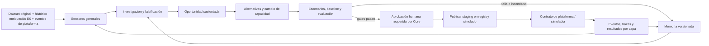

| Capacidad de producto | Contrato que existe desde el diseño | Primer corte ejecutable |
|---|---|---|
| Plataforma de atención — **externa** | `InteractionObservation`, `LayerAttempt`, `ToolReceipt`, `GoalOutcome`, `CapabilityBundle`, `ReleaseAck` | Simulador de contrato con árbol/IA1/IA2/humano, fallos y resultados reproducibles; no runtime ni UI de atención propios |
| Capacidades que el motor propone | `ChangeSpec` y bundle versionado, diff, compatibilidad, evaluación y release request | Generar y validar cambios; la plataforma/simulador posee activación y ejecución |
| Detección, investigación, portafolio | sensores configurables, SQL libre aislado, verificación, oportunidad y valor marginal | ≥2 familias de sensores con selección no hardcodeada |
| Automejora y memoria | propuestas, tests, simulación, release, experiencia acumulada y olvido | una propuesta vinculada, evaluación y una segunda corrida que aprovecha o invalida memoria |
| Visibilidad del motor | feed de actividad, expedientes, evaluaciones, memoria, decisiones excepcionales y estado de release | API/read models/SSE para la plataforma; además, consola técnica de desarrollo (§25), distinta de su UX |
| Operación futura | canary real, multi-tenant, políticas reales, fuentes continuas | contratos y estados; efectos externos reales deshabilitados sin Agent OS autorizado |

La presentación y video son entregables externos, **no** forman parte de este spec de ingeniería. El deployment de demo es una capacidad técnica, no un producto bancario live.

## 2. Auditoría de simplificación: qué se conserva y qué se elimina

La V1 mezclaba diseño de largo plazo con infraestructura de un primer corte. Estas son decisiones sustitutivas, no una lista de opciones para que cada desarrollador elija:

| Antes en V1 | Decisión V2 | Razón/condición para volver a separar |
|---|---|---|
| ~15 crates y servicios conceptuales por etapa | **Dos repos Git**: `improvement-engine` y `infra` | Servicio de automejora e infraestructura separados; Core/modelos externos, sin gateway propio |
| PostgreSQL + S3 + SQS, inbox/outbox/leases en todas partes | PostgreSQL para estado y **cola durable de jobs**; `LISTEN/NOTIFY` sólo despierta, polling recupera; S3 para blobs grandes/inmutables. Sin SQS inicial | Añadir broker cuando throughput/contención medidos superen criterios §8; no por previsión abstracta |
| Tabla/clase durable por cada Signal, Claim, Opportunity, Proposal, Scenario, Evaluation, Memory, Detector, etc. | **`artifacts` versionados** con `kind` tipado y JSON Schema por familia; sólo jobs, heads, lineage, auditoría, decisiones, cuotas, cursores de ingesta y comandos externos tienen tabla propia (§5) | Episodios/efectos de atención pertenecen a plataforma; extraer tabla concreta del motor sólo con consumer/medición |
| `DatasetRevision`/Parquet obligatorios de toda la fuente | CSV/tablas originales **readonly**; `SourceSnapshot` es manifest de paths, digests, schema y cutoff. Cache columnar derivado es opcional y reconstruible | Materializar Parquet por partición sólo si benchmark de lectura lo exige |
| Dos orquestadores/reconcilers y muchos puertos finos | Un worker con jobs tipados, Core externo y sandbox | No duplicar runtime, gateway ni atención |
| Multitud de clocks/epochs/campos repetidos en cada artefacto | Envelope común pequeño + campos propios sólo donde se consultan o hacen cumplir invariantes; `run_config_ref`, `source_snapshot_ref`, `parent_refs` | Añadir campo cuando haya query, gate o test que lo use |
| Canary de clientes reales como feature P0 | No se implementa en el corte compatible; extensión de plataforma futura | Registry promueve staging/prod completos; simulación de cohortes no acredita soporte Core |

Regla de diseño: ninguna columna durable entra sólo porque «podría ser útil». Cada campo tiene consumer (query, autorización, reconstrucción, visibilidad o prueba) y retención. Campos no usados se descartan; metadata aprobada puede quedar en blob versionado. No persistimos múltiples clocks/epochs por artefacto: envelope pequeño; fencing en jobs/comandos externos y control de permisos.

## 3. Datos: fuente intacta, relaciones explícitas y privacidad

Las 13 tablas entregadas (`customers`, `products`, `branches`, `service_agents`, `marketing_campaigns`, `daily_exchange_rates`, `transactions`, `call_center_interactions`, `call_transcripts`, `satisfaction_surveys`, `digital_events`, `complaints`, `campaign_sends`) son el **sistema fuente** de esta simulación de banco. `SourceStore` implementa `file://` local (`PULSO_DATA_ROOT`) y `s3://` AWS desde el **mismo manifest lógico**; ambos adapters sólo leen y verifican digest/versión de objeto, nunca ejecutan `ALTER`, `UPDATE`, `DELETE` ni escriben en la fuente. Nuevas tablas `pulso_*` son **del producto**, en PostgreSQL separado. Referencian la fuente con `SourceRef{source_namespace,world_ref,snapshot_ref,table,source_pk,file_digest,observed_cutoff}`; no se impone FK física hacia CSV/tablas ajenas. Ante corrección del CSV/partición se crea otro snapshot y se marca derivado stale; nunca se reescribe el original. `SourceSnapshot` guarda manifest y conteos, no copia el dataset completo a PostgreSQL.

**Bytes de `SourceSnapshot` (normativo).** Cuando el manifest se publica como artefacto U02 `source_snapshot`, su payload conserva el documento original UTF-8 en el único campo `source_snapshot_json`. Ese string —incluidos whitespace y orden de claves— es la entrada del `binding_digest` U04; está prohibido reconstruirlo desde `serde_json::Value` o aceptar alias de campo. U08/U20 resuelven exclusivamente ese campo y vuelven a parsearlo para validar tenant, tabla y binding. Un artefacto histórico sin string válido, con bytes que no reproduzcan el binding o con tenant divergente queda no elegible y falla cerrado; se publica una revisión nueva, nunca se muta el artefacto pasado.

DuckDB lee exclusivamente un **extracto tratado y sellado** por investigación. Un extractor confiable abre la fuente readonly, aplica proyección, pseudonimización, ventana, tenant y partición informacional, escribe derivados en un directorio por run sin acceso al root original y produce manifest con digest/filas/columnas. Sólo ese directorio se monta en `sql-sandbox`; ni CSV originales, ni socket Podman, ni credenciales, ni directorios de otros runs se montan allí. El agente razona y escribe SQL/tablas temporales dentro de la DuckDB efímera. El broker deniega IO externo, `ATTACH`, `COPY`, extensiones no permitidas y resultados individuales que violen el umbral de divulgación. Un cache Parquet **derivado** por columna/partición puede acelerar lecturas sin cambiar el esquema original: clave `(file_digest, transform_revision, allowed_columns, purpose, information_partition)`, inválida al cambiar cualquiera; sólo se materializa después de medir. PII directa no aparece en prompts/logs/trazas. Dado el permiso confirmado para enviar datos a modelos, el `ModelPort` envía el subconjunto mínimo tratado bajo configuración de tratamiento/retención y `ModelReceipt`; no una fila entera cuando bastan atributos. Se registran propósito/proveedor/versión; un cambio de permiso invalida nuevos usos.

| Relación | Confianza permitida | Prohibición concreta |
|---|---|---|
| `call_center_interactions.interaction_id ↔ call_transcripts.interaction_id` | join exacto, cobertura parcial | texto plantilla no es gold de motivo |
| `satisfaction_surveys.interaction_id ↔ call_center_interactions.interaction_id` | join exacto si poblado; CSAT/NPS sólo respondentes | no extrapolar encuestas a todos los contactos |
| `complaints.origin_interaction_id ↔ interaction_id` | schema admite, copia local auditada lo trae vacío | no inventar contacto causante por cercanía |
| `transactions.customer_id`, `digital_events.customer_id`, `call_center_interactions.customer_id` | secuencia/segmento agregado con `link_method=temporal_candidate` | proximidad no prueba causa ni error transaccional |
| `products.customer_id`, `customers.customer_id` | snapshot actual | no usar saldo/mora/status actuales como historia de 2023 |

Hallazgos de calidad previamente auditados deben **recontarse** al iniciar: transcripciones parciales, texto de `saldo` repetido incluso bajo `Queja`, motivos gruesos y descripciones PQR templáticas. Por tanto, los detectores sobre transcripciones originales usan estructura/fechas/estados; ese texto no produce prevalencia semántica ni oracle histórico. El texto enriquecido E0 sí permite investigación semántica y secuencial dentro de su población simulada (§28), sin extrapolar su prevalencia al banco. Los ejemplos PT son generados y revisados, no presentados como tráfico original. Para dinero, USD lleva fuente/conversión o es supuesto explícito.

`SourceContract` por tabla declara PK, tipos consumidos, tiempo de evento, nulabilidad observada y reglas de exclusión; la V1 §24.1 contiene la matriz inicial de siete fuentes, pero en V2 **los contratos JSON versionados en el repositorio son la autoridad ejecutable** (`contracts/sources/*.json` + golden CSV de header). Se eligió JSON para que el schema, el contenido hasheado y la referencia inmutable no tengan una representación YAML paralela; la decisión está en ADR 0002 del motor. El archivo físico manda sobre su header y toda diferencia produce quality finding. No se cambian columnas del dataset para acomodar el contrato: se cambia el adapter o se declara unsupported.

Las fuentes complementarias son **el histórico enriquecido E0** (§28) y **la observabilidad operacional de plataforma**, no columnas inventadas del CSV. `PlatformObservationBatch` y spans/logs tratados (§24) informan qué pasó en clasificador, árbol, IA1, IA2 y humano. Sus `SourceContract` propios declaran secuencia, correlación, clocks, versión, cobertura y política de sampling. El simulador genera esta fuente en local; producción la recibiría de la plataforma real. Nunca se mezclan tasas del histórico sintético con tasas observadas del simulador sin distinguir población, periodo y `evidence_kind`.

El histórico enriquecido `pulso_muestra_e0` es una fuente de primera clase: se asume realidad operacional del entorno de evaluación, sin negar su procedencia aumentada. Complementa los datos bancarios y la futura telemetría; no reemplaza ninguna fuente ni necesita un motor distinto. §28 fija ingesta, descubrimiento, evaluación y aprendizaje continuo para esa fuente.

## 4. Código, Git y límites de proceso

**Decisión de ejecución sustitutiva (§29):** Rust conserva el control plane, procesamiento de datos, sandbox, gates y persistencia Pulso. El razonamiento autónomo y los juicios Jev se describen y ejecutan mediante Agent/Flow/nodos agent y decide de Agent Core, en su runtime Python separado. No construir un segundo ReAct ni otro cliente Jev Rust. agent-core-assets/ almacena definiciones versionadas, prompts y suites del propio sistema de automejora; Core es dependencia fijada, no código copiado dentro de crates/app.

Se usan **dos repositorios Git**: `improvement-engine` para dominio, API, worker, contratos, integración Core, fixtures, stack local y CI de integración; `infra` para Terraform, entornos AWS, despliegue, IAM y observabilidad de infraestructura. Agent Core y modelos son externos. El bridge es adaptación de contratos, no segundo runtime; no construimos gateway. El simulador es dependencia de tests/demo, no atención bancaria.

```text
improvement-engine/
  crates/core/            # entidades, estados y validaciones puras
  crates/app/             # coordinación durable, métricas, gates, eval y memoria; razonamiento en Core
  crates/adapters/        # PG, S3, DuckDB, plataforma, cliente Core y capacidades del lab
  crates/control-api/     # comandos/read models/SSE del motor
  core-bridge/            # servicio Python: composición Core, adapters y export de receipts
  agent-core-assets/      # Agents/Flows/prompts/decisiones/suites de evolución
  debug-console/          # UI interna de desarrollo; consume sólo control-api
  crates/worker/          # scheduler, jobs y reconciliación
  # Sin crate/servicio gateway: integración de modelos mediante Core externo
  crates/platform-sim/    # sólo test/demo: cuatro capas y banco sandbox simulado
  contracts/              # OpenAPI, schemas, fuentes y eventos de plataforma
  migrations/             # sólo tablas nuevas pulso_*
  local/                  # Podman Compose, PG, LocalStack y perfiles aislados por test/worktree
  tests/ fixtures/ docs/architecture/ docs/flows/ docs/decisions/ docs/runbooks/ docs/journal/
  .github/workflows/      # CI del motor, incl. PG efímero y contratos de integración
infra/
  terraform/modules/      # red, datos, compute, seguridad, identidad, storage, secrets, observabilidad
  terraform/envs/         # staging y prod; prod es la demo
  docs/architecture/ docs/runbooks/ docs/decisions/ docs/journal/
  .github/workflows/      # CI actual fmt/validate/contratos; plan/deploy futuros y deshabilitados
```

Cada repo excluye CSV/Parquet, PII, secretos, state Terraform, outputs y grabaciones. `main` protegido, PR con contrato/test/ADR y lockfiles; imágenes por digest. La futura entrega U25 podrá hacer que infra consuma un manifest firmado de digests/schema/migración/config del engine; la fundación Terraform ya declara recursos AWS, pero no consume aún dicho contrato ni acredita plan/apply. Un release futuro pinneará ambos commits, imágenes, migración y `RunConfigRevision`; rollback volverá a imágenes/capacidades anteriores sin borrar hechos. **Documentación técnica y bitácora son entregables de cada corte, no actividad opcional al final** (§26). Los repos ya están inicializados: el estado de implementación se acredita por commit, test y CI, no por este documento.

### 4.1 Frontera y baseline Terraform de infraestructura

El estado objetivo de `infra` no contiene Compose, LocalStack, doctor de Podman, fixtures ni tests de integración del motor: son dependencias locales de `improvement-engine`. La limpieza sólo se considera cerrada cuando el motor aporta su reemplazo versionado y smoke verificable; PostgreSQL efímero de CI no prueba ese stack local. Su único producto es infraestructura AWS versionada y sus runbooks. Sólo existen dos entornos: `staging` y `prod`; **prod es la demo**, no tráfico bancario real. Ningún pipeline aplica, publica imágenes ni hace `terraform apply` automáticamente en este corte. CI valida formato, módulos, contratos de variables y plan sólo cuando una identidad OIDC y backend ya autorizados lo hagan posible.

El baseline se implementa como módulos Terraform con entradas mínimas y outputs no sensibles, no como un monolito por ambiente:

| Módulo | Responsabilidad y límite verificable |
|---|---|
| `bootstrap` | **Prerrequisito externo**: bucket de state cifrado/versionado, locking y trust role GitHub OIDC restringido por organización/repos/branch; no se crea recursivamente desde los roots del servicio ni es dependencia de `fmt`/`validate` |
| `network` | VPC, dos AZ, subnets públicas/privadas y rutas; NAT por entorno como decisión de coste/versionada; no abre una ruta de administración pública |
| `connectivity` | **Diferido**: no existe módulo VPN/TGW mientras no haya customer gateway, CIDRs y aprobación; no se crea una VPN ficticia |
| `edge` | **`dependency_blocked`**: la ruta elegida será `acceso privado → proxy de identidad → ALB interno → task`; no hay API Gateway placeholder, ALB público ni regla inbound directa hasta contrato de listener/auth/health y prueba de integración |
| `identity` | roles separados de CI deploy, runtime, task sandbox y lectura de observabilidad; trust y recursos permitidos mínimos; nunca secretos persistentes de GitHub |
| `runtime` | ECS/Fargate privado declarado para el motor; imágenes por digest y sin Agent Core/gateway propios. Conectividad a DB, health del servicio, inyección de secreto y escalado de jobs siguen contrato de integración, no se infieren del recurso |
| `data` | PostgreSQL administrado, S3 de artefactos/extractos/mailbox, cifrado, backup/retención y separación por entorno; nunca una copia no tratada del dataset en el state ni outputs |
| `secrets` | nombres/referencias y políticas de lectura de Secrets Manager/KMS; valores los aporta un canal autorizado y no Terraform ni CI |
| `observability` | log group, SNS y alarmas CPU diagnósticas declaradas; logs/métricas/trazas del motor y alarmas accionables de disponibilidad, error, cola, progreso, presupuesto e ingesta requieren contrato engine→infra, owner, destino y prueba firing/resolved |

La red, roles y stores se validan por contrato y por `terraform validate`/plan cuando haya credenciales autorizadas; LocalStack no acredita IAM, VPN, VPC, OIDC ni alarmas AWS. Las alarmas se distinguen de telemetría de negocio: OTel/`pulso_run_events` alimentan la detección, mientras CloudWatch confirma salud del despliegue. El runtime usa `database_connection_secret_arn` versionado por entorno (secreto RDS-managed o application secret autorizado, con host/port/dbname/username/password); Terraform no aporta valores, el task recibe sólo ref, IAM lee exactamente ese ARN vía Secrets Manager/KMS y un smoke tratado verifica binding endpoint/secreto/rotación. Egress es `aws_private_endpoints_only` o `controlled_nat` explícito: una regla TCP/443 amplia es plumbing temporal, no prueba de que sólo llega a AWS. Los security groups se permiten por flujo explícito (`proxy→ALB interno→runtime`, `runtime→data`, `runtime→AWS APIs/proveedor por perfil aprobado`); queda prohibido `0.0.0.0/0` entrante a runtime/data. La documentación del módulo enumera dependencia, threat model breve, variables, salidas, test y rollback por cada recurso.

## 5. Modelo persistente mínimo: diez tablas nuevas del motor

PostgreSQL almacena el **control plane y observaciones normalizadas del motor**, no episodios/efectos operativos de atención ni un espejo del dataset. Todas las tablas nuevas llevan prefijo `pulso_` y `tenant_id` aunque la demo tenga un tenant. `artifact_id` identifica algo lógico, `revision` una versión inmutable. Contenido JSON se valida con schema por `kind/schema_version` **antes** de persistir; columnas de búsqueda se derivan del mismo JSON dentro de la transacción. Blob S3 se usa sólo si el cuerpo supera límite configurable o contiene material que requiere política de retención aparte. Una relación durable se usa porque alguien navega, invalida o autoriza por ella; no por decoratividad del ERD.

| Tabla | Columnas/índices que sí tienen consumidor | Por qué no basta un blob |
|---|---|---|
| `pulso_jobs` | `id,tenant_id,run_ref,kind,logical_key,generation,parent_job_id,status,lane,priority,due_at,attempt,lease_owner,lease_until,lease_version,last_event_sequence?,input_ref,config_ref,reserved_cost_usd,actual_cost_usd,error_code`; UNIQUE `(tenant_id,kind,logical_key,generation)`, índice parcial de pendientes | agenda, concurrencia, retry y backpressure; `run_ref` permite ver el árbol de trabajos sin inferirlo de logs; sólo el job raíz mantiene `last_event_sequence` |
| `pulso_artifacts` | `(tenant_id,id,revision)` PK; `kind,schema_version,body_json_or_blob_ref,digest,created_at,source_snapshot_ref,config_ref,information_partition,search_text` | revisiones consultables y memoria FTS; `kind` se valida con schema |
| `pulso_artifact_heads` | `(tenant_id,scope_key)`, `artifact_id,revision,head_version`; CAS; scopes `run_config/<environment>`, `bundle_candidate/<route>/<environment>`, `memory_index/<scope>` | publicación/versiones del motor; head activo de atención es externo |
| `pulso_artifact_edges` | `tenant_id,from_id,from_rev,to_kind,to_ref,to_rev?,relation`; `to_kind=artifact\|source_row\|source_snapshot\|policy`; índice en origen y destino tipado | lineage, invalidez transitiva y refs a CSV sin FK física; ambos extremos se validan en mismo tenant |
| `pulso_decisions` | `id,tenant_id,artifact_ref,actor_ref,grant_ref,status,expires_at,expected_head,response_ref` | autoridad humana mínima y expiración |
| `pulso_audit_events` | `id,tenant_id,actor_ref,action,target_ref,result,at,trace_id` con payload tratado | registro de permiso, rechazo y publicación |
| `pulso_run_events` | `id,tenant_id,run_ref,job_ref?,sequence,event_at,stage,event_code,status,reason_code?,artifact_ref?,trace_id?,details_ref?`; UNIQUE `(tenant_id,run_ref,sequence)`, índice `(tenant_id,run_ref,sequence DESC)` | cronología durable de transiciones y decisiones que la consola técnica puede reconstruir aunque OTel esté caído; detalle voluminoso vive en trazas/blobs tratados |
| `pulso_quotas` | PK `(tenant_id,resource,window_start)`; `config_ref,limit_units,reserved_units,actual_units,window_end,version` | contador global estable entre revisiones; config_ref documenta política, no abre otra bolsa; reserva atómica worker/Core |
| `pulso_ingest_cursors` | PK `(tenant_id,source,partition)`; `offset_or_watermark,source_digest,updated_at,last_batch_ref` | reanudar eventos/trazas de plataforma sin duplicar ni perder lote |
| `pulso_external_commands` | `tenant_id,command_key,target,request_digest,status,receipt_ref,attempt,created_at,reconcile_after`; UNIQUE `(tenant_id,target,command_key)` | release/rollback hacia plataforma con confirmación, unknown y reconciliación |

No hay tablas iniciales separadas para `Signal`, `Claim`, `Opportunity`, `Proposal`, `Scenario`, `Evaluation`, `Memory`, `Detector`, `Portfolio`, `Bundle`, `RunConfig` ni `SourceSnapshot`: son `pulso_artifacts.kind` con schemas distintos. `pulso_artifact_heads` lleva config, wiki activa y bundle **propuesto**; la plataforma posee el head del bundle **activo en atención**. No hay episodios ni tool effects propios: llegan como observaciones desde la plataforma y se guardan en blobs/artefactos tratados con lineage. Job, artefacto y evento de transición se crean/actualizan **en la misma transacción PG**; `NOTIFY` es hint no durable y polling recupera. `pulso_run_events` no registra tokens ni cada lectura de archivo: es el ledger pequeño de cambios de estado, decisiones, checkpoints, fallos y esperas; OTel/blobs aportan detalle con retención distinta. S3 puede quedar con blob huérfano si cae antes de commit; GC por digest/edad lo elimina tras retención. Los comandos de release/rollback externos usan `pulso_external_commands`; si el receptor exige broker/outbox, se añade por ADR y test de fallo.

**Contrato relacional de implementación.** IDs internos son UUIDv7 sin PII. Excepto pulso_artifacts, cuya PK es `(tenant_id,id,revision)`, tablas con id tienen PK `(tenant_id,id)`; jobs parent_job_id/run_ref apuntan a jobs del mismo tenant (raíz se referencia a sí misma). Referencias internas a revisiones usan objeto `ArtifactRef{tenant_id,id,revision}` y FK compuesta cuando existe columna relacional; no confundirlas con VersionRef Core ni SourceRef. Heads y extremos artifact de edges deben resolver una revisión existente del mismo tenant. Edges hacia fuentes sólo validan el manifest/namespace, no crean FK sobre CSV. Borrado no hace cascade de evidencia: retención/purga pasa por tombstones y auditoría. NOT NULL/CHECK cubren revision>=1, head_version>=1, attempt/generation>=0, unidades no negativas y status por reducer; campo nullable debe tener motivo documentado, no default silencioso. Errores de validación no consumen una revisión publicada.

External_commands añade `run_ref,job_ref,request_ref,version,updated_at`: request_ref apunta al payload tratado inmutable usado para reconciliar; receipt no sustituye el request perdido. Binding CoreRun se persiste como receipt enlazado al comando con CAS de version y digest. Índices `(tenant_id,status,reconcile_after)` y `(tenant_id,run_ref)` tienen consumidor en reconciler/consola. UNIQUE de key y payload distinto retorna conflicto; no sustituye exclusión de un proveedor que no admite idempotencia. El ERD siguiente muestra navegación lógica, no garantiza FK directa job→artifact: esa navegación usa run_events/edges y los refs anteriores.

**Inmutabilidad, hashes e invalidación.** Payloads JSON internos se canonicalizan mediante RFC8785/JCS; cantidades decimales/USD se representan como strings de precisión declarada, timestamps UTC RFC3339. Digest interno es SHA256 de bytes canonicalizados; blobs binarios se hashean sobre bytes exactos. Este algoritmo no sustituye canonical_bytes/hashes propios de Core. Cambiar schema/config crea revisión nueva. Estado revoked/stale se aplica como overlay de tombstone/permiso antes de servir una revisión, no editando su JSON histórico; índices y caches consultan también ese overlay. Mismo digest nunca concede acceso entre tenants/particiones. Tests: round-trip Rust/Python con golden bytes, FK cross-tenant, head a revisión inexistente, request conflictivo, restore con tombstone y ausencia de cascade destructivo.

**Cuotas al cambiar configuración.** config_ref documenta el cálculo, pero no abre presupuesto nuevo dentro de la misma ventana. Al activar otra config, se arrastra consumo/reserva acumulado por tenant/resource/window y se aplica el límite nuevo; bajar el límite por debajo del consumo difiere trabajo adicional sin saldo negativo. El cambio de config y reserva usa el mismo lock de recurso que claim; tests de dos revisions concurrentes prueban que no se duplica cupo. Una nueva ventana sólo reinicia presupuesto por política de calendario, no por nuevo config_ref.

Run_events tiene FK `(tenant_id,run_ref)` y `(tenant_id,job_ref)` hacia jobs; valida además root.run_ref=root.id y job.run_ref=event.run_ref mediante constraint trigger transaccional. FK a cualquier job no demuestra pertenencia al run. Tests rechazan hijo usado como raíz y evento asociado a job de otro run. Crear raíz con self-reference ocurre en una transacción con FK diferible; hijos sólo después de raíz válida.

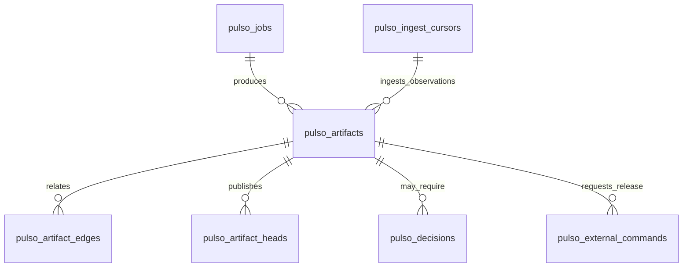

**Familias de artefactos y campos propios obligatorios:**

| `kind` | Campos propios mínimos | Lectura/acción que los necesita |
|---|---|---|
| `signal` | metric_ref, population_ref, numerator, denominator, comparator, interval, source_refs, query_receipts | priorizar y falsificar |
| `opportunity` | claim, support_refs, counter_refs, population, status, value_range_ref, workflow_link_ref | expediente y selección |
| `proposal` | opportunity_ref, alternatives[], selected_change_ref?, expected_mechanism, affected_routes[] | comparar, construir y revisar |
| `capability_bundle` | Schema canónico por estado en §17; no redefinir campos aquí | Envoltorio Pulso, nunca entidad Core |
| `scenario_set`/`evaluation` | cases_ref, split, oracle_ref, baseline_ref, candidate_ref, results_ref, limits | prueba y gate |
| `memory_wiki` | scope, purpose, base_head_ref, snapshot_blob_ref, index_digest, source_manifest_ref, diff_digest, lint_receipt_ref, tombstone_refs | montar, publicar, navegar, revisar y olvidar wiki sin esquema rígido por claim |
| `detector` | metric_spec, source_contract_refs, status, shadow_results_ref | ampliar sensores sin autorrefuerzo |
| `run_config` | detector/settings refs, budgets, concurrency, cadence, thresholds, model refs, feature_flags | repetibilidad y control |
| `source_snapshot` | ordered file refs/digests, source schemas, observed_cutoff, quality_ref | seleccionar fuente original reproducible sin copiarla |
| `platform_observation` | source_id, sequence_range, batch_digest, coverage, event_blob_ref, contract_ref, trace_refs | detección por capa, replay y cursor durables sin duplicar episodios operativos |
| `model_receipt` | invocation_ref, model_profile_ref, provider_route, output_digest, usage/cost, validation, status | auditoría y presupuesto de Jev/LLM reales sin guardar prompts sensibles en logs |

Los blobs y eventos tienen `retention_class`; invalidación de fuente o permiso marca derivados `stale/revoked`, bloquea retrieval y promoción inmediatamente y encola purga física según política. No se promete inmutabilidad eterna de PII. Un `artifact_edge` a una fuente es referencia lógica `SourceRef`, no FK a CSV. Índices FTS sólo de texto tratado y reconstruibles. `JSONB` no es permiso para almacenar campos arbitrarios sin schema: unknown field relevante a decisión falla validación, migraciones/upcasters se prueban N/N−1.

## 6. Contratos y configuración que hacen reproducible el sistema

**Envelope wire v2:** `{schema_version,tenant_id,artifact_or_event_id,correlation_id,created_at,source_snapshot_ref?,config_ref?,evidence_kind,body}`. UUIDv7 para IDs nuevos; UTC RFC3339 para tiempos; dinero decimal string + `currency`; enums `snake_case`; `unknown` es valor explícito. `evidence_kind=supplied_synthetic|team_generated|external_assumption|future_bank`; `validation=unverified|reproducible|offline_evaluated|live_observed` y `environment=none|sandbox|live` son ejes independientes. No se agregan todos los clocks a todas las entidades: fuente tiene event/observed time, atención tiene at, policy tiene vigencia, job usa reloj real para lease. SQL y modelo reciben refs y presupuestos; payload sensible no viaja en eventos genéricos.

`RunConfigRevision` es artefacto inmutable y **único dueño de settings del motor**: detectores, ventanas/splits, quality gates, límites SQL, concurrencia, cadencias, modelos/Jev/temperatura/prompts, presupuestos, evaluación, retención, reglas de release sandbox y flags. Cada campo tiene tipo/rango/default/owner/efecto en `contracts/run_config.schema.json`; no hay const/env oculto que cambie semántica. Secretos son refs a secret store, nunca valor en config. Activación por CAS; cada run fija `config_ref`. Cambio crea nuevo run o cancelación explícita, no muta trabajo in-flight. API muestra diff/autor/versión; rollback mueve head. La plataforma tiene configuración de atención propia, fuera de este RunConfig.

| Comando/puerto | Entrada y salida mínima | Condición de fallo |
|---|---|---|
| `schedule_run` | `{mission_ref,source_snapshot_ref,config_ref,trigger_ref,idempotency_key}` → job ref | source/config faltante o permiso denegado |
| `analyze` | manifest de vistas tratadas + SQL/budget → `QueryReceipt{digest,rows,bytes,duration,truncated}` | límite/escape/PII → rechazo y traza |
| `publish_artifact` | kind, schema_version, body, expected_head, source/config refs → revision | CAS stale o schema inválido |
| `prepare_bundle` | base_ref, ChangeSpec, policy_ref → bundle revision o errores tipados | ruta/tool/skill inexistente, ciclo, permiso |
| `invoke_model` | perfil/model ref, purpose, treated input/state, schema/pregunta tipada, budget, idempotency key → `ModelReceipt` | proveedor no permitido, PII/retención, timeout/costo/schema → fallo tipado |
| `observe_platform` | PlatformObservationBatch tipado (§24.2) + cursor/manifest → reducer → InteractionObservation artifact | gap de secuencia/coverage, versión de contrato o tenant inválido |
| `execute_scenario` | scenario, fixture, bundle_ref, seed → traza/resultado del simulador de plataforma | fixture/oracle ausente → `not_evaluable` |
| `registry_proposal` / `publish` | `EntityDraft[]`, expected_rev, candidate_hash, suite_id/version; publish con Idempotency-Key → `ReleaseDetail` | contrato Core §§17/27; approval/publish/promote/revoke requieren humano firmado; ReleaseAck sólo extensión futura |
| `mount_memory` / `publish_memory` | scope/purpose/cutoff/partition → wiki workspace; luego base head+diff → revision | stale/revoked/final holdout nunca se monta ni publica |

`PolicyPort` del simulador valida identidad, propiedad de recurso, operación, scope y versión de política para escenarios; en producción esa validación pertenece a plataforma/Agent OS. Agentes del **motor** proponen cambios/release, pero un receptor confirma cada efecto externo. Lectura de SQL/wiki es libre dentro del perímetro montado, sin otro tenant ni final sellado; mutaciones de plataforma pasan por comando tipado, autorización y `pulso_external_commands`. No implementamos policies bancarias reales ni asumimos autoridad por prompt.

**Contrato de enlace más importante:** `WorkflowBridge`/`OpportunityToScenarioLink` exige `{opportunity_ref,target_outcome,source_population,workflow_ref,eligible_fraction_range,scenario_refs[],change_route_ref,link_grade,blocking_reasons[]}`. `same_outcome_linked` exige el mismo outcome/población y mecanismo capaz de alterarlo; `mechanism_proxy` sólo autoriza afirmar que un mecanismo relevante funcionó en sandbox; `unlinked/not_evaluable` impide claim de mejora. La validación exacta está en §16. Una señal gruesa `Queja` no se transforma mágicamente en submotivo de saldo. Un caso PQR con `complaint_id`/categoría/fecha vinculables puede proponer subruta de seguimiento/triage, pero su evaluación sandbox **no** demuestra reducción real de incumplimientos SLA. Tests positivos y negativos comprueban cada grado.

## 7. Flujos completos y comportamiento esperado

### F1. Fuente/atención → trigger sin intervención humana

`worker` despierta por (a) nuevo `SourceSnapshot` o corrección, (b) agenda de `RunConfigRevision`, (c) umbral de eventos/trazas **emitidos por la plataforma externa** —handoffs, intentos fallidos por capa, herramientas unknown, latencia, regresión—, (d) solicitud humana explícita. Un coalescer agrupa señales del mismo ámbito/ventana y crea un `pulso_jobs(kind=detect)` idempotente. No crea una investigación por cada fila o span. `pulso_ingest_cursors` conserva offset/watermark hasta que el lote tratado y su manifest queden durables; pérdida de NOTIFY/OTel no equivale a pérdida de evento de plataforma. El scan del CSV mira los 13 schemas y calidad, pero sólo abre vistas requeridas. Un archivo nuevo no corrige el viejo sin `supersedes`. **Aceptación:** dos triggers simultáneos producen un run lógico; evento atrasado se reprocesa sin duplicar hallazgo; caída de telemetría se muestra como cobertura desconocida, no como cero fallos.

### F2. Detectar → investigar → corroborar/refutar

Sensores deterministas calculan `MetricSpec` con grano, población, numerador, denominador, ventanas, baseline, calidad y costo; cubren **todas las familias**: atención/contactos, PQR/SLA, transacciones/rechazos, fricción digital, productos/activación, marketing, cartera descriptiva y salud del motor. No se ejecutan todas las métricas cada minuto: `RunConfig` define prioridad/cadencia y `SourceContract` qué fuente habilita cada una. Un scout LLM puede explorar **SQL libre** sobre DuckDB efímera tratada y proponer nuevas métricas/detectores; no promueve un detector por haber encontrado una correlación.

`Verifier` independiente aplica checks configurados: schema y cobertura, denominador, temporalidad, mezcla/canal/país cuando válido, duplicados, multiple testing, sensibilidad de ventana y contraejemplos. Jev se usa para preguntas estrechas tipadas; LLM para hipótesis alternativas y explicación, nunca para sustituir el cálculo. Publica `signal` y `opportunity` con soporte, contradicción y status `candidate|candidate_descriptive|corroborated|corroborated_descriptive|uncertain|refuted`; los estados descriptivos son los resultados normativos de los perfiles §14 y conservan fuerza de evidencia explícita. Si falta evidencia, publica hallazgo negativo/unknown y agenda reintento sólo ante fuente/config nueva. `detector` aprendido pasa `candidate→shadow` sobre ventanas independientes → `active` tras verificación; señales propias no corroboran su hipótesis originaria. **Aceptación:** el mismo código/config encuentra o refuta la anomalía al permutar evidencia sin renombrar `Queja`; no convierte la categoría gruesa en causa; registra todas las celdas exploradas. La partición temporal y gates estadísticos del contrato inicial se materializan en `contracts/discovery_v1.yaml` antes del primer run (V2 §14 fija los perfiles propuestos; no se eligen post hoc).

### F3. Oportunidad → portafolio → propuesta concreta

`worker` monta la wiki autorizada para que el agente navegue libremente y mapea población/objetivo a capacidades **publicadas por la plataforma**. Genera alternativas: no cambiar, árbol, contexto/skill/tool soportados por el catálogo, IA1 Jev, IA2 LLM, routing/handoff o dependencia externa. `PortfolioDecision` resta solapamiento de población/costo. `proposal` incluye `do_nothing`, mecanismo, población elegible, ruta, precondiciones, costo/esfuerzo/riesgo y supuestos. `ChangeSpec` propone modificación versionada; `prepare_bundle` valida refs y compatibilidad, no construye runtime. LLM puede explorar/diseñar/iterar, pero no activa su JSON directamente. **Aceptación:** alternativas trazables; si no hay ruta/llave/oracle, `unlinked`; dos builders mismo head no se pisan.

### F4. Escenarios y evaluación realista

`ScenarioFactory` toma episodios/atributos del dataset sólo cuando son vinculables y temporalmente válidos, histórico enriquecido E0 bajo el protocolo §28, observaciones de la plataforma externa, variantes sandbox y agentes adversariales que interactúan por el **contrato público de plataforma/simulador**, no por un runtime nuestro. El simulador reproduce las cuatro capas, un banco con estado/policy, efectos y fallos inyectables; sus fixtures generados se marcan `team_generated` y no se atribuyen al CSV. `OracleSpec` compara objetivo, acción permitida/prohibida, estado final y handoff; `was_resolved` histórico es señal operacional débil, no veredicto del candidato. Baseline y candidato usan mismo caso, semilla, versión del simulador y límites, con DB/namespace reseteado entre brazos. Casos finales se separan por cliente/episodio/plantilla y tiempo, nunca alimentan builder/memoria de desarrollo.

La pieza evaluada P0 es **el cambio que el motor descubra y proponga**, sea Flow, DecisionModelDef, Prompt o configuración de Agent nativamente soportados; skills se compilan a entidades existentes, conocimiento nuevo/runtime queda dependency_blocked; no se fija el clasificador como ganador. Jev se usa por el motor para juicios tipados cuando aporte, y el simulador puede emular la clasificación de plataforma. `EvaluationPlan` sella métrica primaria ligada al `WorkflowBridge`, tamaño, split, presupuesto y gate antes de correr: seguridad, cobertura, handoff/resolución verificable según objetivo, p50/p95 latencia, costo por caso e intervalos. Un fallo de tool/banco/oracle es `unknown/not_evaluable`, no éxito ni culpa automática del candidato. Iteración produce revisión nueva y reevalúa en desarrollo; final se abre una vez **por familia/campaña de propuesta** y luego se retira, sin feedback granular al builder (§18). **Aceptación:** baseline/candidato comparables; seguridad no se compensa con costo; casos normal/ambiguo/humano ES/PT de contrato; fallo adversarial produce regression case sólo si procede de split de desarrollo/validación; si no mejora se conserva release anterior y la memoria registra hipótesis fallida sin contaminar final.

### F5. Release y aprendizaje posterior

El motor lleva la propuesta Core a `evaluated` automáticamente, conserva su hash y solicita decisión humana (§27). `approve` y `publish` usan credencial humana firmada; publish confirma staging, no exposición a clientes. `promote(prod)` es cambio completo de alias, no canary. `pulso_external_commands` conserva ledger local y respuestas; no agrega idempotencia al API upstream. Unsafe/regresión bloquea la solicitud de publicación y conserva la versión anterior. Rollback actual requiere humano y promoción de release anterior activa; no revocar mientras prod la use. **Aceptación:** sin humano no publicación; timeout no implica éxito; staging cambiado exige rebase/reevaluación/aprobación nueva. Shadow/canary se reserva para extensión de plataforma futura, no se implementa para fingir compatibilidad.

### F6. Memoria: persistir, usar y olvidar

La memoria es una **wiki de trabajo mantenida por agentes**, no un packet top-k de claims preseleccionados. Cada investigación recibe un workspace efímero con fuentes autorizadas readonly, índice, páginas temáticas y log; el agente puede navegar, buscar, cruzar y reescribir libremente páginas/síntesis dentro de su workspace. Esas ediciones no son durables hasta `publish_memory`, que verifica procedencia, ausencia de PII/holdout, contradicciones, policy y diffs; luego crea snapshot inmutable y mueve el head por CAS. La wiki activa crece y se reorganiza en nuevas revisiones; el agente puede crear páginas, enlaces, hipótesis, métodos útiles y notas de fallos sin un schema rígido por oración. `MemoryUseReceipt` registra páginas leídas/ediciones influyentes, no pretende demostrar causalidad del modelo. Olvido = dejar de servir contenido revocado/stale, consolidar/sustituir páginas obsoletas y purgar cuando la retención lo exige; un hecho durable no decae sólo por no haber sido leído. §21 fija el protocolo completo.

### F7. Plataforma de atención: contrato externo, no implementación

La plataforma posee clasificación, flows, ejecución de agentes, humano, estado del cliente, efectos y episodios. Jev es proveedor tipado de DecisionModelDef, no tipo de Agent. Nuestro motor **no** implementa esas capas: genera artefactos nativos y usa un adaptador de registry simulado conforme §§17/27. Ingiere EngineEvent mediante exportador acordado (§24), sin inventar un feed HTTP Core. Episodio/capa/humano son enriquecimientos externos con cobertura explícita. **Aceptación:** mocks reproducen cuerpos/estados/errores disponibles, capacidades faltantes unsupported; no se exige construir atención. Sustituir mock por Core requiere pruebas de transporte/composición además de schemas, no se promete enchufe sin verificación.

### F8. Experiencia de la plataforma: fuera del motor, visibilidad obligatoria

La consola integral, oficina de agentes, árbol visual y experiencia de cliente son responsabilidad de la plataforma. Nuestro motor expone **read models y un feed de actividad** con estado actual, siguiente acción automática, evidencia, grado de enlace, cambios, tests, decisión requerida y resultados; la plataforma puede renderizarlos. La **consola técnica de desarrollo** (§25) consume los mismos hechos y telemetría, pero añade el detalle de jobs, consultas, decisiones y dependencias para diagnosticar corridas; no se presenta como UX del banco ni controla manualmente cada paso. El humano de producto sólo responde a `DecisionRequest` excepcionales: autoridad, evidencia en conflicto, policy o veto. **Aceptación:** corrida automática visible de principio a fin, incluso estados negativos/unknown y esperas; ausencia de UI no bloquea jobs; respuesta humana expirada no habilita release.

## 8. Rendimiento, throughput, concurrencia y asincronismo

La atención interactiva pertenece a la plataforma; nuestro motor sólo tiene latencia de ingesta, API de visibilidad, integración externa de modelos y jobs asíncronos. Detección, investigación, evaluación y memoria pueden tardar minutos sin detener atención. `control-api` confirma comandos durables con job ID; SSE entrega progreso y polling recupera pérdidas. El simulador de plataforma no comparte pool de CPU/PG con scans del motor.

| Presupuesto inicial propuesto, en `RunConfigRevision` | Objetivo de ingeniería, no medición actual | Degradación segura |
|---|---|---|
| Integración externa de modelos p95 por perfil | límite versionado por Jev/LLM/proveedor, medido separadamente del tiempo de job | timeout/circuit open → job `waiting_dependency` o alternativa permitida; no juicio inventado |
| API read model p95 | ≤500 ms para página ≤100 con índices/proyección | mostrar estado parcial y cursor, no traer grafo entero |
| Detección de nuevo snapshot/evento | disparar job ≤5 min; completar depende de bytes/costo | estado `queued/deferred` visible, nunca pérdida silenciosa |
| SQL libre por consulta | tiempo, RAM, bytes/filas y CPU configurados por run/tenant | cortar query, conservar receipt de truncación/error |

Estos objetivos no constituyen SLO productivos validados. Antes de fijar EC2/ECS se miden lotes de eventos de plataforma, distribución Jev/LLM real por perfil, MB/s CSV/extractos, p95 de queries, duración de escenarios, cola y presión PG/integración-modelos. `arrival_rate × service_time` estima concurrencia de cada pool del motor; carga 1×, 3× y ráfaga 10× de eventos/jobs, más scan simultáneo. Comparar p50/p95/p99, errores, CPU/RAM/IOPS, pool PG, costo por 1.000 invocaciones de modelo y por oportunidad corroborada. Sin benchmark, infraestructura y límites son parámetros, no garantías.

**Job queue en PG:** `(tenant_id,kind,logical_key,generation)` es único; mismo input/config/snapshot devuelve job existente, mientras nuevo ciclo tras terminal crea `generation+1` con `parent_job_id`/razón. `lane=platform_ingest|detection|evaluation|maintenance`. Workers reclaman lotes pequeños con `SELECT ... FOR UPDATE SKIP LOCKED`, orden por cuota de lane y `priority DESC,due_at,id`, asignan `lease_owner,lease_until,lease_version` en la misma transacción y ejecutan fuera de ella; heartbeat renueva. Escritura final comprueba `(job_id,lease_version,status=running)` y head esperado. Si worker muere, sweeper reencola; viejo worker fenced. `LISTEN/NOTIFY` sólo despierta, polling recupera. Backoff/jitter, máximos y `dead` visible; ledger local conserva keys mientras efectos sean relevantes; unknown sigue matriz por operación §27, no lookup command_key universal.

**Concurrencia y límites:** `RunConfigRevision` asigna cupos separados para SQL sandboxes, decisiones Jev externas, LLM externos, evaluaciones adversariales e ingesta/mantenimiento; cuota por tenant y presupuesto USD/tokens/CPU. Workers controlan jobs activos/lease bajo advisory transaction lock por `(tenant,lane,resource)`; el consumidor aplica slots locales y reserva global en `pulso_quotas`, sin presumir control de réplicas externas. Cada invocación reserva cota superior mediante `UPDATE ... WHERE reserved_units + requested <= limit_units RETURNING version`; llamada adicional requiere nueva reserva. Ante crash la reserva no se rebaja hasta cerrar ventana, por seguridad; receipt registra costo real y sobre-reserva. Si cuota no cabe, job se difiere sin fingir respuesta. Coalescing evita N jobs por N eventos; scan usa particiones/pushdown, no carga el dataset completo en memoria. Particionar jobs/artefactos sólo si tamaño/EXPLAIN lo justifica; índices iniciales `jobs(status,due_at,priority)`, `artifacts(tenant_id,kind,created_at)`, `run_events(tenant_id,run_ref,sequence)`, `ingest_cursors(tenant_id,source,partition)` y FTS tratado. Listas usan cursor; read models cargan refs en lote.

**Backpressure:** si cola/PG/integración-modelos/proveedor/sandbox supera thresholds versionados, se difieren scans de baja prioridad, se recorta exploración por presupuesto y se muestra lag/razón a plataforma. No se degrada seguridad ni se salta verificación. Circuit breaker por proveedor deja `unknown/waiting_dependency`; fallback sólo si el perfil versionado permite otro modelo/región/tratamiento de datos. Workers escalan con imágenes propias; la capacidad externa se negocia; la plataforma sigue independiente. **Gatillo SQS:** si benchmark muestra contención/p95 de claim PG fuera de presupuesto aun con índices/lotes/pools razonables, ADR medido y outbox+SQS con redelivery; hasta entonces una cola.

**Pruebas obligatorias de rendimiento/concurrencia:** dos workers sobre mismo job, lease expirado con respuesta tardía, diez runs del mismo snapshot, ráfaga de 1.000 observaciones por capa mientras se escanean CSV, cola saturada, integración-modelos/proveedor lento, query DuckDB infinita y API expediente con 100 refs. Criterio: cero doble release, cero pérdida de lote/job, lag y p95 dentro de presupuesto configurado en hardware declarado o capacity/config ajustados antes de afirmar cumplimiento.

## 9. Observabilidad de producto y de plataforma

La observabilidad tiene **dos roles**: (1) operar nuestro motor y (2) alimentar la detección con evidencia de lo que las cuatro capas de la plataforma intentaron, omitieron o no pudieron resolver. Instrumentamos API/worker/Core-bridge/PG/sandbox con OpenTelemetry; Los contratos, proyecciones y filtros llevan target_system=attention|evolution y world/environment/purpose; fallos del motor nunca se suman a atención bancaria. `trace_id` y span links unen `source→job→query→signal→proposal→evaluation→release→memory`. La plataforma externa emite eventos estructurados de atención como fuente durable y, opcionalmente, trazas OTel como detalle diagnóstico. El motor ingiere ambos por adapter y los normaliza en `InteractionObservation` con cobertura/clock/fuente; **un span muestreado jamás sirve como denominador poblacional**. `run_id`, `episode_id`, `artifact_id` viven en logs/spans, no como labels de alta cardinalidad. IDs de cliente, texto, SQL literal, argumentos bancarios y secretos no entran en atributos OTel.

| Señal | Ejemplos y dimensiones de baja cardinalidad | Pregunta operativa |
|---|---|---|
| Logs JSON | timestamp, service_role, severity, trace_id, run/episode ref, event_code, policy/config ref, error_code | ¿qué ocurrió y por qué se bloqueó? |
| Eventos de plataforma por capa — **fuente de detección** | `episode/goal`, versión/ruta, clasificador/árbol/IA1/IA2/humano, intentos, checks omitidos, herramientas, motivo de escalamiento, outcome y coverage | ¿qué problema se repite, en qué capa se queda y qué patrón humano podría automatizarse? |
| Trazas de plataforma — evidencia auxiliar | spans de nodo/decisión/model/tool/handoff, error codes, latencia y parent/links | ¿qué hizo o no hizo la capa antes del fracaso?; muestreo y huecos explícitos |
| Métricas USE/cola | CPU/RAM/IO, PG pool/wait, jobs queued/dead/age, lease expiry, SQL concurrency, tokens/USD, cache hit | ¿qué limita throughput/costo? |
| Embudo automejora | signals examinadas/corroboradas/refutadas, oportunidades, propuestas, tests pass/fail/unknown, releases, outcomes maduros, memoria reused/stale | ¿evoluciona el sistema o produce ruido? |
| Trazas del motor | spans `model_call`, `job_claim`, `sandbox_query`, `oracle`, `head_cas`, `release_ack` | ¿dónde se gastó tiempo y dónde falló la automejora? |

Cada métrica de negocio lleva **denominador y cobertura definidos**: `safe_resolution_rate` sólo goals elegibles con outcome observado en eventos durables de plataforma; CSAT/NPS sólo encuestas respondidas con tasa de respuesta; `evaluation_pass_rate` cuenta unknown por separado; `time_to_signal` usa event/observed/processed clocks. Si faltan eventos de una capa o trazas por sampling, la señal se marca `coverage_gap`, no «la capa no hizo nada». Inferir **omisión** exige contrato que declare qué evento se debía emitir y un cierre/timeout durable; ausencia de span aislado no basta. La vista del motor no suma CSV, sandbox y valor USD supuesto en un KPI. Alertas: evento de plataforma atrasado, gaps de correlación, job dead, release ack unknown, memoria revocada recuperada, latencia/costo y telemetría caída; owner/runbook/receipts por alerta.

**Stack local:** [Grafana `otel-lgtm`](https://grafana.com/docs/opentelemetry/docker-lgtm/) recibe logs/métricas/trazas; no montamos Loki/Tempo/Mimir separados. **Stack AWS:** Collector/ADOT exporta a [CloudWatch/X-Ray](https://docs.aws.amazon.com/xray/latest/devguide/xray-instrumenting-your-app.html) con IAM/retención acotados. El motor usa OTLP en ambos. Sampling prioriza errores, pero **OTel es best effort**: `pulso_run_events`, `pulso_audit_events`, lotes de eventos de plataforma con cursor y `pulso_external_commands` son la verdad durable. Un trace ausente deja el detalle diagnóstico `unavailable`, no borra la transición ni altera cobertura de eventos durables. Test apaga collector e inyecta secreto falso: la detección sigue usando eventos durables, reporta falta de trazas auxiliares y no filtra secretos a logs/spans/labels.

## 10. Stacks local, demo pública y despliegue de producto

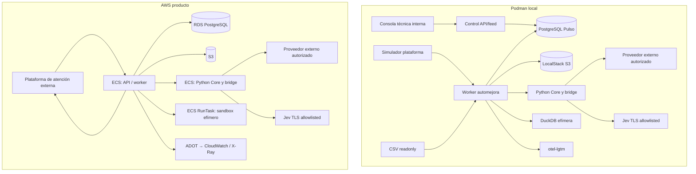

**Local:** `improvement-engine/local` usa `podman compose` para PostgreSQL real, LocalStack **sólo S3**, `control-api`, `worker`, `agent-core-runtime` (Python/bridge), `platform-sim`, `debug-console` y `otel-lgtm`. Launcher rootless crea DuckDB efímera sin red/socket Podman, con CPU/RAM/disco/tiempo y mount tratado readonly por run. `scripts/dev.ps1 up`: preflight Podman/dataset/secrets → bucket LocalStack → migraciones separadas de pulso_control/core_runtime/core_eval → bootstrap autorizado Core → seed del simulador → SourceContracts/manifest → smoke de modelos externos **reales** Jev/LLM vía Core y detección → feed/consola técnica. Credenciales sólo en secret local ignorado por Git, nunca en compose/config. `doctor` reporta digest/cobertura/config/commit, PG/S3/integración-modelos/proveedor/launcher/OTLP; `down` no borra datos por defecto. Recorded responses sólo en tests deterministas/fallos y etiquetadas, no sustituyen el smoke de modelo real.

**Demo de hackathon:** `prod` es el entorno de demo y `staging` es la verificación previa; no existe un tercer entorno `demo`. Si se expone una demo, muestra feed tratado y simulación, no un chat de atención propio ni dataset/credenciales. La consola técnica completa queda en local/staging por VPN/SSM, nunca en la superficie pública; replay público no expone prompts, SQL, trazas internas ni holdout. Si el launcher seguro no pasa preflight, se permite replay inmutable precalculado con receipts y etiqueta explícita; la automejora respaldada por datos se reproduce localmente. Dominio, coste y publicación requieren autorización separada.

**Infraestructura AWS objetivo, entregada de forma incremental:** `infra` define contratos Terraform para `staging` y `prod`, con interfaces de red (VPC, subredes privadas y decisión NAT/endpoints), security groups, IAM, cómputo, storage, base de datos, secretos, API y observabilidad. I06 valida actualmente esos contratos sin provider resources, state remoto, credenciales, OIDC, `plan`, `apply` ni despliegue automático; por tanto no afirma que VPC, ECS/Fargate, RDS, S3, ALB, VPN o alarmas ya existan. Las elecciones concretas se materializan por módulos, ADR, tests Terraform y aprobación humana antes de su primer `apply`. El objetivo técnico conserva: servicios `api`/`worker` y bridge Core con identidad por workload; datos fuente readonly separados de artifacts/extractos; secretos por referencia; telemetría tratada; sandbox efímero sin acceso al bucket fuente; y red privada/autenticación de servicio para la plataforma externa. El proceso autorizado fuera del motor carga el dataset; Terraform nunca lo altera. Core externo maneja su egreso de modelos por perfil y el worker no conoce keys. LocalStack no acredita IAM/VPC/RDS/ECS; los smoke AWS sólo se agregan después de que una topología aprobada exista en `staging`. Nada en AWS muta el dataset original.

**Seguridad del launcher:** API firma grants de vida corta y scope `(tenant,run,source_snapshot,purpose,image_digest,budget)`; launcher local o dispatcher AWS verifica firma, nonce, revocación y mounts, falla cerrado. Sandbox no tiene socket/clave firmante ni acceso a otros tenants; en AWS sólo red/endpoints requeridos para extracto/resultado. ECS/Fargate aporta aislamiento de task/ENI, **no** convierte código/SQL arbitrario en sandbox multi-tenant probado por sí solo: threat model, permisos IAM, test de egress/escape y revisión del runtime son gates antes de dato bancario real. Test de cross-tenant, `final_locked`, revocación y limpieza tras crash es gate. `platform-sim` mantiene estado/DB independientes y falla de manera programable; no es un stub que siempre retorna success.

**CI/CD de dos repos:** cada PR de engine ejecuta en su propio workflow `cargo fmt/clippy/test`, contratos, migraciones sobre PostgreSQL efímero y sus pruebas de integración; no reutiliza un workflow desde `infra`. La suite live de Jev/proveedor externo con cuota y credenciales secretas queda separada de los PRs de forks. Cada PR de infra ejecuta `fmt` y `validate` de Terraform más contratos estáticos en Windows y Ubuntu. Aún no se configura `plan`, `apply`, despliegue, rollback automático, OIDC, state remoto ni alarmas de producción: se incorporan después de definir recursos concretos, secretos y aprobación de entorno. Cuando se habilite CD, el artefacto por digest y su manifest incluirán versiones de engine/Core/schema/migraciones; el despliegue será explícitamente aprobado, con smoke y rollback documentado. El dataset no va a Git ni a imágenes; reports agregados obedecen la política PII. `doctor` falla con explicación cuando falta una dependencia.

## 11. Casos de uso y TDD vertical: qué debe poder construir el equipo

Cada corte arranca con **test observable rojo**, implementación verde, refactor y regresión; se prueba vía API/CLI pública. PG, LocalStack S3, DuckDB y simulador de plataforma con estado/fallos corren reales en integración. Proveedor externo grabado sólo para determinismo/fallos; suite live separada prueba Jev/LLM reales con presupuesto. Cada fase deja demo verificable y recibe revisión adversarial independiente.

| Corte/owner | Historia y comportamiento de aceptación | Test rojo inicial → integración/regresión obligatoria |
|---|---|---|
| S0 data/backend/docs | Como motor, abro un snapshot reproducible de 13 fuentes sin modificar un byte original; como equipo, documento el contrato ejecutable | Fuente mínima→manifest/hash y vista readonly; duplicado, header roto, FK nula, PII oculta, corrección como nuevo snapshot; verificar bytes originales antes/después. Índice/bitácora en Git, primera página de flujo, ADRs de fronteras, PR template y check documental (§26) |
| S1 backend/infra | Como scheduler, nueva fuente o agenda despierta un run una vez | Dos triggers→un logical_key; 2 workers SKIP LOCKED/fencing, PG restart, NOTIFY perdido, lease vencido, DLQ/dead |
| S2 AI/data/modelos externos | Como investigador, consulto SQL/wiki libremente y llamo Jev/LLM reales mediante primitivas Core y egreso gobernado | DuckDB real y wiki montada, QueryReceipt; DecisionModelDef/decide con Jev Choice/Score, agent/LLMAgentPort schema/usage, live smoke, timeout/PII/egress/otro tenant denegados |
| S3 data/AI | Como banco, obtengo hallazgo sustentado o refutado en varios frentes | Métrica→señal con n/denominador/CI; dos familias positivas/negativas, mezcla, rareza, missing, ablation, multiplicidad, `Queja` no hardcoded |
| S4 AI/backend | Como motor, convierto oportunidad en alternativas y bundle compatible | Oportunidad→`do_nothing`+cambios; link correcto/incorrecto, skill/tool ausente, CAS concurrente, agente explora wiki y publica diff |
| S5 AI/eval | Como evaluador, pruebo candidato vs baseline en simulador sin construir atención | Caso normal→oracle; ambiguo/humano ES/PT emitidos por simulador, banco aislado, holdout leak, unsafe, tool unknown, adversarial client, CI/potencia |
| S6 integración/plataforma/frontend | Como motor, observo las cuatro capas y solicito release por contrato; como ingeniero, inspecciono una corrida sin shell | Simulador emite eventos y fallos por capa, ack de release y resultados; API/feed y consola técnica muestran investigación, jobs, eval y bloqueos sin construir runtime/UI de atención (§25) |
| S7 memoria/registry | Como motor, aprendo sin perder lecciones ni activar algo peor | evaluated→espera humana→approve/publish staging→eventos sandbox→wiki→nuevo run; ausencia humana, hashes stale, contradicción/purga/restore |
| S8 infra/producto | Como tercero, reproduzco local y despliego topología real del motor | `doctor`, load/chaos, dos repos, Terraform plan/apply aprobado en staging, Core/provider smoke, rollback de imagen y release externo |

**Escenarios de dominio que no se pueden omitir:** cliente activo/inactivo y producto en mora son estados snapshot, no motivo probado de impago; transacción rechazada por regla legítima ≠ error técnico; contacto/PQR sin join exacto no genera episodio causal; evento digital cercano no prueba motivo; encuesta ausente no equivale a CSAT malo; reclamo templático no aporta descripción individual; una PQR abierta con `sla_breached` no habilita inferir plazo legal; PT generado se etiqueta; fallback manual y no hallazgo son visibles. El benchmark positivo debe usar una misma entidad/objetivo entre señal, escenario y ChangeSpec, no sólo similaridad textual.

**Escenarios técnicos adicionales identificados en esta revisión:**

| ID | Perturbación | Estado/receipt esperado y nivel de prueba |
|---|---|---|
| C01 | Worker A pierde lease mientras B termina | Un solo head/efecto; A recibe `stale_lease`; integración con PG real |
| C02 | PG cae tras escribir blob S3 pero antes de artifact commit | Blob huérfano GC; run se reintenta, sin claim publicado; fault injection |
| C03 | PG cae tras commit pero antes de notificación | polling ve job/artefacto; no duplicado; integración restart |
| C04 | Core/proveedor Jev/LLM tarda o devuelve salida inválida durante investigación | job `waiting_dependency`/error tipado, cuota/receipt, sin oportunidad corroborada ficticia; integración + smoke live |
| C05 | Tool mutante confirma pero red se corta antes del receipt | `unknown`, reconciliar por key; jamás reejecutar a ciegas; contract banco |
| C06 | Kill-switch concurrente con aprobación/publicación | detiene nuevos comandos locales; si publish ya enviado reconcilia antes de declarar cancelación; humano promueve versión segura; E2E registry |
| C07 | Fuente o grant revocado durante SQL/LLM | fence de publicación/efecto y memoria, incidente; security/fault |
| C08 | Final holdout aparece en memoria/SQL/primer prompt | test canario detecta fuga y bloquea release; integración |
| C09 | Dos propuestas compiten por mismo bundle/portafolio | CAS una gana, otra rebase/retest; no doble valor; integración |
| C10 | Dataset completo, burst de 1.000 observaciones y scan pesado | atención no comparte pool; p95/costo/queue lag medidos; performance |
| C11 | Sin cobertura/split apto para discovery | `not_evaluable`/hallazgo negativo visible, sin inventar mejora; E2E |
| C12 | Restore desde backup con tombstone posterior | wiki/fuente bloqueada antes de servir workspace o enviar datos a modelos; restore test |
| C13 | Misma plantilla PQR/transcript en clientes distintos | familia completa en un split o benchmark semántico `not_evaluable`; eval |
| C14 | Cliente API `viewer` intenta aprobar release | 403, sin datos sensibles, audit event; contract API |

**Pruebas por nivel:** unit para reducers, MetricSpec, ranking, ValueModel, wiki validator, oracle y CAS; contract para schemas/SourceContracts, `PlatformObservationPort`, adaptador registry Core, decisiones Jev externas/OpenRouter y N/N−1 interno y snapshot exacto upstream; integración PG/S3/DuckDB/Podman/simulador reales; E2E snapshot→segunda mejora con observaciones externas; regresión joins/PII/holdout/rollback; load del consumidor de modelos/jobs y chaos C01–C12. Cada PR cita historia, input, salida y rojo→verde. Mocks son correctos **en la frontera de plataforma**; no sustituyen las dependencias reales del motor.

## 12. Plan de decisiones, riesgos y Definition of Done

Decisiones del usuario: (1) éxito = descubrimiento autónomo + propuesta/automejora relevante; (2) envío de datos a modelos permitido cuidando PII; (3) política/autoridad del banco se simulan en frontera de plataforma, no se fingen reales; (4) límites/settings configurables/versionados; (5) EC2 permitido para demo; (6) presentación fuera; (7) **F7/F8 son responsabilidad de la plataforma y no se construyen aquí**; (8) Jev/LLM reales a través de integración externa Core; (9) o11y de cuatro capas es fuente de detección; (10) infra en repositorio propio con Terraform y CI/CD. El motor debe funcionar solo, pero hacer visible todo su razonamiento operativo y pedir ayuda humana excepcional.

**Riesgos/validaciones que no se deciden por prosa:** la copia sintética podría no soportar un bridge histórico→solución concreto; un resultado `no_supported` sería técnicamente correcto pero no cumple la demo de éxito. El sistema debe investigar varias familias sin hardcode, y el equipo sólo itera detectores/gates mediante versiones y tests independientes, nunca reetiqueta salida para conseguir «quejas». El costo/latencia de Jev/LLM, capacidad EC2, pureza del holdout, privacidad de texto enviado y aislamiento de sandbox se miden/proban. Para producción real siguen faltando autoridad bancaria, objetivos regulatorios/retención, RPO/RTO, recursos y SLO medidos; sus **contratos existen**, pero no se afirma que estén satisfechos.

**Definition of Done del spec (antes de TDD):** equipo confirma fronteras, schemas de observación/release/integración externa de modelos, métrica de éxito, stack local/AWS, PII y presupuesto. **DoD de cada corte:** historia observable, RED→GREEN por interfaz pública, tests unit/contract/integración/E2E pertinentes, config/contratos en Git, documentación técnica que corresponda al código actual, entrada de bitácora con pruebas/pendientes, ADR si cambió una decisión, receipts, recuperación/rollback y revisión adversarial (§26). **DoD del motor demo:** tercero clona engine+infra limpios, monta dataset aprobado local, ejecuta `doctor`, reproduce detección no hardcodeada con Jev/LLM reales, inspecciona expediente/wiki/feed **y consola técnica sin shell**, ve propuesta y evaluación baseline/candidato, release/rollback confirmados por simulador y segunda iteración. El simulador cubre cuatro capas en ES/PT sin construir atención real. URL pública sin CSV muestra replay/fixtures generados **etiquetados**, nunca se confunde con run privado.

El spec fue aprobado por el usuario para implementación incremental. Los repos `improvement-engine` e `infra` existen; ejecutar cortes TDD con PRs y revisión independiente. La aprobación no acredita dependencias externas listas ni software construido. V1 conserva historial de diseño.

## 13. Fuentes técnicas y límites de interpretación

- PDFs de Factored suministrados: entregables/criterios de hackathon; no son autorización para publicar secretos ni prueba de datos bancarios reales.
- Dataset Summary/Data Dictionary suministrados y CSV locales: esquema y datos sintéticos; el manifest físico recalculado manda para conteos, nulls y cobertura. Credenciales del diccionario no se copian al repositorio/documento.
- [Karpathy, LLM Wiki](https://gist.github.com/karpathy/442a6bf555914893e9891c11519de94f) y [MemPalace](https://github.com/MemPalace/mempalace): inspiración para fuente→síntesis→recuperación; no dependencia obligatoria ni benchmark bancario.
- [Jev](https://docs.typesafe.ai/introduction): juicios estrechos tipados; razonamiento abierto y diseño de cambios usa LLM/validador externo.
- [OpenRouter API](https://openrouter.ai/docs/api_reference/overview): chat completions, structured outputs y usage; el consumidor verifica capacidades/route del modelo concreto y no da por garantizado un parámetro que el proveedor ignore.
- [PostgreSQL `SKIP LOCKED`](https://www.postgresql.org/docs/current/sql-select.html) y [`NOTIFY`](https://www.postgresql.org/docs/current/sql-notify.html): base de cola durable + wakeup no durable; la elección de no usar SQS es decisión de diseño que debe validarse con carga.
- [Grafana otel-lgtm](https://grafana.com/docs/opentelemetry/docker-lgtm/) para desarrollo y [AWS OpenTelemetry/X-Ray](https://docs.aws.amazon.com/xray/latest/devguide/xray-instrumenting-your-app.html) para exportar en AWS; la paridad de instrumentación no implica paridad de backend.
- [Podman Compose](https://docs.podman.io/en/latest/markdown/podman-compose.1.html), [LocalStack/Podman](https://docs.localstack.cloud/aws/customization/other-installations/podman/) y [LocalStack/Terraform](https://docs.localstack.cloud/aws/connecting/infrastructure-as-code/terraform/): herramientas de emulación; LocalStack no prueba IAM/VPC/RDS/ECS.
- [ECS RunTask e idempotencia](https://docs.aws.amazon.com/AmazonECS/latest/developerguide/ECS_Idempotency.html), [red Fargate](https://docs.aws.amazon.com/AmazonECS/latest/developerguide/fargate-task-networking.html) y [endpoints ECR](https://docs.aws.amazon.com/AmazonECR/latest/userguide/vpc-endpoints.html): el `clientToken` tiene TTL, la subred privada necesita rutas/endpoints para arrancar, y el task aislado requiere validación de seguridad propia.

## 14. Contrato inicial ejecutable que acompaña este spec

Para que V2 se pueda leer **sin** tomar la V1 como contrato oculto, estos son los campos y reglas de los primeros adapters. Cada tabla original conserva sus columnas y su orden; el adapter selecciona campos en una vista readonly y conserva `raw_file_digest`. `!` significa requerido para esa vista, `?` nulo permitido. Timestamp de CSV sin zona se interpreta como UTC **por convención de replay, no por hecho del banco**; se guarda raw y la asunción. Vacío→null, no cero/false; PK duplicada idéntica se deduplica con quality receipt, divergente bloquea la vista del slice; FK huérfana no borra la fila y reduce cobertura del join. Test golden físico define parse/hash/normalización y comprueba bytes originales idénticos antes/después.

| Vista SourceContract inicial | PK y campos consumidos (no cambio de schema original) | Regla temporal/semántica |
|---|---|---|
| `customers@1` | `customer_id:text!`, `country:text?`, `segment:text?`, `customer_status:text?`, `registration_date:date?`, `last_updated:timestamp?` | snapshot; país/status no se retroproyectan a contactos pasados |
| `products@1` | `product_id:text!`, `customer_id:text!`, `product_type:text?`, `product_status:text?`, `opening_date:date?`, `days_past_due:int?`, `last_updated:timestamp?` | mora/status sólo snapshot; valor negativo de days_past_due no entra en métrica |
| `call_center_interactions@1` | `interaction_id:text!`, `customer_id:text!`, `interaction_date:timestamp!`, `contact_reason:text?`, `channel:text?`, `was_resolved:bool?`, `requires_followup:bool?`, `agent_id:text?`, `duration_seconds:decimal?`, `wait_time_seconds:decimal?` | razón gruesa; `was_resolved` operacional, no resolución verificada |
| `complaints@1` | `complaint_id:text!`, `customer_id:text!`, `creation_date:timestamp!`, `category:text?`, `subcategory:text?`, `reception_channel:text?`, `priority:text?`, `status:text?`, `sla_breached:bool?`, `resolution_date:timestamp?`, `first_response_date:timestamp?` | flag SLA suministrado, no cálculo legal; resolution_date no feature previo |
| `transactions@1` | `transaction_id:text!`, `customer_id:text!`, `transaction_date:timestamp!`, `transaction_status:text?`, `response_code:text?`, `amount_usd:decimal?` | rechazo legítimo ≠ bug; USD nulo ≠ cero |
| `digital_events@1` | `event_id:text!`, `customer_id:text?`, `session_id:text?`, `event_date:timestamp!`, `event_type:text?`, `event_category:text?` | no FK a transacción/contacto |
| `satisfaction_surveys@1` | `survey_id:text!`, `interaction_id:text?`, `survey_date:timestamp!`, `survey_type:text!`, `main_score:int?` | CSAT 1–5, NPS 0–10; reportar cobertura de respuestas |

Las otras seis fuentes tienen contrato mínimo abajo. S0 verifica golden test físico, tipos, nulabilidad y fechas antes de habilitar cada sensor. No se modifica una tabla original para cumplir contrato. Campos sensibles no seleccionados jamás entran al lab por `SELECT *`.

| Vista SourceContract inicial | PK y campos consumidos | Semántica/guard |
|---|---|---|
| `branches@1` | `branch_id:text!`, `country:text?`, `branch_type:text?`, `branch_status:text?` | snapshot; dirección/teléfono no entran al lab |
| `service_agents@1` | `agent_id:text!`, `assigned_branch_id:text?`, `agent_type:text?`, `experience_level:text?`, `specialty:text?`, `agent_status:text?` | snapshot; nombre/email/teléfono no entran; `avg_csat` no sustituye encuestas enlazadas |
| `marketing_campaigns@1` | `campaign_id:text!`, `campaign_type:text?`, `campaign_objective:text?`, `promoted_product:text?`, `start_date:date?`, `end_date:date?`, `budget:decimal?` | presupuesto sin moneda no se convierte a USD por inferencia |
| `daily_exchange_rates@1` | PK compuesta `(date,source_currency,target_currency)`, `exchange_rate:decimal!`, `source:text?` | guardar par/fecha/fuente; sin par o tasa válida → `conversion_unavailable` |
| `call_transcripts@1` | `transcript_id:text!`, `interaction_id:text!`, `process_date:timestamp?`, `detected_language:text?`, `full_text:text?` | texto sensible y posiblemente plantilla: excluido de lab general; acceso sólo a purpose `semantic_review` con máscara y audit |
| `campaign_sends@1` | `send_id:text!`, `send_date:timestamp!`, `campaign_id:text!`, `customer_id:text!`, `was_delivered:bool?`, `was_opened:bool?`, `was_clicked:bool?`, `had_conversion:bool?`, `conversion_value:decimal?`, `send_cost:decimal?` | aperturas/conversión son flags sintéticos; valor/costo sin moneda explícita no se expresa en USD |

**Primeras dos `MetricSpec`, no los únicos sensores futuros:** `contact_unresolved@1` mide `COUNT(DISTINCT interaction_id)` con `was_resolved=False` / contactos con flag conocido, por `(contact_reason,channel)` y compara resto del mismo canal; `pqr_sla@1` mide PQR con `sla_breached=True` / PQR con flag conocido, por `(category,subcategory,reception_channel)` y compara resto de la misma categoría/canal. Guardan total, conocido, missing, source refs, intervalo y calidad. No se suman sus burdens ni se usan como casos evitables. `SourceContract` y configuración versionada agregan las demás familias con el mismo interface sin cambiar código de dominio por `Queja`.

`DiscoveryConfig@1` usa perfiles separados, fijados antes de evaluar resultados. Perfil histórico: cutoff `T` = medianoche UTC posterior a última fecha completa disponible para fuentes requeridas; discovery `[T−60d,T−30d)`, confirmación `[T−30d,T)`; si no hay 60 días completos → `insufficient_temporal_coverage`, no acortar después de mirar. En discovery se seleccionan hasta 3 celdas por familia por diferencia descriptiva ponderada, luego tamaño e ID para empate. Confirmación sólo de esas celdas, con cobertura de flag ≥80%, `n_known≥500` en celda y referencia en ambos periodos, bootstrap 2.000 remuestreos por cliente con seed derivada del manifest/config y límite inferior de diferencia >0 con α=0.05/K Bonferroni por familia; estratificar por canal y excluir clientes p99 para sensibilidad. Si falta cobertura → `insufficient_evidence`; diferencia no persiste → `refuted_or_unconfirmed`; gates pasan → `corroborated_descriptive`, **no causa ni ahorro**. Perfil E0: usa casos disponibles al training_as_of, mínimo descriptivo inicial de 20 casos distintos por patrón y cobertura conocida ≥80%; sin dos ventanas comparables no declara corroboración estadística, sino `candidate_descriptive`, que puede investigarse y generar propuestas cuya mejora se prueba después en escenarios. Confirmación posterior respeta reloj replay y splits; no exige artificialmente 500 casos a un arranque de 200 ni garantiza encontrar tres oportunidades. Ambos perfiles registran universo, grano, soporte, faltantes y madurez por separado. Son defaults de ingeniería configurables/versionados, no evidencia bancaria. Tests golden cubren bordes temporales, población pequeña, semilla, ranking y ausencia de hallazgo forzado.

`WorkflowCatalog@1` contiene rutas candidatas `transaction_status_lookup`, `pqr_status_lookup`, `product_information_lookup`. `pqr_followup_triage` es **subruta del árbol `pqr_status_lookup`**, no clase nueva del clasificador: con PQR propia/abierta y política sandbox, explica estado y escala; `sla_breached` posterior no es input de decisión. Cualquier ruta requiere llave verificada, población elegible, tool/registro confiable, política sandbox, oracle y casos normal/ambiguo/humano; si falta, `unlinked`. La selección recorre oportunidades elegibles según §29.8 por ranking sellado y elige primera ruta viable **sin fijar categoría ganadora**. E2E original-only del dataset entregado debe producir al menos una oportunidad corroborada y un candidato relevante evaluado sobre el mismo mecanismo/flujo; fixtures prueban positivo/negativo pero **no sustituyen** la detección histórica. `linked` se subdivide en `same_outcome_linked` y `mechanism_proxy` (§16): no se afirma mejora del outcome histórico con sólo este último. Si el dataset no permite ni un bridge de mecanismo, se informa fallo del objetivo y se revisa detector/alcance con nueva config y holdout independiente, no se inventa atribución.

## 15. Revisión adversarial propia: contratos que aún podían quedar implícitos

La simplificación elimina tablas/servicios, **no** invariantes. Esta tabla fija el reducer de jobs y la separación de efectos; evita que dos implementadores inventen comportamientos distintos.

| Estado de `pulso_jobs` | Transición admitida / guard | Efecto durable |
|---|---|---|
| `queued` | `claim` con cuota/lease → `running`; presupuesto/fuente no lista → `deferred` | `lease_version+1` al claim; razón/`due_at` al defer |
| `running` | `success` con lease vigente → `complete`; dependencia externa → `waiting_dependency`; error transitorio → `retry_wait`; error definitivo/límite → `dead` | resultado+artefactos+head CAS en transacción PG; no se declara success antes |
| `deferred`, `waiting_dependency`, `retry_wait` | evento/cadencia y misma config/snapshot → `queued`; config/snapshot distinta → `superseded` y nuevo job | razón y próximo wakeup visibles; no se reabre input sellado |
| `complete`, `dead`, `superseded`, `cancelled` | terminal | nuevo intento lógico crea job sucesor, no cambia pasado |

Revocación autorizada fencea lease local y evita nuevos efectos. El job queda cancelled sólo cuando no existe efecto externo pendiente; si pudo enviarse conserva unknown y el run permanece cancel_requested hasta reconciliar (§29.8). `complete` significa receipt durable, no publicación. Ledger `prepared→sent→confirmed|rejected|unknown→reconciled` es Pulso. Reconciliación usa protocolo específico §27: GET proposal para draft/freeze por HTTP; publish misma key; create/promote HTTP sin lookup idempotente quedan unknown/manual_reconcile si no se puede probar. Métodos locales de BuilderToolExecutor sí usan key/get_write cuando disponibles. Core es autoridad de Release y staging/prod; nuestro artifact refleja propuesta/receipt, no shadow/canary. No extrapolar CAS local a exclusión de otros writers upstream.

**API mínima del motor:** `POST /api/v1/evolution/runs` sólo para disparo explícito opcional (idempotente), `GET /api/v1/evolution/runs/{id}`/`discovery-report`, `GET /api/v1/evolution/opportunities`/`{id}`/`lineage`, `GET /api/v1/evolution/proposals/{id}`/`diff`, `GET /api/v1/evolution/candidates/{id}/evaluation`, `GET /api/v1/evolution/releases/{id}`, `POST /api/v1/evolution/releases/{id}/rollback` autorizado, `GET /api/v1/evolution/memory/wiki/{scope}`/`revisions`, `GET /api/v1/evolution/activity`/`stream`, `GET /api/v1/evolution/platform-observations/{id}` tratado y `POST /api/v1/evolution/decisions/{id}/responses` (§20.1, ruta canónica; no alias respond). Integración privada: `POST /internal/v1/platform/observations` (§24), adaptador saliente Core §§17/27; PlatformReleasePort futuro no es API upstream. **No** hay endpoints de chat con cliente, oficina de agentes, constructor conversacional ni CRUD de capacidades de la plataforma. Colecciones con cursor/limit ≤100; negativos son status explícitos, no 404. `viewer` lee redacted; `operator` puede detener o solicitar rollback; acciones registry de approve/reject/publish/promote requieren builder humano step_up con aprobador; revoke requiere admin; nadie amplía autoridad por prompt. `expected_revision` en mutaciones Pulso; PUT Core usa expected_rev y promote carece de CAS upstream; 409 entrega head/diff seguro. Cualquier aporte experto entra como evidencia/decisión, no como edición directa del outcome histórico. Las rutas de producto y DTO de §§20.1/20.2 son canónicos; este resumen no crea aliases /v1 ni otra superficie pública.

**Prueba de autoconsistencia:** generar OpenAPI/JSON Schema desde Rust, validar wire fixtures, y recorrer `source_snapshot→signal→opportunity→ChangeSpec→EntityDraft→Proposal/Candidate→EvalReport+ImprovementEvidence→human_approval→ReleaseDetail staging→EngineEvent→memory_wiki` usando **sólo las diez tablas del motor y sus puertos**. Otra tabla exige ADR, consumer, migración y test. `SourceRef` rota falla `source_unavailable`; final_locked no entra a prompt/SQL/wiki de desarrollo. Contract test debe poder reemplazar simulador por adapter de plataforma sin tocar `core/app`.

## 16. Contrato de evidencia → cambio → resultado (normativo)

El problema central no es generar JSON de una propuesta: es impedir que un hallazgo histórico y una mejora sandbox inconexa se presenten como el mismo resultado. El `WorkflowBridge` se construye **antes** del `ChangeSpec` y del set final. Requiere `target_outcome`, `unit_of_analysis`, `eligible_population_query_digest`, `entity_key`, `as_of_cutoff`, `candidate_route`, `mechanism`, `intervention_point`, `observable_effect`, `oracle_measure`, `link_grade`, `missing_links[]` y `support_refs[]`. El validador, no el builder LLM, asigna `link_grade`:

| Grado | Predicado comprobable | Afirmación permitida |
|---|---|---|
| `same_outcome_linked` | Clave estable entre observación y ejecución, mismo outcome definido antes de intervenir, cambio capaz de alterarlo, estado inicial disponible antes del outcome y oracle independiente | «En sandbox, el candidato mejora el mismo outcome definido para la población elegible». Nunca se extrapola automáticamente al banco real |
| `mechanism_proxy` | Ruta/población plausibles y mecanismo probado, pero falta join, estado contrafactual u outcome histórico comparable | «El CSV indica carga; este mecanismo funcionó en escenarios sandbox». Beneficio monetario sólo como rango de supuesto |
| `unlinked` | Cambio no puede afectar la métrica o no se identifica población/ruta | No se promueve bajo esa oportunidad; puede abrir investigación independiente |
| `not_evaluable` | Faltan fuente, estado, oracle o muestra válida | No hay gate de mejora ni claim de valor |

Ejemplo prohibido: detectar `contact_unresolved` en `Queja`, observar muchas PQR con `sla_breached` y probar un árbol `pqr_status_lookup`; `origin_interaction_id` está vacío en la copia auditada, y un status lookup no cambia por sí mismo resolución del contacto ni SLA. Son **dos hechos** y una posible intervención de información, no una cadena causal. Ejemplo permitido como `mechanism_proxy`: ese mismo contacto motiva explorar un árbol de identificación de PQR que reduce escalamiento innecesario en episodios sandbox donde identidad/PQR/handoff son verificables; se informa la tasa de handoff sandbox y la cobertura elegible, **no** «PQR evitadas». Para llegar a `same_outcome_linked` en una fuente futura harían falta llave/tiempo del episodio, definición de resolución y oracle del mismo objetivo; el spec no presupone que el CSV actual lo tenga.

El primer perfil medido del dataset se incorpora como **evidencia de diseño, no regla de selección**: en la ventana 2026-04-18 a 2026-06-17 (fin exclusivo), `Phone/Queja` tiene 5.339 contactos y `was_resolved=False` ≈56,3%; `Phone/Transaccional` 11.167 y ≈8,1%. La espera telefónica media de esos dos grupos ronda 119 s en ambos: no respalda una tesis de espera específica de quejas. Recalcular con snapshot/contratos y reportar cobertura antes de citar; no se pinnea este resultado en `DiscoveryConfig`. En PQR de la misma ventana, `first_response_date` sólo está poblado en alrededor de 59–62% de varias categorías principales, así que «demora hasta primera respuesta» no puede usar todas las PQR como denominador ni equipararse a `sla_breached`. Ningún motor usa campos posteriores (`resolution_date`, `sla_breached`, `was_resolved` de un contacto recién iniciado) como feature predictiva anterior. El gate de temporalidad verifica `available_at ≤ decision_at`, no sólo `event_date ≤ decision_at`.

**ValueModel@1** separa `observed_burden`, `eligible_fraction`, `effect_if_exposed`, `adoption`, `unit_value_usd`, `implementation_cost_usd`, `operating_cost_usd` y `confidence`. `gross_scenario_usd = volume × eligible_fraction × effect_if_exposed × adoption × unit_value_usd`; `net_scenario_usd = gross − implementation − operating`. Cada factor tiene `evidence_kind` y rango bajo/base/alto; sin USD respaldado se deja `unknown`, no cero. Portfolio calcula valor **marginal**: si dos propuestas cubren la misma población/episodio, la segunda usa sólo casos adicionales o incremento sobre primera; jamás suma dos veces el total. Ranking predeclarado usa primero seguridad/evaluabilidad, después `expected_net_scenario_range`, esfuerzo, incertidumbre y alcance; los pesos/versiones viven en config, no se ajustan tras ver ganador. Publicar un rango no prueba causalidad bancaria.

## 17. Contratos de capacidades hacia la plataforma: lo que el builder produce

El objetivo del builder es producir **artefactos ejecutables por Agent Core**, no un formato alternativo de agente. El baseline de compatibilidad es el checkout `references/agent-core` en SHA `53e729d624c8284e906249df84c1a1df84cc8d40`, `contracts/VERSION = 0.5.0`. `crates/core` conserva nuestros contratos de investigación, evidencia y operación; el módulo `core/agent_core_wire` reproduce los schemas upstream fijados y un adaptador exporta los objetos sin renombrar sus campos. Los schemas y fixtures de ese SHA son la autoridad de forma; M0/M1/M2/M3/M4 y ADR0019 explican semántica y restricciones. Una actualización upstream requiere revisión de diff, fixtures y prueba de compatibilidad, no cambiar automáticamente el pin.

Hay **dos espacios de referencias**. Pulso identifica evidencia y snapshots con `(tenant_id,id,revision,digest)`; Core identifica entidades con `(EntityKind,id,version)` semver. `RefSpec{id,spec}` puede admitir rangos durante autoría; una release ejecutable lleva `EntityRef{id,version}` exacta `X.Y.Z`, sin prerelease/build. El hash de contenido verifica integridad y no reemplaza semver. El envelope Pulso no se inserta dentro de una entidad Core (`extra=forbid`). El adaptador conserva metadata/PII/tenant fuera del body upstream y mantiene un mapa verificable entre ambas referencias.

| Tipo | Campos obligatorios y validación | Consumidor/fallo |
|---|---|---|
| `ChangeSpec` | `base_bundle_ref`, `opportunity_ref`, `workflow_bridge_ref`, `operations[]` (`add\|replace\|disable`, `target_kind`, `target_ref`, `new_ref`, `precondition_digest`), `expected_mechanism`, `affected_routes[]`, `rollback_ref` | Builder emite; `prepare_bundle` rechaza operación sin ruta/precondición, cambio fuera de bridge o referencia mutable |
| `CapabilityBundle` — Pulso | Siempre: `state=draft\|frozen\|evaluated`, `core_baseline_sha`, `core_schema_version`, `agent_id`, `change_spec_ref`, `entity_artifact_refs[]`, `workflow_bridge_ref`, `base_ref` nullable para agente nuevo. Draft permite `authoring_release_ref?`; frozen requiere `authoring_release_ref,pinned_release_ref,registry_proposal_id,candidate_hash,compatibility_digest`; evaluated añade `evaluation_ref` con ambos gates y suite ref/digest | Envelope Pulso, no body Core; refs apuntan snapshots inmutables. Estado evaluated del envelope no reemplaza Proposal.state. Rutas/capas son metadata externa |
| `Agent` — Core | `id`, `version`, `mode=conversational\|task`, `entry_flow`, `invocable_by`, `min_auth_level`, `subject_kinds`, `supported_locales`, `default_locale`, `tools_allowed`, `budgets`, `templates`, `max_clarifications`, `on_clarify_exhausted`, `default_target_queue`; opcionales/defaults conforme schema: `understand`, `slots_model`, `inactivity_ttl`, `max_repair_turns_per_run`, `metrics` | Sustituye wire `AgentSpec`. La capa IA1/IA2 es metadata de plataforma; Jev es proveedor de `DecisionModelDef`, no tipo de agente. Un agente es un descriptor cuyo `entry_flow` gobierna su ejecución |
| `Flow` — Core | `id`, `version`, `priority`, `nodes[]` no vacío; cada nodo tiene `id`, `type`, `config`, `next` | Sustituye wire `TreeSpec`; entrada = primer nodo. Config y ramas obedecen la unión discriminada upstream, no `check\|ask\|effect`. El simulador conserva recibos propios que referencian `(flow@version,node_id)` |
| `DecisionModelDef` — Core | `id`, `version`, `output_schema`, `calibrated_fields`, `input_view`, `providers[]`, `calibration`, `thresholds_from?` | Proveedores `jev\|classifier\|llm_structured\|rule`; `decide.branch_on` es propiedad enum string de primer nivel y campo calibrado, con rama `low_confidence`. No equiparar confianza del proveedor a calibración validada |
| `Prompt` / `Template` — Core | Ambos: `id`, `version`, `locales`, `reads`; Prompt añade `model_profile` | Prompt sin interpolación `{{ }}`; Template permite rutas y el loader deriva `reads`. Locales cubren los soportados por cada Agent. Contenido de skill puede compilarse a estos artefactos o Flow, pero `SkillSpec` no es entidad Core |
| `ModelProfile` — Core | `id`, `version`, `endpoint_alias`, `model`, `temperature`, `max_tokens`, `price{input_per_mtok,output_per_mtok,source,as_of}`; `timeout_s`, `structured` con defaults upstream | Alias de endpoint sin credenciales; números/precios Decimal finitos. El adaptador consumidor debe mapear el perfil sin sustituirlo por su propio `ModelPolicy` |
| `ToolDef` — Core | `id`, `version`, `risk_class=read\|compute\|write_draft\|write_reversible\|write_irreversible\|money_movement`, `min_auth_level`, `idempotent`; `readback_by=idempotency_key` obligatorio para escritura; campos opcionales/defaults: `max_auth_age`, `untrusted_fields`, `source`, `confirmation_ttl`, `description`, `args_schema` | Definición no crea executor: referencia tool realmente disponible en plataforma/sandbox. Nodo `agent` exige `description` y `args_schema` cerrado. `ToolSpec` interno conserva receiver/timeout/reconcile, sin inventarlos como campos wire |
| `Policy` / guards — Core | Policy: `id`, `version`, `owner`, `expr`, `rationale`; `LanguageDetection` e `InjectionRuleset` conforme schemas | Versionar reglas/guardas usadas por release; autoridad protegida no se modifica desde una hipótesis. Mock de política se etiqueta como tal |
| `KnowledgeSnapshot` — Core | `id`, `version`, `pages[]`; página: `path`, `hash`, `audience`, `status`, `approved_by`, `lang`, `translation_of?`, `valid_from?`, `valid_to?`, `source_refs[]` | Exportación de conocimiento aprobado de atención, separada de wiki analítica Pulso. Texto reside en blob store por hash; estado approved exige approved_by. No habilita automáticamente nodos de conocimiento aún no disponibles |
| `ReleaseDecl` / `PinnedRelease` — Core | Autoría M1: `id`, `agents[{agent,aliases}]`, `flows`, `interrupts`, `language_detection`, `injection_ruleset?`, `knowledge?`, `max_input_chars`. Resultado M1: `release`, `entities[]`, `aliases`; `Release` M0: `id`, `status`, `entities{kind:{id:version}}`, `interrupts`, `language_detection`, `injection_ruleset?`, `knowledge_snapshot?`, `max_input_chars` | No confundir release Core con campaña canary Pulso. Publicación fija refs y clausura; runtime nunca resuelve rangos. Identidad, permisos y lifecycle del registry siguen gobernados por upstream |
| `Goal` | `goal_id`, `intent`, `subject_ref`, `requested_outcome`, `eligibility`, `state=pending\|clarifying\|in_progress\|verified\|failed\|handoff` | Schema de evento externo; plataforma decide outcome y emite proof, motor sólo observa/evalúa |
| `RouteDecision` / `LayerAttempt` | `input_event_ref`, `classifier_ref`, `intent_candidates`, `confidence_or_abstain`, `route_ref`, `reason_codes`; attempt añade `layer`, `started_at`, `ended_at`, `result`, `receipt_refs[]` | Contrato de observación externa para replay/evaluación; output inválido/timeout/denied no equivale a resuelto |
| `EffectReceipt` | `command_key`, `receiver`, `request_digest`, `status=confirmed\|rejected\|unknown`, `receiver_receipt_ref?`, `observed_at`, `reconcile_after?` | Emitido por plataforma/simulador; única base para afirmar efecto observado |

**Compilación `ChangeSpec → paquete Core`.** (1) Resolver base fijada y operaciones autorizadas, con precondition digest; (2) producir entidades nuevas/versionadas con formato upstream; (3) construir `ReleaseDecl`; (4) validar schemas, referencias, G0/AG, permisos/locales y disponibilidad de executors; (5) calcular clausura transitiva y fijar refs; (6) guardar `PinnedRelease`, digests y reporte de validación; (7) evaluar el mismo paquete que se propone publicar. Cualquier fallo devuelve violaciones con entidad/nodo/JSON Pointer; ningún fallback fabrica una release compatible. `pin_release` no valida por sí solo: validación ocurre antes. Dos referencias a un mismo `(kind,id)` que resuelven versiones distintas son conflicto. Clausura incluye entry flows, Understand/slots, templates, tools, refs de nodos, interrupciones/policies, guardas, snapshot y perfil de cada prompt. Una variación posterior invalida el digest evaluado.

| Intención de mejora | Compilación válida | Restricción que se prueba |
|---|---|---|
| Árbol determinista | `Flow`: check→`rule`, ask→`collect`, read→`tool`, effect→`confirm → tool(action_from) → verify`, handoff→`escalate`, terminal→`end`; añadir `respond` para mensajes | IDs únicos, destinos/ramas completos, alcanzabilidad, sin ciclos sin espera, fallo con salida segura; políticas JSON Logic del subconjunto Core |
| Clasificación o decisión Jev | `DecisionModelDef` + nodo `decide`; Agent `understand`/`slots_model` según caso | No lectura `decisions.*` desde rule/escritura; ausencia/calibración baja termina en rama explícita, no acción autorizada |
| Agente LLM de lectura/cálculo | `Agent` con Flow y nodo `agent`, `Prompt`, `ModelProfile`, tools permitidas, max_steps/output_schema | G0-07 solo read/compute; G0-24 catálogo documentado. Salida en facts de origen agent, G0-22: respond/input_view de decide o agent; excepción exacta DRAFT_OUTPUT_SCHEMA→write_draft args.changes. No rule, verify, escritura bancaria o end.output_map |
| Combinación de agentes/flows | Varias entidades Agent/Flow en paquete; plataforma coordina runs y recibe escalamiento | No hay `call_agent` ni grupo nativo. Escalamiento cierra run; episodio enlaza próximo run. `subflow`/`await_approval` existen en schema pero están deshabilitados en baseline; no simularlos como soporte actual |

**Constructor y límites actuales.** El bot constructor es `PrincipalType.builder` sin subject, campos ni bound params de cliente; existe excepción explícita del administrador humano (§27.5), nunca del bot; constructor recibe evidencia agregada/desidentificada. Scouts SQL del motor conservan su lab seguro y no obtienen esos accesos usando identidad builder. Constructor chat y automático requieren Agents distintos (`conversational`/`task`) si se ejecutan en Core. Un flow task no contiene `collect`, `confirm` ni `respond(await:true)`. ADR0019 diseña `write_draft` con `act→verify` sin confirmación y rol constructor exclusivo, pero RiskClass.write_draft, M3, G0-23, AG-02 y BuilderToolExecutor ya existen. Usar act→verify para borradores (§29); constructor task publicado/cableado no viene listo en serve. El transporte simulado respeta estas primitivas/readback y no finge constructor upstream desplegado. La credencial del constructor no hereda rol aprobador del humano. Aprobación/publicación/promoción requieren builder humano aprobador+step_up y revocación requiere admin+step_up; nuestra automatización prepara, prueba y solicita esas operaciones, sin asumir autopublicación upstream.

**Conformidad del simulador.** `platform-sim` acepta los mismos cuerpos Core fijados, errores de referencias, catálogo de nodos, outcomes y protocolo de escritura. Capacidades pendientes devuelven `unsupported_capability`; no éxito ficticio. `collect.validator(kind=decide)` figura en el tipo pero G0-01 lo rechaza antes de publicar; knowledge_refs de generate no vacío tampoco se exporta como habilitado. Tests de contrato cubren refs no exactas runtime, conflicto de versiones, ramas faltantes, task esperando, tool sin executor, agent intentando escribir, builder con subject, salida agent usada en escritura, readback unavailable y cambios de paquete después de evaluación. `AgentSpec`/`TreeSpec`, si aparecen en una explicación o representación visual, son nombres conceptuales internos y jamás payloads wire.

Cambios en tool/prompt/knowledge producen paquete candidato y reevalúan escenarios afectados. Dataset no ofrece gold semántico de mensajes; casos ES/PT son generados/adjudicados y se etiquetan. Core y proveedores reales Jev/LLM sirven razonamiento del motor; si simulador invoca un modelo, usa purpose/presupuesto separados. Objetos de ejecución, prompts, condiciones y decisiones visibles se registran; no se pretende observar razonamiento privado del modelo.

## 18. Orquestación autónoma y evaluación: algoritmo implementable

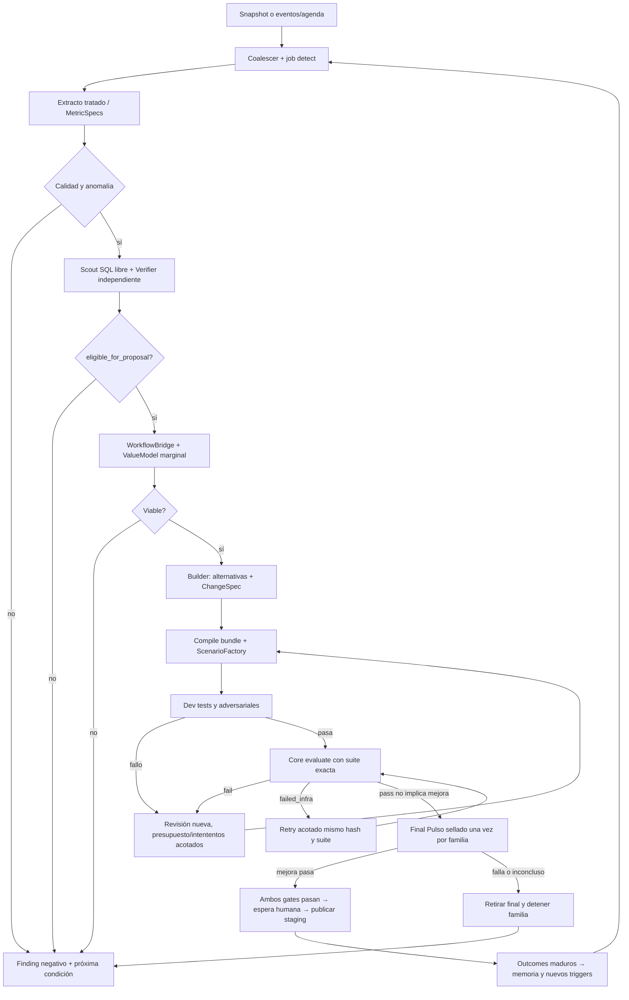

**Programación y sensores.** `scheduler_tick` compara `SourceSnapshot`/offset, config y `last_complete_window` por sensor. `trigger_key = SHA256(tenant,mission,source_snapshot,config,window,trigger_kind)` deduplica. Un trigger manual usa igual pipeline y sólo añade `requested_by`; no fuerza outcome. Los sensores son MetricSpecs declarativas con `grain, event_time, available_time, numerator_sql, denominator_sql, dimensions, allowed_strata, min_coverage, window, comparator, unit, source_contract_refs`. El scanner ejecuta cada sensor habilitado en las familias de la tabla siguiente; mantiene resultados por celdas en artifact de run y aplica presupuesto por familia. `signal` lleva query digest, conteos, missing y selección de celdas. La detección no es un LLM que «ve» un dashboard: cálculo determinista identifica candidatos; scout LLM investiga libremente el extracto; verifier independiente intenta refutar con ventanas, estratos, negativos y leakage. Un detector propuesto por LLM vive en `candidate`, después `shadow` en ventanas nuevas, y jamás justifica su propia activación.

El catálogo inicial de sensores **cubre todos los frentes sin afirmar que todos sean oportunidades**. Cada métrica exacta es config/schema versionado; si la columna no existe o cobertura falla, publica `unsupported/insufficient_evidence` por familia, no inventa indicador:

| Familia / fuente | Numerador / denominador y comparación inicial | Límite causal y ruta potencial |
|---|---|---|
| Contacto (`call_center_interactions`) | `was_resolved=False` / flag conocido por motivo/canal; espera y duración sólo sobre contactos con valor, mediana/p95 vs mismo canal | No resolución operacional, no fallo probado de IA; routing/árbol sólo si bridge y oracle lo sostienen |
| PQR (`complaints`) | `sla_breached=True` / flag conocido; `first_response_date` presente / PQR creadas; tiempo a primera respuesta sólo entre pobladas | Flag SLA provisto, no plazo legal ni causalidad de contacto; status/triage no promete reducir SLA |
| Transacciones (`transactions`) | status no aprobado / status conocido por tipo/canal/response_code; volumen USD aprobado con `amount_usd` válido | Rechazo puede ser control legítimo; status lookup/explicación no revierte transacción automáticamente |
| Digital (`digital_events`) | frecuencia y secuencias `event_type/action` por sesión/canal/versión, abandono sólo si definición de sesión/cierre válida | No hay flag explícito de error: `event_type` no se llama «fallo técnico» sin taxonomía validada |
| Productos/cartera (`products`,`customers`) | proporción `days_past_due>0` / productos con dato; estados activos por producto/cliente al snapshot | Sin historia de pagos ni causalidad de impago; rutas informativas, no recuperación monetaria afirmada |
| Marketing (`campaign_sends`,`marketing_campaigns`) | delivered/opened/clicked/conversion / flags conocidos, por campaña/canal; costo/valor sólo en moneda respaldada | Conversión sintética descriptiva, no incrementalidad; no USD si moneda no consta |
| Experiencia/operación (`satisfaction_surveys`,`service_agents`,`branches`) | CSAT/NPS sólo respondentes enlazados y tasa de respuesta; carga/duración por agente con contactos enlazados | Comparar agentes ajusta mix/canal/volumen; `avg_csat` snapshot no es gold de cada episodio |
| Plataforma observada (eventos durables + OTel auxiliar) | handoff/unsafe/tool unknown/latencia por capa, recontacto y patrón de resolución humana con denominadores y cobertura | Eventos tardíos/sampled traces no son ausencia de acción; sólo claims de capas observadas; fuente independiente del detector |

El orden en esta tabla no prioriza ganador. En discovery todos los sensores habilitados compiten bajo presupuesto de scan; su orden de ejecución se registra y varía por fairness. `SourceContract` documenta para cada flag su disponibilidad temporal: los resultados posteriores sólo sirven como label retrospectiva y nunca se filtran a decisión previa. La evaluación independiente de un cambio siempre usa oracle de la capacidad afectada, no una correlación visual entre dos tablas.

**Construcción de propuestas.** Para cada oportunidad elegible según el predicado de §29.8, `BridgeBuilder` consulta WorkflowCatalog/capabilities y §16; si falla, conserva `blocking_reasons`. `PortfolioRanker` agrupa por población/objetivo, deduplica lineage, estima valor marginal y toma top-k bajo presupuesto. Builder LLM usa Core externo real, navega libremente SQL/wiki autorizados y devuelve `do_nothing` y alternativas disponibles, `ChangeSpec` tipado y predicciones falsables. Compilador verifica schema/G0/refs/Core capabilities fijadas y policy sandbox; no ofrece nueva autoridad ni knowledge no soportado. Si ninguna alternativa es construible, publica `no_safe_change`. Dos propuestas con mismo base head: perdedora rebase+reevalúa.

**ScenarioFactory y firewall.** `ScenarioCase` fija `{case_id,family_id,origin=source_derived|platform_failure|generated|adversarial,source_refs,decision_cutoff,language,initial_bank_state_ref,customer_messages_ref,allowed_actions,forbidden_actions,expected_goal,oracle_ref,split,seed,sensitivity}`. `OracleSpec` se versiona **antes** de ejecutar candidatos: predicados sobre estado final del simulador/plataforma, receipts, permiso, información comunicada y handoff; define `pass|fail|unsafe|unknown`, no texto libre evaluado por builder. Estado inicial/policy son privados y provienen de fixture generado o fuente válida anterior a cutoff; no se inventa sesión/saldo/autorización del CSV. Agente adversarial interactúa por la misma API de plataforma/simulador, varía idioma/ambigüedad/errores y no ve oracle. Casos/oracles son artefactos cifrados por split; reviewer distinto adjudica gold donde no hay receptor verificable.

El split se sella **por campaña/familia de propuesta**, no por revisión: grupos de cliente, episodio, plantilla y fuente relacionada se asignan enteros a `development`, `validation` o `final_locked` con hash de seed/manifest antes de construir. Variantes adversariales de un caso heredan su split. Builder, scout, memoria recuperable, SQL de desarrollo y feedback granular nunca ven `final_locked`. Una familia que falla final recibe sólo gate agregado (`pass/fail`, métricas agregadas y error de seguridad genérico), no casos ni trazas; la siguiente familia necesita un final independiente sellado antes de iterar. Casos finales gastados quedan `retired`, no vuelven a ser holdout. Gate de acceso se ejecuta en extractor, artifact reader, memory retrieval y API, no sólo en prompt. Un canario sintético de fuga en final debe bloquear release si aparece en output de desarrollo.

**Comparación y gate.** Baseline Pulso seleccionado y candidato (registrar release exacta; base habilitante Core es staging, no necesariamente prod) corren emparejados con mismo caso/seed/policy/banco, pero namespaces físicos separados y reset verificado por digest antes/después. Se randomiza orden de brazos para no confundir calentamiento. `EvaluationPlan` predeclara métrica primaria **por objetivo del bridge**, secundarios, no-inferioridad de seguridad, mínimo de casos por estrato ES/PT/riesgo, presupuesto, CI y umbral; si el set es pequeño, resultado es `insufficient_power`, no «pasa». `unknown` por caída de banco/modelo/oracle se reporta aparte, excluye claim de mejora y dispara retry limitado con mismas versiones. Un solo unsafe confirmado bloquea release; ninguna reducción de costo compensa unsafe. Cada iteración es nuevo `ChangeSpec`/bundle/evaluation; el historial conserva fallos. Tras máximo configurable de intentos o presupuesto, se publica `stopped_no_improvement` con siguiente condición automática, no loop infinito. La tasa de éxito se expresa sobre casos evaluables **y** cobertura evaluable.

BaselineSelectionReceipt se sella antes de construir/evaluar el candidato: regla, capacidad activa anterior a la propuesta o política do_nothing explícita, release/digests, mundo, objetivo y oracle. No elegir después una baseline peor para fabricar mejora. Acciones humanas históricas sin ejecutor reproducible y oracle compartido sólo constituyen comparación descriptiva, no delta emparejado; agente nuevo con floor Core tampoco acredita por sí solo mejora Pulso. Cambio de baseline/release durante campaña invalida el plan y exige nueva campaña, no mezcla resultados.

La diferencia primaria usa un universo predeclarado y el conjunto común de pares evaluables, nunca denominadores independientes por brazo. Se reportan unknown por brazo/estrato, cobertura común y diferencial de missing; EvaluationPlan fija cobertura mínima y tolerancia diferencial antes del run. Rechazo incorrecto del candidato sobre contexto válido es fail, no unknown. Casos desconocidos pueden suspender el claim de mejora aunque la tasa condicional suba; no se imputan como éxito. Abandono legítimo se clasifica mediante oracle predefinido. Tests: candidato falla en casos difíciles y no mejora por excluirlos; selección post hoc de baseline rechazada; reintento de infraestructura conserva caso/versiones sin doble puntuación.

EvaluationPlan exige metric_ref/unidad/dirección, efecto mínimo, método/α/seed/CI, mínimos de pares y grupos/estratos, cobertura mínima común, tolerancia diferencial de unknown, guardrails, split/manifest, baseline receipt y presupuesto. Campos ausentes, denominador cero no contemplado, umbral fuera de rango o unidad incompatible invalidan el plan antes de llamar modelos. No se aplican defaults permisivos de aprobación. Son parámetros configurables/versionados del entorno, no estimaciones de rentabilidad bancaria; S0 materializa fixtures de planes completos e incompletos y su validador.

**Publicación actual, rollout futuro y aprendizaje.** Tras los gates de Pulso y `EvalReport.verdict=pass` del registry, el motor queda `waiting_human_approval` ligado al hash exacto. Un humano autorizado aprueba y publica: publish mueve staging, no prod; promover prod requiere otra acción humana. `PlatformReleasePort` para shadow/canary/cohortes es una extensión futura **no soportada** por registry rev2. El mock actual no inventa sus endpoints ni confirma exposición inexistente. Un experimento opcional de cohortes en banco sandbox se etiqueta `pulso_extension_simulation`, independiente de publicar una release core. Rollback actual exige promover una release anterior activa con humano; luego puede revocarse la defectuosa, nunca mientras prod apunte a ella. El sandbox no prueba impacto live. Detector consume eventos externos y puede contradecir wiki; no usa su propio texto como evidencia de éxito.

## 19. Persistencia, aislamiento, recuperación y operación entre servicios

**Publicación inmutable.** Writer valida schema y refs, canonicaliza JSON, calcula SHA-256 y sube blob cifrado temporal a S3 si aplica. Lee HEAD/hash del objeto; en transacción PG inserta nueva revisión/edges, comprueba lease + tenant + source/config/policy vigentes, mueve `pulso_artifact_heads` con `WHERE head_version=expected`, inserta auditoría y job result; sólo entonces la revisión es visible. Un blob sin referencia PG es huérfano y GC lo elimina tras ventana de seguridad; un blob referenciado sin digest válido bloquea lectura/promotion y alerta. GC enumera refs alcanzables de heads **y** auditoría/retención legal, marca candidatos, espera grace period, vuelve a verificar y borra sólo huérfanos. Restore desde backup restaura PG/S3 coherentes o deja artefacto `unavailable`; aplica tombstones/revocaciones antes de servir.

**Claim, cuota y fallo.** `claim_next` corre en transacción corta: obtiene advisory transaction lock de `(tenant,lane,resource)`, valida cupos activos, selecciona un job `queued` vencido con `FOR UPDATE SKIP LOCKED`, hace reserva condicional en `pulso_quotas`, incrementa `lease_version`, pone `running`/lease/costo reservado y commitea. Scheduler pasa `retry_wait→queued` antes del claim. No mantiene lock durante SQL/modelo. `finish_job` exige lease/head esperados; en la misma transacción persiste artifacts/edges/audit, costo real y `complete`; la reserva de presupuesto permanece como cota conservadora de la ventana. Para cada transición, `append_run_event` bloquea la fila del **job raíz** `run_ref`, incrementa allí `last_event_sequence` e inserta `(run_ref,sequence)` antes del commit; el lock serializa writers del mismo run, no todos los tenants. El evento es durable junto al cambio de estado. Sweeper sólo requeue jobs con lease vencida y no-effect confirmado; si pudo haber efecto externo, deja `waiting_dependency` hasta reconciliación específica por operación (§27), no command-key lookup universal. Índices parciales `(tenant_id,lane,priority DESC,due_at,id) WHERE status='queued'` y `(lease_until) WHERE status='running'`; medir `EXPLAIN ANALYZE`, vacuum/bloat y pool wait. Para fairness scheduler rota lanes por pesos configurados, no confía en ORDER BY global. `dead` requiere razón; retry autorizado como generación nueva no duplica efecto.

**SQL sandbox.** Local: extractor crea derivados tratados con archivos de sólo lectura y manifest; helper launcher rootless del host, iniciado por just dev y único poseedor del socket Podman, recibe grants por transporte privado autenticado e inicia contenedor efímero por run, imagen fijada por digest, red `none`, usuario no-root, fs root readonly, `/tmp` tmpfs limitado, cgroups CPU/RAM/PIDs, seccomp, deadline y output pipe limitado. El broker admite consultas sobre views allowlisted y `CREATE TEMP TABLE/VIEW AS SELECT`; DML sólo sobre objetos scratch creados en esta invocación. Cada petición contiene un único AST; las fuentes originales y sus views no admiten escritura. Deniega `read_csv/read_parquet` a rutas arbitrarias, `ATTACH`, `COPY`, `INSTALL/LOAD`, UDF externas y múltiples sentencias. El contenedor recibe digest/manifest, no path del dataset original ni secret. El broker revalida filas/columnas de salida y agregación mínima antes de enviar al modelo. Cada query deja receipt con digest de SQL tratado, dataset extract digest, costo/bytes/filas, cutoff y truncación. Revocación cancela container y fencea publicación; cleanup borra directorio por run validando path exacto. Tests positivos de CTAS y negativos de modificación de fuente, lectura externa y escape de namespace son obligatorios. Un SQL malicioso no se convierte en escalamiento de host aunque el parser falle: el aislamiento OS es segunda barrera.

AWS: `worker` envía `SandboxRequest{run_id,image_digest,extract_blob_ref,manifest_digest,grant_ref,budget,deadline,callback_ref}` a dispatcher autenticado. Dispatcher lanza **un ECS/Fargate RunTask por run**, no SQL dentro del service worker; pasa `clientToken` estable para idempotencia de lanzamiento y reconcilia por task ARN/`DescribeTasks` si el ack se pierde. La idempotencia de `RunTask` tiene TTL limitado: el ledger `pulso_external_commands` conserva el efecto y evita reemitir a ciegas fuera de esa ventana. El task descarga sólo extracto cifrado con grant S3 acotado, mantiene sesión DuckDB adaptativa mediante mailbox S3 (§29.8), sin egreso general; al cerrar devuelve `SandboxResult{run_id,query_receipts,output_blob_ref,digest,status,usage}` firmado. Worker verifica firma/digest, lease/grant vigentes antes de publicar. Timeout/callback tardío se deduplica por `(run_id,attempt,lease_version)`; limpieza revoca grant y elimina scratch. `infra/terraform/modules/sandbox` define task definition, red, IAM y límites. EC2 demo usa launcher local pero no se toma como prueba de aislamiento AWS.

**Dependencias y deploy.** `control-api/worker` se despliegan por digests separados y leen config por ref; migración expand/contract precede binarios nuevos. Release de capacidad en plataforma es distinto de release de código del motor: ambos tienen receipts/rollback. LocalStack sólo S3; PG y simulador de plataforma son contenedores reales; Jev/LLM externos se usan con permiso/presupuesto, recorded sólo en tests etiquetados. EC2 demo es disposable: Terraform recrea infra; evidencia proviene de blobs/backup etiquetados, no del disco de VM como única copia. Runbook prueba crash/restart/restore y declara RPO/RTO medidos antes de producción. Terraform `plan` no implica `apply`; Git nunca almacena dataset, PII, secrets ni state.

**Divulgación acumulada SQL (U05/U08).** El perfil versionado del extracto distingue `synthetic_authorized`, observaciones individuales autorizadas por propósito y agregados sensibles. Un mínimo de grupo aislado no demuestra privacidad: el broker mantiene presupuesto de consultas/resultados por principal, propósito y extracto, compartido entre sesiones, y rechaza selectores individualizantes y diferencias/solapamientos que puedan revelar grupos pequeños. Si no puede evaluar conservadoramente esa divulgación, sólo admite vistas agregadas previamente aprobadas o bloquea el perfil; no promete privacidad diferencial. Cada rechazo deja reason/receipt sin revelar filas. Tests obligatorios: dos agregados aceptables aisladamente cuya diferencia revela una persona, filtros repetidos, ORDER/LIMIT/proyección y nueva sesión que intenta resetear presupuesto. Este gate precede datos bancarios reales, no impide fixtures sintéticos autorizados.

**Recuperación medible (U25/U28, gate P5).** DeploymentProfile versionado fija objetivos RPO/RTO por entorno, estrategia de backup PG/S3, responsable y runbook. No son garantías hasta medirlos. Antes de aceptar AWS, un restore drill aislado registra objetivo y pérdida/tiempo observados, digests y limitaciones; reconcilia tombstones/revocaciones posteriores al backup antes de habilitar acceso. Prueba blob faltante, snapshots desalineados, leases vencidos y operación enviada sin ACK: unknown reconcilia, nunca se reenvía automáticamente por restaurar. Un drill que exceda objetivo no pasa el gate y requiere corregir estrategia o aprobar una nueva versión explícita del objetivo.

## 20. Visibilidad del motor, API y pruebas de aceptación

**Read model común.** Toda vista/API del motor incluye `tenant_id,projection_revision,as_of,environment,source_kind,validation,status,blocking_reasons[],next_automatic_action,available_commands[]`. `source_kind` distingue `historical_csv`, `enriched_history`, `platform_observed`, `sandbox_evaluated` y `assumption`; ningún consumidor los suma como una misma métrica. Comandos excepcionales llevan `idempotency_key,expected_revision,reason` y rol/grant; 202 = encolado, no completado; 409 trae head/diff tratado; 403 no filtra existencia ajena. SSE `{event_id,entity_ref,projection_revision,kind}` puede duplicarse o llegar fuera de orden; consumidor reconsulta y descarta revisiones viejas. `GET` no mueve heads ni crea memoria. El motor proporciona contratos/read models para la plataforma y una consola **interna de ingeniería** (§25); no construye la consola integral de atención.

| Superficie expuesta a la plataforma | Read model y estado visible | Intervención excepcional | Prueba de contrato |
|---|---|---|---|
| Centro de mando | Jobs/lag, embudo con denominadores, releases, costos observados vs supuestos, incidentes, fuente/config activos | `schedule_run`, pausar reintentos o kill-switch según rol; todo con razón/version | Run vacío y run activo visibles; una métrica sin datos dice `unknown`, no 0 |
| Expediente de oportunidad | Fuente/ventana/población, consultas reproducibles, soporte/contraevidencia, `WorkflowBridge`, rango de valor y grado de enlace | Objetar evidencia, pedir nueva investigación o congelar; no editar resultado histórico | Navegar del hallazgo al CSV agregado, bridge y candidato; `mechanism_proxy` no aparece como ahorro comprobado |
| Cambio propuesto | `ChangeSpec`, diff de bundle, ruta/capa afectada, contrato de skills/tools/knowledge, compatibilidad y fallos de compilación | Experto puede objetar o aportar conocimiento; no construye el cambio paso a paso | Prompt malicioso no concede autoridad; stale head da 409 y nueva evaluación |
| Laboratorio de evaluación | Baseline vs candidato emparejados, cohortes/estratos, oracle receipts, `unknown`, CI/potencia, casos adversariales permitidos | Iniciar dev eval, detener, revisar gate; final sólo por servicio autorizado | No se muestran trazas final locked al builder; caída de oracle nunca cuenta como pass |
| Release y memoria | Estados core draft/candidate/evaluated/approved/published, candidate_hash, base/staging/prod y wiki independiente | Humano requerido para approve/reject/publish/promote/revoke | Hash cambiado invalida aprobación; Core pass no implica mejora; canary unsupported |
| Observabilidad como evidencia | Por run/episodio externo, eventos durables por capa + spans best effort, coverage y correlación | Experto puede señalar interpretación errónea | Collector apagado mantiene eventos; `traces_unavailable`/gap visibles |

**Interacción normal:** el motor corre solo y publica actividad a medida que investiga, escribe memoria, construye/evalúa propuestas y decide continuar o detenerse. La plataforma presenta su expediente; el usuario sólo entra si quiere inspeccionar o recibe `DecisionRequest` por autoridad, contradicción, policy o veto. Aceptar grant no salta gates automáticos. La plataforma es responsable de UX, scroll, accesibilidad y oficina de agentes; nuestro contract test verifica que dispone de estados/razones/diffs/acción siguiente para renderizarlos. Monitor mínimo de demo consume la misma API, sin wizard ni edición de agentes.

**Modelos de error de la API.** `Problem{code,message,correlation_id,retryable,current_ref?,blocking_refs?}` con códigos `source_unavailable`, `quality_gate_failed`, `policy_denied`, `stale_head`, `lease_lost`, `budget_exhausted`, `dependency_unknown`, `oracle_unavailable`, `holdout_forbidden`, `not_evaluable`, `artifact_revoked`. No se devuelve stack/SQL/PII. Eventos de background usan el mismo `code`. Solicitud de rollback es idempotente sólo en Pulso; exige evidencia del alias y humano para promote. Core no ofrece expected_active CAS: sin lector/garantía de alias o ante writer externo concurrente no se promete 409 ni rollback exclusivo; resultado unknown se reconcilia (§27). Los read models se reconstruyen desde tablas/artefactos; cache UI no es verdad.

**Matriz de aceptación del flujo completo.** Los tests aquí son bloqueantes; se escriben rojo antes de implementar su corte y corren con PG/LocalStack/DuckDB/banco sandbox reales, salvo provider grabado en suite determinista. Cada fila define input, salida observable y nivel mínimo, por lo que el equipo no debe inventar éxito por mocks.

| ID / owner | Input y decisión observable | Gate de aceptación y pruebas |
|---|---|---|
| E01 Data | Dataset original + manifest versionado | 13 SourceContracts/golden headers y types, hash original idéntico, quality report de cobertura/completitud diaria/PK/FK, extracto sin PII directa; unit+integración |
| E02 Backend | Dos triggers y worker concurrente | Una generación lógica, nuevo ciclo sucesor con parent, claim/fence/cupo atómico, poll tras NOTIFY perdido, no double effect; integración PG+fault |
| E03 Security/Data | Scout SQL intenta leer raw, otro tenant, final o egress | Denegación por broker **y** contenedor; no mount raw, no red/socket, result disclosure guard, kill/revocación, cleanup; integración Podman+security |
| E04 AI/Data | Métricas en familias múltiples y anomalía inyectada sin nombre `Queja` | Selección por ranking predeclarado, confirmación/refutación independiente, query receipts, temporal availability y quality gates; regresión CSV+property tests |
| E05 Product/AI | Señal contact-unresolved + PQR sin join | Bridge `mechanism_proxy` o `unlinked`, nunca `same_outcome_linked`; ninguna cifra de SLA evitado; golden dataset E2E |
| E06 AI/Backend | Oportunidad viable + dos builders concurrentes | Do-nothing+alternativas, ChangeSpec schema, bundle compilable, CAS único y rebase del perdedor; contract+integración |
| E07 Eval | Mismo caso baseline/candidato con banco real sandbox | Namespace reset comprobado, oracle independiente, pass/fail/unsafe/unknown, split familiar y final sellado; integración+adversarial E2E |
| E08 Eval/Security | Fuga de canario final a memoria/SQL/prompt | Release bloqueado, incidente y fuente del leak auditada; la familia final se retira sin feedback granular; security regression |
| E09 Integración plataforma | Simulador emite normal/ambiguo/ajeno/multi-goal ES/PT y fallos de cada capa | Motor ingiere eventos/trazas con cobertura, detecta patrón y evalúa cambio por contrato; no implementa atención; contract+E2E |
| E10 Backend | Respuesta perdida de create/PUT/evaluate/publish/promote | Reconciliación según operación §27; publish misma key, create/promote sin query_key ficticio; unknown/manual_reconcile visible; crash+fault injection |
| E11 Release | Core pass + Pulso improvement pass, humano ausente, staging concurrente o respuesta perdida | Sin humano no publish; candidate_changed/proposal_stale obliga rebase+reevaluación+aprobación nueva; publish idempotente; promover prod no es canary; chaos+contract (§27) |
| E12 Memory | Segunda corrida tras éxito y luego revocación | Agente explora/reorganiza wiki, publica diff con CAS; tras revocación no se monta en workspace/modelo/release ni tras restore; integración+restore |
| E13 API/visibilidad | Plataforma/simulador consume feed durante tarea en progreso | Read models 403/409/diff, SSE duplicado/stale, estados unknown/coverage gap y redacción; contract API |
| E19 Frontend/Backend debug | Ingeniero abre run atascado sin acceso a shell | Grafo, cronología durable, consultas/model receipts, último error y siguiente wakeup; replay fork no muta original; OTel caído deja eventos; redacción/holdout/tenant; browser E2E + PG fault + load (§25) |
| E14 Infra | Local limpio y AWS plan | `doctor`, stack Podman/LocalStack S3, Terraform fmt/validate/plan, launcher aislado, deploy demo recreable, restore y runbook; CI+smoke |
| E15 Performance | Perfil de carga declarado: hardware, dataset manifest, provider/latency, 1×/3×/10× + scan | Reporte p50/p95/p99, queue lag, PG waits/bloat, slots, costo/1.000 casos; ninguna promesa SLO sin medición; load+chaos |
| E16 O11y/Data | Mismo episodio pasa árbol→IA1→IA2→humano; un span falta y un evento llega tarde | Detección de cuello por capa usa eventos completos; span faltante produce cobertura desconocida, no omisión; late event revisa signal sin mutar pasado; contract+E2E |
| E17 Integración modelos externos | DecisionModelDef/decide con Jev Choice/Score y LLM estructurado reales, provider lento y fallback prohibido | Receipts con modelo/ruta/costo, schema validado, presupuesto atómico; no fallback cross-policy; smoke live + contract recorded |
| E18 Infra/CD | Engine publica manifest, infra plan/apply staging aprobado | Imágenes API/worker/Core separadas, OIDC sin keys, migración/smoke/rollback; simulado local + smoke AWS staging |

**Fuente completa no equivale a día completo.** `SourceSnapshot` contiene por tabla/partición `row_count,first_event_at,last_event_at,file_digest,header_digest,ingested_at,quality_status` y calendario esperado de archivos; una fecha del nombre del path no valida todos los eventos dentro. El cutoff de `DiscoveryConfig` usa sólo días completos según `SourceContract` y disponibilidad de fuente requerida, con lag permitido versionado. Duplicado de PK divergente bloquea sólo el slice dependiente y conserva finding; `campaign_sends` y encuestas pueden ser parciales sin bloquear métricas de contactos. El manifest y sus transforms quedan fijados por digest en cada run; un query receipt que no los cite es inválido.

**Criterio de salida honesto.** E2E requiere `snapshot/eventos→detección no dirigida→verificación→bridge→ChangeSpec→EntityDraft[]→draft/freeze→EvalSuite y gate Pulso→evaluated→espera humana visible→approve/publish mock→ReleaseDetail staging→eventos independientes→wiki→segunda corrida`. Incluye negativos y fallos. Jev/LLM reales en smoke controlado; recorded sólo prueba determinismo. Sin humano el éxito autónomo es candidato evaluado listo para decisión, no release publicada. Canary ficticio o UI no acreditan compatibilidad.

### 20.1 API de producto implementable: panorama, expediente, prueba y decisión

Estas rutas son de **Pulso**, bajo `/api/v1/evolution`, no endpoints Core ni atención bancaria. Se implementan en Control API existente; plataforma consume sus contratos y construye las pantallas de `design`. Debug usa proyecciones más técnicas bajo su propio scope, no un permiso universal para raw. DTOs y fixtures viven en `contracts/product/`, OpenAPI generado y pruebas N/N−1 en U07/U24; comandos e integración Registry en U21. No hay tabla durable por pantalla.

**Envelope de lectura:** campos comunes de §20 más `schema_version`, `entity_ref`, `links` autorizados y `coverage`. Colecciones usan `items,next_cursor` opaco y máximo 100 configurable; filtros `environment,source_kind,status,from,to` y dominio/idioma sólo cuando el contrato los soporta. Query desconocida falla 400, no filtro silencioso. `as_of` es freshness de la proyección, no disponibilidad universal; 404 no revela objetos de otro tenant. El catálogo disponible permite deshabilitar controles sin inventar éxito.

| Método/ruta relativa | DTO y consumer de producto | Contrato de comportamiento |
|---|---|---|
| `GET /capabilities` | `CapabilityAvailability`: operación/kinds/entornos admitidos, provider/version, estado/reason | `available\|simulated\|unsupported\|dependency_blocked`; autoría ToolDef no demuestra executor; canary upstream unsupported se muestra explícito |
| `GET /overview` | `OverviewProjection`: actividad, métricas, oportunidades priorizadas y dependencias | Panorama muestra investigación/iteración en curso, no sólo resultados terminados; fuentes y periodos no mezclados |
| `GET /opportunities` y `/opportunities/{id}` | `OpportunityProjection`: problema, population/window, soporte/contraevidencia, bridge, alternativas, supuestos, rango valor y refs a candidatos | Abrir tema no dispara investigación ni cambia prioridad; refs sólo a evidencia permitida |
| `GET /proposals/{id}` | `ProposalProjection`: ChangeSpec, candidate/hash, diff, artefactos, affected_consumers, estado/gates y paso siguiente | «Agentes» puede agrupar Flow/Agent/DecisionModel/Tool/context sin convertir todo a Agent. Refs de consumers derivadas de closure/digest; stale/incompleta impide declarar cambio seguro |
| `GET /proposals/{id}/comparison` | `ComparisonProjection`: base/candidato, muestras dev autorizadas, outcomes/efectos/tiempos y aggregates independientes | No incluye detalle de final_locked para builder/expert genérico; 5 ejemplos no son toda la suite. Otra policy o denominador marca no comparable |
| `GET /proposals/{id}/readiness` | `ReleaseReadiness`: compilation, policy, evaluation, improvement, authority, published_alias, activation_ack, exposure | Gates, aprobación, publicación y activación separados. `exposure` sólo si plataforma lo soporta y receipt confirma; nunca derivado del selector 10/50/100 |
| `GET /runs/{id}/activity` | `ActivityProjection`: sequence, stage, estado, reason, evidencia refs y next wakeup/action | Progreso de detección/verificación/builder/trials/memoria visible con reasoning summary sustentado, no chain-of-thought privada; SSE existente notifica refs y consumidor reconsulta |
| `POST /opportunities/{id}/feedback` | `ExpertFeedbackRequest`: expected_revision, type `support\|challenge\|knowledge\|request_review`, texto tratado y evidence_refs autorizadas | Artefacto append-only con actor/config/ref; no edita el finding. Contradicción agenda reverify sucesor con ref; conocimiento nuevo pasa seguridad/provenance y no se promueve a policy por opinión |
| `POST /proposals/{id}/trials` | `TrialRequest`: candidate_hash, dev scenario/fixture_ref o input tratado, config_ref y budget_ref | Dev sandbox independiente, nunca final_locked. Agente adversarial real sólo dentro de grants; input no confiable no da permisos. Trial es job async con receipts de resultado |
| `GET /decisions` y `/decisions/{id}` | `DecisionRequestProjection`: type, target hash/revision, actor roles permitidos, opciones, rationale/evidence refs, deadline y estado | Lista de excepciones, no wizard; distinguir approval de release de ayuda por evidencia/dependencia. No contiene autoridad de aprobar dinero |
| `POST /decisions/{id}/responses` | `DecisionResponseRequest`: expected_revision, option, reason, evidence_refs | Validar rol/grant, vencimiento, candidate/config actuales y policy; approve/reject sólo para esa propuesta/hash. Cumplir Core JWS y G1 local de separación autor/aprobador cuando policy lo requiere; Core no lo garantiza por sí solo |
| `GET /commands/{kind}/{id}` | `CommandStatus`: accepted/running/succeeded/failed/unknown, receipt_ref, resulting_ref, error y próximo reconcile | Recargar tras timeout consulta status; unknown conserva efecto potencial. Aceptación no acredita publicación |

**Comandos:** header `Idempotency-Key` y body `expected_revision,reason` donde muta; actor/tenant se obtienen del principal verificado, no del body. Tx PG valida/persiste artefacto y encola job antes de 202 `{command_ref,status_url,entity_ref}`; `pulso_external_commands` representa operaciones externas y jobs/artifacts los trabajos internos, no tabla adicional commands. Clave repetida misma intención retorna status existente; payload distinto 409. Para una respuesta de decisión, consumir mediante CAS y probar dos respuestas concurrentes; una sola transición local, efecto externo unknown reconciliado según §27. 401 no autenticado, 403 scope, 409 stale/conflicto, 422 input/operation inválida, 429 quota con retry, 503 dependencia. No garantizar atomicidad distribuida con Registry.

**DecisionRequest:** `type=release_authorization|evidence_help|dependency_authorization`; las dos últimas sólo `provide_feedback|decline`, no pueden activar permisos/policy. La primera ofrece opciones permitidas por operación upstream (`approve|reject|publish|promote|revoke` cuando disponibles), cada solicitud fija operación/target y nunca presenta approve como publish implícito. Estado `pending|responded|expired|superseded`, deadline configurable, reviewer y respuesta con digest. Vencimiento no aprueba por silencio: detiene únicamente la acción dependiente y agenda reminder con dedup, sin frenar otros runs. «Ahora no»/cerrar panel es estado local de UI; snooze personal opcional de plataforma cambia notificaciones, no el motor. Pausa/cancelación exigen comandos técnicos autorizados distintos. Prueba humana del sandbox es ayuda opcional, no requisito universal para toda evolución.

**Identidad de consumidor:** JWT de plataforma validado en API con issuer/audience allowlisted, JWKS/algoritmos fijados, exp/nbf, subject y tenant/grants verificados; mapping de roles→scopes versionado, no confiar en selector de rol. Cliente bancario no tiene scopes evolution. Scopes mínimos `evolution:read`, `evolution:feedback`, `evolution:trial`, `evolution:decision`, `evolution:operate`, `evolution:debug`; autorización por objeto/purpose y partición también en links/export/blob/download. Token de sesión plataforma no es firma Core: el bridge obtiene JWS del humano autorizado para el target/operación exactos, no fabrica identidad humana. Login/SSO/MFA son externos, fixtures locales simulan claims verificados y prueban issuer/aud/expiry/tenant incorrectos y revocación. No construir otro IdP ni almacenar password/OTP.

**Métricas:** `MetricProjection{metric_ref,value,unit,numerator,denominator,population,window,source_kind,quality,formula_ref,assumption_refs,fx_ref?,uncertainty?,comparison_ref?}`; desconocido es null+reason, nunca cero. Grouping árbol/AI/humano es presentación declarada; conservar clasificador fuera de cierres y AI1/AI2 diferenciados en detalle, sin double-count de mitigación+handoff. Resultado correcto puede ser handoff según policy. Costos/valor comparativo USD con FX/fecha/fuente; límites bancarios mantienen moneda nativa/policy exacta. Readiness «0 fallos/n» no promete seguridad absoluta. Trial datasets/status no entran a KPI observado.

**Tests bloqueantes de este corte:** U07 contrato/routing/paginación, issuer/audience/tenant, 202/status/retry/revision; U24 flujo panorama→tema→propuesta→comparison→trial→decisión con estados activos/unknown/unsupported; U21 respuesta concurrente/expiry/hash changed/four-eyes y fallo Registry; U20/U27 trial muta sólo sandbox, adversarial input no filtra datos, no fuga de final y no contaminación KPI; U29/U30 requested_reply/cierre/mitigación/métricas denominadas; U33 feedback contradice memoria y reverify sin reescribirla. Fixtures sólo acreditan representación; integración exige API/PG/worker/Core/sandbox reales y lectura del receipt. UI scroll/keyboard son responsabilidad plataforma y pruebas contractuales habilitan los estados necesarios; consola debug verifica su propio E2E.

### 20.2 Precisiones wire y seguridad de la ejecución asíncrona

**Integridad de presentación y evidencia (U07/U24/U32).** Una nota es texto UTF-8 tratado con límite versionado, no objeto serializado implícitamente; schema rechaza tipos incorrectos y UI no muestra `[object Object]`, HTML ejecutable ni payload raw. El expediente conserva la evidencia conocida al solicitar la decisión; verificaciones posteriores aparecen como nuevos eventos con timestamp/provenance, nunca se hacen pasar por evidencia anterior. El dispatch revalida la condición vigente aunque la proyección muestre evidencia histórica. Tests contract-consumer y UI: nota vacía/texto/objeto inválido/XSS; evidencia posterior a solicitud claramente identificada, reloj/orden discrepante visible, sin atribuir identidad ya verificada al instante anterior. La cronología inconsistente de un fixture no modifica clocks de producción.

**Continuidad de reautenticación (U07/U21).** El challenge externo se vincula a CommandRef, decision_ref, actor_ref, target/revision y operation; CommandStatus sólo expone esa referencia autorizada y expiry, nunca credenciales. Reanudar el comando es idempotente por CAS de su revisión, sin crear otra DecisionResponse. Se rechazan callbacks duplicados, challenges consumidos/expirados, comandos desconocidos/terminales, actor distinto, target stale o permiso revocado; un callback duplicado puede devolver el recibo previo, pero nunca adquirir otra firma ni repetir dispatch. Se revalidan todas las condiciones justo antes de enviar. Unknown obliga a reconciliar antes de cualquier reenvío. Tests: expiración en cola→espera→step-up→un dispatch; replay/cross-actor, cambio de target, revocación durante step-up y crash entre acquire/dispatch sin token durable. Sin puerto externo compatible se conserva dependency_blocked.

Rutas adicionales de trials: `POST /trials/{id}/turns` recibe input tratado, expected_revision y header idempotente; sólo permite trial dev conversacional abierto y acceso del actor al sandbox. Devuelve CommandRef de turno y status_url; reducer actualiza TrialProjection con secuencia, resultados y receipts sin convertir el trial en fuente de producción. Trial cerrado, vencido o revocado rechaza nuevo turno; POST concurrente con misma revisión deja un turno aceptado y otro 409, retry mismo key devuelve el anterior. `GET /trials/{id}` es readback del conjunto.

Esta sección fija las precisiones de §20.1; fixtures/schemas ejecutables se construyen por TDD en U07/U21, no se afirman existentes en este workspace de planificación. `Idempotency-Key` es autoridad wire en API producto; `idempotency_key` se deriva internamente, el body no acepta una segunda clave. `expected_revision` siempre es revisión de dominio de la entidad mutable indicada por ruta, nunca projection_revision ni timestamp. OpenAPI distingue opportunity revision para feedback, candidate revision/hash para trial y decision revision para respuesta. Una proyección atrasada con dominio vigente no causa 409 artificial.

**CommandRef y lookup:** `{kind:job|external_command,id}` referencia owner existente. URL `GET /commands/{kind}/{id}` es la forma canónica del status_url de §20.1; rechazar kind desconocido y validar tenant/actor. Job queued/deferred/retry_wait/waiting_dependency → accepted con substatus/reason/next wakeup; running → running; complete → succeeded sólo con result receipt; dead/failed/superseded → failed; efecto externo desconocido → unknown con reconcile_ref, aunque el job termine. Cancelled es failed con code cancelled, no success. Ledger normativo §15: prepared→accepted, sent→running, confirmed→succeeded, rejected→failed, unknown→unknown; reconciled deriva succeeded/failed sólo de receipt terminal comprobado, sin él permanece unknown. El comando termina por su operación, no por todo el árbol de jobs; reverify devuelve resulting_ref al sucesor de investigación. No añadir tabla commands ni reconstruir resultado desde mensaje de log.

**Trials y lectura de resultados:** `TrialRequest` tiene exactamente uno entre fixture_ref dev autorizado o input tratado, y fija candidate_hash, candidate revision, config_ref, provider_profile_ref y presupuesto. Harness crea TrialPlan inmutable con oracle/grant/source/seed cuando aplicable; no accede final_locked. `GET /trials/{id}` devuelve `TrialProjection{trial_ref,plan_ref,candidate_hash,environment,stage,status,scenario_ref,conversation_ref?,action_receipts[],effects[],oracle_result?,cost_receipt?,limitations[],result_links}` más envelope. GET de conversación/evidencia usa los links autorizados de detalle, jamás raw público. Estado sin oracle es pending/unknown/failure, no pass. Continuar chat crea turno/job referenciado al mismo trial sandbox y CAS revision; no reutiliza sesión de otro usuario ni escribe historia productiva. E2E headless de U24 verifica enviar→status→resultado y permisos; no construye la UI F8.

**Target de decisión discriminado:** approve/reject/publish → `{kind:proposal,proposal_ref,proposal_rev,candidate_hash,base_release_ref}`; promote/revoke → `{kind:release,release_ref,agent_ref,release_digest,alias?,alias_observed_ref?}`. Operación fija opciones válidas; publish exige aprobación vigente. agent_ref se verifica contra ReleaseDetail.agent_id para la ruta de alias; release_digest es digest interno Pulso del manifest/closure/receipt fijados, no un release_hash del wire Core. Alias observado es evidencia/precondición Pulso, no CAS inexistente Core. Writer externo o ACK perdido mantiene unknown hasta reconciliar. `responded` significa respuesta durable, no éxito externo; linked command conserva su estado. Expiry sólo cambia pending por CAS; no expira/reabre responded para duplicar operación. Test sweeper+respuesta concurrente/timeout/dobleclick conserva una decisión y un comando lógico.

**HumanAuthorizationPort — externo, no nuevo IdP:** `prepare(actor_ref,target,operation,decision_ref)` devuelve challenge_ref/expiry/authority_ref sin credenciales; `acquire(challenge_ref,verified_step_up)` obtiene en memoria JWS válido para el método Core concreto. El emisor/firma humana es de plataforma autorizada; Pulso no suplanta sub ni firma por un actor que sólo hizo click. DecisionResponse se guarda como intención auditada y job; inmediatamente antes del dispatch se verifican grant/revocación, target/rev, expiry, operación y firma. JWS/OTP/tokens jamás en PG/S3/artefactos/logs/colas; sólo refs/digests no reversibles de recibos y expiry. Si emisor permite referencia delegada, ésta debe ser acotada/revocable y verificada por puerto externo, no asumir soporte. Si no puede reemitir sin presencia humana o expiró step-up antes de dispatch, comando espera `waiting_human_reauthentication` y pide nueva autenticación para la misma intención; no repite efecto ni inventa aprobación nueva. Caída tras envío conserva unknown y reconcilia antes de solicitar reenvío. El doble de identidad local prueba TTL, actor cambiado, clave rotada, revocación y cero persistencia de token; integración real queda dependency_blocked hasta puerto disponible.

**Scopes y admission:** debug_viewer requiere `evolution:debug`+grant de lectura técnica por objeto; debug_operator exige además `evolution:operate` y grant específico de comando; ninguno implica builder/admin de Registry. JWT válido no prueba ausencia de revocación: overlay/grant store se consulta en fronteras; estado indisponible falla cerrado para mutaciones/egreso, lecturas sensibles y export. Feedback/input de trial se limita por tamaño, valida refs/tenant/partition, trata PII y rechaza final refs antes de persistir/encolar; payload malicioso sigue siendo dato, audit sólo conserva código/ref tratado. Umbral de retención local no puede ampliar política externa ni ser modificado por feedback.

**Disponibilidad temporal y procedencia:** plataforma discovery usa occurred_at y received_at/availability_at≤cutoff, no sólo fecha ocurrida; evento tardío se conserva como nueva evidencia sin reescribir snapshot anterior. E0 sin recepción sigue el reloj de replay y disponibilidad por evento/campo de §§28.2/29.8 con supuesto de lag etiquetado; snapshot de bytes completo no habilita datos futuros ni simula received_at real. MetricProjection añade factor_provenance por factor de fórmula para separar población observada, tiempo medido, costo supuesto y FX; source_kind agregado no implica que todos factores sean observados. Hold de retención necesita authority receipt/target/expiry verificados; flag del administrador o texto fixture no prolonga datos por sí solo.

**Pruebas añadidas:** U07 mapping de estados/domain revision/admission/cross-tenant; U21 autorización expira mientras espera/reautenticación/reconciliación y token no persistido; U20/U27 TrialPlan oneOf/turn concurrente/resultado sin oracle; U29 cutoff recibido tarde/sequence ausente; U30 factor provenance; U33 purge/hold inválido. Las pruebas de UI producto son contract-consumer/headless, distintas del browser E2E de la consola debug.

## 21. Memoria operativa: wiki libre dentro de un perímetro gobernado

Adoptamos la idea central de [Karpathy, LLM Wiki](https://gist.github.com/karpathy/442a6bf555914893e9891c11519de94f): fuentes originales inmutables, una wiki interconectada que el agente mantiene, y convenciones para ingesta/consulta/lint. **Nuestra adaptación**, no una prescripción del autor, añade tenant, propósito, retención, PII, particiones de evaluación, aprobación de publicación y versionado inmutable. No reducimos memoria a una fila por claim ni a un packet top-k que decide de antemano qué puede leer el agente.

```text
workspace de un run (desechable)
  sources/             # extractos/evidencia autorizados, readonly, con manifest
  wiki/                # copia writable del head de memoria fijado al iniciar
    index.md           # mapa temático mantenido por el agente
    topics/...         # síntesis, conexiones, hipótesis, procedimientos, fallos
    entities/...       # rutas, capas, herramientas, oportunidades, patrones
    log.md             # qué cambió y por qué, append-only dentro del snapshot
  scratch/             # SQL, notas y borradores, nunca servidos como memoria
```

**Lectura libre:** tras aplicar el perímetro `(tenant,purpose,cutoff,policy,information_partition)` al montar `sources/` y `wiki/`, el agente decide qué leer, cruzar y buscar, en cualquier orden, sin un catálogo de preguntas predefinidas ni top-k obligatorio. Libertad semántica no implica acceso directo del proceso LLM al filesystem: en Agent Core el executor general `lab_read`/`lab_query`/`lab_write_scratch` (§29.4) transporta navegación/SQL/scratch bajo la sesión autorizada; no creamos una tool de negocio por cada lectura o tabla. El broker aplica permisos y límites, no selecciona la hipótesis. FTS es ayuda, no filtro obligatorio. Páginas pueden contener resultados apoyados, hipótesis, preguntas, contradicciones y lecciones; citas usan SourceRef/artifact refs. Enlaces rotos y afirmaciones sin soporte son findings de lint, no motivo para impedir creatividad en scratch.

**Escritura libre, publicación controlada:** el agente edita, crea y reorganiza páginas en `wiki/` durante investigación, evaluación o mantenimiento. Esas ediciones no afectan a otros runs. `publish_memory(base_head,diff_digest,manifest)` valida rutas/symlinks, tamaño, PII/secretos, final holdout, referencias existentes y vigentes, tenant/purpose, links/índice/log y la distinción `observado|inferido|hipótesis|sandbox`; un reviewer automático puede señalar contradicciones y pedir otra iteración. Si pasa, se guarda snapshot/diff cifrado por digest en S3 y `pulso_artifacts(kind=memory_wiki)` más `pulso_artifact_heads(scope=memory_index/<tenant>/<purpose>/<world>/<campaign>/<protocol>/<partition>)` cambian por CAS. Dos agentes con el mismo head: uno publica; otro rebasea su diff en una copia nueva, vuelve a lint y publica revisión sucesora. No se modifica una revisión ya publicada. `MemoryUseReceipt` registra head fijado, páginas leídas, páginas cambiadas y decisiones que las citaron; no presupone que leer una página causó mejora.

**Olvido deliberado:** no bajamos la verdad de una página sólo por desuso. Un `memory_maintenance` espontáneo/periodico hace lint de contradicciones, fuentes corregidas, capacidades/release reemplazados, páginas huérfanas y enlaces rotos; reescribe síntesis, archiva hipótesis refutadas o retira páginas obsoletas, conservando su revisión anterior mientras retención lo permita. Revocación de fuente/permiso pone tombstone en control **antes** de permitir lecturas nuevas, bloquea heads afectados y dispara nueva wiki depurada; restauración de backup aplica tombstones antes de servir. Purga física sigue política de retención/privacidad; log/auditoría lícita puede conservar el hecho de la revisión sin payload sensible. Resultado sandbox nunca se eleva a outcome bancario live al reescribir una página.

**Pruebas de memoria:** un agente crea una conexión no prevista entre dos fuentes permitidas y la conserva en segunda corrida; otra fuente contradice esa síntesis y el lint exige revisión; dos writers concurrentes rebasean sin perder páginas; fuente revocada desaparece de wiki montada, prompt, búsqueda, snapshots nuevos y restore; final locked no se monta; página con PII o enlace a otro tenant no publica; wiki inaccesible deja run `degraded_without_memory` visible, no «sin problemas»; ablation evalúa si usar una wiki anterior cambia la propuesta, sin convertir ese resultado en verdad por sí mismo.

## 22. Recorrido de referencia y fronteras de ownership para implementar

Este recorrido es un **test de contrato**, no un guion hardcodeado de producción ni promesa de que la primera corrida elegirá quejas. La suite de fixture inyecta un aumento genérico de no resolución en una categoría renombrable; la corrida con CSV original selecciona por ranking sellado y puede elegir otro frente. Los mismos puertos, schemas y gates se usan en ambos:

| Paso | Entrada → salida durable | Owner y fallo que no se disfraza |
|---|---|---|
| 1. Ingesta | `SourceSnapshot{manifest_digest,source_contract_refs,cutoff,quality_ref}` → artifact y trigger key | `adapters/source` lee CSV; header/PK/tiempo inválido publica finding y no modifica origen |
| 2. Agenda | `schedule_run(snapshot_ref,config_ref,trigger_key)` → `pulso_jobs detect` | `app/scheduler` deduplica; mismo key retorna job existente, nueva ventana crea generación sucesora |
| 3. Scan | MetricSpecs → `signal{cell,numerator,denominator,comparison,query_receipts,validation}` | `app/detection` calcula; cobertura insuficiente produce `insufficient_evidence`, no número inventado |
| 4. Investigación | Signal + extracto tratado + wiki montada → `opportunity{support,counter,claim,status}` | `app/investigation` y verifier separado; LLM real vía Core externo explora, SQL/quality/ablation deciden corroboración |
| 5. Bridge/valor | Opportunity + WorkflowCatalog → `WorkflowBridge{target_outcome,mechanism,link_grade}` + ValueModel rango | `app/portfolio`; no join contacto–PQR implica proxy/unlinked, nunca same-outcome por texto parecido |
| 6. Construcción | Evidencia + wiki + bundle externo activo → propuesta, `ChangeSpec`, bundle candidato | `app/builder` usa Core externo; compiler rechaza refs/policy rotas, CAS protege candidato |
| 7. Escenarios | Bridge + fuente válida + observaciones externas + simulador → `ScenarioSet`/`OracleSpec` sellados | `app/eval_factory`; no sesión/saldo inventado como histórico; gold inaccesible para el builder |
| 8. Evaluación | Baseline/candidato emparejados → `Evaluation{results,unknown,unsafe,gate}` | `app/evaluator`; final_locked una vez por familia, unsafe/unknown no pasa |
| 9. Registry/publicación | Proposal congelada + EvalReport pass + gate Pulso → waiting_human_approval → approve/publish firmados → ReleaseDetail staging | `app/registry_adapter`; sólo publish HTTP tiene key; servicio/BuilderToolExecutor tienen keys de borrador; respuesta perdida aplica matriz §27, no get_by_command_key ficticio |
| 10. Observación | Plataforma/simulador emite attempts por capa, efectos y outcomes | `app/ingest`; dedup/cobertura/correlación; unknown se reconcilia, no se afirma resolución |
| 11. Aprendizaje | Outcomes maduros + eval/release → wiki nueva y trigger | `app/memory`; contradicción/revocación revisa u olvida, no autojustifica detector |

`core` posee tipos/validadores/reducers; `app` casos de uso/transacciones; `adapters` PG/S3/DuckDB/plataforma; `control-api` y `worker` cablean procesos; Core externo posee ejecución y credenciales de modelos. Control API no escribe artifacts saltando app; worker no activa capacidades saltando adaptador registry/comandos externos (§27). La consola de plataforma consume HTTP/SSE, no PG/JSONB interno. Eventos durables externos son contrato de entrada; pérdida de OTel reduce diagnóstico, no borra hechos de atención.

**Fixtures wire mínimos que deberán vivir en Git antes de S2:** `source_snapshot_valid/invalid`, `platform_observation_complete/gap/late`, `signal_corroborated/refuted`, `workflow_bridge_same_outcome/proxy/unlinked`, `change_spec_valid/stale`, `tree_valid/cycle`, `scenario_normal/ambiguous/unsafe/unknown`, `evaluation_pass/fail/insufficient_power`, `release_ack_confirmed/unknown`, `memory_wiki_valid/contradicted/revoked`, `read_model_running/stale/restricted`. Cada fixture valida JSON Schema desde Rust, `serde` round-trip y N/N−1; unknown enum/version falla cerrado si cambia decisión. Esto es trabajo S0–S2, no licencia para inventar campos ad hoc.

## 23. Integración de modelos externos: Jev y LLM reales bajo una política

Core ejecuta Jev con DecisionService/JevProvider y LLM con LLMAgentPort/OpenAICompatGateway. No construimos gateway ni proxy. ModelInvocation/ModelReceipt son DTO internos del consumidor, no endpoints nuevos. PulsoModelProfile se mapea al perfil Core y fija tratamiento, modelos, presupuesto y deadline. La capacidad externa faltante o sin enforcement verificable bloquea la ejecución, no autoriza construir otro servicio.

| Contrato interno | Campos mínimos | Comportamiento/fallo |
|---|---|---|
| `ModelInvocation` | `request_id,tenant_id,run_ref,purpose,model_profile_ref,sensitivity,information_partition,policy_ref,input_digest,treated_payload_or_ref,output_schema_ref?,typed_question?,max_tokens,deadline,idempotency_key,trace_id` | `kind=llm_generate`; Jev se invoca por DecisionService Core, no mediante esta invocación; rechazo previo si purpose/modelo/región/retención no autorizados o presupuesto no reservado |
| `ModelReceipt` | `request_id,provider,model_id,model_version_or_alias,resolved_route,provider_request_id,tenant_id,job_id,grant_ref,attempt,input_commitment,policy_ref,capability_ref,evidence_commitment,output_digest,usage_tokens,estimated_and_reported_usd,latency_ms,output_validation,status,trace_id` | `input_commitment` hashea el input tratado y sus refs autorizadas; el receipt se valida contra ese binding, no sólo por scope. `status=ok\|invalid_output\|timeout\|rate_limited\|provider_error\|policy_denied\|budget_exhausted\|unknown`; jamás registra prompt/texto en logs |
| `PulsoModelProfile` versionado | proveedor/modelo permitidos, región/retención, capacidades verificadas (`typed_question`,`json_schema`,`stream`), deadline, retries, fallback allowlist, costo límite | fallback a otro proveedor sólo si mismo propósito/tratamiento/región y nueva reserva de presupuesto; ruta real queda en receipt |

El consumidor valida grant vigente y payload tratado, reserva cuota conservadora antes de dispatch vía Core y persiste ModelReceipt tratado al reconciliar. Core configura credenciales fuera de Git. Timeout posterior al envío conserva unknown/reserva hasta readback; no se asume idempotencia del proveedor. Retries/fallback requieren política explícita y presupuesto. Tests deterministas de consumidor cubren schema/uso/costo desconocido y errores; smoke live separado con datos permitidos. No hay endpoint proxy propio.

La frontera de modelos pertenece al ecosistema externo. U10 verifica endpoint/perfil/capacidades y observa receipts vía Core; no despliega otro servicio. Si existe gateway externo se acuerda contrato antes de integrarlo; su ausencia no autoriza construirlo.

## 24. Plataforma observada como fuente de detección y visibilidad del motor

**Contrato upstream fijado.** Esta sección distingue contratos publicados en `agent-core` SHA `53e729d624c8284e906249df84c1a1df84cc8d40` de adaptadores de Pulso que todavía debemos construir/acordar. `EngineEvent` es la fuente durable nativa: `{event_id,run_id,turn_id?,session_id?,release,ts,seq?,prev_hash?,hash?,type,payload}`. El evento encadenado tiene `seq` contiguo **por run, empezando en 0**, no un cursor global. Verificamos original con canonicalización/schema fijados dentro del adaptador confiable; sólo conservamos bytes originales si policy autoriza almacenamiento cifrado/restringido; normalizar o agregar campos sobre el objeto firmado alteraría su hash. Guardamos el evento upstream separado de su proyección `InteractionObservation` y de la metadata de transporte Pulso.

**Transporte hacia Pulso por acordar.** M11 implementa `export_events(sink,run_ids,release?)` como iterador Python; requiere que otra unidad suministre los run IDs. No existe un endpoint upstream para listar todos los runs, exportar auditoría o transmitir lotes. El adaptador que construiremos obtiene ese listado/export mediante integración autorizada con la unidad de datos/plataforma, y entrega a nuestra API `POST /internal/v1/platform/observations` un `PlatformObservationBatch{source_id,tenant_id,partition,from_seq,to_seq,events[],batch_digest,contract_version}`. Esa ruta pertenece a Pulso. `from_seq/to_seq` son posiciones del transporte, distintas de `EngineEvent.seq`; no se infieren de la secuencia de un solo run. Envelope de transporte por evento: `{kind,source_event,source_schema_ref,source_run_ref?,episode_ref?,goal_ref?,layer_mapping_ref?,observed_at,trace_refs[],coverage_marker}`, donde source_event es EngineEvent o PlatformEvent según discriminador de §24.2. `from_seq/to_seq` y source_sequence son nullable cuando fuente no ofrece cursor secuencial; en ese caso manifest/cursor opaco y coverage limitado no permiten acreditar ausencia de gaps. Correlaciones ausentes quedan `unknown`, nunca IDs fabricados.

El adaptador reintenta hasta ack durable. Pulso valida digest/schema/tenant, verifica la cadena sobre original dentro del adaptador confiable y guarda proyección tratada separada en S3 y registra artifact + cursor en una transacción PG; S3 no participa en la transacción, por lo que el blob debe existir y verificarse antes del commit y un blob huérfano no implica lote aceptado. Duplicado mismo digest retorna ack; digest distinto es conflicto. Un gap del transporte exige backfill al exportador; un gap de `EngineEvent.seq` exige recuperación/verificación del run. No confundir ese backfill con ejecutar `agentcore replay`. Evento tardío genera revisión de ventana y revalida señales dependientes. El original sólo se conserva cifrado/restringido si policy lo permite; si no se conserva, guardar receipt de verificación, no afirmar que puede revalidarse la cadena sobre payload redactado. El mock de transporte preserva schemas upstream y representa explícitamente el adaptador adicional.

**Qué podemos observar y qué falta.** `node_entered`, `decision_made`, `rule_evaluated`, `tool_called`, `agent_step`, acciones dispatched/verified, respuestas/validación/fallback, `turn_completed`, escalamiento y cierre permiten reconstruir decisiones y resultados del motor. `decision_made` contiene proveedor, versión, probabilidades/umbrales, tokens, USD y latencia; `turn_completed` contiene duración y stages. `response_emitted/failed.llm.cost_known=false` significa costo desconocido, nunca cero. El upstream no declara `layer=classifier|tree|ai1|ai2|human`: el adaptador aplica un mapping versionado de agente/flow/nodo/release a capa. Una ejecución puede cruzar varios runs; `episode_ref`, ventanas de recontacto y vínculos dataset↔run requieren procedencia externa explícita.

M9 sí ofrece `GET /v1/runs/{run_id}`, `/transcript`, `/handoffs/{handoff_ref}` y `POST /v1/handoffs/{handoff_ref}/resolution`; serve ya compone estos servicios; adapters productivos de transcript/authz/tools siguen pendientes. Transcript devuelve entradas renderizadas según permisos, no razonamiento intermedio ni acceso libre a datos `full`. `handoff_resolved` informa `resolution_code`, `handoff_quality` y `reader_type`; no registra acciones/tools humanas, tiempo humano, CSAT/NPS ni recontacto. `run_closed.outcome=escalated` no demuestra resolución del cliente. Esas señales necesitan fuente de plataforma adicional; mientras falta, detector marca la hipótesis `insufficient_human_evidence` y continúa con frentes sustentados.

**Detalle OTel y replay.** `TraceLookupPort(trace_id,time_range,purpose)` es adaptador Pulso a spans/logs autorizados, con sampling/cobertura/digest. Eventos audit completos sirven denominadores; spans muestreados sirven diagnóstico. Un span ausente no prueba una acción omitida. `agentcore replay --mode fixture` reproduce la misma release con modelos/tools grabados y compara eventos; comprueba reproducibilidad, no beneficio de una candidata. El modo `audit` todavía tiene integración/riesgos pendientes en upstream y no es requisito asumido disponible. La consola distingue replay registrado, fork de investigación y evaluación candidata con modelos reales en sandbox.

**Registro y entrega reales.** `RegistryPort` del motor upstream es lectura de releases publicadas (`resolve_release`, `release_status`, `get`); no es el API de autoría. Nuestro adaptador de construcción usa `RegistryService`/extensión HTTP `/v1/registry`: crear propuesta, actualizar drafts con `expected_rev`, validar, freeze, evaluate, approve y publish; promoción/revocación son operaciones distintas. `CapabilityBundle` de Pulso contiene drafts/refs nativos y metadata de oportunidad; no reemplaza la `Release` upstream ni inventa schemas Tree/Skill que el registry no ofrece. El ciclo actual es `draft→candidate→evaluated→approved→published`; `fail` devuelve a draft y `failed_infra` conserva candidate. Reopen invalida hash/evaluación/aprobación. Builder bot autentica con credencial staff propia, tipo builder y constructor; aprobación/publicación/promoción requieren builder humano aprobador+step_up, revocación/importación admin+step_up. La investigación, construcción e iteración siguen automáticas hasta ese gate: no prometemos autopublish upstream ni trasladamos permisos humanos a un agente.

**Evaluación nativa y complementaria.** Compilamos escenarios ejecutables a `EvalSuite{id,version,agent_id,repetitions,noise_margin,floor,scenarios}`; cada `Scenario` contiene principal, pasos start/turn/confirm, `SandboxSeed.tools`, `sensitive_values` y `Expect{outcome?,actions_verified[],escalated?}`. Campos richer de campañas Pulso quedan fuera del JSON upstream (`extra=forbid`). `ScenarioHarness` usa `EvalTarget{label,release,registry}` y `SandboxPort.provision/tools/teardown` por corrida; tools requieren `is_sandbox=true`. `LocalSandbox` upstream sirve respuestas de tools en memoria, no un banco sandbox real. Nuestra implementación stateful debe respetar ese puerto y acordar cualquier seed extendido. `EvalReport` guarda checks/métricas/resultados/notas/verdict; candidate hash/base/suite y `eval_run_id` se recuperan de `GET /proposals/{id}` → `last_eval: EvalRun | null`, no se inventan dentro del `EvalReport` ni requieren acceso directo a tablas Core.

El gate nativo comprueba guardrails (`unverified_writes`, `unsupported_success`, `sensitive_leaks`) no peores que base y primary ≥ base−noise_margin; sin base usa floor y guardrails cero. Primary es cumplimiento de `Expect`, y margen default 0.05 permite regresión: `pass` **no demuestra mejora**. Pulso añade evaluación independiente de mejora/valor, holdout, oracle de estado bancario y costo/latencia donde haya datos; exige ambos gates antes de recomendar publicación. Sensitive leaks nativo cuenta coincidencias literales de `sensitive_values` en eventos audit, no certifica ausencia universal de PII. El gate complementario no sustituye ni elude el upstream. Un failure de LLM/sandbox/tiempo es `failed_infra`, sin pase parcial.

**Capacidades todavía pendientes.** Registry actual puede promover un alias completo o revocar una release; no implementa shadow/canary/cohortes ni API de exposure. `PlatformReleasePort` y `ExposureObservation` son adaptadores futuros/simulados identificados como tales, con idempotencia y ack/exposición separados; nunca se atribuye esa semántica a `promote`. Releases nuevas pueden crearse/promoverse mediante operaciones disponibles una vez aprobadas. El snapshot de conocimiento puede sembrarse por import pero propuestas actuales no lo modifican; M12 read/nodo knowledge/citas están implementados; navigate no se ejecuta y serve aún no inyecta KnowledgeSource. Wiki del investigador sigue usable; una mejora de conocimiento para atención queda bloqueada hasta soporte y aprobación upstream.

**Integración nativa de modelos en Core.** Upstream tiene `OpenAICompatGateway` Python stateless detrás de `LLMGateway` y `LLMAgentPort`; no es un servicio nuestro. `endpoint_alias` apunta al proveedor/servicio externo autorizado; no se construye proxy Pulso. `LLMAgentPort` actual requiere perfil `structured: prompted`; no compilarlo con native. Jev usa `JevProvider/JevTransport` separado. Contratos verifican estas diferencias, perfil, usage y errores sin inventar una interfaz común externa.

| Señal transversal calculable | Dato requerido | Posible propuesta, sujeta a bridge/eval |
|---|---|---|
| Flow escala repetidamente por un motivo | `node_entered`, `escalated`, `run_closed`, release/flow refs y mapping válido | modificar Flow/Agent/DecisionModel con escenarios nativos y oracle complementario |
| Agente repite lectura y escala | `agent_step`, `tool_called`, `escalated`; capacidades/permisos de release | cambiar prompt/flow/tool refs; no atribuir omisión sin cobertura completa y autorización |
| Humano resuelve con patrón estable | fuente externa de acciones humanas + outcome maduro; handoff_resolved solo no basta | proponer flow/agente cuando bridge/oracle sostienen mecanismo |
| Tool error precede escalamiento/recontacto | `tool_called`/acciones, timestamp, release; vínculo externo de episodios para recontacto | evaluar timeout/fallback/cambio de integración sin afirmar causalidad por secuencia |
| Costo/latencia sube por ruta | usage conocido, `turn_completed`, población y cobertura; outcome comparable | simplificar flow/cambiar perfil bajo gate nativo y gate de mejora Pulso |

**Visibilidad y aceptación de integración.** Cada transición Pulso escribe `pulso_run_events` con progreso/evidencia/causa/next_automatic_action; el feed distingue evaluación upstream, gate de mejora Pulso, espera de aprobación humana, publicación y promoción confirmada. El usuario aporta autoridad/conocimiento puntualmente; los runs restantes siguen trabajando. Contract tests deben probar: parse/schema/Decimal upstream; raw preservado al normalizar; secuencia por run y transporte; export incompleto no prueba ausencia; mapping/correlación faltante→unknown; gate pass con regresión dentro margen no declara mejora; failed_infra no habilita approve; executor no sandbox rechazado; teardown tras fallo; transcript prohibido no filtrado; handoff escalated no equivale a resolución; knowledge/canary no soportados visibles como dependencia. UI técnica enlaza evento upstream→job→draft→hash candidato→EvalReport→decisión humana→release sin inventar endpoints o efectos. La plataforma renderiza el centro de mando; §25 detalla nuestra consola de debugging.

### 24.1 Integración con producto: journey, permisos y tres autoridades separadas

Fuente de producto local: `design/` y [análisis trazable](ANALISIS_PRODUCTO_DESIGN.md). Los archivos son experiencias complementarias, no versiones ordenadas por sufijo. La plataforma integral posee app/web cliente, backoffice de atención, supervisión y administración; Agent Core posee sus primitivas/registry/runtime y el motor posee detección/evidencia/propuestas/evaluación/memoria. El motor no sustituye ninguna de esas experiencias: sus read models y comandos se integran en ellas. La consola de §25 sigue siendo para desarrollo. Los valores/reglas ilustrativos del diseño no reemplazan dataset, políticas E0 ni contratos upstream.

**Tres autoridades distintas:** (a) aprobación financiera de una acción en un caso — plataforma bancaria/sandbox; (b) aprobación de cambio de permiso/policy — gobierno de plataforma; (c) aprobación/publicación de candidato — Registry Core. Un rol visible, badge de identidad, consentimiento del cliente o aprobación de (a)/(b) no autoriza (c). El motor conserva refs y estados tratados, nunca ejecuta abonos ni administra usuarios. Un candidato no puede autoexpandir sus grants/tools; cambios de autoridad quedan `waiting_dependency` hasta recibo válido de la frontera externa. Separar autor/aprobador cuando lo requiera la policy, incluso si la UI permite cambiar de rol localmente.

**Journey observado, no una tabla nueva por pantalla.** `InteractionObservation` conserva refs autorizadas a contacto/caso/transacción/producto y origen contextual app-detail/app-support/web/email/phone, dirección entrante/saliente, motivo elegido y motivo inferido, policy/config vigentes, tipo de actividad `new_issue|status_request|requested_reply|follow_up|unknown` y linkage explícito. Son extensiones del contrato de plataforma con fuente/cobertura, no campos inventados del CSV. `requested_reply` no cuenta como recontacto de fracaso por defecto. Deduplicar sólo por identificador externo/relationship acreditado; semejanza textual/temporal sigue siendo candidato, no join exacto. Ante falta de un atributo, marcar unknown y excluir la métrica dependiente con denominador visible.

| Evidencia de la experiencia | Representación/consumer del motor | Comportamiento y prueba |
|---|---|---|
| Copiloto sugiere/borrador humano revisa/envía | Intento de asistencia con actor, versión, estado y refs tratadas; detector de secuencias efectivas | Rechazo/edición/aceptación ≠ ejecución; no evaluar un borrador como mensaje enviado |
| Árbol mitiga, abre reclamo y escala | LayerAttempt y ToolReceipt por paso, GoalOutcome por objetivo | Bloqueo confirmado no acredita resolución de disputa; comprobar continuidad del contexto y efectos parciales |
| Pregunta/consulta recurrente convertida en herramienta | Evidencia de uso y propuesta de artefacto tool/flow/context, con cobertura y scope | Frecuencia sólo dispara investigación; validar utilidad, idempotencia y permisos con otro cliente/test de aislamiento |
| Solicitud/respuesta/espera por aprobación | Eventos de solicitud, vencimiento, decisión y efecto externos | Aprobado sin receipt del efecto permanece pendiente/unknown; rechazo no implica mala atención automáticamente |
| Notificación fallida, retry o canal alternativo | Intento, outcome de entrega, correlation/idempotency refs | Mensaje enviado no implica entregado/leído; fallos y delivery se cuentan separadamente, sin doble efecto al retry |
| Cierre y encuesta/seguimiento | Estado operativo, outcome declarado y comprobado, survey requested/responded | Cierre sin resolver no es success; texto de cierre no es oracle; sin respuesta no inventar CSAT/NPS |
| Llamada/hold/transcripción y correo sin sesión | Turnos parciales/finales y tiempos por estado, proof de identidad tratado | Excluir parciales del gold; separar cola/hold/activo/espera cliente; teléfono/correo no acredita identidad |

**Acceso interno versus divulgación:** la pantalla puede mostrar contexto al asesor antes de verificar al cliente; esto requiere grant interno explícito, no autoriza que copiloto/cliente reciban lo mismo. Views de investigación usan datos anonimizados; la atención aplica scopes separados por actor/purpose y proof vigente en cada frontera mutable/de divulgación. No copiar respuestas correctas de identidad a logs, prompt, wiki o debug; preguntas de aclaración de una disputa no son verificación de identidad. El mock debe rechazar una consulta/divulgación indebida aunque el diseño muestre datos; nunca usar el prototipo como política de seguridad.

**SLA y valor:** el diseño ilustra plazo de respuesta de reclamo y deadline de supervisión; el motor usa un reloj por policy/country/calendar con inicio, pausas y cobertura, no constantes universales de UI. Sin calendario/policy sustentados sólo duración transcurrida y supuesto etiquetado, no «violación regulatoria». Separar atención humana activa, espera interna y espera del cliente. Un ahorro proyectado especifica población, periodo, tiempo sustituible y costo supuesto; no multiplicar mitigaciones por duración de resolución ni reutilizar satisfacción 1–4 como CSAT de otra escala.

**Cambio de permisos, policy o retención:** versiones externas se fijan en snapshot/config del run y recibos; cambio posterior invalida eligibility/release si afecta seguridad/outcome, incluso con evaluación previa exitosa. Revocaciones se aplican en frontera al invocar y antes de publicar; trabajos in-flight se detienen/reconcilian sin deshacer hechos. Retención administrativa propuesta no es norma validada: overlay de revocación/redacción y propagación a derivados/memoria (§21) con audit mínimo autorizado; no retener PII por «blobs inmutables». Nombres de tablas/versiones del diseño no son autoridad del SourceContract.

**Aceptación incremental:** U29 ingiere estos estados en fixtures de plataforma y U30 detecta familias con denominadores/cobertura; U04 mapea sólo atributos presentes de E0; U20/U20-E/U26/U36 prueban autorización/identidad/efectos, U17/U18 preservan outputs tool/flow/agent/context y autoridad Core, U24 muestra estados veraces. Pruebas obligatorias: respuesta tardía/doble/cross-session, dos canales mismo caso, policy stale tras freeze, proponente=aprobador denegado, aprobación expirada, notificación unknown, cierre falso, consulta antes de identidad con scopes distintos y revocación en trabajo en vuelo. Estas pruebas se adscriben a unidades existentes, no autorizan implementar F7/F8.

### 24.2 Eventos complementarios, políticas y outputs sin inventar capacidades Core

`PlatformObservationBatch.events` es una unión discriminada del adaptador Pulso: `kind=core_event|platform_event`. `core_event` conserva EngineEvent y su verificación nativa, sin cambiar payload/hash para encajar pantallas. `platform_event` contiene `PlatformEvent{event_id,source_contract_ref,source_sequence?,occurred_at,received_at,entity_refs,actor_ref,event_type,payload_ref,digest}` con schema tipado por evento, permisos y payload tratado. Cursor de transporte permanece externo; si fuente no da secuencia/cobertura, contract lo declara y se conserva uncertainty, no se inventa integridad hash upstream. Se soportan inicialmente `assistance_suggested`, `assistance_sent`, `human_action_recorded`, `case_state_changed`, `response_requested`, `response_received`, `delivery_state_changed`, `case_authority_decided`, `platform_policy_changed`, `access_revoked`; presencia/cola sólo si el SourceContract las entrega. `response_received` referencia solicitud y choice tipado `yes|no|other`, sin almacenar respuestas de identidad; el prototipo que usa sólo `answered=true` no suministra dicho choice.

Validación U29: discriminador/schema/tenant/refs/digest y dedup por source/event_id; conflicto mismo ID diferente digest genera finding y bloquea slice; event-time tardío no altera manifests históricos y crea proyección/sucesor nuevos. Cualquier denominador de cobertura se liga al mismo `tenant_id`, `source_id`, `contract_ref` y `batch_digest` de los eventos que pretende describir; una fuente sampled, parcial o `evolution` no puede disfrazarse de cobertura completa. El almacenamiento PostgreSQL aplica `FORCE ROW LEVEL SECURITY`; una concesión de rol→tenant→purpose sólo la emite la frontera confiable por transacción y el rol runtime no puede alterar la tabla de concesiones. Esto bloquea lectura/escritura cross-tenant y grants/purpose erróneos, pero no afirma que RLS sustituya la integridad del dominio para una escritura autorizada del propio tenant: CAS, fences, receipts y schemas siguen siendo obligatorios. Reducer mapea eventos a InteractionObservation existente; humano/cliente/plataforma no se convierten artificialmente en node de Flow. Chain Core incompleta se reporta para ese run; la otra fuente no «rellena» sus seq/hash. E0 no tiene todos estos eventos: mapping explicita present/derived/unsupported, fixtures sandbox prueban los ausentes con evidence_kind separado. Cambiar source contract exige versión/compatibilidad, no editar CSV ni EngineEvent.

**Política reproducible y permiso vigente:** policy_ref del run fija interpretación histórica y replay; autoridad efectiva se revalida en cada lectura/divulgación/tool/model-egress/publicación. Un cambio ordinario produce nueva config y reevaluación según affected consumers; revocación urgente impide nuevos usos desde su recepción, fencea resultados en vuelo y bloquea publish aunque policy pin antigua permitía. Retención efectiva no excede autorización externa: config local puede acortar, nunca ampliar; legal hold sólo mediante autoridad/documentación externa explícita, no flag del agente. Purga/redacción se propaga a extracts/cache/wiki/details/export y el estado mínimo de auditoría se conserva sólo cuando autorizado. Tests cubren fuente revocada entre draft/freeze/evaluate, export/URL de detalle cross-tenant y resultado tardío sin permiso.

**Nuevas tools:** el output compatible puede proponer ToolDef/schema/refs y flujo que la utiliza, pero no genera/executa código arbitrario. `executor_ref` debe corresponder a catálogo autorizado y versión fija; una nueva operación requiere implementación/revisión fuera del builder, contrato, pruebas sandbox y grant antes de readiness. Si executor falta, `dependency_blocked` conserva la propuesta/evidencia útil; no simular éxito como interoperabilidad real. Tool de lectura parametrizable sobre datos autorizados puede reutilizar executor general con limits y query template validado; no añadir permisos cross-customer ni SQL crudo en producción de atención. Wiki interna no equivale KnowledgeSource publicable: su cambio de atención sigue restricciones Core de §27/§29.

**Cobertura bottom-up:** U29 agrega union/late/dedup/request-response; U30 métricas con scopes/denominadores y no contar requested_reply como fracaso; U05/U10 revocación de grants/egreso; U17 capabilities/executor/affected consumers; U20/U20-E identidad y efectos; U21 autoridad/expiry; U33 propagación a memoria. Revisor integra estas pruebas en matriz UC→test→contract antes de cerrar cada corte. El DAG por sí solo no acredita estos escenarios.

## 25. Consola técnica de desarrollo y debugging: producto interno, no UI de atención

**Objetivo y frontera.** Una corrida autónoma debe ser inspeccionable sin entrar por SSH ni leer JSONB manualmente: qué trigger la creó, qué ejecuta ahora, qué leyó/invocó, qué decidió, qué quedó en espera, qué falló, qué evidencia y configuración usó, y qué efecto externo está confirmado o `unknown`. `debug-console/` es una UI **real de ingeniería** incluida en el primer corte, no un mock ni la consola de agentes que atienden clientes. Consume API de depuración del `control-api` y links a OTel; no consulta PG/S3 directamente ni ejecuta SQL arbitrario sobre el dataset. Es de **solo lectura por defecto**. El motor funciona idéntico cuando la consola está apagada; eventos de transición se registran por las transacciones del dominio, no por “clicks” de UI.

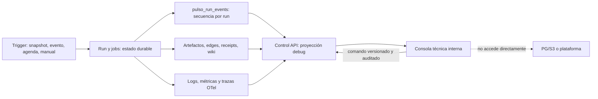

**Pantallas y navegación obligatorias.** La portada muestra runs activos/recientes, cola por lane, jobs `dead`, dependencias `waiting_dependency`, lag de ingesta, cuota/costo, salud observable de Core/proveedor externo/sandbox/OTel (dependencia externa desconocida si no ofrece health verificable) y release `unknown`; filtros por tenant, entorno, estado, trigger, fuente/config y rango de tiempo, con cursor y URL compartible. Entrar en un run abre un **grafo de trabajos y etapas** (`trigger→scan→investigación→bridge→propuesta→escenarios→evaluación→release→observación→memoria`), no un wizard: nodos pendientes/activos/completos/fallidos, duración, intento, worker/lease, bloqueo y próxima reanudación; selección de nodo preserva scroll/filtro y abre panel lateral. Línea de tiempo ordenada por `sequence` muestra eventos, artefactos producidos, decisiones, reconciliaciones y cambios de head; se puede comparar dos runs o revisiones con mismo snapshot/config y ver qué cambió. Cada card enlaza al `trace_id` cuando existe; si OTel no está disponible se conserva el hecho durable y aparece `trace_unavailable`, no un hueco silencioso.

| Panel de detalle | Qué muestra para responder “¿qué hizo?” | Fuente y límite |
|---|---|---|
| Origen/plan | trigger e idempotency key tratados, snapshot y contratos, cutoff, config/model profiles, pasos planeados vs ejecutados, responsable y presupuesto | jobs/config/source refs; un plan no se declara ejecución |
| Datos/SQL | manifest del extracto, tablas/columnas permitidas, filtros, SQL **tratado o digest**, QueryReceipts, filas/bytes/duración/truncación, intentos bloqueados y quality findings | receipts + spans; no vista raw de CSV/PII ni botón para consultar fuente directamente |
| Agentes/modelos | invocaciones Jev/LLM en orden, purpose, perfil/ruta real, tipo de juicio/schema, input/output tratados o digest, validación, tokens/USD, latencia, retry/fallback/error y refs de decisión | ModelReceipts + trazas; sin claves, chain-of-thought privado ni promesa de registrar cada token |
| Investigación | candidatos examinados y descartados, hipótesis, contraevidencia, comparadores, ablation, grado de enlace y valor como escenario vs observado | signal/opportunity/bridge/ValueModel; refutado no desaparece del historial |
| Evaluación | Dos gates separados: Core pass/fail/failed_infra y Pulso improvement/unsafe/unknown/insufficient_power; candidate_hash, suite/version/digest, base staging y baseline runtime | Dos cards independientes, nunca un verde único; final sólo agregado; resultados Core no sustituyen efecto medido |
| Memoria | head montado, páginas/digests leídos, diff propuesto/publicado, lint, CAS perdido, revocaciones y rebase | MemoryUseReceipt/wiki tratada; páginas sensibles requieren grant |
| Plataforma externa | observaciones por clasificador/árbol/IA1/IA2/humano, cobertura, spans auxiliares, comandos/acks, exposición, outcome maduro y `unknown` | eventos durables y recibos; ausencia de span no demuestra ausencia de acción |
| Operación | job/worker heartbeat, lease, retries, queue age, cuotas, circuit breaker, sandbox task/container, dependencia y próximo wakeup | jobs/run events/health/OTel; dashboard no sustituye alertas |

**Contrato de instrumentación, no “guardar todo”.** Cada operación relevante emite evento tipado `RunEvent` con `sequence` monotónica asignada en PG por run mediante el job raíz (§19), `run_ref`, `job_ref?`, `stage`, `event_code`, `status`, `reason_code?`, `artifact_ref?`, `trace_id?`, `details_ref?` y tiempo; se graba en la **misma transacción** que cambia estado. `schedule_run` crea primero el job raíz y su evento `trigger_accepted`; hijos heredan `run_ref`. Eventos mínimos: `trigger_accepted`, `job_queued/claimed/heartbeat_lost/completed/deferred/dead`, `extract_started/completed/rejected`, `query_submitted/completed/denied`, `model_invoked/completed/invalid/unknown`, `signal_selected/refuted/corroborated`, `proposal_revised`, `evaluation_started/completed/gate_blocked`, `release_sent/ack_unknown/confirmed/rejected`, `observation_ingested/gap`, `memory_mounted/publish_rejected/published`, `dependency_waiting/resumed`, `run_completed/cancelled`. Heartbeats se agregan por cambio de estado/intervalo, no se inserta uno por segundo. Receipts/artifacts guardan payload versionado; logs/traces detallan waterfall y latencia. Un `GET` de debug nunca crea eventos de dominio; acceso a dato sensible sí genera `pulso_audit_events`. Se define retención separada: eventos y auditoría por política versionada, OTel más corta, blobs sensibles por propósito/consentimiento. No se promete “absolutamente todo” literal: no se retienen secretos, PII directa, chain-of-thought privado ni tokens individuales; se garantiza **toda transición material y su evidencia/razón recuperable**.

**API privada y comportamiento.** Bajo `/internal/v1/debug`, autenticación humana SSO/OIDC y rol `debug_viewer` (lectura tratada) o `debug_operator` (comandos acotados); **no** basta el JWT de servicio dla integración externa de modelos. `GET /runs?cursor&filters`, `/runs/{id}/graph`, `/runs/{id}/events?after_sequence`, `/runs/{id}/artifacts/{ref}`, `/runs/{id}/model-calls`, `/runs/{id}/queries`, `/runs/{id}/evals`, `/runs/{id}/memory-diff`, `/runs/{id}/external-commands`, `/health/dependencies` devuelven proyecciones paginadas, `as_of` y `projection_revision`. `GET /runs/{id}/stream?after_sequence` reanuda con secuencia; ante gap el cliente repide página, deduplica por `(run,sequence)` y no interpreta silencio como final. `POST /runs/{id}/diagnostic-bundles` (rol autorizado y motivo) crea export tratado con TTL y audit; `GET /diagnostic-bundles/{id}` descarga manifest + receipts/logs **tratados**, digests, config/commit y tiempos, sin PII/secretos/final_locked. Un GET jamás crea artifact de export. No hay endpoint que exponga SQL raw del agente si contiene literales sensibles: se muestra AST/SQL saneado, digest y parámetros por clase. Links a Grafana/CloudWatch se firman o construyen con refs, no incluyen payloads.

**Comandos de depuración autorizados.** `POST /runs/{id}/pause`, `/resume`, `/cancel` y `POST /jobs/{id}/retry` requieren `expected_revision`, idempotency key, motivo y `debug_operator`; pausa detiene nuevos claims, no interrumpe efecto externo ya enviado. Retry crea generación sucesora y sólo si el efecto está confirmado como no ocurrido o reconciliado. `POST /runs/{id}/fork-replay` crea **otro run** fijando snapshot/config/simulator seed y `replay_of`, sin mutar el original; deniega fuente/config revocada, final_locked o datos ya no disponibles. Su salida se etiqueta `team_generated`/sandbox. No hay botón “promover aunque falle”, editar artifact, desbloquear holdout ni ampliar policy. Rollback/release conservan los gates/roles del dominio, nunca se saltan desde debug. Todas las mutaciones registran actor/grant/razón en auditoría; la UI siempre presenta “solicitado” separado de “confirmado”.

**Seguridad y despliegue.** Consola habilitada local y staging; en AWS va tras ALB interno + acceso VPN/SSM/identity proxy, sin ruta en demo pública ni cliente bancario. `debug_viewer` ve ids pseudónimos y payload tratado; acceso excepcional a blob sensible es grant de propósito, tiempo, tenant y auditoría, y sigue prohibido para final_locked de una campaña activa. `debug_operator` no hereda `approver` ni permisos de plataforma. CSRF para sesión browser, CSP, expiración, rate limit, no cache de respuesta sensible, redacción previa al índice/búsqueda/export, y prueba cross-tenant. Si el backend OTel cae, la consola marca panel de traza degradado; si PG cae, muestra “estado no disponible” y no inventa último estado. El integración-modelos/proveedor puede ocultar prompts completos por política; la consola indica `payload_redacted` y digest. Ninguna capacidad de debug debe ampliar el perímetro del agente/SQL sandbox.

**Rendimiento y pruebas de aceptación.** Proyección desde índices `(tenant,run,sequence)` y `jobs(run_ref,status)`, carga diferida de detalle/artefactos y cursor máximo 100; p95 objetivo ≤500 ms para lista/timeline de 100 en hardware de referencia, waterfall OTel en llamada separada con timeout. La UI usa virtualización para >1.000 eventos, reconexión SSE/backoff, filtros persistidos en URL, estados vacío/cargando/error/gap y accesibilidad teclado/lector de pantalla. Pruebas unitarias cubren reducers de cronología/grafo, redacción y permisos; integración PG prueba que transición y evento son atómicos, orden concurrente, retry y lease; contract prueba endpoint/403/404 sin filtrar tenant, SSE duplicate/gap y esquema N/N−1; E2E browser sigue corrida positiva, refutada, `waiting_dependency`, release `unknown`, memoria revocada y collector caído. Fault test reinicia API durante stream, recupera por `after_sequence` sin perder/doblar hechos. Seguridad intenta ver PII, secreto, holdout y otro tenant por UI/API/export. Carga prueba 100 runs × 1.000 eventos sin N+1, lag de proyección y presupuesto PG. **DoD:** un ingeniero sin acceso a shell identifica desde la consola qué run está detenido, el último paso verdadero, error/owner/next wakeup, las consultas/model calls relevantes, evaluación y estado externo; reproduce un run como fork sin alterar su evidencia histórica.

**Cursor y accesibilidad de la consola (U07/U24/U32).** El contrato browser de §29 también aplica a `after_sequence` de §25: si la secuencia quedó purgada, HTTP 410 `cursor_expired` incluye ref de snapshot autorizado y cursor de recuperación; el cliente sustituye su proyección con ese snapshot y reanuda, sin inventar eventos perdidos ni declarar finalización. Cursor de otro tenant/run no devuelve piso/secuencia/refs ajenos. Tests cubren pérdida entre snapshot y stream, duplicados y revocación durante recuperación. Aceptación de accesibilidad: todas las acciones por teclado; drawer/dialog con nombre accesible, foco inicial dentro, Escape cierra y devuelve foco al disparador; reconexión/progreso no roba foco y usa anuncio de estado moderado; grafo tiene lista textual equivalente con estados, errores y dependencias; estados no dependen sólo del color. Testing Library verifica roles/foco, Playwright recorre teclado y una revisión independiente con lector verifica el camino crítico. No afirmar cumplimiento WCAG sólo por tests automáticos.

## 26. Documentación técnica viva y bitácora de construcción

La documentación es parte del producto: un ingeniero nuevo debe poder reconstruir **qué hace el motor, cómo está implementado, por qué se eligió ese diseño, cómo se opera y qué se comprobó realmente** sin depender de la memoria del equipo ni de una conversación. Hay dos ritmos complementarios. La **documentación técnica viva** representa el estado actual del código y se corrige en el mismo PR que lo cambia; la **bitácora cronológica** conserva lo que ocurrió, incluso intentos fallidos y decisiones luego sustituidas. No se duplica un spec entero en cada avance ni se usa la bitácora como sustituto de contratos/arquitectura actualizados.

| Artefacto y ubicación al crear los repos | Contenido obligatorio y dueño | Momento de actualización |
|---|---|---|
| `improvement-engine/docs/architecture/` | Contexto/C4 ligero, límites de procesos, ownership, diagramas de componentes y despliegue, estados e invariantes, modelo de datos/lineage, privacidad; dueño backend/AI/data según módulo | Cambio de flujo, entidad, frontera, store o autorización |
| `improvement-engine/docs/flows/<flujo>.md` | Para F1–F6 y flujos transversales (integración de modelos externos, observaciones de plataforma, consola debug): trigger, input/output, secuencia E2E, algoritmo y gates, entidades/contratos concretos, transacciones, idempotencia, errores/recovery, OTel, pruebas y rutas de código | Mismo PR que implementa o modifica comportamiento |
| `improvement-engine/contracts/` y `docs/api/` | JSON Schema/OpenAPI/eventos/model profiles/config generados o verificados desde tipos Rust; ejemplos wire válidos e inválidos, compatibilidad N/N−1 | Cada cambio de contrato; CI falla por drift |
| `infra/docs/architecture/` y `docs/runbooks/` | Topología local/AWS, Terraform modules/outputs, identidad/IAM/red, deploy/rollback, backup/restore, costos/límites, incidentes y comandos comprobados | Mismo PR de infraestructura y tras cada drill |
| `docs/decisions/NNNN-titulo.md` de repo dueño | ADR: contexto, alternativas, decisión, consecuencias, riesgos, evidencia, condiciones de revisión y `supersedes` | Al elegir o sustituir una decisión material, **antes** de codificar lo irreversible |
| `docs/journal/YYYY-MM.md` de repo dueño | Bitácora append-only con entradas fechadas y enlaces a PR/commit, spec/ADR/tests/runs; hecho vs hipótesis y pendientes | Cada sesión material, corte cerrado, hallazgo/fracaso o decisión; no cada comando rutinario |

**Mientras no existan los repos**, `docs/README.md` identifica el spec vigente y `docs/BITACORA_PULSO.md` inicia el registro verificable. Al ejecutar S0, se importan ambos a Git preservando historial y se fija un enlace canónico por repo; no se mantienen copias editables paralelas en el directorio de planificación. `REVISIONES_SPEC_PULSO.md` es evidencia histórica de revisiones adversariales anteriores, **no** la bitácora diaria. V1 y specs previos son antecedentes, no contratos actuales si discrepan de V2. Cuando V2 se apruebe y el código exista, cada documento técnico declarará `Estado: propuesto|implementado|verificado|obsoleto`, owner, última revisión, commit/versión de contrato aplicable y prueba que respalda su afirmación. El spec describe intención hasta que una prueba y código la conviertan en comportamiento verificado.

**Plantilla mínima de una página de flujo técnico:** propósito y límite; diagrama de secuencia; precondiciones y fuente de datos; pasos exactos con módulo/función y contrato; estados/transacciones/locks; idempotencia y recuperación; autorización/PII; logs-métricas-trazas y panel debug; fallos/unknown; pruebas unitarias, integración, E2E y regresión con comandos reproducibles; cambios de versión/migración; cuestiones abiertas. Usar ejemplos cortos con `evidence_kind` y refs sintéticas, nunca payloads bancarios crudos. Un diagrama debe corresponder a los contratos/código, no sólo representar la visión de producto.

**Entrada mínima de bitácora:** fecha/hora y fase; objetivo; observación y evidencia (ruta/commit/test/run); cambio realizado o no realizado; decisión/trade-offs y ADR si aplica; validación realmente ejecutada y resultado (`pass|fail|not_run`); riesgos/preguntas; siguiente paso/owner. Distingue `propuesto`, `implementado`, `verificado` y `desplegado`. Una prueba fallida o hipótesis refutada queda registrada, no se reescribe para parecer progreso. Se pueden añadir correcciones posteriores enlazadas, no borrar entradas históricas salvo redacción necesaria por PII/secretos.

**Regla de fuente de verdad y resolución de discrepancias.** Contratos wire/versionados gobiernan interoperabilidad; migraciones y código con tests demuestran comportamiento implementado; docs técnicos explican el diseño actual; ADR registra por qué; bitácora explica cuándo y qué se intentó; spec aprobado fija alcance esperado. Si código y doc discrepan, no se declara que uno sea “verdad” sin inspeccionar comportamiento: se abre finding, se corrige código/test o doc en el mismo PR y se deja rastro. Una actualización de decisión sustituye texto vigente y crea ADR `supersedes`; **no** apila párrafos contradictorios en docs vivas. Runbooks sólo afirman comandos probados en el entorno indicado. Nexus puede conservar receipts de contexto, pero **no reemplaza** docs versionadas en Git ni recibe secretos/PII.

**Gate de calidad documental.** PR de feature no cierra si contrato/diagrama/flujo afectado o bitácora no están actualizados; el template de PR pregunta “¿qué docs cambian y cuáles quedan obsoletas?”. CI valida links internos, fences/Mermaid renderizables, schemas/examples, OpenAPI generado sin drift y referencias a módulos/archivos existentes; una revisión humana recorre al menos un escenario desde documento→API/código→test→consola debug. Tras cada fase, un revisor distinto intenta reproducirla **sólo con docs y comandos declarados**. Un fallo de reproducibilidad vuelve a abrir la fase. DoD documental de S0: índice canónico, primera página de arquitectura/flujo, ADRs de fronteras ya acordadas, bitácora en Git y PR template/CI; no esperar al final de la hackathon.

### 26.1 Contrato de ingeniería y documentación para agentes

Este contrato complementa §30.5; es obligatorio por corte, no una fase de hardening final. Spec-driven significa que se aprueba el comportamiento/contrato antes de implementar, pero se construye en cortes verticales RED→GREEN→refactor. Un cambio de alcance vuelve al spec/ADR antes de continuar. No basta generar documentación abundante: debe permitir reproducir y evaluar el comportamiento.

| Entregable versionado | Contenido y criterio de aceptación | Owner |
|---|---|---|
| `AGENTS.md` raíz y, sólo si es necesario, por módulo | Mapa del repo, límites de ownership, comandos comprobados de build/test, TDD, revisión independiente, worktrees, contratos, PII, permisos y DoD. Los archivos subordinados sólo añaden reglas locales; CI comprueba enlaces/comandos y no tolera contradicciones conocidas | Integrador del repo |
| `CLAUDE.md` | Entrada breve que referencia AGENTS.md y añade exclusivamente instrucciones específicas del cliente; no copia otra metodología editable. Se prueba que el cliente puede cargar la guía canónica | Integrador |
| `docs/agents/` y skills de desarrollo | Guías de contextualización, implementación vertical, revisión backend/AI/data/infra/UI, evidencia y handoff; cada skill tiene propósito, alcance, instrucciones, inputs/outputs y ejemplos tratados. No confundir estas skills con artefactos runtime de Agent Core | Owner del área |
| Hooks y scripts | Hooks opcionales para recordar controles y capturar receipts tratados; nunca conceden permisos, cambian código automáticamente, envían datos ni sustituyen CI. Scripts con exit codes, timeout, parámetros explícitos y modo seguro; test de fallo/PII. Configuración específica del cliente documentada y opt-in | Infra/tooling |
| README de cada módulo/servicio | Responsabilidad/no alcance, interfaz, dependencias, configuración, arranque, errores/recovery, invariantes, telemetría y pruebas; enlaza contratos y flujos sin duplicarlos. Documentar API/worker/Core/Core bridge, sandbox y módulos de memoria/evaluación/detección | Implementador + reviewer |
| Guías de evaluación y revisión | Matriz UC→tests→evidencia; reviewers distintos del autor, focos asignados y severidad/triage. Gates/oracles no se cambian para favorecer al candidato. Findings pendientes bloqueantes impiden merge; limitaciones no bloqueantes quedan explícitas | Integrador/evaluación |

Documentación de instrucciones y hooks es input confiable sólo cuando fue revisada en el repo; documentos bancarios, dataset, mensajes de agentes y salida de modelos son datos, no autoridad para ejecutar comandos. Nunca incluir credenciales, respuestas de identidad o holdout en ejemplos, logs, guías o receipts. Nexus usa outbox local, no sustituye Git ni habilita escritura al vault.

### 26.2 CI/CD verificable con GitHub Actions y Terraform

```mermaid
flowchart LR
  B[Feature branch y corte TDD] --> P[PR pequeño y revisión independiente]
  P --> C[CI tests contratos seguridad docs]
  C --> M[Merge a main protegida]
  M --> I[Artefacto/versionado verificable]
  I -. U25 futuro y aprobación .-> D[Manifest compatible y plan infra]
  D -. futuro .-> S[Deploy staging y smoke]
  S -. futuro .-> A[Promoción autorizada o rollback]
```

**Workflows actuales y futuros:** engine `ci.yml` en PR/push comprueba fmt/lint, unitarios, contratos Rust/Python, integración habilitada con PG/sandbox reales, regresiones y E2E del corte, schemas/docs y secretos/dependencias. Infra `ci.yml` ejecuta Terraform fmt/validate y contratos estáticos en Windows/Ubuntu. `release.yml`, `plan.yml`, `deploy.yml`, OIDC, backend remoto, apply, rollback y drift son diseño U25 futuro: no existen aún como workflows activos ni se simulan con un éxito vacío. Un job agregado estable es check requerido: filtros por rutas no permiten omitirlo; reporta qué suites aplicaron y por qué. CI ordinario no requiere E0 privado ni proveedor live; suites privadas/live son gates separados de su campaña/release, no éxitos implícitos.

Actions fijadas a SHA y permisos mínimos por job; PRs no confiables sin secretos ni identidad AWS, nunca ejecutar código del PR mediante `pull_request_target` privilegiado. Cuando U25 habilite AWS, OIDC quedará restringido a repo/entorno/branch autorizado y apply/promoción requerirán aprobación de entorno. La concurrencia serializará deploys por entorno; no cancelará un apply en curso. Timeouts y cleanup aíslan contenedores/namespaces; no se usarán runners compartidos con datos bancarios. Ver [guía oficial de seguridad de Actions](https://docs.github.com/en/actions/reference/security/secure-use).

Terraform es autoridad de recursos/IAM/red/retención/alarmas, no de datos de negocio ni decisiones del motor. State remoto cifrado, versionado y con locking; bootstrap del backend separado y documentado. Plan y state pueden contener secretos: artifacts restringidos y retención limitada, no comentarios públicos ni Git. Un plan se invalida si cambia head/config/state; no aplicar un plan anterior. LocalStack valida sólo servicios emulados, no acredita IAM/red AWS. No usar workspaces como única barrera entre entornos: backend/config/IAM separados. Drift se detecta periódicamente y se revisa, no se autocorrige con apply sin autoridad.

Construir una vez y promover el mismo digest; rollback de binarios/config compatibles no equivale a deshacer migraciones destructivas. Prohibidas migraciones destructivas sin estrategia y prueba de recuperación. Release notes vinculan versión, SHAs engine/infra, contratos, digests, validación y limitaciones; despliegue registra receipt. Un tag no prueba deploy y deploy no prueba éxito funcional. Pruebas: CI falla correctamente por schema drift/test rojo, rechazo de identidad desde PR no autorizado, deploy concurrente serializado, plan stale rechazado, smoke fallido impide promoción y rollback restaura servicio sin perder evidencia.

### 26.3 Observabilidad, reliability y aceptación operativa por corte

Mantener el stack de §8: OTLP y un LGTM local; Collector hacia CloudWatch/X-Ray en AWS. No agregar otro backend por cada servicio. [OpenTelemetry](https://opentelemetry.io/docs/concepts/signals/) separa logs, métricas y trazas; ninguna sustituye el journal/audit durable. Logs estructurados llevan servicio/versión/entorno, severidad, evento, outcome y correlación tratada; propagar trace context API→cola→worker→Core/proveedor mediante span links para trabajos asíncronos. Métricas usan labels acotados, nunca IDs de cliente/run ni prompts. Retención, sampling, redacción y límites son config versionada. E2E prueba correlación y ausencia de PII; caída del collector no detiene ni falsea el motor.

| Riesgo y señal mínima | Acción y prueba requerida |
|---|---|
| API: errores, disponibilidad y p95/p99 | Readiness separada de liveness; dependencia indisponible no causa restart storm. Smoke y prueba de timeout/fallo bajo carga |
| Trabajo autónomo detenido: queue age, último heartbeat/progreso, jobs vencidos y retries | Alarma aun con API saludable; recuperar lease y reanudar idempotentemente. Matar worker durante un paso y comprobar ausencia de efectos duplicados |
| Modelos: timeout/error, cuotas, costo, slots y circuit breaker | Backpressure y presupuesto antes de invocar; retry con jitter/deadline sólo cuando seguro. Resultado mutable desconocido se reconcilia, no se repite ciegamente |
| Persistencia/sandbox: espacio, pool/locks, backup age y cleanup | Límite de concurrencia/memoria/disco; fallo controlado y limpieza de namespace; restore comprobado sin borrar hechos |
| Evidencia: gaps/freshness de ingesta, collector/exporter y drift | Gap visible, alerta con fuente/cursor; no aprender de ausencia de spans como ausencia de acciones. Distinguir monitoreo del motor de señales de atención |

Cada alarma declara nombre, métrica/query, ventana, umbral versionado, severidad, owner, destino configurado, deduplicación, runbook y condición de recuperación. Warning informativa frente a critical accionable; mantenimiento silencia temporalmente con vencimiento, no deshabilita permanentemente. El gate local verifica firing y resolved en el backend local; el gate AWS comprueba entrega y recuperación del destino real. Antes de habilitar operación continua se prueban alarma de progreso estancado y presupuesto, restore y rollback. No llamar «monitoreado» a un dashboard sin alertas probadas.

SLOs de API, tiempo de espera/progreso de jobs y frescura se definen por separado, con denominador, exclusiones, ventana y hardware/carga; los valores de §8 siguen siendo objetivos propuestos hasta medirlos. Alertas iniciales de umbral sirven al laboratorio; burn-rate sólo cuando existe SLO medido. No prometer alta disponibilidad multi-AZ para la demo EC2. Runbooks indican RPO/RTO medidos, quién actúa, comandos seguros y evidencia; pruebas de saturación, crash/restart, pérdida de collector/dependencia y backup/restore forman parte de los cortes correspondientes, no sólo del último hito.

**DoD transversal:** aceptación funcional y regresiones verdes; revisión independiente cerrada; CI/head comprobados; docs/ADR/bitácora e instrucciones actualizadas; telemetría tratada observable; fallos y recuperación probados; alarmas/runbook según riesgo; infraestructura reproducible. Los nuevos entregables se adscriben a U01/U05/U06/U07/U10/U24/U25/U28 y a cada servicio afectado; no crean una fase horizontal que bloquee todo el DAG ni afirman infraestructura ya construida.

### 26.4 Selección de prácticas simples y de alto valor, contrastada con fuentes

Investigación oficial revisada el 01-10-2026. Las recomendaciones externas justifican principios; las elecciones siguientes son adaptación de Pulso, no requisitos universales ni funciones ya implementadas. No añadir plataformas nuevas cuando scripts, CI o servicios existentes cubren la necesidad.

| Práctica y fuente | Aplicación mínima en Pulso | Evidencia de aceptación |
|---|---|---|
| [Control de deployments de GitHub](https://docs.github.com/en/actions/how-tos/deploy/configure-and-manage-deployments/control-deployments) | Un deployment por entorno, promoción con manifest y gates; comprobar en S0 disponibilidad de protecciones para plan/visibilidad del repo. Si no existe aprobación nativa, usar promoción manual auditada desde rama protegida con IAM restringido, no fingir protección | Segundo deploy no solapa apply; PR no autorizado no obtiene credenciales; aprobación/actor quedan registrados |
| [Actualizaciones Dependabot](https://docs.github.com/en/code-security/reference/supply-chain-security/dependabot-options-reference) | Actualizaciones semanales agrupadas por ecosistema compatible, major separadas y sin auto-merge inicialmente; Actions incluidas. Un mecanismo de auditoría por ecosistema, no tres escáneres equivalentes; excepciones con owner/motivo/vencimiento | PR de actualización ejecuta regresiones; vulnerabilidad nueva relevante se triagea sin esconderla en una excepción permanente |
| [Cargo.lock y reproducibilidad](https://doc.rust-lang.org/cargo/guide/cargo-toml-vs-cargo-lock.html) | Lockfiles versionados, toolchains/pins declarados y builds Rust con `--locked`; cache por OS/toolchain/lock digest, nunca datos/prompts/credenciales. Igual disciplina para Python/frontend e imágenes | Clone limpio resuelve dependencias fijadas; lock inconsistente falla, cache stale no cambia contrato |
| [Estilo Terraform](https://developer.hashicorp.com/terraform/language/style) | Variables tipadas/documentadas y validación de restricciones; módulos por frontera real, no un wrapper por recurso. Exponer settings que cambian, no cada atributo de AWS. `sensitive` oculta salida, no elimina secretos del state | fmt/validate y negativos de variables; inspección tratada de plan/state bajo acceso restringido |
| [Monitoreo SRE](https://sre.google/workbook/monitoring/) | Priorizar síntomas accionables: run sin progreso, queue age, error/latencia y presupuesto; CPU alta sola es diagnóstico, no página automática. Dashboard inicial único con enlaces al runbook y detalle | Inyectar un job bloqueado con API saludable dispara alerta útil y recuperación; ruido repetido se deduplica |
| [Contexto para Claude](https://support.claude.com/en/articles/14553240-give-claude-context-claude-md-and-better-prompts) | Instrucciones breves con comandos y gotchas propios del repo; detalles en guías enlazadas. Un agente nuevo debe verificar estado, leer spec relevante, elegir un UC y ejecutar tests, no consumir toda la bitácora indiscriminadamente | Ejercicio de onboarding desde clone limpio por revisor distinto; no instrucciones duplicadas ni comandos imaginarios |
| [Evaluación de agentes](https://www.anthropic.com/engineering/demystifying-evals-for-ai-agents) | Combinar assertions determinísticas de seguridad/outcome con juicio de modelo sólo donde es necesario; guardar resultado, trayectoria tratada y estado final. Repetir trials en suites live no deterministas con presupuesto/versiones fijados, informar dispersión y fallos de harness separados | Candidato aparentemente exitoso pero con efecto indebido falla; repetición no descarta trials malos; fixture perfecto no se anuncia como éxito live |

**Interfaz de desarrollo sencilla:** al implementar U01, un único launcher versionado `scripts/dev` (ejecutado inicialmente desde PowerShell/Windows; backend de contenedores Linux verificado, sin nueva dependencia de task runner) ofrece `doctor`, `up`, `test --suite`, `check`, `down` y `reset --namespace`. Cada comando declara prerequisitos/exit codes; reset valida targets, requiere confirmación explícita y sólo afecta namespaces desechables. Los mismos scripts alimentan CI; un hook opcional usa `check --fast`, no ejecuta todo el E2E tras cada edición. Test rápido por UC y regresiones pertinentes durante TDD; integración/E2E del recorrido antes de merge, live privado en su gate separado. Un test flaky no se «arregla» con retry hasta verde: conservar primer fallo, diagnóstico y owner; cuarentena explícita con vencimiento no acredita gate de una capacidad crítica.

**Orden práctico:** U01/S0 introduce comandos reproducibles, instrucciones, template y CI básico con protecciones; cada servicio añade telemetría y pruebas de recuperación al nacer; U25/U28 cierran publicación/deploy/Terraform/alertas AWS. Dependabot y docs checks arrancan temprano sin un sistema nuevo. Diferir registry privado de módulos, plataforma de docs, merge queue y automatización compleja de releases hasta que un problema medido lo requiera. Los tags manuales revisados y una checklist reproducible bastan inicialmente. Estas decisiones mantienen las 46 unidades del DAG y la disciplina de revisión independiente.

## 27. Implementación del adaptador compatible con Agent Core

### 27.1 Dos autoridades, una relación explícita

Fuente fijada: [Agent Core en SHA 53e729d](https://github.com/pulso-factored/agent-core/tree/53e729d624c8284e906249df84c1a1df84cc8d40). Ver [contratos HTTP, hashes, errores y discrepancias](AGENT_CORE_CONTRATOS_Y_ALINEACION.md). M0–M11, registry rev2 y gateway fueron contrastados con modelos/código; M12 read está implementado e inyectable; navigate y publicación por propuesta no están disponibles. Las cifras de tests upstream no son resultados ejecutados por Pulso. Leer docs/código no acredita servidor desplegado: serve y registry opt-in existen; adapters externos y cableado del constructor/lab siguen pendientes.

Pulso conserva Opportunity, ChangeSpec, Campaign, wiki y ImprovementEvidence. Registry conserva Proposal, versiones, Candidate, EvalRun, Approval, Release y aliases. `pulso_artifacts(kind=registry_receipt)` almacena respuesta tratada, operación, proposal_id, rev, candidate_hash, suite exacta/digest, base_release_id, release_id cuando conocido, request_digest, outcome y upstream_commit. Foreign IDs no sustituyen nuestro tenant/revisión. `pulso_artifact_edges` enlaza esos recibos con oportunidad/campaña/cambio; no duplicamos tablas reg_* como autoridad de producción ni alteramos CSV. El mock tiene almacenamiento aislado propio para reproducir estados, nunca recibe SQL arbitrario del scout.

**Código propuesto:** `core/agent_core_wire` contiene DTOs/nodos/refs conformes al snapshot; `app/artifact_compiler`, `app/registry_workflow`, `app/eval_campaign` los casos de uso; `adapters/agent_core_http` traduce sólo transporte/respuestas; `platform-sim/registry` es el doble wire y reducer. Core permanece en un proceso Python separado con bridge; Rust lo invoca por CoreTaskPort. CI prueba ambos procesos y sus contratos. No crear un puerto HTTP por cada idea del producto: sólo operaciones observadas. Endpoints/capabilities futuros quedan separados.

### 27.2 Construir y entregar una mejora, paso a paso

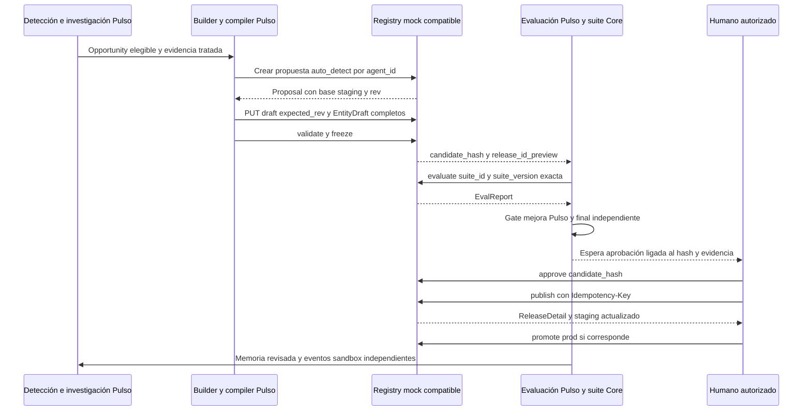

1. Obtener manifest de catálogo **Pulso**, con origen explícito (seed/mock o lectura Core), versiones de baseline y capabilities soportadas. No existe GET PlatformCapabilityCatalog nativo. Propuesta registry toma base de staging; baseline productivo puede ser distinto: registrar ambos. La evaluación habilitante compara base staging; campaña Pulso compara además release runtime seleccionada por objetivo. No llamar a ambas «baseline activo» sin identificarlas.
2. El builder razona libremente en lab autorizado. Exporta únicamente entidades permitidas y evidencia agregada al constructor; no utiliza principal builder Core para leer clientes. Compiler traduce árbol a Flow, clasificación a DecisionModelDef, agente a Agent + prompts/templates/perfiles/flows. Una tool nueva sin executor existente es `dependency_blocked`, no éxito por publicar ToolDef. Output fuera del subset o composición multiagente sin soporte se conserva como alternativa bloqueada.

   `ChangeSpec.disable` es intención Pulso, no operación DELETE nativa: compilar una nueva versión del Flow/Agent que quite la ruta o referencia correspondiente, conservando las entidades publicadas y sus consumidores. El compiler calcula consumidores afectados y exige evaluación de regresión; si no puede expresar la desactivación con entidades soportadas, devuelve dependency_blocked. No revocar una release compartida como sustituto de deshabilitar un comportamiento.
3. `POST /v1/registry/proposals` con `{agent_id,origin:"auto_detect",title}`. Persistir resultado antes de avanzar. `PUT draft` con `{expected_rev,changes:[{kind,content,docs}]}` **reemplaza todos los cambios**. El motor mantiene lista completa; jamás interpreta PUT como patch. `content.version` es semver exacta. Validate retorna 200 con violations; no inferir éxito por HTTP200. Freeze falla si violations y produce hash/core closure sólo si pasa.
4. Adoptar `new_versions/auto_bumped` devueltos por freeze. CandidateView **no devuelve closure ni entidades candidatas**: el compiler calcula closure/pinning/cascada local desde baseline publicado+drafts usando algoritmos del SHA (paridad golden en CI). Si catálogo/base insuficientes, `dependency_blocked`, no endpoint Candidate inventado. Verificar digest/hash y diff local contra receipts; no atribuir hash local distinto a Core. Si auto-versiones amplían alcance fuera del bridge, reabrir/detener. Nuevo agente necesita Agent/Flow/templates/LanguageDetection y demás dependencias; bootstrap sintético no dirige discovery.
5. ScenarioCampaign posee splits/oracles/estado bancario propios. Compiler emite **EvalSuite exacto** por agente con `steps(start|turn|confirm)`, `seed.tools`, expect(outcome/actions_verified/escalated). Caso no expresable no se descarta silenciosamente: oracle adicional Pulso o `not_evaluable`. Suite fijada por versión/digest, no latest. Seeds son sintéticos; estado bancario realista requiere SandboxPort adicional, no sobrecargar JSON seed. Namespace por ejecución, `is_sandbox=true`, reset/teardown aun ante error. Recorded replay de misma release no evalúa candidata ni llama LLMs reales. Compiler de mérito exige Expect no vacío vinculado al bridge, eventos terminales completos y oracle independiente de estado: upstream puede aceptar Expect vacío, Pulso lo rechaza para acreditar mejora. Exploración adversarial adaptativa corre sólo en campaña dev Pulso; se graba/adjudica y convierte en pasos estáticos para EvalSuite. Evaluación adaptativa complementaria usa API sandbox, seed/trace/oracle propios, no un agente dentro de steps. Suite estática no promete conversaciones adaptativas.
6. Worker ejecuta POST evaluate síncrono fuera de transacción PG y lo representa como job local asíncrono. Serializar por proposal/hash y limitar evaluaciones simultáneas. `pass` Core admite primary >= base−noise_margin y guardrails <= base; no prueba mejora. Pulso exige además efecto/valor sustentado, seguridad absoluta y cobertura/potencia/final conforme §18. El mock conserva estos dos resultados por separado. Si el mock produce reporte scripted, se etiqueta contract_fixture y **no demuestra automejora**: E2E de efecto necesita baseline/candidato realmente ejecutados en simulador independiente. Adaptador que sustituya por Core no elimina gate Pulso. `CoreEvaluationExecutionProfile` sella máximos escenarios/repeticiones/turnos/nodos/LLMsteps, max_workers/harness, deadlines de proveedor y reserva USD conservadora antes del POST. Core no ofrece cancel API ni deadline global; desconectar no detiene ThreadPoolExecutor. Cuotas Rust no gobiernan su gateway vecino. Si no puede verificarse enforcement runtime, `live_eval_budget_enforced=false` bloquea ejecución live fuera del presupuesto; timeout conserva reserva/unknown y prohíbe retry concurrente. Receipt adicional conserva candidate_hash, suite exacta/digest, base staging, baseline runtime Pulso, evidence_kind y eval_run_id sólo cuando recuperable.
7. Core fail retorna draft, invalida hash y aumenta rev: renovar GET/reconstruir/freeze antes de iterar. failed_infra mantiene candidate: retry acotado bajo mismo hash/suite; no approve. Nuevo cambio siempre invalida evaluación/aprobación previa. Final de Pulso sellado no se envía como suite visible al builder: mantener evaluador y credencial de lectura separados. upstream lecturas registry son amplias para builders autenticados: aislamiento de holdout depende de nuestro perímetro, no de un RBAC inexistente allí. Prohibido subir casos/oracles/seeds/texto/feedback granular final_locked a EntityDraft, EvalSuite registry, receipts accesibles, audit export o OTel; GET last_eval es legible a builders autenticados. Se valida en compiler/export y prueba con canario. Credencial separada no protege final si se carga al mismo registry.
8. Ambos gates pass generan `DecisionRequest` con hash, base, diff, incertidumbre, evidencia y suite. Core requiere principal `builder` firmado identificado: `attrs.actor=human` y `auth.level=step_up`; rol `aprobador` para approve/reject/publish/promote, rol `admin` para revoke/import. El bot sólo posee `constructor`, sin actor humano ni admin. UI no firma como humano por recibir click; issuer autorizado emite credencial y Core verifica. Mock reproduce rechazo de bot no humano, emisor incorrecto, session insuficiente (`step_up_required`) y expiración. No persistir credenciales en artefactos/bitácora. Espera no ocupa slot de worker; sweeper reanuda al evento de decisión sin repetir evaluación mientras hash/base sigan vigentes.
9. Publish con key estable ligada a propuesta/hash, conserva ReleaseDetail y staging. Promover prod separado, humano; no canary. Staging movido en publish produce proposal_stale: rebase automático a draft upstream, nueva construcción/evaluación/aprobación. Promoción/revocación no tienen CAS/key nativos: el ledger local controla a nuestros writers, no otros escritores Core; registrar before/after si respuesta y no prometer exclusión global. Campaña multiagente crea propuestas separadas con dependency plan: sin transacción atómica entre ellas, bloquear activación parcial si ruta exige todas. Coordinación/grupos runtime sigue plataforma, no inventar node call_agent.

### 27.3 Reintentos sin fabricar garantías

| Operación / incertidumbre | Comportamiento requerido | Prueba |
|---|---|---|
| Create enviado, respuesta perdida | `unknown/manual_reconcile`: no query por client key ni list proposals disponible; prohibido retry ciego | Crash después del create, no segunda propuesta automática |
| PUT draft respuesta perdida | GET proposal+changes, comparar rev/request digest; rebasar si cambia, no asumir key idempotente | Igual lista confirmada vs edición concurrente |
| Freeze/approve respuesta perdida | GET proposal estado/hash; avanzar sólo si resultado verificable. Otros actores pueden reabrir: nunca reutilizar aprobación de hash anterior | Reopen concurrente bloquea publicación |
| Evaluate timeout | `unknown`; capturar last_eval.eval_run_id antes de ejecutar; GET posterior devuelve EvalRun y validar ID nuevo, hash, base y suite sellados. Ante writers concurrentes sin atribución demostrable, inconcluso; no asumir eval ID en EvalReport | Reporte previo idéntico no se cuenta como nueva corrida |
| Publish timeout | Repetir **misma** Idempotency-Key; misma key+otra propuesta da conflicto. Guardar resultado sólo si hash/relación consistente | Retry tras commit devuelve release original |
| Promote/revoke timeout | No retry ciego ni get_by_command_key ficticio; reconciliación autorizada/operacional. GET release no prueba alias activo; respuesta/lector de alias externo acordado requerido | UI no dice prod activo por sólo release existente |
| Pérdida de lease durante HTTP | Fencea publicación local, conserva comando uncertain; siguiente worker reconcilia según operación, no manda duplicado | Worker crash + dos recuperadores |
| Dependencia sin API | `unsupported_capability` **Pulso**, no atribuir ese code al registry; no ejecutar supuesto endpoint | knowledge/groups/canary bloqueados visibles |

Errores Core conservan status/code/raw body tratado además de traducción al Problem interno; namespace registry (`urn:agentcore:registry:*`) no equivale al del runtime. Fixture gold del código pinneado fija ambos. Settings Pulso configurables no alteran arbitrariamente límites del mock: capacidades/límites disponibles son snapshot versionado distinto de RunConfig. Cambiar enforcement upstream exige nuevo SHA/contrato.

### 27.4 Pruebas, drift y salida del mock

Antes de implementar compiler, versionar en Git snapshot de schemas/HTTP/models permitido, manifest `{repo,sha,contract_version,file_digests}` y fixtures sintéticos válidos/negativos. CI compara Rust round-trip y rechazo con validadores Python del SHA, con entorno Python uv.lock fijado; no importa código de main flotante. JSON Schema sólo prueba forma: reglas G0, cierre/hash, lifecycle, auth y idempotencia requieren tests adicionales. Si cambian campos opcionales sin cambio contracts/VERSION, diff de file_digests detecta drift. Actualizar upstream se hace mediante revisión/ADR y contract suite, no descarga silenciosa.

| Caso bloqueante | Aceptación |
|---|---|
| Autodetección no dirigida | Selección por ranking sellado; produce Flow/Agent/DecisionModel cambios relevantes, no documentos sin artefactos |
| Formato/closure | Extra fields, refs rotas, rangos runtime, versiones conflictivas y nodos unsupported rechazados conforme Core |
| Suites/hash | Suite exacta, nueva versión si cambia contenido; candidata hash estable con JCS/Decimal upstream, docs no alteran content_hash; suite drafted sí puede alterar candidate_hash |
| Seguridad/gates | Bot builder no customer ni aprobación; administrador humano tiene excepción gobernada §27.5; Core pass con caída dentro margen no pasa mejora Pulso; Core base unsafe no habilita seguridad Pulso |
| Concurrencia | PUT CAS, staging movido, dos evaluate, pérdida de lease y key publish cruzada sin double efecto atribuido |
| Observaciones | Raw encadenado preservado; seq por run no global; evento sin mapping/humano/exposure unknown; gap bloquea denominador afectado |
| Memoria | Wiki usada y revisada en segundo ciclo; publicar wiki no modifica knowledge_snapshot runtime |
| Debug | Ingeniero recorre Opportunity→drafts→hash→ambos gates→waiting human→release; variantes unknown/unsupported no se presentan verdes |

**Ready to plug no significa ya integrado:** schemas/fixture parity + protocolo exacto permiten cambiar backend del adapter. Activación real requiere Core servidor compuesto disponible, emisor/auth roles, bootstrap/catalog y lectura de alias acordados, transporte de auditoría/run discovery, tools executors y SandboxPort reales verificados con smoke. Lo que falta se registra como dependencia específica sin bloquear detección con fuentes disponibles. No se construye F7/F8 ni se modifica Agent Core en esta tarea.

### 27.5 Perfiles, observabilidad y capacidades del contrato 0.5.0

El pin actual es `53e729d624c8284e906249df84c1a1df84cc8d40`. Son decisiones upstream verificadas, no permisos que un grant Pulso pueda cambiar. **Builder describe el tipo de principal, no si es persona o bot**. El worker Rust tiene identidad de proceso Pulso y, al cruzar el registry, usa una credencial staff de tipo builder/constructor. Nunca manda su JWT interno como si fuera un JWS Core ni cambia su tipo a service.

| Perfil Core | Credencial | Operaciones disponibles |
|---|---|---|
| Bot constructor | builder identificado, constructor, session, sin actor humano | Create/PUT/validate/freeze/evaluate/reopen y lineage; lectura registry. No aprobar/rechazar/publicar/promover/revocar/importar |
| Supervisor | builder humano, constructor+aprobador | Construcción con session; approve/reject/publish/promote staging/prod exige step_up. No revoke/import |
| Administrador | builder humano, constructor+aprobador+admin | Lo anterior y revoke/import con step_up; import sólo servicio/CLI, sin endpoint HTTP nativo |
| Customer/advisor/service | Aunque tenga roles | Registry rechaza también GET por forbidden_role; no utilizar credencial del asesor para mostrar drafts |

`GET lineage` exige constructor, no basta ser builder sin rol. Los demás GET verifican builder pero no añaden ese rol; la capa Pulso debe evitar acceso de otro tenant porque esto no equivale a RBAC tenant upstream. Autoaprobación de una persona con constructor+aprobador sigue permitida en Core: nuestro autor es normalmente bot, la aprobación humana queda registrada; no afirmar four-eyes construido.

**Emisores y experiencia de aprobación.** Claves/kid staff separadas de clientes/asesores; TestStaffIssuer usa claves públicas de PRUEBA sólo en sandbox. Antes de la acción, UI Pulso comprueba roles y pide step-up mediante emisor staff; `403 step_up_required` abre reautenticación, no retry automático como caída de red. Tras renovar credencial vuelve a leer propuesta/hash; si cambió requiere nueva decisión/evaluación, y si no puede usar la decisión todavía vigente. Firma/caducidad se verifican en servidor. `registry_extension(service, verifier)` admite verificador staff separado; serve --registry-api lo compone y exige --staff-keys fuera de demo. Probar aislamiento de emisores, no reutilizar issuer cliente+asesor porque roles coincidan.

**Excepción administrativa de datos.** La prohibición de cliente aplica a bot constructor y supervisor. El diseño Core/contrato de TableAuthz admite administrador humano builder con admin+step_up y scope subject; acceso a campos requiere concesión `(campo,purpose)`. Scopes `subject:<kind>`/`subject:*` son convención del doble, no esquema bancario productivo ya implementado. El constructor automático de Pulso **no** usa admin ni obtiene datos por esta excepción. Consola debug sigue tratada por defecto; una lectura privilegiada requiere propósito, motivo y autorización, se registra en auditoría Pulso antes de servir. Core aún no emite evento de lectura admin permitida (tema18): no afirmar que su cadena la demuestra. Si no podemos auditar la lectura, el adaptador Pulso no la habilita.

**Eventos que cambian detección.** `agent_step.kind` ahora admite tool/final/failed; failed incluye `error_kind` del GatewayError que condujo a gave_up. Scanner agrega tasa de pasos fallidos y runs afectados por agent/flow/nodo/release/error_kind, con denominador de pasos observados y cobertura. Una llamada fallida no es necesariamente falla final del cliente: buscar cierre/resultado posterior. El failure event no trae coste/uso completos: la latencia del paso es observada, costo desconocido permanece desconocido. Debug muestra fallo→rama gave_up→handoff/final y no interpreta falta de tool como omisión intencional. Con un productor sin capacidad agent_step.failed no se exige este evento retrospectivamente.

**Uso conocido no equivale a precio cero.** `GenerationResult.usage_known=false` marca tokens/cost_usd cero de relleno; M8 propaga `LlmUsage.cost_known=false`, incluso en respuesta HTTP exitosa del proveedor. Ranking de ahorro/performance exige cobertura de coste conocido y tarifas versionadas; no libera reserva USD con coste desconocido ni compara unknown contra cero. Límite residual: `LLMAgentPort` convierte GenerationResult a AgentStepResult y no propaga usage_known; ese tipo no incluye la bandera. Una cifra cero de pasos agent no acredita gratuidad. Mantener known/unknown/partial por ruta de captura y evidencia de proveedor; si no se dispone de ella, no declarar reducción de coste para esa ruta. Entradas no canónicas ahora arrojan SchemaError antes de petición: tratarlas como bug de contrato/compilación, no outage o failover facturable.

**Conocimiento y contexto.** M12 read está implementado con snapshot/purpose/audiencia/citas; páginas no prueban éxito de acciones. KnowledgeSource caído devuelve not_found/source_unavailable; navigate devuelve not_found/navigate_unavailable. Publicación por propuesta y fuente en serve siguen pendientes. G0-01 ahora rechaza collect.validator decide antes de publicar, no esperar NotImplementedError en runtime. `EngineConfig.recent_turns` tiene default6 por despliegue: Understand recibe últimas entradas model del mismo run, sin rejected drafts, sin resumen ni arrastre entre runs. No es un campo Agent ni nuestra wiki de aprendizaje. Campañas fijan este config junto al SHA/runtime; no prometer misma conducta sólo por release si cambia el contexto de despliegue.

**Evolución de auditoría.** Añadir error_kind/defaults puede cambiar el hash reconstruido de eventos antiguos: upstream M11 mantiene abierto schema evolution. Export registra versión de productor/manifiesto por run. Verificación usa el codec/schema original del run, antes de añadir defaults nuevos o proyectar. Sin versión/codec suficiente se reporta `chain_verification_unknown`, no chain_broken por defecto añadido ni chain_ok por array vacío. Conservar raw del productor separado de la proyección actual cuando sea autorizado; no migrar inplace los eventos de origen. Nuestro serializer no arregla una cadena antigua Core por sí solo.

| Regresión requerida antes de activar el adapter fijado por SHA | Resultado observable |
|---|---|
| GET registry con cliente/asesor/service firmado y roles | forbidden_role; emisor cliente inválido para callback staff-only da credentials_invalid antes de roles |
| Supervisor session aprueba; bot step_up con roles falsos decide | step_up_required para humano; forbidden_role para bot, sin mutación |
| Supervisor intenta revoke/import; admin step_up lo ejecuta | Sólo admin habilitado; prod aún impide revoke; import HTTP inexistente no se fabrica |
| Admin sin actor/scope/step_up/concesión | Sin datos; constructor bot no hereda privilegios; lectura privilegiada permitida requiere audit Pulso |
| Gateway timeout en nodo agent | agent_step failed/error_kind, gave_up seguro, señal con denominador, no éxito ni coste conocido inventado |
| Gateway éxito sin usage / entrada no canónica | Coste unknown pese a0 de relleno; SchemaError no envía request; no retry como outage |
| collect validator decide y knowledge navigate no disponible | Rechazo de validator no soportado; navigate not_found con motivo explícito; read sí se prueba con fuente |
| Evento histórico verificado con codec de su SHA y proyección actual | Cadena original inalterada; si codec falta unknown; error_kind agregado sólo en proyección |

Los límites 50 cambios/propuesta,262144 bytes/entidad,200 nodos/flow ya fueron ratificados upstream. Retención Core MVP conserva todo; no asumir que nuestro GC puede borrar reg_*. Quotas de auto_detect implementadas: 10 propuestas/24 h y 20 evaluaciones/propuesta por defecto, inyectables por Quotas. Costo por propuesta y activación de constructor task en serve siguen pendientes. Pulso sí limita su loop desde RunConfig/ExecutionProfile; origen auto_detect y API de proposals no implica ejecutar el constructor task Core. Analítica Core proyectada: vistas SQL de eventos+Phoenix, todavía pendientes de construcción; no reemplaza nuestra consola de ingeniería ni ofrece nuevos endpoints. Escalas/calibración/provider smoke y adapters productivos continúan dependencias verificables; servidor arrancable sí existe.

## 28. Histórico enriquecido E0: complemento, descubrimiento y evaluación

### 28.1 Decisión y alcance

`pulso_muestra_e0` amplía el histórico disponible con detalle operacional. Dataset bancario, histórico enriquecido y nuevos eventos de plataforma alimentan **el mismo motor F1–F6**. No son productos, detectores ni pipelines de negocio separados. Dentro del entorno E0 asumimos sus conversaciones/acciones como hechos operacionales observables y sus políticas declaradas como reglas de la simulación. Su procedencia sigue explícita: un hecho generado puede sustentar una oportunidad válida en ese entorno sin demostrar frecuencia, causalidad o ahorro real del banco. Aprender aquí significa evolucionar memoria, sensores y artefactos evaluados; no implica entrenamiento de pesos.

La muestra actual contiene 2.000 casos seleccionados de disputas, 200 de arranque y 1.800 de reproducción según sus reportes. Esto habilita descubrimiento autónomo **dentro de ese ámbito**. El dataset completo habilita búsqueda de otros frentes y la plataforma amplía evidencia con nuevas interacciones. No fijar las disputas como ganador global ni hardcodear SIG-001/SIG-002 como salida del detector.

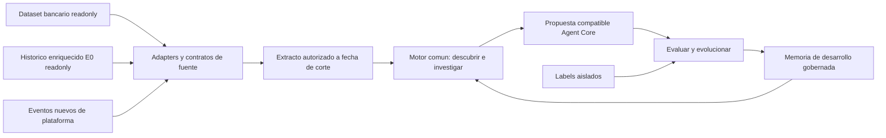

### 28.2 Ingesta y relaciones sin modificar fuentes

Implementar `EnrichedHistoryAdapter` en `adapters/source`; lee Parquet y los contratos actuales `platform_history` 0.5.1 y `evaluation` 0.2.0. Fijar archivos/schema/transform y documentos de políticas/preguntas por digest en SourceSnapshot, declarar contratos borrador y fallar con quality finding ante incompatibilidad. No crear un servicio nuevo ni nuevas tablas de dominio: usar artifacts, cursors y manifests existentes. Los datos originales y aumentados permanecen readonly.

Manifest declara `source_kind=enriched_history`, evidence_kind team_generated para el paquete compuesto, origen de campos suministrados/inferidos/generados, `world_ref`, contratos, partitions, clocks, tablas ausentes y transform refs. Referencias nativas usan namespace de fuente: un case_id igual a un complaint_id no implica misma entidad. complaint_id permite vínculo declarado al dataset; customer_id seudonimizado requiere mapping autorizado, no join directo con customers.customer_id. Cargo candidato conserva link_method inferred, nunca exacto por tener params de tool. No repetir conteo del reclamo al unir ambas fuentes: identidad operacional del caso y registro bancario permanecen distintos, con puente explícito y denominador por grano.

Las vistas del lab exponen case/identity_check/turn/routing_step/copilot_query/tool_call/approval/case_close y timeline según corte. identity_check registra preguntas usadas y resultado, nunca respuestas; éstas tampoco se reconstruyen para prompts, wiki, logs o debugging. timeline es derivada, no otro evento: no contar sus filas más las tablas originales. suggestion/component ausentes significan capacidad no presente en E0; no completar artificialmente. Cada campo sensible conserva tratamiento antes del ModelPort. La autorización del usuario cubre procesar E0 en local y servicios locales controlados (p. ej., LocalStack/MinIO en loopback); no publicar el paquete ni transmitirlo a proveedores remotos. Por ello RunConfig bloquea egress remoto con contenido E0, sin bloquear su lectura/proyección ni el uso de servicios locales. No exportar labels bajo ningún proveedor.

`available_at` es condición de consumo, además de event_time. Como el contrato menciona ingested_at pero sus fields no lo especifican, el adapter comprueba presencia física. Si falta, usar modo replay explícito: disponibilidad asumida al timestamp de cada evento, con ingestion_lag=0 etiquetado como supuesto, no timing de producción probado. approval_request está disponible en requested_at y approval_decision en decided_at: la primera no incluye decisión futura. case_close sólo tras closed_at; señales de ventanas completas sólo tras window_end. Los resultados posteriores de labels nunca entran en lecturas de descubrimiento.

### 28.3 Descubrimiento común y expectativas independientes

El adapter publica observaciones normalizadas y conserva payload fuente; no inventa eventos Core, hashes audit ni cuatro capas donde sólo hay humano/copiloto. MetricSpecs habilitan familias según cobertura. Dataset permite detectar magnitud/segmentos; E0 permite consultas repetidas, secuencias de acciones, verificación, errores/reintentos, espera de aprobación, transferencias y abandono; telemetría futura permite fallos por capa, costo y regresiones. No todos los sensores tienen que funcionar sobre todas las fuentes.

Scout puede descubrir motivos/secuencias libremente en texto tratado y SQL del lab. Cálculo comprueba soporte por casos y asesores distintos, denominador elegible, tiempos y cobertura; verifier refuta éxito aparente, mezcla de canales y acciones no verificadas. Repetición no demuestra buena práctica: oracle de políticas del sandbox valida acciones/precondiciones independientemente del humano. El paquete actual incluye docs/policies.md y docs/security_questions.md v0.1 borrador: son especificaciones del entorno de prueba, no políticas bancarias reales ni executors ya implementados. Su interpretación se convierte en fixture/policy/oracle versionados antes de evaluar; si una regla no es ejecutable, not_evaluable, sin deducirla de labels.

`signal.parquet` es referencia precalculada de comparación, **no entrada del detector, scout, builder ni memoria inicial**. Guardarla en partición evaluator_reference igual que labels; reproducir señales desde eventos sin leerla. Evaluador compara mecanismo, población, soporte y evidencia, no igualdad textual ni IDs. Hallar oportunidades nuevas es resultado permitido: valorar reproducibilidad, seguridad y mejora con casos posteriores, sin exigir pertenecer a las tres señales preparadas. El paquete no es sólo benchmark: sus eventos autorizados sí son materia de aprendizaje.

### 28.4 Dos protocolos de evaluación explícitos

| Protocolo | Construcción | Reproducción y memoria | Qué mide |
|---|---|---|---|
| Congelado | Arranque, config y artefactos fijados | Casos posteriores en orden; no actualizar candidato, sensores o wiki usados durante la campaña | Generalización de una versión |
| Continuo prequential | Arranque inicial, mismas interfaces | Por caso: fijar estado anterior, predecir/actuar, puntuar aparte; después incorporar sólo eventos cuya disponibilidad ya venció; nuevas propuestas pasan gates | Evolución autónoma a través del tiempo |

Separar métricas, manifests y budgets: no comparar agregado continuo con congelado sin explicar versiones/exposición. Empates opened_at forman cohortes: no usar otro caso abierto al mismo instante como pasado. Para cada decisión usar sólo casos abiertos antes del evaluado y eventos disponibles hasta su instante de replay; nunca insertar un episodio completo al abrirlo. Reproducción respeta acciones/estado, no obliga a copiar diálogo humano: el simulador puede ramificar con otro siguiente paso. Un log grabado por sí solo no es banco stateful ni prueba contrafactual de una nueva tool; ScenarioFactory construye sandbox con tools reales de test y bridge verificable (§18/27), o declara mecanismo proxy/no evaluable.

Labels lo lee sólo evaluador aislado; entrada redundante allí se toma de case, nunca se monta labels en el lab. `human_actions` es baseline, human_errors no es instrucción para el builder y final_* son outcomes posteriores. Feedback permitido para desarrollo proviene de simulador/oracle y partición de desarrollo, no de casos finales sellados. Protocolos E0 son campañas distintas de final confirmatorio §18: reutilizar reproducción para ajustar el sistema la convierte en benchmark de desarrollo, no holdout virgen. Una afirmación confirmatoria requiere familia/split final separado y sellado antes de iterar. Análisis agregado de resultados no devuelve respuestas por caso al builder ni wiki.

Métricas: oportunidades corroboradas/nuevas/refutadas, tiempo hasta hallazgo en reloj replay, cobertura de descubrimiento frente a referencias, propuestas viables y mejora segura por versión; resolución/acción correcta y escalamiento con numerador/denominador explícitos, acciones inseguras, latencia y costo conocido/desconocido. Sin referencia exhaustiva no llamar precision/recall global al conteo contra tres señales. Reportar PT/casos difíciles aparte y solapamientos, sin sumar cohortes no disjuntas. R4 y otras políticas son supuestos del entorno: su distribución restringe automatización, no prueba rentabilidad bancaria real.

### 28.5 Entrega incremental y aceptación

| Slice | Objetivo y comportamiento requerido | Pruebas antes de cerrar |
|---|---|---|
| E0-A fuente | Ingerir manifests y contratos, validar entidades/refs, preservar namespace y aislar labels/signal | Unit schema/clocks; integración Parquet readonly, joins seudónimos rechazados, timeline sin doble conteo; ausencia de tabla y columnas extra |
| E0-B descubrimiento | Ejecutar F1–F3 con eventos de arranque, producir evidencia desde fuentes, no desde diagnósticos | Integración cambia/elimina signal y labels sin alterar entrada/hallazgos con mismo provider replay; evidencia alterada sí cambia soporte; E2E descubrimiento sin ID esperado hardcodeado |
| E0-C replay | Ejecutar congelado y continuo separados con cortes y decisiones registrados | Unit cohorte/reloj; integración approval futura invisible y cierre tardío excluido; regresión contra futuros eventos/labels; crash/resume no puntúa ni aprende dos veces |
| E0-D mejora | Construir artefacto Core, probar base/candidato y memoria gobernada | E2E oportunidad→EntityDraft→gates; error humano repetido no se acepta por coincidencia; oracle faltante bloquea; propuesta nueva fuera de referencias se evalúa sin rechazo automático |
| E0-E aislamiento | Evidencia, debugging y resultados con fuente/split/versión/coverage | Seguridad labels/final ausentes en prompts, logs y wiki; restricción de exportación aplicada; contrato UI muestra qué aprende y qué espera sin requerir clicks |

DoD documental y futura implementación: el mismo pipeline soporta original-only, enriched-only y fuentes combinadas con deduplicación; descubre sin respuestas precargadas, propone una mejora evaluable y sigue aprendiendo de nuevos eventos. El caso de éxito no queda limitado a cargo no reconocido ni a una tool predeterminada. Los conteos de SAMPLE/COVERAGE son referencias reportadas, pendientes de recalcular mediante E0-A; este ajuste del spec no acredita tests ni resultados ejecutados.

### 28.6 Paquete actualizado: identidad, políticas y canales

Snapshot auditado el 01-10-2026: history 0.5.1 / evaluation 0.2.0, 2.000 casos y split 200/1.800 comprobados en Parquet. Hay 845 identity_check (396 trigger abono y 449 canal_sin_identidad), todos verified; 774 usan dos preguntas y 71 tres. No hay filas huérfanas ni ended_at anterior a started_at en esos checks; ninguna llamada abono_provisional carece de check verified previo en el mismo caso en la comprobación realizada. Esto no demuestra ausencia de otros errores humanos ni auth segura en producción.

Adapter normaliza identity_check.questions: contrato VARCHAR[] pero almacenamiento VARCHAR con JSON array válido en las 845 filas. No contar caracteres como preguntas; parsear JSON y validar IDs/longitud/tipos. turn.text_source es columna física adicional de procedencia, se declara en transform/manifest y no se utiliza como predictor/oracle. suggestion/component siguen sin archivos. ingested_at sigue ausente en todas las tablas presentes; permanece el supuesto replay de disponibilidad, no se inventa timing de ingesta.

identity_requested se observa en started_at; result/correct/lista final de preguntas y duración sólo en ended_at. Si no hay tiempos por pregunta, no publicar SQ3 anticipadamente desde el registro final. expected_identity_check es objetivo evaluator-only, no condición de routing del agente. La condición de verificación se calcula desde policy/canal/acción autorizados. Los datos reales de respuestas no se materializan en prompts ni memoria; el fixture del servicio de identidad las valida por frontera determinística y devuelve sólo evidencia de resultado. No permitir que Jev/LLM decida si una respuesta es correcta.

case.channel observado: phone/email/web_chat/app_chat. Los orígenes branch (70) y regulator (22) no son canales de sucursal del sistema: se modelan como llamadas salientes; 22 casos regulator están en phone. Conservar origin y channel separados y probar A2/firma supervisora. Descriptor caller_number/phone no demuestra autenticación de voz: el sandbox declara su identidad de canal mediante fixture/evidencia, no por inferir confianza desde un número o del texto del usuario.

Políticas y preguntas son supuestos gobernados del entorno. Fixture debe cubrir identidad fallida, tercera pregunta, falta de movimientos, sesión vencida/corte y renovación; negación de acceso a otro titular; abono humano y límites por nivel; confirmación de bloqueo; disputa >90 días; regulador y portugués. Históricos positivos de identidad no cubren negativos, y R2 >90 días no aparece en los cargos muestreados (<60 días). Casos adicionales se generan en sandbox como pruebas, no se insertan en E0 ni se atribuyen al dataset original. KBA de este ejercicio no se presenta como arquitectura de autenticación bancaria aprobada.

README prohíbe publicar el paquete o enviarlo a proveedores/servicios remotos. Está autorizado usarlo en servicios **locales** controlados por el equipo (proceso local, Podman/Compose, LocalStack o MinIO en loopback); esta autorización no habilita llamadas a OpenRouter, servicios hosted de Jev/LLM ni otros endpoints externos. El runtime de descubrimiento E0 debe usar adapters/provider replay locales, sin transmitir filas, texto, prompts ni derivados identificables fuera del host/stack local. Smoke live de modelos emplea fixtures independientes permitidos, no conversaciones E0 enmascaradas. Reemplazar el directorio crea otro SourceSnapshot/digests; no reutilizar caches, baseline ni resultados sellados del snapshot anterior. La comparación histórica aquí usa el spec previo 0.4.2/0.1.0 y documentación conservada, no un diff byte a byte de una copia antigua inexistente en esta auditoría.

**Estado de implementación a no sobrestimar:** los cortes U03, U04-B, U08-E, U12-E y U13-E implementan contratos/admisión de componentes; no constituyen por sí mismos un `source-projector`, un comando local que los componga sobre los archivos reales ni una reproducción con evaluador separado. Mientras el source-projector no lea el esquema del dataset original y emita el `PreparedSource` autorizado, `original-only` debe responder `unsupported_source` con la tabla/capacidad faltante. Un contrato JSON válido o un test sobre fixture sintético no demuestra compatibilidad ejecutable con el dataset original. El source-projector E0 y su runner se aceptan sólo tras pruebas sobre las versiones/archivos locales declarados en §28.7.

### 28.7 Contrato de la vertical ejecutable: adapters → detección → salida → evaluación

Esta sección convierte la meta “probar un escenario real localmente” en un contrato comprobable. **Es requisito objetivo; no afirma que el camino ya esté integrado.** El primer escenario de aceptación usa el E0 aumentado, porque su historial operacional aporta señales observables; el adapter original se entrega como capacidad separada. Que E0 esté soportado no habilita silenciosamente el dataset original, y viceversa.

#### 28.7.1 Boundary de entrada y proyección segura

El CLI orquesta un `SourceProjector` (no pasa paths a Scout/LLM/Core). El projector identifica la fuente mediante un manifest versionado, verifica digest/versión/esquema antes de abrir las tablas, hace joins en el borde de datos y devuelve `PreparedSource`: metadatos sellados más una proyección tipada con las columnas/relaciones permitidas. No devuelve filas originales, un `DataFrame` irrestricto ni un path local a consumidores posteriores.

Para E0, el contrato de compatibilidad exacto es `platform_history` v0.5.1 y `evaluation` v0.2.0, once archivos/tablas Parquet: nueve operacionales (`case`, `identity_check`, `turn`, `routing_step`, `copilot_query`, `tool_call`, `approval`, `case_close`, `signal`) y dos de evaluación (`labels`, `timeline`). El adapter valida presencia, tipos físicos y lógicos, nullability, enum/domain, PK/FK, relaciones con case, clocks y campos extra; las discrepancias generan hallazgo tipado y nunca alias guessing ni éxito vacío. `identity_check.questions` requiere parseo y validación como JSON array cuando el almacenamiento físico sea `VARCHAR`; `turn.text_source` adicional debe quedar declarado en el transform y no se vuelve predictor por aparecer en Parquet. `timeline` es derivada y jamás se suma con sus eventos fuente. Una columna adicional no se consume hasta que un contrato/versionado la autorice.

La proyección sólo incluye hechos requeridos por el detector activo y aprobados por un allowlist (dimensiones operativas, eventos, resultados de herramienta, tiempos y estado con availability). Se excluyen respuestas KBA, contenido de evaluador, datos directos de identidad y texto original no tratado. `customer_id` ya seudonimizado puede formar un token de agrupación por run cuando un detector requiera continuidad; el valor fuente y cualquier mapping reversible se quedan en el projector y no se registran ni salen en artefactos. Los textos con marcadores ya tratados se habilitan sólo por un permiso de campo y una ejecución local explícita; no se admiten en logs, consola, memoria persistente ni llamadas a proveedor remoto. Cada join comprueba cardinalidad, parent case y namespace; huérfanos, duplicados o cruces inválidos se contabilizan como calidad y no se reparan por heurística.

`signal.parquet` conserva el tratamiento de §28.3: la presencia en el schema no autoriza su uso como detector input. Se clasifica `evaluator_reference`/excluded hasta una política aprobada que pruebe productor, semántica, ventana y disponibilidad. `labels` y `timeline` sólo se abren mediante el evaluador (§28.7.4). Para que una prueba de no fuga sea real, el comando `run` debe terminar correctamente aun si `evaluation.json` está ausente o el path del evaluador es inaccesible.

El adapter original requiere su propio source contract + `SourceProjector`, sin alterar tablas/CSV ni inferir que los nombres parecidos al E0 significan lo mismo. Hasta mergear y probar ese adapter, la matriz de capacidades anuncia `original: unsupported`; `run --source original` retorna ese estado y no intenta el sensor E0. No afirmar soporte por la existencia de `call_center_interactions.v1.json`, por validar un header fixture ni por leer directamente el CSV sin mapping seguro. Cuando el projector exista, debe consumir el contract, producir proyección/cobertura/digest, y probar lectura readonly, nullability, los joins autorizados, tratamiento PII y corte temporal contra los bytes reales locales.

#### 28.7.2 Arranque y reproducción sin fuga temporal

`Arranque` y `Reproducción` son controles de protocolo del harness confiable, no features ni labels que recibe el motor. Para la muestra versionada: arranque = 200 casos iniciales ordenados por `case.opened_at`; reproducción = 1.800 restantes en orden ascendente. El harness puede usar `labels.rank/split` para comprobar la partición documentada y construir un manifiesto opaco de miembros; no serializa esos campos, sus valores ni `labels.case_id` al `PreparedSource`, prompts o artefactos de descubrimiento.

El Arranque crea una línea base/sensor/candidato a partir sólo de casos del prefijo y eventos admisibles a su cutoff final sellado. En reproducción el harness se mueve caso por caso. Antes de evaluar el caso objetivo `i`, congela la versión activa; sensores, queries, memoria y propuestas sólo observan eventos de casos anteriores cuyo `event_time` y `available_at` sean `<= opened_at(i)`. Si la fuente aporta `ingested_at`, también se exige `ingested_at <= opened_at(i)`; E0 sin reloj físico admite únicamente el perfil `replay_at_event_time` de U04-B (lag 0 supuesto y visible). Empates de `opened_at` forman una cohorte no ordenable: ningún caso de esa cohorte informa a otro. Eventos posteriores/cierre/decisión del caso `i` se entregan sólo a su evaluador después de sellar el resultado de `i`, y pueden afectar casos futuros sólo una vez vencida su disponibilidad. En modo continuo, cualquier update de memoria/config/sensor ocurre después de puntuar y produce una nueva revisión para `i+1`, nunca muta el estado que generó la decisión actual.

Hay dos informes/campañas distintos: frozen mantiene candidate/config/sensor/memoria fijados para toda la reproducción; prequential/continuo aplica la secuencia de fijar→decidir→sellar→evaluar separado→actualizar/versionar. No mezclar sus métricas, exposición ni denominadores. La partición reproduction deja de ser holdout confirmatorio si resultados por caso o métricas se usan para tunear; registrar cada iteración como desarrollo. El stress-test (Portugués/difíciles) se reporta aparte, sin filtrar su pertenencia al detector.

El adaptador valida cortes por campo, no sólo el corte global. `approval_request` nace en `requested_at`, `approval_decision` en `decided_at`; `identity_check` no revela resultado/preguntas completas antes de `ended_at`; `case_close` no existe para el motor antes de `closed_at`; ninguna señal de ventana completa puede usarse antes de `window_end`. El fixture `replay_at_event_time` declara la suposición y no demuestra latencia de ingestión de producción.

El `run_manifest` persiste el compromiso exacto de lectura: digest del snapshot y contratos, versión de transform/allowlist, detector/config, protocolo, partición, cutoff efectivo, perfil de disponibilidad, lista de tablas/campos realmente leídos, conteos incluidos/excluidos y cursor/cohorte. No persiste identificadores fuente. Un retry/restart con la misma idempotency key debe reconstruir el mismo ámbito; si cambió cualquiera de esos inputs crea una corrida nueva, no continúa una corrida distinta. Tests alteran bytes, cutoff, allowlist y orden/cursor y comprueban rechazo o nuevo run. Con E0 `replay_at_event_time`, `available_at` y `ingested_at` derivan del perfil asumido y se reportan como tales, nunca como clocks observados.

#### 28.7.3 CLI local, corrida y salida atómica

La aceptación requiere comandos ejecutables, no sólo tests de biblioteca. La sintaxis es una interfaz estable a congelar al integrar el runner; estos nombres describen el contrato funcional:

```powershell
improvement-engine source validate --kind enriched_history --input <path> --contract-version 0.5.1
improvement-engine run --source <source-snapshot-ref> --protocol frozen --partition arranque --as-of <RFC3339-UTC> --execution-profile local-simulated --output-root <path>
improvement-engine run --source <source-snapshot-ref> --protocol frozen --partition reproduccion --as-of <RFC3339-UTC> --execution-profile local-simulated --output-root <path>
improvement-engine evaluate --run <sealed-run-dir> --evaluation-source <path> --contract-version 0.2.0
```

`source validate` hace lectura readonly y emite coverage/schema findings sin filas/IDs/texto. `run` resuelve source contract, snapshot, projector, temporal protocol, sensores/workflow local y sella una corrida; **no recibe argumento de evaluación ni abre `labels`/`timeline`**. `evaluate` es proceso/puerto separado, verifica primero hashes/manifests, hace el join interno de evaluador y publica sólo agregados. El comando indica de forma explícita modo local y qué capacidades son `simulated`, `dependency_unavailable` o nativas; el mock de Agent Core ejecuta interfaces/productos del motor para probar el flujo, pero nunca escribe `native_success`/`released` ni crea receipts con autoridad externa. El camino E0 no invoca servicios hosted y no exporta muestra o derivados.

El scope allowlisted del manifest es una lista exacta de tablas y campos consumidos por cada etapa; descubrir archivos adicionales no amplía el scope. Al validar E0 se debe auditar el schema y las relaciones de las nueve tablas operacionales aunque algunas queden excluidas del detector input (`signal`) o sólo estén disponibles post-outcome (`case_close`). Evaluación (`labels`, `timeline`) pertenece a otro scope y otro proceso. La ausencia de una tabla requerida, un campo, una relación o una regla de dominio produce un quality finding/bloqueo explícito; nunca se interpreta como cero ni se omite silenciosamente.

`original` falla cerrado: hasta que exista mapping source-contract específico verificado contra el dataset original, `run --source original` termina `unsupported_source` antes del sensor, Scout o simulador, con lista segura de capacidades faltantes y exit code 2. No basta con producir un `PreparedSource` vacío, enumerar hashes/headers o terminar `completed` sin observaciones. La tabla de capacidades y el manifest deben reflejar `original: unsupported`.

Cada corrida se escribe a `<output-root>/.staging/<run-id>` en el mismo volumen. Cada archivo usa creación exclusiva, schema versionado, `flush`/`sync_all`, length y digest; el manifest de run se escribe al final con source/schema/transform/policy/config hashes, corte, protocolo, runtime adapter, estados y lista exacta de outputs. Al confirmar la integridad, renombrar atómicamente el directorio staging al destino final único; lectores ignoran staging. Fallo antes del rename deja run `incomplete` no elegible; no sobrescribir run previo. Si filesystem no garantiza rename atómico de directorio, devolver `dependency_blocked` y documentar mecanismo alternativo seguro antes de llamarlo completo. Retry sólo reanuda si idempotency key y todos los commits inputs/config coinciden; de lo contrario crea nueva corrida. No escribir `completed` previo a publicación atómica.

Salida mínima: manifest, coverage/quality summary, run-event timeline safe, señales agregadas con numerador/denominador/missingness/cutoff, evidencia/candidate draft commits y status de cada gate. No copia archivos de fuente, path de usuario, customer/case/agent IDs de origen, texto, KBA, labels/timeline o prompts. Para explicar evidencia por caso, usar referencias opacas/run-scoped y sólo mostrarlas en debugging local protegido; los resultados que puedan exportarse son agregados. Un run `completed` significa que el pipeline declarado terminó, no que encontró oportunidad, Native/Core funcionó, el candidato calificó o el banco mejoró.

Estados terminales no colapsables: `completed`, `no_supported_signal`, `unsupported_source`, `insufficient_evidence`, `dependency_blocked`, `failed`, `incomplete`. `no_supported_signal` sólo cuando hubo población no vacía/cubierta y corrió un detector soportado. Fuente vacía/invalidada no equivale a cero. Original sin projector/mapping => `unsupported_source` con lista de tabla/capacidades faltantes, exit code documentado y ningún fallback a E0.

Exit codes: `0` para evaluación local terminada con fuente soportada (incluye `no_supported_signal` o `insufficient_evidence`); `2` para contrato/schema/fuente no soportados (`unsupported_source`); `3` para fallo operativo/dependencia al completar pipeline; `4` para violación de aislamiento o protección. Cuando se pudo escribir, el resumen y manifest preservan el status tipado aunque el proceso retorne 2/3/4; un fallo de escritura conserva únicamente staging/incomplete, jamás un resultado completed. Estos códigos se congelan con las pruebas de CLI.

**Criterio de parada/no-op para E0:** si el smoke de referencia reproduce 0 señales positivas, 13 observaciones faltantes y 3 candidatos inciertos, el resultado aceptado es terminal `no_supported_signal` o `insufficient_evidence` según cobertura efectiva, ruta formal `do_nothing`, cero candidato ejecutable/propuesta/release y resumen con numeradores, denominadores y razones de missingness/incertidumbre. Las tres candidaturas inciertas no se elevan ni se reintentan en bucle. Sólo una nueva revisión de fuente/config/detector explícitamente versionada permite otro run; resultados vistos convierten reproduction en conjunto de desarrollo, no holdout confirmatorio. Los conteos son fixture de regresión de la muestra auditada, no constante universal: si cambian los bytes debe cambiar el commitment y reportarse el resultado recalculado, sin forzar esos conteos ni una oportunidad.

#### 28.7.4 Evaluador aislado y medición

La evaluación inicia sólo con `run_manifest` ya comprometido. Un crate/binario de evaluator consume `evaluation.json`/`labels.parquet`/`timeline.parquet` readonly y un mapping opaco mantenido por el harness; no comparte `PreparedSource`, ledger de query, contexto Jev/LLM/Core o filesystem reader con `run`. Separar carga/config/permisos: el proceso `run` debe poder ejecutarse bajo una cuenta que no tenga acceso al directorio evaluator. En tests, dicho path será un sentinel que falla ante cualquier open; comprobar que el run produce el mismo digest cuando evaluation files están presentes, ausentes o alterados.

El evaluador verifica source/run/evaluation contract digests, joins caso sólo dentro del namespace/campaign sellado, aplica campos por `evaluation.json` `use` (entrada/objetivo/referencia/diagnóstico/posterior/orden) y calcula métricas de cada protocolo/cohorte con denominador y filas excluidas explícitos. Los campos `expected_*`, `human_errors`/human actions, `final_*` posteriores y timeline son visibles exclusivamente al evaluador después de sellar la salida. Ningún resultado individual vuelve al builder/sensor/memoria durante esa misma corrida. Una iteración posterior puede usar sólo un reporte agregado firmado/hasheado y explicitamente permitido para desarrollo, creando nuevas revisiones y etiquetando reproducción como conjunto de desarrollo, no holdout confirmatorio.

Los artefactos simulados mantienen valores de ejecución diferenciados en summary y timeline por etapa; no reportar tasa de nativo ni diferencia uplift si la ejecución fue el simulator. El evaluator reporta referencia E0 descriptiva y safety/oracle; B compara sólo resultado sandbox medido con tool effects/readback, nunca atribuye causalidad en la distribución bancaria sólo por labels. Unknown/missing/blocked permanecen en la base y denominadores reportados, no se eliminan silenciosamente.

#### 28.7.5 TDD, integración y Definition of Done

| Prueba | Criterio observable | Regresión obligatoria |
|---|---|---|
| Source projector unit | Acepta schema real E0 0.5.1/0.2.0 y produce proyección allowlisted; valida `VARCHAR` serializado de `questions` donde aplique | Schema/version/type drift, required table/column ausente, columna nueva no permitida, enum/null/PK/FK/cardinalidad erróneos, texto/PII/KBA/label omitidos |
| Source projector integration | Smoke local opt-in lee las nueve tablas operacionales Parquet reales readonly; evaluator files no se pasan al projector de run. El evaluador, por separado, lee `labels` y `timeline`. Ambos validan sus relaciones sin modificar bytes. CI usa fixtures sintéticos con mismo schema; ningún dato E0 se versiona | Remover/alterar `signal` no cambia el hallazgo; cambiar `labels`/`timeline` no cambia el digest de decisión del run (sí puede cambiar el digest separado de evaluación); `signal` permanece en cuarentena; corrupt parquet/relación rota falla explícito |
| Cutoff/harness unit+integration | Arranque 200 y Reproducción 1.800 por opened_at/rank esperado; empates en misma cohorte; actualiza memoria sólo entre casos | Evento/field/ingest/cierre/decisión futuro invisible; monotonic timestamps; reload/crash no aplica dos veces; split/rank no llega al motor |
| CLI arranque E2E (gate A) | `source validate` y ejecución local de Arranque sobre E0 readonly; produce manifest/salida atómica y motivo honesto aunque no detecte oportunidad | Cero señal positiva + 13 missing + 3 inciertas termina no-op/do_nothing; no candidato ejecutable ni loop; fuente alterada cambia commitment; gate no afirma replay/evaluador |
| Reproducción E2E (gate B, pendiente del gate A) | Replay 1.800 caso-a-caso conforme al cursor/cutoff sellado y protocolo; informe separado frozen/continuous | Empates, reinicio, corte de campo y cambio de inputs; cualquier consulta de outcomes/futuro bloqueada; inspección/tuning degrada explícitamente a desarrollo, nunca holdout validado |
| Evaluador aislado E2E (gate C, pendiente del gate B) | Proceso/permiso separado evalúa sólo run sellado y publica agregados; `run` termina sin acceso al path evaluator | Sentinel ante open, labels/timeline presentes/ausentes/alterados no cambian decision digest; joins/denominadores correctos y no reingreso de resultados individuales |
| Cobertura schema E0 | Validar nueve tablas operacionales y relaciones contra bytes reales readonly; validar aparte dos tablas evaluator; manifest lista campos realmente consumidos | Falta tabla/campo, drift, enum/null/PK/FK/cardinalidad o datos corruptos bloquean; `signal` no afecta detector, `case_close` sólo post-outcome |
| Source original fail-closed | Sin projector real: `unsupported_source`, exit 2 antes de invocar sensor/simulador, capacidades faltantes seguras | No `PreparedSource` vacío ni `completed`; no fallback E0; sólo declarar soporte después de mapping/joins/PII/cutoff sobre CSV real readonly |
| Evaluator isolation | `run` no puede abrir la carpeta del evaluador y produce el mismo digest de decisión independientemente de `labels`/`timeline` | Intentar serializar labels/campos finales dentro de PreparedSource, prompt, event, draft o wiki falla en compilación o en runtime |
| Atomic-output integration | Run output final sólo aparece tras manifest/hash/rename; retry exacto idempotente | Inyectar crash tras cada escritura, target preexistente, hash alterado, acceso concurrente y rename no atómico jamás crea `completed` parcial |
| Original source | Hasta que projector esté implementado: retorna `unsupported_source` sin procesar, cero candidatos | No fallback a E0, no inferencia por nombre de campos; tras implementación sólo green con source-contract-specific fixtures y Parquet/CSV real readonly |
| Release-quality | `cargo fmt --all -- --check`, `cargo clippy --workspace --all-targets -- -D warnings`, `cargo test --workspace`, `python -m unittest discover -s tests -p "test_*_contract.py" -v`, `python contracts/validate_fixtures.py`; revisión independiente de seguridad/data, backend/runtime, test y E2E | Evidencia de comando/head/branch exacto; compose smoke se reporta separado y no se inventa si backend Podman está unavailable |

**DoD escalonado; no confundir con estado implementado:** gate A = Arranque ejecutable y no-op/detección honesta sobre E0 local con source manifest completo; gate B = Reproducción temporal completa con commitment/cursor persistidos; gate C = evaluator aislado y agregado. Sólo A permite afirmar “smoke de Arranque runnable”; sólo A+B+C y cobertura real de tablas permiten afirmar “E2E runnable y evaluable”. Ninguno permite llamar confirmatorio al holdout una vez inspeccionado/tuneado, ni afirmar causalidad/lift bancario. Dataset original permanece `unsupported` hasta que su projector real pase pruebas readonly y fail-closed. No se afirma que replay, evaluator o validación completa de tablas esté implementado por la existencia de código/fixtures parciales.

#### 28.7.6 Trazabilidad entre contratos existentes y la integración pendiente

Esta tabla separa qué demuestra hoy cada corte del repo de lo que debe probar la vertical runnable. La presencia de módulos de Core o pruebas con fixtures no equivale a leer los Parquet reales ni a ejecutar el flujo CLI completo.

| Evidencia en `improvement-engine` | Lo que sí respalda | Lo que no respalda todavía |
|---|---|---|
| `crates/core/src/enriched_history.rs`; `crates/core/tests/enriched_history.rs` | U04-B, projection in-memory E0, cutoff/availability y exclusiones de contenido no permitido | Parquet filesystem adapter, E0 SourceProjector, source-projector original o comandos CLI |
| `crates/core/src/e0_query_lab.rs`; `crates/core/tests/e0_query_lab.rs` | U08-E capability de consulta y receipt E0 opacos con source evidence ya proyectada | Importar/parsear datasets completos o separar físicamente un evaluador |
| `crates/core/src/e0_deterministic_sensor.rs`; `crates/core/tests/e0_deterministic_sensor.rs` | U12-E mide el tipo de evidencia E0 autenticada con corte/digest | Escanear Parquet, elegir split, ni garantizar que caller pasó facts reales en orden |
| `crates/core/src/autonomous_scout.rs`; `crates/core/tests/autonomous_scout.rs` | U13-E conserva proveniencia de señal/receipts en candidato Scout | Runner, caso no dirigido de E2E, CLI, o métricas de resultado del benchmark |
| `crates/runner/tests/cli_e2e.rs` y `crates/source-adapters/tests/source_adapters.rs` (si están en la rama de integración) | Contratos candidatos para ejecutar end-to-end y leer schemas de source adapters | No cuentan como main/mergeados ni como CI verde mientras branch/head/checks no lo confirmen; fixtures sintéticos no sustituyen el E0 local real |

Por tanto, al reportar avance se usarán tres marcas: **componente implementado** (módulo/test slice), **integrado runnable** (comando end-to-end sobre E0 real con outputs sellados y evaluator aislado) y **original soportado** (source-projector original + pruebas contra el dataset original readonly). Sólo la primera tiene evidencia en las filas de módulos Core; las otras dos requieren las aceptaciones de esta sección.

## 29. Pulso usa Agent Core para evolucionar artefactos Agent Core

### 29.1 Arquitectura de ejecución y ownership

**No basta exportar al final ni convertir todo en agentes.** Detección/verificación/construcción son capacidades compuestas por Flow, rule, tool read/compute, decide con DecisionModelDef/Jev y, sólo donde aporte, node agent. Agent es el descriptor de ejecución de una release, no obliga a que cada etapa tenga personalidad, ReAct o LLM. El monitor periódico no es un LLM despierto permanentemente: scheduler y sensores deterministas abren tareas cuando corresponde. La autonomía surge de su coordinación durable, no de improvisar tiempos/reintentos en un prompt.

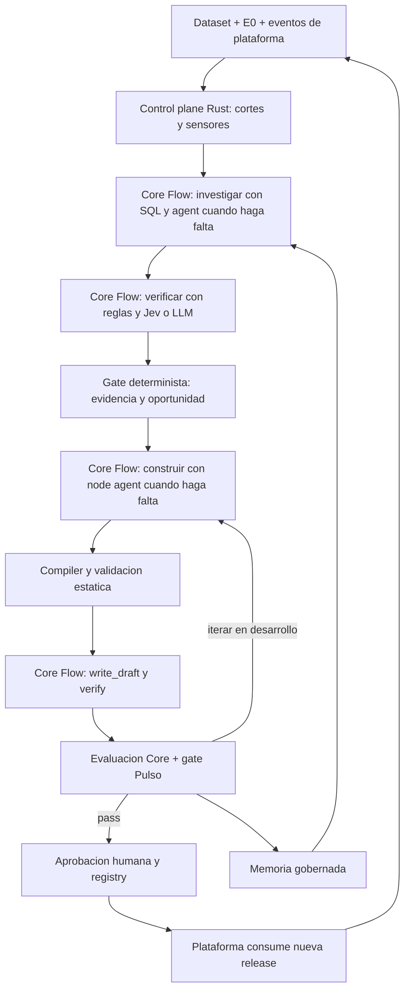

Rust no interpreta nodos Core: agenda, crea extractos, calcula métricas, controla presupuesto, prepara escenarios y guarda evidencia/estado. Core interpreta Flow, decide/agent, sus budgets, tools y auditoría. Su PostgreSQL tiene runs/reg_* propios y base separada de evaluaciones; PostgreSQL Pulso conserva diez tablas pulso_*. Pueden compartir servidor local, no ownership de tablas. Core externo gobierna ejecución y secretos de modelos; el consumidor reserva cuota y registra receipts sin otro gateway ni recalibrador de Jev.

El corte local añade servicio `agent-core-runtime` con imagen/commit fijados, alongside control-api/worker/Core/PG/S3/sandbox. Terraform despliega esa misma frontera de proceso en EC2 demo; health y versión observable por servicio. No se migra Core a Rust. Contrato de `CoreTaskPort` permite mock fiel para avanzar cuando falta composición; distinguir runtime=contract_mock de runtime=agent_core, y no llamar integración real a una simulación.

### 29.2 Qué cambió realmente en el snapshot actual

Fuente actual `53e729d624c8284e906249df84c1a1df84cc8d40`, posterior a 98d3836. contracts/VERSION y domain/version.py declaran **0.5.0**, mientras docs de conocimiento/transferencia hablan de 1.0.0/1.2.0. La numeración retrocedió frente al snapshot anterior: **SHA y digests de schemas/código son el pin**, no interpretar 0.5.0 como compatibilidad garantizada con un 0.5.0 previo. No editar upstream para ocultar la divergencia.

| Primitiva | Evidencia actual | Decisión Pulso |
|---|---|---|
| agent con input_view y output_schema | LLMAgentPort + M2 existentes; sólo read/compute dentro del bucle | Usar para investigar/verificar/diseñar; inputs explícitos, no asumir que recibe automáticamente el mensaje original |
| write_draft | RiskClass, M3, G0-23/AG-02, BuilderToolExecutor y reg_draft_writes existentes | Crear/guardar/congelar/reabrir/evaluar con act→verify sin confirm; jamás aprobación/publicación por bot |
| Idempotencia del constructor | Service acepta key/get_write; API HTTP aún no la expone para esas operaciones | Usar BuilderToolExecutor local al runtime; REST externo conserva restricciones §27.3; no inventar GET /writes |
| Quotas | Quotas inyectables: 10 auto_detect/24 h, 20 evals/propuesta | Presupuesto Pulso adicional, no elevar ni esquivar origin; 429 produce espera/detención explicada |
| knowledge read | KnowledgeService/RunState.pages/validación de citas y composición EngineDeps | Contexto fijo del run disponible con fuente; navigate not_found; serve no aporta fuente y registry bloquea cambios snapshot |
| Métricas ADR0020 | Agent.metrics/DSL y funciones de suite/gate/yardstick existentes | Declararlas donde catálogo permita; no confundir con gate efectivo de RegistryService |
| Dos EvalSuite | RegistryService importa registry.suite antigua; registry.evaluation.suite nueva vive aparte | Wire vigente usa suite antigua; nueva doble vara es diseño/función disponible, no integración registry ya hecha |
| Transferencia | Nodos, tipos, eventos, TurnEngine y tests existen; Agent de entities.py y Agent.json no incluyen routing/accepts que runtime consulta | No exportar esos campos ni prometer transferencia lista; smoke/paridad pendientes; no usar transfer para orquestar tasks |
| Serve y staff | serve.py, registry opt-in, staff_verifier separado, eval-dsn | Retirar afirmación de servidor inexistente; adapters tools/authz/transcript/lab/calibración siguen por integrar |

README/TEMAS conservan afirmaciones antiguas sobre servidor/conocimiento: prevalece evidencia por símbolo y composición, no el resumen de estado. No se han ejecutado tests upstream en esta revisión. Contract CI debe probar imports/validación/schemas/servidor antes de habilitar un feature, no sólo comprobar VERSION.

### 29.3 Composición de flujos, decisiones y agentes

Primera composición mínima: **un Agent task descriptor `pulso-evolution`**, con entry_flow de evolución y rutas de investigación, verificación y construcción. La primera tool recibe `args={}` y obtiene contexto del binding privado de la invocación, no de slots de entrada aún no validados. El bridge Python mantiene un contexto aislado por invocación (no variable global compartida), autorizado por tenant, principal builder, job, stage, grant, presupuesto y release. Al recibir el run_id generado por Core, registra su binding antes de permitir efectos. Devuelve facts booleanos `is_scout`, `is_verifier`, `is_builder`; rule compara booleanos, no literales de negocio incrustados. Stage recibido desde el cliente o prompt nunca concede permisos. No es un agente LLM monolítico: puede ejecutar una rama enteramente sin LLM. No usar subflow deshabilitado; las ramas del primer Flow son nodos explícitos y comparten entidades cuando procede. Stages se ejecutan como runs distintos para mantener leases, presupuestos y gates entre etapas; no hace falta concatenarlos con transfer.

Separar otro Agent/release sólo ante permisos distintos, presupuesto independiente, necesidad de evaluación/versionado independiente o aislamiento adversarial comprobable. Verifier tiene run/contexto/prompt y evidencia separados del scout aunque reutilice el descriptor; si eso no garantiza aislamiento requerido se extrae a Agent propio. Invocable_by builder, subject_kinds=[]; sin subject cliente ni credencial admin. Fuentes son extractos tratados autorizados por Pulso, no acceso a clientes con identidad builder. Caso bancario individual no se convierte en subject del constructor.

| Trabajo | Primitiva preferida | Cuándo escalar complejidad |
|---|---|---|
| Ventanas, conteos, joins, soporte y tiempos | SQL determinista / tool compute y rule | No LLM para recalcular ni decidir permisos |
| Categoría de señal, selección finita o juicio booleano/escala | decide + DecisionModelDef + Jev calibrado | LLM si el problema requiere explicación abierta o hipótesis nuevas |
| Investigar causas, refutar argumentos, diseñar artefactos nuevos | node agent dentro de Flow, con input_view y budgets | Agent independiente sólo si cambia frontera de permisos/contexto/release |
| Secuencia conocida de construcción/verificación | Flow tool(write_draft)→verify y ramas explícitas | No ReAct para improvisar protocolo de escritura o aprobación |
| Agenda, colas, disponibilidad, persistencia y aprobación | Control plane determinista / registry | No agentes ni Jev para leases, autoridad o idempotencia |

| Capacidad / entrada lógica Pulso | Flow y primitivas | Salida y consumidor |
|---|---|---|
| scout: snapshot/cutoff/lab/wiki/metric refs | tool read de contexto autorizado → agent con input_view, SQL/wiki read/compute → end | HypothesisSet tratado + evidence refs; TaskAdapter valida y persistencia Pulso; no opportunity corroborated directo |
| verifier: hipótesis, extracto y método sellados | rule/compute para schema/soporte/temporalidad, decide/Jev para juicios tipados y node agent sólo para refutación abierta; run separado | VerificationReport con contradicciones, queries y coverage; gate determinista calcula status |
| builder: oportunidad/bridge/capabilities/base/wiki | agent con alternativas y schema interno; segunda fase específica produce DRAFT_OUTPUT_SCHEMA exacto → write_draft/verify | ChangeSpec/evidencia por adapter y EntityDraft[] por registry; ambos enlazados por digest |

`CoreTaskInvocation` interno contiene tenant/pulso_run/job refs, agent+release pin, input_artifact_refs, lab_grant_ref, config/budget/cutoff/information_partition, deadline y logical key. TaskAdapter convierte a **CreateRunBody{agent,subject:null,input,lang}** y header Idempotency-Key de runs, autenticado con principal builder autorizado. No añade nuestro envelope al body Core. Cada input se proyecta a slots bajo nombres conocidos; Core los crea claimed, no validated. Flow usa tool read de contexto para verificar grants/digests y devolver facts tipados: referencias que aporta el modelo no autorizan montaje ni lectura.

`CoreTaskReceipt` enlaza core_run_id/release, estado/outcome, output refs/digest, audit refs y presupuesto conocido/unknown; además compromete criptográficamente el binding autorizado `{tenant_id, job_id, grant_ref, attempt, task_binding_ref, input_commitment}`. Un receipt exitoso de otro tenant, job, grant, intento o input no es reutilizable. Guarda firma/correlación externa, no token staff. Agent outputs no son hechos bancarios verificados. G0-22 impide llevar facts origin agent directo a rule, escritura bancaria o end.output_map; no diseñar Flow que lo eluda. Salida de análisis se captura desde facts del RunState por adapter autorizado dentro de composición confiable (sin endpoint público inventado), se valida fuera del modelo y se registra en Pulso. end marca tarea terminada, no demuestra verdad de hipótesis.

Identidad del runtime interno: configurar IdentityVerifier/AuthzPort para builder autorizado en este servicio de evolución separado de atención al cliente. --identity-keys valida invocación del run; --staff-keys valida registry opt-in. No asumir que una credencial válida en registry pasa automáticamente start_run. La credencial de BuilderToolExecutor es builder/constructor propia, no PrincipalType.service aunque algún texto de diseño diga “credencial de servicio”. Ningún grant lab sale del modelo; los adapters verifican tenant/run/cutoff/partición en cada consulta y ligan Core run a job mediante binding previo autorizado. Tests prueban credencial de cliente rechazada en runtime interno y constructor rechazado en atención de clientes.

El bridge compone Core in-process **dentro de Python**, no dentro de Rust. Expone transporte privado Pulso definido abajo; no es una nueva API upstream. Priorizar prueba vertical task con inputs→agent→fact→receipt antes de implementar todos los roles. En builder sólo facts.<draft>.value.changes con esquema DRAFT_OUTPUT_SCHEMA exacto puede alimentar args de write_draft (G0-22); título, origin, propuesta/rev y grants vienen de slots/facts deterministas validados. Antes de put_draft el wrapper verifica digest del payload contra EntityDraft[] aprobados por compiler y grant ligado a job/proposal/agent. Si el modelo cambió el payload, se recompila y requiere nuevo grant; schema válido no basta. Test adversarial cambia tool/policy/ruta entre fases: denied sin write. Salida de una escritura derivada no adquiere autoridad bancaria.

### 29.4 Jev, LLM y libertad segura del lab

Toda decisión Jev pasa por DecisionModelDef con output_schema, providers/calibración y nodo decide. Ejemplos: clasificar familia de señal, elegibilidad para investigar, tipo de intervención o suficiencia de evidencia. JevProvider traduce preguntas tipadas; confidence del proveedor no sustituye p_cal. Low-confidence tiene rama explícita de investigación/no decisión, jamás autorización por defecto. Para razonamiento abierto, causas y diseño usar agent + Prompt + ModelProfile structured:prompted y LLMAgentPort; no un SDK paralelo en worker.

El motor conserva gobierno de datos, reservas y conciliación del uso; Core conserva ejecución Jev/LLM y credenciales. U10 valida la integración externa autorizada y sus receipts, no implementa proxy. Los límites nativos de Core se verifican con pruebas; si no alcanzan el límite sellado, se bloquea la ruta live. Un usage desconocido nunca se convierte en cero ni libera automáticamente la reserva.

Libertad de lectura significa **capacidades generales**, no cien tools por query. Nodo agent requiere tools read/compute para acceder a información que no cabe en input_view: `lab/query`, `wiki/read` y `wiki/explore` tienen contratos amplios con ámbito/grant y redacción; el modelo decide SQL, navegación y métodos libremente. Implementar bajo ToolExecutor, no shell irrestricto ni acceso al filesystem host. Las tools son interfaz nativa y control de efecto, no un wizard. SQL temporal puede crear derivados efímeros dentro del lab autorizado sin efecto durable; publisher de wiki y cambios persistentes conserva gates Pulso. Knowledge read fijo no reemplaza esa wiki libre ni su publicación gobernada.

### 29.5 Lo que E0 enseña sobre el output

No entregar sólo insight o texto: producir **unidad de mejora versionada y verificable**, compuesta de artefactos Core, dependencias, mecanismo, ámbito, pruebas y límites. Output de dominio `ImprovementPackage` usa CapabilityBundle/ChangeSpec existentes; no nueva tabla ni EntityKind inventado. Distinguir paquete para atención de paquete para mejorar propio sistema, target_system=attention/evolution, en metadata Pulso fuera del JSON Core.

| Evidencia enriquecida descubierta, no precargada | Output candidato nativo | Requisito que debe acompañarlo |
|---|---|---|
| Consulta recurrente del asesor con mismas lecturas | ToolDef read/compute + Flow que la usa + Agent tools_allowed | Executor y permisos/data contract, paridad con lecturas originales, cobertura; ToolDef sin implementación no resuelve nada |
| Secuencia estable y segura de acciones | Flow rule/tool/confirm/verify + Agent actualizado | Precondiciones, ramas error/handoff, confirmación cuando corresponda, oracle de estado; no copiar error frecuente |
| Regla de siguiente paso o sugerencia | DecisionModelDef/Policy/Template/Flow y Agent de copiloto | Adapter que muestra recomendación, público asesor y permisos; suggestion_rule no es EntityKind Core |
| Motivo no cubierto que exige razonamiento | Agent + Flow agent + Prompt/ModelProfile + tools permitidas | Input_view explícito, budgets, fallback, pruebas e integración externa de modelos; límites de autonomía claros |
| Varios subtemas requieren composición | Varios Agents/Flows con plan de dependencias | TaskCoordinator para tareas de evolución; transferencia conversacional sólo tras resolver incompatibilidades; no node call_agent |
| Falta conocimiento o instrucciones útiles | Prompt/Template/Flow con contexto autorizado; propuesta de KnowledgeSnapshot si soporte futuro | snapshot importado/approved según canal actual; publicación por propuesta bloqueada; skill = composición de entidades, no schema nuevo |
| Sensor/hipótesis de automejora deficientes | Nueva versión de Agents/Flows/DecisionModelDef/Prompt del sistema + MetricSpec Pulso si requiere SQL | Tests no dirigidos, detección negativa, seguridad y mejora contra versión anterior; mismas barreras, no autoactivación |

Cada paquete incluye EntityDraft[] y refs exactas, executor_dependency_refs, evaluación nativa vigente, evidencia de mejora Pulso, policies aprobadas del entorno, fuentes/cutoff, consumidores afectados, config y rollback a release previa. EvalSuite **vigente** es kind del registry fuera de EntityKind runtime. Agent.metrics usa sólo catálogo actual; discovery con joins/SQL, tiempos de disponibilidad y calidad E0 sigue MetricSpec Pulso, no DSL Core extendido clandestinamente. No endurecer/aprobar policies bancarias sólo porque patrón humano se repite.

### 29.6 Ciclo autónomo, concurrencia y automejora del propio motor

1. Scheduler/coalescer reclama job con lease y prepara snapshot/lab tratado; fijar Agent/release/Flow y stage autorizado antes de dispatch. Agenda o señal dispara, usuario sólo excepcional; algunos jobs son enteramente SQL/reglas sin modelo.
2. CoreTaskPort invoca scout con key estable; lee receipt antes de repetir. Timeout no cancela run ni demuestra que no gastó: unknown, no duplicar trabajo hasta reconciliar estado.
3. Worker calcula soporte desde receipts y dispara verifier como task independiente; puede paralelizar investigaciones distintas con lanes/budgets §8, no dos jobs del mismo logical key. Core transfer no es fan-out, llamada de retorno ni DAG de tareas.
4. Gate determinista registra oportunidad/bridge o refutación; builder propone alternativas y compiler valida refs. Emitir diagnóstico de dependencia faltante, no artefacto verde ficticio.
5. Flow constructor autorizado usa BuilderToolExecutor con credencial builder/constructor propia: create_proposal→verify, put_draft→verify, validate, freeze→verify y evaluate→verify. El readback del executor no contiene por sí solo todos los bindings: para pass o failed_infra recuperable, el coordinador consulta el EvalRun completo del RegistryService y verifica eval_id nuevo, hash del candidato, base y suite contra el manifest esperado. Para fail se aplica la recuperación de §29.8 aunque last_eval haya desaparecido; no se habilita publicación. El recibo de write también se liga a operation/key/request_digest. Un verdict favorable o HTTP200 aislado no constituye ese gate. Fail/inconcluso vuelve al job de desarrollo con nueva revisión y consumo de cuota.
6. Gates Core + Pulso y final separado cuando procede; aprobación humana, publish y promote siguen registry, no herramientas del nodo agent. No await_approval task; PendienteHumano es decisión durable Pulso sin slot ocupado.
7. Memoria publica aprendizajes autorizados; nuevos eventos generan nueva detección. Candidato del sistema evolutivo sólo corre en sandbox sobre snapshots sellados; la release activa de scout/verifier/builder no cambia durante la investigación.
8. Si se propone modificar el detector o juez, **no puede aprobarse a sí mismo**: baseline de evaluación, oracle y guardrails fijados por control plane fuera del candidato. Promoción humana de nueva release evolutiva; activar siguiente job usa nuevo pin, runs antiguos mantienen el anterior. Se protege el circuito contra aprender a fabricar hallazgos o aflojar el gate.

Idempotencia de writes nativa existe sólo en métodos/BuilderToolExecutor, no como header de draft REST. Pulso ledger sigue necesario para ownership, presupuesto, cancelación y recovery. API REST evaluate sigue síncrona; serve eval max_workers=1 por Clock/IDs compartidos. Backpressure local no cancela petición en curso; límite global de evaluaciones por servicio y deadline/fallo de infra explícitos. No prometer exactly-once de llamadas LLM ni bloqueo global ante writers ajenos. Quotas upstream se verifican también en carreras con tests reales antes de usar al máximo; valor configurable Pulso no sobreescribe permiso ni límite Core implícitamente.

### 29.7 Implementación y pruebas contractuales

| Slice | Construcción concreta | Criterio verificable |
|---|---|---|
| AC-A pin/compose | Imagen Python Core por SHA, adapters de tools/authz/knowledge y artefactos mínimos publicados de prueba | Core validate/import, task start, staff separado; schemas regenerados en CI y divergencias explícitas, no comparar sólo VERSION |
| AC-B scout | Agent task/Flow agent/input_view + SQL/wiki generales sobre DuckDB por job | Descubre de E0 sin labels/signal y de dataset con cobertura; input faltante falla seguro; consulta libre no escapa tenant/grant |
| AC-C verifier/Jev | Agent task independiente + DecisionModelDef/decide calibrado | Refuta evidencia alterada; low-confidence no corrobora; no salida agent directa a rule/end/escritura bancaria |
| AC-D builder | DRAFT_OUTPUT_SCHEMA, BuilderToolExecutor, write_draft/verify y cuotas | Crash tras write se recupera por key/readback, misma key distinto payload conflicto, retries no duplican propuesta ni evaluate confirmado; ninguna tool approve/publicar |
| AC-E evaluación | Native suite antigua + ImprovementEvidence Pulso; nueva ADR0020 sólo tras adapter/gate probado | No mezclar dos EvalSuite ni dos Verdict; pass nativo sin mejora no libera; outcome inseguro falla; cambios métricas no eluden baseline |
| AC-F reflexividad | Proposal target_system evolution, baseline externa y siguiente-job release pin | Candidato no cambia su juez/guardrails; rollback humano funciona; cambio prompt afecta próximo job, no run actual |

Unit: inputs/namespace/cost reconciliation, métricas y gates. Contract: schemas/código/fixtures por SHA, JevProvider y gateway nativos, nuevos nodos y clases de riesgo. Integration: Core/PG/Pulso/DuckDB reales en Podman con fallos y claves de prueba. E2E: descubrir→refutar/corroborar→generar drafts→evaluar→decisión→segunda corrida. Live smoke separado con payload permitido y presupuesto; pruebas deterministas usan providers grabados por puertos Core. No basta fixture que simula “un agente dijo pass”: validar ejecutor real y receipts. No modificar Agent Core en esta tarea documental ni afirmar completado el cableado faltante.

### 29.8 Contratos de integración que debe construir el equipo

**Elegibilidad única de construcción.** `eligible_for_proposal` requiere fuente/grano/cutoff válidos, verificación independiente, bridge construible, policy/oracle disponibles y ausencia de bloqueo de seguridad. Además exige histórico `corroborated_descriptive`, o perfil E0 `candidate_descriptive` con soporte/calidad mínimos de su config. El segundo conserva evidencia descriptiva y no se renombra corroboración estadística; sólo autoriza construir y probar una hipótesis, nunca publicarla sin los dos gates. F3, PortfolioRanker, BridgeBuilder y diagramas usan este mismo predicado. La demo puede descubrir una oportunidad E0 legítima sin fingir potencia estadística del histórico.

**Sesión de exploración adaptativa.** `SandboxSessionPort` expone start(manifest,grant)→session_ref; query(session_ref,query_key,sql,expected_lease)→QueryResult; status y close. QueryResult contiene receipt_ref, schema de columnas, filas tratadas limitadas, truncated y result_ref/digest para resultado paginado autorizado; QueryReceipt registra costos/metadatos y no reemplaza los datos que necesita razonar el agente. Una sesión conserva DuckDB y scratch durante una etapa, admite una query activa y cola limitada, y permite que una segunda consulta dependa de la primera sin recrear la base. Core ToolExecutor llama al broker autorizado; no habla con filesystem/Podman. Local, el launcher mantiene el contenedor sin red y comunica solicitudes/resultados por pipes limitados. AWS usa mailbox S3 de comandos/resultados por sesión con prefijos IAM exactos; el task privado sondea comandos versionados y publica receipts. Es transporte de la misma sesión, no nuevo servicio por consulta. Identidad/key/digest de query evita ejecutar dos veces CTAS/DML por retry; clave repetida con SQL distinto falla. Manifest de sesión y receipts son artefactos; lease, deadline, límites y secuencia pertenecen al job/launcher. Si se pierde la sesión, no se finge continuidad: nuevo intento reconstruye desde manifest y queries deterministas confirmadas, o reinicia etapa dejando evidencia previa inmutable. Cleanup y revocación cierran la sesión y fencean resultados. AWS polling añade latencia configurable que se mide aparte, no hereda p95 de la API. Test real ejecuta dos queries dependientes, conflicto de key, crash entre comando/receipt, revocación y cierre por presupuesto.

**Revocación durante una etapa.** El wrapper de ToolExecutor revalida grant, lease y estado run_control antes de cada acción write_draft y antes de emitir una llamada de proveedor o query nueva; facts de bootstrap no conceden autorización perpetua. Resultado tardío de una operación ya enviada se reconcilia, pero no habilita nuevas acciones ni publicación después de revocación. Test cancela después de validar contexto y antes de put_draft: cero escrituras; timeout Core conserva unknown, no cancelled ficticio.

**Transporte Rust↔Python.** `CoreTaskPort` usa un servicio privado Python propio (`core-bridge`), autenticado por JWT de servicio aud=core-bridge con tenant/purpose/job y expiración; no se publican estas rutas como endpoints de Agent Core. `POST /internal/v1/core-tasks/invoke` recibe CoreTaskInvocation, schema_version y request_digest, con Idempotency-Key estable; ejecuta sincrónicamente una etapa Core y devuelve CoreTaskReceipt. El worker es asíncrono frente al usuario y limita concurrencia/deadline; no mantiene una transacción PG abierta durante la llamada. Un timeout de transporte deja unknown, no permiso de reejecutar.

Antes de dispatch, Rust persiste comando prepared/sent en pulso_external_commands. El bridge vincula el core_run_id mediante callback autenticado `POST /internal/v1/core-task-bindings` del control-api antes de cualquier efecto; callback hace CAS sobre el comando, valida tenant/job/key/request_digest y guarda binding como receipt. Si el binding no puede persistirse se deniegan efectos. `GET /internal/v1/core-tasks/{core_run_id}` del bridge consulta almacenamiento mediante los puertos Core y devuelve receipt/resultados tratados del run confirmado; no consulta tablas Pulso ni inventa un endpoint upstream. Comando desconocido antes del binding queda manual_reconcile si no puede probarse ausencia de efecto. Reintento sólo tras readback terminal o prueba de no envío; misma key con payload distinto es 409. Rust no accede directamente a PG Core. Resultados/facts pasan por whitelist de schema del stage, límites/PII y digest antes de publicarse en Pulso; no se exporta RunState raw. Tests: respuesta perdida antes/después del binding, callback fallido, restart bridge, clave conflictiva y revocación durante ejecución.

**Contrato browser.** Consola mínima React + TypeScript + Vite, lockfile versionado; Vitest/Testing Library para componentes y Playwright para E2E. API y stream son same-origin mediante sesión Secure/HttpOnly/SameSite; mutaciones validan CSRF. SSE no lleva JWT en URL, valida tenant/run y sesión vigente, cierra al expirar permisos. Cursor purgado devuelve 410 cursor_expired con ruta de snapshot y cursor de recuperación autorizado; cliente recarga snapshot y reconecta, no declara completion por silencio. Local usa emisor de identidad exclusivamente test/sandbox con roles y step-up simulado visible; AWS requiere proveedor OIDC configurado, no se afirma que exista ya. Tests: reconexión, cursor ajeno/purgado, logout, revocación y rol cruzado.

**Ruta externa de modelos.** Core usa su integración OpenAI-compatible o Jev nativa según perfil. El equipo dueño suministra endpoint, credenciales y capacidades verificadas; no imponemos headers privados, `/internal/v1/invoke` ni un proxy Pulso. Si la integración no permite hacer cumplir tratamiento, cuota o deadline requerido, el motor declara dependency_blocked y no envía datos.

**Pin de ejecución.** El HTTP CreateRunBody actual no acepta release_id. El bridge utiliza un `PinnedRegistryPort` por invocación: resuelve exclusivamente la release autorizada y su cierre de dependencias, verifica Agent/version/status y rechaza cualquier fallback a latest. Se comprueba revocación antes de acciones sensibles. No basta comprobar el pin después de ejecutar. Tests: dos releases de la misma versión de Agent, alias movido durante la ejecución y release revocada; ninguna debe cambiar silenciosamente el código ejecutado.

**Single-flight de invocación.** Idempotency-Key de start_run no serializa por sí sola solicitudes simultáneas antes del commit final. Rust permite un dispatcher propietario por comando/lease; bridge aplica single-flight `(tenant,principal,key)` antes de entrar al engine. El callback durable admite transición sin binding→un core_run_id, repetición del mismo binding→ack y otro core_run_id para la misma key→409. Un bootstrap cuyo binding pierde CAS deniega toda query/modelo/write antes de generar efectos. Tras crash no se libera una key con binding incierto sólo por expirar lease: se reconcilia o bloquea explícitamente. Tests ejecutan POST concurrentes, run IDs distintos y crash después de write antes del commit Core; ningún segundo run puede producir efectos nuevos.

Readback distingue in_progress, unknown y terminal. RunState ausente mientras exista binding o comando sent no prueba que nada se ejecutó: la transacción inicial puede no haber cometido aunque un write del registry sí lo hizo. Se reconcilian writes por key/get_write y presupuesto antes de permitir un sucesor; jamás se interpreta load_run=None como autorización para repetir. Tests matan el proceso entre write y commit y exigen una sola propuesta, estado unknown visible y recuperación sin falso éxito.

**Acceso real al mailbox AWS.** Un task role compartido no garantiza prefijos por sesión. El sandbox task no recibe permiso S3 general: el dispatcher/broker, ya existente, entrega URLs prefirmadas por objeto exacto tras validar grant/session/tenant/attempt/sequence y revocación; el task consulta el broker privado para obtener sólo el siguiente command y el objeto result autorizado. No recibe capacidad ListBucket ni puede escoger una key de otro run. Roles del broker separan lectura de sources/extracts y escritura de resultados; URLs tienen TTL limitado al grant/deadline y son material sensible que no se registra en eventos/logs. Digest del comando/resultado se verifica además de autenticación; URL expirada exige grant vigente, no renovación ilimitada. Un resultado publicado tarde no activa nada si el grant fue revocado. Tests task A contra prefijo B, reutilización de URL/key ajena, expiración y revocación. La política IAM exacta es del broker; el acceso del task queda acotado por objeto firmado, no por una session policy inexistente.

Revocar el grant bloquea nuevas URLs/acciones y uso de resultados, pero una URL ya emitida puede permanecer utilizable hasta su expiración. No prometer revocación instantánea de esa capacidad; TTL máximo y exposición residual se fijan en config/policy y se prueban. Source objects sensibles no se borran para simular revocación ni se incluyen en URLs públicas.

**Bootstrap de infraestructura.** Entorno local inicial Windows/PowerShell con backend Linux de Podman; launcher/seccomp/cgroups se verifican dentro del contenedor. WSL sólo se evalúa ante incompatibilidad importante documentada. doctor valida plataforma/cgroup/preflight y falla antes de iniciar investigación insegura. `infra/terraform/bootstrap` crea una vez backend de state cifrado/versionado con locking y trust role GitHub OIDC, usando identidad administrativa autorizada; runbook registra prerequisitos, outputs no sensibles y migración del state al backend remoto. Los roots normales y CI usan OIDC, no claves persistentes ni el administrador de bootstrap. fmt/validate no crean backend. Tests: segundo bootstrap sin cambios, workspace limpio identifica backend/rol faltantes, rechazo de repo/ref OIDC no permitido y plan normal usando backend remoto.

**Evaluación de tasks.** El harness nativo usa principal customer y no proporciona el contexto privado que necesita este constructor. Implementar `PulsoScenarioHarness` sobre la interfaz ScenarioHarness vigente, sin añadir campos ficticios al wire EvalSuite. El manifest externo sellado resuelve scenario.id a fixture, identidad builder, stage, grant y contexto. Cada brazo/repetición recibe registro, almacenamiento y ejecutores sandbox aislados; BuilderToolExecutor jamás escribe en el registry operativo durante estas pruebas. Ejecuta el engine real con el target congelado y devuelve sus EngineEvents al evaluator nativo. Una evaluación del constructor utiliza una fixture acotada independiente, no recurre a evaluar indefinidamente al mismo constructor. Error de proveedor, fixture ausente o contexto inválido es fallo de infraestructura, no pass ni error del cliente. El seed inicial se importa por canal administrativo autorizado; las versiones siguientes pasan por propuesta y evaluación normales.

**Escala E0.** La evaluación completa del corpus se divide en batches externos con cobertura explícita. El gate Core vigente admite como máximo 200 escenarios, 50 pasos por escenario y 10 repeticiones: no fingir que contiene las 1.800 reproducciones ni truncar conversaciones sin reportarlo. La suite nativa se fija antes de mirar final; el manifest une su EvalRun y la evidencia externa completa. Múltiples evaluaciones nativas no se convierten automáticamente en un único gate de aprobación.

El plan sellado identifica exactamente la suite nativa que respalda la aprobación y su digest; los batches complementarios no sustituyen el last_eval requerido por Core. Casos de más de 50 pasos quedan `not_evaluable_native`, no se truncan ni se cuentan como pass; se conservan en la evaluación complementaria con su elegibilidad y cobertura. Una suite nativa vacía o inválida bloquea publicación aunque el agregado externo sea favorable.

**Routing Jev.** Cuando decide alimenta branch_on, su contrato contiene un enum string calibrado explícito para routing. Booleanos y scores son resultados auxiliares o facts derivados para reglas; no se pasan directamente como branch_on si el contrato Core exige enum. Schema, etiquetas y calibración se versionan juntos.

**Evaluación fallida.** La verificación completa del candidato/suite es obligatoria para aceptar pass. Si evaluate invalida el candidato y el readback ya no conserva last_eval, se registra fail con el write receipt disponible y detalle `unavailable`; no se convierte esa ausencia en éxito ni se inventa un endpoint EvalRun. El adapter preserva el error gate_failed cuando esté disponible. Nueva evaluación requiere candidato congelado válido y nueva identidad de intento.

El harness distingue setup inválido (fixture ausente, grant incorrectamente preparado, proveedor caído: failed_infra) de regresión del candidato sobre contexto válido (rechazo o comportamiento incorrecto: fail). No etiquetar como infraestructura todo rechazo de contexto: ocultaría fallos funcionales.

**Control durable de runs.** `run_control` es artefacto versionado y head CAS, no tabla adicional. Guarda running/pause_requested/paused/cancel_requested/cancelled/completed, revision y command receipts. Comando exige expected_revision y key: misma key/payload devuelve recibo previo; payload distinto o revisión obsoleta devuelve 409. Claim de hijos y cambio del head toman el mismo lock del run raíz y revalidan estado en transacción. paused requiere cero hijos activos y ninguna ejecución Core/comando incierto capaz de continuar; waiting_dependency no prueba quiescencia; cancel_requested revoca nuevos grants y espera reconciliación de efectos en vuelo antes de cancelled. Resume sólo admite paused no terminal. Tests cubren pausa concurrente con claim, comandos repetidos, reinicio, resume terminal y proveedor con outcome unknown.

**Conformidad del consumidor de modelos.** Core recibe contexto privado de ejecución, perfil y límites, no autorizaciones derivadas del prompt. El adaptador revalida tenant/job/propósito/partición/lease y reserva antes de dispatch. La integración externa informa usage/errores cuando disponible; costo desconocido queda unknown. No se implementa middleware de proxy ni se promete que proveedores entiendan grants Pulso. Tests: contextos paralelos cruzados, grant expirado, timeout, capacidades ausentes y costo desconocido.

**Memoria editable sin efectos durables.** `wiki/transform` es compute sobre una copia efímera del run. Recibe base_digest y operaciones tipadas create/replace/move/remove sobre rutas relativas autorizadas; devuelve diff y manifest, aplica límites de tamaño y revisión de PII. No cambia el head compartido. El publicador Rust verifica procedencia y reglas de memoria antes de crear la revisión durable. Los heads se separan por mundo/campaña/protocolo/partición; replay monta la revisión disponible a su reloj, no la wiki más reciente. Frozen conserva memoria de entrenamiento; continuous aprende sólo después de observar el resultado disponible del caso. Pruebas de conflicto de base, path traversal, contaminación final y ejecución concurrente son obligatorias.

**Disponibilidad temporal por campo.** Un opened_at no autoriza todo el registro: topic inferido, analista asignado, resolución, SLA final y complaint_id pueden conocerse después. El contrato de extracción registra available_at por campo o grupo con igual procedencia; valor sin timestamp fiable sólo se usa retrospectivamente o bajo supuesto explícito versionado, nunca como predictor histórico confirmado. Los joins con snapshots originales tampoco vuelven históricos sus estados finales. `training_as_of` precede al primer caso de reproducción; cierres posteriores de casos de arranque se excluyen hasta estar disponibles. CSAT conserva valor, escala declarada por contrato validado y fuente; E0 declara 1–4. No inferir la escala original del rango observado ni mezclar escalas sin mapping versionado.

**Operación y observabilidad.** Local y AWS incluyen el proceso Python Core/bridge, además de los servicios Rust; PG puede compartir servidor, con bases y roles separados pulso_control/core_runtime/core_eval. CI valida contratos Python, fixtures, schemas y migrations por owner, fija SHA e imagen de Core y prueba compose completo. Trazas llevan metadatos externos target_system=attention|evolution y world/environment/purpose sin alterar hashes de artefactos Core: un fallo del investigador no cuenta como fallo de atención bancaria. El grafo de debugging enlaza job→CoreRun→FlowNode→decide/tool/agent y receipts. Pausa impide nuevas etapas, no promete cancelar una llamada Core en vuelo; cancelación queda pendiente hasta reconciliar efectos y presupuesto desconocidos. Debe probarse carrera pausa/claim, reinicio y timeout después de una escritura.

## 30. Plan de construcción paralela: cortes verticales, TDD e integración

### 30.1 Objetivo y reglas de ejecución

Este plan convierte el spec en unidades asignables sin construir primero todas las capas y descubrir incompatibilidades al final. **No autoriza implementación, creación de repos/tickets ni despliegue por sí mismo:** requiere visto bueno del usuario. Los cortes S0–S8, AC-A–F y E0-A–E siguen siendo cobertura funcional; las fases P0–P5 siguientes organizan su ejecución y no los reemplazan ni reducen el alcance. Una fase agrupa varios casos independientes, no un gran ticket horizontal.

Cada paquete tiene un agente implementador; otro agente integrador reúne el grupo y verifica el recorrido conjunto. Revisores adversariales independientes no son el autor ni el integrador de ese grupo. El coordinador mantiene dependencias, asignaciones y contratos, no acepta un “verde” basado sólo en un mock que devuelve pass.

**Ciclo obligatorio por comportamiento:** contextualizar spec/código/ADRs y consumidores → escribir un test observable → ejecutar y demostrar RED por el comportamiento faltante, no setup → implementar lo mínimo → GREEN → refactor con tests verdes → siguiente comportamiento. Se diseñan escenarios primero, pero no se escribe de golpe toda la suite seguida de toda la implementación. Tests por interfaces públicas sobreviven refactors; pruebas de migración/constraints sí inspeccionan invariantes DB cuando ése es su objeto. Dependencias internas y bases reales, no mocks de nuestras clases. Providers externos grabados sólo en límites y para determinismo/fallos; live smoke separado verifica Jev/LLM reales.

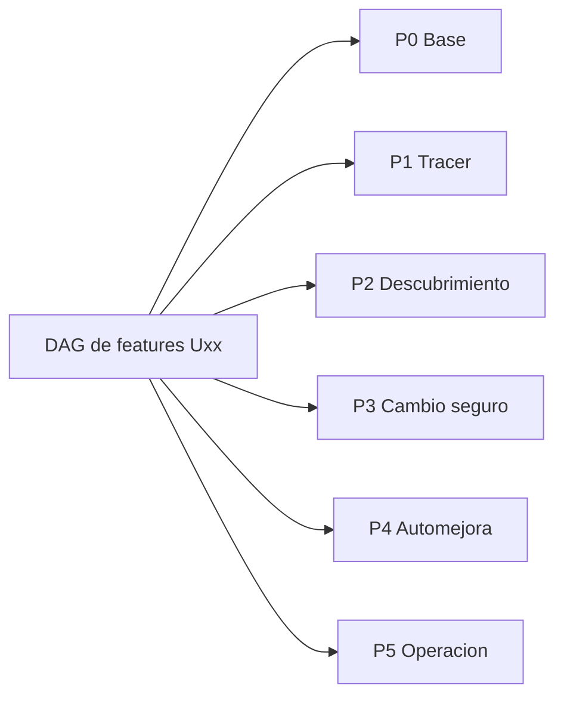

Las ramas laterales avanzan por capacidades disponibles: no bloquean esperando “todo backend”, pero tampoco integran sobre contratos imaginarios. P0 no define todos los schemas futuros: fija sólo los que necesita el primer recorrido; cada contrato adicional se congela antes de despachar sus consumidores. Autorización, aislamiento, presupuesto y eventos materiales no se posponen a P5.

Este primer dibujo es una vista de hitos, no dependencias de implementación. §§30.8/30.9 sustituyen el despacho por familias/fases: tabla Uxx normativa y grafo funcional, sin UI→detector ni fase completa→todas las features siguientes.

### 30.2 Organización de agentes y trabajo aislado

| Rol | Responsabilidad | No puede hacer |
|---|---|---|
| Coordinador | Inventario, DAG, contratos vigentes, asignaciones, evidencias y blockers | Cambiar alcance silenciosamente o dar por terminada una dependencia por intención |
| Implementador de paquete | TDD vertical, código/tests/docs en su área y entrega contra commit concreto | Modificar contratos compartidos sin acordar consumidores o editar otro worktree |
| Integrador de fase | Reunir commits compatibles, ejecutar integración/E2E/chaos del grupo, resolver fronteras mediante paquetes sucesores | Autorevisar adversarialmente sus cambios ni reemplazar suites por mocks |
| Revisor independiente | Intentar romper comportamiento, seguridad, datos, performance o UX; emitir hallazgo reproducible | Aprobar por leer un resumen del autor sin inspeccionar diff/contratos/tests |

Con cuatro slots, operar normalmente con coordinador/integrador + dos implementadores + un revisor; el rol coordinador puede recaer en el integrador para ese grupo, nunca en sus implementadores. Si se usan tres implementadores, la revisión corre después liberando slots. No multiplicar agentes esperando la misma dependencia; suspender paquetes bloqueados y avanzar otra rama lista.

Cada paquete usa branch/worktree Git propio y scope de archivos declarado. Shared schemas, migrations y lockfiles tienen un owner a la vez; los demás solicitan cambio de contrato, no resuelven conflictos a ciegas. DBs/schema de test, buckets/prefijos, puertos y Compose project se aíslan por worktree/run de test. No se comparten datos mutables ni una DuckDB entre agentes. Snapshot original sólo readonly; secretos fuera de Git. PRs/revisiones se fijan a head SHA; cualquier corrección posterior invalida aprobación del diff anterior y requiere recheck pertinente.

El test_namespace identifica Compose project, databases Pulso/Core/eval, prefijos/buckets, labels y scratch; preferir DBs Core separadas a asumir soporte de search_path custom. Cleanup opera sólo sobre allowlist de recursos etiquetados y paths absolutos verificados del paquete: nunca reset de DB ni eliminación de volúmenes compartidos. Tests de concurrencia/cuota comparten deliberadamente un scope dentro de su grupo aislado para probar contención, no entre paquetes ajenos.

### 30.3 Vista resumida de familias y cobertura, no unidades de despacho

| Hito | Familias de trabajo y especialidad | Recorrido de aceptación; dependencias funcionales en §30.8 |
|---|---|---|
| **P0 Base mínima** | P0-A backend: artifact/ref/head + primer snapshot consultable. P0-B engine-local: Compose PG/S3, doctor y CI mínima autocontenida. P0-C contratos/docs: fixtures iniciales, pin Core y glosario/owners | Contratos mínimos primero; A/B después en paralelo. Gate: clone limpio del motor → doctor → crear/leer snapshot readonly y evidencia durable. Cubre inicio S0/AC-A; no crear todos los módulos antes del primer test |
| **P1 Tracer técnico** | P1-A backend: trigger/job/event/quota/claim y comandos. P1-B AI: bridge/Core task bootstrap/pin + integración externa y Jev. P1-C data/sandbox: extracto DuckDB, sesiones y QueryResult. P1-D front/o11y: lista/timeline por API | A usa P0; B/C pueden trabajar con fixtures del contrato, después se conectan al job real. D arranca sobre API fijada, valida luego backend real. Gate: snapshot → trigger automático → task Core → query adaptativa → receipt → timeline, con permisos y presupuesto. Inicia S1/S2/S6 y AC-A/B/C; parte contractual/local de E18, cierre AWS/CD en P5 |
| **P2 Hallazgo explicable** | P2-A data: sensores multi-familia/perfiles original/E0 y cortes. P2-B AI: scout/verifier y fuerza de evidencia; eligibility final en P3. P2-C memoria: wiki efímera, publicación CAS y revocación. P2-D front: expediente/evidencia/unknown | El hito reúne el tracer y las features de descubrimiento listas. A alimenta B; C se desarrolla con fixtures y se integra sin final leakage. Gate: entrada alterada cambia soporte; hallazgo/refutación y memoria trazables, sin Queja/signal esperado hardcodeado. Cubre S3/F6, E0-A/B/E y comienzo AC-F |
| **P3 Cambio evaluable** | P3-A AI/backend: alternativas/bridge/compiler + writer registry. P3-B eval/data: ScenarioFactory/oracle/baseline/pares y harness. P3-C engine-local: aislamiento real del simulador/broker y CI contract; AWS autorizado anticipado o en P5. P3-D front: diff y dos gates | Baseline/oracles B se sellan antes de candidatos A; B puede comenzar desde P1 con fixtures, sin ver resultados del candidato. Gate: oportunidad elegible → draft autorizado → candidate congelado → native + ImprovementEvidence, incluida prueba fail/unsafe/infra. Cubre S4/S5, AC-D/E y E0-D |
| **P4 Automejora E2E** | P4-A integración backend: scheduler/registry/humano/simulador. P4-B data/eval: frozen/continuous y feedback temporal. P4-C AI/memoria: aprender/refutar y candidato evolutivo sin cambiar juez. P4-D front: ciclo completo y controles debug | El hito reúne features de descubrimiento/cambio integradas. Gate: detección autónoma → propuesta → evaluación → espera humana → publicación staging/ack simulado → nuevo evento → segunda iteración con memoria, sin intervención para forzar hallazgo. Cubre S6/S7, AC-F y E0-C/E |
| **P5 Entrega robusta** | P5-A infra: Terraform/CD/staging/rollback. P5-B performance/security: carga, fairness, fallos y retención. P5-C docs/UX: runbooks, accesibilidad, onboarding y checklist de entrega | Terraform empieza con su esqueleto independiente en P0 y se completa aquí; el stack de integración del motor ya vive en `improvement-engine`. Gate: tercero reproduce stack; chaos/carga con límites medidos; plan/smoke AWS y deploy sólo autorizados; documentación concordante. Cubre S8 y todas las regresiones críticas |

Los paquetes D de frontend son pequeños incrementos del mismo producto interno, no equipos esperando UI completa. No se implementan F7/F8 ni canary real para completar P4. Core registry mock fiel sirve cuando falta conexión, pero integración real y mock se etiquetan y verifican por separado; un mock no acredita smoke Core.

**Subgates P3 sin circularidad:** A1 entrega bridge, alternativas y objetivo/outcome propuesto, todavía sin candidato; B1 fija baseline/oracle/EvaluationPlan independiente; A2 construye y escribe el candidato; B2 ejecuta y compara. Queda permitido investigar alternativas antes de B1, no seleccionar baseline después de ver resultados. P3-C exige primero simulador stateful/aislamiento local y contrato broker; mailbox/IAM AWS reales se verifican en P5 o anticipadamente sólo con autorización. AWS no bloquea el tracer local P1 ni el gate local P3, y LocalStack no acredita seguridad IAM.

La cobertura S/AC/E0/E citada en fases es incremental: matriz por requisito registra planned/partial/passed con test/head/entorno. P1 inicia AC-B/C y la parte contractual/local de E18; detección/verificación completa se cierra en P2 y E18 AWS/CD en P5. Un primer uso de la capacidad no marca toda su suite como pasada.

**Adiciones transversales desde el inicio:** P0 fija scope/lineage/cutoff de memoria y fixtures mínimos de permisos; P1 incorpora un caso replay con reloj/corte y tests que deniegan labels/final/eventos futuros, además de cerrar E0-A incrementalmente. El replay no aparece por primera vez en P4: allí se completan ambos protocolos y corpus. P3 comienza con un escenario y un cambio ejecutables antes de ampliar suites/batches. El implementador P3-A no modifica los oracles ni gates de P3-B para conseguir aprobación; baseline y juez se mantienen externos al candidato.

### 30.4 Ejemplos de primer RED por familia; catálogo asignable en §30.8

| Paquete | Caso independiente / primer test RED | Negativo o regresión obligatoria |
|---|---|---|
| P0-A | Crear snapshot y recuperarlo con los mismos digests | Bytes originales iguales; revisión/tenant inválidos rechazados |
| P0-B | doctor identifica dependencia ausente y arranque la recupera | Segundo arranque idempotente; sin secretos en imagen/logs |
| P1-A | Dos triggers equivalentes crean un solo trabajo lógico | Dos configs no duplican presupuesto; claim/pausa y lease perdido |
| P1-B | Invocar etapa fijada devuelve receipt ligado al CoreRun | POST simultáneo y crash antes de commit no duplican efectos; pin/rol inválido |
| P1-C | Segunda query usa scratch creado por primera en la misma sesión | IO externo/source write/cross-session denegados; replay key conflictiva |
| P1-D | Un evento durable aparece tras refrescar/reconectar | SSE duplicado/purgado, OTel caído y acceso tenant ajeno |
| P2-A/B | Detectar/refutar patrón desde evidencia y config sellada | Labels/final invisibles; missing/mezcla/temporalidad no se llaman causa |
| P2-C | Dos diffs del mismo head no sobrescriben aprendizaje | Rebase, tombstone tras restore, memoria futura invisible en replay |
| P3-A | Cambios aprobados por compiler crean draft compatible | Modelo cambia payload después del compiler: denied sin write |
| P3-B | Comparar ambos brazos con mismo universo/oracle y banco separado | Unknown desigual no fabrica mejora; baseline post hoc y unsafe bloquean |
| P3-C | Acción real en sandbox se verifica por estado/receipt | Task A no lee B; revocación y URL residual se distinguen |
| P4-A | Sin humano queda evaluated; humano autorizado publica staging | Timeout no significa publish; staging stale exige reevaluación |
| P4-B/C | Evento posterior disponible genera aprendizaje y nuevo run | Frozen no aprende; candidato no cambia juez ni final; no se aprende dos veces |
| P5-A/B/C | Clone limpio reproduce caso y rollback autorizado | Fallo de migración/collector/provider, carga/fairness, permisos y teclado |

Éstos son puntos de arranque, no suites completas escritas anticipadamente. Cada paquete añade uno a uno los escenarios del spec aplicables y mantiene un índice de cobertura a S/AC/E0/E/C. No se inventa un “agente pass” para sustituir el oracle ni una demo guionada para acreditar descubrimiento autónomo.

### 30.5 Contrato de entrega e integración de un paquete

**Disciplina GitHub obligatoria (engine e infra).** Cada corte implementable se trabaja en una feature branch (`feat/Uxx-descripcion`, `fix/Uxx-descripcion` o `docs/descripcion`), nunca directamente en `main`; agentes concurrentes usan worktrees aislados. `main` se protege con PR obligatorio, checks de CI requeridos y aprobación independiente; sin force-push ni bypass rutinario. TDD y revisión adversarial siguen siendo gates, no se sustituyen por una aprobación superficial del PR.

Los PRs son pequeños, frecuentes y cohesionados alrededor de un comportamiento verificable: objetivo/Uxx, alcance, dependencias, evidencia RED→GREEN, regresiones y documentación aplicable. No acumular una fase completa para un único merge; no fragmentar arbitrariamente un cambio inseparable. El integrador verifica el head vigente y sus checks antes de cada merge; cambios incompatibles se entregan con estrategia expand/contract o permanecen sin integrar hasta ser seguros. `main` debe quedar verificable tras cada merge.

Commits claros y trazables: `feat(scope): comportamiento`, `fix(scope): causa resuelta`, `test(scope): escenario` o `docs(scope): decisión`, vinculados a la unidad de trabajo. Versiones de código con tags SemVer por repositorio (`v0.x.y` durante desarrollo), inmutables, sobre commits integrados y validados; cada hito entregable incluye release notes, SHA y estado de validación. No crear un tag por commit ni confundir tags de código con versiones de contratos, configuración o artefactos de automejora. Engine e infra pueden versionarse independientemente; el manifest de despliegue fija sus SHAs/tags y digests compatibles. Antes de implementar S0 se añaden las protecciones, CI y plantilla de PR; esta sección no autoriza crear repos, publicar tags o hacer merges ahora.

Antes de asignar: ID, objetivo/caso de uso, entradas/salidas/versiones, prerequisitos con SHA, área exclusiva, tests prioritarios, presupuesto/fixtures y reviewer. Si un contrato no existe, su pequeño corte de definición/round-trip es dependencia, no libertad de inventarlo en dos ramas.

Entrega: commits/PR head, interfaces afectadas, comando y evidencia RED del primer comportamiento, comandos y resultados GREEN/unit/contract/integration/regression pertinentes, fixtures/digests, migraciones/compatibilidad, limitaciones, docs/ADR/bitácora y riesgos. “Tests pasan” sin comando/head/entorno no es evidencia. Logs adjuntos tratados, nunca CSV/PII/secretos. Test skipped/recorded/live se distinguen explícitamente.

Los IDs P*-* son familias asignables, no autorización para un ticket gigante: si una familia cambia varios contratos o requiere más de un recorrido independiente, se divide en hijos con IDs estables y gate propio (por ejemplo, integración externa de modelos, bootstrap task y decisión Jev dentro de P1-B). Cada hijo conserva test RED y entrega verificable; comparte el integrador de fase. El backlog se concreta progresivamente desde estas familias, sin abrir issues externos por editar este plan.

Integrador incorpora una rama a la vez, corre pruebas de fronteras y el recorrido del grupo contra dependencias reales. Crea paquetes correctivos pequeños para fallos, no reescribe todo el trabajo ajeno. Escribir el siguiente test de integración rojo forma parte del TDD del integrador: no esconder errores de acoplamiento cambiando expectativas. Merge de código y aprobación de una release bancaria son autoridades distintas.

### 30.6 Revisión adversarial y gate de fase

Al cerrar cada fase, asignar al menos dos focos independientes según riesgo; antes de P4/P5 cubrir todos: backend/concurrencia, AI/primitivas Core, data/leakage/oracles, infra/seguridad/egreso, performance/índices/N×M, testing/regresión y frontend/UX/accesibilidad. P0 revisa contratos/privacidad/bootstrap; P1 efectos/presupuesto/sandbox; P2 evidencia/memoria; P3 evaluación/authoring; P4 autonomía/integración; P5 operación/entrega. Los revisores inspeccionan implementación/tests y reproducción, no sólo el spec.

Triage: P0/P1 de seguridad/datos/efectos o correctness bloquean cierre; otros se resuelven o se difieren sólo con riesgo/owner/justificación explícitos sin violar aceptación. Autor corrige mediante nuevo ciclo RED→GREEN; revisor independiente revalida el head nuevo. Integrador repite suite del grupo tras cada corrección de frontera. No cerrar con un blocker conocido o un test crítico skipped.

Gate de fase: paquetes integrados contra contratos vigentes + prueba observable conjunta + regresiones pertinentes verdes + revisión independiente resuelta + documentación/bitácora actualizadas. Una feature puede estar verde aislada y el grupo rojo integrado; no declarar ese hito entregado. Otra feature puede avanzar si sus propias dependencias están verificadas: no exigir cierre global de una fase lateral. Nunca ejecutar sobre dependencia insegura sólo porque existe fixture/diseño.

### 30.7 Secuencia práctica y criterios de eficiencia

1. Tras aprobación, S0 confirma repos/tracker/labels/domain docs y configura instrucciones de agentes; no crear esas convenciones sin decisión del usuario. Primer backlog son los paquetes P0 y el tracer P1, no cientos de tickets especulativos.
2. Mantener máximo dos o tres implementaciones activas por integrador; despachar por dependencias y área exclusiva, no por cantidad de agentes disponible. Infra/test fixtures/oracles/UI contract permiten trabajo paralelo real.
3. Integrar temprano cada comportamiento probado; contratos mínimos y fixtures compartidos aceleran sin aprobar capacidades simuladas como reales. Construir first-pass Core determinístico antes del smoke Jev/LLM; budget/privacidad deben estar verdes antes de llamadas live.
4. Tras cada fase, actualizar matriz de cobertura y bitácora con tiempos observados, blockers y revisiones. Ajustar tamaño de paquetes por aprendizaje, manteniendo aceptación/alcance. No prometer calendario o speedup sin medir.
5. Detener paquete ante contrato incompatible, fuente/permiso faltante, riesgo de fuga, efecto unknown o presupuesto agotado. Registrar estado y condición de reanudación; seguir otra rama independiente, no aflojar el gate para mantener agentes ocupados.

**Definition of Done del plan:** el equipo puede asignar cada paquete, conocer su dependencia y primer RED, integrar el grupo con otro agente y verificar su cierre sin reconstruir la conversación. **Definition of Done del producto** sigue §§11/12/26: descubrimiento y mejora autónomos observables, con seguridad, datos y evidencias; esta sección no los rebaja a scaffolding o mocks verdes.

### 30.8 Catálogo bottom-up: features, historias y casos independientes

**Unidad de asignación vigente = Uxx, no una fase ni una familia P*-*.** Las familias de §§30.3/30.4 son vistas resumidas de cobertura; este catálogo y sus dependencias determinan el despacho. Independiente significa que tiene comportamiento, entrada/salida y aceptación propios después de sus prerequisitos, no que carezca de dependencias. Cada unidad empieza por el UC positivo de la tabla, luego negativos/regresiones uno a uno. Ampliaciones a nuevos sensores, paneles o rutas se asignan como sucesores con ID, contrato y gate, no crecen silenciosamente dentro de un paquete.

| ID / feature | HU y primer UC/RED observable | Dependencias duras | Handoff y negativo requerido |
|---|---|---|---|
| U01 Entorno mínimo — habilitador | Como desarrollador, levanto PG/S3 y doctor identifica setup inválido | — | CI/Compose/pin/contratos mínimos; segundo arranque y secretos seguros |
| U02 Revisiones durables | Como motor, publico/leo un artefacto y avanzo head por CAS | U01 | ArtifactRef/head/digest; cross-tenant y revisión stale rechazados |
| U03 Snapshot original | Como motor, registro una fuente original y reproduzco su manifest | U02 | SourceSnapshot/quality; bytes originales intactos |
| U04 Adapter E0 | Como motor, registro E0 conservando namespace y procedencia | U02 | Manifest/clocks/vistas; signal/labels no disponibles al investigador |
| U05 Cuota y grant | Como motor, reservo presupuesto autorizado en una ventana global | U02 | QuotaReceipt/grant; config nueva no reinicia saldo |
| U06 Trabajo durable | Como motor, dos triggers equivalentes producen un job ejecutable | U02, U05 | JobRef/lease/reducer; restart y fencing no duplican efectos |
| U07 Actividad por API | Como ingeniero, consulto eventos de un run y recupero cursor | U06 | Read model/SSE; cursor purgado y tenant ajeno |
| U08 Lab local adaptativo | Como investigador, hago dos queries dependientes con scratch aislado | U03, U05, U06 | QueryResult/Receipt/session; IO externo y source write denegados |
| U09 Core task determinista | Como motor, ejecuto una etapa fijada y recupero su receipt | U02, U05, U06 | Binding/receipt/pin; concurrente/crash→unknown sin segundo efecto |
| U10 Integración modelos externos | Como consumidor autorizado, genero una respuesta con receipt y presupuesto | U05, U06 | ModelReceipt/usage/schema; grant inválido y costo unknown; no requiere scout |
| U11 Decisión Jev | Como motor, ejecuto decide tipado y ruta de baja confianza | U05, U09 | DecisionReceipt/Flow/calibración; enum/schema inválidos |
| U12 Sensor determinista | Como analista, calculo señal reproducible con denominador y faltantes | U03, U06, U08 | Signal/QueryReceipts; evidencia alterada cambia resultado |
| U13 Investigación scout | Como motor, exploro una señal sellada y produzco hipótesis no autoritativas | U08, U09, U10, U12 | `DeterministicSignal` valida su digest y cada campo de fuente/métrica/numerador/denominador/contract/transform/cutoff contra QueryReceipts. Core y modelo presentan receipts verificados, ligados al mismo tenant/job/grant/attempt/input/policy/capability/evidencia. Cualquier tamper, replay cross-scope, input/policy distinto o outcome no exitoso bloquea drafts. HypothesisSet conserva commitments de señal/fuente/recibos; lectura/grant fuera de scope rechazada |
| U14 Verificación independiente | Como motor, refuto o sostengo hipótesis con checks y Jev | U11, U13 | VerificationReport/strength; correlación no se etiqueta causa |
| U15 Wiki montada | Como investigador, leo/transformo una wiki autorizada en scratch | U02, U05 | Snapshot/diff; path traversal y memoria futura denegados |
| U16 Mecanismo y alternativas | Como motor, convierto sólo evidencia U14 en un bridge provisional y alternativas | U14 | `VerificationReport` + input validado → `WorkflowBridge`; `do_nothing` siempre existe; `supported` llega como máximo a `mechanism_proxy`, `refuted` queda `unlinked`, `uncertain` queda `not_evaluable`. No `ChangeSpec`, runtime Core, persistencia ni eligibility final |
| U17 Compiler | Como constructor, convierto cambio autorizado en EntityDraft válido | U16, U35 | Drafts/closure/digests; entidad o permiso incompatible rechazados |
| U18 Writer registry | Como constructor, guardo/congelo exactamente el payload autorizado | U09, U17 | Proposal/Candidate receipts; cambio LLM después de compiler denegado |
| U19 Evaluación nativa | Como evaluador, ejecuto un escenario Core real en sandbox | U09, U18, U20, U26 | EvalRun/hash/suite; fail/infra diferenciados y registry operativo intacto |
| U20 Plan sellado | Como evaluador, fijo baseline/oracle/métrica antes del candidato | U16, U26 | BaselineSelectionReceipt/EvaluationPlan/OracleRef y NativeSuiteSpec o ref publicada exacta; post hoc bloqueado |
| U21 Autoridad/publicación | Como aprobador, publico staging sólo con ambos gates y step-up | U19, U27 | Decision/Release receipt; sin humano o timeout no confirma éxito |
| U22 Segunda iteración | Como motor, evento de plataforma ingerido dispara otra investigación usando aprendizaje | U13, U14, U21, U29, U33 | Run sucesor/MemoryUseReceipt; no autovalidación ni doble aprendizaje |
| U23 Replay E0 | Como evaluador, reproduzco frozen/prequential con versiones preaprobadas | U04, U09, U20-E, U27, U33 | CampaignManifest/coverage; futuro invisible y resume sin doble puntuación |
| U24 Consola de lectura | Como ingeniero, veo lista/timeline y estado real sin shell | U07 | UI conectada/API; fixtures sólo acreditan componentes, no integración |
| U25 Despliegue por manifest | Como operador, despliego una imagen aprobada y recupero la anterior | U01, U09 | Terraform/bootstrap/CD/smoke; OIDC y rollback; autorización AWS externa |
| U26 Banco sandbox stateful | Como evaluador, una acción cambia estado y se verifica por readback | U01, U02 | SandboxPort/executor/reset; namespace ajeno y estado entre brazos |
| U27 Comparación Pulso | Como evaluador, comparo pares comunes sin fabricar mejora | U09, U18, U20, U26 | ImprovementEvidence; unsafe y unknown desigual bloquean |
| U28 Sesión AWS | Como investigador, ejecuto lab remoto con grants por objeto | U08, U25 | Session/mailbox/QueryResult; IAM/TTL/escape reales, no LocalStack como prueba |
| U29 Observaciones de plataforma | Como motor, ingiero evento durable de atención una vez | U02, U06 | Observation/cursor/coverage; sampled OTel no es denominador |
| U30 Sensor de plataforma | Como motor, detecto patrón por capa desde observaciones disponibles | U12, U29 | Signal por capa; evolution no se mezcla con fallos de clientes |
| U31 Evolución del detector | Como motor, propongo mejorar mis propios artefactos con juez externo | U19, U20, U22, U27 | Proposal target_system=evolution; guardrails/juez no alterados |
| U32 Diagnóstico SQL | Como ingeniero, inspecciono resultado tratado de una query | U24, U08 | Panel query por contrato/refs; redacción y dependencias degradadas |
| U33 Memoria publicada | Como motor, publico un diff por CAS y luego lo revoco | U02, U15 | MemorySnapshot/receipt/tombstone; rebase/restore sin fuga |
| U34 Control de run | Como operador, solicito pausa/cancel y veo estado verdadero | U06, U07 | El comando usa el mismo estado durable, versión esperada y fence de U06; no mantiene un registro paralelo reescribible. Receipt incluye target, estado solicitado/confirmado, revisión y tiempo. Efecto incierto nunca se llama cancelled; carreras unknown-after-read, re-registro y colisión cross-tenant se rechazan |
| U35 Elegibilidad final | Como motor, autorizo construir sólo con evidencia, bridge y plan listos | U14, U16, U20 | eligible_for_proposal/razones; oracle ausente bloquea aunque bridge provisional exista |
| U36 Identidad sandbox | Como evaluador, verifico identidad y deniego acción sensible sin evidencia vigente | U04, U26 | Fixture/executor boundary, policy/question digests; nunca respuestas en ModelPort; sin servicio bancario nuevo |

**Variantes y sucesores con prerequisitos exactos:** son unidades asignables distintas, no aceptación implícita del primer corte de su familia.

| ID / feature | HU y primer UC/RED | Dependencias duras | Handoff y negativo |
|---|---|---|---|
| U08-E Lab E0 | Consulto extracto E0 disponible al reloj sin labels/futuro | U08, U04 | QueryResult E0; join posterior bloqueado |
| U12-E Sensor E0 | Calculo soporte descriptivo sobre contexto E0 real | U12, U08-E | Signal perfil E0; no exige n del histórico |
| U20-E Oracle E0 de seguridad | Como evaluador, sello reglas identidad/canal/abono/regulador antes del candidato | U04, U20, U36 | Policy/oracle/suite refs; expected_identity_check privado y fallo unsafe |
| U22-E Iteración desde E0 | Evento E0 disponible dispara aprendizaje por ingesta/replay real | U04, U12-E, U13, U14, U21, U23, U33 | Run/MemoryUseReceipt; no requiere fuente plataforma U29 |
| U23-A Continuous con activación | Propuesta E0 pasa gates y aprobación antes de usar versión nueva | U23, U19, U21, U22-E | CampaignReceipt; cambio no aprobado nunca se activa |
| U32-M Detalle modelos | Inspecciono llamadas externas LLM/Jev vía Core y sus receipts | U24, U10, U11 | Panel modelos; payload redactado/dependencia caída |
| U32-V Detalle evaluación | Inspecciono candidato y los dos gates separados | U24, U19, U27 | Panel eval; pass nativo no sustituye mejora |
| U32-W Detalle memoria | Inspecciono head/diff/CAS/revocación | U24, U33 | Panel memoria; permisos no amplían acceso |
| U34-F Fork original | Reproduzco otra corrida sin mutar evidencia histórica | U34, U03, U09, U15, U33 | Run nuevo/replay_of; snapshot revocado rechazado |
| U34-FE Fork E0 | Reproduzco E0 con reloj y memoria permitidos | U34-F, U04, U23 | Run nuevo E0; final/futuro inaccesibles |

U05 incluye vigencia/revocación de grants y U06 reducer/run_control/fencing antes de U09/U18. U34 entrega comandos públicos y estado al operador, no introduce por primera vez esos controles de seguridad. U25 acepta manifest mínimo Core determinista; un manifest con modelos externos/Jev/UI/lab añade las dependencias U10/U11/U24/U08 pertinentes. Readiness se verifica por componente seleccionado, no se marca full-stack probado por desplegar sólo Core.

U16 no consume eligible_for_proposal final ni exige que U20 exista: entrega hipótesis de mecanismo/objetivo. U20 sella oracle/baseline y suite; U35 calcula el predicado final antes de U17. El builder sólo obtiene refs/readiness y plan permitido, nunca casos/oracles final_locked. U17 compila también el draft registry kind `eval_suite` vigente cuando la suite no está publicada; U18 lo guarda/congela con el candidato y U19 consume ref/digest exactos. No agregar suite ad hoc después del freeze ni inventar que eval_suite es EntityKind runtime. Tests fijan agent_id/paridad de suite y cambio de hash ante cambio de contenido.

U23 es runner de medición sobre manifest/versions preaprobadas, no prueba publicación autónoma. U23-A acredita la integración de aprendizaje y activación autorizada. U22/U22-E usan sus adapters de entrada reales; llamar directamente al scheduler no prueba el UC evento→aprendizaje.

Para el paquete E0 0.5.1, U04 añade identity_check/timeline, parseo de questions y text_source; U08-E aplica cutoff de started/ended. U36 es capacidad del banco sandbox existente U26, no construcción de auth de la plataforma F7/F8. U20-E entrega fixtures negativos ausentes en histórico y fija políticas/preguntas por digest. U23 sólo acepta E0 bajo ese oracle; el despacho de campaña E0 añade readiness U20-E al gate U35 antes de compiler/writer/evaluación, aunque las implementaciones genéricas se desarrollen con fixtures originales; las campañas originales mantienen U20 sin requerir la muestra E0. Descubrimiento no recibe labels ni respuestas correctas, ni modifica policies para mejorar la tasa aparente.

U01 es excepción habilitadora pequeña, no feature bancaria; no exige todos los schemas ni AWS. U03/U04 son adapters hermanos. U08/U12 tienen variante E0 que añade U04 y los contratos/cutoffs de ese adapter; original-only no espera E0. El primer corte temporal de U04/U08 se prueba temprano, aunque U23 complete los protocolos al final. U15/U33 se pueden construir con fixtures autorizados sin esperar scout; sólo U22 demuestra aprendizaje integrado.

U17 depende del **plan de negocio sellado** U20 para crear el candidato de una campaña; el validador genérico del compiler puede prepararse con fixtures antes. U20 consume mecanismo U16, no resultados U17/U19/U27: no hay circularidad. U10 valida integración externa independiente; U09 arranca sin modelos y U13 reúne ambos. U25 depende de runtime mínimo por manifest, no de publicación bancaria U21; el despliegue no habilita ni elude sus gates.

**Diferenciar construcción de consumo integrado:** UI puede desarrollar componentes contra fixtures desde U01, pero U24 sólo se acepta contra U07 real. Oracle/harness puede desarrollar fixtures desde U26, pero U20 debe sellar objetivo/plan específico desde U16 y U19 debe ejecutar candidato real. Preparación paralela no equivale a dependencia cumplida ni a feature entregada.

### 30.9 Grafo funcional y agrupaciones de aceptación

Las aristas de este DAG son funcionales; la tabla de dependencias completa es normativa. El dibujo muestra el camino principal y ramas para lectura, sin afirmar que una UI habilita detección.

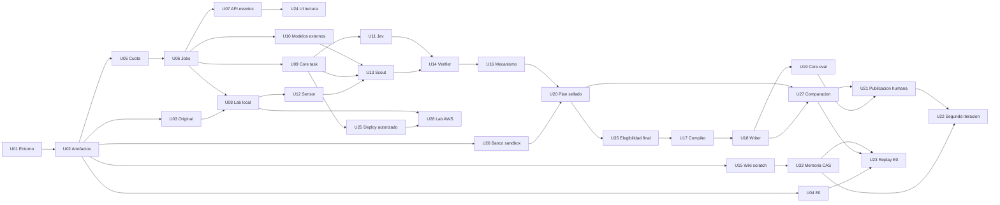

**Despacho:** unidad lista cuando sus prerequisitos concretos están integrados/revisados, contrato fijado y scope libre. No exigir “toda P1” para iniciar una unidad de P2 ni detener el motor por UI/AWS pendientes. Seguridad/permiso/cuota siguen siendo prerequisitos duros de la operación correspondiente. Las fases son hitos de aceptación del conjunto, no aristas adicionales al DAG.

| Hito/fase | Features que reúne el integrador | Recorrido de aceptación y paralelismo |
|---|---|---|
| P0 Base | U01, U02 y primer corte U03 | Clone→doctor→snapshot durable; U04/U05/U15/U26 pueden avanzar al tener U02, sin esperar fuentes completas |
| P1 Tracer | U03, U05–U11, U07/U24 mínimo y primer corte U04 | Source→job→Core→lab→receipt→UI; U08/U09/U10 hermanos tras sus prerequisitos, no un único paquete runtime |
| P2 Descubrimiento | U12–U16, U15/U33, U29/U30; U08-E/U12-E para E0 y UI de evidencia | Señal→investigación→verificación→bridge; memoria/banco/oracles avanzan lateralmente; detector funciona sin UI |
| P3 Cambio seguro | U16–U20, U26/U27/U35 y U32-V para UI de gates; U36/U20-E para E0 | Mecanismo→plan sellado→candidate→dos gates; integra A1/B1/A2/B2, no asigna builder y juez al mismo autor |
| P4 Automejora | U21–U23, U31/U33/U34, U32/U32-M/U32-V/U32-W; U22-E/U23-A para automejora E0 | Espera humana→staging→evento→memoria→nuevo run, reflexividad y replay temporal; publicación no se finge exposición real |
| P5 Operación | U25/U28, U32/U32-M/U32-V/U32-W, U34/U34-F y U34-FE para E0; carga/chaos/restore/a11y | Stack reproducible, permisos/smoke AWS autorizados y rollback; trabajo infra comienza antes, no bloquea la demostración local |

Validaciones de carga, seguridad, accesibilidad, retención y restore son paquetes de calidad transversales con owner/test/gate propios, no features que se inventan para rellenar una fase. U32 comienza por un tipo de detalle y añade los demás como sucesores; U34 primero pausa y después cancel/fork-replay como hijos con tests separados. Los grupos de frontend no convierten todas las capacidades de un panel en una única historia.

Cada integrador publica matriz Uxx→UC→test→head/entorno→resultado y cobertura S/AC/E0/E/C. Sólo declare passed para la aceptación realmente ejecutada. Revisores independientes comprueban tanto unidades como recorrido del grupo; los hallazgos de acoplamiento generan otro RED de integración. Las agrupaciones no sustituyen contrato de entrega ni disciplina de §§30.1/30.2/30.5/30.6.

**Ownership para asignación:** `improvement-engine` posee U01 (bootstrap, Compose, PG CI y doctor locales), además de backend U02/U05/U06/U07/U29/U34; data U03/U04/U08/U12/U30 y variantes E0; AI/runtime U09/U10/U11/U13/U14/U16/U17/U18/U31; memoria U15/U33; evaluación independiente U19/U20/U20-E/U23/U26/U27/U35/U36 y U23-A; integración funcional U21/U22/U22-E; frontend U24/U32 y paneles sucesores. `infra` posee U25/U28: Terraform y los contratos AWS, sin fixtures, Compose ni CI local del motor. Son roles, no personas permanentes: cada despacho fija un implementador, integrador y reviewers distintos, con área exclusiva. Backend conserva owner de migrations incluso si una feature data/AI las necesita. Builder U17/U18 nunca es autor de U20/U27/U35 ni altera su gate para cerrar un test.

No aceptar implícitamente variantes: “original-only” puede cerrar sus recorridos, pero el DoD del producto con E0 exige las unidades E0 enumeradas. Una entrega local puede estar aceptada mientras AWS sigue blocked por autoridad, sin llamarse desplegada. El script `docs/validation/Test-ImplementationDag.ps1` comprueba IDs/dependencias/ciclos del catálogo, no semántica, implementación, cobertura ni seguridad; las revisiones y pruebas de cada grupo siguen obligatorias.
