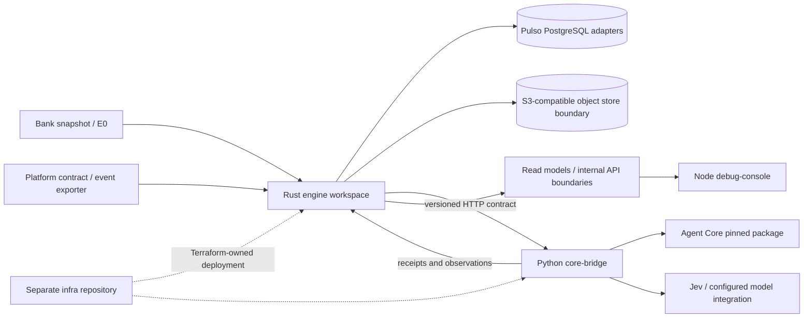

# 01 — Product boundary and runtime map

## Purpose

This chapter answers the first implementation question for a new contributor: which system owns each behavior, which processes make up the engine, and which connections are already executable. It does not describe the customer-support platform as if Pulso implemented it.

## Product boundary

Pulso Improvement Engine analyzes historical/source and operational evidence, investigates recurring patterns, assembles proposals as native service-capability artifacts, evaluates candidates, and records governed decisions and evidence. It is not the runtime that answers customers, authenticates bank customers, or performs account operations.

The neighboring responsibilities are distinct:

| Responsibility | Owner | Engine relationship |
|---|---|---|
| Customer conversations and routing across the four service layers | Customer-service platform | Supplies minimized, versioned observations; consumes approved capability changes. |
| Native agent, flow, decision-model, policy, and evaluation primitives | Agent Core | Pulso composes and proposes native artifacts through a pinned integration contract; Core validates/runs them. |
| Detection policy, source lineage, evidence, opportunity, evaluation gates, and memory governance | Improvement Engine | Implemented across Rust control/data modules and Python Core integration boundary. |
| Cloud network, identity roles, compute, managed storage/database, and infrastructure lifecycle | Sibling `infra` repository | Terraform ownership; the engine repository does not own AWS deployment resources. |
| Debugging and run visibility for the improvement system | Engine debug console/API | Internal backoffice for Pulso, not the platform's customer-facing product. |

## Runtime topology in the pinned implementation snapshot

This is a component map, **not proof that every arrow is connected in a single production-like execution**. The handbook must track connection state per edge. The bank snapshot/E0 local runner, platform event sensor tests, synthetic planted candidate flow, and Core-local smoke are distinct run paths unless a run record proves they were joined.

## Repository and process map

Paths below are anchored to `improvement-engine` `main` snapshot `2e9ccd926e43294326e2dac8e7a9af2c47da3006`.

| Module/path | Language / runtime | Owned responsibility | Evidence and limits |
|---|---|---|---|
| `crates/*` | Rust workspace | Engine domain contracts, source adapters, artifact handling, reducers, bounded query foundation, CLI/runtime components | Cargo workspace membership is Rust-only. The existence of modules does not establish the V3 daemon/E2E composition. |
| `bridge-contract/` | OpenAPI, JSON Schema, Python conformance | Versioned Rust↔Python private wire boundary, examples, generated schemas and divergence/conformance checks | The contract is product-owned; generated clients/fixtures are not by themselves live transport proof. |
| `core-bridge/src/pulso_core_runtime/` | Python 3.12, ASGI | Compose the pinned Agent Core package; private invocation, authoring, evaluation, receipts, exporter, tools and reconciliation adapters | This is integration code around external Agent Core, not another Agent OS. Verify the pin in `__init__.py`/pin module at the current revision. |
| `platform-contract/` | JSON Schema / Python tests | Versioned event and observation boundary for the neighboring service platform | Contract schema is not evidence of a live production event feed. |
| `platform-sim/` | Python | Explicit platform doubles and fault-injection scenarios | A simulated observation must remain labeled as simulated. |
| `platform-exporter/` | Python | Read-only export of platform operational records into observation batches | Exporter exists as a module; real platform access and uninterrupted production feed are separate facts. |
| `e2e-core/` | Python test driver | Drives local Core stack and records an E2E report, including real/stand-in distinctions | Its `stand-in` role must not be described as the Rust production runner. |
| `debug-console/` | Node/TypeScript | Internal backoffice UI for engine state and troubleshooting | Not the platform's customer UI; portions may depend on fixtures until the product API connection is complete. |
| `local/` | Podman Compose | Local Postgres, S3-compatible LocalStack and optional local observability backend | Definitions do not prove the host's Podman backend started or that the engine emits OTel. |
| sibling `infra/` repository | Terraform | AWS deployment foundation and infrastructure lifecycle | Terraform declarations are not an applied environment or proof of service connectivity. |

## Authority boundaries

The split is a runtime safety boundary, not just a repository organization:

| Operation/decision | Authoritative component |
|---|---|
| Source schema/digest validation; support counts; deterministic rates; query bounds; quotas; idempotency and retry state | Rust engine deterministic code and its durable adapters where implemented |
| Open-ended exploration, hypothesis generation, alternative explanations, and candidate text/artifact drafting | Scoped Agent Core/LLM task, constrained by treated inputs and typed contracts |
| Native artifact validation, execution, and registry state | External Agent Core |
| Customer identity/authorization and effects on bank-side records | Customer-service platform and its trusted identity/tooling layer |
| Approval, release, promotion, or rollback authority | Authorized human + Agent Core/platform release protocol; never model prose alone |
| Engineering run visibility and diagnosis | Engine activity/debug API and internal console |

The intended autonomy is in discovery, investigation, proposal iteration, and evaluation scheduling. It does not imply authority to directly edit the external registry or act on customer accounts.

## Connection-state matrix

The following summarizes the strongest claims supported by this snapshot. Treat an absent integration edge as a gap until a test or run record demonstrates it.

| Edge | Current state | Required proof before calling it end-to-end |
|---|---|---|
| Original/E0 snapshot → local analysis runner | `implemented` / locally documented | Re-run the named runner against an immutable source manifest; capture output digest, commit, data class, and exclusions. |
| Platform event schemas → generated event sensor tests | `implemented` / synthetic verification | Test fixtures establish detector behavior only; real exporter, cursor, persistence, and runtime wiring are separate. |
| Rust engine → Python Core bridge | `partial` | Contract conformance plus a Rust-originated invocation reaching the bridge/Core, with receipt persisted and read back. |
| Candidate → Agent Core evaluation and release | `partial` | Freeze exact candidate/baseline, run both arms, persist gate evidence, require authorized approval, obtain Core release receipt, and verify the resulting registry state. |
| Engine API → debug console | `partial` | Start both from a clean local stack; prove authenticated API queries and streamed run events match durable engine state. |
| Terraform → deployable service topology | `target`/partial foundation | Plan against configured workspace; explicitly authorized apply; health, secret, network, DB, storage, alarm and rollback checks. No deployment is implied by this handbook. |

`partial` is intentionally specific: it means some components/contracts exist, but the complete edge above has not been established by the cited evidence.

## Why the system is not one monolith or a microservice fleet

The Rust engine keeps detection/control state and lineage close to one set of tenant, version, quota, and job invariants. Python is a separate runtime boundary because Agent Core's composition surface is Python. The web console is a client/backoffice. Terraform is separated because infrastructure has a distinct ownership and lifecycle. This is a small set of processes/repositories around clear runtime requirements—not one executable and not one permanent service per pipeline stage.

V3 describes stronger durable worker, adaptive analysis sandbox, and integrated proposal/evaluation behavior than the currently demonstrated paths. Those are target semantics; do not infer them from process count or directory presence.

## Source references

- Current source snapshot: [engine README](https://github.com/pulso-factored/improvement-engine/blob/2e9ccd926e43294326e2dac8e7a9af2c47da3006/README.md)
- Current unresolved connections: [open gaps](https://github.com/pulso-factored/improvement-engine/blob/2e9ccd926e43294326e2dac8e7a9af2c47da3006/docs/gaps/OPEN_GAPS.md)
- Agent Core bridge overview: [core-bridge README](https://github.com/pulso-factored/improvement-engine/blob/2e9ccd926e43294326e2dac8e7a9af2c47da3006/core-bridge/README.md)
- Canonical target: [`TECH_SPEC_PULSO_AUTOMEJORA_V3.md`](../TECH_SPEC_PULSO_AUTOMEJORA_V3.md), especially §§1, 17, 20, 25, 27, 29, 31, and 32.
