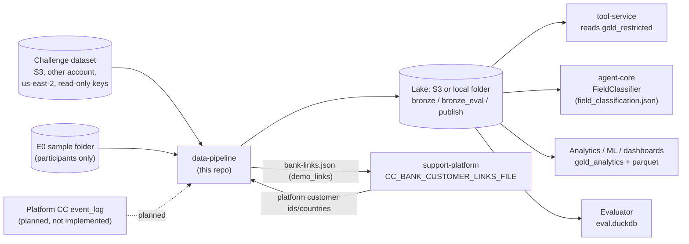
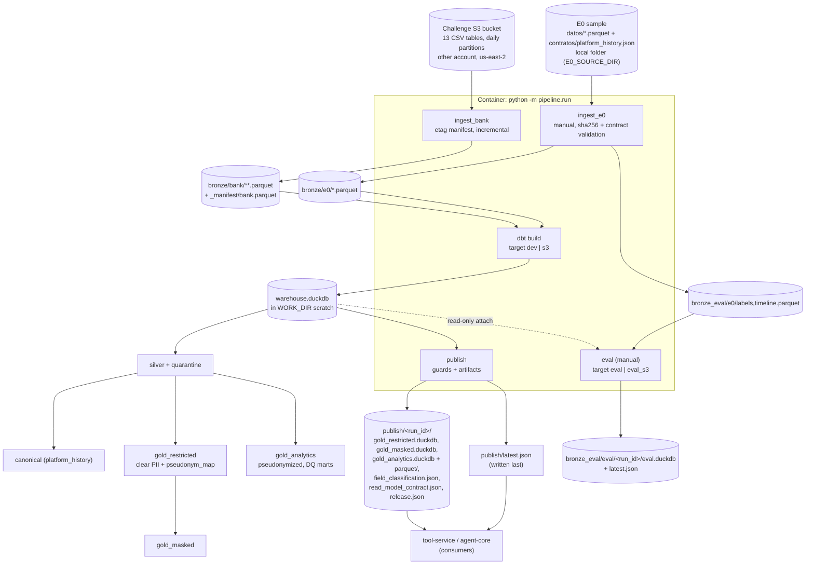
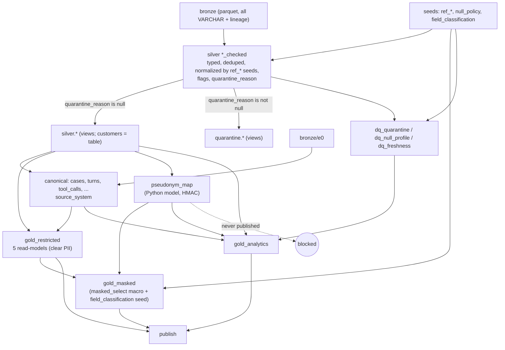
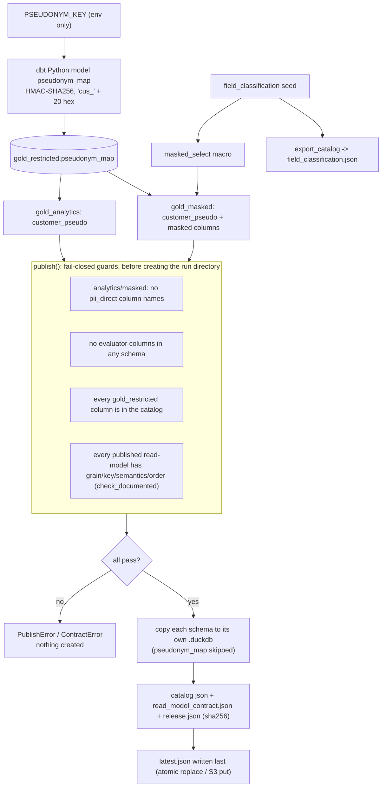
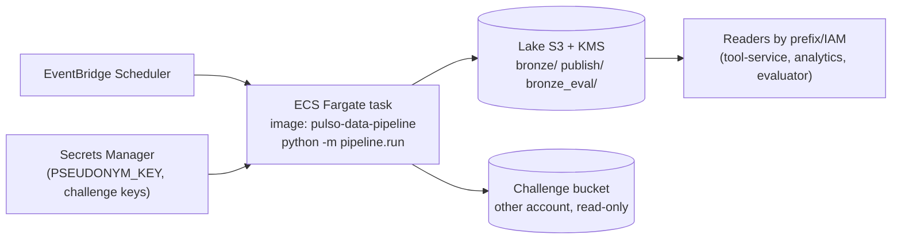

# data-pipeline: technical documentation

- Repository: https://github.com/pulso-factored/data-pipeline (local checkout: `C:\Users\JUAN\Documents\factored\data-pipeline`)
- Source of truth for this document: `origin/main` at commit **`0291edf731fa823ec449ca3890c8ac43b3c63718`** ("Merge pull request #3 from pulso-factored/fix/duckdb-memory-limits"), read through a detached worktree. The local checkout was not touched.
- Date of reading: 2026-10-05 (re-fetched before the second pass; `origin/main` was still `0291edf`).
- Convention: statements are taken from code, config, seeds and the repo's own `docs/`. Anything that could not be verified (not run, not deployed, or only claimed in prose) is marked **[NOT VERIFIED]**. The pipeline, dbt and tests were not executed to write this document (no dataset access); counts of seed rows, test files and similar were recomputed directly from the files. Numbers quoted from the repo's `docs/` (row counts, timings) are the repo's own measurements, not re-measured here.

---

## 1. Purpose and scope

An analytical pipeline (medallion architecture: bronze, silver, gold) built with dbt + DuckDB for Pulso's banking customer-service system. It delivers clean, contracted, traceable data to `agent-core` (per-customer read-models plus the `FieldClassification` catalog) and to analytics/ML. It does **not** cover transactional workloads (README).

In scope:
- Incremental ingestion of the 13 tables of the challenge dataset ("LATAM Bank", CSV in an S3 bucket in another account/region) into bronze parquet.
- Ingestion of a static sample, "E0" (11 parquet files, 2,000 dispute cases), validated against the `platform_history` contract.
- Silver typing, de-duplication, normalization (seeds), null policy, quarantine with reason.
- Canonical case model (`platform_history` v0.5.1 shape) with a `source_system` column.
- Gold: `gold_restricted` (clear PII), `gold_masked` (partially masked), `gold_analytics` (pseudonymized), plus an isolated evaluator zone (`eval`).
- Publication of immutable artifacts and a `latest.json` pointer.

Out of scope / not present:
- The Platform CC `event_log` source and the `agent-core` event consumer: planned only (`docs/00-plan-v1.md`); not implemented in code.
- `radicar_pqr` / `filed_pqrs`: owned by the tool-service, not the pipeline (`docs/03`).
- Access control: DuckDB has no roles; isolation depends on S3 prefixes/IAM declared elsewhere (infra). See section 13.

---

## 2. Architecture and data flow

### 2.1 System context



The consuming services (`tool-service`, `agent-core`, `support-platform`) live in other repos; their side of each arrow is taken from this repo's docs and was not inspected **[NOT VERIFIED]**.

### 2.2 End-to-end flow



### 2.3 Medallion data flow inside the warehouse



Note: `gold_analytics.case_facts` joins `pseudonym_map`, which is built from `silver.customers`.

### 2.4 Pseudonymization and publication-guard flow



Detail: the content guards (G1-G3) run first; `check_documented` (G4) runs next and still before the run directory is created.

### 2.5 Intended deployment (declared in the docs, not verifiable from this repo)



This diagram reflects `docs/00-plan-v1.md` and `docs/04`; the Terraform lives outside this repo and `docs/04` says nothing is deployed. **[NOT VERIFIED]**

### 2.6 Run order notes

Run order (`src/pipeline/run.py`): the default steps are `ingest_bank, build, publish`. `ingest_e0` and `eval` are valid steps but manual (E0 is a restricted sample; the evaluator zone is evaluator-only). `PIPELINE_ROOT` is either a local path or `s3://bucket/prefix`. DuckDB is a local file, so even with an S3 lake the warehouse lives in `WORK_DIR`; publication is built in scratch and then uploaded.

If `dbt build` returns non-zero, the runner aborts with "no se publica" (nothing is published).

---

## 3. Repository structure

| Path | Content |
|---|---|
| `src/pipeline/config.py` | `Settings.from_env()` and `bound_duckdb()` (memory/spill bounds) |
| `src/pipeline/ingest_bank.py` | Bronze ingestion of the 13 bank tables, etag manifest |
| `src/pipeline/ingest_e0.py` | Bronze ingestion of the E0 sample, sha256 versioning, contract validation |
| `src/pipeline/contract.py` | Validation of a parquet table against an entity in a JSON contract (`platform_history`) |
| `src/pipeline/publish.py` | Publication guards, artifact building, upload to S3, evaluator-zone publication |
| `src/pipeline/read_contract.py` | Generation of `read_model_contract.json` |
| `src/pipeline/export_catalog.py` | `field_classification.csv` seed -> `field_classification.json` (agent-core format) |
| `src/pipeline/demo_links.py` | Demo assignment of platform customers to dataset customers |
| `src/pipeline/run.py` | Runner / container entrypoint |
| `dbt/` | dbt project `data_pipeline` (models, macros, seeds, tests, profiles) |
| `dbt/macros_eval/` | `bronze_eval` macro (evaluator zone only) |
| `scripts/` | `gen_field_classification.py`, `gen_null_policy.py`, `profile_interactions.py`, `verify_masking.py` (one-off tooling, not part of published artifacts) |
| `tests/unit`, `tests/integration` | pytest suites |
| `docs/00..04-*.md` | Plan, quality findings, data governance, read contract, delivery summary (Spanish, in repo) |
| `Dockerfile`, `.dockerignore` | Single image |
| `pyproject.toml`, `uv.lock`, `.python-version` | Python 3.12 (`>=3.12,<3.13`), hatchling build, uv lock |

There is no `.github/` directory on `origin/main`: **no CI workflow is defined in this repo** (see section 12).

Dependencies (`pyproject.toml`): `dbt-core>=1.9,<2`, `dbt-duckdb>=1.9,<2`, `duckdb>=1.1`, `pyarrow>=17`, `pydantic>=2.7`, `boto3>=1.34`; dev: `pytest>=8`, `ruff>=0.6` (line length 100).

---

## 4. dbt layers and models

Project `dbt/dbt_project.yml`: profile `data_pipeline`, `vars.pipeline_root = env PIPELINE_ROOT`, `vars.dataset_cutoff = "2026-06-18"`. `generate_schema_name` is overridden so custom schemas are used verbatim (no target-schema prefix). All layers materialize as `table` unless a model overrides it.

| Schema | Models (from file listing) | Notes |
|---|---|---|
| bronze (not dbt) | `bronze/bank/<table>/...parquet`, `bronze/e0/*.parquet` | Written by Python ingestors; read via macros `bronze()` and `bronze_e0()` |
| `silver` | `customers`, `products`, `transactions`, `interactions`, `complaints`, `call_transcripts`, `satisfaction_surveys`, `campaign_sends`, `digital_events` (each backed by a `*_checked` model), plus `digital_sessions`, `exchange_rates`, `marketing_campaigns`, `service_agents` | `*_checked` tables hold every row with a `quarantine_reason`; the silver name is a filter on `quarantine_reason is null`. Materialization (verified in each file): `*_checked` for `customers`, `products`, `complaints`, `interactions`, `call_transcripts`, `satisfaction_surveys`, `campaign_sends` are tables; `transactions_checked` and `digital_events_checked` are incremental (`delete+insert`, ingestion watermark; keys `transaction_id` / `event_id`); `silver.customers` is a table (project default) while `products`, `transactions`, `interactions`, `complaints`, `call_transcripts`, `satisfaction_surveys`, `campaign_sends`, `digital_events` are views |
| `quarantine` | `q_customers`, `q_products`, `q_transactions`, `q_interactions`, `q_complaints`, `q_call_transcripts`, `q_satisfaction_surveys`, `q_campaign_sends`, `q_digital_events` | `alias` makes them appear as `quarantine.<table>`; rows where `quarantine_reason is not null` |
| `canonical` | `cases`, `turns`, `identity_checks`, `routing_steps`, `copilot_queries`, `tool_calls`, `approvals`, `case_closes`, `signals`, plus staging `stg_e0_case`, `stg_bank_case`, `stg_bank_interaction_case` | `cases` = union by name of E0, bank complaints and bank interactions, with `source_system` in `e0_sample | bank_complaints | bank_interactions` |
| `gold_restricted` | `customer_profile`, `customer_products`, `customer_transactions`, `customer_cases`, `customer_digital_summary`, `pseudonym_map` (Python model) | Clear PII, classified. `pseudonym_map` is never published |
| `gold_masked` | `masked_customer_profile`, `..._products`, `..._transactions`, `..._cases`, `..._digital_summary` | Built with macro `masked_select` from the classification seed; `alias` restores the original table name (e.g. `customer_profile`) |
| `gold_analytics` | `case_facts`, `demand_monthly`, `contact_reasons_monthly`, `campaign_performance_monthly`, `digital_events_daily`, `dq_freshness`, `dq_null_profile`, `dq_quarantine` | Pseudonymized (`customer_pseudo`) or aggregated; no labels |
| `eval` | `labels`, `replay_order`, `timeline` | Enabled only with `--vars build_eval=true`; see section 8 |
| `ref` (seeds) | see below | |

### Key modeling behaviors (verified in SQL)

- **customers_checked**: dedup by `customer_id` (latest `last_updated`, then `_ingested_at`). Country and document type normalized via seeds. `branch_link_valid` is a flag, not a quarantine reason. Quarantine reasons: `null_primary_key`, `unknown_country`, `unknown_document_type`, `invalid_date_of_birth`, `credit_score_out_of_range` (outside 300..850). Flags: `is_last_updated_future` (vs `dataset_cutoff`), `is_missing_*`.
- **products_checked**: dedup by `product_id` and by `product_number` (latest wins). Reasons: `null_primary_key`, `duplicate_product_id`, `unknown_product_type`, `null_product_number`, `duplicate_product_number`, `orphan_customer`. `credit_limit_applicable` comes from the product-type seed; `is_missing_credit_limit` is true only where a limit should exist.
- **transactions_checked**: `incremental`, `unique_key=transaction_id`, strategy `delete+insert`, watermark `_ingested_at > max(_ingested_at)` of the target. A re-ingested partition (new etag, new `_ingested_at`) replaces its rows. Holds all rows plus `quarantine_reason`; silver/quarantine are views. `amount_usd` = reported value, else `amount` when currency is USD, else `round(amount * rate_of_day, 2)`; `amount_usd_source` in `reported | derived_identity | derived_fx | unavailable`. `is_partition_date_shifted` flags `process_date` != event date. `product_quarantined` flag. Reasons: `null_primary_key`, `duplicate_transaction_id`, `transaction_date_out_of_range` (2023-06-17..2026-06-17), `non_positive_amount`, `unknown_currency` (not USD/COP/ARS), `unknown_country`, `orphan_customer`, `orphan_product`.
- **Other quarantine reasons** (from `*_checked`): interactions (`interaction_date_out_of_range`, `negative_duration`, `orphan_customer`, `orphan_agent`, ...), call_transcripts (`empty_text`, `orphan_interaction`, ...), satisfaction_surveys (`survey_date_out_of_range`, `null_main_score`, `orphan_*`), campaign_sends (`send_date_out_of_range`, `orphan_customer`, `orphan_campaign`), complaints (`invalid_creation_date`, `resolution_before_creation`, `orphan_customer`), digital_events (`event_date_out_of_range` using 2023-06-17..2026-06-18, `orphan_customer`, `orphan_product`). All include `null_primary_key` and `duplicate_<pk>`.
- **digital_events / digital_sessions**: `digital_sessions` has one row per session and derives `session_customer_id` only when the session has exactly one distinct customer. `silver.digital_events` exposes `customer_id_resolved` and `customer_id_source` (`reported | derived_from_session | anonymous`).
- **exchange_rates**: PK (`rate_date`, `source_currency`, `target_currency`); rows with unparsable date or rate <= 0 are dropped (not quarantined; this is the only silver table filtered this way in the files read).
- **customer_digital_summary**: aggregates the 90 days before `dataset_cutoff` per `customer_id_resolved`: `last_event_at`, `last_login_at`, `sessions_90d`, `logins_90d`, `error_events_90d`, `purchases_90d`, `channels_used_90d`, `last_channel`, `last_app_version`. No raw events, IP or URL.
- **customer_cases**: joins canonical `cases` with `complaints` and `case_closes`; `complaint_description` is `untrusted_text`.
- **case_facts**: pseudonymized per-case facts with `replay_rank`/`split` derived from `opened_at` of E0 cases (first 200 = `arranque`, rest = `reproduccion`, per the model comment).
- **Marts**: `campaign_performance_monthly` (open/click/conversion rates must use `engagement_measurable_delivered`, i.e. Email/Push/SMS delivered, because WhatsApp/Voice are not tracked), `contact_reasons_monthly`, `demand_monthly`, `digital_events_daily`, `dq_freshness`, `dq_null_profile` (macro `null_profile`, joined to seed `null_policy`), `dq_quarantine` (valid vs quarantined by table and reason).

### Macros (`dbt/macros`)

`bronze(table, partitioned)` reads `<pipeline_root>/bronze/bank/<table>/*/*/*/*.parquet` (facts, `union_by_name=true`) or `.../<table>.parquet` (dimensions); `bronze_e0(table)`; `generate_schema_name`; `masked_select(model, source_schema)` and `mask_expr` (section 7); `null_profile(model)`. `macros_eval/bronze_eval.sql` reads `bronze_eval/e0/<table>.parquet`.

### Seeds (`dbt/seeds`, schema `ref`)

`field_classification.csv` (columns `schema_name, table_name, column_name, class, tag, quasi_op, quasi_width`; 508 rows, recounted: 378 `public`, 48 `pii_quasi`, 41 `pii_direct`, 27 `financial`, 14 `untrusted_text`; by schema: silver 290, canonical 121, gold_restricted 97), `null_policy.csv` (104 rules, recounted: 63 `missing_real`, 21 `structural`, 17 `state`, 2 `derivable`, 1 `not_in_source`), and small mapping seeds: `ref_country`, `ref_dispute_topic`, `ref_document_type`, `ref_interaction_channel`, `ref_product_type`, `ref_reception_channel`, `ref_resolution_code`. The seed column types for `field_classification` are pinned to varchar for `tag`, `quasi_op`, `quasi_width`.

---

## 5. Sources and data schema (LATAM Bank dictionary)

### 5.1 The 13 source tables (`ingest_bank.py`)

- Dimensions (6): `customers`, `products`, `branches`, `service_agents`, `marketing_campaigns`, `daily_exchange_rates`.
- Facts (7): `transactions`, `call_center_interactions`, `call_transcripts`, `satisfaction_surveys`, `digital_events`, `complaints`, `campaign_sends`.

Source layout: `s3://<DATASET_BUCKET>/<DATASET_PREFIX><table>[.csv | /year=.../.../x.csv]`. Output: parquet with zstd, same relative path with `.csv` -> `.parquet`, under `<PIPELINE_ROOT>/bronze/bank/`.

### 5.2 Bronze contract

A faithful copy: **all columns VARCHAR** (`read_csv(..., all_varchar=true, header=true, hive_partitioning=false)`), plus lineage columns: `_batch_id`, `_source_file`, `_source_etag`, `_ingested_at`, `_schema_hash` (md5 of the column names joined by `|`). Note: the repo plan/README mention `_etag`; the code column is `_source_etag`.

Incremental logic: list objects (paginated `list_objects_v2`), compare each key's ETag with `bronze/_manifest/bank.parquet` (`key, etag, size, last_modified, batch_id, rows, schema_hash`); ingest if new or changed; run up to 8 parallel workers (`--workers`); the manifest is rewritten only if something was ingested.

E0 bronze: tables `case, turn, identity_check, routing_step, copilot_query, tool_call, approval, case_close, signal` (history, validated) plus `labels, timeline` (evaluator). Added columns: `_batch_id`, `_source_sha256`, `_contract_version`, `_ingested_at`. Unchanged tables (same sha256) are skipped unless `--force`. Manifest: `bronze/_manifest/e0.parquet`. A validation failure raises `ContractError` and aborts.

### 5.3 Silver dictionary (columns verified in the models read)

**customers** (150,000 rows per repo docs): `customer_id, document_number, document_type (canonical), first_name, last_name, date_of_birth, gender, email, mobile_phone, landline_phone, address, city, state, country_iso2, postal_code, detected_accent, segment, credit_score (int), estimated_monthly_income (decimal 12,2), occupation, marital_status, education_level, registration_date, registration_branch_id, customer_status, last_updated, accepts_marketing (bool), branch_link_valid, is_last_updated_future, is_missing_credit_score, is_missing_income, is_missing_accent, is_missing_email, is_missing_mobile_phone` + lineage.

**products**: `product_id, customer_id, product_type (canonical), product_number, currency, current_balance, credit_limit, interest_rate, opening_date, expiration_date, opening_branch_id, product_status, opening_channel, has_linked_app, days_past_due, last_transaction_date, last_updated, credit_limit_applicable, is_last_updated_future, is_missing_credit_limit` + lineage.

**transactions**: `transaction_id, transaction_ts, event_date, process_date, product_id, customer_id, transaction_type (lower), transaction_category, amount, currency, amount_usd_reported, channel, branch_id, merchant_name, merchant_category, transaction_country_iso2, transaction_city, transaction_status, response_code, is_fraud, fraud_score, latitude, longitude, amount_usd, amount_usd_source, is_partition_date_shifted, product_quarantined, is_missing_fraud_score, has_no_merchant` + lineage.

**service_agents**: includes `employee_code_is_duplicated`, `branch_link_valid`, `country_of_origin_iso2`; PII (names, email, phone), quasi-identifiers (`native_accent`, country of origin).

**marketing_campaigns** (200 rows per model comment): `campaign_id, campaign_name, description, campaign_type, campaign_objective, promoted_product, target_segment, target_country, start_date, end_date, budget, campaign_status, expected_conversion_rate`.

**exchange_rates**: `rate_date, source_currency, target_currency, exchange_rate, buy_rate, sell_rate, rate_source`.

**interactions**: `interaction_id, interaction_ts, event_date, process_date, customer_id, agent_id, interaction_type, channel, contact_reason, reason_category, duration_seconds, wait_time_seconds, was_resolved, requires_followup, detected_sentiment, sentiment_score, customer_detected_accent, agent_used_accent, was_escalated, mentioned_products, has_transcript, has_recording, is_missing_duration, is_missing_wait_time, is_partition_date_shifted` + lineage.

**complaints**: `complaint_id, creation_date, process_date, customer_id, category, subcategory, reception_channel, affected_product_id, related_branch_id, origin_interaction_id, description, claimed_amount, currency, priority, status, assigned_agent_id, assignment_date, first_response_date, resolution_date, closing_date, sla_breached, resolution_days, compensation_granted, resolution_satisfaction, is_repeat_complainer, is_open, is_resolution_date_inconsistent` + lineage (a complaint-type column and the `resolution` text also exist; the `resolution` column is referenced by the PII scan).

**call_transcripts**: `transcript_id, interaction_id, process_date, customer_id, agent_id, full_text, detected_language, detected_accent, accent_confidence, detected_keywords, detected_intents, main_topics, transcription_model, audio_quality, duration_seconds` (the PII scan also references `customer_text`, `agent_text`, `mentioned_entities`).

**satisfaction_surveys**: `survey_id, survey_ts, event_date, process_date, interaction_id, customer_id, agent_id, survey_type, send_channel, main_score, nps_category, question_1..3_text/_response, comment_sentiment, response_time_hours, campaign_response_rate` (the PII scan also references `open_comments`).

**campaign_sends**: `send_id, send_ts, event_date, process_date, campaign_id, customer_id, send_channel, template_used, subject, send_status, was_delivered, was_opened, open_ts, was_clicked, click_ts, click_count, had_conversion, conversion_ts, conversion_value, open_device, open_country, failure_reason, send_cost, is_missing_send_cost`.

**digital_events**: `event_id, event_ts, event_day, process_date, customer_id, session_id, event_type, event_category, channel, platform, browser, app_version, page_url, page_title, action, element_id, product_id, event_value, duration_seconds, ip_address, ip_country, ip_city, is_mobile, referrer, utm_source, utm_medium, utm_campaign, is_anonymous` in the `_checked` table; the silver view adds `customer_id_resolved` and `customer_id_source`.

Column names for the six tables above were extracted from the typed `select` of each `_checked` model (read this pass). Exact types: see the SQL and the `silver` rows of `dbt/seeds/field_classification.csv`.

---

## 6. Canonical model

The canonical schema follows the `platform_history` contract (version string `0.5.1` is hardcoded in `release.json` by `publish.py`; E0's own `_contract_version` is read from the contract file). One table shape with `source_system`:

| source_system | Origin |
|---|---|
| `e0_sample` | E0 nearly 1:1; `customer_id` resolved to the real bank customer by joining `complaint_id` to silver `complaints`; the E0 pseudonym (`PSN-...`) is kept in `source_customer_id` |
| `bank_complaints` | mapped from `complaints` (per `docs/00`: priority `critical -> high`; topic only for the 2 dispute subcategories; E0 complaints excluded) |
| `bank_interactions` | call-center interactions; topic, priority, `sla_due_at`, `complaint_id` are NULL (no source); only calls and video have a `case_close` |
| `cc_platform` | planned, **not implemented** |

Fields without a source stay NULL. Row counts quoted in the repo docs (67,095 cases without interactions; 753,216 with them) are the repo's measurements **[NOT VERIFIED here]**. Verified in SQL: `stg_bank_case` excludes complaints already present in E0, sets `language='es'` with `language_source='assumed_es'`, maps priority `critical -> high`, leaves `sla_due_at` NULL; `stg_bank_interaction_case` takes the language from the transcript only if it is `es` or `pt` (else assumed `es`), leaves `origin` NULL for `Outbound Call`, and topic, priority, complaint_id and `sla_due_at` NULL. The canonical tables other than `cases` and `case_closes` (turns, tool_calls, approvals, copilot_queries, identity_checks, routing_steps, signals) are E0-only (`source_system='e0_sample'`) and cast the JSON/array columns from the VARCHAR bronze.

---

## 7. Pseudonymization, PII and key handling

No secret appears in the repo (checked in the files read; credentials come only from the environment). Values below describe mechanisms only.

### 7.1 FieldClassification catalog

Seed `dbt/seeds/field_classification.csv` is the single source of truth. Classes: `pii_direct`, `pii_quasi`, `financial`, `untrusted_text`, `public` (`export_catalog.FIELD_CLASSES`). `export_catalog.build()` emits `{ "<table>.<column>" | "<column>": {"field_class", "tag"?, "quasi"?: {"op","width"}} }`:
- `pii_direct` -> `tag` (default `pii`).
- `pii_quasi` -> `quasi.op` (default `drop`) and `quasi.width` (default 10).
- A bare column name is emitted only if every occurrence has the same rule; otherwise only the explicit `table.column` paths exist. Unresolved fields should be treated as `pii_direct` by consumers (documented in the repo, enforced by agent-core, **not verifiable here**).
- Recomputed with `export_catalog.build()` on the current seed: **827 entries** = 508 `table.column` paths + 319 bare column names (a bare name is emitted only where every occurrence has the same rule). Run standalone: `python -m pipeline.export_catalog --out field_classification.json`.

### 7.2 Pseudonymization (gold_analytics)

`dbt/models/gold_restricted/pseudonym_map.py` (dbt Python model): `customer_pseudo = "cus_" + HMAC-SHA256(PSEUDONYM_KEY, customer_id).hexdigest()[:20]`, computed in batch with pyarrow from `ref('customers')`. The model raises if `PSEUDONYM_KEY` is unset. The key is read from the environment only; the model comment states it never passes through SQL, `target/` or dbt logs. The map lives in `gold_restricted` and is **never published** (`NEVER_PUBLISH_TABLES = {"pseudonym_map"}`). Key rotation / `kid` is not implemented (section 13).

### 7.3 Masking (gold_masked)

Generated from the catalog by macro `masked_select` (a model's columns are read from the relation; a column without a rule raises a compiler error):

| Class | Treatment |
|---|---|
| `customer_id` | replaced by `customer_pseudo` (join to `pseudonym_map`) |
| `pii_direct`, tag `name` | first character + `***` |
| tags `doc`, `tel`, `prod` | `***` + last 4 characters |
| tag `email` | first char + `***@***` |
| other `pii_direct` tags | `'[oculto]'` (NULL stays NULL) |
| `pii_quasi` | column dropped; `date_of_birth` becomes `age_bucket` (10-year range at `dataset_cutoff`) |
| `untrusted_text` | emails -> `[email]`, digit runs (6+ chars pattern) -> `[num]` |
| `financial`, `public` | pass through |

Masked `pii_direct` columns get suffix `_masked` so the publish guard can verify by name.

### 7.4 Guards (fail closed)

- `publish.check_guards`: no `pii_direct` column names (other than `customer_pseudo`) in `gold_analytics` or `gold_masked`; no evaluator columns (`labels, final_status, final_resolution_code, final_resolution_date, final_sla_breached`) in any published schema; every `gold_restricted` column must be present in the catalog.
- dbt tests: `gold_analytics_has_no_direct_pii`, `masked_values_do_not_leak`, `field_classification_coverage` (checks only `BASE TABLE`s: all of `canonical` and `gold_restricted` plus the listed silver tables; silver names that are views are not inspected by this test; observation from the SQL, practical impact not analyzed), `untrusted_text_pii_scan` (warn-only: emails and 6+ digit sequences in free text; does not detect proper names).
- `scripts/verify_masking.py`: ad hoc check of masked vs restricted; not part of publication.

---

## 8. Evaluator zone

`labels` and `timeline` (E0 answers) go to `bronze_eval/`, never to `bronze/`, the warehouse or `publish/`. The `eval` dbt models are disabled unless `--vars "{build_eval: true}"`; `tests/unit/test_no_label_leak.py` (verified to exist) fails if `bronze_eval`, `labels` or `final_*` fields are referenced outside `dbt/models/eval`, `dbt/tests/eval` and `dbt/macros_eval`. The `eval` step uses target `eval` (or `eval_s3`), base `EVAL_PATH` (`<WORK_DIR>/eval.duckdb`) and attaches the warehouse read-only as alias `wh`. It selects `path:models/eval` and `path:tests/eval` (`eval_*` tests: label coverage of E0 cases, `opened_at` consistency, `split`/`rank` match derived order, 160 documented stress cases, timeline coverage). `publish_eval` requires that the DB contain only schema `eval`, writes `bronze_eval/eval/<run_id>/eval.duckdb` + `release.json` (`"zone": "evaluator-only"`) and moves `bronze_eval/eval/latest.json` last. Requires `E0_SOURCE_DIR` (ingest) and `PSEUDONYM_KEY` for the build step.

---

## 9. Published outputs and contracts for other services

Each run writes an **immutable** directory (`publish/<run_id>/`, default `run-<UTC timestamp>Z`; it fails if it already exists locally or in S3) and finally the pointer `publish/latest.json` (`{"run_id", "path"}`, local `os.replace` or S3 `put_object` last).

| File | Content | Consumer |
|---|---|---|
| `gold_restricted.duckdb` | schema `gold_restricted` (database and schema share the name): `customer_profile`, `customer_products`, `customer_transactions`, `customer_cases`, `customer_digital_summary` | tool-service (authenticated tools) |
| `gold_masked.duckdb` | schema `gold_masked`: same 5 read-models, subject = `customer_pseudo` | consumers that bypass agent-core |
| `gold_analytics.duckdb` + `parquet/<table>.parquet` | aggregates and DQ marts, zstd parquet | analysis/ML/dashboards |
| `field_classification.json` | catalog (section 7.1) | agent-core `--field-classifier` |
| `read_model_contract.json` | read contract (below) | tool-service, platform, contract tests |
| `release.json` | `run_id`, `created_at`, `git_sha`, `contracts: {platform_history: "0.5.1"}`, rows per schema/table, `quarantine` summary, `never_published`, `artifacts_sha256` | audit |

`git_sha` comes from `git rev-parse HEAD` run in the repo directory; it may be `null` in the container if `.git` is absent (the `.dockerignore` excludes `.git`; so in the image it is expected to be null **[NOT VERIFIED by running]**).

Physical order: tables in `ORDER_BY` are published sorted by the subject column (`customer_profile`: `customer_id`; `customer_products`: `customer_id, opening_date desc`; `customer_transactions`: `customer_id, transaction_ts desc`; `customer_cases`: `customer_id, opened_at desc`; `customer_digital_summary`: `customer_id`; `customer_id` replaced by `customer_pseudo` for masked). This is an optimization, not a guarantee; readers must use `ORDER BY`.

### 9.1 `read_model_contract.json` (`CONTRACT_VERSION = "1.0.0"`)

Generated from the real schema, the catalog and `null_policy.csv`. Top-level: `contract_version`, `run_id`, `as_of` (= `DATASET_CUTOFF` "2026-06-18"), `as_of_note`, `access`, `null_types`, `zones` -> `restricted` / `masked` -> `{schema, tables}`. Per table: `grain`, `key`, `subject_column`, `physical_order`, `semantics[]`, `columns{type, class (restricted only), null_type, null_note, related_flags}`. Related flags are discovered by pattern: `is_missing_<c>`, `<c>_applicable`, `<c>_source`.

Documented grain/key per read-model: `customer_profile` (one row per customer; key `customer_id`), `customer_products` (`product_id`), `customer_transactions` (valid transaction; `transaction_id`), `customer_cases` (`case_id`; sources `e0_sample`, `bank_complaints`, `bank_interactions`), `customer_digital_summary` (customers with identified digital activity in the 90 days before `as_of`; absence means no identified activity, not unknown).

Guards: `check_documented` runs before anything is created; a published read-model without a documented grain/semantics/order raises `ContractError` and blocks publication. `test_dataset_cutoff_matches_the_dbt_variable` (verified to exist) asserts `DATASET_CUTOFF` equals the dbt `dataset_cutoff` var; both are 2026-06-18 in the files read.

### 9.2 How consumers should read

(From `docs/03` and `read_contract.access`.) Read `latest.json` -> `run_id`; open the DuckDB read-only; always `WHERE <subject_column> = ?` with an explicit `ORDER BY`; return `run_id` with each answer; treat an unreadable pointer/file as an error, not stale data; "recent" is relative to `as_of`, not the clock. Latency figures in `docs/03` (median 19 ms, p95 27 ms on a laptop, 150 random customers) are the repo's own and **[NOT VERIFIED]** here and not measured under load or in the real infrastructure.

### 9.3 Demo links (`demo_links.py`)

Deterministic assignment of platform customers (`CUS-...`) to dataset customers (rank by SHA-256 of `platform_id|customer_id`). Eligibility: status `Active`, at least one active core product (credit/debit card, checking, savings), at least 20 transactions (`MIN_TRANSACTIONS`), country match; prefers customers with E0 disputes; Portuguese platform customers use only E0 Portuguese cases; never reuses a dataset customer; fails if candidates are insufficient. Inputs: `--customers file.json` (`{"CUS-...": {"country", "locale"}}`) or `--platform-seed <path to support-platform seed/customers.py>`. Outputs `bank-links.json` (format of the platform's `CC_BANK_CUSTOMER_LINKS_FILE`) and `bank-links.report.json` (ids and counts only) in `--out-dir` (default `<PIPELINE_ROOT>/demo`). Output is private; never commit. It is a demo assignment, not a real identity link.

---

## 10. Configuration and environment variables

All configuration comes from the environment (`Settings.from_env()`); defaults as in code/profiles.

| Variable | Default | Purpose |
|---|---|---|
| `PIPELINE_ROOT` | `data` | Lake root: local path or `s3://bucket/prefix`. Required by every step |
| `WORK_DIR` | `PIPELINE_ROOT` if local, else `work` (image sets `/work`) | Scratch: `warehouse.duckdb`, `eval.duckdb`, dbt `target/`, `logs/`, publication staging, DuckDB spill |
| `WAREHOUSE_PATH` | set by runner to `<WORK_DIR>/warehouse.duckdb` | dbt profile path (dev target defaults to `<PIPELINE_ROOT>/warehouse.duckdb` if unset) |
| `EVAL_PATH` | set by runner to `<WORK_DIR>/eval.duckdb` | Evaluator DB |
| `DATASET_BUCKET` | none (required for `ingest_bank`) | Challenge bucket name |
| `DATASET_PREFIX` | `data/` | Key prefix in the bucket |
| `DATASET_REGION` | `us-east-2` | Region of the challenge bucket |
| `DATASET_AWS_ACCESS_KEY_ID`, `DATASET_AWS_SECRET_ACCESS_KEY` | none | Read-only challenge credentials, scoped by a DuckDB secret to `s3://<DATASET_BUCKET>/`. Without them the standard AWS chain is used (local dev) |
| `AWS_DEFAULT_REGION` | `us-east-1` | Lake region |
| standard AWS chain (task role) | | Lake credentials; do **not** put challenge keys in `AWS_ACCESS_KEY_ID`/`AWS_SECRET_ACCESS_KEY` in production because they take precedence over the task role |
| `PSEUDONYM_KEY` | none (required for `build` and `eval`) | HMAC key for pseudonyms. Secret; never commit, never log |
| `E0_SOURCE_DIR` | none | Folder with `datos/` and `contratos/` (for `ingest_e0`, `eval`) |
| `S3_KMS_KEY_ID` | unset | If set, uploads use SSE-KMS with that key; else the bucket default encryption |
| `DBT_THREADS` | `1` | dbt threads (see section 12) |
| `DUCKDB_MEMORY_LIMIT` | `2GB` in `s3`/`eval_s3` dbt targets; unset (no bound) elsewhere | DuckDB memory cap |
| `DUCKDB_TEMP_DIRECTORY` | `$WORK_DIR/duckdb_tmp` in `s3`/`eval_s3` targets | Spill directory |
| `DBT_TARGET_PATH`, `DBT_LOG_PATH`, `DBT_SEND_ANONYMOUS_USAGE_STATS` | set by runner | dbt artifacts in scratch; stats disabled |

Required variables per step (`run.REQUIRED`): `ingest_bank`: `PIPELINE_ROOT`, `DATASET_BUCKET`; `ingest_e0`: `PIPELINE_ROOT`, `E0_SOURCE_DIR`; `build`: `PIPELINE_ROOT`, `PSEUDONYM_KEY`; `publish`: `PIPELINE_ROOT`; `eval`: `PIPELINE_ROOT`, `PSEUDONYM_KEY`. The runner fails fast listing missing names without printing values.

dbt targets (`dbt/profiles.yml`, no secrets, env references only): `dev` (local file), `s3` (httpfs, `credential_chain` S3 secret, memory limit and temp dir), `eval`, `eval_s3` (same plus the warehouse attached read-only as `wh`). The runner picks `s3`/`eval_s3` when `PIPELINE_ROOT` starts with `s3://`.

Connection secrets in ingestion: two DuckDB secrets, `lake` (credential chain, lake region; created only when the lake is remote) and `dataset` (explicit keys if provided, else credential chain; region = dataset region; scoped to the dataset bucket). On failure creating them, the error message from DuckDB is deliberately not forwarded (it could quote the statement).

---

## 11. Running locally

On Windows, set the uv Python install directory first (project convention): in PowerShell `$env:UV_PYTHON_INSTALL_DIR = "C:/Users/JUAN/uvpy"`; in Git Bash `export UV_PYTHON_INSTALL_DIR=C:/Users/JUAN/uvpy`. Python must be 3.12.

```bash
uv sync
export PIPELINE_ROOT=/absolute/path/data
export PSEUDONYM_KEY=$(python -c "import secrets;print(secrets.token_hex(32))")   # local-only generated key
export DATASET_BUCKET=... DATASET_AWS_ACCESS_KEY_ID=... DATASET_AWS_SECRET_ACCESS_KEY=...   # challenge read-only credentials, from the environment only
uv run python -m pipeline.ingest_bank --tables customers,products,complaints   # default: all 13; --workers, --limit
uv run python -m pipeline.ingest_e0 --source /path/to/pulso_muestra_e0          # manual; --force to reload
uv run dbt build --project-dir dbt --profiles-dir dbt
uv run python -m pipeline.publish            # or all at once: python -m pipeline.run
uv run python -m pipeline.run --steps ingest_e0,build,eval   # evaluator zone (needs E0_SOURCE_DIR)
```

Note: README shows `AWS_ACCESS_KEY_ID`/`AWS_SECRET_ACCESS_KEY` for local dev; section 10 explains why `DATASET_AWS_*` is preferred when a role is also used. With a local `PIPELINE_ROOT`, `WORK_DIR` defaults to the same folder, so `warehouse.duckdb` is `<PIPELINE_ROOT>/warehouse.duckdb`. Running `dbt build` directly requires `PIPELINE_ROOT` and `PSEUDONYM_KEY` in the environment.

The README claims a full build takes about 6 minutes on a laptop (4.4 M transactions, 15.6 M digital events, 232 checks); **[NOT VERIFIED]**, not re-run.

Demo links: `uv run python -m pipeline.demo_links --platform-seed ../support-platform/.../seed/customers.py`.

---

## 12. Tests, Docker, CI and deployment

### 12.1 Tests

- **dbt tests**, recounted from the files: 22 singular tests in `dbt/tests/` (`amount_usd_derived_tolerance`, `digital_sessions_have_at_most_one_customer`, `dq_unexplained_nulls`, `e0_events_not_before_case_opened`, `e0_pseudonym_maps_to_one_customer`, `e0_tool_approval_consistency`, `exchange_rates_complete`, `exchange_rates_unique_key`, `field_classification_coverage`, `future_dated_rows_warn`, `gold_analytics_has_no_direct_pii`, `masked_values_do_not_leak`, `no_unexpected_duplicates_in_bronze`, `null_state_campaign_sends`, `null_structural_{credit_limit,digital_events,interactions,surveys,transactions}`, `products_missing_limit_flag_means_applicable`, `service_agents_employee_code_duplicates`, `untrusted_text_pii_scan`) plus 5 in `dbt/tests/eval/` (label coverage, `opened_at` match, split/rank vs replay order, the documented 160 stress cases, timeline coverage). In the `schema.yml` files the keywords `unique` (40), `not_null` (54), `relationships` (23) and `accepted_values` (33) appear 150 times (a text count; some may be in comments or descriptions). The total printed by `dbt build` also counts models and seeds, so the README's "195 checks + 24 tests" and the later "232" cannot be reconciled from the files alone; neither number was reproduced **[NOT VERIFIED]**.
- **pytest**: 42 test functions in 10 files (`tests/unit`: `test_bound_duckdb` 2, `test_dataset_credentials` 5, `test_demo_links` 7, `test_export_catalog` 3, `test_ingest_helpers` 5, `test_no_label_leak` 1, `test_publish` 8, `test_read_contract` 6, `test_upload_publication` 4; plus `tests/integration/test_incremental_transactions.py` 1). Parametrized cases, if any, are not counted. The publish tests use small synthetic DuckDB warehouses. The integration test uses a **synthetic** fixture to demonstrate that a new partition plus a correction of an existing one replace rows by `transaction_id`; it shells out to `uv run dbt`. Run: `uv run pytest`.
- Results of running any of these were **not verified** for this document.

### 12.2 Docker

`Dockerfile`: `python:3.12-slim`, uv 0.9.0 installed with pip, non-root user `pipeline` (uid 10001, shell nologin), `WORKDIR /app`, venv in `/app/.venv`, `WORK_DIR=/work`. Dependencies installed first from `pyproject.toml` + `uv.lock` (`uv sync --frozen --no-dev --no-install-project`), then `src`, `dbt`, `scripts`. DuckDB `httpfs` extension is installed at build so there is no runtime network need for the extension. `ENTRYPOINT ["python", "-m", "pipeline.run"]`; secrets must come via environment/Secrets Manager, nothing is baked in. `.dockerignore` excludes `.git`, `data`, `work`, `target`, `logs`, `*.duckdb`, `*.parquet`, `tests`, `docs`, `.claude`.

```bash
docker build -t pulso-data-pipeline .
docker run --rm -e PIPELINE_ROOT=s3://<bucket>/<prefix> -e DATASET_BUCKET=... -e PSEUDONYM_KEY=... pulso-data-pipeline
```

The scheduled run covers `ingest_bank, build, publish`; `ingest_e0` is a one-off manual load. Image build and a no-network run were claimed as verified in `docs/04`; **[NOT VERIFIED here]**.

### 12.3 CI and deployment

- No CI workflow files exist in this repo at the commit read. The plan says CI of the image is waiting for infra to provide an ECR (agent memory; also `docs/04` mentions GitHub Actions billing blocked the org CI). **[NOT VERIFIED]** from code.
- Deployment target per `docs/00` and the README: ECS (Fargate) task launched by EventBridge Scheduler (`scheduled_task` module in the separate `infra` repo), lake in S3 with KMS, task role credentials. `docs/04` states nothing is deployed, Terraform has not had `plan`/`apply` run, and was only tested with a mock provider. This repo contains no Terraform. **Nothing here has been verified as deployed.**
- S3 upload (`upload_publication`): refuses if the run prefix already has objects; uploads files; moves `latest.json` last; applies SSE-KMS when `S3_KMS_KEY_ID` is set.

---

## 13. Known limits and open items

Performance and memory
- **DuckDB memory**: the `s3` and `eval_s3` targets bound DuckDB with `DUCKDB_MEMORY_LIMIT` (default `2GB`) and spill to `DUCKDB_TEMP_DIRECTORY` (default `$WORK_DIR/duckdb_tmp`); local targets (`dev`, `eval`) are **not** bounded. Ingestion and publication connections use `bound_duckdb()`, which applies the two variables only if they are set (single quotes are stripped from values). Commit `3b61f4b` added this (PR #3). Whether 2 GB is enough for the heaviest models (15.6 M digital events, 4.4 M transactions) at Fargate sizing is **not measured**; the README states CPU and memory on Fargate remain unmeasured.
- Single dbt thread by design (measured by the repo: 17m46s with 4 threads vs 6m18s with 1; one model 10 s alone vs 417 s inside a 4-thread build). Change with `DBT_THREADS` only for models that do not saturate the machine.
- Publication copies each table through Arrow into a new DuckDB file (`to_arrow_table()`); large tables are materialized in memory during copy. Not measured **[NOT VERIFIED]**.
- Warehouse is one local DuckDB file in scratch; there is no concurrent writer support.

Data/modeling limits
- The dataset is static; real late-arrival detection (by etag) is demonstrated only with a synthetic fixture.
- E0 is partly generated (messages, tools, approvals); Portuguese exists only in its stress cases; the dataset has no customers in Brazil, so a Brazilian platform customer is linked to a Mexican one (`docs/03`).
- `routing_step.outcome` is an approximation from `was_escalated`/`was_resolved`; call transcripts are not turned into `turn` rows (no per-message time); `origin` is NULL for outbound calls (`docs/01`).
- `employee_code` duplicates flagged, not dropped; `branch_link_valid` almost always false.
- The `customer_digital_summary` window is anchored to the dataset cutoff, not the current date.

Governance gaps (from `docs/02`, not resolved)
1. No real access control: separation is physical (different files/prefixes); IAM/S3 policies are declared elsewhere and not deployed. Whoever reads the disk sees everything.
2. Key management: `PSEUDONYM_KEY` is an environment string; no `kid`, no rotation, no Secrets Manager/KMS integration in this repo; rotating would change all pseudonyms.
3. Retention/deletion: no policy; bronze is immutable and keeps PII; no per-subject erasure.
4. No access audit (only what was published, not who read).
5. Free-text PII scan detects emails and digit runs, not proper names.
6. URLs, referrers and UTM are classified `public` without measuring whether they can hold identifiers.
7. `age_bucket`, country, segment and status remain visible in the masked zone; re-identification risk by combination (k-anonymity) is not measured.
8. E0 terms of use ("participants only, do not publish"): seeds should be reviewed against them before making the repo public.

Pending / planned
- Platform CC `event_log` source (read-only DB role, watermark by `sequence`) and `agent-core` outbox consumer with dedup by `event_id`.
- CI for the image (blocked per notes above); Terraform apply and real deployment.
- Role-based visibility of fields is a proposal only (`docs/03` section 6), not decided or implemented.
- Freshness notification: consumers poll `latest.json` (the tool-service uses a 60 s TTL per `docs/03`); no "new run" event exists.

Doc inconsistencies in the repo (checked against the files)
- Catalog size: `docs/02` says 545 entries and `docs/04` says 506 columns; the seed has **508 rows** and exports **827 JSON entries** (508 paths + 319 bare names). Both doc figures are stale or counted differently. `docs/04`'s class split (41 / 48 / 27 / 14) matches the seed for the non-public classes.
- Null policy: `docs/04` says 104 rules; the seed has 104.
- Check counts: README "195 checks + 24 tests" vs README performance section and `docs/04` "232": not reconcilable from files (see 12.1).
- README and plan mention `_etag`; the code writes `_source_etag`.
- `publish.py` hardcodes `"platform_history": "0.5.1"` in `release.json` rather than reading the contract file.
- `docs/03` and `docs/04` state the tool-service consumes the read-models; that wiring was not inspected here.
- The README status line still says "rebanada 9"; `docs/00` is marked as a draft.

---

## 14. Summary of items marked NOT VERIFIED

- Any test or dbt run result, full-build duration and query latency (nothing was executed; no dataset access).
- Docker image build, "no network at runtime" behavior, and `git_sha` content inside the container.
- Deployment, Terraform, ECR/CI status and IAM isolation (infra is another repo).
- Row counts and volumes quoted from the repo's own docs, and the check totals (195 / 232).
- Whether agent-core, tool-service and support-platform consume these artifacts as described.
