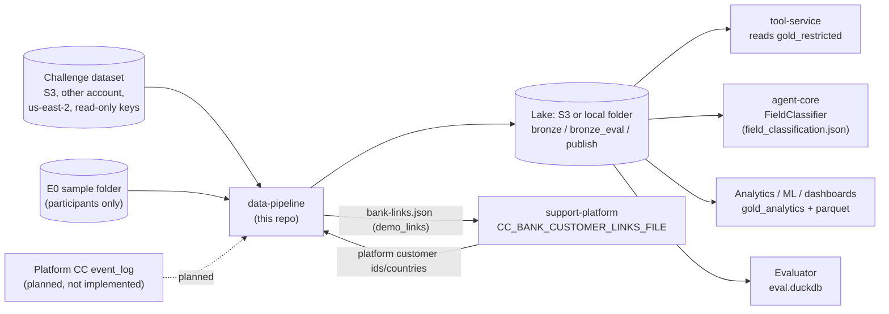
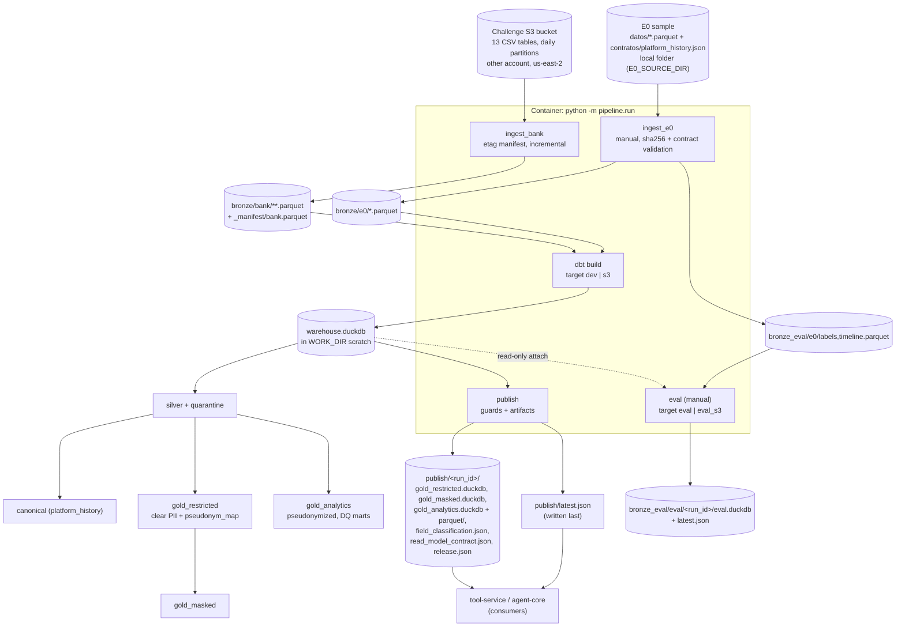
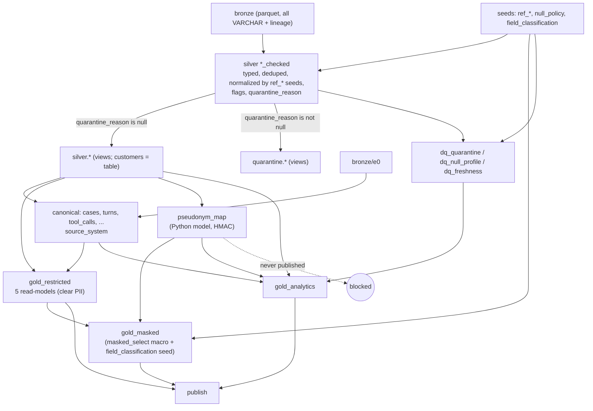
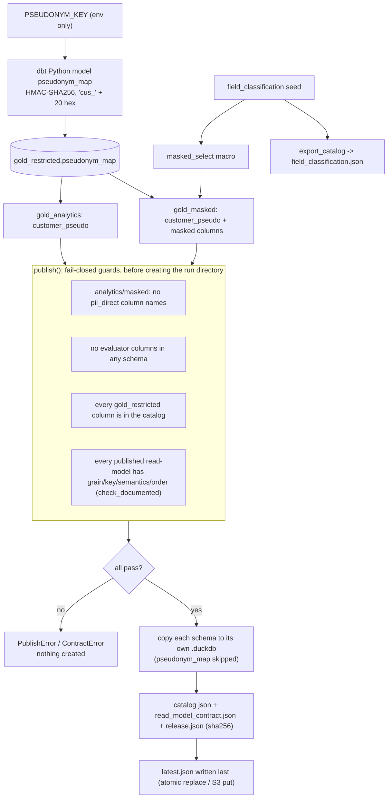
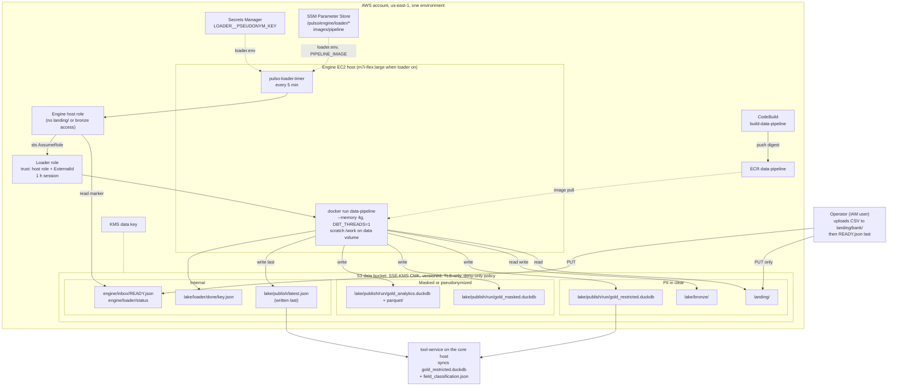
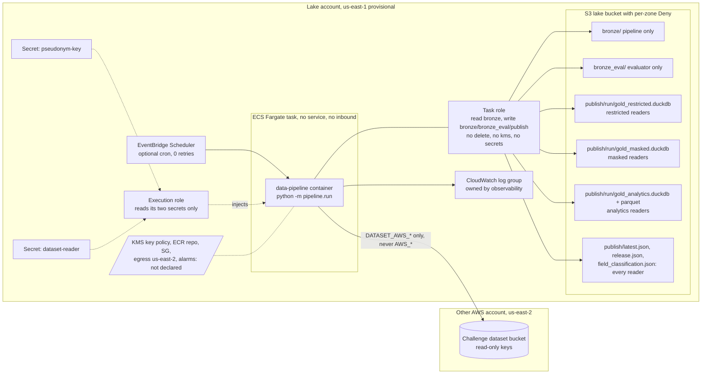

# data-pipeline: technical documentation

| | |
|---|---|
| Repository | https://github.com/pulso-factored/data-pipeline |
| Code read at | `origin/main` commit `0291edf731fa823ec449ca3890c8ac43b3c63718` ("Merge pull request #3 from pulso-factored/fix/duckdb-memory-limits") |
| Infrastructure read at | `infra` repo `origin/main` commit `246ddf8527a18db4db2ba93b163df2f7adda75d0` (section 13) |
| Date of reading | 2026-10-05 |
| Language | English (the repo's own `docs/` are in Spanish) |

> **How to read this document.** Statements come from code, config, seeds and the repos' own docs. Counts of seed rows and test files were recomputed from the files. Anything that was not executed, not deployed, or only claimed in prose is tagged **[NOT VERIFIED]**. Callouts: **Note** = something to be aware of; **[NOT VERIFIED]** = could not be checked. No secret value appears anywhere in this document.

## Executive summary

`data-pipeline` is a batch analytics pipeline (dbt + DuckDB, medallion layout) for Pulso's banking customer-service system. It ingests the 13 tables of the LATAM Bank challenge dataset and a sample of 2,000 disputes ("E0"), cleans and classifies them, and publishes immutable, physically separated artifacts by data sensitivity.

- **Who consumes it:** the tool-service and `agent-core` (per-customer read-models with clear PII, plus the `FieldClassification` catalog), analysts and ML (pseudonymized marts), consumers without `agent-core` (masked read-models), and an evaluator-only zone (labels).
- **What makes it safe by design:** every column is classified; pseudonyms are an HMAC computed in batch from a key that stays in the environment; publication fails closed if PII, evaluator fields or undocumented read-models would leak; the re-identification map is never published.
- **How it runs:** `python -m pipeline.run` (ingest, `dbt build`, publish) in one non-root container image. The infra repo describes two ways to deploy it, and neither is proven applied (section 13).
- **What is not done:** Platform CC `event_log` source, key rotation (`kid`), retention/erasure policy, real access control on the files (depends on infra), measured resource sizing on AWS.

## Quick facts

| Item | Value |
|---|---|
| Runtime | Python 3.12 (`>=3.12,<3.13`), uv, hatchling package `pipeline` |
| Core dependencies | dbt-core 1.9, dbt-duckdb 1.9, duckdb 1.1+, pyarrow 17+, pydantic 2.7+, boto3 1.34+ |
| Source tables | 13 bank tables (6 dimensions, 7 facts) + E0 (9 history tables + `labels`, `timeline`) |
| Layers | bronze (parquet, all VARCHAR) > silver (+ quarantine) > canonical > gold (`gold_restricted`, `gold_masked`, `gold_analytics`) + isolated `eval` zone |
| Dataset cutoff (`as_of`) | 2026-06-18 (dbt var `dataset_cutoff` and `DATASET_CUTOFF` in code) |
| Classification catalog | seed `field_classification.csv`: 508 rows (378 public, 48 pii_quasi, 41 pii_direct, 27 financial, 14 untrusted_text) |
| Null policy | seed `null_policy.csv`: 104 rules |
| Pseudonym | `cus_` + first 20 hex of HMAC-SHA256(`PSEUDONYM_KEY`, `customer_id`) |
| Published per run | `gold_restricted.duckdb`, `gold_masked.duckdb`, `gold_analytics.duckdb` + `parquet/`, `field_classification.json`, `read_model_contract.json`, `release.json`; pointer `publish/latest.json` written last |
| Read contract | `CONTRACT_VERSION = "1.0.0"` |
| dbt tests | 22 singular + 5 eval singular + about 150 generic test keywords in `schema.yml` |
| pytest | 42 test functions in 10 files |
| Container | `python:3.12-slim`, uid 10001, entrypoint `python -m pipeline.run`, `WORK_DIR=/work` |
| CI in this repo | none (no `.github/`) |
| Deployed | not verified anywhere (section 13) |

## Table of contents

1. [Purpose and scope](#1-purpose-and-scope)
2. [Architecture and data flow](#2-architecture-and-data-flow)
3. [Repository structure](#3-repository-structure)
4. [dbt layers and models](#4-dbt-layers-and-models)
5. [Sources and data schema (LATAM Bank dictionary)](#5-sources-and-data-schema-latam-bank-dictionary)
6. [Canonical model](#6-canonical-model)
7. [Pseudonymization, PII and key handling](#7-pseudonymization-pii-and-key-handling)
8. [Evaluator zone](#8-evaluator-zone)
9. [Published outputs and contracts for other services](#9-published-outputs-and-contracts-for-other-services)
10. [Configuration and environment variables](#10-configuration-and-environment-variables)
11. [Running locally](#11-running-locally)
12. [Tests, Docker and CI](#12-tests-docker-and-ci)
13. [Infrastructure and deployment (AWS)](#13-infrastructure-and-deployment-aws)
14. [Known limits and open items](#14-known-limits-and-open-items)
15. [Items marked NOT VERIFIED](#15-items-marked-not-verified)
16. [Glossary](#16-glossary)

---

## 1. Purpose and scope

An analytical pipeline (medallion architecture: bronze, silver, gold) built with dbt + DuckDB for Pulso's banking customer-service system. It delivers clean, contracted, traceable data to `agent-core` (per-customer read-models plus the `FieldClassification` catalog) and to analytics/ML. It does **not** cover transactional workloads (README).

In scope:
- Incremental ingestion of the 13 tables of the challenge dataset ("LATAM Bank", CSV in an S3 bucket in another account/region) into bronze parquet.
- Ingestion of a static sample, "E0" (11 parquet files, 2,000 dispute cases), validated against the `platform_history` contract.
- Silver typing, de-duplication, normalization (seeds), null policy, quarantine with reason.
- Canonical case model (`platform_history` v0.5.1 shape) with a `source_system` column.
- Gold: `gold_restricted` (clear PII), `gold_masked` (partially masked), `gold_analytics` (pseudonymized), plus an isolated evaluator zone (`eval`).
- Publication of immutable artifacts and a `latest.json` pointer.

Out of scope / not present:
- The Platform CC `event_log` source and the `agent-core` event consumer: planned only (`docs/00-plan-v1.md`); not implemented in code.
- `radicar_pqr` / `filed_pqrs`: owned by the tool-service, not the pipeline (`docs/03`).
- Access control: DuckDB has no roles; isolation depends on S3 prefixes/IAM declared elsewhere (infra). See section 13.

---

## 2. Architecture and data flow

### 2.1 System context



The consuming services (`tool-service`, `agent-core`, `support-platform`) live in other repos; their side of each arrow is taken from this repo's docs and was not inspected **[NOT VERIFIED]**.

### 2.2 End-to-end flow



### 2.3 Medallion data flow inside the warehouse



Note: `gold_analytics.case_facts` joins `pseudonym_map`, which is built from `silver.customers`.

### 2.4 Pseudonymization and publication-guard flow



Detail: the content guards (G1-G3) run first; `check_documented` (G4) runs next and still before the run directory is created.

### 2.5 Run order notes

Run order (`src/pipeline/run.py`): the default steps are `ingest_bank, build, publish`. `ingest_e0` and `eval` are valid steps but manual (E0 is a restricted sample; the evaluator zone is evaluator-only). `PIPELINE_ROOT` is either a local path or `s3://bucket/prefix`. DuckDB is a local file, so even with an S3 lake the warehouse lives in `WORK_DIR`; publication is built in scratch and then uploaded.

If `dbt build` returns non-zero, the runner aborts with "no se publica" (nothing is published).

> **Note:** how this flow is deployed on AWS (two designs, none proven applied) is in section 13.

---

## 3. Repository structure

| Path | Content |
|---|---|
| `src/pipeline/config.py` | `Settings.from_env()` and `bound_duckdb()` (memory/spill bounds) |
| `src/pipeline/ingest_bank.py` | Bronze ingestion of the 13 bank tables, etag manifest |
| `src/pipeline/ingest_e0.py` | Bronze ingestion of the E0 sample, sha256 versioning, contract validation |
| `src/pipeline/contract.py` | Validation of a parquet table against an entity in a JSON contract (`platform_history`) |
| `src/pipeline/publish.py` | Publication guards, artifact building, upload to S3, evaluator-zone publication |
| `src/pipeline/read_contract.py` | Generation of `read_model_contract.json` |
| `src/pipeline/export_catalog.py` | `field_classification.csv` seed -> `field_classification.json` (agent-core format) |
| `src/pipeline/demo_links.py` | Demo assignment of platform customers to dataset customers |
| `src/pipeline/run.py` | Runner / container entrypoint |
| `dbt/` | dbt project `data_pipeline` (models, macros, seeds, tests, profiles) |
| `dbt/macros_eval/` | `bronze_eval` macro (evaluator zone only) |
| `scripts/` | `gen_field_classification.py`, `gen_null_policy.py`, `profile_interactions.py`, `verify_masking.py` (one-off tooling, not part of published artifacts) |
| `tests/unit`, `tests/integration` | pytest suites |
| `docs/00..04-*.md` | Plan, quality findings, data governance, read contract, delivery summary (Spanish, in repo) |
| `Dockerfile`, `.dockerignore` | Single image |
| `pyproject.toml`, `uv.lock`, `.python-version` | Python 3.12 (`>=3.12,<3.13`), hatchling build, uv lock |

There is no `.github/` directory on `origin/main`: **no CI workflow is defined in this repo** (see section 12).

Dependencies (`pyproject.toml`): `dbt-core>=1.9,<2`, `dbt-duckdb>=1.9,<2`, `duckdb>=1.1`, `pyarrow>=17`, `pydantic>=2.7`, `boto3>=1.34`; dev: `pytest>=8`, `ruff>=0.6` (line length 100).

---

## 4. dbt layers and models

Project `dbt/dbt_project.yml`: profile `data_pipeline`, `vars.pipeline_root = env PIPELINE_ROOT`, `vars.dataset_cutoff = "2026-06-18"`. `generate_schema_name` is overridden so custom schemas are used verbatim (no target-schema prefix). All layers materialize as `table` unless a model overrides it.

| Schema | Models (from file listing) | Notes |
|---|---|---|
| bronze (not dbt) | `bronze/bank/<table>/...parquet`, `bronze/e0/*.parquet` | Written by Python ingestors; read via macros `bronze()` and `bronze_e0()` |
| `silver` | `customers`, `products`, `transactions`, `interactions`, `complaints`, `call_transcripts`, `satisfaction_surveys`, `campaign_sends`, `digital_events` (each backed by a `*_checked` model), plus `digital_sessions`, `exchange_rates`, `marketing_campaigns`, `service_agents` | `*_checked` tables hold every row with a `quarantine_reason`; the silver name is a filter on `quarantine_reason is null`. Materialization (verified in each file): `*_checked` for `customers`, `products`, `complaints`, `interactions`, `call_transcripts`, `satisfaction_surveys`, `campaign_sends` are tables; `transactions_checked` and `digital_events_checked` are incremental (`delete+insert`, ingestion watermark; keys `transaction_id` / `event_id`); `silver.customers` is a table (project default) while `products`, `transactions`, `interactions`, `complaints`, `call_transcripts`, `satisfaction_surveys`, `campaign_sends`, `digital_events` are views |
| `quarantine` | `q_customers`, `q_products`, `q_transactions`, `q_interactions`, `q_complaints`, `q_call_transcripts`, `q_satisfaction_surveys`, `q_campaign_sends`, `q_digital_events` | `alias` makes them appear as `quarantine.<table>`; rows where `quarantine_reason is not null` |
| `canonical` | `cases`, `turns`, `identity_checks`, `routing_steps`, `copilot_queries`, `tool_calls`, `approvals`, `case_closes`, `signals`, plus staging `stg_e0_case`, `stg_bank_case`, `stg_bank_interaction_case` | `cases` = union by name of E0, bank complaints and bank interactions, with `source_system` in `e0_sample | bank_complaints | bank_interactions` |
| `gold_restricted` | `customer_profile`, `customer_products`, `customer_transactions`, `customer_cases`, `customer_digital_summary`, `pseudonym_map` (Python model) | Clear PII, classified. `pseudonym_map` is never published |
| `gold_masked` | `masked_customer_profile`, `..._products`, `..._transactions`, `..._cases`, `..._digital_summary` | Built with macro `masked_select` from the classification seed; `alias` restores the original table name (e.g. `customer_profile`) |
| `gold_analytics` | `case_facts`, `demand_monthly`, `contact_reasons_monthly`, `campaign_performance_monthly`, `digital_events_daily`, `dq_freshness`, `dq_null_profile`, `dq_quarantine` | Pseudonymized (`customer_pseudo`) or aggregated; no labels |
| `eval` | `labels`, `replay_order`, `timeline` | Enabled only with `--vars build_eval=true`; see section 8 |
| `ref` (seeds) | see below | |

### Key modeling behaviors (verified in SQL)

- **customers_checked**: dedup by `customer_id` (latest `last_updated`, then `_ingested_at`). Country and document type normalized via seeds. `branch_link_valid` is a flag, not a quarantine reason. Quarantine reasons: `null_primary_key`, `unknown_country`, `unknown_document_type`, `invalid_date_of_birth`, `credit_score_out_of_range` (outside 300..850). Flags: `is_last_updated_future` (vs `dataset_cutoff`), `is_missing_*`.
- **products_checked**: dedup by `product_id` and by `product_number` (latest wins). Reasons: `null_primary_key`, `duplicate_product_id`, `unknown_product_type`, `null_product_number`, `duplicate_product_number`, `orphan_customer`. `credit_limit_applicable` comes from the product-type seed; `is_missing_credit_limit` is true only where a limit should exist.
- **transactions_checked**: `incremental`, `unique_key=transaction_id`, strategy `delete+insert`, watermark `_ingested_at > max(_ingested_at)` of the target. A re-ingested partition (new etag, new `_ingested_at`) replaces its rows. Holds all rows plus `quarantine_reason`; silver/quarantine are views. `amount_usd` = reported value, else `amount` when currency is USD, else `round(amount * rate_of_day, 2)`; `amount_usd_source` in `reported | derived_identity | derived_fx | unavailable`. `is_partition_date_shifted` flags `process_date` != event date. `product_quarantined` flag. Reasons: `null_primary_key`, `duplicate_transaction_id`, `transaction_date_out_of_range` (2023-06-17..2026-06-17), `non_positive_amount`, `unknown_currency` (not USD/COP/ARS), `unknown_country`, `orphan_customer`, `orphan_product`.
- **Other quarantine reasons** (from `*_checked`): interactions (`interaction_date_out_of_range`, `negative_duration`, `orphan_customer`, `orphan_agent`, ...), call_transcripts (`empty_text`, `orphan_interaction`, ...), satisfaction_surveys (`survey_date_out_of_range`, `null_main_score`, `orphan_*`), campaign_sends (`send_date_out_of_range`, `orphan_customer`, `orphan_campaign`), complaints (`invalid_creation_date`, `resolution_before_creation`, `orphan_customer`), digital_events (`event_date_out_of_range` using 2023-06-17..2026-06-18, `orphan_customer`, `orphan_product`). All include `null_primary_key` and `duplicate_<pk>`.
- **digital_events / digital_sessions**: `digital_sessions` has one row per session and derives `session_customer_id` only when the session has exactly one distinct customer. `silver.digital_events` exposes `customer_id_resolved` and `customer_id_source` (`reported | derived_from_session | anonymous`).
- **exchange_rates**: PK (`rate_date`, `source_currency`, `target_currency`); rows with unparsable date or rate <= 0 are dropped (not quarantined; this is the only silver table filtered this way in the files read).
- **customer_digital_summary**: aggregates the 90 days before `dataset_cutoff` per `customer_id_resolved`: `last_event_at`, `last_login_at`, `sessions_90d`, `logins_90d`, `error_events_90d`, `purchases_90d`, `channels_used_90d`, `last_channel`, `last_app_version`. No raw events, IP or URL.
- **customer_cases**: joins canonical `cases` with `complaints` and `case_closes`; `complaint_description` is `untrusted_text`.
- **case_facts**: pseudonymized per-case facts with `replay_rank`/`split` derived from `opened_at` of E0 cases (first 200 = `arranque`, rest = `reproduccion`, per the model comment).
- **Marts**: `campaign_performance_monthly` (open/click/conversion rates must use `engagement_measurable_delivered`, i.e. Email/Push/SMS delivered, because WhatsApp/Voice are not tracked), `contact_reasons_monthly`, `demand_monthly`, `digital_events_daily`, `dq_freshness`, `dq_null_profile` (macro `null_profile`, joined to seed `null_policy`), `dq_quarantine` (valid vs quarantined by table and reason).

### Macros (`dbt/macros`)

`bronze(table, partitioned)` reads `<pipeline_root>/bronze/bank/<table>/*/*/*/*.parquet` (facts, `union_by_name=true`) or `.../<table>.parquet` (dimensions); `bronze_e0(table)`; `generate_schema_name`; `masked_select(model, source_schema)` and `mask_expr` (section 7); `null_profile(model)`. `macros_eval/bronze_eval.sql` reads `bronze_eval/e0/<table>.parquet`.

### Seeds (`dbt/seeds`, schema `ref`)

`field_classification.csv` (columns `schema_name, table_name, column_name, class, tag, quasi_op, quasi_width`; 508 rows, recounted: 378 `public`, 48 `pii_quasi`, 41 `pii_direct`, 27 `financial`, 14 `untrusted_text`; by schema: silver 290, canonical 121, gold_restricted 97), `null_policy.csv` (104 rules, recounted: 63 `missing_real`, 21 `structural`, 17 `state`, 2 `derivable`, 1 `not_in_source`), and small mapping seeds: `ref_country`, `ref_dispute_topic`, `ref_document_type`, `ref_interaction_channel`, `ref_product_type`, `ref_reception_channel`, `ref_resolution_code`. The seed column types for `field_classification` are pinned to varchar for `tag`, `quasi_op`, `quasi_width`.

---

## 5. Sources and data schema (LATAM Bank dictionary)

### 5.1 The 13 source tables (`ingest_bank.py`)

- Dimensions (6): `customers`, `products`, `branches`, `service_agents`, `marketing_campaigns`, `daily_exchange_rates`.
- Facts (7): `transactions`, `call_center_interactions`, `call_transcripts`, `satisfaction_surveys`, `digital_events`, `complaints`, `campaign_sends`.

Source layout: `s3://<DATASET_BUCKET>/<DATASET_PREFIX><table>[.csv | /year=.../.../x.csv]`. Output: parquet with zstd, same relative path with `.csv` -> `.parquet`, under `<PIPELINE_ROOT>/bronze/bank/`.

### 5.2 Bronze contract

A faithful copy: **all columns VARCHAR** (`read_csv(..., all_varchar=true, header=true, hive_partitioning=false)`), plus lineage columns: `_batch_id`, `_source_file`, `_source_etag`, `_ingested_at`, `_schema_hash` (md5 of the column names joined by `|`). Note: the repo plan/README mention `_etag`; the code column is `_source_etag`.

Incremental logic: list objects (paginated `list_objects_v2`), compare each key's ETag with `bronze/_manifest/bank.parquet` (`key, etag, size, last_modified, batch_id, rows, schema_hash`); ingest if new or changed; run up to 8 parallel workers (`--workers`); the manifest is rewritten only if something was ingested.

E0 bronze: tables `case, turn, identity_check, routing_step, copilot_query, tool_call, approval, case_close, signal` (history, validated) plus `labels, timeline` (evaluator). Added columns: `_batch_id`, `_source_sha256`, `_contract_version`, `_ingested_at`. Unchanged tables (same sha256) are skipped unless `--force`. Manifest: `bronze/_manifest/e0.parquet`. A validation failure raises `ContractError` and aborts.

### 5.3 Silver dictionary (columns verified in the models read)

**customers** (150,000 rows per repo docs): `customer_id, document_number, document_type (canonical), first_name, last_name, date_of_birth, gender, email, mobile_phone, landline_phone, address, city, state, country_iso2, postal_code, detected_accent, segment, credit_score (int), estimated_monthly_income (decimal 12,2), occupation, marital_status, education_level, registration_date, registration_branch_id, customer_status, last_updated, accepts_marketing (bool), branch_link_valid, is_last_updated_future, is_missing_credit_score, is_missing_income, is_missing_accent, is_missing_email, is_missing_mobile_phone` + lineage.

**products**: `product_id, customer_id, product_type (canonical), product_number, currency, current_balance, credit_limit, interest_rate, opening_date, expiration_date, opening_branch_id, product_status, opening_channel, has_linked_app, days_past_due, last_transaction_date, last_updated, credit_limit_applicable, is_last_updated_future, is_missing_credit_limit` + lineage.

**transactions**: `transaction_id, transaction_ts, event_date, process_date, product_id, customer_id, transaction_type (lower), transaction_category, amount, currency, amount_usd_reported, channel, branch_id, merchant_name, merchant_category, transaction_country_iso2, transaction_city, transaction_status, response_code, is_fraud, fraud_score, latitude, longitude, amount_usd, amount_usd_source, is_partition_date_shifted, product_quarantined, is_missing_fraud_score, has_no_merchant` + lineage.

**service_agents**: includes `employee_code_is_duplicated`, `branch_link_valid`, `country_of_origin_iso2`; PII (names, email, phone), quasi-identifiers (`native_accent`, country of origin).

**marketing_campaigns** (200 rows per model comment): `campaign_id, campaign_name, description, campaign_type, campaign_objective, promoted_product, target_segment, target_country, start_date, end_date, budget, campaign_status, expected_conversion_rate`.

**exchange_rates**: `rate_date, source_currency, target_currency, exchange_rate, buy_rate, sell_rate, rate_source`.

**interactions**: `interaction_id, interaction_ts, event_date, process_date, customer_id, agent_id, interaction_type, channel, contact_reason, reason_category, duration_seconds, wait_time_seconds, was_resolved, requires_followup, detected_sentiment, sentiment_score, customer_detected_accent, agent_used_accent, was_escalated, mentioned_products, has_transcript, has_recording, is_missing_duration, is_missing_wait_time, is_partition_date_shifted` + lineage.

**complaints**: `complaint_id, creation_date, process_date, customer_id, category, subcategory, reception_channel, affected_product_id, related_branch_id, origin_interaction_id, description, claimed_amount, currency, priority, status, assigned_agent_id, assignment_date, first_response_date, resolution_date, closing_date, sla_breached, resolution_days, compensation_granted, resolution_satisfaction, is_repeat_complainer, is_open, is_resolution_date_inconsistent` + lineage (a complaint-type column and the `resolution` text also exist; the `resolution` column is referenced by the PII scan).

**call_transcripts**: `transcript_id, interaction_id, process_date, customer_id, agent_id, full_text, detected_language, detected_accent, accent_confidence, detected_keywords, detected_intents, main_topics, transcription_model, audio_quality, duration_seconds` (the PII scan also references `customer_text`, `agent_text`, `mentioned_entities`).

**satisfaction_surveys**: `survey_id, survey_ts, event_date, process_date, interaction_id, customer_id, agent_id, survey_type, send_channel, main_score, nps_category, question_1..3_text/_response, comment_sentiment, response_time_hours, campaign_response_rate` (the PII scan also references `open_comments`).

**campaign_sends**: `send_id, send_ts, event_date, process_date, campaign_id, customer_id, send_channel, template_used, subject, send_status, was_delivered, was_opened, open_ts, was_clicked, click_ts, click_count, had_conversion, conversion_ts, conversion_value, open_device, open_country, failure_reason, send_cost, is_missing_send_cost`.

**digital_events**: `event_id, event_ts, event_day, process_date, customer_id, session_id, event_type, event_category, channel, platform, browser, app_version, page_url, page_title, action, element_id, product_id, event_value, duration_seconds, ip_address, ip_country, ip_city, is_mobile, referrer, utm_source, utm_medium, utm_campaign, is_anonymous` in the `_checked` table; the silver view adds `customer_id_resolved` and `customer_id_source`.

Column names for the six tables above were extracted from the typed `select` of each `_checked` model (read this pass). Exact types: see the SQL and the `silver` rows of `dbt/seeds/field_classification.csv`.

---

## 6. Canonical model

The canonical schema follows the `platform_history` contract (version string `0.5.1` is hardcoded in `release.json` by `publish.py`; E0's own `_contract_version` is read from the contract file). One table shape with `source_system`:

| source_system | Origin |
|---|---|
| `e0_sample` | E0 nearly 1:1; `customer_id` resolved to the real bank customer by joining `complaint_id` to silver `complaints`; the E0 pseudonym (`PSN-...`) is kept in `source_customer_id` |
| `bank_complaints` | mapped from `complaints` (per `docs/00`: priority `critical -> high`; topic only for the 2 dispute subcategories; E0 complaints excluded) |
| `bank_interactions` | call-center interactions; topic, priority, `sla_due_at`, `complaint_id` are NULL (no source); only calls and video have a `case_close` |
| `cc_platform` | planned, **not implemented** |

Fields without a source stay NULL. Row counts quoted in the repo docs (67,095 cases without interactions; 753,216 with them) are the repo's measurements **[NOT VERIFIED here]**. Verified in SQL: `stg_bank_case` excludes complaints already present in E0, sets `language='es'` with `language_source='assumed_es'`, maps priority `critical -> high`, leaves `sla_due_at` NULL; `stg_bank_interaction_case` takes the language from the transcript only if it is `es` or `pt` (else assumed `es`), leaves `origin` NULL for `Outbound Call`, and topic, priority, complaint_id and `sla_due_at` NULL. The canonical tables other than `cases` and `case_closes` (turns, tool_calls, approvals, copilot_queries, identity_checks, routing_steps, signals) are E0-only (`source_system='e0_sample'`) and cast the JSON/array columns from the VARCHAR bronze.

---

## 7. Pseudonymization, PII and key handling

No secret appears in the repo (checked in the files read; credentials come only from the environment). Values below describe mechanisms only.

### 7.1 FieldClassification catalog

Seed `dbt/seeds/field_classification.csv` is the single source of truth. Classes: `pii_direct`, `pii_quasi`, `financial`, `untrusted_text`, `public` (`export_catalog.FIELD_CLASSES`). `export_catalog.build()` emits `{ "<table>.<column>" | "<column>": {"field_class", "tag"?, "quasi"?: {"op","width"}} }`:
- `pii_direct` -> `tag` (default `pii`).
- `pii_quasi` -> `quasi.op` (default `drop`) and `quasi.width` (default 10).
- A bare column name is emitted only if every occurrence has the same rule; otherwise only the explicit `table.column` paths exist. Unresolved fields should be treated as `pii_direct` by consumers (documented in the repo, enforced by agent-core, **not verifiable here**).
- Recomputed with `export_catalog.build()` on the current seed: **827 entries** = 508 `table.column` paths + 319 bare column names (a bare name is emitted only where every occurrence has the same rule). Run standalone: `python -m pipeline.export_catalog --out field_classification.json`.

### 7.2 Pseudonymization (gold_analytics)

`dbt/models/gold_restricted/pseudonym_map.py` (dbt Python model): `customer_pseudo = "cus_" + HMAC-SHA256(PSEUDONYM_KEY, customer_id).hexdigest()[:20]`, computed in batch with pyarrow from `ref('customers')`. The model raises if `PSEUDONYM_KEY` is unset. The key is read from the environment only; the model comment states it never passes through SQL, `target/` or dbt logs. The map lives in `gold_restricted` and is **never published** (`NEVER_PUBLISH_TABLES = {"pseudonym_map"}`). Key rotation / `kid` is not implemented (section 13).

### 7.3 Masking (gold_masked)

Generated from the catalog by macro `masked_select` (a model's columns are read from the relation; a column without a rule raises a compiler error):

| Class | Treatment |
|---|---|
| `customer_id` | replaced by `customer_pseudo` (join to `pseudonym_map`) |
| `pii_direct`, tag `name` | first character + `***` |
| tags `doc`, `tel`, `prod` | `***` + last 4 characters |
| tag `email` | first char + `***@***` |
| other `pii_direct` tags | `'[oculto]'` (NULL stays NULL) |
| `pii_quasi` | column dropped; `date_of_birth` becomes `age_bucket` (10-year range at `dataset_cutoff`) |
| `untrusted_text` | emails -> `[email]`, digit runs (6+ chars pattern) -> `[num]` |
| `financial`, `public` | pass through |

Masked `pii_direct` columns get suffix `_masked` so the publish guard can verify by name.

### 7.4 Guards (fail closed)

- `publish.check_guards`: no `pii_direct` column names (other than `customer_pseudo`) in `gold_analytics` or `gold_masked`; no evaluator columns (`labels, final_status, final_resolution_code, final_resolution_date, final_sla_breached`) in any published schema; every `gold_restricted` column must be present in the catalog.
- dbt tests: `gold_analytics_has_no_direct_pii`, `masked_values_do_not_leak`, `field_classification_coverage` (checks only `BASE TABLE`s: all of `canonical` and `gold_restricted` plus the listed silver tables; silver names that are views are not inspected by this test; observation from the SQL, practical impact not analyzed), `untrusted_text_pii_scan` (warn-only: emails and 6+ digit sequences in free text; does not detect proper names).
- `scripts/verify_masking.py`: ad hoc check of masked vs restricted; not part of publication.

---

## 8. Evaluator zone

`labels` and `timeline` (E0 answers) go to `bronze_eval/`, never to `bronze/`, the warehouse or `publish/`. The `eval` dbt models are disabled unless `--vars "{build_eval: true}"`; `tests/unit/test_no_label_leak.py` (verified to exist) fails if `bronze_eval`, `labels` or `final_*` fields are referenced outside `dbt/models/eval`, `dbt/tests/eval` and `dbt/macros_eval`. The `eval` step uses target `eval` (or `eval_s3`), base `EVAL_PATH` (`<WORK_DIR>/eval.duckdb`) and attaches the warehouse read-only as alias `wh`. It selects `path:models/eval` and `path:tests/eval` (`eval_*` tests: label coverage of E0 cases, `opened_at` consistency, `split`/`rank` match derived order, 160 documented stress cases, timeline coverage). `publish_eval` requires that the DB contain only schema `eval`, writes `bronze_eval/eval/<run_id>/eval.duckdb` + `release.json` (`"zone": "evaluator-only"`) and moves `bronze_eval/eval/latest.json` last. Requires `E0_SOURCE_DIR` (ingest) and `PSEUDONYM_KEY` for the build step.

---

## 9. Published outputs and contracts for other services

Each run writes an **immutable** directory (`publish/<run_id>/`, default `run-<UTC timestamp>Z`; it fails if it already exists locally or in S3) and finally the pointer `publish/latest.json` (`{"run_id", "path"}`, local `os.replace` or S3 `put_object` last).

| File | Content | Consumer |
|---|---|---|
| `gold_restricted.duckdb` | schema `gold_restricted` (database and schema share the name): `customer_profile`, `customer_products`, `customer_transactions`, `customer_cases`, `customer_digital_summary` | tool-service (authenticated tools) |
| `gold_masked.duckdb` | schema `gold_masked`: same 5 read-models, subject = `customer_pseudo` | consumers that bypass agent-core |
| `gold_analytics.duckdb` + `parquet/<table>.parquet` | aggregates and DQ marts, zstd parquet | analysis/ML/dashboards |
| `field_classification.json` | catalog (section 7.1) | agent-core `--field-classifier` |
| `read_model_contract.json` | read contract (below) | tool-service, platform, contract tests |
| `release.json` | `run_id`, `created_at`, `git_sha`, `contracts: {platform_history: "0.5.1"}`, rows per schema/table, `quarantine` summary, `never_published`, `artifacts_sha256` | audit |

`git_sha` comes from `git rev-parse HEAD` run in the repo directory; it may be `null` in the container if `.git` is absent (the `.dockerignore` excludes `.git`; so in the image it is expected to be null **[NOT VERIFIED by running]**).

Physical order: tables in `ORDER_BY` are published sorted by the subject column (`customer_profile`: `customer_id`; `customer_products`: `customer_id, opening_date desc`; `customer_transactions`: `customer_id, transaction_ts desc`; `customer_cases`: `customer_id, opened_at desc`; `customer_digital_summary`: `customer_id`; `customer_id` replaced by `customer_pseudo` for masked). This is an optimization, not a guarantee; readers must use `ORDER BY`.

### 9.1 `read_model_contract.json` (`CONTRACT_VERSION = "1.0.0"`)

Generated from the real schema, the catalog and `null_policy.csv`. Top-level: `contract_version`, `run_id`, `as_of` (= `DATASET_CUTOFF` "2026-06-18"), `as_of_note`, `access`, `null_types`, `zones` -> `restricted` / `masked` -> `{schema, tables}`. Per table: `grain`, `key`, `subject_column`, `physical_order`, `semantics[]`, `columns{type, class (restricted only), null_type, null_note, related_flags}`. Related flags are discovered by pattern: `is_missing_<c>`, `<c>_applicable`, `<c>_source`.

Documented grain/key per read-model: `customer_profile` (one row per customer; key `customer_id`), `customer_products` (`product_id`), `customer_transactions` (valid transaction; `transaction_id`), `customer_cases` (`case_id`; sources `e0_sample`, `bank_complaints`, `bank_interactions`), `customer_digital_summary` (customers with identified digital activity in the 90 days before `as_of`; absence means no identified activity, not unknown).

Guards: `check_documented` runs before anything is created; a published read-model without a documented grain/semantics/order raises `ContractError` and blocks publication. `test_dataset_cutoff_matches_the_dbt_variable` (verified to exist) asserts `DATASET_CUTOFF` equals the dbt `dataset_cutoff` var; both are 2026-06-18 in the files read.

### 9.2 How consumers should read

(From `docs/03` and `read_contract.access`.) Read `latest.json` -> `run_id`; open the DuckDB read-only; always `WHERE <subject_column> = ?` with an explicit `ORDER BY`; return `run_id` with each answer; treat an unreadable pointer/file as an error, not stale data; "recent" is relative to `as_of`, not the clock. Latency figures in `docs/03` (median 19 ms, p95 27 ms on a laptop, 150 random customers) are the repo's own and **[NOT VERIFIED]** here and not measured under load or in the real infrastructure.

### 9.3 Demo links (`demo_links.py`)

Deterministic assignment of platform customers (`CUS-...`) to dataset customers (rank by SHA-256 of `platform_id|customer_id`). Eligibility: status `Active`, at least one active core product (credit/debit card, checking, savings), at least 20 transactions (`MIN_TRANSACTIONS`), country match; prefers customers with E0 disputes; Portuguese platform customers use only E0 Portuguese cases; never reuses a dataset customer; fails if candidates are insufficient. Inputs: `--customers file.json` (`{"CUS-...": {"country", "locale"}}`) or `--platform-seed <path to support-platform seed/customers.py>`. Outputs `bank-links.json` (format of the platform's `CC_BANK_CUSTOMER_LINKS_FILE`) and `bank-links.report.json` (ids and counts only) in `--out-dir` (default `<PIPELINE_ROOT>/demo`). Output is private; never commit. It is a demo assignment, not a real identity link.

---

## 10. Configuration and environment variables

All configuration comes from the environment (`Settings.from_env()`); defaults as in code/profiles.

| Variable | Default | Purpose |
|---|---|---|
| `PIPELINE_ROOT` | `data` | Lake root: local path or `s3://bucket/prefix`. Required by every step |
| `WORK_DIR` | `PIPELINE_ROOT` if local, else `work` (image sets `/work`) | Scratch: `warehouse.duckdb`, `eval.duckdb`, dbt `target/`, `logs/`, publication staging, DuckDB spill |
| `WAREHOUSE_PATH` | set by runner to `<WORK_DIR>/warehouse.duckdb` | dbt profile path (dev target defaults to `<PIPELINE_ROOT>/warehouse.duckdb` if unset) |
| `EVAL_PATH` | set by runner to `<WORK_DIR>/eval.duckdb` | Evaluator DB |
| `DATASET_BUCKET` | none (required for `ingest_bank`) | Challenge bucket name |
| `DATASET_PREFIX` | `data/` | Key prefix in the bucket |
| `DATASET_REGION` | `us-east-2` | Region of the challenge bucket |
| `DATASET_AWS_ACCESS_KEY_ID`, `DATASET_AWS_SECRET_ACCESS_KEY` | none | Read-only challenge credentials, scoped by a DuckDB secret to `s3://<DATASET_BUCKET>/`. Without them the standard AWS chain is used (local dev) |
| `AWS_DEFAULT_REGION` | `us-east-1` | Lake region |
| standard AWS chain (task role) | | Lake credentials; do **not** put challenge keys in `AWS_ACCESS_KEY_ID`/`AWS_SECRET_ACCESS_KEY` in production because they take precedence over the task role |
| `PSEUDONYM_KEY` | none (required for `build` and `eval`) | HMAC key for pseudonyms. Secret; never commit, never log |
| `E0_SOURCE_DIR` | none | Folder with `datos/` and `contratos/` (for `ingest_e0`, `eval`) |
| `S3_KMS_KEY_ID` | unset | If set, uploads use SSE-KMS with that key; else the bucket default encryption |
| `DBT_THREADS` | `1` | dbt threads (see section 12) |
| `DUCKDB_MEMORY_LIMIT` | `2GB` in `s3`/`eval_s3` dbt targets; unset (no bound) elsewhere | DuckDB memory cap |
| `DUCKDB_TEMP_DIRECTORY` | `$WORK_DIR/duckdb_tmp` in `s3`/`eval_s3` targets | Spill directory |
| `DBT_TARGET_PATH`, `DBT_LOG_PATH`, `DBT_SEND_ANONYMOUS_USAGE_STATS` | set by runner | dbt artifacts in scratch; stats disabled |

> **Note:** the same variables mean different things per deployment design. In the infra repo's automatic loader the "dataset" bucket is the lake bucket itself (`DATASET_PREFIX=landing/bank/`, no `DATASET_AWS_*`); in the ECS design it is the challenge bucket in another account (section 13.5).

Required variables per step (`run.REQUIRED`): `ingest_bank`: `PIPELINE_ROOT`, `DATASET_BUCKET`; `ingest_e0`: `PIPELINE_ROOT`, `E0_SOURCE_DIR`; `build`: `PIPELINE_ROOT`, `PSEUDONYM_KEY`; `publish`: `PIPELINE_ROOT`; `eval`: `PIPELINE_ROOT`, `PSEUDONYM_KEY`. The runner fails fast listing missing names without printing values.

dbt targets (`dbt/profiles.yml`, no secrets, env references only): `dev` (local file), `s3` (httpfs, `credential_chain` S3 secret, memory limit and temp dir), `eval`, `eval_s3` (same plus the warehouse attached read-only as `wh`). The runner picks `s3`/`eval_s3` when `PIPELINE_ROOT` starts with `s3://`.

Connection secrets in ingestion: two DuckDB secrets, `lake` (credential chain, lake region; created only when the lake is remote) and `dataset` (explicit keys if provided, else credential chain; region = dataset region; scoped to the dataset bucket). On failure creating them, the error message from DuckDB is deliberately not forwarded (it could quote the statement).

---

## 11. Running locally

On Windows, set the uv Python install directory first (project convention): in PowerShell `$env:UV_PYTHON_INSTALL_DIR = "C:/Users/JUAN/uvpy"`; in Git Bash `export UV_PYTHON_INSTALL_DIR=C:/Users/JUAN/uvpy`. Python must be 3.12.

```bash
uv sync
export PIPELINE_ROOT=/absolute/path/data
export PSEUDONYM_KEY=$(python -c "import secrets;print(secrets.token_hex(32))")   # local-only generated key
export DATASET_BUCKET=... DATASET_AWS_ACCESS_KEY_ID=... DATASET_AWS_SECRET_ACCESS_KEY=...   # challenge read-only credentials, from the environment only
uv run python -m pipeline.ingest_bank --tables customers,products,complaints   # default: all 13; --workers, --limit
uv run python -m pipeline.ingest_e0 --source /path/to/pulso_muestra_e0          # manual; --force to reload
uv run dbt build --project-dir dbt --profiles-dir dbt
uv run python -m pipeline.publish            # or all at once: python -m pipeline.run
uv run python -m pipeline.run --steps ingest_e0,build,eval   # evaluator zone (needs E0_SOURCE_DIR)
```

Note: README shows `AWS_ACCESS_KEY_ID`/`AWS_SECRET_ACCESS_KEY` for local dev; section 10 explains why `DATASET_AWS_*` is preferred when a role is also used. With a local `PIPELINE_ROOT`, `WORK_DIR` defaults to the same folder, so `warehouse.duckdb` is `<PIPELINE_ROOT>/warehouse.duckdb`. Running `dbt build` directly requires `PIPELINE_ROOT` and `PSEUDONYM_KEY` in the environment.

The README claims a full build takes about 6 minutes on a laptop (4.4 M transactions, 15.6 M digital events, 232 checks); **[NOT VERIFIED]**, not re-run.

Demo links: `uv run python -m pipeline.demo_links --platform-seed ../support-platform/.../seed/customers.py`.

---

## 12. Tests, Docker and CI

### 12.1 Tests

- **dbt tests**, recounted from the files: 22 singular tests in `dbt/tests/` (`amount_usd_derived_tolerance`, `digital_sessions_have_at_most_one_customer`, `dq_unexplained_nulls`, `e0_events_not_before_case_opened`, `e0_pseudonym_maps_to_one_customer`, `e0_tool_approval_consistency`, `exchange_rates_complete`, `exchange_rates_unique_key`, `field_classification_coverage`, `future_dated_rows_warn`, `gold_analytics_has_no_direct_pii`, `masked_values_do_not_leak`, `no_unexpected_duplicates_in_bronze`, `null_state_campaign_sends`, `null_structural_{credit_limit,digital_events,interactions,surveys,transactions}`, `products_missing_limit_flag_means_applicable`, `service_agents_employee_code_duplicates`, `untrusted_text_pii_scan`) plus 5 in `dbt/tests/eval/` (label coverage, `opened_at` match, split/rank vs replay order, the documented 160 stress cases, timeline coverage). In the `schema.yml` files the keywords `unique` (40), `not_null` (54), `relationships` (23) and `accepted_values` (33) appear 150 times (a text count; some may be in comments or descriptions). The total printed by `dbt build` also counts models and seeds, so the README's "195 checks + 24 tests" and the later "232" cannot be reconciled from the files alone; neither number was reproduced **[NOT VERIFIED]**.
- **pytest**: 42 test functions in 10 files (`tests/unit`: `test_bound_duckdb` 2, `test_dataset_credentials` 5, `test_demo_links` 7, `test_export_catalog` 3, `test_ingest_helpers` 5, `test_no_label_leak` 1, `test_publish` 8, `test_read_contract` 6, `test_upload_publication` 4; plus `tests/integration/test_incremental_transactions.py` 1). Parametrized cases, if any, are not counted. The publish tests use small synthetic DuckDB warehouses. The integration test uses a **synthetic** fixture to demonstrate that a new partition plus a correction of an existing one replace rows by `transaction_id`; it shells out to `uv run dbt`. Run: `uv run pytest`.
- Results of running any of these were **not verified** for this document.

### 12.2 Docker

`Dockerfile`: `python:3.12-slim`, uv 0.9.0 installed with pip, non-root user `pipeline` (uid 10001, shell nologin), `WORKDIR /app`, venv in `/app/.venv`, `WORK_DIR=/work`. Dependencies installed first from `pyproject.toml` + `uv.lock` (`uv sync --frozen --no-dev --no-install-project`), then `src`, `dbt`, `scripts`. DuckDB `httpfs` extension is installed at build so there is no runtime network need for the extension. `ENTRYPOINT ["python", "-m", "pipeline.run"]`; secrets must come via environment/Secrets Manager, nothing is baked in. `.dockerignore` excludes `.git`, `data`, `work`, `target`, `logs`, `*.duckdb`, `*.parquet`, `tests`, `docs`, `.claude`.

```bash
docker build -t pulso-data-pipeline .
docker run --rm -e PIPELINE_ROOT=s3://<bucket>/<prefix> -e DATASET_BUCKET=... -e PSEUDONYM_KEY=... pulso-data-pipeline
```

The scheduled run covers `ingest_bank, build, publish`; `ingest_e0` is a one-off manual load. Image build and a no-network run were claimed as verified in `docs/04`; **[NOT VERIFIED here]**.

### 12.3 CI

- This repo has no CI workflow (`.github/` is absent at the commit read). `docs/04` reports that the organisation's GitHub Actions could not run because of a billing block **[NOT VERIFIED]**.
- The infra repo confirms that no CI publishes a pipeline image digest (`infra:docs/gaps/OPEN_GAPS.md`); its design builds the image with CodeBuild instead (section 13.4).
- S3 upload (`upload_publication`): refuses if the run prefix already has objects; uploads files; moves `latest.json` last; applies SSE-KMS when `S3_KMS_KEY_ID` is set.
- Deployment is covered in section 13.

---

## 13. Infrastructure and deployment (AWS)

Source of truth: the `infra` repository at `origin/main` commit **`246ddf8527a18db4db2ba93b163df2f7adda75d0`** (read with `git show`/`git grep`, nothing modified). Paths below are relative to that repo (`infra:`). Terraform was not run; everything here is read from code and docs.

> **Note: read this first.** Nothing in `infra` proves that anything is applied. Its own status doc says "Terraform declarations are not evidence of an applied AWS environment" (`infra:docs/architecture/deployment-status.md`), and no state file, plan or account id is in the repo. Every Terraform module is tested only with mocked providers (`infra:.github/workflows/ci.yml`).

### 13.1 Two deployment designs exist

The infra repo describes two different ways to run the pipeline. They are not the same thing and the infra docs do not always say which one a statement is about.

| | A. Automatic loader on the engine EC2 host | B. ECS/Fargate batch workload (ADR 0006) |
|---|---|---|
| Where it is described | `infra:docs/auto-loader.md`, `infra:docs/service-deployment.md`, `infra:docs/infra-day-one.md` | `infra:docs/adr/0006-data-pipeline-workload.md` (Status: Proposed), `infra:docs/architecture/deployment-status.md` |
| Terraform | `infra:terraform/envs/hackathon` (instantiates `hackathon_data`, `hackathon_iam`, `hackathon_compute`, `image_builder`, `deployers`), behind `auto_loader_enabled` (default `false`) | modules `infra:terraform/modules/data_lake` and `infra:terraform/modules/data_pipeline` |
| Wired into an environment? | Yes, behind a default-off switch | **No.** `git grep` finds no `data_lake`/`data_pipeline` call in `infra:terraform/envs/*`; the plan-review checker records the missing `data_pipeline_enabled` switch (`infra:scripts/aws_plan_review.py`, `infra:docs/aws-plan-review-checklist.md` G1) |
| Compute | one `docker run` of the pipeline image per load, from a systemd one-shot on the engine host | one Fargate task definition, no service, started by EventBridge Scheduler or `ecs run-task` |
| Trigger | marker `engine/inbox/READY.json`, polled every 5 minutes | optional cron expression, or manual |
| Dataset source | CSV files the operator uploads to `landing/bank/` of the lake bucket | the challenge dataset bucket (other account, `us-east-2`) with read-only keys |
| Status per infra | part of the "single-account prod deployment" (`infra:docs/modification-guide.md`) | `infra:docs/modification-guide.md` calls `envs/staging` and `envs/prod` "older production-path material ... not part of the single-account prod deployment" |

### 13.2 Inventory of AWS elements

Status levels (the three required levels, plus one for gaps):

- **Declared in module**: a resource or module exists in `infra` but no environment root instantiates it.
- **Wired into an env**: an environment root instantiates it (it may be behind a default-off switch, noted).
- **Applied (no evidence in repo)**: only for items the infra docs *claim* are applied. There is no state, plan output or account id in the repo, so none of these can be confirmed.
- **Not declared**: needed by the design but absent from Terraform (a gap).

**Design A (engine-host loader).** All A items are behind `auto_loader_enabled` (default `false`) unless stated.

| # | AWS service / resource | Purpose for the pipeline | Terraform module / file (`infra:`) | Status |
|---|---|---|---|---|
| A1 | ECR repository `<prefix>/data-pipeline` | holds the pipeline image | `terraform/bootstrap/variables.tf` (`ecr_repositories` default includes `data-pipeline`), `terraform/bootstrap/oidc_ecr.tf` | Applied (no evidence in repo): docs say bootstrap is applied ("skip if already applied", `docs/aws-prod-quickstart.md`, `docs/deploy-readiness.md`, `docs/modification-guide.md`); other docs say nothing was applied (see 13.7, D3) |
| A2 | CodeBuild project, role and log group `<prefix>-build-data-pipeline` | builds the image from the pipeline repo's `Dockerfile` and pushes it to ECR | `terraform/modules/image_builder/main.tf`; `loader_build_services` in `terraform/envs/hackathon/main.tf` | Wired into an env (only when the loader is on; `enable_image_builder` default `true`) |
| A3 | IAM deployer policy documents (engine workload: repository `data-pipeline`, image key `pipeline`) | lets the engine deployer push/deploy the image | `terraform/modules/deployer_policies`; `module "deployers"` in `terraform/envs/hackathon/main.tf` | Wired into an env |
| A4 | SSM parameter `/pulso/engine/images/pipeline` | image digest read by the host (`PIPELINE_IMAGE`) | `terraform/envs/hackathon/main.tf` (image keys), `docs/service-deployment.md` | Wired into an env (value is not managed by apply, per `docs/deploy-readiness.md`) |
| A5 | EC2 engine host (`m7i-flex.large` when the loader is on, else `t3.small`), 40 GB data volume, 4 GiB swap file, systemd `pulso-loader.timer` and `.service` | runs the loader and the pipeline container | `terraform/modules/hackathon_compute` (`templates/user_data.sh.tftpl`, `prepare.sh.tftpl`), `terraform/envs/hackathon/main.tf` (`loader_swap_gb`, `instance_types`) | Wired into an env |
| A6 | IAM role `<prefix>-loader` (trust: engine host role only, `sts:ExternalId`, 1 h sessions, permissions boundary) plus inline policy `loader-s3` | the only identity that reads `landing/` and `lake/*` and writes `lake/*` | `terraform/modules/hackathon_iam/main.tf` | Wired into an env |
| A7 | Engine host role permission `sts:AssumeRole` on the loader role only (and boundary) | lets the one-shot assume the loader role | `terraform/modules/hackathon_iam/main.tf` | Wired into an env |
| A8 | S3 data bucket `<prefix>-data-<account id>` and its deny-only bucket policy | lake: `landing/`, `lake/bronze/`, `lake/publish/`, `engine/...` | `terraform/modules/hackathon_data/main.tf`, `s3_access.tf` | Wired into an env (always on; not behind the loader switch) |
| A9 | KMS customer key `alias/<prefix>-data` (rotation on) | default SSE-KMS of the bucket; the loader role may `GenerateDataKey`/`Decrypt` | `terraform/modules/hackathon_data/main.tf`, `terraform/modules/hackathon_iam/main.tf` | Wired into an env |
| A10 | Secrets Manager secret `<prefix>/hackathon`, key `LOADER__PSEUDONYM_KEY` (generated by Terraform, never typed) | the pipeline's `PSEUDONYM_KEY` | `terraform/modules/hackathon_data/secrets.tf`, `wiring.tf`; `docs/secrets-wiring.md` | Wired into an env (key present only with `auto_loader_enabled`) |
| A11 | SSM parameters `/pulso/engine/loader/*` (`LOADER_ROLE_ARN`, `LOADER_EXTERNAL_ID`, `LOADER_BUCKET`, `LOADER_REGION`, `LOADER_K_MIN`, `LOADER_DATASET_PREFIX`, `LOADER_MEMORY`, `LOADER_CPUS`, `LOADER_DUCKDB_MEMORY`, optional `LOADER_CELLS_CMD`, `LOADER_TABLE_BATCHES`) | non-secret loader config rendered into `loader.env` | `terraform/envs/hackathon/main.tf` (`aws_ssm_parameter.engine_loader`) | Wired into an env |
| A12 | VPC, subnets, engine security group, S3 gateway endpoint, internet egress | network of the host; reaching S3 (gateway endpoint), ECR and SSM (public egress in `free_plan`, NAT in `prod` profile) | `terraform/modules/hackathon_network`; `docs/architecture.md` | Wired into an env |
| A13 | CloudWatch agent for docker logs (`/<prefix>/docker`) | would ship container logs | `terraform/modules/hackathon_compute/main.tf` (`enable_cloudwatch_agent` default `false`) | Wired into an env (off by default; the loader's own failures go to journald and `engine/loader/status/last.json`, and shipping journald is a stated follow-up in `docs/auto-loader.md`) |

**Design B (ECS/Fargate batch workload).** None of these is instantiated by any env root.

| # | AWS service / resource | Purpose for the pipeline | Terraform module / file (`infra:`) | Status |
|---|---|---|---|---|
| B1 | S3 lake bucket (versioning, SSE-S3 or SSE-KMS, public-access block, `BucketOwnerEnforced`, lifecycle: abort multipart 7 d, noncurrent expiry 90 d default, optional `publish/run-*` expiry) | five sensitivity zones by prefix | `terraform/modules/data_lake/main.tf` | Declared in module |
| B2 | S3 bucket policy with Deny statements (TLS-only; `bronze/` except the task role; `bronze_eval/` except the evaluator; `gold_restricted.duckdb`; `gold_masked.duckdb`; deletion denied except break-glass); empty lists fail closed | enforcement of zones | `terraform/modules/data_lake/main.tf` | Declared in module |
| B3 | ECS Fargate task definition, `create_service = false`, no port, environment and secret references | the batch task (`PIPELINE_ROOT=s3://<lake bucket>`, `DATASET_*`, optional `S3_KMS_KEY_ID`; secrets `PSEUDONYM_KEY`, `DATASET_AWS_ACCESS_KEY_ID`, `DATASET_AWS_SECRET_ACCESS_KEY`) | `terraform/modules/data_pipeline/main.tf` -> `terraform/modules/workload` | Declared in module (`cpu` and `memory` are required inputs with no default: not measured) |
| B4 | IAM task role and execution role | task role: list lake, read `bronze/*`, write `bronze/*`, `bronze_eval/*`, `publish/*`, no delete, no kms/secrets/iam; execution role: read only its two secrets (+ their KMS keys) | `terraform/modules/workload_iam/main.tf`; statements from `data_lake` output `pipeline_task_statements` | Declared in module |
| B5 | EventBridge Scheduler schedule and scheduler role (`ecs:RunTask` on the task definition, `iam:PassRole` to `ecs-tasks`), `maximum_retry_attempts = 0`, off unless `schedule_expression` is set | periodic run | `terraform/modules/scheduled_task/main.tf`, composed in `data_pipeline/main.tf` | Declared in module |
| B6 | Consumer reader identity statements (restricted, masked, analytics, evaluator) | to attach to the consumers' own roles | `data_lake` outputs `*_reader_statements`, re-exported by `data_pipeline/outputs.tf` | Declared in module (statements only; the consumer roles themselves are not declared) |
| B7 | ECR repository for this path | image for the task | none specific; the repo in `bootstrap` (A1) is the one that exists. `docs/adr/0006` still lists "ECR repository" as missing | Not declared for B (see D2) |
| B8 | KMS key and key policy naming the task and reader roles | `workload_iam` forbids `kms:` in task statements, so the key policy must grant it | `kms_key_arn` is an input only; no key is declared by these modules | Not declared |
| B9 | Secrets Manager entries `data-pipeline/pseudonym-key` and `data-pipeline/dataset-reader` | the two secrets | ARNs are inputs (`pseudonym_key_secret_arn`, `dataset_reader_secret_arn`); no entries declared | Not declared (`docs/gaps/OPEN_GAPS.md`: "Do not provision placeholders") |
| B10 | Security group, VPC endpoints, controlled egress to `s3.us-east-2.amazonaws.com` | the task has no inbound path; needs egress to the lake, Secrets Manager and the dataset account | `security_group_ids`/`subnet_ids` are inputs; `controlled_nat` design absent | Not declared (`docs/gaps/OPEN_GAPS.md`: dataset egress) |
| B11 | CloudWatch log group for the task | task logs | `log_group_name` input; group is owned by the `observability` module, which declares none for this workload | Not declared |
| B12 | CloudWatch alarms and a metric contract (freshness, quarantine rate, run duration) | monitoring | none | Not declared (ADR 0006 open question) |
| B13 | ECS cluster | where the task runs | `cluster_arn` input; not instantiated for this workload | Not declared |
| B14 | Environment switch `data_pipeline_enabled` | keep the workload on or off | absent from `terraform/envs/*` | Not declared |
| B15 | Terraform tests for `data_lake` (12 `run` blocks) and `data_pipeline` (10) with mocked providers, run in CI | offline verification | `terraform/modules/data_lake/data_lake.tftest.hcl`, `terraform/modules/data_pipeline/data_pipeline.tftest.hcl`, `.github/workflows/ci.yml` ("Test data pipeline modules without cloud access") | Declared in module (tests only; no plan or apply) |

**Counts by status** (28 rows: A1-A13 and B1-B15; B15 is a test suite rather than an AWS resource):

| Status | Count | Elements |
|---|---:|---|
| Declared in module | 7 | B1, B2, B3, B4, B5, B6, B15 |
| Wired into an env | 12 | A2 to A13 |
| Applied (no evidence in repo) | 1 | A1 (claimed by some docs, disputed by others) |
| Not declared (gaps) | 8 | B7 to B14 |
| **Total** | **28** | |

### 13.3 AWS architecture

Design A, the composition that infra wires (switch `auto_loader_enabled`). Zones show sensitivity: PII in clear, masked or pseudonymized, internal.



Design B, declared only (modules `data_lake` and `data_pipeline`, not wired). Dotted nodes are not declared in Terraform.



### 13.4 Release and deployment flow

```mermaid
flowchart LR
    SRC["data-pipeline repo<br/>Dockerfile at root"] --> IMG["aws-prod.ps1 images<br/>-Service data-pipeline -SourceDir"]
    IMG --> CB["CodeBuild project<br/>build-data-pipeline"]
    CB --> ECR["ECR image<br/>digest recorded under<br/>the build output prefix"]
    ECR --> DIG["digest into prod.tfvars<br/>images.engine.pipeline<br/>(uncommitted)"]
    DIG --> APPLY["terraform apply<br/>saved plan, human approval"]
    ECR --> DEPLOY["aws-prod.ps1 deploy<br/>-Service data-pipeline -FromBuild id"]
    APPLY --> SSMK["SSM /pulso/engine/images/pipeline"]
    DEPLOY --> SSMK
    SSMK --> RESTART["host picks the digest at<br/>next pulso-stack start"]
    RESTART --> READY["operator uploads data<br/>then READY.json"]
    READY --> RUN["pulso-loader.timer runs the container<br/>ingest_bank, build, publish"]
    RUN --> LATEST["latest.json moves last"]
    GATE{"dbt build fails?"} -.-> STOP["nothing published"]
    RUN --- GATE
```



Facts behind the flow:

- `aws-prod.ps1 images ... -Service data-pipeline -SourceDir <repo>` builds with the repo's own `Dockerfile` (`infra:scripts/aws-prod.ps1` lines for `data-pipeline`; `infra:docs/service-deployment.md`). The pipeline's `Dockerfile` sets `ENTRYPOINT ["python", "-m", "pipeline.run"]`, so the loader passes `--steps ...` as arguments.
- Images are referenced by digest. The loader reads `PIPELINE_IMAGE` from `/srv/stack/.env` (rendered from SSM when `pulso-stack` starts) and exits 78 if it is missing (`infra:deploy/hackathon/engine/loader/pulso-loader.sh`). `infra:docs/hackathon-deploy.md` says "A new digest: re-apply, then `sudo systemctl restart pulso-stack`". Whether `aws-prod.ps1 deploy` restarts the stack itself was not checked.
- Design B would deploy only a digest, never a tag (`infra:docs/adr/0006`, interface item 1), run with `python -m pipeline.run`, and refuse a `run_id` that already exists. A failed `dbt build` publishes nothing.
- CI in `infra` does not build or deploy the pipeline. In the pipeline repo no CI workflow exists (section 12.3). No automatic apply exists anywhere (`infra:docs/architecture/deployment-status.md`, "CI/CD").

### 13.5 How the pipeline behaves in Design A (checked against the pipeline code)

| Topic | What infra does (`infra:deploy/hackathon/engine/loader/pulso-loader.sh`) | Check against this repo |
|---|---|---|
| Steps | `build,publish` always; `ingest_bank` unless `LOADER_TABLE_BATCHES` is set; `ingest_e0` first when the marker carries `e0_prefix` | all four steps are valid in `run.py`; `ingest_e0` needs `E0_SOURCE_DIR`, which the loader sets to `/e0` (verified) |
| Lake root | `PIPELINE_ROOT=s3://<bucket>/lake`, so bronze goes to `lake/bronze/` and publications to `lake/publish/` | matches `Settings`/`publish` behavior; the runner selects the dbt `s3` target for an `s3://` root (verified in `run.py`) |
| Dataset source | `DATASET_BUCKET` = the lake bucket, `DATASET_PREFIX=landing/bank/` (trailing slash forced), `DATASET_REGION` = lake region | `ingest_bank.table_of` takes the first path segment after the prefix as the table; the trailing slash is required (verified). Only keys ending in `.csv` are listed (verified) |
| Credentials | assumed-role session credentials injected as `AWS_ACCESS_KEY_ID`/`AWS_SECRET_ACCESS_KEY`/`AWS_SESSION_TOKEN`; no `DATASET_AWS_*` | `dataset_credentials()` returns `None` without `DATASET_AWS_*`, so the standard chain is used (verified). This is the opposite of Design B on purpose: here the dataset and the lake are the same bucket |
| Memory | `DUCKDB_MEMORY_LIMIT=2GB` (variable `loader_duckdb_memory`), `DUCKDB_TEMP_DIRECTORY=/work/duckdb_tmp`, `DBT_THREADS=1`, container `--memory 4g` | the pipeline reads both variables since PR #3 (`profiles.yml` targets `s3` and `eval_s3`, `bound_duckdb`); infra docs still say this is unverified (D9). Not measured on EC2 |
| Idempotency | a marker whose sha256 prefix already has `lake/loader/done/<key>.json` is skipped | infra-side behavior; the pipeline's own idempotency is the etag manifest and immutable `run_id` |
| Pseudonym key | `PSEUDONYM_KEY` from `LOADER__PSEUDONYM_KEY`; refuses `CHANGE_ME` | `build` requires the variable (verified) |

### 13.6 IAM and security model

**Design A (hackathon composition)**

| Control | Detail | Source |
|---|---|---|
| Loader role | trust: only the engine host role, with `sts:ExternalId` (`<prefix>-loader-<account>`); 1 h sessions; host permissions boundary; policy: read `landing/*` and `lake/*`, write `lake/*`, list those prefixes, KMS use of the data key; no Secrets Manager, SSM, ECR, IAM or STS | `infra:terraform/modules/hackathon_iam/main.tf`, `infra:docs/auto-loader.md` |
| Engine host role | by default no access to `landing/`, `lake/bronze/` or restricted gold (`engine_host_can_load = false`); may only assume the loader role | `infra:docs/security-model.md` |
| Bucket policy (deny-only) | TLS-only; reads of `landing/*` and `lake/bronze/*` denied unless loader or break-glass; reads of `lake/gold_restricted/*` and `lake/publish/*/gold_restricted.duckdb` denied unless loader, break-glass or restricted readers; PUT/DELETE of `landing/*` and `lake/bronze/*` denied unless loader/uploader/break-glass; reads of `landing/*` denied outside the VPC S3 endpoint (except loader and break-glass); empty lists fall back to an impossible principal (fail closed) | `infra:terraform/modules/hackathon_data/s3_access.tf` |
| Encryption | one customer-managed KMS key with rotation, SSE-KMS default, bucket key on | `infra:terraform/modules/hackathon_data/main.tf` |
| Secrets | one Secrets Manager secret for the whole stack, JSON keys `<SERVICE>__<VAR>`; **every host role may read that one ARN**, so the pseudonym key (`LOADER__PSEUDONYM_KEY`) is readable by the core and platform host roles too; the key prefix is a convention, not a boundary | `infra:docs/security-model.md` ("single-secret trade-off") |
| Credential handling at run time | loader credentials live in a `0600` file under `/run` (tmpfs), passed to the pipeline container by `--env-file`, removed on exit | `infra:docs/auto-loader.md` |
| Residual risk (stated by infra) | any process on the engine host that can reach IMDS can obtain host credentials and assume the loader role for up to an hour (the ExternalId is not a secret); the pipeline container sees the loader credentials and the pseudonym key in its environment | `infra:docs/auto-loader.md` ("Residual risk") |
| Root and break-glass | root and the account's IAM users are exempt from the PII Denies by default (break-glass and uploaders default to `user/*` and root) | `infra:docs/security-model.md` |

**Design B (`data_lake`, `data_pipeline`, not wired)**

| Control | Detail | Source |
|---|---|---|
| Task role | list the lake; `GetObject` on `bronze/*`; `PutObject`/`AbortMultipartUpload` on `bronze/*`, `bronze_eval/*`, `publish/*`; cannot read `bronze_eval/` or any publication back, cannot delete; `workload_iam` rejects `kms:`, `secretsmanager:`, `iam:`, `sts:` and wildcard actions in task statements | `infra:terraform/modules/data_lake/outputs.tf`, `infra:terraform/modules/workload_iam/main.tf` |
| Execution role | reads only its two secrets (and their KMS keys); a guard keeps the RDS master secret out of every role | `infra:terraform/modules/workload_iam/main.tf` |
| Bucket policy | Deny on `bronze/*` except the task role, `bronze_eval/*` except the evaluator, `gold_restricted.duckdb` except restricted readers, `gold_masked.duckdb` except masked readers, deletion except break-glass (or everyone if none); TLS-only. `gold_analytics` and the shared files (`latest.json`, `release.json`, `field_classification.json`) have identity-based Allow statements only | `infra:terraform/modules/data_lake/main.tf` |
| Scheduler role | `ecs:RunTask` on the task definition (cluster condition) and `iam:PassRole` to `ecs-tasks` only | `infra:terraform/modules/scheduled_task/main.tf` |
| Secrets | two dedicated entries (pseudonym key; dataset reader JSON), injected as `PSEUDONYM_KEY` and `DATASET_AWS_*`, never as `AWS_*` (they would outrank the task role) | `infra:terraform/modules/data_pipeline/main.tf`, `infra:docs/adr/0006` |

> **Note:** the infra docs state that, until a plan/apply against a real account exists, the zones "are only separate files" and the data should not be described as access-controlled (`infra:docs/gaps/OPEN_GAPS.md`, "Data pipeline access enforcement").

### 13.7 Discrepancies found

Where the infra docs disagree with each other, or with this repository's code, they are listed here instead of choosing one version silently.

| ID | Discrepancy | Evidence |
|---|---|---|
| D1 | ADR 0006, `deployment-status.md` and OPEN_GAPS describe only the ECS path and say "Nothing is deployed and no environment root wires the pipeline". The hackathon env does wire the pipeline as the automatic loader (default off) and documents its image build and deployment. ADR 0006 never mentions the loader. | `infra:docs/adr/0006...` vs `infra:docs/auto-loader.md`, `infra:terraform/envs/hackathon/main.tf` |
| D2 | ADR 0006 and OPEN_GAPS list the ECR repository as missing; `bootstrap` declares `data-pipeline` in its repository list and the hackathon env builds into it. | `infra:docs/adr/0006...`, `infra:docs/gaps/OPEN_GAPS.md` vs `infra:terraform/bootstrap/variables.tf` |
| D3 | Applied state: `modification-guide.md`, `aws-prod-quickstart.md` and `deploy-readiness.md` speak of a bootstrap that is "already applied"; `security-model.md` says nothing was exercised against a live account; `hackathon-foundations.md` says "Nothing here was applied"; `deployment-status.md` says declarations are not evidence. No state or plan is in the repo. | those files |
| D4 | Secrets: ADR 0006 specifies dedicated entries `data-pipeline/pseudonym-key` and `data-pipeline/dataset-reader` and OPEN_GAPS says "do not provision placeholders"; the hackathon composition generates the key into the one shared secret that all host roles can read. | `infra:docs/adr/0006...` vs `infra:terraform/modules/hackathon_data/wiring.tf`, `infra:docs/security-model.md` |
| D5 | Dataset source: ADR 0006 reads the challenge bucket in another account and region with read-only keys (and flags the egress as a blocker); Design A reads CSV the operator uploaded to `landing/bank/` of the lake bucket, with no `DATASET_AWS_*`. The egress blocker therefore applies to Design B only. | `infra:docs/adr/0006...`, `infra:docs/gaps/OPEN_GAPS.md` vs `infra:docs/auto-loader.md` |
| D6 | Zones: ADR 0006 has five zones with `bronze_eval/` evaluator-only. In Design A the pipeline's `ingest_e0` writes labels and timeline to `lake/bronze_eval/e0/` (`ingest_e0._out`, verified in this repo), the loader role can read all of `lake/*`, and `s3_access.tf` has no Deny for `bronze_eval`. `hackathon_data/README.md` itself says evaluator labels must not be written under `lake/`. | `infra:terraform/modules/hackathon_data/s3_access.tf`, `.../README.md`; `src/pipeline/ingest_e0.py` |
| D7 | `lake/silver/`, `lake/gold_masked/`, `lake/gold_analytics/` and `lake/gold_restricted/` are described as pipeline outputs. The pipeline keeps silver and gold only in the local `warehouse.duckdb` (scratch) and uploads only `publish/<run_id>/` (plus bronze, manifests and the E0/eval areas). The only thing the infra side itself writes under `lake/gold_analytics/` is `bank_cells`. | `infra:docs/auto-loader.md` flow step e, `infra:terraform/modules/hackathon_data/README.md` vs `src/pipeline/publish.py`, `run.py` |
| D8 | `READY.json` example lists `landing/bank/customers.parquet`; `ingest_bank` lists only `.csv` keys, and infra's own cells step reads `*.csv`. A Parquet upload would be ignored by the pipeline. | `infra:docs/auto-loader.md` vs `src/pipeline/ingest_bank.py` (`_list_objects`) |
| D9 | `docs/auto-loader.md` and `variables.tf` say the pipeline profiles do not read `DUCKDB_MEMORY_LIMIT`/`DUCKDB_TEMP_DIRECTORY` yet. On the pipeline `origin/main` (`0291edf`) they do, for targets `s3` and `eval_s3` (the dev and eval local targets stay unbounded). | `infra:docs/auto-loader.md`, `infra:terraform/envs/hackathon/variables.tf` vs `dbt/profiles.yml`, `src/pipeline/config.py` |
| D10 | ADR 0006 says `ingest_e0` is a manual one-off outside the scheduled run; the loader runs it automatically whenever the marker has `e0_prefix`. | `infra:docs/adr/0006...` vs `pulso-loader.sh` |
| D11 | The tool-service sync on the core host copies only `gold_restricted.duckdb` and `field_classification.json`; `read_model_contract.json` and `release.json` are not synced, although this repo's `docs/03` presents the contract as something the tool-service reads. | `infra:terraform/modules/hackathon_compute/templates/prepare.sh.tftpl` vs `docs/03-contrato-de-lectura-y-vinculo.md` |
| D12 | Loader memory default: the script falls back to `1g`, while the variable, SSM value and docs say `4g`. Only the fallback differs; the deployed value comes from SSM. | `pulso-loader.sh` vs `infra:terraform/envs/hackathon/variables.tf` |
| D13 | Lifecycle: noncurrent versions expire after 30 days in `hackathon_data` and 90 days by default in `data_lake`; retention of `bronze/` is undecided in both. | `infra:terraform/modules/hackathon_data/README.md`, `infra:terraform/modules/data_lake/variables.tf` |

### 13.8 Costs

- No cost estimate for the pipeline itself is documented. `infra:docs/costs.md` models the `prod` and `free_plan` profiles of the three-host stack; under `free_plan` the engine host becomes `m7i-flex.large` when the loader is on ("billed less than their siblings, check the pricing page"). The hackathon data profile README estimates about 16 USD per month for RDS, KMS, one secret and S3 (`infra:terraform/modules/hackathon_data/README.md`).
- ADR 0006 states the batch design has "no always-on cost or surface" and that publications are about 1 GB each at the then-current scope; nothing is priced (`infra:docs/adr/0006...`).
- A 4 GiB swap file is added on the loader host; the full build is unmeasured on EC2 (`infra:docs/auto-loader.md`).

### 13.9 Open gaps and blockers

From `infra:docs/gaps/OPEN_GAPS.md` and ADR 0006 (quoted as stated there):

| Gap | Blocks |
|---|---|
| Image digest not published by any CI; CPU and memory not measured on Fargate; ECR, security group and env wiring | Design B deployment |
| Concrete role ARNs for the task and each consumer, KMS key policy naming them, wiring into an env, a plan against a real account | access enforcement; until then "whoever can read the bucket reads personal data in clear" |
| Egress to `s3.us-east-2.amazonaws.com` under `controlled_nat` | Design B ingest of the challenge dataset |
| Secret entries and delivery for the pseudonym key and dataset credentials; `kid` rotation scheme | Design B secrets; rotating the key changes every pseudonym |
| Retention for `bronze/` and `publish/` runs; right-to-erasure path | data-owner decision |
| Platform CC `event_log` read path | `cc_platform` source stays out of the canonical model |
| Nothing applied to AWS | do not describe any workload as deployed |

### 13.10 What the pipeline needs from other repositories

| Needs | From | Notes |
|---|---|---|
| Challenge dataset bucket and read-only credentials (Design B) | challenge organisers | issuance and rotation owner undecided (ADR 0006 open question) |
| Dataset CSV uploaded to `landing/bank/`, E0 package to `landing/e0/` (Design A) | operator | marker file triggers the load |
| Published image digest, ECR, roles, bucket, secrets, schedule | `infra` | see 13.2 |
| `platform_history` contract file `contratos/platform_history.json` and E0 parquet files | E0 package | `ingest_e0` fails if the contract is broken |
| Customer list for the demo links (`--platform-seed` path or JSON) | `support-platform` (optional) | text of its seed file is parsed; no package dependency |
| `FieldRule` format of the classification catalog | `agent-core` ADR 0008 | the catalog is validated against agent-core's own class in the pipeline's tests per `docs/02` (not re-run) |

No Python or dbt dependency on another Pulso repository exists in `pyproject.toml` or the code read.


---

## 14. Known limits and open items

Performance and memory
- **DuckDB memory**: the `s3` and `eval_s3` targets bound DuckDB with `DUCKDB_MEMORY_LIMIT` (default `2GB`) and spill to `DUCKDB_TEMP_DIRECTORY` (default `$WORK_DIR/duckdb_tmp`); local targets (`dev`, `eval`) are **not** bounded. Ingestion and publication connections use `bound_duckdb()`, which applies the two variables only if they are set (single quotes are stripped from values). Commit `3b61f4b` added this (PR #3). Whether 2 GB is enough for the heaviest models (15.6 M digital events, 4.4 M transactions) at Fargate sizing is **not measured**; the README states CPU and memory on Fargate remain unmeasured.
- Single dbt thread by design (measured by the repo: 17m46s with 4 threads vs 6m18s with 1; one model 10 s alone vs 417 s inside a 4-thread build). Change with `DBT_THREADS` only for models that do not saturate the machine.
- Publication copies each table through Arrow into a new DuckDB file (`to_arrow_table()`); large tables are materialized in memory during copy. Not measured **[NOT VERIFIED]**.
- Warehouse is one local DuckDB file in scratch; there is no concurrent writer support.

Data/modeling limits
- The dataset is static; real late-arrival detection (by etag) is demonstrated only with a synthetic fixture.
- E0 is partly generated (messages, tools, approvals); Portuguese exists only in its stress cases; the dataset has no customers in Brazil, so a Brazilian platform customer is linked to a Mexican one (`docs/03`).
- `routing_step.outcome` is an approximation from `was_escalated`/`was_resolved`; call transcripts are not turned into `turn` rows (no per-message time); `origin` is NULL for outbound calls (`docs/01`).
- `employee_code` duplicates flagged, not dropped; `branch_link_valid` almost always false.
- The `customer_digital_summary` window is anchored to the dataset cutoff, not the current date.

Governance gaps (from `docs/02`, not resolved)
1. No real access control in this repo: separation is physical (different files/prefixes); the IAM/S3 policies live in the infra repo and are not proven applied (section 13.6). Whoever reads the disk or the bucket may see everything.
2. Key management: `PSEUDONYM_KEY` is an environment string; no `kid`, no rotation, no Secrets Manager/KMS integration in this repo; rotating would change all pseudonyms.
3. Retention/deletion: no policy; bronze is immutable and keeps PII; no per-subject erasure.
4. No access audit (only what was published, not who read).
5. Free-text PII scan detects emails and digit runs, not proper names.
6. URLs, referrers and UTM are classified `public` without measuring whether they can hold identifiers.
7. `age_bucket`, country, segment and status remain visible in the masked zone; re-identification risk by combination (k-anonymity) is not measured.
8. E0 terms of use ("participants only, do not publish"): seeds should be reviewed against them before making the repo public.

Pending / planned
- Platform CC `event_log` source (read-only DB role, watermark by `sequence`) and `agent-core` outbox consumer with dedup by `event_id`.
- CI for the image; Terraform apply and real deployment (blockers in 13.9).
- Role-based visibility of fields is a proposal only (`docs/03` section 6), not decided or implemented.
- Freshness notification: consumers poll `latest.json` (the tool-service uses a 60 s TTL per `docs/03`); no "new run" event exists.

Doc inconsistencies in the repo (checked against the files)
- Catalog size: `docs/02` says 545 entries and `docs/04` says 506 columns; the seed has **508 rows** and exports **827 JSON entries** (508 paths + 319 bare names). Both doc figures are stale or counted differently. `docs/04`'s class split (41 / 48 / 27 / 14) matches the seed for the non-public classes.
- Null policy: `docs/04` says 104 rules; the seed has 104.
- Check counts: README "195 checks + 24 tests" vs README performance section and `docs/04` "232": not reconcilable from files (see 12.1).
- README and plan mention `_etag`; the code writes `_source_etag`.
- `publish.py` hardcodes `"platform_history": "0.5.1"` in `release.json` rather than reading the contract file.
- `docs/03` and `docs/04` state the tool-service consumes the read-models; that wiring was not inspected here.
- The README status line still says "rebanada 9"; `docs/00` is marked as a draft.
- Differences between the infra docs and between infra and this repo: section 13.7 (D1 to D13).

---

## 15. Items marked NOT VERIFIED

| Area | What is not verified |
|---|---|
| Execution | any test or dbt run result, full-build duration, query latency (nothing was executed; no dataset access) |
| Container | image build, "no network at runtime" behavior, `git_sha` content inside the container |
| AWS | everything in section 13: no state, plan or account in the infra repo; Terraform only tested with mocked providers by the infra CI |
| Figures from repo docs | row counts and volumes (`docs/01`, `docs/04`), the check totals (195 / 232), latency numbers (`docs/03`), build time (about 6 minutes) |
| Consumers | whether agent-core, tool-service and support-platform use the artifacts as described (the infra tool-service sync copies two of the files, D11) |
| Resource sizing | CPU and memory on Fargate and on the EC2 loader host; DuckDB 2 GB limit adequacy |

---

## 16. Glossary

| Term | Meaning in this project |
|---|---|
| Medallion (bronze / silver / gold) | Layered data design: bronze = faithful copy of sources; silver = typed, deduplicated, normalized, validated; gold = consumer-facing marts and read-models |
| Quarantine | Rows removed from silver with a `quarantine_reason` (nothing is deleted from bronze) |
| LATAM Bank dataset | The challenge dataset: 13 tables (customers, products, transactions, interactions, ...) delivered as CSV in an S3 bucket |
| E0 | A static sample of 2,000 dispute cases in the shape of the `platform_history` contract (partly generated); also carries the evaluator's `labels` and `timeline` |
| `platform_history` | The case-history contract (version 0.5.1 in this repo) that the canonical schema follows |
| Canonical | The unified case model with a `source_system` column (`e0_sample`, `bank_complaints`, `bank_interactions`) |
| Read-model | A per-customer gold table with documented grain, key and null semantics (`customer_profile`, `customer_products`, `customer_transactions`, `customer_cases`, `customer_digital_summary`) |
| `gold_restricted` | Read-models with PII in clear, classified; for authenticated tools only |
| `gold_masked` | The same read-models with PII partially masked or dropped; subject is `customer_pseudo` |
| `gold_analytics` | Pseudonymized and aggregated marts for analysis and ML |
| Evaluator zone (`eval`) | Isolated database with `labels`, `timeline` and `replay_order`; never mixed with the other zones |
| FieldClassification | Per-column class (`pii_direct`, `pii_quasi`, `financial`, `untrusted_text`, `public`) exported as JSON in `agent-core`'s format |
| `pii_direct` / `pii_quasi` | Directly identifying fields (name, document, email, ...) / quasi-identifiers (city, birth date, ...) |
| `untrusted_text` | Free text that may contain injected instructions or PII; must be delimited before reaching a model |
| Pseudonym (`customer_pseudo`) | Stable HMAC-derived customer token used in analytics and masked zones; reversible only with the key and the (unpublished) map |
| `pseudonym_map` | Table linking `customer_id` to `customer_pseudo`; never published |
| Null types | `structural` (does not apply), `state` (not yet happened), `derivable` (computed, see `*_source`), `missing_real` (unknown, never impute), `not_in_source` |
| Publication / `run_id` | One immutable directory `publish/<run_id>/`; `latest.json` points to the current one and is written last |
| `as_of` / dataset cutoff | 2026-06-18, the end of the data; "recent" is measured against it, not the clock |
| Fail closed | A guard that blocks publication (or denies access) when its configuration is empty or violated |
| Loader (infra) | The engine-host systemd one-shot that assumes a dedicated role and runs the pipeline container (Design A) |
| Landing | Bucket prefix where the operator uploads raw files before the loader runs |
| Break-glass | Principals exempt from the PII deny statements (account users and root by default) |
| DuckDB | Embedded analytical database; a single local file (no roles, no concurrent writers) |
| dbt | SQL transformation framework used for silver, canonical and gold models and their tests |
