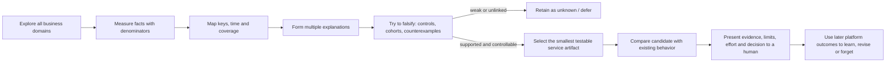
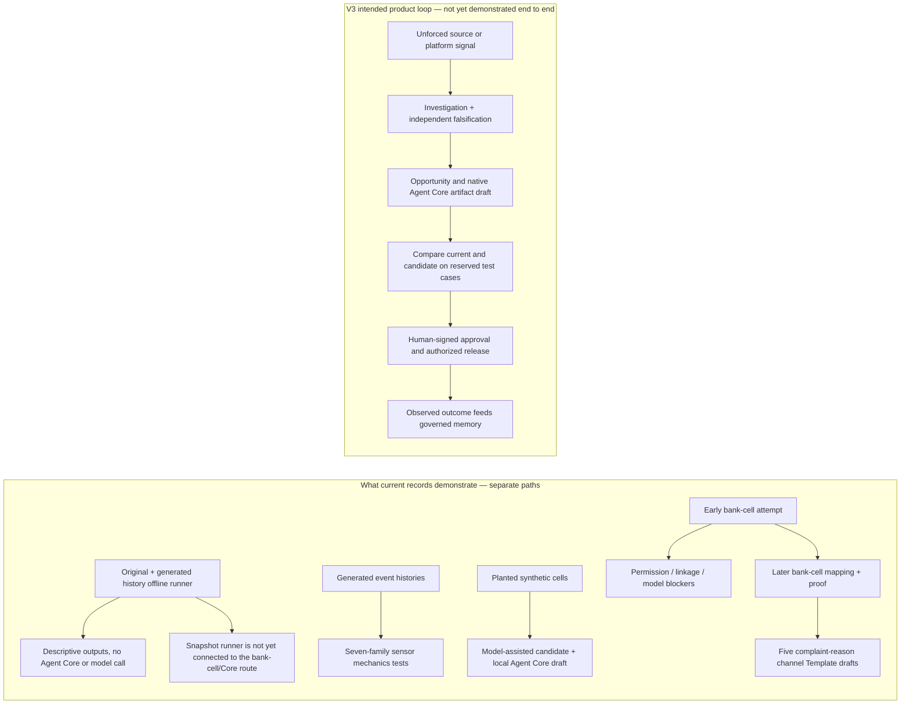

# 2. From a service pattern to a governed proposal: what has run

This chapter separates recorded exercises that are easy to confuse. The bank dataset supplied for the hackathon is synthetic. One test mode creates deliberately planted groups to check whether the detector and proposal path responds to a pattern we already know is present. Neither is live bank data. A separate generated, more detailed interaction-history sample is called “E0” in engineering notes; this is only an internal label, not a product feature or a real event log. **V3** means version 3 of our product/technical specification: it describes the target engine, not proof that the complete target is built. Claims about what code exists refer to GitHub `main` at commit [`fc56b598`](https://github.com/pulso-factored/improvement-engine/commit/fc56b598b1be483a6b1eb7ee6fac0d9809c3b646), checked 5 October 2026; separate local exercises are identified as such.

## The origin story: what the EDA taught us

The first step was not “build an agent.” We performed exploratory data analysis (EDA): an analyst's initial examination of the thirteen supplied banking domains to establish what happened, which records and dates could be linked, and which explanations survived comparison. The source trail is in the [integral bank EDA](references/eda/factored_banco_eda_integral.pdf), the [contact and experience report](references/eda/factored_contacto_experiencia_eda.pdf), and the [earlier storytelling edition](references/eda/factored_eda_storytelling.pdf). These synthetic files support an analytical exercise and test design—not claims about actual bank customers or performance.

### What we saw—and what we did not infer

| EDA observation | What it means for the business | What it does **not** prove |
|---|---|---|
| 686,296 contact rows; the largest reason family was transaction-related (240,056; 91.5% carried the contact-level “resolved” flag; 3.4-minute median). Complaint-related contacts (*Queja*, the dataset's label for complaints) were 117,021 (17.1% of contacts), with 43.6% marked resolved on that row and a 7.2-minute median. They made up 66,000/160,266 (41.2%) of all contact rows marked unresolved. | High volume alone is not the best automation target. The complaint family represented a disproportionate share of the unresolved-contact pool. | The source field `was_resolved` means “this contact row was marked resolved”; it is not a full interaction history. `False` does not prove the case remains open or that a repeat contact happened. |
| Complaint-related contacts had customer satisfaction (CSAT, a 1–5 rating of the interaction) 2.43/5 (21,843 responses) and Net Promoter Score (NPS, promoters' share minus detractors' share) -85.3 (10,821 responses); only 18.6% of all contacts had a CSAT response and 9.3% had an NPS response. | The observed experience is a strong investigation lead and gives a reason to examine complaint handling. | Survey respondents are not the full contact population; these are not representative bank-wide estimates. |
| The dataset contains 67,095 PQR (*petición, queja o reclamo*: customer request, complaint or claim) records; 74.9% were `Open`, `In Process` or `Escalated`; 20.1% (13,495) carried a service-level-agreement (SLA) breach flag, meaning the recorded service target was missed. The five largest subcategories were tightly grouped (11,886–12,297 cases each). Where dates existed, median first response was 38 hours (40,853 records) and median resolution was 16 days (15,349 records). | There is measurable status and timeliness friction worth understanding, but no single complaint subtype dominates the observed volume. | The status snapshot is not a transition history. Missing date coverage and absent cause links prevent a complete service timeline or causal claim. |
| The source field `origin_interaction_id` (the identifier that should directly link a PQR to its originating contact) was populated for 0/67,095 PQRs in the audited local copy. Conservative temporal checks found a digital error before 0.16% of technical-support contacts versus 0.15% of all contacts; a declined transaction before 0.14% of transaction-related contacts versus 0.14% of all contacts; and contact→PQR within seven days at 2.87% versus 2.85% for a date control. | Joins and temporal patterns are useful to formulate questions, but weak linkage must make the engine less confident, not more imaginative. | These comparisons do not establish that app errors or declines caused contacts, or that a contact caused the PQR. |
| 221,234 transactions were marked declined (5.0% of 4,425,008). Digital events included 358,723 `Error` events (2.3% of 15,620,994). | These are broad operational signals with potentially large denominators; they should be segmented by valid task, outcome and support context before proposing a fix. | An error is not necessarily a blocked task; a declined attempt is not necessarily a lost sale. |
| In the later contact EDA's corrected definition, 12,402 customers had an active credit product at 30+ days past due and positive current balance; 90.8% still had an approved transaction in the preceding 90 days, and 74.7% transacted on another product. | “In arrears” and “inactive customer” are not synonyms. A useful system must reason over behavior across products instead of treating a status flag as an explanation. | Transaction activity does not explain why an installment was missed, show a payment due, or establish that collection treatment will work. The earlier integral report used a different arrears cut (including 13,242 active 30+ products); we use the later customer-level/positive-balance definition here and do not mix counts. |
| Campaign sends recorded 9,799 tagged conversions among roughly 1.75 million sends. | Campaigns create a measurable funnel to explore. | There was no control group; a tagged conversion is not incremental lift, a new lead, or profit caused by marketing. |

The detailed EDA also tried to put business scale around possible actions. In one explicit 12-month scenario, three-country complaint handling was about USD 7,032 of **staff capacity** (not cash savings), while a selected activation scenario was about USD 7,954 gross contribution before messaging and fixed costs. In Mexico, one short-message (SMS) per eligible person left USD 6,243 after the modeled message charge, while five messages made the scenario USD 603 negative. The comparison used assumed product contribution, activation rate, wage/capture factors and public list prices; none was measured bank economics. These estimates helped compare plausible mechanisms and effort, not establish an intervention winner. The lesson was not “the EDA proved the winning intervention”; it was “the bank needs a system that can keep searching, expose weak links and unknown outcomes, and compare each proposed change against current behavior before anyone calls it value.”

### Why the EDA did not yield one universal “top priority”

The reports asked related but different business questions, so their rankings are complementary rather than contradictory:

| EDA lens | What it prioritized | Evidence and decision limit |
|---|---|---|
| Whole-bank economics | Selective activation first as a relatively cheap scenario; service efficiency as capacity; delinquency as potentially large but more difficult/uncertain to capture | The USD values are assumption-driven 12-month scenarios. Exposed arrears balance is not a loss or recoverable benefit; overlapping mechanisms should not be added. |
| Contact/experience | Complaints and technical-support contacts as the strongest visible unresolved-contact pain; narrow transaction-dispute intake as a prototype candidate | These two categories account for 60.5% of contact rows marked unresolved in that view. Transaction records are searchable, but a transaction was not directly linked to each PQR/contact; a scenario can test intake mechanics, not prove it prevents a complaint. |
| Product we chose to build | A general engine that can discover and compare opportunities across service, product, payment, collection, campaign and platform operations | A fixed activation flow or complaint agent would hard-code one report's priority. The engine instead preserves the analyst's reasoning, evaluates evidence, controllability and effort, and can return “not enough evidence” or “make no change yet.” |

This distinction is central to our product story: we did not ignore the EDA's candidate interventions; we turned the analytical method that produced and challenged those candidates into the product. Which individual opportunity the engine should advance is a result of evidence, value assumptions, ease/risk and available artifacts—not a constant embedded in the product.

### From analyst workflow to product behavior

The analysis workflow became the product's intended reasoning contract:

The key product decision was to generalize this method rather than encode the EDA's first prominent problem as a fixed complaint solution. A recurring, deterministic interaction path may justify a **Flow** (an explicit decision path); a bounded classification or routing decision may fit **Jev** (Agent Core's structured decision model); a repeatable wording issue may fit a **response Template**; genuinely flexible multi-step work may call for an **Agent**. These are possible outputs selected after investigation, not a commitment to create an agent for every pattern. A response Template is reusable wording with named fields that must be populated from verified data. This is how an EDA that began with service data leads to a system that can improve any supported service capability, including the platform's own operational behavior.

**Value we can credibly claim today:** Pulso turns a multi-table analytical question into an auditable candidate-change workflow, and its current separate tests exercise pieces of that workflow. We cannot yet claim that it has reduced PQRs, improved NPS, recovered debt or increased revenue. The product value we are building toward is a shorter, repeatable path from a newly observed service pattern to a falsifiable, governed improvement—with evidence and uncertainty visible at every step.

## Why show this example?

A chart can show that one category has an unusual rate. The product question is harder: can Pulso preserve the evidence, test whether the pattern repeats, suggest a specific service change, check it against the existing behavior, and stop before a customer-facing release? Complaint status is a useful **illustrative workflow** because the dataset contains status fields and the local Agent Core registry already contains a response-template artifact that can be revised. We did not choose it because the analysis proved it was the bank's highest-value problem or a root cause. It provides a bounded example of a candidate, test and draft. The early blocked bank-data attempt, later template-mapping runs, and planted synthetic test are separate runs—not one seamless discovery.

**PQR** means a customer request, complaint or claim (Spanish *petición, queja o reclamo*). In the example, the rate counts records marked `Open`, `In Process` or `Escalated` in the numerator and all included complaint records in the denominator. A blank or unfamiliar status remains in the denominator but not the numerator. Some records contain service-target and date fields, which allow response/resolution-time descriptions for those records; the dataset is still a snapshot, not a complete history of every status change. The open-status share itself does not measure duration.

## Evidence card: distinct proofs, distinct claims

| Recorded exercise | Input | What the record says happened | What it supports—and what it does not |
|---|---|---|---|
| Earlier bank-data attempt | 7,995 privacy-treated aggregate metric rows—group summaries, not individual customers—from the supplied hackathon snapshot (dated 2026-06-18; groups below 10 were suppressed) | The run examined four of 19 patterns that passed a repeatability gate. The code consistently assigned customers to a discovery group or a reserved check group using a one-way fingerprint of each customer ID; the same pattern had to appear in both. Two proposed new agents stopped at a local Agent Core permission boundary; one pattern had no supported service component to change; one was blocked when a language-model provider was unavailable. No proposal was announced. | Shows why permission, mapping, and provider failures must remain visible. It is an earlier iteration. Repeating a pattern in two portions of the same synthetic dataset is not confirmation from an independent source, human verification, or proof of cause. |
| Later bank-data mapping runs | The same supplied-data population: 7,995 treated group summaries; ten of the 19 repeatable patterns involved unresolved-contact rates | The mapping record documents local response-template drafts for complaint-related findings across Phone, Email, App, WhatsApp and Web Chat. Model attempts varied; some failed before later attempts produced drafts for the same target. These remained drafts; no release was authorized. Other patterns needing a new agent remained blocked by Agent Core authorization; some wording targets lacked a test generator. | Shows that aggregate patterns in the supplied synthetic data can lead to a narrowly scoped, tested local draft. Repetition in a reserved part of the same extract does not independently confirm the source, establish cause, prove that a complaint caused a contact, or show improved outcomes. The recorded run used a local development stack and Agent Core revisions noted in the run record, not a bank production system. |
| Deliberately planted synthetic test | 350 invented monthly group summaries—not 350 cases or customers—with one category's open-PQR rate deliberately raised | The documented run found the programmed repeatable difference, drafted a patch to an existing response template, ran regression/evaluation checks, and the local Agent Core registry confirmed that it stored the candidate as a draft. | Shows that a known-pattern test can exercise parts of proposal assembly. It does not show independent discovery, prevalence in bank data, customer benefit, or release. |
| Aggregate service-platform sensor tests | Generated histories of service-software activity with programmed effects | Seven categories of activity were tested separately; all 13 detections that passed the repeat-pattern check in this exercise came from deliberately planted effects. | Shows sensor mechanics on test histories only; this code path was not connected to a complete autonomous engine run in the pinned code snapshot. |
| Original/enriched-history snapshot runner | Original tables and the separately generated interaction-history sample, processed offline | Deterministic descriptive outputs and recurrence observations; no model provider, Agent Core or network call. The generated sample can produce structured records that prepare a future investigation, but these are not model-produced proposals and are not executable changes. | Shows repeatable source handling/projection, not native candidate authoring or autonomous Agent Core execution. |

Here, **“repeat-pattern check passed”** means a measured difference appeared again in data held back from the initial discovery step. For the deliberately planted test, the generator planted the same effect in both portions. For the bank-data scan, the splitter consistently assigned each customer to a discovery or check group using a one-way fingerprint of that customer's ID. These are repeatability checks within one synthetic dataset; neither is independent operational confirmation or proof of cause.

There is also a separate **human-approved new-agent lifecycle simulation**: a deliberately planted technical-support/phone finding produced a draft agent. The existing version failed all six test cases selected for that scenario. A person then evaluated and approved the draft, moved it into the simulation's staging state, and activated it under a local alias named `prod`. That alias existed only inside the test rig; nothing was deployed to a bank. More importantly, the rig had only been prepared with an incorrect-charge case type, while the finding concerned technical support. It proved that the simulated approval and version-lifecycle steps can run, **not that the new agent was routed correctly or gave a successful customer response**. See the [synthetic new-agent lifecycle record](https://github.com/pulso-factored/improvement-engine/blob/fc56b598b1be483a6b1eb7ee6fac0d9809c3b646/docs/dev/AGT1_NEW_AGENT_PATH.md); `AGT1` is only the engineering record's filename prefix.

## V3 target example: how one signal becomes a governed change

**This is an illustrative target walkthrough, not a single recorded run.** It uses the status-template idea from the separate planted demo to make the product mechanics tangible; the current dataset does not establish that unclear status caused repeat contact.

1. **No one chooses the answer in advance.** A scheduled scan fixes one approved data snapshot and one settings revision. The internal console shows what triggered the run and which exact input versions it used.
2. **A detector reports a measured signal, not a root cause.** It carries the numerator, denominator, time window and comparison. A status snapshot can show that records remain open; by itself it cannot explain why.
3. **The investigator explores.** It asks read-only questions inside a privacy-treated workspace: which groups differ, are record links complete, was status available before contact, and does the pattern repeat in a separate data group? A query receipt records which questions were asked and against which approved source version.
4. **A verifier tries to break the story.** It challenges the denominator, checks missing links/time leakage and offers alternatives such as workload mix or a stale snapshot. If complaint-to-contact linkage is absent, the causal claim stays `unlinked`.
5. **Only a supported mechanism becomes an opportunity.** If evidence supports testing clearer status wording—but not claiming fewer complaints—the system can compare “do nothing” with a narrowly scoped template change. If the actual gap is a deterministic branch or bounded category decision, it may choose a Flow or Jev artifact instead.
6. **Agent Core receives a draft in its own format.** Pulso keeps the evidence and rationale; Agent Core stores the versioned response Template, Flow, Jev decision model, or Agent. These are distinct service building blocks, not one generic “agent” file.
7. **The candidate is tested against the existing version.** The console shows the exact candidate fingerprint (a hash that changes when the artifact's content changes), the test suite, passes/failures, and any missing expected result. Correct file format, behavior in a simulator, and customer benefit are three different claims.
8. **A person sees the evidence and a specific decision request.** The draft cannot publish itself. Approval applies to the exact tested fingerprint; a changed draft needs to be checked again. Otherwise it is rejected, revised or remains blocked.
9. **Only later operational evidence closes the loop.** If an authorized serving platform emits valid linked outcomes, the engine can measure the mechanism, revise governed memory and schedule another scan. Without that feed, it shows the missing connection instead of claiming impact.

**What is proved today?** Separate records show repeatable processing of the original tables and the generated interaction-history sample, sensor tests on generated service-platform events, narrow bank-data-to-template drafts, a deliberately planted synthetic template test, and a human-approved new-agent lifecycle inside a local simulator. No single recorded run proves all nine moments together. The inputs and limits are shown in the evidence card above.

## The planted example, in plain language

Why do 350 rows represent thousands of generated observations? Each row is one monthly group summary for a comparison split and PQR category: 35 months × 2 splits × 5 categories = 350 rows. Each summary stores an invented numerator and denominator; the reported rate adds those counts across months. The generator deliberately planted the higher rate in both the discovery and generated replication split, so this is a repeat-pattern check—not generalization to naturally occurring cases. In discovery, the “improper charge” category (*Cobro indebido*) is 4,095/6,610 = **62.0%**; the other four categories combined are 8,663/26,460 = **32.7%**. In the replication split, the planted category is 4,034/6,508 = **62.0%** and the other categories are 8,699/26,351 = **33.0%**. These counts are reproducible from the checked-in synthetic generator (default seed 7), not customer-level source rows. The runbook reports an uncertainty interval and a multiple-comparison-adjusted test; those calculations do not turn invented inputs into observed bank evidence.

The language-model-assisted proposal generator drafted a small patch to an existing PQR-status response template: instead of only saying the request was checked, the Spanish and Portuguese replies would include its current status. This is a **test hypothesis**, not an explanation discovered by the data. A person who does not know whether a complaint is still open might contact support again; showing a verified status is a low-risk change to test for that mechanism. The generated scenario did not measure repeat contacts or test whether uncertainty caused the high rate. The wording cannot itself close a complaint.

The planted test defines **8 target cases** (cases intended to exercise the proposed status wording) and **3 guard cases** (other cases that should remain safe and unchanged). It reports that the original wording failed all eight targeted wording checks, while the candidate's status field rendered against test data and passed the configured regression check. We do not claim that the candidate ran against an 11-case baseline; a similarly sized Agent Core smoke suite is a separate test and cannot be substituted. The local registry contains the candidate only as a draft. No person approved it, no actual service was changed, and no customer or financial outcome was measured. When platform credentials are absent, the announcement step only prints what it would send; it does not notify the real customer-service platform.

## Why the bank-cell path matters—and what changed across iterations

The first capped bank-cell run did not announce a proposal: new-agent candidates hit a permission boundary, another finding lacked a supported artifact mapping, and a model call failed. Later bank-cell iterations changed the outcome for the complaint-reason cells by mapping them to an existing response template and requiring a regression proof before writing a draft. This is the product learning loop in miniature: early blockers were evidence about the proposal route, not reasons to disguise failure; a narrower artifact choice and a real proof unlocked five channel-specific drafts. The other findings did not become solved just because one route worked.

The [bank-cell mapping record](https://github.com/pulso-factored/improvement-engine/blob/fc56b598b1be483a6b1eb7ee6fac0d9809c3b646/docs/dev/MAPPING.md) and [demo-loop record](https://github.com/pulso-factored/improvement-engine/blob/fc56b598b1be483a6b1eb7ee6fac0d9809c3b646/docs/dev/DEMO_LOOP.md) contain different runs and iterations. The evidence supports the narrow bank-aggregate-to-tested-template-draft result, not a joined path from the offline original/enriched-history runner, not action on every finding, and not customer impact. The early bank-cell attempts used a local Agent Core scratch revision; that runtime provenance matters for reproduction.

## V3 target flow versus current joined path

The split diagram is deliberate: arrows within the V3 box are a target contract, not evidence that today's separate runs are joined. The most important product value remains the target: discover a meaningful problem without a person selecting it in advance, then prepare a testable service-capability improvement with enough provenance for a person to govern it.

## Further technical detail

## Why outputs are not “always an agent”

The product's output is whichever smallest Agent Core-native change the evidence and service boundary can support. Choosing the wrong artifact can be as harmful as detecting the wrong signal: a missing deterministic check does not need a new conversational agent, and a bounded category decision does not need free-form generation.

| What investigation supports | Likely output to evaluate | Why that is the smallest useful change | Example of what can still block it |
|---|---|---|---|
| A known fact-check/branch is missing or ordered incorrectly | **Flow**: a predefined sequence of steps and branches | It is inspectable and repeatable for a stable path | Required source field or authorized action is not available |
| A bounded classification or decision boundary is unreliable | **Jev decision model**: structured inputs, decisions and outputs | It handles a constrained decision without inventing an open-ended conversation | No labeled, valid confirmation cases or unresolved policy ownership |
| The outcome is right but repeated wording is unclear | **Template** or bounded **Prompt** change | It changes only the response surface and can preserve verified variables | No supported variable binding, language coverage or discriminating suite |
| Work spans uncertain steps but existing skills/tools and authority suffice | **Agent** or an agent plus a Flow/Template | Flexible reasoning is reserved for work rules cannot express cleanly | New-agent release settings, runtime capability, safety suite or routing is missing |
| Several changes are jointly needed | A composed **Flow + Jev + Agent/Template** package | Real service paths can cross deterministic, bounded and generative layers | Each component and the composed path needs its own tests and version lineage |
| No supported mechanism, service-component mapping or proof exists | **Make no change yet / investigate / ask a human owner** | A pattern is not permission to invent a change | This is a deliberate safe outcome, not a detection failure |

These categories are design guidance, not a hardcoded one-to-one rule. The current bank-cell record demonstrates a narrowly mapped Template candidate; the separate synthetic rig demonstrates a new Agent lifecycle with an important domain mismatch. Neither establishes that all these output types are fully connected to the general detector.

### The engine should discover across the EDA's opportunity portfolio

The original analysis gives us candidate spaces to test, not a fixed backlog that Pulso should always repeat. Each opportunity has a different evidence weakness, artifact fit and cost of being wrong.

| Opportunity space | What the EDA actually measured | Candidate mechanism/artifact to investigate—not auto-assume | What would have to be true before claiming value |
|---|---|---|---|
| Complaint/PQR follow-up | 117,021 complaint-contact rows (*Queja*); 43.6% carried `was_resolved=True`; PQR status/SLA fields; no populated origin-interaction key in the audited extract | Improve intake/triage Flow or verified-status Template; the recorded bank-cell run has a narrow mapped Template proof | A valid link or defensible outcome cohort must show that the intervention reduces repeat effort or improves safe resolution; status wording does not itself resolve a case |
| Technical support | 102,899 technical-support contacts (*Técnico*); 30,940 marked unresolved; digital events exist, but temporal error/contact comparison was near the control rate | Investigate a bounded classification (Jev) or technical-support Flow; potentially an agent only if the task genuinely needs flexible reasoning | Establish that the relevant event preceded a specific task failure, identify an action the service can control, and test escalation/safety as well as resolution |
| Transaction/dispute intake | 240,056 transactional contacts; 91.5% marked resolved and 3.4-minute median; 221,234 transactions marked declined | A deterministic lookup/intake Flow or Jev routing decision can be tested on ambiguous, declined and dispute cases | A decline must represent a real unresolved task, not a retry that succeeded; no transaction/PQR exact link means no prevented-dispute claim |
| Digital completion | 17.4% of observed sessions contained an Error; 46,828 sessions contained both Error and Purchase, with sequence order not established in the aggregate view | A Flow or approved tool boundary only if a verified, authorized task step is missing; sometimes the correct owner is the digital platform, not Agent Core | Show the error's position before task abandonment and compare completion against appropriate sessions; event count alone is not lost revenue |
| Growth and activation | 1,746,801 campaign sends and 9,799 tagged conversions (about 0.56%); no untreated comparison | Eligibility explanation/activation support Template, Jev or Flow depending on the real service gap | Incremental conversion must be separated from customers who would convert anyway; subtract message and servicing costs |
| Delinquency/servicing | Large balances and active-30+ cohorts; the reports use different cohort definitions; many overdue customers still transact | A narrow servicing/eligibility Flow can be explored before any collections-agent proposal | Balance is neither loss nor recoverable cash. Show payment/outcome evidence, authority, harm safeguards and execution difficulty; the initial EDA judged late-stage recovery harder than selective activation |

The EDA's recommendation to consider transactional-dispute intake and its separate whole-bank scenario ranking of activation are not contradictory product requirements: one is a service-prototype choice; the other compares modeled economic potential and capture effort. Pulso's job is to surface the strongest current opportunity under an explicit objective and evidence base, not to force either report's first recommendation on every future run.

For the lifecycle and exact evidence-strength rules, see [Evaluation and sandbox](technical/06-evaluation-and-sandbox.md), [Detection and evidence](technical/04-detection-and-evidence.md), and [Proposal and Agent Core integration](technical/05-agent-core-integration.md).
