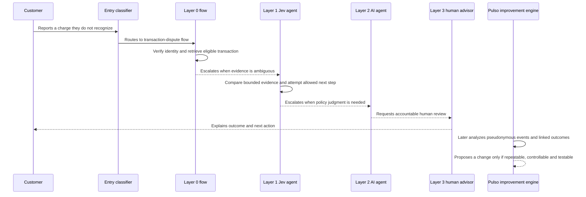

# 10. The service as a learning source: target design and present limits

## Why the engine needs a second evidence stream

The bank tables answer questions such as “which customers had an overdue product?” or “which contact reason had a low row-level resolution rate?” They describe business state, but they usually do not show how the service system reached that state. A governed support platform can produce a second kind of evidence: what each layer attempted, what it could access, where it handed work off, what it returned, and whether a later authorized outcome followed.

That operational evidence is central to Pulso's product idea. It can reveal repeated friction inside the service—not only in the bank's customer and transaction tables. A pattern might be “the classifier repeatedly routes a narrow intent to a general agent,” “the deterministic flow safely resolves a case but escalates because one read-only check is missing,” or “the AI agent asks for the same fact that the human advisor then obtains from an existing tool.” These are candidate explanations to test, not automatic proof that one layer should replace another.

> **What exists today:** the repository has a versioned platform-event contract, simulator, read-only exporter, ingest fixtures, internal debug-console foundations and generated seven-family sensor tests. These are local/synthetic or contract-level pieces; the pinned implementation status says they are not a live four-layer feed connected to autonomous Pulso reasoning. The recorded human-gated synthetic new-agent lifecycle is separate and had a technical-support/incorrect-charge type mismatch. See [current implementation and proof boundaries](07_current_status_and_pitch.md), the [platform contract](https://github.com/pulso-factored/improvement-engine/blob/fc56b598b1be483a6b1eb7ee6fac0d9809c3b646/platform-contract/README.md), [simulator](https://github.com/pulso-factored/improvement-engine/blob/fc56b598b1be483a6b1eb7ee6fac0d9809c3b646/platform-sim/README.md), [exporter](https://github.com/pulso-factored/improvement-engine/tree/fc56b598b1be483a6b1eb7ee6fac0d9809c3b646/platform-exporter), [open gaps](https://github.com/pulso-factored/improvement-engine/blob/fc56b598b1be483a6b1eb7ee6fac0d9809c3b646/docs/gaps/OPEN_GAPS.md), and V3 §§24 and 32. This is not evidence of real operational telemetry.

This chapter defines the target learning story and evidence contract to build. Agent Core is the separate registry/runtime for service artifacts that Pulso would propose changes to; V3 is Pulso's canonical technical specification. Every journey below is illustrative unless explicitly labelled as a current recorded proof.

## The four service layers leave different traces

| Service layer | What it is responsible for | Useful operational evidence | A misleading conclusion to avoid |
|---|---|---|---|
| **Layer 0 — deterministic decision flow** | Stable checks, branch conditions and authorized read/action steps | Node reached, condition result, data dependency, action attempted, action result, stop/escalation reason | “The flow failed” when it deliberately escalated on missing data or policy authority |
| **Layer 1 — bounded Jev agent** | An AI agent whose decisions are constrained by Jev, the platform's structured decision-model capability, plus a bounded task contract | Input/output contract version, selected capability, tool request/result, validation result, completion or handoff | “The model solved it” when the tool failed or the final answer was not validated |
| **Layer 2 — general AI agent** | Work requiring broader reasoning or composition beyond the bounded layer | Context/capability versions, model route, tool outcomes, claim checks, retries, refusal and handoff | “More reasoning is better” when a deterministic check or missing authority is the actual issue |
| **Layer 3 — human service** | Judgment, policy interpretation, exception handling and accountable decisions | Queue and owner, wait/handling intervals, decision category, permitted actions, disposition and review outcome | “The human is slower” without adjusting for case complexity, queue load and selection into escalation |

Classifier details are observable **only if the relevant source/export contract emits them**. The current Phase-1 support-platform profile lacks intent and routing-step fields, so route accuracy is `unsupported` there. A full internal EngineEvent export may carry richer decision detail than a public outbound event; do not assume those contracts are interchangeable. Classification is entry routing, not a fifth resolution tier. When routing is wrong, downstream layer metrics can look poor for the wrong reason.

## Keep business events, traces and customer outcomes separate

The engine may join evidence only when the source contract supplies an authorized, stable reference for that join and an explicit time window. The support platform may carry customer identifiers in some records, and Agent Core event contracts differ by event family; however, V3 does not assume an approved crosswalk to the bank dataset's customer key. Cross-source identity therefore remains `unknown`/`unlinked` unless an authorized mapping and provenance are supplied. Sequence/cursor guarantees are source-specific, and some events are ordered only within a run. Three records answer different questions:

1. **Business event:** what happened in the service domain—for example, a case was escalated or a PQR status changed.
2. **Execution trace:** what the software did to produce that event—spans, retries, model/provider calls, tool results, timings and errors.
3. **Outcome observation:** what later happened to the customer task—repeat, reopen, or unknown—under a defined observation window. A closed case is not automatically a safely resolved task.

A trace ending successfully is not a customer outcome. A later contact is not necessarily a repeat of the same task unless the linkage and matching rule support that claim. Metrics, logs and traces help explain execution; source-table facts and linked outcomes support business claims. The debug console should show the join quality and the uncertainty beside the conclusion.

### Minimum useful event envelope

Each emitted operational record should carry enough stable metadata to reconstruct a run without copying raw conversation content into every telemetry system:

| Field group | Availability/owner | Examples | Why it matters |
|---|---|---|---|
| Source event identity | **Per-source contract** | tenant/source namespace, event ID, event time, nullable sequence/cursor, contract version | Deduplicate and order only within guarantees the source actually provides; some sources have no sequence, and ordering may be run-local |
| Interaction/run lineage | **Optional; source contract or Pulso-derived only under an authorized mapping** | pseudonymous interaction ref, run/trace ID, parent span (one recorded step inside a trace), external episode ref | Platform customer identifiers may exist, but no approved crosswalk to the bank dataset's customer key is assumed; absent provenance remains `unknown`/`unlinked` |
| Execution context | **Often Pulso-derived or future capability** | mapped layer, agent/flow version, artifact digest, classifier contract, model route class | Compare behavior across versions; LayerMapping is versioned and may return `unknown` |
| Decision/result | **Allow-listed source fields plus Pulso normalization, only where supplied** | intent code, route, tool/action type, normalized result, handoff/stop reason | Build measurable transitions without embedding customer text; unsupported fields stay unsupported |
| Timing/reliability | **Mixed** | source event time; derived durations/retry counts; timeout/error class | Separate measured clocks and failure classes; do not invent a global total order |
| Evidence/governance | **Pulso-derived when evidence exists; otherwise unavailable** | outcome-link method, coverage, policy/config revision, authority result, approval ref | Explain uncertainty and why action was allowed, denied or held |

This is not a mandate to log every prompt or payload. Raw text, account values, credentials and unrestricted tool arguments should not be copied into general observability. The system should prefer structured reason codes, scoped references and redacted or separately governed artifacts. Retention and access follow the data-classification policy; telemetry is not a bypass around it.

An example partial event keeps missing values explicit. It is explanatory—not a copied wire payload:

```json
{
  "schema_version": "platform-observation.v1",
  "tenant_id": "tenant-demo",
  "source_namespace": "platform_live",
  "event_id": "evt-0042",
  "sequence": 42,
  "event_time": "2026-10-05T12:00:00Z",
  "subject_kind": "case",
  "case_ref": "case-pseudo-17",
  "interaction_ref": null,
  "run_id": null,
  "layer": "unknown",
  "event_type": "case.closed",
  "close_reason": "customer_unresponsive",
  "resolved_outcome": "unsupported",
  "source_contract": "platform-live.phase1.v1"
}
```

The Phase-1 source has `close_reason` but no verified `resolved`/`resolution_code`; an absent `interaction_ref` or layer mapping must not be silently filled from a guess.

## An end-to-end learning example

**V3 target scenario, not a recorded run.** Consider a hypothetical incorrect-transaction-charge request. It demonstrates how evidence from the service platform can reveal an automation opportunity without presuming which layer is at fault. The separate current synthetic new-agent proof and its routing mismatch are documented in [chapter 7](07_current_status_and_pitch.md).



The valuable finding may not be “automate more.” It might be that the flow lacks a read-only transaction check, the classifier confuses a dispute with a billing question, Jev cannot access one permitted signal, the general agent repeats work already performed, or the human queue has a long wait for a specific safe exception. Each implies a different smallest intervention: a Flow node, a `DecisionModelDef` (the structured decision artifact Jev runs), a Template (reusable response wording), an Agent configuration, a routing update, an observability fix—or no platform artifact because the real owner is another system.

### How this source enters the engine's general discovery loop

The [previous chapter](12_how_pulso_chooses_what_to_improve.md) describes the general signal→investigation→verification→artifact-selection path. Service-operation events add a distinct input path:

| Telemetry stage | Pulso behavior | Evidence boundary |
|---|---|---|
| **Ingest** | Read a versioned platform batch or durable event-log cursor; deduplicate by the source's declared identity; retain late/gap/unknown status | Do not pretend every OTel span is a durable platform event. Span sampling is not a population denominator. |
| **Normalize** | Convert only allow-listed source events into an `InteractionObservation`; attach source/contract refs and a versioned layer mapping where available | Customer IDs in the platform are not a bank crosswalk. Missing interaction refs, layer or order remain unknown/unlinked. |
| **Measure** | Compute only metric families enabled by the source capability profile; report coverage and eligible denominator | Phase 1 cannot support AI/tool/human-resolution/CSAT measures it does not emit. Absent event ≠ zero events. |
| **Hand off** | Publish eligible signals into the same governed prioritization and investigation queue as bank-data signals | The common engine then applies the evidence, value, controllability, proof and risk rules in chapter 12; telemetry does not bypass those gates. |

Passing a later candidate test means it behaved better on specified evaluation cases, not that production users improved. A business-outcome claim needs an eligible population, exposure record, time horizon, comparison design and guardrails; absent those, show **impact unknown**. Phase 1 must return `unsupported` or `insufficient_human_evidence` for AI-layer, tool, identity, verified-resolution and CSAT families the source cannot provide.

## Make layer efficiency measurable without gaming it

One headline “automation rate” hides important differences. Every metric needs an explicit definition and source-capability check:

| Measure | Definition | Current Phase-1 platform profile |
|---|---|---|
| **Correct route rate** | Cases reaching the intended first resolver, with abstention/override reported separately | Requires versioned `origin`/`topic`/routing observations and a trusted expected-route label; absent, so return `unsupported` |
| **Safe completion rate** | Validated customer tasks completed without unauthorized action, repeat or unresolved state inside a defined observation window | Requires linked task outcome and resolution meaning. No `case_close.resolved` or resolution code; a closed case is not safe completion |
| **Handoff quality** | Handoffs per eligible case and whether the receiving layer had enough context to continue | Requires layer/routing and context-transfer events; unsupported until source adds them |
| **Resolution effort** | Elapsed time and active handling by layer; queue wait is separate from handling time | Queue/wait can be approximated from assignments/timestamps; per-layer handling requires LayerAttempt spans and a versioned layer map |
| **Tool reliability** | Success, timeout, refusal and invalid-result rates per tool and artifact version | Requires `tool_call` and artifact identity; unsupported in Phase 1 |
| **Customer guardrails** | Complaint/reopen/repeat-contact and survey measures, each with coverage/link caveats | Declared `previous_case_id` can support a narrow recontact measure; complaint origin, verified resolution and CSAT are absent |
| **Resource cost** | Model/provider, tool and compute cost per eligible and safely completed case | Requires provider/tool usage receipts; never infer cost from wall time. Missing cost stays `unknown` |

Do not optimize for fewer human handoffs alone. A healthy system may escalate more when risk rises, a tool is unavailable or a policy boundary is reached. It may also increase a successful low-risk Layer 0 flow while preserving human review for high-risk cases. Every efficiency metric needs a safety and customer-outcome guardrail.

## What this source can teach memory

A repeated tool timeout should be recorded at its supported scope—for example, “timeouts preceded escalation in this sandbox cohort”—not generalized to “this agent is bad.” Preserve the source profile, run, metric, time window, contrary cases and artifact/test that used the claim. Later evidence may support, weaken, supersede, expire or revoke it; it must not retroactively change the original evidence. The [memory lifecycle](technical/07-memory-lifecycle.md) explains revision and forgetting. The current recorded demos do not autonomously learn from a live four-layer service feed.

## What makes this different from ordinary observability

An observability stack tells an operator that a service was slow or errored. Pulso's improvement engine asks whether that execution pattern is a recurring service problem, which layer or artifact can change it, what evidence would disprove the explanation, how to evaluate a candidate safely, and what outcome would justify keeping it. Telemetry becomes a governed input to product evolution—not a dashboard that stops at red charts and not a license for an LLM to rewrite a live agent.

## Acceptance slice for the future implementation

The feature is not ready when events merely appear in a dashboard. Separate what can be tested in today's generated profile from what requires a stronger upstream contract:

| Slice | Verifiable in local synthetic profile | Additional capability before a production-source claim |
|---|---|---|
| Event lineage | Preserve supplied tenant, source cursor/sequence when present and run references; explicitly retain missing interaction/layer as unknown | Source supplies authorized stable cross-layer references; otherwise lineage remains unlinked |
| Ingestion robustness | Delayed, duplicate, out-of-order and missing fixture events are surfaced; retries do not inflate supported counts | Source sequence/backfill guarantees and a live exporter feed |
| Detection | A planted supported family reports numerator, denominator, period, version and coverage | Actual supported source profile; absent families remain unsupported |
| Falsification | Corrupt comparator/linkage/outcome definition and prove verifier rejects or downgrades the claim | Independently valid labels/outcomes for any human-resolution claim |
| Artifact selection | Flow/decision model/Template/Agent only with registered mechanism and regression generator; else explicit no-op | Real platform artifact and authorized execution contract |
| Candidate evaluation | Replay frozen cases with safety, correctness, latency and cost budgets; failure blocks draft announcement | V3 supports human publish to staging and whole-alias promotion, not real-user canary |
| Operator visibility | Console links signal→available trace evidence→candidate→tests→approval state without raw customer content by default | Published live control API and source feed; absent links stay visibly unlinked |
| Runtime reliability | Podman replay covers startup, crash/restart, concurrency and cleanup on fixture path | Operational runbooks/alarms and real source-service dependencies |
| Outcome loop | Test absent, delayed, contradictory and revoked outcome records; never turn absence into zero impact | Governed outcome link, defined observation window and comparison design |

The result is a new product capability: Pulso can improve not only the bank workflow it observes, but also how its own AI, deterministic flows and human escalation cooperate—while preserving the distinction between execution evidence, service outcome and causal impact. V3 does not provide customer canary: publication activates staging, promotion changes the complete `prod` alias, and rollback is a separate human-authorized action. A local rig lifecycle must not be presented as progressive production exposure.

## Connections to the rest of the guide

- [Origin story and current evidence](02_product_rationale_and_architecture.md)
- [Opportunity portfolio and value scenarios](09_opportunity_portfolio.md)
- [Data provenance and join limits](03_data_provenance_and_evidence.md)
- [Evaluation and honest metrics](05_evaluation_and_honest_metrics.md)
- [Technical detection and evidence contract](technical/04-detection-and-evidence.md)
- [Technical evaluation and sandbox](technical/06-evaluation-and-sandbox.md)
- [Technical observability/security operations](technical/08-security-and-operations.md)
- [Canonical V3 spec](../archive/source-record/2026-10-05/TECH_SPEC_PULSO_AUTOMEJORA_V3.md)
