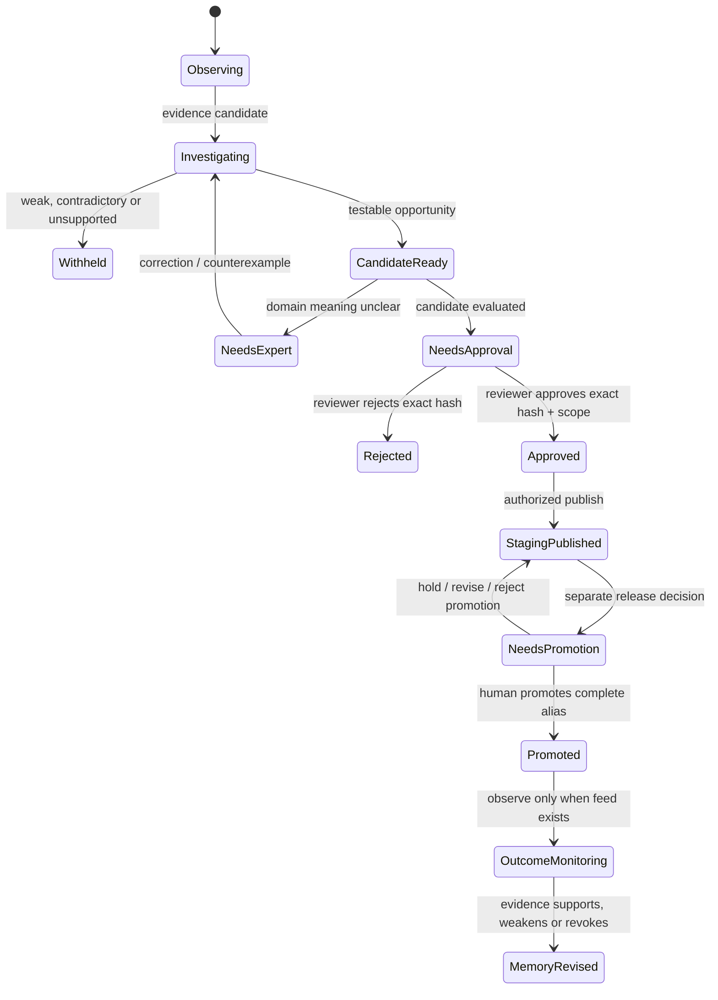

# 11. Human partnership: visible autonomy with very little busywork

## The product promise is not “keep a human in every loop”

Pulso should work continuously without asking an operator to choose which problem to find. Its value depends on the engine noticing patterns, checking them, building and evaluating candidate changes, then asking a person only when a human decision or domain judgment is genuinely needed.

That creates a product-design tension: **low interaction must not mean low visibility**. A quiet system that cannot explain what it is doing is not trustworthy; a system that sends an alert for every metric movement creates alert fatigue and trains users to ignore it. The experience should therefore separate routine autonomous work, useful visibility and consequential approvals.

This chapter defines that operator experience as a target. It is distinct from (a) the customer-facing support chat, and (b) the engineer-only debug console that exposes raw run stages, traces and failures. Some internal console foundations exist in the checked implementation; the complete insight and decision experience below is not yet demonstrated as one connected product surface.

## Three people, three different jobs

| Persona | What they know and own | What Pulso should ask of them | What Pulso should not make them do |
|---|---|---|---|
| **Service owner / operations lead** | Service goals, customer pain, capacity and operational priorities | Review a material opportunity, decide its priority or authorize a governed release when required | Inspect every run, interpret raw telemetry or manually select every dataset to scan |
| **Domain expert** | Product rules, exceptions, language and the practical meaning of a case | Correct a mistaken interpretation, state a domain constraint, contribute a counterexample or explain why a proposed mechanism is unsafe | Write an agent spec from scratch or approve a change without seeing evidence and tests |
| **Platform/AI engineer** | Contracts, runtime behavior, artifacts, evaluation, permissions and reliability | Debug a blocked run, inspect lineage, diagnose a dependency or review a candidate diff | Serve as the routine approver for every low-risk finding or infer business value from traces alone |

One person may fill several roles in a hackathon demo, but the interface should preserve the distinction between “I understand the business problem,” “I can authorize this release,” and “I can debug the runtime.”

## The operator's home is an opportunity inbox, not a wall of charts

The main surface should answer three questions at a glance:

1. **What deserves my attention?** A short ranked list of material, actionable opportunities—not every raw signal.
2. **Why does Pulso believe this matters?** Observed population, period, evidence strength, counter-evidence, value range, effort and uncertainty.
3. **What decision is needed from me, if any?** Approve a specific tested draft, correct domain meaning, reject/defer with a reason, or take no action because the system is still investigating.

```text
┌──────────────────────────────────────────────────────────────────────┐
│ PULSO · Improvement engine                         Last scan: 08:42  │
│ ILLUSTRATIVE UI DATA — NOT A RECORDED RUN                            │
├──────────────────────────────────────────────────────────────────────┤
│ Working quietly: 2 scans · 1 verification · 1 dependency blocked     │
│                                                                      │
│ NEEDS A DECISION                                                     │
│ Complaint-status explanation · medium evidence · low-risk draft     │
│ 5 channel groups · 18/18 illustrative checks │
│ Value: capacity scenario only · customer impact: not measured        │
│ [Review evidence]  [Ask domain expert]  [Reject]                     │
│                                                                      │
│ INVESTIGATING                                                        │
│ Digital task errors · error often co-occurs with purchase            │
│ Counter-check underway; not yet an opportunity                       │
│                                                                      │
│ BLOCKED                                                              │
│ Technical routing · source lacks an approved case-to-layer link      │
│ No customer data inferred; retry only after source/contract change    │
└──────────────────────────────────────────────────────────────────────┘
```

This mock is a proposed information hierarchy, not a screenshot of the current console. Its counts and test result are illustrative display data, not a recorded candidate outcome. It makes “working,” “needs a decision,” “investigating” and “blocked” visibly different states. It also prevents a status badge such as “high confidence” from hiding a missing join or an unmeasured outcome.

## The review card should let a person understand the case in minutes

Opening a proposed opportunity should present a decision dossier in a stable order:

| Panel | What the person sees | Why it belongs before the action buttons |
|---|---|---|
| **Plain-language claim** | One sentence: which outcome appears unusual, for which eligible group and time period | Replaces internal metric IDs and lets the reviewer correct a misunderstanding early |
| **Evidence and denominator** | Counts/rates, comparison, source versions, coverage, direct versus temporal links and suppressed groups | Makes scale and evidence quality visible; no “percentage” without its population |
| **What Pulso checked** | Alternative explanations, counterexamples, repeatability status and what remains unknown | Shows that investigation was more than a chart or a model's confident explanation |
| **Value and effort** | Low/base/high scenario, assumptions, captured value type (cash, margin or freed capacity), implementation difficulty and risk | Helps rank against other initiatives without pretending scenario value is realized value |
| **Proposed change** | Artifact type, exact before/after diff, target, version/hash and why smaller alternatives were rejected | Lets the reviewer see what changes in the service rather than approve an abstract “AI improvement” |
| **Evaluation** | Baseline and candidate cases, test outcomes, safety/latency/cost guardrails, missing oracles | Distinguishes “compiles,” “passes this test,” and “improves the bank outcome” |
| **Decision and consequences** | Exact requested action, authority needed, environment, reversibility, expiry and what happens after approval | Makes the scope of the human decision explicit and prevents approval from being mistaken for publication |

For a draft template, for example, the decision is not “approve the AI.” It is: **“Approve this exact template version for publication to staging?”** The card binds approval to the candidate's hash—a fixed fingerprint of its exact contents—so a later edit needs a new decision. It must also say that staging is not customer exposure, that promotion to the complete `prod` alias (the platform's live-version pointer) is a separate human-authorized action, and that current V3 does not support a customer canary (a gradual rollout to a percentage of real users).

## Human input is structured knowledge, not a substitute for evidence

People should be able to improve the system by correcting a domain assumption, adding an exception case, linking a known policy owner, explaining that a source field has a different business meaning, or marking that a candidate addresses the wrong controllable surface. These contributions should attach to the specific finding, evidence version and artifact proposal they concern.

The system should not turn an unqualified comment into a universal rule. A human note can be classified as:

- **Interpretation correction:** “this contact code means account access, not a failed transaction.”
- **Scope boundary:** “do not apply this pathway to a disputed amount above the delegated threshold.”
- **Counterexample:** “the same symptom is expected during the scheduled maintenance window.”
- **Evidence pointer:** “the authorized source for this status is the PQR registry, not the chat transcript.”
- **Decision:** “defer this candidate pending a policy owner” or “reject this exact candidate.”

Each item has an author/role, timestamp, scope, source reference, expiry/review rule and a provenance link. A correction may trigger a re-run or a new candidate; it must not silently rewrite source data or retroactively alter the recorded evidence. The details of append-only memory and forgetting belong to the [memory lifecycle](technical/07-memory-lifecycle.md).

## Notification policy: interrupt only for consequential work

| Event | Default surface behavior | Notify a person now? |
|---|---|---|
| Routine scan or successful background verification | Update activity/history; keep a compact progress indicator | No |
| Signal below support threshold or contradictory result | Save the reason and monitoring state; show in history | No, unless the configured materiality policy says otherwise |
| New plausible opportunity still under investigation | Add to “investigating” with next expected stage and evidence gaps | Usually no |
| Missing data/provider/dependency blocks progress | Mark blocked, state exact dependency and whether retry is safe | Notify only if human action can resolve it or the block threatens an agreed objective |
| Candidate passes technical gates and needs domain/approval judgment | Put in the decision inbox with evidence and exact candidate hash | Yes, to the authorized role |
| Candidate fails a safety, privacy, regression or cost guardrail | Stop promotion, retain the failure dossier and route to engineering view | Notify the accountable owner according to severity; never bury as “no opportunity” |
| Outcome signal changes a previous conclusion | Show the newer evidence beside the old claim and explain whether it supersedes, weakens or revokes memory | Notify only if it changes an active decision, release or material ranking |

The notification budget itself is configurable and versioned. Coalesce repeated events by tenant, issue and time window; do not emit one alert per row, span, retry or model call. Suppressing a notification must not suppress the underlying evidence or its audit record.

## Approval is a precise state transition, not a thumbs-up

The UI should distinguish these actions and their effects:



“Approval” cannot imply future revisions are approved. The approval receipt binds to a candidate hash, artifact type, environment, permission scope and policy/config revision. If the candidate changes, approval expires and a new decision is required. A reviewer may approve staging while explicitly declining production promotion; the UI cannot conflate them.

## Keep the judge demo honest about which screen they are seeing

| View | Intended audience | What it is for | Current status to disclose |
|---|---|---|---|
| **Operator opportunity inbox** | Service owner and domain expert | Understand candidate business opportunities, evidence, assumptions and requested decisions | Product target; do not present a debug fixture as a live operator inbox |
| **Engineer debug console** | Developers and SRE/AI engineers | Inspect runs, stage transitions, events, model/Core/tool calls, errors and traces | Internal backoffice foundation; some data/providers remain fixtures or stand-ins until the control API is connected |
| **Customer support experience** | Bank customer | Receive service through the separate support platform and its agent/flow stack | Not the Improvement Engine's interface; do not show Pulso internals to end customers |

The magical experience comes from showing both the calm operator view and, on demand, the detailed trace behind a specific claim. The main surface tells a business story; the debug console proves what the software actually executed. Neither should pretend the other has already been fully integrated.

## Acceptance slice: one insight from background run to human decision

Build this as a vertical product slice rather than a static dashboard:

1. A background run completes or blocks and updates the opportunity inbox without resetting its state or generating duplicate cards on retry.
2. A candidate card renders plain-language meaning, source period, numerator/denominator, evidence class, join coverage, assumptions, uncertainty and blocked dependencies.
3. The reviewer can inspect exact artifact diff, candidate hash, baseline/candidate results, guardrails and a clear separation among test pass, approval, staging publication and alias promotion.
4. A domain expert can attach a scoped correction/counterexample; it creates a provenance-bound memory candidate or rerun request and does not mutate source evidence.
5. Reject/defer/approve operations require the correct role and expected candidate hash; stale hash or changed policy returns a visible conflict and leaves the candidate unchanged.
6. Duplicate alerts are coalesced while the full run/evidence record remains queryable; critical blocked/unsafe conditions cannot silently disappear.
7. Product telemetry measures review usefulness and interruption cost only from available events; absent user feedback is unknown, not dissatisfaction or success.
8. Tests cover accessibility, keyboard navigation, empty/blocked states, large evidence dossiers, stale data, permission denial, retry and candidate supersession.

The result is a system that asks people for scarce judgment, accepts expertise in a structured way, and otherwise keeps working. Humans remain accountable for consequential decisions; they are not tasked with manually operating every step of autonomous detection and evaluation.

## Connections

- [Current build and demo proof boundaries](07_current_status_and_pitch.md)
- [Evidence-to-opportunity portfolio](09_opportunity_portfolio.md)
- [Governance and controlled automation](04_security_and_controlled_automation.md)
- [Evaluation gates](05_evaluation_and_honest_metrics.md)
- [Memory revision and forgetting](technical/07-memory-lifecycle.md)
- [Internal debug console and observability](technical/08-security-and-operations.md)
- [V3 product/approval flow](../archive/source-record/2026-10-05/TECH_SPEC_PULSO_AUTOMEJORA_V3.md)
