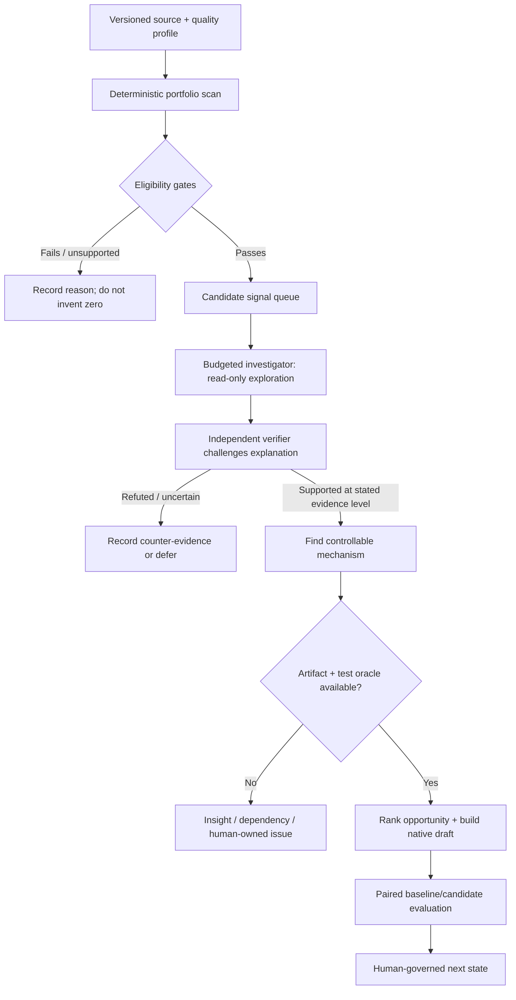

# 12. How Pulso chooses what to improve when nobody names the problem

## The central promise: discovery before prescription

The engine must not be a complaint bot with a large dashboard behind it. Its defining behavior is to search the authorized evidence it has, notice a pattern worth attention, decide whether the pattern survives challenge, determine whether the service can control a plausible mechanism, and only then propose the smallest testable change.

The hard product question is not merely **“what is the biggest metric?”** It is **“which next investigation can change a meaningful service outcome, given today's evidence, system control, evaluation ability, effort and risk?”** The answer can be a proposal, more investigation, a human-owned issue, a waiting state or a reasoned no-op.

This chapter explains the target decision behavior in V3—the canonical technical specification—and contrasts it with what the checked code snapshot currently demonstrates. The full self-selecting scan over source data, investigation and native Agent Core proposal is not yet one connected end-to-end path in `main`.

**Vocabulary for this chapter:** a *signal* is a measured pattern to investigate, not a cause; an *opportunity* is a signal plus a plausible controllable change; a *denominator* is the number of eligible records behind a rate; a *source profile* lists authorized tables/fields and their limits; a *quality manifest* records missingness, keys and time-field checks; a *Flow* is a deterministic service decision path; *Jev* is the structured decision-model capability used for bounded tasks; an *LLM* is a large language model used for flexible reasoning, not deterministic arithmetic or authority. A *holdout* is a subset reserved to check whether a pattern repeats; an *oracle* is the expected result used to score a test; *multiplicity* is the increased chance of false findings when many comparisons are tested; a *digest* is a fixed fingerprint of exact input or artifact contents. A `DecisionModelDef` is Jev's versioned structured decision artifact; a *Template/Prompt* is reusable response or instruction content; *Agent Core* is the runtime that owns deployable service artifacts. *Policy-blocked* means a governance rule forbids the operation, while *insufficient-evidence* means the allowed data cannot support the claim. *Temporal leakage* is using information that would not have been available at prediction time. *Sensitivity analysis* checks whether a conclusion changes under reasonable alternate assumptions; a *cache* reuses a result only when its exact source/configuration digest matches; a *receipt* is a durable record of what a run did and why. A *prod alias* is the platform's pointer to the live artifact version; this chapter describes candidate selection, not production release.

## The engine searches a declared universe—but does not hardcode the winner

Autonomy does not mean “ask an LLM to explore every table with no boundaries.” It means the system chooses among eligible questions without a person preselecting the winning topic. V3 gives that exploration a governed search space:

1. **Discover eligible sources.** Read the versioned source profile and quality manifest. Know which tables, fields, time windows and source classes exist, when the fields became available, and what is prohibited.
2. **Run a broad deterministic scan.** Execute versioned metric definitions across supported families and permitted comparison groups. Preserve denominators, coverage, source/query digests, thresholds and results—including empty and unsupported results.
3. **Prioritize candidate signals.** Apply minimum support, privacy, temporal validity and quality gates first. Only eligible candidates enter a bounded investigation queue.
4. **Investigate the selected signal.** A scout can reason freely and issue read-only queries inside its isolated, authorized data workspace. It asks follow-up questions and proposes alternative explanations; it does not mutate the bank or service.
5. **Try to disprove it.** An independent verifier checks joins, denominator, data leakage, comparable cohorts, sensitivity, multiplicity, counterexamples and whether evidence was selected after seeing the answer.
6. **Determine whether it is controllable.** Compare the validated issue against the service's actual capability catalogue: Flow (deterministic decision path), Jev `DecisionModelDef` (Jev's versioned structured decision artifact), Template/Prompt, Agent, a composition, or no supported artifact.
7. **Estimate the next useful experiment.** Expose plausible value ranges, execution difficulty, risk and proof cost. Choose a candidate only if the mechanism and evaluation suite exist; otherwise keep the result visible but withheld.



The large language model (LLM) is not the calculator or source of truth. Deterministic sensors compute counts/rates, the investigator adds flexible question-generation, and a separate verifier has different instructions/evidence to challenge the proposed story. Jev is suitable for bounded typed decisions; a general LLM is used where open-ended alternative generation or synthesis is valuable. Neither can authorize writes or replace missing source contracts.

## Ranking is a decision aid, not one magic confidence number

V3 should apply **hard eligibility gates before ranking**. A huge, noisy metric must not outrank a smaller but valid one just because its raw count is larger. Conversely, a low-volume opportunity must not disappear if its severity and controllability justify review.

### First: hard gates

| Gate | Question | If it fails |
|---|---|---|
| Source eligibility | Is this source/field authorized, versioned and within declared retention/purpose? | `unsupported` or `policy_blocked`; do not query it |
| Data quality | Are required keys, types, event-time semantics and coverage sufficient for this claim? | `insufficient_evidence` with missing fields/coverage |
| Statistical support | Is the denominator large enough; are there enough eligible groups; is multiplicity/sensitivity handled? | suppress, defer or report descriptive-only—not “no problem” |
| Temporal validity | Could the signal use information not available before the outcome? | refute the predictive claim or redesign the time cut |
| Outcome semantics | Does the measured value represent an actual task outcome, or only a row/status/trace? | limit claim to the observed proxy; never rename it “resolved” |
| Authority/control | Can Pulso change a service capability it owns, rather than an external policy/system? | preserve an insight or escalate to the owner; do not fabricate an artifact |
| Evaluation readiness | Can a suite distinguish the candidate from baseline, including safety guards? | `not_evaluable`; do not announce a tested proposal |

### Then: compare eligible opportunities across different dimensions

The engine should show a scorecard rather than hide trade-offs inside a scalar:

| Dimension | What it asks | Evidence shown to the reviewer |
|---|---|---|
| **Evidence strength** | How direct, repeated, well-covered and resistant to counterexamples is this finding? | Exact join vs temporal proxy; source coverage; split; contradictory cohorts; assumptions |
| **Potential value** | What outcome could move if the proposed mechanism works? | Eligible population × conservative/base/high mechanism assumptions × per-case contribution, with overlap removed |
| **Controllability** | Can a Pulso/Agent Core artifact plausibly affect the mechanism? | Exact Flow/decision/template/agent surface, owner, available read-only data/actions and alternatives |
| **Proof readiness** | Can the candidate be evaluated with a meaningful oracle before release? | Suite generator, baseline, candidate cases, safety/quality guards and missing labels |
| **Effort and reliability** | How costly, complex and operationally fragile is the change? | Engineering effort band, dependency/provider/capability gaps, runtime and monitoring burden |
| **Risk and reversibility** | What could harm customers or violate authority; how can it be contained? | Severity, sensitive-data scope, human gate, staging/promotion boundary and rollback path |

In code, a configurable, versioned utility/ranking function may sort the eligible set, but it must publish its component values and configuration revision. It must not turn assumptions into “AI confidence,” combine unlike currencies/time horizons, or compare overlapping customer counts as independent value. A Pareto view can help prioritize; it is not a rule that every domain must produce an 80/20 split.

The default order of operations is: **validity → evidence grade → controllability/proof → expected value relative to effort and risk.** A high theoretical value with no intervention path is an important insight, not the automatic winner. A modest reversible change with strong evidence and a discriminating test may be the best next experiment.

## Investigation budgets keep autonomy focused

A scheduled system cannot spend unlimited tokens and compute investigating every cell. V3 therefore defines versioned per-run and per-family budgets: query count/bytes/time, candidate count, model calls, token/cost ceiling, concurrency, wall-clock deadline and privacy minimums. These limits shape how much to investigate; they do not secretly change the evidence threshold after seeing results.

| Work item | Budget policy | What happens at the limit |
|---|---|---|
| Deterministic scan | Bounded by declared families, windows and cells; cache by source/config/query digest | Unscanned families are `not_run`, not zero; resume safely from durable receipts |
| Candidate exploration | Rank by predeclared eligibility and priority; cap the number of investigations per run | Lower-ranked candidates remain queued with rank/config and reason, not discarded |
| Model reasoning | Separate purpose-specific model budgets; provider errors, cost and timeout remain visible | Stop/retry only under configured policy; unknown provider outcome is reconciled, not blindly repeated |
| Sandboxed query | Per-investigation local DB, read-only source projection, OS/container/network/time/byte limits | Kill or quarantine the sandbox; persist error receipt; do not widen access automatically |
| Verification | Reserved budget independent of scout so investigation cannot consume the falsification capacity | Mark `verification_incomplete`; no proposal is promoted as supported |
| Proposal proof | Only mapped artifact candidates with a registered suite/oracle enter generation | Preserve signal and explain `not_evaluable` / dependency; no “best effort” fake pass |

Events should trigger/coalesce work by tenant, source/config revision, family and time window—not launch one discovery job per row or span. Reprocessing after a late event creates a new evidence revision; it does not rewrite a prior run's conclusion. Manual “investigate now” uses the same gates and records who requested it; it cannot force a favorable outcome or bypass budgets.

## Memory changes what is asked next, not what counts as evidence

The engine can use prior investigations to avoid repeating unproductive queries, retrieve a known counterexample, reuse an excellent evaluation case, or notice that an earlier explanation has become stale. But memory may guide *where to look*; it cannot silently lower source-quality thresholds or treat a prior model statement as a fact.

| Prior memory item | Permitted effect on a new run | Forbidden shortcut |
|---|---|---|
| A query repeatedly finds a null join key | Skip redundant query variants; show the prior receipt and verify source/config digest is unchanged | Assume the join remains absent in a new source snapshot without checking |
| A candidate failed a regression case | Add the case to future candidate suites with provenance | Treat one failure as proof every related artifact is unsafe forever |
| A successful template test | Suggest the same artifact family if current finding and capability scope match | Copy its approval to a new artifact hash or claim customer lift |
| A source contract/profile changed | Invalidate dependent summaries and run the new projection | Retrieve old evidence as if it still described the current source |
| A human expert supplied a correction | Carry it as scoped, attributed domain knowledge with expiry/review | Convert an informal note into a universal hidden policy |

When evidence disagrees with memory, the current run records the contradiction, marks the old claim for review/supersession and uses the source-quality gates. It never deletes the old revision. The [memory technical chapter](technical/07-memory-lifecycle.md) specifies the revision and forgetting lifecycle; this chapter's point is that memory is a search accelerator, not an evidence substitute.

## What the current implementation proves—and what is still target

| Stage | Current checked code/run evidence | V3 target not yet proven as one connected path |
|---|---|---|
| Broad scan | Deterministic offline original/enriched-history runner; generated event-sensor families; separate bank-cell aggregate run over a configured six-table universe | One scheduled scan that discovers across original/E0 plus platform observations and dynamically chooses across business domains |
| Investigation | A bounded typed read-query surface and recorded local model-driven bank-cell investigation/mapping route | General isolated, free-form per-run analytical exploration attached to the original/E0 snapshot runner |
| Challenge | Regression proof for a narrow mapped template; synthetic planted repeated-pattern checks | General independent verifier that chooses and falsifies opportunities across data families with calibrated evidence statuses |
| Artifact choice | The recorded bank-cell route used a configured mapping table; five complaint-reason/channel template drafts passed their recorded narrow proof | Non-hardcoded, evidence-driven choice among Flow, Jev model, Template, Agent or combinations across the portfolio |
| Prioritization | The EDA supplies a candidate portfolio and assumption-based USD scenarios; it does not prove a winning intervention | Engine-generated value/effort/risk ranking from versioned assumptions and current run evidence |
| Cross-run learning | Memory foundations and separate local tests | A second autonomous run uses or corrects governed memory and makes the reason visible |

Important interpretation: “configured universe” is not “the answer was hardcoded.” The bank-cell route did select and process findings inside a preconfigured set of tables, metric families and artifact mappings. It is real useful evidence of bounded automation, but it does not yet prove that the general engine would independently choose complaints over product activation, digital completion or early collections from an unforced broad scan. The dataset's business findings and the route's algorithmic selection must remain separate claims.

## A judge should be able to watch this sequence

**V3 target demo sequence, not the current integrated demo.** The compelling story is not a list of metrics. It is a visible progression:

```text
authorized source profile (original bank tables, enriched interaction sample and, when available, declared platform events)
    ↓
source and capability audit (what can be asked safely?)
    ↓
parallel deterministic scans (what is unusual, for whom, versus what?)
    ↓
budgeted investigator asks new questions (what else could explain it?)
    ↓
independent verifier tries to refute the idea (what would disprove us?)
    ↓
artifact mapper finds a controllable service capability—or admits none
    ↓
value/effort/risk scorecard ranks this against other eligible bets
    ↓
tests compare existing behavior with the exact proposed artifact
    ↓
human sees the evidence and approves only a precise next transition
    ↓
later outcomes strengthen, weaken, expire or revoke what the engine learned
```

At each step the viewer can see progress, evidence and the reason for stopping. That is the core magic of the Improvement Engine: it does not merely make agents faster; it makes the service's own improvement process continuous, testable and inspectable. Today the evidence above is split across separate runs. V3 is the contract for joining it into one governed discovery system.

## Connections

- [EDA opportunity portfolio and scenario economics](09_opportunity_portfolio.md)
- [Product rationale and current proof boundaries](02_product_rationale_and_architecture.md)
- [Detection and evidence technical design](technical/04-detection-and-evidence.md)
- [Evaluation and sandbox](technical/06-evaluation-and-sandbox.md)
- [Memory lifecycle](technical/07-memory-lifecycle.md)
- [V3 detector, portfolio and budget contracts](../archive/source-record/2026-10-05/TECH_SPEC_PULSO_AUTOMEJORA_V3.md)
