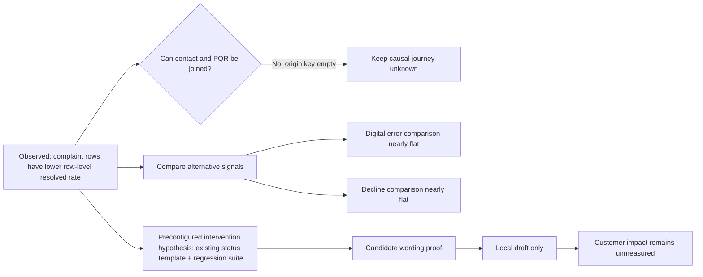

# 13. A bounded signal-to-draft example: what one local route can prove

## A worked slice of the engine—not its complete autonomous loop

This worked example follows a service-pain hypothesis through evidence, alternatives, artifact choice and test. It uses the **synthetic hackathon EDA and separate local run records**. PQR means *petición, queja o reclamo* (customer petition, complaint or claim). It is not a bank-production finding, and no number below is an observed customer outcome caused by Pulso.

**Terms used below:** EDA means *exploratory data analysis*—the initial investigation of the supplied dataset. A *discovery/holdout split* divides records into a part used to find a pattern and a reserved part used to check whether it repeats. A *bank-cell* is an aggregate group (for example, complaint reason × channel), not an individual customer; this run counted 7,995 such group-level rows. *Agent Core* is the separate runtime that owns deployable service artifacts. A *Template* is a reusable response artifact. A *regression suite* checks that a proposed change produces expected outputs on fixed cases. Here, “draft proof” means only a local test of the proposed wording behavior, not a released change or measured business outcome.

The example is intentionally modest: it does not claim “complaints are caused by unclear status.” It shows a more defensible capability: the engine can surface a concentrated pain signal, recognize that the journey cannot be joined, avoid claiming cause, and still identify one narrow service change that can be tested on its own mechanics.

## Scene 1 — The scan sees both scale and friction

The supplied dataset contained **686,296 contact records**. Transaction-related contacts were the largest reason family: **240,056 records**, 91.5% with the row-level `was_resolved=True` flag and 3.4 minutes median duration. Complaint-related contacts (*Queja* in the source) numbered **117,021**; 43.6% carried that same contact-row flag, with a 7.2-minute median. They contributed **66,000 of the 160,266 contact rows marked unresolved**—41.2% of that unresolved-row pool.

That is a useful signal because it combines scale and a worse observed row-level service measure. It is not yet proof that 66,000 complaints remained open, that 66,000 customers repeated contact, or that one service agent caused the difference. The field records the state of a contact row; it is not a full case history.

## Scene 2 — The engine asks what could explain it

The scan does not jump from “complaint” to “build a complaint agent.” It keeps competing explanations alive:

| Candidate explanation | What supports the question | What weakens or limits it | Engine disposition |
|---|---|---|---|
| Complaint contacts are a concentrated service-friction area | They account for 41.2% of rows marked unresolved; median contact duration is longer than transactional contacts | Contact-row resolution is not final case resolution; different issue mix and channel mix may explain part of the gap | Keep as a descriptive signal worth investigating |
| Unclear PQR status causes repeat contacts | PQR table contains status fields; a status answer might plausibly reduce uncertainty | The direct `origin_interaction_id` link was empty for all 67,095 PQR rows in the audited copy; no verified repeat-contact outcome joined the status to those contacts | Keep the mechanism as a test hypothesis only; do not say the EDA found this cause |
| Digital errors drive the technical-contact problem | Error events exist at scale; a digital issue could plausibly trigger support | The conservative same-customer comparison found an error before 0.16% of technical contacts versus 0.15% of all contacts—nearly level | Do not rank as a proven cause; the error may not block task completion |
| Declined payments trigger transaction support | 221,234 transactions were marked declined | A decline can be retried successfully; declined events preceded 0.14% of transactional contacts versus 0.14% overall in the checked comparison | Keep as a broad metric, but reject “declines explain the contact” from this evidence |

The important product behavior is not that the model picked one plausible story. It is that the system preserves the **difference between observed pain and unproven mechanism**.

## Scene 3 — The economics do not silently crown a winner

The EDA also compared different scenario lenses. Complaint handling was modeled at about **USD 7,032 of annual capacity value** under assumed time/wage/capture inputs—not cash saved. A selected eligible-product activation scenario modeled about **USD 7,954 gross contribution** before message and fixed costs—not measured incremental sales. Early collections in Mexico could show about **USD 8,305 net scenario value** under a 0.05% assumed improvement on USD 26.6M of 30–89-day balance, but the low 0.01% case was negative and the effort/risk is much higher. Exposed balance is not expected loss or recoverable cash.

These are **not directly comparable expected values**: they use different populations, value types, assumptions, controllability and difficulty. The Improvement Engine should show the scenario math and allow a service owner to choose a business objective; it should not convert the three numbers into a fake ranking. A narrow, reversible Template test can be the best next *engineering experiment* even when activation has a larger modeled ceiling.

## Scene 4 — A bounded route tests a specific artifact, not the theory

Across a sequence of recorded local bank-cell mapping runs, a preconfigured route scanned six aggregate input tables and 7,995 group-level rows. The aggregator assigned customers by a deterministic hash into discovery and holdout halves, and the strict sensor contract uses holdout replication as a gate; the records labeled 19 findings “corroborated,” including ten unresolved-contact-rate patterns. This is a repeatability check inside the same synthetic extract, not an independent validation source, human verification or causal check.

Across several model attempts, five complaint-reason-by-channel cells—Phone, Email, App, WhatsApp and Web Chat—were mapped to an existing PQR-status response Template (`t/estado_pqr`). This mapping was a **preconfigured intervention hypothesis**, not a result inferred from the empty contact-to-PQR join. It was chosen because the template already existed, its scope covered the mapped interaction, and a regression suite was available. A new specialist Agent was not automatically the best answer: it had a distinct Core permission boundary, and an existing Template was the smaller testable surface.

The suites evaluated a concrete wording behavior: the base reply did not provide the seeded status; each candidate needed to render the current PQR status correctly. Recorded narrow regression proofs passed for the five mapped channel targets; the outputs remained local drafts. That proves the patch/test mechanics for that controlled variable. It does **not** prove that customers made fewer contacts, that the status data was joined to the original contact, or that PQR resolution improved.

## What the current run did—and what V3 is supposed to add

| Question | Recorded bank-cell route | V3 target behavior |
|---|---|---|
| Who chose the search space? | A configured six-table aggregate route, its metric families and mapping table | Scheduled broad scan across all authorized source families; no operator preselects complaints as the answer |
| How were findings generated? | The strict metric profile required replication in a deterministic customer-hash holdout drawn from the same synthetic extract. The run's “corroborated” label means that configured repeatability check only—not an independent source, a human review or causal validation. | Versioned metric definitions, selection and quality gates, explicit evidence status, query receipts and independent verification |
| How was an artifact selected? | A supplied mapping table connected eligible cells to ranked existing Core targets and suite availability | Evidence and capability catalogue determine whether the smallest supported output is a Flow, Jev decision model, Template, Agent, composition or no-op |
| What did evaluation establish? | Narrow Template regression proofs passed for five mapped channel targets across separate local attempts; outputs remained drafts | Paired baseline/candidate suites, adversarial and safety guards, holdout policy, cost/latency limits and visible `not_evaluable` states |
| What happened after the draft? | It remained local and unapproved; no customer exposure or outcome measurement | Human signs a decision bound to the exact artifact hash; platform release and later outcome feed remain separately governed |

The first local attempt is also part of the story: new-Agent proposals met an authorization boundary, one finding had no supported artifact mapping, and a provider attempt failed. Later, choosing a covered Template plus a real regression suite enabled a narrower proof. That is not failure hidden by a success; it is an observable design lesson: the artifact should fit both the service mechanism **and** the available authority/evaluation boundary.

## Why this demonstrates the engine's value

Before Pulso, the analyst's finding would likely end in a slide: “complaints are often unresolved; maybe improve status communication.” The engine's intended value is to make the next steps repeatable:

- retain the counts and row-level definitions instead of replacing them with a vague “resolution problem”;
- test whether nearby digital/transaction evidence actually supports the story;
- surface missing contact-to-PQR linkage before anyone declares a root cause;
- compare a complaint-service test with activation and collections scenarios without mixing cash, capacity and balance;
- select the smallest artifact that can be tested, not an Agent by default;
- preserve both the passed regression proof and the unresolved business hypothesis;
- use later, properly linked outcome evidence to strengthen, weaken, supersede or forget the hypothesis.

The current run demonstrates only the bounded aggregate-to-Template-draft segment. The complete loop that autonomously scans all domains, picks a problem without preselection, creates a proposal, evaluates it, governs release and learns from later outcomes remains the target in V3—not a result we claim already happened.

## Sources and next reading

- [Contact and experience EDA](references/eda/factored_contacto_experiencia_eda.pdf)
- [Integral bank EDA and economic scenarios](references/eda/factored_banco_eda_integral.pdf)
- [Bank-cell mapping/draft run record](https://github.com/pulso-factored/improvement-engine/blob/fc56b598b1be483a6b1eb7ee6fac0d9809c3b646/docs/dev/MAPPING.md)
- [Bank-cell metric definitions, including discovery/holdout split](https://github.com/pulso-factored/improvement-engine/blob/fc56b598b1be483a6b1eb7ee6fac0d9809c3b646/docs/data/bank-cells-metrics.md)
- [Product story and broader portfolio](02_product_rationale_and_architecture.md)
- [How Pulso chooses what to improve](12_how_pulso_chooses_what_to_improve.md)
- [Technical detection/evidence contract](technical/04-detection-and-evidence.md)
- [Canonical V3 specification](../archive/source-record/2026-10-05/TECH_SPEC_PULSO_AUTOMEJORA_V3.md)
