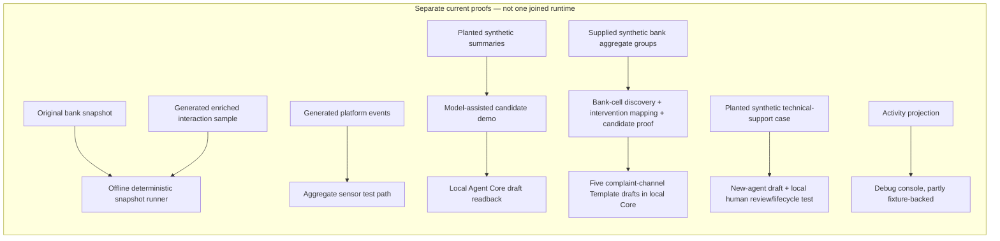
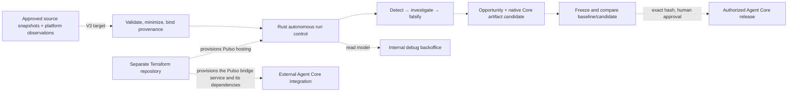

# 1. System architecture and ownership

## 1.1 Product boundary

Pulso Improvement Engine is the system that detects recurring service friction, investigates evidence, chooses whether an improvement is worth testing, prepares a change in the service platform's native format, and records the evidence and decision trail. It does **not** own customer conversations or execute bank operations.

**Reading key.** “Current implementation” means code present on the pinned GitHub `main` snapshot cited below; it does not mean the whole product flow is connected. “V3 target” means the intended architecture in the canonical specification. A **proof** is a bounded test or local run of one path, not evidence that the complete product is deployed. **E0** is the project’s internal name for the enriched, generated hackathon interaction sample. A **tenant** is an organization-level data and permission boundary. A **control plane** is the part that schedules work, enforces permissions and budgets, tracks state, and decides which stage may run; it is distinct from the analysis and model calls inside a run. A **native Agent Core artifact** is a service capability in Agent Core’s own schema, such as a Flow or Template—not a Pulso wrapper around it.

**Read this as two diagrams, not one deployed system.** The first diagram groups separate implementation proofs and documented components; arrows group their input/output, but do not claim a shared run or direct integration unless stated. Dashed arrows in the second are V3 target connections; they are not proof those components currently call one another.

The target does not put the customer conversation inside Pulso. The customer-service platform owns identity, bank-side tools and live routing; it emits approved observations. Agent Core owns service-capability validation and runtime. Pulso owns the improvement loop and its debugging/oversight view. The human authority stays outside model reasoning and is bound to the exact tested candidate hash.

## 1.2 Repositories and processes in the pinned implementation

In plain terms: Rust owns the Improvement Engine's run-control and evidence foundations; a Python integration process connects to Agent Core; the Node console lets engineers inspect the engine; and a separate Terraform repository declares AWS infrastructure. The current engine repository is a **multi-language product repository**, not a single Rust binary and not a microservice fleet:

| Area | Responsibility | Runtime / ownership |
|---|---|---|
| `crates/*` Rust workspace | Typed engine contracts, source and artifact handling, reducers, query boundary and command-line/runtime pieces | Improvement Engine |
| `core-bridge/` Python package (`pulso_core_runtime`) | Composes pinned Agent Core primitives with Pulso's private task/API boundary and controlled tool/runtime context | Improvement Engine integration process; uses upstream Agent Core in-process |
| `bridge-contract/` | Versioned OpenAPI/JSON schemas, golden payloads and conformance checks for the Rust/Python seam | Shared engine-owned wire contract |
| `platform-contract/`, `platform-sim/`, `platform-exporter/` | External service event shapes, realistic doubles/fault injection, and read-only event export | Integration boundary; simulator is not production telemetry |
| `local-identity/` | Sandbox-only human identity issuer for local approval-path tests | Test-only; not staging or production identity |
| `e2e-core/` | Test driver that exercises the local Core stack through a stand-in where the Rust-to-Core path is not complete | Explicit test harness, not product runtime |
| `debug-console/` | Internal debugging/operations console for runs, findings and integration state | Node/TypeScript backoffice, not the customer product UI |
| `infra` repository | AWS resources and deployment lifecycle managed with Terraform | Separate infrastructure owner |

The README's CI boundary matters: GitHub Actions (CI, automated build-and-test checks) currently enforces the Rust workflow, while Python packages, the console, bridge, simulator and Terraform also have their own local checks. A local green result for one package is not evidence that every cross-language system check ran.

## 1.3 Design-to-code mapping

| V3 concept | Intended owner | Current implementation evidence | Current limit |
|---|---|---|---|
| Detection/control plane | Rust engine | Source validation, typed quota/grant boundary, job-admission reducer, run-activity read model, bounded analysis foundation | Not all target durable adapters and detection stages are connected into one autonomous daemon |
| Core runtime composition | Python bridge + Agent Core | `core-bridge/` composes pinned Core and exposes private engine integration contracts | Hosted/control-API integration and full Rust E0-to-Core path remain gaps |
| Service capabilities | Agent Core | Native entities such as Agent, Flow, DecisionModelDef, Prompt, Template, ToolDef and policy artifacts are the target output types | Pulso must not invent unsupported Core entities or use a shape-valid draft as proof of execution |
| External service evidence | Customer-service platform / exporter | Event contracts, exporter and simulator exist; platform sensor consumes aggregate event cells | Real production feed, confirmed payload semantics and complete recovery after lost exporter state are not established |
| Evaluation | Agent Core plus Pulso gate | Core-shaped suites, local Core evaluation smoke, candidate proof contracts and synthetic demo record | Generated suites may be unexecuted; sandbox proof is not customer-impact evidence |
| Debugging | Rust read model + Node console | Run-activity boundary and console exist | Console currently has fixture/stand-in portions; full API connection is open |
| Cloud operation | Separate Terraform repository | Local stack and AWS foundation/resource definitions exist | Private ingress, runtime database secret binding, egress policy, alarms and verified deployment remain open |

## 1.4 Why this is not a microservice-per-stage design

V3 deliberately keeps the engine's core control plane together. Jobs, artifacts, evidence, config and decisions share tenant, version and lineage invariants; splitting each stage into a separately operated service would add distributed transactions, duplicate retry semantics and more failure modes before throughput data justifies it. The Python bridge is separate because it composes Agent Core's Python runtime; Terraform is separate because infrastructure has its own lifecycle. The Node console is a distinct client/backoffice, not another decision authority.

The target data plane can launch isolated disposable query/evaluation environments for investigations. That isolation is a job boundary, not a reason to turn each query into a permanent microservice.

## 1.5 Authority boundaries

| Decision/effect | Authority |
|---|---|
| Whether a source contract is valid and which snapshot/config a run uses | Pulso deterministic control plane |
| Metric arithmetic, support counts, query limits, tenant/grant checks, idempotency and quota | Deterministic code; never delegated to a model |
| Open-ended hypothesis generation and alternative explanations | Model/Agent Core task under a scoped, treated input and explicit purpose |
| Native agent/flow/tool artifact validity and runtime execution | Agent Core |
| Customer identity, permission to act on a bank record, and bank-side effect receipt | Customer-service platform / trusted identity and tool layer |
| Approve, publish, promote, revoke a customer-serving change | Authorized human and Agent Core lifecycle; not an autonomous Pulso model |
| Evidence visibility and engineering diagnosis | Pulso run-event/read-model API and internal debug console |

V3 permits autonomous detection and proposal iteration. It does not grant a model authority to mutate the registry directly, impersonate a customer, release a candidate, or convert an association into a bank-policy fact.

### Walk-through: where would a PQR-status change live?

This is a **contract-shaped V3 example**, not a current joined run. Suppose a signal suggests that customers may be contacting support because the status of an existing PQR (customer request, complaint or claim) is unclear. Pulso first keeps the measured rate and its denominator in a `Signal`; an investigation tests whether status wording or a different service layer is actually implicated; the verifier records counter-evidence and can reject the explanation. If a safe wording change is supported, the builder may draft a Core `Template` rather than an `Agent`. An `EvalSuite` (a versioned package of scenarios and pass/fail oracles) compares that candidate with the current template. A local or production release is a separate Agent Core transition, and the internal console should show each stage and its receipts. Chapter 2 describes a different planted synthetic demonstration of a related template patch; it must not be mistaken for this complete V3 path.

## Source references

- [Current engine component map](https://github.com/pulso-factored/improvement-engine/blob/fc56b598b1be483a6b1eb7ee6fac0d9809c3b646/README.md)
- [Current integration gaps](https://github.com/pulso-factored/improvement-engine/blob/fc56b598b1be483a6b1eb7ee6fac0d9809c3b646/docs/gaps/OPEN_GAPS.md)
- V3 §§1, 4, 17, 20, 25, 27, 29, 31
