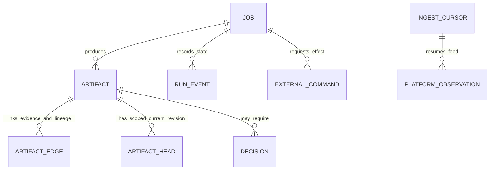

# 2. Data, lineage and persistence

## 2.1 Three evidence domains, three meanings

The engine sees inputs from separate populations. **E0** is an internal engineering name for the enriched hackathon sample: generated/augmented interaction and event detail added around the original synthetic bank tables. It is not a product feature or a production-bank dataset. A `SourceRef` is a stable pointer to the source namespace, snapshot and record used as evidence. `evidence_kind` labels the status of that evidence—supplied, generated, assumed, or observed from a platform feed. **Provenance** means this origin and transformation history. Joining two records does not upgrade the truth status of either input.

| Input | What it is | What it may support |
|---|---|---|
| Original bank snapshot | Thirteen organizer-provided tables—customers, products, branches, service agents, marketing campaigns, exchange rates, transactions, contact-center interactions/transcripts, satisfaction surveys, digital events, complaints and campaign sends. It is a synthetic hackathon dataset, not a production bank extract. | Descriptive patterns and source quality checks on fields actually present in this snapshot. |
| Enriched interaction history (`E0`) | Generated/augmented interaction and event detail intended to complement the supplied tables and provide richer sequence-level evaluation cases. | Testing source projections, joins, event timelines, scenario construction and discovery behavior within the E0 population. Its generated events are not observed historical operations. |
| Service-platform observations | Events, traces or logs describing what the customer-service platform attempted across classification, decision flows, AI layers, tools and human handoff. | Operational monitoring only when the feed is real, versioned, complete enough, and appropriately minimized; currently sensor tests use generated event histories. |

The 13 source tables remain untouched. Pulso stores its own records separately and keeps references back to the source as metadata; it does not modify the supplied files or add database relationships to them. A **manifest** is the versioned inventory of files/tables, schemas, cutoff and content digests used for a run. In V3, `SourceStore` has local-file and Amazon S3 object-storage adapters behind one manifest contract; it reads and verifies digests and never modifies the source. Do not assume both adapters or a live S3 ingestion path are proven just because the contract is specified.

## 2.2 Data flow and temporal lineage

**Temporal lineage** answers both “where did this value come from?” and “was it knowable at the time of the decision?” That second question prevents **label leakage**: using a later outcome (for example, a final resolution flag) as if it were available when the system was deciding what to investigate.

```text
Immutable source files / objects
        │ source manifest: namespace, world, digest, schema, cutoff
        ▼
Trusted extractor (projection + minimization + availability rules)
        │ run-scoped treated extract; source remains read-only
        ▼
Investigation workspace (bounded query interface)
        │ query receipt: digest, rows, bytes, duration, truncation
        ▼
Signal / opportunity / proposal artifacts with exact source references
```

V3 calls for a per-investigation DuckDB workspace over a treated extract directory. DuckDB is an analytical database suited to local, columnar analysis; only the run's authorized files are mounted. SQL (the query language) is flexible **inside that sandbox**; the broker rejects external file/network input and output, `ATTACH`, `COPY`, unsafe extensions and publishable individual rows. The original data root, Podman socket, secrets and other run directories are not mounted into the sandbox.

The current `main` query foundation is narrower: it uses an embedded in-memory SQLite database with a bounded, typed `SELECT` AST (abstract syntax tree: a parsed structure describing an allowed query); it does not execute raw SQL. This is an implemented restricted analysis seam, not V3's full free-SQL DuckDB agent lab. Do not describe the current SQLite service as a DuckDB sandbox or infer container-level network isolation from AST restrictions.

The enriched-history projection binds its namespace/world/cutoff and file/schema/transform/policy digests. A **projection** is the deliberately limited set of source fields made visible to a particular analysis. It tracks whether fields/groups are available, excludes labels, precomputed signals and final outcomes, and blocks exposure if the provenance binding drifts. This read view does not itself demonstrate that the autonomous discovery pipeline has consumed every E0 case.

### Join confidence is explicit

| Link | V3 confidence | Interpretation limit |
|---|---|---|
| Interaction `interaction_id` ↔ transcript `interaction_id` | Exact key; coverage may be partial | Template text is not gold truth for contact intent. |
| Survey `interaction_id` ↔ interaction | Exact key only where populated | Customer Satisfaction (CSAT) and Net Promoter Score (NPS) describe respondents; they are not automatically representative of all contacts. |
| Complaint `origin_interaction_id` ↔ contact | The data format permits this key, but the audited local copy had it empty | Do not assign a complaint to a nearby contact by guesswork. |
| Transaction/digital event/contact by customer and time | Temporal candidate / aggregate sequence | Closeness in time does not prove causation or a transaction error. |
| Current customer/product snapshots | Current snapshot state | Current balance, delinquency or status is not a time machine; do not use it as a historic feature without availability evidence. |

Every field used to explain or predict must have an availability time no later than the decision time. A contact's eventual resolution, complaint's final SLA (service-level agreement) status or survey answer cannot leak into an earlier detection feature. `available_at ≤ decision_at` is the relevant test; sorting only by event timestamp is insufficient.

### Worked lineage example: proximity is not a join

The values below are **fake teaching values**, not extracted records. They show how the engine should preserve uncertainty:

| Record | Evidence kind | Time available | Link quality | What may be said |
|---|---|---:|---|---|
| Complaint snapshot row `pqr_demo_17`, status `Open` | Original synthetic bank snapshot | Snapshot cutoff | Complaint `origin_interaction_id` is blank in the audited local copy | “This complaint row was open in this snapshot.” Not “this contact caused the complaint.” |
| Contact row `contact_demo_42` | Original synthetic bank snapshot | Contact start | No exact complaint-origin key | “A contact exists.” Do not attach `pqr_demo_17` to it by guesswork. |
| Generated digital event `event_demo_8`, five minutes before that contact | E0 generated history | Event time and ingest/availability time both precede the analysis cutoff | Same customer/time is a temporal candidate only | “An event preceded the contact in generated history.” Not “the event caused the call.” |
| Platform `suggestion_failed` event | Generated platform simulation | Event receipt time | Platform case correlation may be exact within its own test feed; no proven bridge to the bank contact above | “The test assistant failed to suggest an answer in this simulator.” It cannot be merged into the bank complaint rate. |

This is why a source reference carries both the namespace/snapshot and an `evidence_kind`: the same row-shaped number has a different meaning if it is generated, supplied, assumed or observed from a platform feed. A `SourceRef` is a stable pointer plus provenance to evidence; it is not proof that a cross-source relationship is valid. The investigation may use temporal proximity to prioritize a question, but a publishable explanation needs an exact supported linkage or must keep the result explicitly unlinked.

## 2.3 Pulso's logical entities

V3 avoids making one SQL table for every concept. Most domain objects are **immutable, typed artifacts**: validated records that get a new revision rather than being edited in place. Separate relational tables exist where the engine needs transactions, authorization, querying, concurrency or external-effect reconciliation. A **compare-and-swap** update (CAS) changes a current-version pointer only if it still has the version the writer read; that prevents concurrent runs from silently overwriting one another.



| Entity family | Logical representation | Why it exists |
|---|---|---|
| `SourceSnapshot` / source contract | Versioned manifest/schema and digest references | Defines exactly which source bytes, schemas and cutoff were used; does not copy the full dataset into control PostgreSQL. |
| `RunConfigRevision` | Immutable configuration artifact and a compare-and-swap head | Pins detectors, windows, limits, model profiles, budgets, cadence and feature flags for each run. |
| `Signal` | Artifact with metric, population, numerator/denominator, comparison, interval, source/query receipts | Preserves what was measured and how. |
| `Opportunity` | Artifact with claim, support/counter-evidence, population, status, value-model reference and workflow link | Separates a plausible intervention from an observed pattern. |
| `Proposal` / `ChangeSpec` | Artifact with alternatives, selected change, mechanism, affected routes, preconditions and rollback reference | Makes the proposed intervention inspectable and versioned. |
| `CapabilityBundle` | Pulso envelope referencing Agent Core entities and state | Tracks draft/frozen/evaluated lineage without inventing a competing Core entity. |
| `ScenarioSet` / `Evaluation` | Artifacts pointing to cases, split, oracle, baseline, candidate, limits and results | Reproduces what was tested and against what. |
| `MemoryWiki` | Versioned scope/head/index/source manifest plus diff and revocation references | Supports flexible knowledge organization while retaining source lineage and governed publication. |
| `PlatformObservation` | Contract, batch digest, source sequence range, coverage, event blob and trace references | Enables monitoring/replay without making Pulso the owner of customer-service episodes. |
| `ModelReceipt` | Invocation/profile/provider, output digest, usage/cost and validation state | Audits real Jev/LLM calls without copying sensitive prompts into generic logs. |

## 2.4 V3 PostgreSQL control-plane tables

V3 normatively specifies ten `pulso_*` tables. This list is the target relational model, not a claim that every table is implemented in the current database adapter. PostgreSQL is the transactional database for Pulso-owned run coordination and metadata; it is separate from the supplied bank files and Agent Core's own database.

| Table | Core role | Concurrency / integrity use |
|---|---|---|
| `pulso_jobs` | Root and child work, status, owner/lease, attempt, budget and input/config refs | Unique logical trigger generation; pending-job and due-work indexes; retry/backpressure. |
| `pulso_artifacts` | Immutable `(tenant_id,id,revision)` payload, kind, schema, digest, provenance and search fields | Validate schema before persist; no in-place edits of historical revisions. |
| `pulso_artifact_heads` | Scoped pointer to active config/candidate/memory revision | Compare-and-swap to prevent two concurrent builders overwriting each other's decision. |
| `pulso_artifact_edges` | Typed lineage to artifacts, source rows/snapshots or policy refs | Invalidation and traversal; source files get logical refs, not foreign keys into organizer data. |
| `pulso_decisions` | Human decision, actor/grant, expiry and expected head | Reject stale or expired approvals. |
| `pulso_audit_events` | Treated authorization, rejection, publication or decision record | Security/audit trail with trace correlation. |
| `pulso_run_events` | Ordered status transitions and checkpoints | Reconstruct run state even if OpenTelemetry is unavailable. Not a dump of every model token/query. |
| `pulso_quotas` | Per-tenant/resource/window limits, reservations and usage | Global budget across config revisions; atomic reservation. |
| `pulso_ingest_cursors` | Source partition offset/watermark, digest and last batch | Resume with deduplication and show gaps. |
| `pulso_external_commands` | Idempotent release/rollback request, digest, state and receipt | Reconcile confirmed/rejected/unknown outcomes without blindly repeating a side effect. |

`pulso_artifacts.kind` covers signal, opportunity, proposal, bundle, scenario/evaluation, memory, detector, run config, source snapshot, platform observation and model receipt. A blob store holds large immutable bodies when configured size/retention requires it. Content identity, authorization and tenant identity remain distinct: equal hashes never imply cross-tenant access.

## 2.5 Current persistence versus target

The current `main` includes a tenant-scoped immutable artifact repository and a PostgreSQL migration/adapter. Quota/grant checks and job-admission behavior currently expose **in-memory reference implementations**: their state-machine behavior can be tested, but they do not prove persistence after process restart or correctness across multiple engine processes. The run-activity read boundary provides tenant-scoped bounded paging with opaque cursors (continuation tokens whose internal state clients cannot alter). The full V3 ten-table queue, atomic reservation and recovery semantics must be assessed separately from these current components.

No durable state should be inferred from a JSON file in a work directory, a run log, an in-memory reducer, a successful unit test, or a schema fixture. For each state claim, identify the storage adapter, transaction boundary, restart test and tenant constraint that prove it.

## Source references

- V3 §§3, 5–6, 8, 16, 19, 21, 24, 28
- [Current Rust/source and storage overview](https://github.com/pulso-factored/improvement-engine/blob/fc56b598b1be483a6b1eb7ee6fac0d9809c3b646/README.md)
- [Current enriched-history snapshot runner](https://github.com/pulso-factored/improvement-engine/blob/fc56b598b1be483a6b1eb7ee6fac0d9809c3b646/docs/local-e0-e2e-runner.md)
