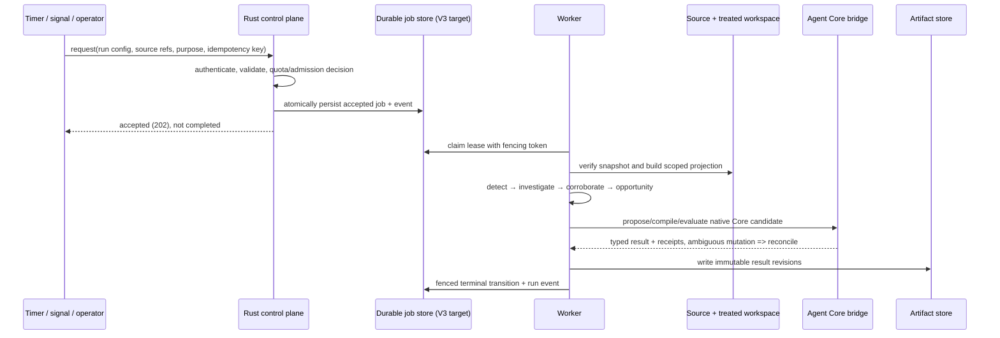

# 3. Run lifecycle and asynchronous control

## 3.1 The unit of work

A **run** is one reproducible attempt to inspect a bounded set of source snapshots and platform observations under one immutable configuration revision. It is not a model conversation, customer interaction or deployment. Every result must be attributable to a run ID, tenant (the organization/security scope), purpose, source manifest(s), config digest, code version and model/Core versions where relevant. A **digest** is a content fingerprint used to detect whether the exact input/configuration changed.

V3 defines triggers as scheduled, signal-driven, or operator-requested. They enter the same admission boundary; the trigger changes urgency and provenance, not the semantic contract. Duplicate trigger delivery must converge on one logical run through an idempotency key. A manual request cannot bypass tenant, source, budget, concurrency, or approval policy.



The sequence is the **V3 target contract**, not a claim that this complete durable flow currently runs in `main`. Current code has useful constituents—typed quota/grant checks, an in-memory job-admission reference implementation, run-activity projections and a Python Core bridge—but the pinned implementation inventory does not establish a production-ready durable worker loop or an integrated Rust E0-to-Core invocation.

### Worked run: duplicate trigger, expired lease, unavailable model

The following is an **illustrative V3 target execution**. Identifiers are intentionally fake and no current run receipt contains this exact sequence.

| Step | Input / state | Deterministic behavior | What the internal console should show |
|---|---|---|---|
| 1. Trigger twice | Scheduler sends the same tenant, source snapshot, config revision and logical trigger generation twice | Admission derives the same idempotency identity; one logical run (for example `run_demo_01`) is created, and the duplicate returns the existing run reference | One run row, one `accepted` event, duplicate-delivery counter; no second charge or job |
| 2. Worker claims | Worker A leases the queued job with fencing token 4 | It records lease expiry and begins source verification | `leased → running`, owner/attempt, lease deadline, stage, elapsed time |
| 3. Lease expires | Worker A pauses; Worker B reclaims after expiry with fencing token 5 | A's later writes with token 4 are rejected; only token 5 can advance the run | Reclaim event, old attempt marked stale, current lease owner; no silent duplicate artifact head |
| 4. External reasoning dependency fails | The model provider times out while the run is investigating | If the request is safe to retry, use a bounded retry under the same logical operation; otherwise end `blocked_dependency` with evidence already collected preserved and no opportunity invented | Exact stage, timeout class, retry count/budget, partial artifact references, next action; not a green “completed” badge |
| 5. Resume | Dependency becomes available and an authorized retry/resume occurs | Resume the same run lineage under a new attempt or create a linked child run according to the pinned V3 contract; never silently alter the source/config pinned by the original run | Parent/attempt links, unchanged source/config digests, stage resume point and new receipts |

A **fencing token** is a monotonically increasing lease number that prevents an expired worker from writing after another worker has taken over. An **idempotency key** makes repeated delivery of the same logical request return or continue the same effect instead of creating duplicates. A **lease** is a time-bounded claim to work, renewed or reclaimed if its owner stops. These are product-safety behaviors: without them, a retry could create duplicate proposals or hide which worker owns the current result. The current reference implementation is not evidence that this durable multi-worker behavior is already deployed.

## 3.2 State machine and ownership

V3 job states are intended to be explicit and monotonic, with retries represented separately from business decisions:

```text
queued → leased → running → succeeded
                    ├────→ failed_retryable → queued (attempt + 1)
                    ├────→ blocked_dependency
                    ├────→ cancelled (authorized request only)
                    └────→ needs_reconciliation (external effect uncertain)
```

The exact enum and transitions must follow the current V3 job contract; this diagram is explanatory. A `blocked_dependency` is not success, and a timeout after an external mutation is not proof the mutation failed. Retry only idempotent operations or operations whose effect has been read back and reconciled.

| Concern | Required behavior in V3 | Current evidence / boundary |
|---|---|---|
| Admission | Validate tenant, purpose, source/config revisions, limits, idempotency and quota before enqueue | Quota and job-admission semantics exist as in-memory/reference implementations; not durable restart or multi-process proof |
| Claim | Lease work with expiry and monotonically changing fencing token | V3 PostgreSQL design; not established by current reference reducer |
| Write | Commit job transition and corresponding activity event atomically | V3 target; current run-activity read model is not by itself a durable event log |
| Retry | Retry transient, idempotent work with bounded attempts/backoff; preserve original run lineage | Required target behavior; implementation guarantees must be verified per adapter |
| External effects | Outbox/idempotency/readback/reconciliation for registry effects; never blind-retry uncertain publish | Python bridge has typed idempotency and unknown/reconcile semantics; full engine-to-bridge operation is still incomplete |
| Cancel | Stop future work safely; retain audit history; cancellation does not roll back an already committed external effect | Target behavior |

## 3.3 Concurrency, backpressure and latency

V3 makes thresholds configurable and versioned. Admission should reserve a bounded concurrency slot and resource budget before expensive work begins. Queue age, active leases, per-tenant concurrency, model-call budget, query CPU/memory/time and output size are separate controls: one global “timeout” cannot safely substitute for them. When a tenant or global budget is exhausted, defer or reject with a typed reason; do not silently drop a run or shrink evidence until a finding appears.

Workers use leases plus fencing so a delayed worker cannot commit after its lease was replaced. Per-tenant fairness prevents a large source or noisy trigger from monopolizing workers. Coalescing can combine redundant scheduled triggers only when source/config/purpose equivalence is proven; it must not coalesce across tenant, evidence snapshot or policy revision.

V3 latency figures are initial budgets, not measured service-level objectives (SLOs). Establish current p50/p95/p99 by stage before describing throughput: these percentiles mean 50%, 95% and 99% of measured runs completed within that duration. A complete performance test should vary worker count, tenant count, event volume, retry/error rate and Core/model latency; report queue wait separately from service time and external-provider time. A passing unit test or local demo is not a load test.

## 3.4 Recovery and operator visibility

The run activity projection should answer: what triggered this run, what immutable inputs/config it pinned, what stage it is in, last progress time, retry/lease state, evidence and artifacts created, model/Core calls, budget consumption, blockers and terminal outcome. HTTP `202 Accepted` means accepted for asynchronous work, not finished. A run with unresolved external effects must display `needs_reconciliation` (the external change's outcome is not yet known), not a green completion badge.

The current run-activity projection provides a tenant-scoped bounded read interface and opaque-cursor behavior. The complete durable event/job state machine and recovery after process restart remain target work. The internal debug console is an engine backoffice; until the Rust control API is connected, fixture/stand-in views must be labelled as such.

## Source references

- V3 §§6, 8, 19–20, 25, 27
- [Current implementation inventory](https://github.com/pulso-factored/improvement-engine/blob/fc56b598b1be483a6b1eb7ee6fac0d9809c3b646/README.md)
- [Open integration gaps](https://github.com/pulso-factored/improvement-engine/blob/fc56b598b1be483a6b1eb7ee6fac0d9809c3b646/docs/gaps/OPEN_GAPS.md)
- [Bridge contract and effect semantics](https://github.com/pulso-factored/improvement-engine/tree/fc56b598b1be483a6b1eb7ee6fac0d9809c3b646/bridge-contract)
