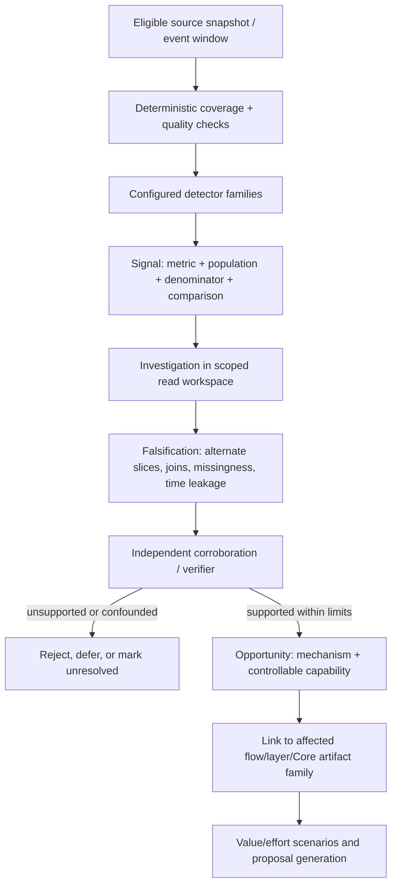

# 4. Detection and evidence pipeline

## 4.0 The originating analysis: requirements learned from the EDA

The detector portfolio is grounded in the [integral bank EDA](../references/eda/factored_banco_eda_integral.pdf) and [contact/experience EDA](../references/eda/factored_contacto_experiencia_eda.pdf), not in a PQR-only brief. EDA means **exploratory data analysis**: an initial evidence-led review used to find patterns, data gaps and questions for further testing. PQR is *petición, queja o reclamo* (customer request, complaint or claim); an SLA (service-level agreement) defines a service commitment such as a target handling time. The second report's pages 2–9 cover join quality, contact reasons, survey experience, complaint status/SLA, operational friction, temporal checks, delinquency behavior and advisor mix. The integral report then compares plausible economics and capture difficulty. These reports describe synthetic hackathon tables and explicitly state that their scenario inputs are assumptions.

Several findings directly shaped the implementation contract:

| EDA evidence | Design consequence | Detector/proposal behavior required |
|---|---|---|
| Complaint-contact rows had the row field `was_resolved=True` less often than transactional-contact rows, but this is not a verified first-contact-resolution history—and exact complaint-origin interaction linkage was absent. | Preserve both the reason-level service signal and the missing-link warning. Do not assert contact-to-complaint causality. | Aggregate by a validated source projection (the approved fields exposed to a detector); carry join coverage and evidence grade; keep a complaint-status Template/Flow as a test candidate only. |
| Error→technical contact and decline→transactional contact temporal rates were effectively level with controls. | Do not turn an intuitive story into a root cause because timestamps are nearby. | Compare against explicit control populations; classify weak temporal association as unlinked/unsupported; let the verifier seek counterexamples. |
| Delinquent borrowers often transacted recently and on other products. | “In arrears” is a product/credit state, not customer inactivity. | Distinguish customer from account/product and use exact, time-valid joins; do not infer missed-payment reasons or auto-design a collections policy from status alone. |
| Conversion flags had no campaign control group; service and digital outcomes also lacked clean causal outcomes. | A funnel or test-proxy cannot be presented as incremental sales, prevented complaints, or saved cash. | Keep business-value scenarios separate from observations; require an outcome-matched baseline/candidate evaluation before claiming lift. |
| Advisor averages varied less after accounting for case mix than the gap between contact reasons. | A raw leaderboard can punish staff for receiving harder cases. | Prefer mechanism/team-level opportunities; require case-mix controls and enough support before any individual-level interpretation. |

The originating reports also explain why the product is broader than a dashboard. A dashboard can point out a weak contact outcome; it cannot, by itself, determine whether the actionable surface is a deterministic Flow, a Jev decision model (a structured classifier/decision primitive), a Template, an Agent, a missing platform capability or no intervention at all. Pulso is being designed to preserve this analyst reasoning as a repeatable discover → investigate → try to disprove → select artifact → evaluate process, while its operator view exposes why it reached—or refused—a recommendation.

## 4.1 Discovery must not be seeded with the answer

**V3 target behavior; the complete sequence below is not connected in the pinned runtime.** Current evidence includes a separate generated platform-event sensor and offline snapshot processing (see §4.4), not an autonomous live scan that performs the full investigation and proposal loop.

The engine's success path begins with a general, configurable scan—not an instruction to find complaints or a chosen table. A detector produces a **signal** (a measured departure or concentration). Investigation determines whether it is robust and interpretable. Only then may the engine create an **opportunity**: a plausible, addressable service mechanism with evidence, alternatives, and an intervention surface.



The path has deterministic and model-driven sections. Code owns arithmetic, keys, support thresholds (minimum sample counts), cohort boundaries, privacy suppression, evidence lineage, budgets and gate semantics. Models may freely explore the treated, scoped evidence to form hypotheses and counter-hypotheses, but every factual statement in a finding must resolve to query receipts or source references. A model's confidence score does not replace a statistical interval, denominator or independent check.

## 4.2 Signal contract

Every persisted signal needs at least:

| Field group | Why it is needed |
|---|---|
| Metric definition and version | Makes numerator, denominator, exclusions, unit and aggregation reproducible |
| Population and time window | Prevents denominator drift and temporal leakage |
| Baseline/comparison | Distinguishes an anomaly from a large but normal count |
| Estimate and uncertainty/support | Quantifies evidence; small or suppressed cells must not be reverse-inferred |
| Source manifest, query receipt and code/config digests | Replays how the result was produced |
| Availability/quality notes | Exposes missingness, generated fields, late-arriving feeds and coverage limits |
| Evidence kind | Keeps supplied records separate from generated E0, planted tests, assumptions and platform observations |

### Domain breadth: what the engine can look for beyond complaints

V3 does not hard-code “find PQRs.” Its configured sensor portfolio spans the business and the engine itself. The table combines the **raw fields present in the supplied CSVs** with the narrower, explicitly allowlisted **V3 `SourceContract@1` projection**. A source contract is the versioned declaration of which columns, types and time semantics a detector may use. A raw column not named in the projection is not available to a compliant detector; exposing it requires a contract revision and tests. The thirteen original tables stay read-only, and E0 adds generated event/case detail. A metric is eligible only after source contract, temporal availability, population and denominator pass validation.

| Domain | Current V3 projection that can be measured | Raw fields/outcomes outside the projection or limits | Smallest plausible Agent Core output if the mechanism were supported |
|---|---|---|---|
| Contact-center operations | `call_center_interactions@1`: contact/customer/agent IDs, interaction time, reason, channel, resolution/follow-up flags, duration and wait time | Raw escalation, sentiment, transcript text and extra fields are not in this projection; reason labels can be coarse. Repeat contact must mean same issue, not just same customer | Flow/Template for a repeatable known path; Agent only when the uncovered reasoning is genuinely flexible |
| PQR and SLA | `complaints@1`: complaint/customer IDs, creation date, category/subcategory, channel, priority, status, SLA flag, first-response and resolution dates | Raw `origin_interaction_id` is not in the projection and was empty in the audited local copy; even with dates, this is not every status transition. A complaint cannot be assigned to a nearby contact as cause | Triage/status Flow, Jev `DecisionModelDef`, or Template; never claim a candidate reduces real SLA breaches without linked outcomes |
| Transaction declines/errors | `transactions@1`: transaction/customer IDs, transaction date/status, response code and USD amount | Raw channel, product ID, currency and other fields are outside the V3 view. Transaction-to-contact relation is temporal unless a supported exact reference exists; status-code meanings need a versioned contract | Deterministic Flow/ToolDef for a supported lookup/verification step, or Jev classification for a bounded reason |
| Digital friction | `digital_events@1`: event/customer/session IDs, event date, event type and category | Raw action, channel, platform, app version and page details are outside the current view; a nearby contact is only a temporal candidate. Validate event semantics before calling it a failure | Flow or Agent change for an actionable, reproducible digital handoff; sometimes no Core change if ownership is outside the service platform |
| Products and collections | `products@1`: product/customer IDs, type/status, opening date, days past due and last-updated time; `transactions@1` has date/status/amount but no product ID | Raw balance, last-transaction date and transaction `product_id` are outside the current views. These snapshots do not explain why payment was missed or prove the delinquency state on each transaction date | A bounded collections/servicing Flow, Jev decision or Agent support path, only if the bank platform exposes the required authorized action |
| Marketing and activation | `marketing_campaigns@1`: campaign type/objective/product, start/end and budget; `campaign_sends@1`: send/campaign/customer IDs, date, delivery/open/click/conversion flags, conversion value and send cost | Several raw attribution fields are outside the projection; values/cost lack a reliable currency in the source contract. Incrementality still needs a valid comparison; co-occurring campaign and service outcomes are not causal | Usually an activation-support Flow/Template or Agent; changing media spend/campaign policy is outside Pulso unless the platform contract explicitly exposes it |
| Advisor and customer feedback | `service_agents@1`: agent ID, branch, type, experience, specialty and status; interaction view has agent/duration; survey view has interaction ID, date, survey type and score | Raw `avg_csat` is excluded; exact survey↔interaction link may be missing and respondents are self-selected. Exposure/case-mix controls are needed before advisor comparisons | Agent skill/context/Template or routing Flow if a tested mechanism is supported; do not rank individuals from raw averages |
| Service-platform and engine health | Platform event families cover rejected/edited/absent/failed suggestions, tool mix, reassignment and escalation; engine telemetry covers its own stage/latency/retry/resource state | The generated sensor is not wired to a verified production event feed or autonomous `pulso run`; engine telemetry and customer-service events are different evidence classes | Prompt/Flow/DecisionModelDef/ToolDef or operational fix, routed to the capability owner; some signals are platform-owned and human-only |

### How the product chooses among those opportunities

The portfolio should compare candidates on four separate axes: **evidence strength**, **controllability** (is there a published Flow/agent/artifact the engine may change?), **expected value range** (which outcome could move, and what links it?), and **delivery effort/risk**. “A lot of records” is not enough. A qualitative prioritization example:

| Candidate | Effort / risk assumption | Testability with available evidence | Outcome value today | Decision for a demo backlog |
|---|---|---|---|---|
| Do nothing | No implementation risk | Strong comparator; establishes baseline behavior | No claimed benefit | Always retain as the comparison option |
| Clarify PQR status in an existing Template | Relatively small and reversible; assumes the platform can expose a verified status variable | High for template rendering and targeted scenarios; weak for contact reduction because complaint-origin linkage is absent | Repeat contacts and saved handling cost are **unknown** | A good bounded test candidate, not a proven top-value initiative |
| Improve collections/customer-in-arrears handling | Higher policy, authority and customer-harm risk; effort depends on tools/eligibility | Can describe current days-past-due plus transaction activity, but does not reveal why payment was missed or prove an intervention effect | Potentially material, not quantifiable from this snapshot alone | First investigate data/time semantics and required platform authority; do not auto-propose a repayment policy |
| Improve product activation support | Moderate effort if a repeatable support flow is available | Campaign sends and conversion fields support a funnel description; incremental lift needs a valid comparison | Incremental conversion/revenue is **unknown** | Keep as a separate candidate family; avoid attributing campaign conversion to service changes |

This is not a measured ROI ranking. It demonstrates the decision logic: a smaller, reversible, well-testable change can outrank a potentially larger but weakly linked/high-risk intervention for the next experiment—while the engine reports that the first candidate's business value is still unknown.

Use counts and rates together. A large count may reflect high traffic, while a high rate may rest on a tiny denominator. For comparisons, report both denominators, absolute difference and relative difference, and an interval or exact test appropriate to the design. Multiple searches and segmentations can create false discoveries; V3 therefore separates a **discovery group** (used to find candidate patterns) from a **holdout/confirmation group** (reserved to check whether those patterns repeat) and ranks with multiple-testing safeguards. A ranked signal is a work queue, not a causal conclusion.

## 4.3 Investigation and opportunity contract

**V3 target contract, with a narrow local exception.** The deterministic original/enriched-history snapshot runner and generated event-cell sensor do not call the entire reasoning/falsification path as one autonomous pipeline. A separately recorded local bank-cell mapping run composes aggregate discovery, model roles, artifact mapping and candidate proof for a bounded set of findings; it is not connected to that snapshot runner or the general V3 opportunity path.

The investigation agent can issue exploratory read-only queries against its treated workspace without asking for a narrow tool per query. The sandbox constrains which data, compute and output are available; it does not constrain the reasoning sequence to a rigid script. Queries leave receipts with source/query digest, row count, bytes, duration, truncation and policy outcome.

The agent should test at least: key coverage and null semantics; selection/response bias; time ordering and feature availability; alternative subgroup explanations; whether the affected behavior belongs to the bank, channel, Core artifact, or external platform; and whether any proposed action has authority to change that behavior. A verifier receives the evidence dossier and an explicit challenge to find a counterexample; it should not merely restate the scout's claim.

An opportunity is warranted only if the dossier supports all of these, at the stated confidence level:

1. The issue is present in the named population and period.
2. The evidence is not an artifact of generated labels, post-event fields, broken joins, unsupported denominators or a privacy-suppressed cell.
3. A plausible mechanism connects the issue to a controllable agent, flow, decision model, prompt/template, tool contract or context/skill artifact.
4. The mechanism has a testable intervention and a baseline/candidate comparison.
5. Value is modeled as scenarios with explicit assumptions, uncertainty and effort—not asserted as realized savings or lift.

### Recorded example: how a preconfigured bank-cell route moved from a measured group to a draft

This is the strongest current example of evidence becoming a proposal from the supplied bank snapshot. It is a **recorded local run family**; it is not the offline original/E0 runner and not production.

```text
six supplied tables
  → 7,995 thresholded aggregate metric rows (at least 10 contributing customers per reportable cell)
  → customer-split discovery and confirmation cells
  → 19 findings marked “corroborated” by the run record (10 unresolved-contact-rate findings)
  → a preconfigured mapping table associates each supported pattern with a candidate service artifact (a hypothesis, not cause)
  → investigator, candidate builder and independent verifier attempt a bounded candidate
  → a local regression test: the existing template fails selected cases; the candidate passes the configured checks
  → proven `t/estado_pqr` change is written as local Core `auto_detect` draft
```

The documented attempts proved the existing PQR-status template for five complaint-reason (“Queja”) by channel cells (Phone, Email, App, WhatsApp and Web Chat). The aggregate builder deterministically assigns customers to discovery and holdout groups; the strict metric contract requires the pattern to repeat in the reserved holdout group before the run labels it “corroborated.” This tests repeatability within the same synthetic extract. It is not a second data source, human verification or causal proof. The candidate is a mapped wording/template patch because the target was an existing covered artifact and a regression suite was available. That map only answers **where a change might fit**. The aggregate pattern does not identify why any person contacted support or prove the complaint record belongs to that contact.

The scope was partly configured before the scan: six input tables, metric families, customer-hash split, artifact mapping table and available regression-suite generators were supplied to the route. The scan/model still selected and evaluated supported findings within that bounded search space. This is automated discovery under a preconfigured bank-cell route—not a completely unprompted search over every business question or an Agent-Core-connected original/enriched-history run.

Other findings did not automatically turn into agents. New-agent proposals needed a higher Core role for inherited release settings and were refused; a fallback prompt candidate had no suite generator, so no proof was possible. The system kept those outcomes distinct from “pattern disproved.” Model variability also mattered: different attempts on the same cell returned `not_fixed`, unavailable or proven; the regression gate refused unproven attempts. The [run record](https://github.com/pulso-factored/improvement-engine/blob/fc56b598b1be483a6b1eb7ee6fac0d9809c3b646/docs/dev/MAPPING.md) supplies per-channel attempts and runtime detail.

This example demonstrates automated pattern discovery and evidence-backed proposal mechanics only within this preconfigured bank-cell route. It does **not** demonstrate that the general P2 signal portfolio chooses these findings, that the E0/source-snapshot runner invokes this route, that a person approved these five drafts, or that template wording improves resolution, contact volume, satisfaction or cost.

## 4.4 Current platform-event sensor: measured scope and limitations

The pinned implementation documents seven aggregate event families: draft rejection, heavy edit, no suggestion, failed suggestion, tool mix, case-type reassignment, and assistant escalation. It applies a minimum support floor (k=10: at least ten contributing cases for a reportable cell) and complementary suppression (withholding additional totals that could reveal a hidden small group) to reduce disclosure risk. Suppression is **not** differential privacy, and it means a cell cannot be reported—not that the underlying issue is absent.

The documented generated test run uses 24,000 generated cases and 281,759 events, producing 909 aggregate cells; 180 cells were explored and 13 findings corroborated. All 13 were deliberately planted, with no unplanted control firing; a second random seed (11) reproduced detections. This proves the sensor's intended behavior on its generated test population, not independent discovery in bank data, causal impact or model performance. At 8,000 generated cases, only 3 of 6 planned comparison families met the minimum support threshold.

### Worked sensor example: a failed suggestion is a signal, not a verdict

In the generated platform history, the internal metric `P_SUGG_FAILED` counts failed suggestions among ready, absent and failed suggestion events. In the documented seed-7 run, the aggregate failure rate was **8.9%**, with a Wilson 95% interval (an uncertainty range for a proportion) of **8.3–9.5%**. The sensor policy, defined before the generated test was run, treats rates above **5%** with at least **3 percentage points** of excess as a level-risk signal; this is an analyst configuration for the synthetic test, not a bank policy or legal threshold. The control path also applies minimum-support, holdout and multiple-comparison checks to reduce false discoveries from searching many groups. The result was reproduced with seed 11, while specified flat controls did not fire.

What can the system say? “In this generated test population, the measured rate crossed the configured alert rule and replicated.” What can it not say? “The bank has an 8.9% failure rate,” “this caused complaints,” or “changing the agent will save money.” The mapping note routes this signal to a human platform owner, not an automatic service-artifact proposal. This example shows the difference between an observable system signal and a business explanation.

A second generated comparison is easier to picture: the internal metric `P_SUGG_NONE` compared missing suggestions for one case/channel group with the same-channel comparison. In the recorded seed-7 history, `app_issue × web_chat` measured **28%** versus **6%** in its comparison. This says the simulator created a higher no-suggestion rate for that slice and the detector surfaced it under its configured rules. It does not say customers in a real web-chat channel see that rate. Because this is a service-layer behavior, the product's next step is to inspect coverage, flow assignment and version context, then hand the signal to the responsible platform owner if no supported intervention mapping exists.

Crucially, the event-cell sensor is not yet connected to `monitor::tick`, the `pulso run` pipeline, or autonomous reasoning roles in the pinned implementation. It is a useful independent detector foundation, not proof of the complete autonomous loop.

## 4.5 Evidence-strength vocabulary

| Grade | Meaning | Permitted language |
|---|---|---|
| `same_outcome_linked` | Candidate and baseline cases have sufficiently comparable, linked outcomes under a defined evaluation | “Improved/held this linked outcome in this evaluation population,” with interval and limitations |
| `mechanism_proxy` | A proximal, deterministic mechanism improved, but the customer/business outcome is not linked | “Improved this proxy”; never “reduced complaints” or “increased satisfaction” |
| `unlinked` | Candidate can be tested but no valid mapping to the claimed outcome exists | Describe artifact behavior only |
| `not_evaluable` | Insufficient coverage, missing oracle, privacy suppression or execution failure | No performance conclusion |

Association across customer, digital event, transaction and contact is not causation. Do not promote temporal proximity to a confirmed cause without a designed identification strategy. Likewise, synthetic generated service events may test contracts, not estimate prevalence in actual operations.

## Source references

- V3 §§16–18, 23, 28
- [Platform event-cell sensor design and recorded test](https://github.com/pulso-factored/improvement-engine/blob/fc56b598b1be483a6b1eb7ee6fac0d9809c3b646/docs/data/platform-event-cells.md)
- [E0 data boundary and runner](https://github.com/pulso-factored/improvement-engine/blob/fc56b598b1be483a6b1eb7ee6fac0d9809c3b646/docs/local-e0-e2e-runner.md)
- [Bank-cell mapping and recorded draft proofs](https://github.com/pulso-factored/improvement-engine/blob/fc56b598b1be483a6b1eb7ee6fac0d9809c3b646/docs/dev/MAPPING.md)
