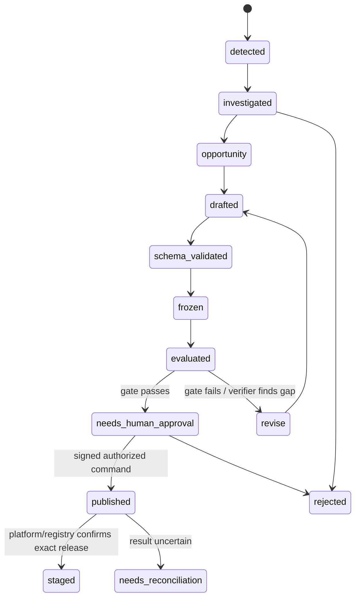

# 5. Proposal artifacts and Agent Core integration

## 5.1 Agent Core is the execution authority

**V3 target lifecycle.** Current records include a narrow bank-cell template-draft path and a separate human-gated synthetic new-agent lifecycle. Neither is the generic original/E0-source-to-Core path. The example below describes the internal contract boundary, not an actual wire payload.

Pulso does not implement a competing agent runtime. It detects a problem and proposes **native Agent Core artifacts**: versioned service building blocks that Agent Core itself understands and executes. Agent Core is a separate platform that stores, validates, evaluates and runs these capabilities. A `Flow` is a defined sequence of steps and branches; an `Agent` uses a large language model (LLM) when open-ended reasoning is needed; a `DecisionModelDef` describes a structured classification or decision (Jev can execute this kind of model); a `Template` is reusable response content; and a `ToolDef` describes an action/data capability exposed to a Flow or Agent. Depending on the supported Core contract, a proposal may contain one artifact or a coordinated combination. Not every improvement is an agent: a deterministic Flow or Jev decision can be the simpler, more testable fit.

Pulso's internal `ChangeSpec`, `CapabilityBundle` and `ReleaseDetail` are Pulso-owned records, not Agent Core request types. They carry the engine's rationale, evidence, lineage and status while referencing Core-native drafts and Core release identifiers. Never serialize these wrapper fields into a Core request unless the versioned bridge contract explicitly defines them.

### Example: Pulso rationale versus the native Core artifact

Suppose the evidence supports testing clearer PQR-status wording. PQR means *petición, queja o reclamo* (customer request, complaint or claim). Pulso's internal proposal envelope might conceptually contain:

```json
{
  "claim": "Status wording may reduce uncertainty; mechanism is unproven",
  "evidence_refs": ["signal:sha256:…", "query:sha256:…"],
  "alternatives": ["do_nothing", "clarify_status_template"],
  "selected_artifact_kind": "Template",
  "base_revision": "template-rev-17",
  "candidate_hash": "sha256:…",
  "evaluation_suite": "suite-rev-4"
}
```

This is a **redacted teaching shape**, not the current Core API schema. Evidence, explanation, rejected alternatives, Pulso run ID and approval request belong to Pulso's proposal/lineage records. The actual Core request contains only fields allowed by the pinned native `Template` contract. Pulso asks Core to store a draft, reads back the returned entity and digest, then evaluates that exact returned candidate. If the readback digest differs, it stops. A successful draft readback means “stored as a draft,” not “behavior works,” “a person approved it,” or “released.”

The separate recorded planted demo's user-visible diff was:

```diff
- Ya consulté tu PQR.
+ Ya consulté tu PQR; su estado actual es {{facts.pqr.value.status}}.
- Já consultei sua solicitação.
+ Já consultei sua solicitação; o status atual é {{facts.pqr.value.status}}.
```

This is evidence that a local synthetic run drafted and read back a native template candidate. In that run, the template placeholder was exercised with seeded state and the harness checked whether the response reflected it; it was not proof that customers got a clearer answer or stopped contacting the bank. The status must come from an authoritative, identity-authorized source at serving time—template wording cannot manufacture it.

## 5.2 Two recorded output shapes and their boundary

| Recorded path | Output and proof | Human/platform transition | Scope warning |
|---|---|---|---|
| Recorded bank-cell mapping run | Aggregate bank-data groups → ranked intervention hypothesis → patch to existing `t/estado_pqr` template → comparison test against the unchanged template → local Core draft readback for five Queja (complaint) channels; `origin=auto_detect` records how the draft was created | This runbook does not claim a person approved it, or that it was published or promoted | Group-level association; no linked complaint causality or customer-outcome lift. The runbook records its local stack and Agent Core scratch-version provenance. |
| Recorded new-agent lifecycle rig | Deliberately planted synthetic Tecnico (technical-support)/Phone finding → draft that clones settings from an existing `soporte-tecnico` agent → target suite fails all 6 cases on the baseline because no candidate agent is present → draft announced | In a separate local UI workflow, a person evaluates and approves; the rig publishes to local staging and activates its local alias named `prod` (a test label, not the bank's production environment) | Only the Cobro indebido (“incorrect charge”) case type was seeded as ready. The test did not show that the new agent routes Tecnico cases correctly or replies successfully; the local alias is not bank deployment. |

The word **announced** has two meanings in these runbooks: a proven draft can be written/read back from the local Agent Core registry with `origin=auto_detect`; or a notification can be sent to the customer-service platform. In the planted demo-loop record, that notification used ANN1, a test double rather than the live platform. Always say which boundary was reached. These run records also have different environments and purposes; a no-approval statement in the bank-cell template run does not negate the separate human action in the agent-lifecycle rig.

## 5.3 Proposal lifecycle



Autonomous work may create, revise, compile and evaluate candidate artifacts up to the configured stop condition. Approval, registry publication and promotion are privileged state transitions, not implicit consequences of a green evaluation. The human sees candidate hash, evidence, tests, risks, expected effect range, rollback path and the exact requested action. The human cannot approve a different hash than the one evaluated.

## 5.4 Bridge boundary and failure semantics

The current Python package `core-bridge/` composes Agent Core at a fixed source revision (a **pin**) and serves private `/internal/v1` routes under the engine's bridge contract. The contract package publishes OpenAPI (a machine-readable HTTP API description), closed JSON schemas (unknown fields are rejected), golden example payloads and conformance checks (tests that both sides agree on the same request/response shapes). Service JSON Web Tokens (JWTs) bind tenant, purpose and audience with a short lifetime and fresh token ID (`jti`); calls that can change state carry idempotency keys. These are integration controls, not proof of production IAM or live deployment.

Treat bridge outcomes as typed states:

| Outcome | Engine behavior |
|---|---|
| Validated/rejected synchronously | Persist schema/validation receipt; do not reinterpret Core error as success |
| Accepted asynchronously (`202`) | Track operation ID and poll/read via authorized operation; do not display completed |
| Idempotent read/transient failure | Bounded retry with the same logical request identity |
| Mutation timed out or response is ambiguous | Mark unknown/reconciliation-needed; read back state before any retry |
| Contract/version mismatch | Block candidate and surface exact incompatible fields/version |
| Unauthorized tenant/purpose/audience | Fail closed, emit redacted audit signal, do not retry with elevated scope |

The pinned README records a real Core composition and local Core test runs, but also identifies the Rust E0→Core `ChangeSpec`/`DraftPlan` mapping and bridge invocation as not yet wired. `e2e-core` is explicitly a test stand-in for that gap. Do not call a stand-in invocation real-wire parity.

## 5.5 Core evaluation and release

Evaluation artifacts should pin Core contract version, candidate entity hashes, baseline revision, test suite revision, scenario IDs, oracle/metric definitions, runtime/model/tool versions and bounded resource profile. A test result is valid only if the candidate actually ran through the relevant runtime path. Schema compilation proves shape, not behavior; deterministic regression proves only the encoded oracle; a model grader is a separate, fallible instrument.

`Release` is Agent Core's registry record for a pinned, runnable capability version. Pulso may wrap its reference in a Pulso-owned view, but must not invent a replacement Core release request/response type. Publishing requires an explicit authorized command and an idempotent operation identity. Promotion to a customer-facing environment belongs to the authorized platform/Core workflow; in the hackathon implementation, any simulated confirmation must be visibly labeled as simulated.

## Source references

- V3 §§17, 20, 24, 27, 29, 31
- [Core bridge runtime overview](https://github.com/pulso-factored/improvement-engine/tree/fc56b598b1be483a6b1eb7ee6fac0d9809c3b646/core-bridge)
- [Bridge wire contract](https://github.com/pulso-factored/improvement-engine/tree/fc56b598b1be483a6b1eb7ee6fac0d9809c3b646/bridge-contract)
- [Open E0-to-Core integration gap](https://github.com/pulso-factored/improvement-engine/blob/fc56b598b1be483a6b1eb7ee6fac0d9809c3b646/docs/gaps/OPEN_GAPS.md)
- [Recorded bank-cell template mapping](https://github.com/pulso-factored/improvement-engine/blob/fc56b598b1be483a6b1eb7ee6fac0d9809c3b646/docs/dev/MAPPING.md)
- [Recorded human-gated agent lifecycle](https://github.com/pulso-factored/improvement-engine/blob/fc56b598b1be483a6b1eb7ee6fac0d9809c3b646/docs/dev/AGT1_NEW_AGENT_PATH.md)
