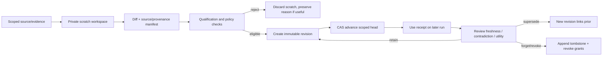

# 7. Memory lifecycle

## 7.1 Memory is a governed knowledge base, not chat history

V3 treats improvement-system memory as a scoped, versioned wiki that an authorized reasoning task can navigate and edit in private scratch. It is separate from customer-facing agent memory and does not retain raw conversations by default. Memory exists to preserve useful, reviewable knowledge across discovery runs: source semantics, corroborated patterns, rejected hypotheses, tested mechanisms, evaluator gaps, and reusable scenario knowledge.

The agent should have flexible navigation within its granted, minimized scope. Control is enforced at the data boundary and publication protocol—not by forcing every thought through a rigid list of narrow retrieval tools. The agent may explore and synthesize; deterministic code checks scope, provenance, revision lineage, grants, expiry and publication conditions.

## 7.2 Lifecycle and immutable revisions



Publication creates a new immutable revision; it never overwrites an old revision. Head advancement is compare-and-swap (**CAS**): update the current pointer only if it still equals the revision the writer read, so concurrent writers cannot silently replace one another. A use receipt records which revision, source, scope and purpose informed a decision. Revocation/tombstones make forgetting explicit and prevent future use; they do not rewrite audit history or erase records that retention policy requires.

Memory should distinguish confidence and evidence type: observed source fact, generated-data observation, tested mechanism, assumption, rejected claim, and open question. Every memory claim has provenance and expiry/freshness rules. Contradictory evidence should create a superseding or contested revision, not silently edit the old statement. Retrieval relevance is not truth or authorization.

### Example memory item: “status wording is worth testing”

This is an **illustrative target memory**, not a claim that the current bank-data run published it:

```text
Claim: A verified current PQR status in the response may reduce status-check uncertainty.
Evidence class: hypothesis, inspired by a planted synthetic template exercise.
Applies to: Spanish/Portuguese PQR status replies only; not complaint resolution.
Source: planted demo run + exact template diff + candidate evaluation receipt.
Confidence: mechanism proxy only; no linked repeat-contact/customer outcome.
Freshness: expire for review when the template, status field contract or evaluation suite changes.
Use restriction: may motivate a test; may not be stated as bank fact or expected savings.
```

If a later run links responses to valid repeat-contact outcomes and contradicts the hypothesis, it should publish a new revision that marks the old claim contested or superseded. The system invalidates retrieval/cache paths and records a use/revocation receipt; it does not quietly rewrite history. A future agent can freely explore the authorized wiki, but only the governed publication and retrieval boundary makes a claim reusable. This is the intended “learn and forget” behavior; current code proves primitives, not this fully joined example.

### Two-run example: preserve what worked, keep what did not prove

Imagine Run A finds a recurring Queja aggregate pattern and MAP1 maps it to the existing PQR-status Template. The evidence repository can retain three separate, scoped memories rather than one overconfident summary:

1. **Pattern memory:** this metric/cell recurred in the named synthetic bank snapshot and met the recorded confirmation policy. It does not say which contact caused which PQR.
2. **Mechanism/test memory:** this exact Template change compiled and discriminated its named regression scenarios under a particular local Agent Core and suite revision. Reuse means “candidate test recipe is available,” not “the change reduced repeat contacts.”
3. **Open-question memory:** no linked customer outcome established whether the wording helps. The claim expires or becomes contested when the status contract, suite, source semantics or platform mapping changes.

Run B may reuse the test recipe to avoid rebuilding the same cases and can freely explore new evidence within its grant. If the aggregate pattern recurs, memory may strengthen the *recurrence* claim only if the source and split are genuinely independent. If the outcome feed later shows no reduction, create a new revision that contests the mechanism, prevent stale retrieval from presenting it as proven, and preserve the historical test receipt. If source semantics changed, mark the old pattern stale rather than quietly transferring it. This is the adaptation of the LLM-wiki idea to a governed bank system: broad exploration in scratch, narrow claims in published memory, explicit provenance, useful forgetting.

This two-run story is target behavior, not a current E0 autonomous memory proof. The repository has scratch, immutable revisions and revocation foundations; durable publication/use coupling and an end-to-end later-run contradiction/forgetting check remain open.

## 7.3 What current code proves

The pinned Rust implementation includes an ephemeral `memory_wiki` scratch surface with typed transformations and restrictions, plus append-only published memory revisions and revocation tombstones. These are meaningful foundations. They do not by themselves prove a fully autonomous cross-run learn/use/forget loop with durable transactional coupling among publication, head updates, live grants/revocations and use receipts. Some E0-specific composition/admission is explicitly dependency-blocked in the implementation journals.

Therefore, distinguish:

- **Scratch exists:** a scoped, temporary working area can be manipulated through typed operations.
- **Publication primitive exists:** immutable revision/tombstone behavior is implemented/tested in the cited module boundary.
- **Cross-run use is proven:** only when an actual subsequent run records and verifies a use receipt for the published revision.
- **Forgetting is effective:** only when future retrieval/use is denied after revocation, including caches and derived indexes within the promised freshness window.

## 7.4 Forgetting, retention and stale knowledge

Forgetting is both a lifecycle action and a retrieval invariant. Revoke access first; invalidate indexes/caches; mark the revision tombstoned; make derived knowledge stale when its source is corrected or revoked; then verify a later retrieval cannot return it under that scope. A tombstone does not claim physical erasure from backups unless the storage retention process proves that separately.

Do not publish raw PII, transcripts, credentials, provider prompts containing unapproved source data, or unsupported causal claims into memory. Prefer aggregate claims with support, bounded applicability, validity period and a query receipt. Memory must never supply a post-outcome field to a pre-outcome detector or leak holdout labels into proposal generation.

## Source references

- V3 §§21, 28, 31
- Pinned implementation modules: `crates/core/src/wiki_scratch.rs`, `memory_store.rs`, `governed_memory_use.rs`, `memory_temporal_protocol.rs`
- [Current implementation inventory and limits](https://github.com/pulso-factored/improvement-engine/blob/fc56b598b1be483a6b1eb7ee6fac0d9809c3b646/README.md)
- [Current integration gaps](https://github.com/pulso-factored/improvement-engine/blob/fc56b598b1be483a6b1eb7ee6fac0d9809c3b646/docs/gaps/OPEN_GAPS.md)
