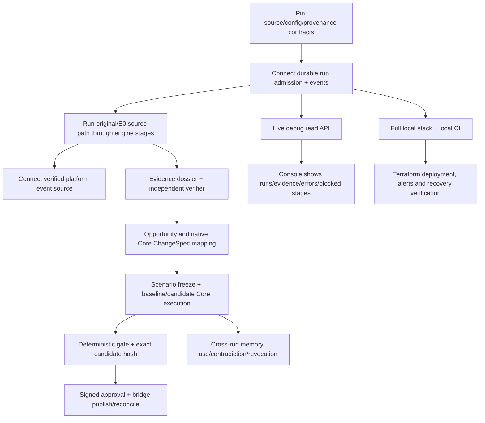

# 9. Implementation map and open gaps

This chapter is a boundary map, not a claim that V3 is complete. “In code” indicates a capability exists at a module/contract boundary in the pinned snapshot. “Connected” requires evidence that the intended runtime path invokes it with real dependencies. “Verified” is restricted to the stated test/run scope.

## 9.0 One-glance state of the end-to-end path

The three columns are deliberately separate: code can exist without having been run, and an isolated local run can exist without being connected to the next product stage.

| Product stage | Code/contract exists in pinned snapshot? | Local exercise recorded? | Joined to next stage / proven in one E2E? | Reader takeaway |
|---|---|---|---|---|
| Read and validate original + E0 inputs | Yes: source/projection contracts and runner | Yes: deterministic offline original/E0 snapshot path; E0 also has an opt-in local-simulation lane | No joined V3 chain across both source families through native Core evaluation | The engine can inspect both inputs offline, and E0 has a bounded detector-to-plan local exercise. |
| Detect signals from data | Yes: descriptive sensors, seven-family platform-event sensor, and an opt-in E0 local-simulation runner | Yes: generated sensor histories, bank-cell scan, and a recorded E0 run over 200 Arranque cases | No live platform feed; the E0 path remains a bounded local simulation, not the full autonomous production workflow | Detection now runs locally against E0; it does not establish real-bank prevalence or customer impact. |
| Investigate and falsify explanations | Bounded investigation/verifier foundations exist | E0 local-sim routes supported evidence through a local Scout/verifier path; a recorded run produced an unlinked mapping result | No complete autonomous signal → independently verified opportunity workflow; evidence and source limitations remain | A local review/simulation exists, but it is not the V3 autonomous investigation or independent confirmation path. |
| Form an opportunity and estimate value | Typed proposal-plan and artifact/model foundations exist | E0 can persist a candidate-bound, non-executable investigation/proposal plan with `investigate_mapping` or `do_nothing`; other paths include descriptive/synthetic examples | No generally connected, evidence-backed native Core authoring and comparative business-value ranker | The engine can record an actionable next investigation without claiming it has created an Agent Core proposal or proven value. |
| Create native Agent Core draft | Python bridge and Core composition exist | Yes: bank-cell MAP1 proved `t/estado_pqr` drafts for five Queja channels; planted synthetic template run also read back a draft | Original/E0 snapshot runner → native Core mapping/invocation is not wired as one path; other bank-cell artifact routes remain blocked | Narrow real-local Core draft proof exists, not a general source-to-Core route. |
| Evaluate baseline vs candidate | Suite, oracle and gate foundations exist | Yes: bank-cell MAP1 and planted synthetic paths require target regression proof; AGT1 base failed 6/6 planted target cases before human review | No generic frozen, representative holdout path across bank/E0 and Core for every artifact; deterministic judge is uncalibrated | The proof discriminates named scenarios; it does not establish customer impact. |
| Human approval, release and outcomes | Contracts and authority boundary are specified | AGT1 documents a person evaluating/approving, publishing to local rig staging and activating the rig's local `prod` alias | No real customer rollout; AGT1 signal/topic did not match its only seeded platform case type, and no customer reply/outcome was verified | Local human-gated lifecycle was exercised; no production bank change or customer lift is demonstrated. |
| Governed cross-run memory | Scratch and immutable revision/revocation primitives exist | Module-level tests; the current published-memory adapter is in-memory | No durable, verified autonomous publish → later use → contradiction/forget cycle | The lifecycle building blocks exist, but production-durable memory and the self-learning loop remain target behavior. |
| Debug/operations visibility | Console plus activity read boundary exist | Partial fixture/stand-in views | Rust API is not fully connected to live execution | Internal backoffice direction is defined; complete runtime observability is not proven. |

This matrix is the simplest mental model of progress: **several useful boxes are green in isolation; the missing value is connecting them into one honest, repeatable run that starts from a source signal and proceeds through a verified candidate, governed decision and measured outcome.**

## 9.1 Capability map

| V3 capability | Present in pinned snapshot | Integrated/verified boundary | Remaining connection or evidence |
|---|---|---|---|
| Source manifest, sealed-source validation, E0 projection | Rust contracts and source/projection modules | Unit/contract boundaries and deterministic local snapshot runner | Complete autonomous detector consumption and deployment source adapters |
| Per-run analytical freedom | Bounded SQLite typed-SELECT foundation | Local queries within that interface | V3 treated-data DuckDB workspace with process/container resource and egress isolation |
| Signal sensor | Aggregate platform-event cell sensor, generated fixtures, and deterministic E0 `local-sim` detector | Synthetic sensor tests and recorded local E0 execution | Real platform event contract/feed/backfill, `monitor::tick`/run integration, and independent real-source confirmation |
| Durable orchestration | Admission/reference reducer, quotas/grants, run activity read model, and U07 atomic compare-and-swap child-job transition plus root-sequenced event append | Reducer/projection behavior and local database contract tests | Integration with U06 admission/lease/quota/fencing gates, durable multi-process queue/worker and restart recovery; the full end-to-end worker loop is not connected |
| Evidence → opportunity → value scenarios | Typed artifact concepts plus an E0 plan that binds signal, evidence packet and mechanism resolution | Local snapshot runner and E0 `local-sim` recorded execution; an unlinked case persisted a non-executable plan and formal `do_nothing` route | One autonomous, general signal-to-independently-verified opportunity/value choice/native-Core path over original and E0 with honest outcomes |
| Agent Core composition | Python `pulso_core_runtime`, contract schemas, local Core composition | Narrow local Core smoke and synthetic demo draft path | Rust `ChangeSpec`/`DraftPlan` mapping and invocation; real-wire joint run; production auth/secrets |
| Artifact proposal and publish controls | Contract/model foundations and bridge idempotency/reconciliation behavior | Candidate compile/draft on documented synthetic loop | End-to-end human-signed exact-hash approval and real authorized release flow |
| Comparative candidate evaluation | Core-shaped suites, scenario contracts, deterministic gate foundations | Narrow local suites and planted demo | Independent confirmation set, broad candidate execution, calibrated claims and operational outcome linkage |
| Memory scratch/publish/revoke | Typed ephemeral wiki, immutable publication primitives, tombstones; published-memory adapter currently in-memory | Module-level behavior | Production-durable cross-run publish/use receipt/revocation coupling and proven E0-specific reuse/forgetting path |
| Debug console | Node/TypeScript internal backoffice with transport and fixture providers | Fixture/stand-in views, schema and stream behavior | Published Rust control/read API, live integrated state and complete redaction/authorization checks |
| Local/production operations | Compose/LocalStack definitions, optional LGTM, separate Terraform project | Rust CI and isolated migration tests | Windows Podman smoke; full local stack; full-language local CI; deployed private ingress, secrets, egress, alerts and recovery drills |

## 9.2 End-to-end paths that must not be conflated

```text
A. Offline source inspection and E0 local-simulation lane
   original bank files + generated/enriched E0 → deterministic validation/projection
   E0 only: deterministic detector → local Scout/verifier simulation → candidate-bound evidence and mechanism resolution
   → optional non-executable investigation/proposal plan; unlinked mapping may route to investigate_mapping,
     while the formal plan route remains do_nothing
   No external provider or Agent Core call, native Core Proposal, release, cause or business-lift claim.

B. Synthetic planted demo loop
   planted synthetic PQR cells → local model/Core composition + explicit doubles
   → candidate draft/evaluation → draft readback
   Demonstrates one planted workflow; does not establish bank prevalence or release.

C. Bank-cell MAP1 path (separate local run family)
   supplied synthetic bank tables → privacy-thresholded aggregate cells
   → corroborated findings → mapping hypothesis → model-authored template patch
   → base/candidate regression proof → local Core auto_detect draft
   Demonstrates a narrow bank-aggregate-to-template-draft path for five Queja channels; not connected to A.

D. Human-gated AGT1 lifecycle (separate planted rig run)
   planted synthetic Tecnico/Phone finding → new-agent draft → regression proof
   → person evaluates/approves → local staging → rig-local `prod` alias activation
   Demonstrates lifecycle mechanics; seeded case type was Cobro indebido, so customer routing/reply was not proved.

E. V3 product target
   unforced source/platform signal → investigation + independent falsification
   → opportunity → native Core artifact(s) → reproducible holdout evaluation
   → exact-hash human approval → authorized release/staging → observed outcome/memory
   This complete general loop is the goal; current evidence is distributed across A–D and does not prove it end to end.
```

## 9.3 Dependency graph for the next implementation sequence



Do not make the graph artificially serial where contracts permit parallel work. The evidence/proposal pipeline can progress against stable fixtures and bridge schemas while durable execution and debug read paths are built, but the eventual integrated demonstration must exercise the joined interfaces rather than just the individual components.

## 9.4 Build/acceptance checklist

A V3 implementation increment is ready to integrate when it has:

- A use case and acceptance criteria tied to V3, with current-vs-target status stated.
- Tests written first and shown failing for the intended reason, then passing after implementation.
- Unit, regression and contract tests; integration/E2E tests with real local dependencies where relevant.
- Tenant, provenance, temporal-availability, retry, cancellation and failure-path coverage appropriate to the slice.
- Independent adversarial review and resolved findings, not just implementer self-review.
- Local reproduction of the applicable CI commands; do not rely on exhausted hosted Actions as the first validation.
- English module/operation docs updated with contracts, inputs/outputs, state changes, errors and verification evidence.
- No secrets or unnecessary PII in fixtures, memory, logs or artifact payloads.

## Sources and freshness

Implementation matrix based on verified GitHub `main` `fc56b598b1be483a6b1eb7ee6fac0d9809c3b646` (commit #125, checked 5 October 2026) and V3 in this workspace. Historical runs have their own runtime/branch provenance in their records. Primary current sources are the [README](https://github.com/pulso-factored/improvement-engine/blob/fc56b598b1be483a6b1eb7ee6fac0d9809c3b646/README.md), [implementation status](https://github.com/pulso-factored/improvement-engine/blob/fc56b598b1be483a6b1eb7ee6fac0d9809c3b646/docs/IMPLEMENTATION_STATUS.md), [open-gap register](https://github.com/pulso-factored/improvement-engine/blob/fc56b598b1be483a6b1eb7ee6fac0d9809c3b646/docs/gaps/OPEN_GAPS.md), [snapshot runner](https://github.com/pulso-factored/improvement-engine/blob/fc56b598b1be483a6b1eb7ee6fac0d9809c3b646/docs/local-e0-e2e-runner.md), [MAP1 bank-cell record](https://github.com/pulso-factored/improvement-engine/blob/fc56b598b1be483a6b1eb7ee6fac0d9809c3b646/docs/dev/MAPPING.md), [AGT1 lifecycle record](https://github.com/pulso-factored/improvement-engine/blob/fc56b598b1be483a6b1eb7ee6fac0d9809c3b646/docs/dev/AGT1_NEW_AGENT_PATH.md), [demo-loop record](https://github.com/pulso-factored/improvement-engine/blob/fc56b598b1be483a6b1eb7ee6fac0d9809c3b646/docs/dev/DEMO_LOOP.md) and [V3 spec](../../archive/source-record/2026-10-05/TECH_SPEC_PULSO_AUTOMEJORA_V3.md).
