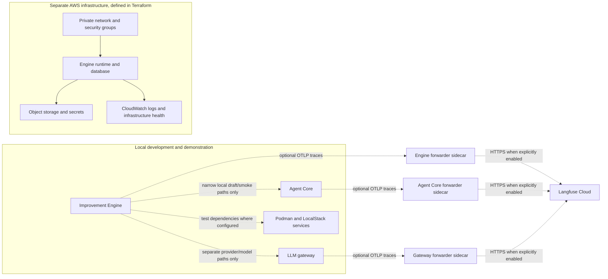
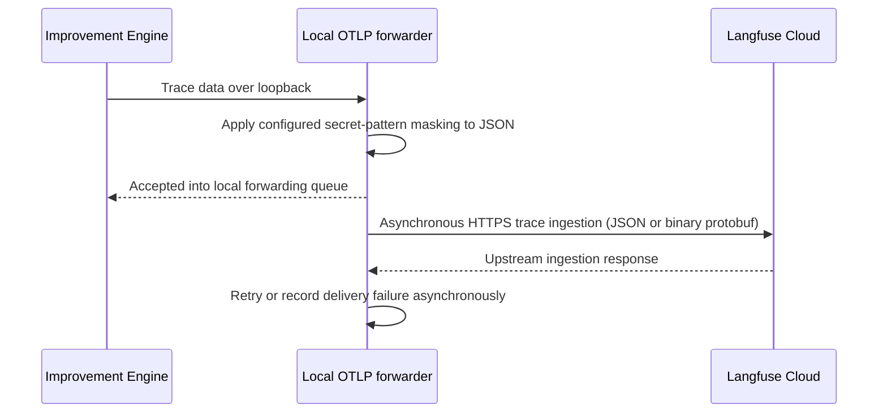

# 14. The foundation around the engine: infrastructure, reliability and Langfuse

## Infrastructure is what lets the engine run safely—not the engine's value proposition

Pulso's core value is the Improvement Engine: discover service problems, challenge the evidence, propose a suitable Agent Core change, test it and learn. The separate `infra` repository supplies the environment in which the engine and its dependencies can run. It owns deployment infrastructure as code; it does not own the detection logic or replace Agent Core.

This separation is deliberate. Engine changes should be developed and tested with the local Podman stack; AWS network, identity, storage, database, compute and alerting should be reviewable and repeatable through Terraform in a separate repository. This keeps service behavior and cloud resources versioned independently while preserving an explicit integration contract between them.

**Source snapshot:** the infra status below is read from GitHub `main` at [`74851d4a`](https://github.com/pulso-factored/infra/commit/74851d4a75109eeddc1661a1a5a7a6d8fd9d1263), freshly fetched on 5 October 2026. Engine telemetry claims are pinned separately to Improvement Engine `main` at [`fc56b598`](https://github.com/pulso-factored/improvement-engine/commit/fc56b598b1be483a6b1eb7ee6fac0d9809c3b646). “In Terraform” means declared/configuration-tested; it does **not** mean created in AWS.

## How the pieces fit

Dashed arrows denote limited or optional integrations, not a single verified end-to-end local stack. The offline original/E0 runner, local Core draft proofs and model/provider demonstrations remain separate paths in the current evidence.

The local stack is for realistic development and repeatable tests. The intended product environments are **staging** and **prod**, and the current `main` README plus hosted Terraform validate job use those as the maintained product roots. The tree also retains `buildbox` and `hackathon` roots: the former supports a separate temporary build-host purpose, while the latter still has standalone tests and compatibility/deployment material. These retained roots are not additional long-lived product environments, but they remain real code and require explicit review before anyone removes them or treats their state as interchangeable. Hosted fmt/init/validate covers staging and prod; separate workflow steps test hackathon modules/root. Check the current README, workflow and each root's own guide before operating on any one of them. This distinction is not evidence of an applied environment.

The simplest deployment intent is: **review Terraform plan → human approves and applies infrastructure → publish an immutable image digest → deploy and health-check the service → observe logs, traces and alarms → roll back to a known digest if necessary.** The repo documents this flow, but the inspected status does not prove AWS resources were applied or that the service is running there.

## What the infra repository currently provides

| Area | What is present in current `main` | What that proves—and what it does not |
|---|---|---|
| Environment structure | The maintained product roots are `staging` and `prod`; `buildbox` and `hackathon` roots are also retained for separate temporary/compatibility purposes. CI formats/validates the product roots and has separate hackathon-focused Terraform tests. | Four directories do not mean four approved product environments. Terraform is versioned, but does not prove any root has been applied or a service deployed. |
| Network and access | VPC/subnet and security-group modules; private service/database placements and restricted ingress are expressed as Terraform inputs and assertions. | The plan can be reviewed for intended boundaries. A mocked-provider test is not an AWS penetration test or evidence of deployed reachability. |
| Compute and persistence | Runtime compute, PostgreSQL and object-storage modules; images are referenced by digest in the deployment design. | The modules and wiring exist. An image digest, credentials, reviewed plan and successful apply are still required before a workload exists. |
| Secrets | Terraform-managed runtime secret wiring plus separately supplied external-provider credentials; documentation lists secret names, not values. | Secret flow is designed. No secret value belongs in Git, chat, a plan artifact or trace. |
| Build and release | GitHub Actions checks and repository scripts support formatting, contract/documentation checks and Terraform tests; deployment steps require a human-reviewed plan and explicit action. | CI can catch covered structural errors. Not every Terraform root/test is covered by hosted CI, and no automatic AWS apply/deploy is configured. Run the documented local suites too. |
| Reliability and operations | Health checks, log-group wiring, rollback/runbook material and infrastructure-level monitoring modules are present. | Service-level alert thresholds and action/runbook contracts are still open; a Terraform resource declaration does not prove an alarm has fired successfully. |
| Deployment state | Readiness documentation says the Terraform path has been prepared/tested offline with mocked providers. | No AWS apply or live deployment was verified in the reviewed source snapshot. Do not call the platform deployed or production-ready. |

The repo's own [open-gap register](https://github.com/pulso-factored/infra/blob/74851d4a75109eeddc1661a1a5a7a6d8fd9d1263/docs/gaps/OPEN_GAPS.md) remains important: it describes missing workload publication/credentials, integration inputs, operational alarms and deployment evidence. The [deployment-readiness guide](https://github.com/pulso-factored/infra/blob/74851d4a75109eeddc1661a1a5a7a6d8fd9d1263/docs/deploy-readiness.md) is an offline plan review and apply checklist, not a record that an apply happened.

## Langfuse: a window into model execution, not the source of business truth

Langfuse is the planned observability destination for traces from the model-driven parts of the platform. A **trace** is a connected record of steps in one run; its spans can show stages, model calls, tool calls, timing, errors, model/usage data and, when deliberately enabled, prompt/response content. This is useful to answer engineering questions such as: *Which stage took the time? Which model was called? Did the tool fail? Did the run stop before a proposal?* Langfuse documents OpenTelemetry Protocol over HTTP ingestion, including JSON and protobuf payloads ([observability overview](https://langfuse.com/docs/observability/overview), [OTel trace ingestion API](https://langfuse.com/docs/api-and-data-platform/features/public-api), [OTel integration details](https://langfuse.com/integrations/native/opentelemetry)).

Langfuse is **not** the Improvement Engine's authoritative record of business evidence, proposal decisions, approvals or customer outcomes. A trace can explain that a model call completed; it cannot prove that the bank complaint was resolved or that the customer benefited. Under V3, engine-owned evidence and decision records—not Langfuse traces—are the product record explaining a conclusion; that end-to-end persistence contract is still only partially implemented. Operational traces can feed a detector only after the source, fields, linkage, retention and purpose are explicitly approved.

### The intended trace path

The current infrastructure design uses an **OpenTelemetry Protocol (OTLP) forwarder**: a small helper process/container (a *sidecar*) alongside each producer. It receives traces on loopback—`127.0.0.1`, reachable inside that producer's own network namespace—and is the only component in that namespace intended to send them to Langfuse Cloud. Infra specifies separate sidecars for the LLM gateway, Agent Core and the Improvement Engine, not one shared forwarder. Producers do not receive Langfuse credentials. The support-platform host is not configured as a trace producer in this design.

This boundary reduces credential exposure and controls egress (outbound network traffic), but it is not a blanket PII filter. The forwarder masks known secret patterns in JSON. Protobuf is a binary encoding; those payloads are passed through byte-for-byte and cannot be inspected by this forwarder, so the emitting component must keep sensitive content out or redact it before export. A pattern scrub for API keys and tokens does **not** guarantee names, account details or free-text personal information are removed. Producers receive local acceptance/queue status; later retry and delivery information is exposed through sidecar statistics and logs, not returned as a synchronous retry result.

### Local observability and AWS observability have different jobs

| View | Best for | Example question |
|---|---|---|
| Engine run records and debug console | Product state, evidence, proposal/evaluation stages and why a run is blocked | “Why did Pulso withhold this opportunity?” |
| Langfuse traces | Cross-component execution details for LLM/model/agent work, timings, calls, errors and configured scores | “Which model call or agent step failed, and what happened around it?” |
| CloudWatch and infrastructure alarms | Host/service health, logs and AWS resource-level signals | “Is the deployed instance healthy? Is a resource threshold breached?” |

These views complement one another; they are not interchangeable. Langfuse can show what the model pipeline did, but run/evidence records explain the engine's product decision. CloudWatch can show infrastructure health, but does not replace per-generation model tracing. The infra gap register still calls out the need to define actionable Improvement Engine service metrics, thresholds, alarm destinations and runbooks.

### Langfuse state: designed, tested locally, not yet a verified cloud deployment

| State | Evidence in the pinned repositories | Honest interpretation |
|---|---|---|
| Engine-side tracing code | Improvement Engine contains run/story trace builders, an OTLP receiver/forwarder, a bridge and a closure script. | Code and tests exist; production wiring is a separate claim. |
| Local integration | The engine docs record local runs against a mock/receiver and tests for trace composition, masking and readback behavior. | Local mock verification is not a successful send to Langfuse Cloud. |
| Terraform wiring | Infra declares sidecars, secrets and endpoint settings behind `otlp_forwarder_enabled`; it defaults off. `otlp_trace_content` also defaults off. | Configuration is optional and tested structurally; the image was not built, sidecar was not run there, and Terraform was not applied. |
| Real cloud export/readback | The current engine closure document explicitly leaves acceptance of real protobuf ingestion and real cloud readback unverified. | Do not claim a verified live Langfuse integration from the checked artifacts. |

The engine repository's [observability guide](https://github.com/pulso-factored/improvement-engine/blob/fc56b598b1be483a6b1eb7ee6fac0d9809c3b646/docs/dev/O11Y.md), [Langfuse closure record](https://github.com/pulso-factored/improvement-engine/blob/fc56b598b1be483a6b1eb7ee6fac0d9809c3b646/docs/dev/LANGFUSE_CLOSURE.md) and the infra repository's [forwarder design](https://github.com/pulso-factored/infra/blob/74851d4a75109eeddc1661a1a5a7a6d8fd9d1263/docs/otlp-forwarder.md) distinguish local checks, mock results and real cloud verification.

## Privacy, retention and operational trade-offs

Tracing makes model behavior easier to debug, but prompts and responses may contain sensitive information. The safe default in Terraform is **content capture off**. With content capture off, the planned export is limited to structure, timing and model/usage metadata; turning it on can send customer free text to an external observability provider. Langfuse is an optional destination for controlled hackathon traces; this guide does not claim approval to export real-customer data or a verified cloud integration.

Important controls and residual risks:

- Langfuse keys are supplied out of band, stored as secret values and read by the forwarder—not embedded in source code or passed to service producers.
- Forwarder enablement and prompt/response capture are separate switches; trace content remains off by default in Terraform.
- Pattern masking is defense in depth for known credentials, not a privacy guarantee for free text or protobuf telemetry. Langfuse also documents source-side masking before export; the current forwarder's secret-pattern scrub is narrower and must not be mistaken for comprehensive application-level redaction ([Langfuse masking guidance](https://langfuse.com/docs/observability/features/masking)).
- The local closure and fixture inputs are synthetic. Do not infer that a run with synthetic data validates a regulated-data path.
- Before any real-data use, set the allowed fields and purpose, region/residency, access controls, retention/deletion period, sampling, masking tests, and incident/rollback owner. Langfuse documents project-level retention controls; actual availability and configuration depend on the selected plan ([data retention docs](https://langfuse.com/docs/administration/data-retention)).
- The Langfuse forwarder is optional. If it is disabled or unavailable, the engine's durable run/evidence state must still be recorded locally and never depend on trace ingestion to decide whether a proposal is valid.

The trade-off is explicit: external traces make cross-service model debugging and evaluation easier, but create an egress and data-retention surface. A loopback-only forwarder, keys withheld from producers, content disabled by default, and source-side minimization reduce that risk; they do not eliminate it.

## What remains before infrastructure becomes an operational demo environment

1. Reconcile the four current `terraform/envs` roots and the hackathon-based production helper/readiness documentation with the intended two environments. Name the one supported staging path and one supported demo/prod path, including backend state keys; do not run/apply any root until that is resolved.
2. Resolve the service deployment dependencies in the infra open-gap register: approved images/digests, remaining runtime contracts/secrets, private ingress/egress and runbook ownership.
3. Define Improvement Engine service metrics and alert behavior, not just host-level logs: blocked-run age, run failures, queue lag, model/provider errors, trace delivery failures and database/storage health need owners, thresholds and response actions.
4. Build and locally exercise the forwarder image; test producer-to-sidecar behavior for JSON and protobuf separately, including failure, retry and shutdown.
5. Use synthetic traces for a controlled real-cloud smoke only after explicit setup; verify by readback and prove exactly which trace fields left the host. Until that succeeds, label Langfuse Cloud as unverified.
6. Review retention and content-capture decisions before collecting real operational text. Ensure the debug console and Langfuse show enough to understand a run without becoming an uncontrolled store of transcripts.

## Sources

- Infra `main` [`74851d4a`](https://github.com/pulso-factored/infra/commit/74851d4a75109eeddc1661a1a5a7a6d8fd9d1263): [Terraform roots](https://github.com/pulso-factored/infra/tree/74851d4a75109eeddc1661a1a5a7a6d8fd9d1263/terraform/envs), [deployment readiness](https://github.com/pulso-factored/infra/blob/74851d4a75109eeddc1661a1a5a7a6d8fd9d1263/docs/deploy-readiness.md), [open gaps](https://github.com/pulso-factored/infra/blob/74851d4a75109eeddc1661a1a5a7a6d8fd9d1263/docs/gaps/OPEN_GAPS.md), [Langfuse forwarder](https://github.com/pulso-factored/infra/blob/74851d4a75109eeddc1661a1a5a7a6d8fd9d1263/docs/otlp-forwarder.md).
- Improvement Engine `main` [`fc56b598`](https://github.com/pulso-factored/improvement-engine/commit/fc56b598b1be483a6b1eb7ee6fac0d9809c3b646): [observability guide](https://github.com/pulso-factored/improvement-engine/blob/fc56b598b1be483a6b1eb7ee6fac0d9809c3b646/docs/dev/O11Y.md), [Langfuse closure notes](https://github.com/pulso-factored/improvement-engine/blob/fc56b598b1be483a6b1eb7ee6fac0d9809c3b646/docs/dev/LANGFUSE_CLOSURE.md).
- [Langfuse tracing overview](https://langfuse.com/docs/observability/overview), [OpenTelemetry trace ingestion](https://langfuse.com/docs/api-and-data-platform/features/public-api), [sensitive-data masking](https://langfuse.com/docs/observability/features/masking), and [data retention](https://langfuse.com/docs/administration/data-retention).
