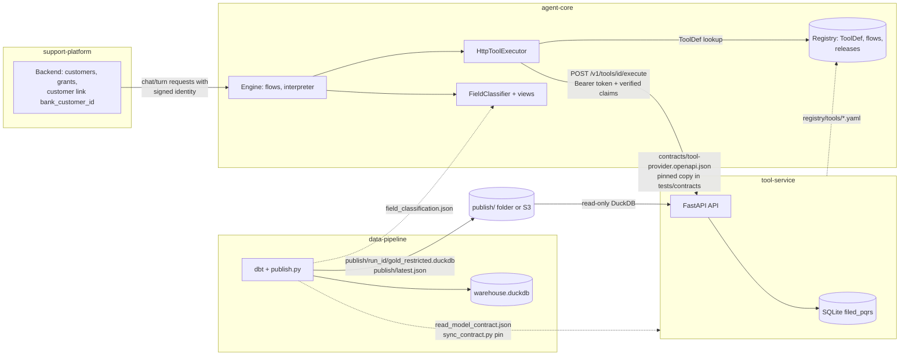
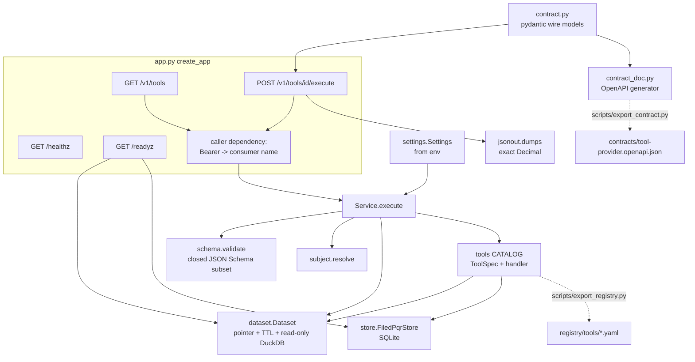
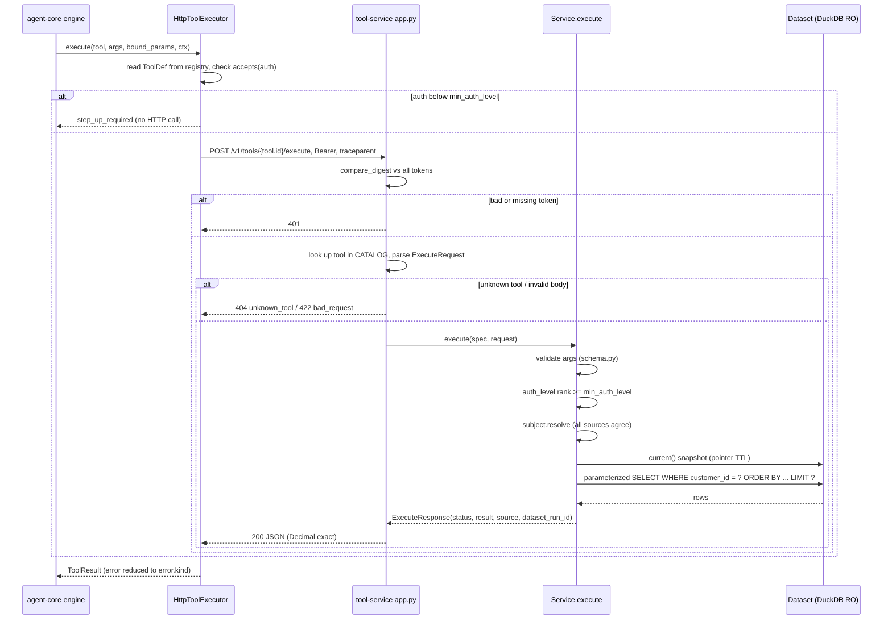
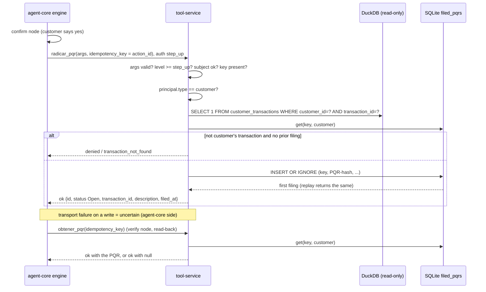

# tool-service: technical documentation

- Repo: https://github.com/pulso-factored/tool-service
- Code documented: `origin/main` at `64c36bc7a5f6ce620e715b28b4efc729694c489b` (2026-10-04, merge of PR #4 "test/read-model-contract").
- Cross-repo facts (agent-core, data-pipeline, support-platform) were checked by reading those repos at their `origin/main` on 2026-10-05 (agent-core `eb33f5c`, data-pipeline `0291edf`, support-platform ADR 0004). Where a fact comes from another repo it is attributed.
- Verification done on the tool-service commit above: `pytest` (55 passed, 1 skipped), `ruff check`, `mypy` (strict), `export_contract.py --check` and `export_registry.py --check` all pass. Not run: Docker build/run, a live data-pipeline publication, real traffic. See section 14.
- Package version 0.1.0 (`pyproject.toml`). Provider contract version 1.0.0.

## Table of contents

1. Purpose and role in the platform
2. Architecture (system context, components, request sequence, write flow)
3. Repo structure
4. The tool registry in depth (format, generation, loading and validation in agent-core)
5. Tool catalog (behavior of each tool)
6. Contracts and schemas
7. API, endpoints and authentication
8. Subject resolution and access rules
9. Execution, validation, errors and limits
10. Configuration and environment variables
11. Local run, tests, Docker and deployment
12. How to add a new tool
13. Pending items and observations
14. Verification status

## 1. Purpose and role in the platform

tool-service is an HTTP service (FastAPI) that exposes **tools** over the data data-pipeline publishes in the `gold_restricted` zone: read tools for a customer's products, movements, profile and cases, plus one write (filing a PQR, a petition/complaint/claim). Its main consumer is `agent-core`, whose `HttpToolExecutor` calls `POST /v1/tools/{id}/execute` (agent-core ADR 0025; data-side design in support-platform ADR 0004).

| Component | Relationship with tool-service |
|---|---|
| data-pipeline | Publishes `publish/<run_id>/gold_restricted.duckdb`, `field_classification.json`, `read_model_contract.json`, `release.json`, and flips `publish/latest.json` last (atomic `os.replace`). tool-service reads the DuckDB read-only and never writes to it. (Verified in `data-pipeline/src/pipeline/publish.py`.) |
| warehouse / `gold_restricted` | A physically separate DuckDB file with PII in the clear; every column is classified (publish fails closed otherwise). It holds read-models per customer: `customer_profile`, `customer_products`, `customer_transactions`, `customer_cases` (and `customer_digital_summary`, not used by any tool). Its intended reader is "authenticated tools" (data-pipeline `publish.py` docstring). |
| agent-core | Consumer. Keeps the `ToolDef` (risk, auth level, idempotency, read-back, `source`) in its registry, sends verified claims, and decides what the model sees through its `FieldClassifier`, keyed by `source` (table name). |
| support-platform | Not a direct caller. It supplies the customer link (platform customer -> `bank_customer_id`) that ends up in the principal/`bound_params`; tool-service only sees `bank_customer_id`, which equals `customer_id` in the read-models (ADR 0004 point 8). |
| Other providers | The contract is provider-neutral: any other service (payments, CRM) can implement the same OpenAPI and be listed in agent-core's registry. |

Design principles:

- **Thin.** It returns rows of curated columns; it does not decide what the model may see. That is agent-core's `FieldClassifier`, using the catalog data-pipeline exports. tool-service still omits internal columns (fraud score, response code, assigned analyst, CSAT, credit score, email, document number).
- **Read-only on the dataset.** The single write is the PQR, in a local SQLite table `filed_pqrs`, idempotent by the engine's action id.
- **No silent stale data.** An unreadable pointer or file is `data_unavailable`.
- Out of scope (agent-core's own or pure compute): `obtener_handoff`, `leer_transcript`, `seleccionar`, `convertir_moneda`.

## 2. Architecture

### 2.1 System context



Solid lines are runtime calls; dotted lines are build/deploy-time artifacts that are copied or generated. The S3 source for the dataset is a pending item; today `TOOL_DATA_DIR` is a local folder.

### 2.2 Components inside tool-service



### 2.3 Request sequence (read tool)



### 2.4 Write flow: `radicar_pqr` and read-back



## 3. Repo structure

```
Dockerfile                      python:3.12-slim image + uv
pyproject.toml / uv.lock        dependencies (duckdb, fastapi, pydantic, uvicorn); dev: pytest, ruff, mypy, httpx, pyyaml, jsonschema
README.md                       existing documentation
docs/technical-documentation.md this document
contracts/
  tool-provider.openapi.json    provider OpenAPI 3.1 contract (generated)
  tool-provider-version.txt     "1.0.0"
  read-model-contract.json      pinned copy of data-pipeline's read-model contract
registry/tools/*.yaml           one ToolDef per tool, named <id>@<version>.yaml (generated)
scripts/
  export_contract.py            generates/checks contracts/tool-provider.*
  export_registry.py            generates/checks registry/tools/*.yaml
  sync_contract.py              refreshes/checks the read-model-contract.json pin from a data dir
src/tool_service/
  main.py                       `tool-service` entry point (uvicorn)
  app.py                        create_app, Service, routes
  contract.py                   pydantic wire models + CONTRACT_VERSION
  contract_doc.py               builds the OpenAPI from contract.py
  settings.py                   environment variables -> Settings
  dataset.py                    latest.json pointer, DuckDB snapshot
  store.py                      SQLite store of filed PQRs
  subject.py                    resolution of the subject customer
  schema.py                     validator for the closed JSON Schema subset
  jsonout.py                    JSON serializer with exact Decimal
  tools/base.py                 ToolSpec, Env, Outcome, helpers
  tools/read.py                 5 read tools
  tools/pqr.py                  radicar_pqr and obtener_pqr
  tools/__init__.py             CATALOG
tests/                          conftest (synthetic dataset), test_access, test_contract, test_read_model_contract, test_registry_export, test_tools
```

There is no `.github` folder at this commit (no CI defined in this repo). `.gitignore` excludes `.venv`, caches, `*.db` and `.env`.

## 4. The tool registry in depth

Two different things are called "registry" and must not be confused:

- **tool-service's catalog** (`CATALOG`, in code): the implementation. A tool exists here when it has a `ToolSpec` and a handler.
- **agent-core's registry**: the source of truth for `ToolDef`s (risk class, auth level, idempotency, read-back, `source`), flows, releases. The YAML files in this repo's `registry/tools/` are the **bridge**: generated from the catalog and meant to be imported into agent-core's registry.

The service implements a tool by name; agent-core's registry owns its policy. The two must say the same thing, which `scripts/export_registry.py --check` enforces on the tool-service side.

### 4.1 `ToolSpec` (src/tool_service/tools/base.py)

| Field | Meaning |
|---|---|
| `id` | tool name; also the `{tool_id}` in the route |
| `description` | text shown to the model (Spanish) |
| `handler` | `(Env, customer_id, args, request) -> Outcome` |
| `args_schema` | closed JSON Schema (built with `closed(...)`) |
| `source` | table name; the key agent-core uses to classify fields |
| `version` | default `1.0.0` |
| `risk_class` | default `read`; `is_write` is true for anything but `read`/`compute` |
| `min_auth_level` | default `session` (`step_up` for `radicar_pqr`) |
| `idempotent` | default true |
| `readback_by` | `idempotency_key` for writes |
| `extra` | free dict, unused by the code read |

### 4.2 Generated file format (`registry/tools/<id>@<version>.yaml`)

`export_registry.py` writes keys in this order: `id`, `version`, `risk_class`, `min_auth_level`, `idempotent`, `readback_by` (only if set), `source` (only if set), `description`, `args_schema`. YAML is dumped with `sort_keys=False`, `allow_unicode`, `width=110`, LF newlines. Every file is deleted and rewritten on regenerate. The filename pattern `<id>@<version>.yaml` is the same one agent-core requires.

`args_schema` is filtered through `registry_schema()`: only `type, enum, properties, required, additionalProperties, items` and the annotations `description, title, default, examples` survive. Dropped: `minimum`, `maximum`, `minLength`, `maxLength`, `format`. Consequence: the registry (and therefore the model) does not see the ranges; the service enforces them itself at execution (section 9). `GET /v1/tools` returns the full schema with those constraints.

Example, `registry/tools/radicar_pqr@1.0.0.yaml`:

```yaml
id: radicar_pqr
version: 1.0.0
risk_class: write_reversible
min_auth_level: step_up
idempotent: true
readback_by: idempotency_key
source: customer_cases
description: Radica una PQR de disputa por un movimiento del cliente atendido (requiere confirmación).
args_schema:
  type: object
  additionalProperties: false
  properties:
    transaction_id:
      type: string
    descripcion:
      type: string
  required:
  - transaction_id
  - descripcion
```

### 4.3 How agent-core loads and validates these files (verified in agent-core `origin/main`)

Reading `agent_core/flows/registry.py`, `agent_core/domain/entities.py`, `agent_core/domain/schema.py`, `agent_core/flows/rules/*`, `agent_core/registry/yaml_io.py`:

- **Layout.** agent-core's registry directory has one folder per entity kind (`tools/` for tools), files named `<id>@<version>.yaml`. `load_registry(root)` scans them without following symlinks, with size limits (1 MiB per file, 5,000 files, depth 8), rejects unsafe names (reserved Windows names, `..`, alternate streams) and never aborts on one bad file (it reports a violation `G0-01`).
- **Consistency checks per file.** The file's `id` and `version` must equal the ones in the filename; the content is parsed with the pydantic model `ToolDef`, which is `extra="forbid"` and frozen. All keys this repo exports are fields of `ToolDef` (`id, version, risk_class, min_auth_level, idempotent, readback_by, source, description, args_schema`), so they pass. `ToolDef` also has fields this repo does not emit: `max_auth_age`, `untrusted_fields`, `confirmation_ttl` (default 5 min).
- **`ToolDef` invariants.** `risk_class` in `read|compute|write_draft|write_reversible|write_irreversible|money_movement`; any write class must declare `readback_by: idempotency_key` (else validation error; this is why `radicar_pqr` has it); `min_auth_level` is an `AuthLevel`; `accepts(auth, at)` compares level and, if `max_auth_age` is set, the authentication age.
- **`args_schema` subset.** agent-core's `domain/schema.py` accepts `type, enum, properties, required, additionalProperties (bool), items` plus annotations (`description, title, default, examples, $schema, $id`) and fails closed on any other keyword (`unsupported_keyword`, rule `G0-24`). That is exactly the set `export_registry.py` keeps, which is why `minimum`/`maxLength`/`format` must be stripped. `tests/test_registry_export.py::test_the_registry_schema_keeps_only_the_closed_subset` guards the tool-service side.
- **Flow validation rules touching tools** (`agent_core/flows/rules`): a tool exposed to an `agent` or `suggest` node (`tools_allowed`) must be `read` or `compute` and must have `description` and `args_schema` (G0-24); a write tool may only be invoked from a `confirm`/`write` node, with `action_from` pointing to a `confirm` whose tool is a write with `readback_by: idempotency_key`; each write needs a `verify` node whose `readback` tool is of class `read` and `by: idempotency_key` (G0-05). In this catalog `obtener_pqr` is the `read` read-back of `radicar_pqr`.
- **Versioning in the registry service.** When proposals are validated (`registry/validation.py`), an entity drafted over an existing one must have a strictly greater semver version (`REG-VERSION`), entities are capped at 262,144 bytes (`REG-LIMIT`).
- **Pinning.** Flows reference tools by ref (`id@version` or a range); a release pins exact versions. The executor sends `"tool": "<id>@<version>"` in the body, but tool-service ignores that field and routes by the path id (so tool-service cannot serve two versions of one id).
- **Runtime use of the `ToolDef`.** `HttpToolExecutor.definition(tool)` reads the `ToolDef` from the registry. Before any HTTP call it refuses with `step_up_required` if the principal's auth level (or age) is insufficient. After the call it checks the returned status is allowed for the class (reads: `ok|error|timeout|denied|step_up_required`; writes: `ok|denied|uncertain|step_up_required`); a write answering anything else, or failing in transit, becomes `uncertain`. Reads retry up to 2 times on `timeout`/`error` only when `idempotent: true`, with a circuit breaker (`interpreter/handlers/tool.py`).
- **Importing the YAMLs.** Nothing in tool-service pushes them. The README says to import `registry/tools/*.yaml` into agent-core's registry; agent-core's e2e runbook says the ids in its `registry-e2e` match this service's, so the demo registry needs no change. I did not find a pinned copy of these specific YAMLs inside agent-core `origin/main` beyond that statement (not verified that the YAML contents of the two repos are byte-identical).

### 4.4 Registry lifecycle (flow)

```mermaid
flowchart TD
    A[Edit ToolSpec in tools/read.py or tools/pqr.py] --> B[CATALOG built in tools/__init__.py]
    B --> C[scripts/export_registry.py]
    C --> D[registry_schema: keep closed subset + annotations]
    D --> E[render YAML: id, version, risk_class, min_auth_level,<br/>idempotent, readback_by, source, description, args_schema]
    E --> F[registry/tools/id@version.yaml committed]
    F --> G{CI/tests: export_registry.py --check<br/>test_registry_export.py}
    G -->|drift| C
    G -->|clean| H[Import YAML into agent-core registry]
    H --> I[load_registry: filename id@version == id/version in file]
    I --> J[ToolDef.model_validate: extra=forbid,<br/>write needs readback_by]
    J --> K[validate_registry: G0-05 writes, G0-24 args_schema subset,<br/>read-only tools for agent/suggest nodes]
    K --> L[Release pins exact ToolDef version]
    L --> M[HttpToolExecutor: ToolDef.accepts then POST to tool-service]
    M --> N[tool-service enforces full args_schema,<br/>subject, step-up again]
```

### 4.5 Registry content today

| id@version | risk_class | min_auth_level | idempotent | readback_by | source |
|---|---|---|---|---|---|
| `leer_productos@1.0.0` | read | session | true | - | `customer_products` |
| `leer_perfil@1.0.0` | read | session | true | - | `customer_profile` |
| `leer_movimientos@1.0.0` | read | session | true | - | `customer_transactions` |
| `buscar_transacciones@1.0.0` | read | session | true | - | `customer_transactions` |
| `leer_pqr_cliente@1.0.0` | read | session | true | - | `customer_cases` |
| `radicar_pqr@1.0.0` | write_reversible | step_up | true | `idempotency_key` | `customer_cases` |
| `obtener_pqr@1.0.0` | read | session | true | - | `customer_cases` |

## 5. Tool catalog

| Tool | Arguments (as enforced by the service) |
|---|---|
| `leer_productos` | `limite` integer 1-50, default 20 |
| `leer_perfil` | none |
| `leer_movimientos` | `limite` 1-50 (default 10); `product_id` string max 64 |
| `buscar_transacciones` | `texto` string 1-100; `desde`/`hasta` date YYYY-MM-DD; `monto_min`/`monto_max` number >= 0; `limite` 1-50 (default 10) |
| `leer_pqr_cliente` | `limite` 1-50 (default 10) |
| `radicar_pqr` | `transaction_id` string 1-64 (required); `descripcion` string 1-2000 (required) |
| `obtener_pqr` | `idempotency_key` string 1-128 (required) |

All use `additionalProperties: false`.

Returned columns (constants in `tools/read.py`):

- Products: `product_id, product_type, product_number, currency, current_balance, credit_limit, interest_rate, product_status, opening_date, expiration_date, days_past_due, credit_limit_applicable, is_missing_credit_limit`. Order: `opening_date DESC NULLS LAST, product_id`.
- Transactions: `transaction_id, product_id, transaction_ts, transaction_type, transaction_category, amount, currency, amount_usd, channel, merchant_name, merchant_category, transaction_country_iso2, transaction_city, transaction_status, amount_usd_source`. Order: `transaction_ts DESC, transaction_id`.
- Profile: `customer_id, first_name, last_name, document_type, segment, customer_status, city, state, country_iso2, registration_date`. One object or `null`.
- Cases: `case_id, opened_at, channel, topic, priority, complaint_status, is_open, claimed_amount, claimed_currency, complaint_description, closed_at, resolved, resolution_code`. Order: `opened_at DESC, case_id`.

Behavior:

- `buscar_transacciones`: `texto` is matched with `ILIKE` against `merchant_name`, `transaction_category`, `merchant_category`; `%`, `_` and `\` are escaped so the text is literal. Dates filter `event_date`; amounts compare `abs(amount)`.
- `leer_pqr_cliente`: merges dataset cases with PQRs filed through this service (shape imitates `customer_cases`: `channel="agent"`, `topic="dispute"`, extra `transaction_id`), sorts by `opened_at` as text descending, truncates to `limite`.
- `radicar_pqr`: requires a `customer` principal, checks the transaction belongs to that customer, id is `PQR-` + first 12 uppercase hex of SHA-256 of the key, initial status `Open`. Returns `{id, status, transaction_id, description, filed_at}`. The description is stored `strip()`ed.
- `obtener_pqr`: same object, or `null` with status `ok` when nothing was filed with that key for that customer.
- Flags returned with values (from data-pipeline's read-model contract): `credit_limit` + `credit_limit_applicable`/`is_missing_credit_limit` (null with applicable=false means "not applicable"; with applicable=true means "unknown"), and `amount_usd` + `amount_usd_source` (`reported`, `derived_identity`, approximate `derived_fx`).
- `complaint_description` is classified `untrusted_text` in data-pipeline's catalog (`dbt/seeds/field_classification.csv`): it can contain instructions. tool-service returns it as is; fencing it is agent-core's job. The generated `ToolDef`s do not set `untrusted_fields` (agent-core's `ToolDef` supports it); how agent-core treats it then is by catalog classification (not verified end to end here).

## 6. Contracts and schemas

### 6.1 Provider contract (`contracts/tool-provider.openapi.json`)

OpenAPI 3.1, version 1.0.0, generated from the pydantic models in `contract.py` by `contract_doc.py` / `scripts/export_contract.py` (`--check` for CI; `tests/test_contract.py::test_the_pinned_contract_files_are_current` also asserts it). It describes only `POST /v1/tools/{tool_id}/execute` and `GET /v1/tools`, not the health checks. Versioning rule (README, `contract.py`): a new optional field is a minor; anything that could trip up a consumer or another provider is a major.

agent-core pins a copy: `tests/contracts/tool-provider-openapi.json` and `tests/contracts/tool-provider-contract-version.txt`, tested by `tests/contracts/test_tool_provider_contract.py` against `HttpToolExecutor` (verified present in agent-core `origin/main`). Its docstring says to take a new version by copying both files from `tool-service/contracts` and running that test. Whether the copy is currently identical to this repo's file was not compared.

### 6.2 Input schema (`ExecuteRequest`)

Models are `frozen` with `extra="ignore"`.

```
ExecuteRequest {
  tool: str | null,
  args: object (default {}),               # written by the model; never carries the subject
  bound_params: {str: str} (default {}),   # fixed by the engine
  context: {
    run_id?: str, call_id: str (required), release?: str, turn_id?: str,
    principal: { type: str (required), id?: str, roles: [str], scopes: [str], attrs: {str:str}, auth_level: str = "session" },
    subject?: { kind: str, ref: str },
    on_behalf_of?: { subject: {kind, ref}, grant_ref: str, scopes: [str] }
  },
  idempotency_key?: str
}
```

agent-core also sends `on_behalf_of.grantee` (type, id); it is ignored here by `extra="ignore"` (verified in agent-core `http_executor._context`). The `tool` field (`leer_productos@1.0.0`) is accepted but unused: the tool is selected by the route id, the minimum level comes from the service's own catalog.

### 6.3 Output schema (`ExecuteResponse`)

```
{ status: ok|denied|step_up_required|error|timeout|uncertain,
  result: any,
  source: str | null,          # table name; key of the FieldClassification
  error: {kind, message} | null,
  dataset_run_id: str | null }
```

This service emits `ok`, `denied`, `step_up_required`, `error`. `timeout` and `uncertain` are in the enum but never produced here; agent-core produces them itself on transport failures (verified: `HttpToolExecutor._failure`). agent-core keeps only `error.kind` (matching `[a-z][a-z0-9_]{0,39}`, else `tool_error`) and discards `error.message`, because it is free text that could carry customer data (agent-core ADR 0025 amendment of 2026-10-05). So error `message` here is informational only and must still never contain data.

Serialization (`jsonout.py`): custom writer preserving `Decimal` scale (`500.00` stays `500.00`), rejecting non-finite `Decimal`, raising `TypeError` on any `float`; dates/datetimes in ISO 8601; `ensure_ascii=False`.

### 6.4 Read-model contract (`contracts/read-model-contract.json`)

Pinned copy of the `read_model_contract.json` data-pipeline publishes with each run (verified generator: `data-pipeline/src/pipeline/read_contract.py`, written by `publish.py`). Pinned values: contract_version 1.0.0, `run_id` run-20261004T231703Z, `as_of` 2026-06-18 (end of the challenge data; "recent" is measured against this date, not the clock). It lists zones `restricted` (`gold_restricted`) and `masked` (`gold_masked`), five tables each, with grain, key, `subject_column` (`customer_id`), `physical_order` (a performance hint, not a guarantee: readers must `ORDER BY`), per-column types, classes, NULL types (`structural`, `state`, `derivable`, `missing_real`, `not_in_source`) and `related_flags`.

How data-pipeline produces it: `build_contract` derives it from the real schema, the classification catalog and the null policy (`dbt/seeds/null_policy.csv`); the grain/semantics text is hand-written in `read_contract.py` and a test requires every published read-model to have it (publication fails otherwise).

`tests/test_read_model_contract.py` checks: every selected column exists in the published read-model; a flag that changes how a value is read is never dropped; every tool `source` is a published read-model with the customer as subject; returning a new direct identifier is a visible decision; and, only if `TOOL_CONTRACT_DATA_DIR` is set, that the pin matches a real publication (skipped by default: this is the 1 skipped test). Refresh:

```
python scripts/sync_contract.py --from <data dir>           # refresh
python scripts/sync_contract.py --from <data dir> --check   # fails if it drifted (ignores run_id)
```

## 7. API, endpoints and authentication

| Method and route | Auth | Description |
|---|---|---|
| `POST /v1/tools/{tool_id}/execute` | Bearer | Runs a tool; `tool_id` is the id without version |
| `GET /v1/tools` | Bearer | Catalog with `id, version, risk_class, min_auth_level, source, idempotent, args_schema` (full schema with ranges) |
| `GET /healthz` | none | `{"status":"ok"}` |
| `GET /readyz` | none | `{"dataset": bool, "store": bool}`; HTTP 503 if any is false |

`docs_url`/`redoc_url` are disabled. HTTP codes: `200` for every tool outcome (including `denied`/`error`), `401` missing/wrong token (`WWW-Authenticate: Bearer`), `404` unknown tool (`error/unknown_tool`), `422` invalid body (`error/bad_request`). Order: auth is checked first (dependency), then the tool lookup, then body parsing.

Authentication: `Authorization: Bearer <token>`. Tokens are configured as `consumer:token`, one per consumer, all distinct. `hmac.compare_digest` runs against all tokens with no early exit; the consumer name goes to the log. The service does **not** cryptographically verify claims: it trusts the claims sent by the authenticated consumer (agent-core verified the JWS at its edge and forwards only the verified claims, never the token; ADR 0025). Hence the bearer is a deployment secret and the service must stay on a private network (README, ADR 0004 point 9).

## 8. Subject resolution and access rules (`subject.py`)

- `customer` principal: reads its own id; no id -> `no_subject`.
- `advisor` principal: needs `on_behalf_of` with `subject.kind == "customer"` and a non-empty `ref`; otherwise `no_delegation`.
- Any other principal type -> `principal_not_served`.
- Sources gathered: principal/delegation id, `context.subject` (if `kind == "customer"`), `bound_params.customer_id`, `bound_params.subject_ref`. If they do not all agree -> `subject_mismatch`. `args` is never a source.
- agent-core names the bound subject parameter through `AGENTCORE_AUTHZ_BIND_KEYS` (set to `subject_ref,customer_id` in its runbook); either name is accepted here.
- Writes: only a `customer` principal can file (`write_not_allowed` for others, including advisors: "the copilot only looks and suggests").
- `grant_ref` and delegation `scopes` are accepted but not checked here; whether the grant is active is agent-core's / the platform's responsibility (`grant_active` adapter in agent-core).

## 9. Execution, validation, errors and limits

Order of checks (`Service.execute`): args schema -> auth level rank (anonymous 0, session 1, step_up 2; unknown values count as 0) -> subject -> write needs `idempotency_key` -> dataset snapshot -> handler. Any unhandled exception becomes `error/internal` ("error interno"); only the exception class name is logged.

Validation (`schema.py`): `integer` (rejects bool), `number` (int/float/Decimal, rejects bool), `string` (`maxLength`, `minLength` on the stripped text, `format: date` via `date.fromisoformat`), `minimum`/`maximum`. Unknown/missing/mistyped arguments produce messages that name the argument, never its value. Other schema types: "tipo no soportado". Defaults from the schema are applied after validation.

| kind | status | When |
|---|---|---|
| `invalid_args` | `error` (read) / `denied` (write) | args fail the schema |
| (none) | `step_up_required` | auth level below the tool's minimum; no effect |
| `no_subject`, `no_delegation`, `principal_not_served`, `subject_mismatch` | `denied` | section 8 |
| `idempotency_key_required` | `denied` | write without key |
| `write_not_allowed` | `denied` | `radicar_pqr` by a non-customer |
| `transaction_not_found` | `denied` | transaction not the customer's and no earlier filing for the key |
| `idempotency_key_in_use` | `denied` | store returned `None` (key belongs to another customer) |
| `data_unavailable` | `error` | pointer or DuckDB file unreadable |
| `internal` | `error` | unhandled exception |
| `unknown_tool` / `bad_request` | HTTP 404 / 422 | section 7 |

Note on writes: `invalid_args` for a write is `denied` (never `error`) because a write must either refuse before any effect or possibly have happened; but `data_unavailable` and `internal` on a write do answer `error`, which agent-core's executor reclassifies as `uncertain` (the contract says a write answering `error` is out of contract).

Limits and properties:

- `MAX_ROWS = 50` per call (`limite` maximum). Queries are parameterized and always filtered by `customer_id`, with explicit `ORDER BY`.
- Dataset: the `latest.json` pointer is trusted for `TOOL_POINTER_TTL_S`; on a new `run_id` a new connection is opened and the previous one is left to finish (not explicitly closed). The pointer cannot leave `data_dir`. Each call uses its own cursor (`USE gold_restricted.gold_restricted`).
- Idempotency: `INSERT OR IGNORE` by key; a replay returns the first filing even if the dataset version changed. Another customer's key never exposes that PQR (`idempotency_key_in_use`, or `null` for `obtener_pqr`).
- Logs: tool, call id, run id, consumer, status, dataset run, latency; never args, results or claims.
- Latency: README claims 0-30 ms per call over 4.4 M transactions (not re-measured).
- Client side: agent-core's default timeout is 10 s (`AGENTCORE_TOOL_SERVICE_TIMEOUT_S`); this service has no timeout of its own.

## 10. Configuration and environment variables

| Variable | Required | Default | Meaning |
|---|---|---|---|
| `TOOL_DATA_DIR` | yes | - | data-pipeline's `data` folder (contains `publish/latest.json`) |
| `TOOL_SERVICE_TOKENS` | yes | - | `consumer:token,other:token2`; non-empty, no empty names/tokens, distinct tokens |
| `TOOL_FILED_DB` | no | `filed_pqrs.db` | SQLite file for filed PQRs (table created at startup) |
| `TOOL_POINTER_TTL_S` | no | `60` | seconds the pointer is trusted; number >= 0 |
| `HOST` | no | `127.0.0.1` | bind address (read in `main.py`) |
| `PORT` | no | `8080` | port |

Invalid configuration exits with `configuración inválida: ...`. `Settings.tokens` is excluded from `repr`. `filed_pqrs` columns: `idempotency_key` (PK), `pqr_id` (UNIQUE), `customer_id`, `transaction_id`, `description`, `status`, `filed_at`.

The matching agent-core side (from its `docs/serve-env.md`, ADR 0025): `AGENTCORE_TOOL_SERVICE_URL`, `AGENTCORE_TOOL_SERVICE_TOKEN` (both or the process does not start), `AGENTCORE_TOOL_SERVICE_TIMEOUT_S` (default 10), `AGENTCORE_READY_REQUIRE_TOOL_SERVICE` (1 makes the tool-service block its `/readyz`), started with `agentcore serve ... --tools agent_core.adapters.tools:http_tool_executor` and `--field-classifier agent_core.composition.classification:field_classifier` with `AGENTCORE_FIELD_CLASSIFICATION_FILES` pointing to data-pipeline's `field_classification.json`.

## 11. Local run, tests, Docker and deployment

Requirements: Python >= 3.12, < 3.13 and `uv`.

```
uv sync
TOOL_DATA_DIR=../data-pipeline/data TOOL_SERVICE_TOKENS=agent-core:<token> uv run tool-service
```

Tests and quality (all run and passing on the documented commit):

```
uv run pytest                                   # 55 passed, 1 skipped
uv run ruff check . && uv run mypy              # clean; mypy strict on src, pydantic plugin
uv run python scripts/export_contract.py --check
uv run python scripts/export_registry.py --check
```

Tests use a synthetic DuckDB dataset with the published layout (`tests/conftest.py`: customers `CLI-0000000001` and `CLI-0000000002`, no network). Files: `test_access.py` (tokens, subject, advisors, pointer TTL, pointer escape, settings), `test_contract.py` (responses validate against the OpenAPI with `jsonschema`), `test_read_model_contract.py` (pin), `test_registry_export.py`, `test_tools.py` (ordering, limits, decimals, wildcards, idempotency, flags).

Docker (`Dockerfile`): `python:3.12-slim`, copies `uv`, `uv sync --frozen --no-dev`, `HOST=0.0.0.0`, `PORT=8080`, `EXPOSE 8080`, `CMD ["tool-service"]`. The image has no data and no volume for `TOOL_FILED_DB` (without one, filed PQRs are lost when the container is recreated; inferred). No `.dockerignore`, no healthcheck. Build not tested (no Docker daemon check completed here).

End-to-end with agent-core (from agent-core `docs/runbook-e2e.md` section 8): start this service with `PORT=8095`, set `AGENTCORE_TOOL_SERVICE_TOKEN`, run `scripts\e2e\serve-tools.ps1`; chat as an advisor with a customer id that exists in the dataset. agent-core's runbook states this was verified with the real model.

Deployment: the repo has no manifests, Terraform, CI or workflows. The image CI is on hold until infrastructure has ECR (user project memory; not in this repo). Production intent (support-platform ADR 0004): S3 dataset source, secret-manager tokens, mTLS or workload identity instead of a static bearer, Postgres instead of SQLite. Run on a private network only.

## 12. How to add a new tool

1. **Decide the tool.** `id` (snake_case Spanish like the others), `source` table (must exist in the read-model with `customer_id` as subject), `risk_class`, `min_auth_level`. If it is a write: it needs a read-back read tool and `readback_by="idempotency_key"` (agent-core refuses a write ToolDef without it).
2. **Check the read-model.** New columns must exist in `contracts/read-model-contract.json`, and their `related_flags` must be returned. If data-pipeline changed, `python scripts/sync_contract.py --from <data dir>` and review the diff.
3. **Write the handler** in `tools/read.py` (or `pqr.py`): `handler(env, customer_id, args, request) -> Outcome`. Parameterized `WHERE customer_id = ?`, explicit `ORDER BY`, curated columns (no direct identifiers or internal fields), `rows(env.cursor(), sql, params)`, `Outcome.ok/denied/error`, no `float`, never read the subject from `args`. Writes require `idempotency_key` and must not answer `error` before any effect.
4. **Declare the `ToolSpec`** in `READ_TOOLS` or `WRITE_TOOLS` with `args_schema=closed({...}, [required])`; use `limit_property(default)` for `limite`. Only `integer`, `number`, `string` and `minimum/maximum/minLength/maxLength/format: date` are implemented in `schema.py`. Write a clear Spanish `description` (it is what the model reads; agent-core requires `description` and `args_schema` for tools given to `agent`/`suggest` nodes).
5. **Registration is automatic**: `CATALOG` is built from `READ_TOOLS` + `WRITE_TOOLS`; `app.py` and the contract do not change.
6. **Regenerate the registry**: `uv run python scripts/export_registry.py`, commit `registry/tools/<id>@<version>.yaml`, and import it into agent-core's registry (check it passes agent-core's flow validation, section 4.3).
7. **Tests**: add cases to `tests/test_tools.py` (happy path, other customer sees nothing, limits, invalid args, for writes: idempotency, step-up, denied paths); review `tests/test_read_model_contract.py` lists if columns/flags changed.
8. **Classification**: make sure data-pipeline's `field_classification.json` covers `source.column` for the new columns (publication already fails if a restricted column is unclassified, so this is guaranteed for dataset columns; computed fields need an agent-core overlay).
9. **Contract**: adding a tool does not change `tool-provider.openapi.json`. Changing `contract.py` needs `export_contract.py`, a version bump (`CONTRACT_VERSION` and `contracts/tool-provider-version.txt`), and copying both files into agent-core `tests/contracts/`.
10. Run `pytest`, `ruff`, `mypy` and both `--check` scripts.

Changing a tool incompatibly means a new `version` (filename includes it), but the endpoint resolves by id only, so two versions of one id cannot coexist in the service (deduced from the code).

## 13. Pending items and observations

From the README ("Not done yet"):

- S3 source for the dataset (today a local folder), caching tuned for a deployment, tokens from a secret manager.
- `filed_pqrs` is SQLite; the bank's case system is not integrated (a filed PQR is not reconciled with it).
- Per-role field policy for `leer_perfil` (needs data governance).

Observations from the code (not official pending items):

- No CI, `.dockerignore`, Docker healthcheck, or persistent volume for SQLite in the repo.
- `execute` in `app.py` is an `async` route that calls the synchronous `service.execute` (DuckDB/SQLite), so a slow query blocks the event loop. No own timeout; `timeout` is never emitted.
- Claims are trusted as received; security rests on the bearer and the private network. Grants are not checked here.
- Connections of earlier runs are not closed explicitly on `run_id` rotation.
- `GET /v1/tools` could let agent-core fail a release publish when a tool is missing; agent-core ADR 0025 lists this as open.
- The registry YAMLs do not carry `untrusted_fields`, `max_auth_age` or `confirmation_ttl`.
- `ToolInfo` returned by `GET /v1/tools` does not include `readback_by` or `description` (only the registry YAML does).

## 14. Verification status

Verified in this review:

- Tool-service code read in full at `64c36bc`; `pytest` 55 passed / 1 skipped, `ruff`, `mypy`, `export_contract --check`, `export_registry --check` all clean.
- agent-core `origin/main`: `HttpToolExecutor`, `ToolDef`, closed schema subset, registry loader and flow rules, field classifier loader, pinned provider-contract test (read from source, not executed).
- data-pipeline `origin/main`: `publish.py` layout and atomic pointer, `read_contract.py` generator, classification seed (read, not executed).
- support-platform ADR 0004 (design intent).

Not verified:

- Docker build and container run; behavior with a real data-pipeline publication (the `TOOL_CONTRACT_DATA_DIR` test was skipped); the 0-30 ms latency figure.
- That agent-core's pinned `tool-provider-openapi.json` and its registry YAMLs are currently identical to this repo's files.
- How agent-core's views treat `complaint_description` end to end without `untrusted_fields` on the ToolDef.
- Behavior under concurrency, S3 sources, and any deployment infrastructure (none exists in this repo).
