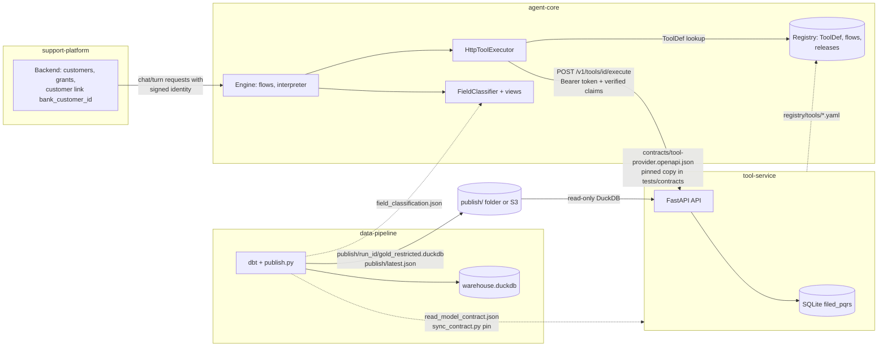
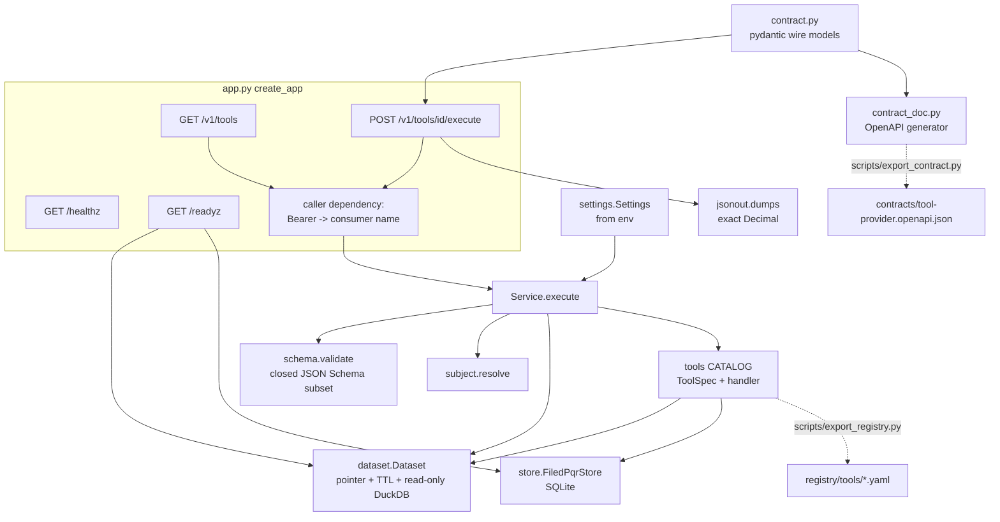
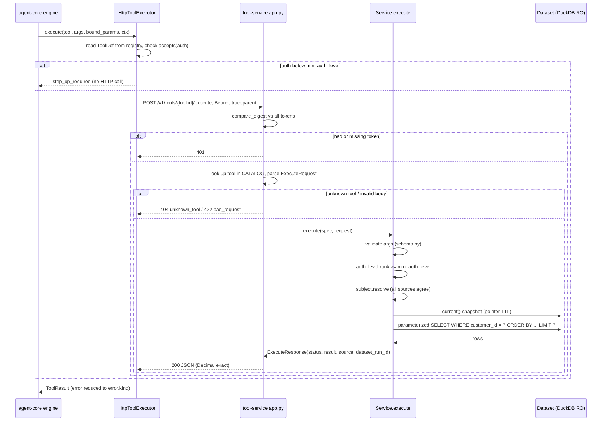
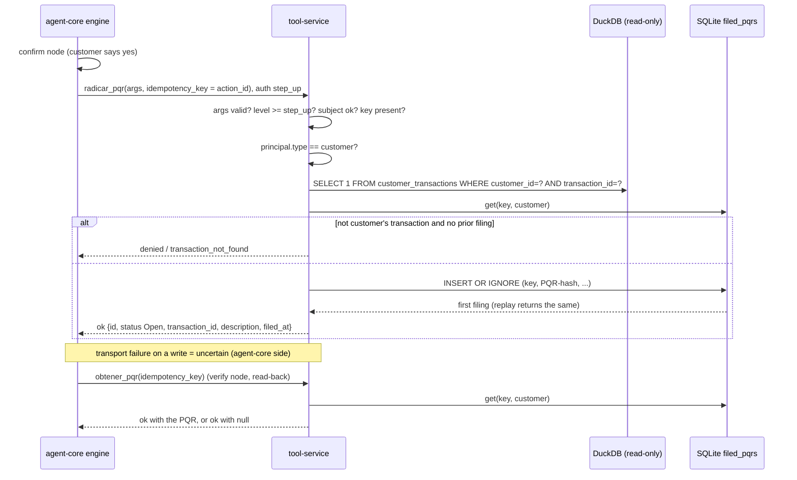
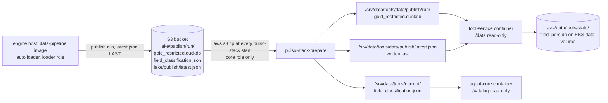
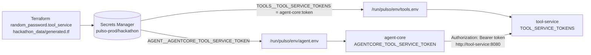
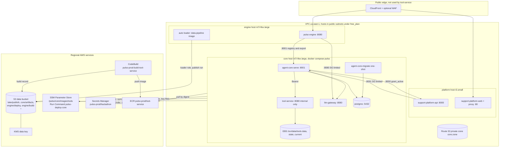
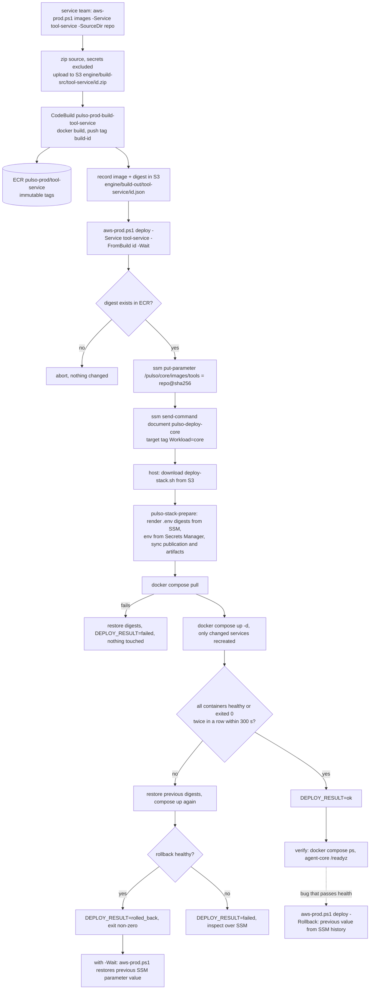

# tool-service: technical documentation

| | |
|---|---|
| Service repo | https://github.com/pulso-factored/tool-service, `origin/main` `64c36bc7a5f6ce620e715b28b4efc729694c489b` (2026-10-04, PR #4) |
| Cross-repo sources (read at `origin/main`, 2026-10-05) | agent-core `eb33f5c`, data-pipeline `0291edf`, support-platform ADR 0004, **infra `246ddf8527a18db4db2ba93b163df2f7adda75d0`** (2026-10-05, PR #55) |
| Package / contract version | 0.1.0 / provider contract 1.0.0 |
| Language | English; tool descriptions and error messages inside the code are Spanish (they are shown to the model) |

**Path convention.** Paths written as `infra:<path>`, `agent-core:<path>` or `data-pipeline:<path>` point to those repos at the commits above. Plain paths belong to tool-service.

**Callouts.** *Note* = clarification. *Not verified* = could not be checked from the code or by running it. *Discrepancy* = two sources disagree.

## Executive summary

tool-service is a small FastAPI service that gives agent-core a set of tools over a customer's banking data: products, movements, profile, cases, and one write (filing a PQR, a dispute/complaint). It reads a DuckDB file that data-pipeline publishes (`gold_restricted`, PII in the clear), always filtered by the customer the caller is allowed to see. The only thing it writes is a SQLite table of PQRs it filed.

- **Contract.** One route, `POST /v1/tools/{id}/execute`, plus `GET /v1/tools`. The contract is provider-neutral (OpenAPI 3.1, v1.0.0) and pinned by agent-core.
- **Policy lives elsewhere.** agent-core's registry owns each tool's risk class, auth level and read-back (`ToolDef`); tool-service implements the data side and re-checks auth, subject and arguments. What the model may see is decided by agent-core's `FieldClassifier`.
- **Quality.** On the documented commit: 55 tests pass (1 skipped), ruff and mypy (strict) are clean, and the generated contract and registry files are in sync.
- **Deployment (AWS).** In the infra repo it runs as a container on the *core host* (EC2, docker compose), only on the internal compose network, beside agent-core, llm-gateway and Postgres. Everything is behind the flag `agent_services_enabled` (default `false`). **Terraform for it is declared and tested with mocked providers; there is no evidence in the repos that any of it was applied** (section 12).
- **Main gaps.** Dataset comes from a local folder synced at host start (no S3 reader); no real case-system integration; no CI or Docker healthcheck in the service repo; several infra documents disagree with each other (section 12.10).

## Quick facts

| Item | Value |
|---|---|
| Runtime | Python 3.12, FastAPI, uvicorn, DuckDB (read-only), SQLite |
| Port | 8080 (`PORT`), bind `127.0.0.1` locally, `0.0.0.0` in the image |
| Auth | `Authorization: Bearer <consumer token>`; one token per consumer (`TOOL_SERVICE_TOKENS`) |
| Tools | 7: `leer_productos`, `leer_perfil`, `leer_movimientos`, `buscar_transacciones`, `leer_pqr_cliente`, `radicar_pqr` (write), `obtener_pqr` (read-back) |
| Row cap | 50 per call |
| Dataset | `<TOOL_DATA_DIR>/publish/latest.json` -> `publish/<run>/gold_restricted.duckdb`, pointer re-read every 60 s |
| State | SQLite `filed_pqrs` at `TOOL_FILED_DB` |
| Health | `/healthz` (liveness), `/readyz` (dataset + store; 503 if either is down) |
| Container limit on AWS | `mem_limit: 1024m`, uid 10001, no published port |
| Image | built by CodeBuild from the repo `Dockerfile`, stored in ECR as `pulso-prod/tool-service`, deployed by digest through SSM |
| Tests | `uv run pytest` -> 55 passed, 1 skipped |

## Table of contents

1. Purpose and role in the platform
2. Architecture
3. Repo structure
4. The tool registry in depth
5. Tool catalog
6. Contracts and schemas
7. API, endpoints and authentication
8. Subject resolution and access rules
9. Execution, validation, errors and limits
10. Configuration and environment variables
11. Local run, tests and Docker
12. Infrastructure and deployment (AWS)
13. How to add a new tool
14. Pending items and observations
15. Verification status
16. Glossary

---

## 1. Purpose and role in the platform

| Component | Relationship with tool-service |
|---|---|
| data-pipeline | Publishes `publish/<run_id>/gold_restricted.duckdb`, `field_classification.json`, `read_model_contract.json`, `release.json`, and moves `publish/latest.json` last with an atomic `os.replace` (`data-pipeline:src/pipeline/publish.py`). tool-service reads it read-only. |
| warehouse (`gold_restricted`) | A physically separate DuckDB file, PII in the clear, every column classified (publication fails otherwise). Read-models used: `customer_profile`, `customer_products`, `customer_transactions`, `customer_cases`. `customer_digital_summary` is published but no tool uses it. |
| agent-core | Consumer. Holds the `ToolDef`s in its registry, sends verified claims, and classifies result fields by `source` (table name). |
| support-platform | Not a direct caller. It supplies the customer link (platform customer -> `bank_customer_id`); tool-service only sees `bank_customer_id`, which equals `customer_id` in the read-models (support-platform ADR 0004, point 8). |
| Other providers | Any service can implement the same OpenAPI to expose its tools to agent-core. |

Design principles:

- **Thin.** Returns rows of curated columns. It omits internal columns (fraud score, response code, assigned analyst, CSAT, credit score, email, document number), but the visibility decision for the model is agent-core's.
- **Read-only on the dataset.** The single write is a PQR in SQLite, idempotent by the engine's action id.
- **No silent stale data.** An unreadable pointer or file is `data_unavailable`.
- **Out of scope** (agent-core's own or pure compute): `obtener_handoff`, `leer_transcript`, `seleccionar`, `convertir_moneda`.

## 2. Architecture

### 2.1 System context



Solid lines are runtime calls; dotted lines are build-time artifacts that are copied or generated. On AWS, "publish/ folder or S3" is S3 plus a local copy synced at host start (section 12.3).

### 2.2 Components inside tool-service



### 2.3 Request sequence (read tool)



### 2.4 Write flow: `radicar_pqr` and read-back



### 2.5 Check order in `Service.execute`

1. Bearer auth (dependency `caller`) -> 401.
2. Unknown tool -> 404; body not an `ExecuteRequest` -> 422.
3. Args schema -> `error/invalid_args` (read) or `denied/invalid_args` (write).
4. Auth level rank (anonymous 0, session 1, step_up 2; unknown = 0) below the tool's minimum -> `step_up_required`, no effect.
5. Subject resolution -> `denied` (`no_subject`, `no_delegation`, `principal_not_served`, `subject_mismatch`).
6. Write without `idempotency_key` -> `denied/idempotency_key_required`.
7. Dataset snapshot -> `error/data_unavailable` if unreadable.
8. Schema defaults applied, handler called with the already-resolved `customer_id`.
9. Any unhandled exception -> `error/internal` (no stack trace; only the class name is logged).

## 3. Repo structure

```
Dockerfile                      python:3.12-slim image + uv
pyproject.toml / uv.lock        deps: duckdb, fastapi, pydantic, uvicorn; dev: pytest, ruff, mypy, httpx, pyyaml, jsonschema
README.md                       existing documentation
docs/technical-documentation.md this document
contracts/
  tool-provider.openapi.json    provider OpenAPI 3.1 (generated)
  tool-provider-version.txt     "1.0.0"
  read-model-contract.json      pinned copy of data-pipeline's read-model contract
registry/tools/*.yaml           one ToolDef per tool, <id>@<version>.yaml (generated)
scripts/
  export_contract.py            generates/checks contracts/tool-provider.*
  export_registry.py            generates/checks registry/tools/*.yaml
  sync_contract.py              refreshes/checks the read-model pin from a data dir
src/tool_service/
  main.py                       `tool-service` entry point (uvicorn)
  app.py                        create_app, Service, routes
  contract.py                   pydantic wire models + CONTRACT_VERSION
  contract_doc.py               builds the OpenAPI from contract.py
  settings.py                   env vars -> Settings
  dataset.py                    latest.json pointer, DuckDB snapshot
  store.py                      SQLite store of filed PQRs
  subject.py                    subject resolution
  schema.py                     closed JSON Schema subset validator
  jsonout.py                    JSON writer with exact Decimal
  tools/base.py                 ToolSpec, Env, Outcome, helpers
  tools/read.py                 5 read tools
  tools/pqr.py                  radicar_pqr, obtener_pqr
  tools/__init__.py             CATALOG
tests/                          conftest (synthetic dataset), test_access, test_contract,
                                test_read_model_contract, test_registry_export, test_tools
```

*Note.* No `.github` folder at this commit: the service repo defines no CI. `.gitignore` excludes `.venv`, caches, `*.db`, `.env`.

## 4. The tool registry in depth

Two things are called "registry":

| | What it is | Role |
|---|---|---|
| tool-service `CATALOG` (code) | the implementation | a tool exists when it has a `ToolSpec` and a handler |
| agent-core registry | source of truth for `ToolDef`s, flows, releases | owns risk class, auth level, idempotency, read-back, `source` |

`registry/tools/*.yaml` is the **bridge**: generated from the catalog and imported into agent-core's registry. `scripts/export_registry.py --check` guarantees the two sides say the same thing.

### 4.1 `ToolSpec` (`src/tool_service/tools/base.py`)

| Field | Meaning |
|---|---|
| `id` | tool name; also the `{tool_id}` in the route |
| `description` | text shown to the model (Spanish) |
| `handler` | `(Env, customer_id, args, request) -> Outcome` |
| `args_schema` | closed JSON Schema built with `closed(...)` |
| `source` | table name; key agent-core uses to classify fields |
| `version` | default `1.0.0` |
| `risk_class` | default `read`; `is_write` is true for anything but `read`/`compute` |
| `min_auth_level` | default `session` (`step_up` for `radicar_pqr`) |
| `idempotent` | default true |
| `readback_by` | `idempotency_key` for writes |
| `extra` | free dict, unused by the code read |

### 4.2 Generated file format

`export_registry.py` writes `registry/tools/<id>@<version>.yaml` with keys in this order: `id`, `version`, `risk_class`, `min_auth_level`, `idempotent`, `readback_by` (if set), `source` (if set), `description`, `args_schema`. Dumped with `sort_keys=False`, `allow_unicode`, `width=110`, LF newlines; every file is deleted and rewritten on regenerate.

`args_schema` goes through `registry_schema()`: only `type, enum, properties, required, additionalProperties, items` and the annotations `description, title, default, examples` survive. Dropped: `minimum`, `maximum`, `minLength`, `maxLength`, `format`. So the registry (and the model) do not see ranges; the service enforces them at execution (section 9). `GET /v1/tools` returns the full schema.

```yaml
# registry/tools/radicar_pqr@1.0.0.yaml
id: radicar_pqr
version: 1.0.0
risk_class: write_reversible
min_auth_level: step_up
idempotent: true
readback_by: idempotency_key
source: customer_cases
description: Radica una PQR de disputa por un movimiento del cliente atendido (requiere confirmación).
args_schema:
  type: object
  additionalProperties: false
  properties:
    transaction_id:
      type: string
    descripcion:
      type: string
  required:
  - transaction_id
  - descripcion
```

### 4.3 How agent-core loads and validates the files

Verified by reading `agent-core:agent_core/flows/registry.py`, `domain/entities.py`, `domain/schema.py`, `flows/rules/*`, `registry/validation.py`, `adapters/tools/http_executor.py`, `interpreter/handlers/tool.py`.

| Stage | Rule |
|---|---|
| Layout | one folder per entity kind (`tools/`), files `<id>@<version>.yaml`. `load_registry` does not follow symlinks, caps files (1 MiB each, 5,000 files, depth 8), rejects unsafe names, and never aborts on one bad file (violation `G0-01`). |
| Per-file check | `id` and `version` inside the file must equal the filename. Content is parsed by pydantic `ToolDef` (`extra="forbid"`, frozen). Every key this repo exports is a `ToolDef` field. |
| `ToolDef` fields not emitted here | `max_auth_age`, `untrusted_fields`, `confirmation_ttl` (default 5 min). |
| `ToolDef` invariant | any write class must declare `readback_by: idempotency_key` (this is why `radicar_pqr` has it). |
| `args_schema` subset | `domain/schema.py` accepts `type, enum, properties, required, additionalProperties (bool), items` plus annotations and fails closed on any other keyword (rule `G0-24`). It is exactly the set `export_registry.py` keeps. |
| Flow rules | tools given to `agent`/`suggest` nodes must be `read`/`compute` and have `description` + `args_schema` (G0-24). A write tool is invoked only through a `confirm` node, with a `verify` node whose `readback` tool is class `read` and `by: idempotency_key` (G0-05). Here `obtener_pqr` is that read-back. |
| Proposal validation | an entity drafted over an existing one needs a strictly greater semver (`REG-VERSION`); entities are capped at 262,144 bytes (`REG-LIMIT`). |
| Pinning | flows reference tools by ref; a release pins exact versions. The executor sends `"tool": "<id>@<version>"` but the URL uses only `tool.id`. |
| Runtime | `HttpToolExecutor` reads the `ToolDef`; before any HTTP call it returns `step_up_required` if the principal's level (or age, if `max_auth_age`) is insufficient. After the call it checks the status is allowed for the class (reads: `ok|error|timeout|denied|step_up_required`; writes: `ok|denied|uncertain|step_up_required`). A write that fails in transit or answers outside that set becomes `uncertain`. Reads retry up to 2 times on `timeout`/`error` only if `idempotent`, behind a circuit breaker. |

*Note.* tool-service ignores the `tool` field in the body and routes by the path id, so it cannot serve two versions of one id.
*Not verified.* That the YAMLs imported into agent-core are byte-identical to this repo's files. agent-core's e2e runbook only states that the ids in its `registry-e2e` match (`agent-core:docs/runbook-e2e.md` section 8).

### 4.4 Registry lifecycle

```mermaid
flowchart TD
    A[Edit ToolSpec in tools/read.py or tools/pqr.py] --> B[CATALOG built in tools/__init__.py]
    B --> C[scripts/export_registry.py]
    C --> D[registry_schema: keep closed subset + annotations]
    D --> E[render YAML: id, version, risk_class, min_auth_level,<br/>idempotent, readback_by, source, description, args_schema]
    E --> F[registry/tools/id@version.yaml committed]
    F --> G{export_registry.py --check<br/>test_registry_export.py}
    G -->|drift| C
    G -->|clean| H[Import YAML into agent-core registry]
    H --> I[load_registry: filename id@version == id/version in file]
    I --> J[ToolDef.model_validate: extra=forbid,<br/>write needs readback_by]
    J --> K[validate_registry: G0-05 writes, G0-24 args_schema subset,<br/>read-only tools for agent/suggest nodes]
    K --> L[Release pins exact ToolDef version]
    L --> M[HttpToolExecutor: ToolDef.accepts then POST to tool-service]
    M --> N[tool-service enforces full args_schema,<br/>subject, step-up again]
```

### 4.5 Registry content

| id@version | risk_class | min_auth_level | idempotent | readback_by | source |
|---|---|---|---|---|---|
| `leer_productos@1.0.0` | read | session | true | - | `customer_products` |
| `leer_perfil@1.0.0` | read | session | true | - | `customer_profile` |
| `leer_movimientos@1.0.0` | read | session | true | - | `customer_transactions` |
| `buscar_transacciones@1.0.0` | read | session | true | - | `customer_transactions` |
| `leer_pqr_cliente@1.0.0` | read | session | true | - | `customer_cases` |
| `radicar_pqr@1.0.0` | write_reversible | step_up | true | `idempotency_key` | `customer_cases` |
| `obtener_pqr@1.0.0` | read | session | true | - | `customer_cases` |

## 5. Tool catalog

| Tool | Arguments enforced by the service (all with `additionalProperties: false`) |
|---|---|
| `leer_productos` | `limite` integer 1-50, default 20 |
| `leer_perfil` | none |
| `leer_movimientos` | `limite` 1-50 (default 10); `product_id` string, max 64 |
| `buscar_transacciones` | `texto` string 1-100; `desde`/`hasta` date YYYY-MM-DD; `monto_min`/`monto_max` number >= 0; `limite` 1-50 (default 10) |
| `leer_pqr_cliente` | `limite` 1-50 (default 10) |
| `radicar_pqr` | `transaction_id` string 1-64 (required); `descripcion` string 1-2000 (required) |
| `obtener_pqr` | `idempotency_key` string 1-128 (required) |

Returned columns (constants in `tools/read.py`):

| Tool group | Columns | Order |
|---|---|---|
| Products | `product_id, product_type, product_number, currency, current_balance, credit_limit, interest_rate, product_status, opening_date, expiration_date, days_past_due, credit_limit_applicable, is_missing_credit_limit` | `opening_date DESC NULLS LAST, product_id` |
| Transactions | `transaction_id, product_id, transaction_ts, transaction_type, transaction_category, amount, currency, amount_usd, channel, merchant_name, merchant_category, transaction_country_iso2, transaction_city, transaction_status, amount_usd_source` | `transaction_ts DESC, transaction_id` |
| Profile (object or `null`) | `customer_id, first_name, last_name, document_type, segment, customer_status, city, state, country_iso2, registration_date` | n/a |
| Cases | `case_id, opened_at, channel, topic, priority, complaint_status, is_open, claimed_amount, claimed_currency, complaint_description, closed_at, resolved, resolution_code` | `opened_at DESC, case_id` |

Behavior:

- **`buscar_transacciones`**: `texto` is matched with `ILIKE` on `merchant_name`, `transaction_category`, `merchant_category`; `%`, `_`, `\` are escaped (literal text). Dates filter `event_date`; amounts compare `abs(amount)`.
- **`leer_pqr_cliente`**: merges dataset cases with PQRs filed here (shape imitates `customer_cases`: `channel="agent"`, `topic="dispute"`, extra `transaction_id`), sorts by `opened_at` as text descending, truncates to `limite`.
- **`radicar_pqr`**: `customer` principals only; checks the transaction belongs to the customer; id is `PQR-` + first 12 uppercase hex of SHA-256 of the key; status `Open`; description stored stripped. Returns `{id, status, transaction_id, description, filed_at}`.
- **`obtener_pqr`**: same object, or `null` with status `ok` if nothing was filed with that key for that customer.
- **Flags returned with values** (from the read-model contract): `credit_limit` + `credit_limit_applicable`/`is_missing_credit_limit` (null with applicable=false is "not applicable"; with applicable=true is "unknown"); `amount_usd` + `amount_usd_source` (`reported`, `derived_identity`, approximate `derived_fx`).
- **`complaint_description`** is `untrusted_text` in data-pipeline's classification (`data-pipeline:dbt/seeds/field_classification.csv`): it may contain instructions. tool-service returns it as is; fencing is agent-core's job. The generated `ToolDef`s do not set `untrusted_fields`.

*Not verified.* How agent-core's views treat `complaint_description` end to end when the `ToolDef` has no `untrusted_fields`.

## 6. Contracts and schemas

### 6.1 Provider contract

`contracts/tool-provider.openapi.json` (OpenAPI 3.1, v1.0.0) is generated from the pydantic models in `contract.py` by `contract_doc.py` / `scripts/export_contract.py` (`--check` for CI; `tests/test_contract.py` also asserts it). It describes only `POST /v1/tools/{tool_id}/execute` and `GET /v1/tools`. Versioning: a new optional field is a minor; anything that could trip up a consumer or another provider is a major.

agent-core pins a copy at `agent-core:tests/contracts/tool-provider-openapi.json` and `tool-provider-contract-version.txt`, tested by `test_tool_provider_contract.py` against `HttpToolExecutor`. Its docstring says: to take a new version, copy both files from `tool-service/contracts` and run that test.

*Not verified.* Whether agent-core's pinned copy is currently identical to this repo's file.

### 6.2 Input schema (`ExecuteRequest`)

Models are `frozen`, `extra="ignore"`.

```
ExecuteRequest {
  tool: str | null,
  args: object (default {}),               # written by the model; never carries the subject
  bound_params: {str: str} (default {}),   # fixed by the engine
  context: {
    run_id?: str, call_id: str (required), release?: str, turn_id?: str,
    principal: { type: str (required), id?: str, roles: [str], scopes: [str], attrs: {str:str}, auth_level: str = "session" },
    subject?: { kind: str, ref: str },
    on_behalf_of?: { subject: {kind, ref}, grant_ref: str, scopes: [str] }
  },
  idempotency_key?: str
}
```

agent-core also sends `on_behalf_of.grantee`; it is ignored here (`extra="ignore"`). The `tool` field is accepted but unused.

### 6.3 Output schema (`ExecuteResponse`)

```
{ status: ok|denied|step_up_required|error|timeout|uncertain,
  result: any,
  source: str | null,          # table name; key of the FieldClassification
  error: {kind, message} | null,
  dataset_run_id: str | null }
```

- tool-service emits `ok`, `denied`, `step_up_required`, `error`. `timeout` and `uncertain` are in the enum but never produced here; agent-core produces them on transport failures (`HttpToolExecutor._failure`).
- agent-core keeps only `error.kind` (must match `[a-z][a-z0-9_]{0,39}`, else `tool_error`) and discards `error.message` because free text could carry customer data (agent-core ADR 0025, amendment 2026-10-05). The `message` here is informational and must still never contain data.
- Serialization (`jsonout.py`): custom writer preserving `Decimal` scale (`500.00` stays `500.00`), rejecting non-finite `Decimal`, raising `TypeError` on any `float`; ISO 8601 dates; `ensure_ascii=False`.

### 6.4 Read-model contract (`contracts/read-model-contract.json`)

Pinned copy of the `read_model_contract.json` data-pipeline publishes with each run. Generator: `data-pipeline:src/pipeline/read_contract.py` (derives from the real schema, the classification catalog and `dbt/seeds/null_policy.csv`; the grain/semantics text is hand-written and a test requires it for every published read-model). Pinned values: contract_version 1.0.0, `run_id` run-20261004T231703Z, `as_of` 2026-06-18 (end of the challenge data; "recent" is measured against this date, not the clock).

It lists zones `restricted` (`gold_restricted`) and `masked` (`gold_masked`), five tables each, with grain, key, `subject_column` (`customer_id`), `physical_order` (a hint, not a guarantee: always `ORDER BY`), per-column types/classes, NULL types (`structural`, `state`, `derivable`, `missing_real`, `not_in_source`) and `related_flags`.

`tests/test_read_model_contract.py` checks: every selected column exists; a flag that changes how a value is read is never dropped; every tool `source` is a published read-model with the customer as subject; returning a new direct identifier is a visible decision; and, only with `TOOL_CONTRACT_DATA_DIR` set, that the pin matches a real publication (this is the one skipped test).

```
python scripts/sync_contract.py --from <data dir>           # refresh the pin
python scripts/sync_contract.py --from <data dir> --check   # fail if it drifted (ignores run_id)
```

## 7. API, endpoints and authentication

| Route | Auth | Description |
|---|---|---|
| `POST /v1/tools/{tool_id}/execute` | Bearer | Runs a tool; `tool_id` is the id without version |
| `GET /v1/tools` | Bearer | Catalog: `id, version, risk_class, min_auth_level, source, idempotent, args_schema` (full schema with ranges) |
| `GET /healthz` | none | `{"status":"ok"}` (liveness) |
| `GET /readyz` | none | `{"dataset": bool, "store": bool}`; HTTP 503 if any is false |

`docs_url` and `redoc_url` are disabled.

| HTTP | When |
|---|---|
| 200 | every tool outcome, including `denied` and `error` |
| 401 | missing or wrong token (`WWW-Authenticate: Bearer`) |
| 404 | unknown tool (`error/unknown_tool`) |
| 422 | invalid body (`error/bad_request`) |

Order: auth first (dependency), then tool lookup, then body parsing.

**Authentication.** `Authorization: Bearer <token>`. Tokens are configured as `consumer:token`, one per consumer, all distinct. `hmac.compare_digest` runs against all tokens with no early exit; the consumer name is logged. The service does **not** cryptographically verify claims: it trusts the claims sent by the authenticated consumer. agent-core verified the JWS at its edge and forwards only verified claims, never the token (agent-core ADR 0025). The bearer is therefore a deployment secret and the service must stay on a private network.

## 8. Subject resolution and access rules (`subject.py`)

| Principal | Rule |
|---|---|
| `customer` | reads its own id; no id -> `no_subject` |
| `advisor` | needs `on_behalf_of` with `subject.kind == "customer"` and non-empty `ref`; else `no_delegation` |
| any other type | `principal_not_served` |

- Sources collected: principal/delegation id, `context.subject` (if `kind == "customer"`), `bound_params.customer_id`, `bound_params.subject_ref`. If they do not all agree -> `subject_mismatch`. `args` is never a source.
- agent-core names the bound parameter through `AGENTCORE_AUTHZ_BIND_KEYS` (`subject_ref,customer_id` in its compose); either name is accepted here.
- Writes: only a `customer` principal can file (`write_not_allowed` otherwise, including advisors).
- `grant_ref` and delegation `scopes` are accepted but not checked here; whether a grant is active is agent-core's / the platform's job (`grant_active` adapter).

## 9. Execution, validation, errors and limits

**Validation** (`schema.py`): `integer` (rejects bool), `number` (int/float/Decimal, rejects bool), `string` (`maxLength`; `minLength` on the stripped text; `format: date` via `date.fromisoformat`), `minimum`/`maximum`. Messages name the argument, never its value. Other schema types: "tipo no soportado". Defaults are applied after validation.

| `error.kind` | status | When |
|---|---|---|
| `invalid_args` | `error` (read) / `denied` (write) | args fail the schema |
| (none) | `step_up_required` | auth level below the tool's minimum; no effect |
| `no_subject`, `no_delegation`, `principal_not_served`, `subject_mismatch` | `denied` | section 8 |
| `idempotency_key_required` | `denied` | write without key |
| `write_not_allowed` | `denied` | `radicar_pqr` by a non-customer |
| `transaction_not_found` | `denied` | transaction not the customer's and no earlier filing for the key |
| `idempotency_key_in_use` | `denied` | the key belongs to another customer |
| `data_unavailable` | `error` | pointer or DuckDB file unreadable |
| `internal` | `error` | unhandled exception |
| `unknown_tool` / `bad_request` | HTTP 404 / 422 | section 7 |

*Note.* `invalid_args` on a write is `denied` (a write either refuses before any effect or may have happened), but `data_unavailable` and `internal` on a write answer `error`; agent-core's executor then reclassifies a write `error` as `uncertain`.

Limits and properties:

| Topic | Behavior |
|---|---|
| Rows | `MAX_ROWS = 50` per call (`limite` maximum) |
| Queries | parameterized, always filtered by `customer_id`, explicit `ORDER BY` |
| Dataset pointer | trusted for `TOOL_POINTER_TTL_S`; on a new `run_id` a new connection opens and the old one is left to finish (not explicitly closed); the pointer cannot leave `data_dir`; each call uses its own cursor (`USE gold_restricted.gold_restricted`) |
| Idempotency | `INSERT OR IGNORE` by key; a replay returns the first filing even if the dataset version changed; another customer's key never exposes that PQR (`idempotency_key_in_use`, or `null` in `obtener_pqr`) |
| Logs | tool, call id, run id, consumer, status, dataset run, latency; never args, results or claims |
| Latency | README claims 0-30 ms per call over 4.4 M transactions (not re-measured) |
| Timeouts | none in this service; agent-core's client timeout is 10 s (`AGENTCORE_TOOL_SERVICE_TIMEOUT_S`) |

## 10. Configuration and environment variables

| Variable | Required | Default | Meaning |
|---|---|---|---|
| `TOOL_DATA_DIR` | yes | - | data-pipeline's `data` folder (contains `publish/latest.json`) |
| `TOOL_SERVICE_TOKENS` | yes | - | `consumer:token,other:token2`; non-empty, no empty names/tokens, distinct tokens |
| `TOOL_FILED_DB` | no | `filed_pqrs.db` | SQLite file for filed PQRs (table created at startup) |
| `TOOL_POINTER_TTL_S` | no | `60` | seconds the pointer is trusted; number >= 0 |
| `HOST` | no | `127.0.0.1` | bind address (read in `main.py`) |
| `PORT` | no | `8080` | port |

Invalid configuration exits with `configuración inválida: ...`. `Settings.tokens` is excluded from `repr`. `filed_pqrs` columns: `idempotency_key` (PK), `pqr_id` (UNIQUE), `customer_id`, `transaction_id`, `description`, `status`, `filed_at`.

agent-core side (`agent-core:agent_core/adapters/tools/http_executor.py`, `composition/readiness.py`): `AGENTCORE_TOOL_SERVICE_URL`, `AGENTCORE_TOOL_SERVICE_TOKEN` (both or the process does not start), `AGENTCORE_TOOL_SERVICE_TIMEOUT_S` (default 10), `AGENTCORE_READY_REQUIRE_TOOL_SERVICE`, `AGENTCORE_FIELD_CLASSIFICATION_FILES`.

## 11. Local run, tests and Docker

Requirements: Python >= 3.12, < 3.13, and `uv`.

```
uv sync
TOOL_DATA_DIR=../data-pipeline/data TOOL_SERVICE_TOKENS=agent-core:<token> uv run tool-service
```

Checks (all run on the documented commit):

| Command | Result |
|---|---|
| `uv run pytest` | 55 passed, 1 skipped |
| `uv run ruff check .` | clean |
| `uv run mypy` | clean (strict on `src`, pydantic plugin) |
| `uv run python scripts/export_contract.py --check` | exit 0 |
| `uv run python scripts/export_registry.py --check` | exit 0 |

Tests use a synthetic DuckDB dataset with the published layout (`tests/conftest.py`: customers `CLI-0000000001`, `CLI-0000000002`; no network). Files: `test_access.py` (tokens, subject, advisors, pointer TTL, pointer escape, settings), `test_contract.py` (responses validate against the OpenAPI with `jsonschema`), `test_read_model_contract.py` (pin), `test_registry_export.py`, `test_tools.py` (ordering, limits, decimals, wildcards, idempotency, flags).

**Docker** (`Dockerfile`): `python:3.12-slim`, copies `uv:latest`, `uv sync --frozen --no-dev`, `HOST=0.0.0.0`, `PORT=8080`, `EXPOSE 8080`, `CMD ["tool-service"]`. No `USER` (root unless the orchestrator sets one), no `HEALTHCHECK`, no `.dockerignore`, no data and no volume for the SQLite file.

*Not verified.* Local `docker build` / `docker run` (not executed here).

---

## 12. Infrastructure and deployment (AWS)

Source of truth: infra repo `origin/main` `246ddf8527a18db4db2ba93b163df2f7adda75d0`, read statically. Nothing was planned, applied or run against AWS.

### 12.1 Scope and evidence status

| Point | Fact | Source |
|---|---|---|
| Where tool-service runs | one container on the **core host** (EC2) in the `hackathon` environment, behind `agent_services_enabled` (default `false`) | `infra:docs/agent-services.md`, `infra:terraform/envs/hackathon/variables.tf` |
| Other deployment path | `terraform/envs/staging` and `prod` describe an ECS/Fargate design; tool-service is **not** declared there | `infra:docs/architecture/deployment-status.md` (status matrix), `infra:terraform/envs/prod/` |
| Applied? | The docs say nothing is applied or verified against AWS: Terraform is checked with mocked providers, bundles with static tests | `infra:docs/agent-services.md` (header), `infra:docs/secrets-wiring.md` ("Nothing here was applied"), `infra:docs/architecture/deployment-status.md` ("Terraform declarations are not evidence of an applied AWS environment") |
| Evidence in repo | no `*.tfstate`, no committed `prod.tfvars` (only `prod.tfvars.example` and `prod.tfvars.complete.example`), no `.scratch/` | `git ls-tree` of infra `origin/main` |

*Note.* "Applied (no evidence in repo)" in the inventory below means a doc states or implies it but the repo holds no proof.

### 12.2 Runtime topology on the core host

Compose project `pulso` in `/srv/stack`. Files merged through `COMPOSE_FILE` written to `.env` by Terraform: `compose.yaml`, `compose.postgres.yaml` (container DB mode), `compose.agents.yaml`, `compose.agents.postgres.yaml` (`infra:terraform/envs/hackathon/main.tf` `compose_files`).

| Service | Image key (SSM) | Memory | Published port | Health |
|---|---|---|---|---|
| `postgres` | `POSTGRES_IMAGE` or `postgres:16.4` | 2048m | 5432 (container mode) | `pg_isready` |
| `agent-core-migrate` (one-shot) | `agent` | 256m | none | exit 0 |
| `agent-core` | `agent` | 768m | **8001** | `/readyz`, 60 s start period |
| **`tool-service`** | **`tools`** | **1024m** | **none (internal network only)** | `/healthz`, 15 s interval, 20 s start |
| `llm-gateway` | `gateway` | 128m | 8080 | `llm-gateway -healthcheck` |
| `core-runtime`, `core-exporter`, `core-migrate` | legacy, profile `legacy-core-bridge` | never created with agent services on | n/a | n/a |

Source: `infra:deploy/hackathon/core/compose.agents.yaml`, `compose.yaml`, `compose.postgres.yaml`.

tool-service block in `compose.agents.yaml`: `image: ${TOOLS_IMAGE:?set}`, `restart: unless-stopped`, `mem_limit: 1024m`, `user: "10001:10001"`, `env_file: [common.env, tools.env]`, `HOST=0.0.0.0`, `PORT=8080`, `TOOL_DATA_DIR=/data`, `TOOL_FILED_DB=/state/filed_pqrs.db`, volumes `/srv/data/tools/data:/data:ro` and `/srv/data/tools/state:/state`, health `urllib.request.urlopen('http://127.0.0.1:8080/healthz')` every 15 s, timeout 5 s, 5 retries, 20 s start period, json-file logs (10 MB x 3), network `internal`.

Start order (`infra:docs/run-and-health.md` section 3): `docker.service` -> `pulso-stack.service` -> `pulso-stack-prepare` (bundle sync, ECR login, digests, env, files, artifact and publication sync) -> `postgres` healthy -> `agent-core-migrate` completed -> `agent-core`. `tool-service` and `llm-gateway` start at once; `agent-core` waits for both to be healthy (`depends_on: service_healthy`). A static test asserts that only `agent-core` publishes a port (`infra:tests/test_agent_services_contract.py`: "tool-service stays internal").

### 12.3 How tool-service gets its data



| Step | Behavior | Source |
|---|---|---|
| Producer | data-pipeline publishes to `s3://<bucket>/lake/publish/<run>/` and moves `lake/publish/latest.json` last. On AWS the auto-loader on the engine host runs the pipeline image. | `infra:docs/agent-services.md` "Data for tool-service", `infra:docs/auto-loader.md` |
| Sync | At every start (`pulso-stack`, and `deploy-stack.sh` calls the same script), `pulso-stack-prepare` copies `latest.json`, then for the run named in its `path` copies **only** `gold_restricted.duckdb` and `field_classification.json`, installs the catalog in `/srv/data/tools/current/` and writes the pointer **last**. | `infra:terraform/modules/hackathon_compute/templates/prepare.sh.tftpl` (`sync_publication`) |
| Guard | `path` must match `^publish/[A-Za-z0-9._-]+$`; otherwise a warning and the previous publication is kept. No publication: warning, tool-service answers `data_unavailable`, the rest of the stack starts. | same file |
| Gate | `sync_publication` is on only if the host has the `tools` service env (agent services on). `publication_prefix` default `lake/publish`. | `infra:terraform/modules/hackathon_compute/main.tf`, `variables.tf` |
| Layout match | The synced pointer `{"run_id","path":"publish/<run>"}` is what `dataset.py` resolves against `TOOL_DATA_DIR=/data`, and `data-pipeline:publish.py` writes exactly that shape. | `src/tool_service/dataset.py`, `data-pipeline:src/pipeline/publish.py` |
| Access control | `gold_restricted` is PII. The bucket policy has Deny statements: only loader, break-glass and the core role (`restricted_reader_role_arns`) may read `lake/gold_restricted/*` and `lake/publish/*/gold_restricted.duckdb`. The core role is granted read on `lake/publish` and `core/artifacts` (`core_read_prefixes`). | `infra:terraform/modules/hackathon_data/s3_access.tf`, `infra:terraform/envs/hackathon/main.tf`, `infra:terraform/modules/hackathon_iam/main.tf` |
| Refresh | A new publication is picked up at the next `pulso-stack` restart or deploy; the sync only adds files (see 12.9). tool-service re-reads the pointer after `TOOL_POINTER_TTL_S`. | `infra:docs/agent-services.md`, `prepare.sh.tftpl` |
| State | `/srv/data/tools/state/filed_pqrs.db` on the core host's snapshotted data volume (daily DLM snapshots, 3 kept). Directories are created owned by uid 10001. | `prepare.sh.tftpl`, `infra:terraform/modules/hackathon_compute/main.tf` |

*Note.* The service itself has no S3 reader: S3 reaches it only through this host-side sync. An S3 source is a pending item in the README, and `TOOL_DATA_URI=s3://...` appears only as a design intent in support-platform ADR 0004 point 7, not in the code or compose.

### 12.4 Auth and token wiring between agent-core and tool-service



| Item | Value | Source |
|---|---|---|
| Generation | one `random_password` (48 chars, alphanumeric), written once into the secret, never rotated by an apply (`ignore_changes`) | `infra:terraform/modules/hackathon_data/generated.tf` (`tool_service`) |
| Keys | `AGENT__AGENTCORE_TOOL_SERVICE_TOKEN` = token; `TOOLS__TOOL_SERVICE_TOKENS` = `agent-core:<token>`; generated only with `agent_services_enabled` | `generated.tf`, `infra:docs/secrets-keys.md` |
| Rendering | `pulso-stack-prepare` renders `<SERVICE>__<VAR>` keys into `/run/pulso/env/<service>.env` (tmpfs, mode 600) for the services of the host (`agent`, `tools` are added to the core host) | `prepare.sh.tftpl`, `main.tf` `extra_service_envs` |
| Consumer name | `agent-core` (the name logged by tool-service) | `generated.tf` |
| URL | `AGENTCORE_TOOL_SERVICE_URL=http://tool-service:8080` (compose network DNS), timeout `10` s | `compose.agents.yaml` |
| Readiness coupling | `AGENTCORE_READY_REQUIRE_TOOL_SERVICE=1`; agent-core probes tool-service **`/healthz`** (liveness), not `/readyz` | `compose.agents.yaml`, `agent-core:agent_core/composition/readiness.py` |
| Customer link | `config/support/bank-customer-links.json` ships as `{}`: no platform customer maps to a dataset customer until the data team provides the mapping | `infra:docs/secrets-wiring.md` "Reviewable defaults" |
| Trust | the bearer is the only transport-level trust; all three host roles can read the whole secret (key prefix selects what a host renders; it is not an access boundary). Accepted risk, ADR 0009. | `infra:docs/security-model.md`, `infra:docs/adr/0009-shared-core-is-agentcore-serve.md` |

*Discrepancy.* `infra:docs/secrets-wiring.md` says the token "equals the `agent-core` token in tool-service `TOOL_SERVICE_TOKENS`" (consistent). No other consumer token is generated, so engine or platform cannot call tool-service even if the network allowed it.

### 12.5 Resource limits, health checks and restarts

| Aspect | Value | Source |
|---|---|---|
| tool-service memory | `mem_limit: 1024m`; run-and-health notes DuckDB and suggests a `memory_limit` setting for large tables (the service does not set one) | `compose.agents.yaml`, `infra:docs/run-and-health.md` |
| User | uid/gid 10001 (the image has no `USER`; the bundle sets it) | `compose.agents.yaml` |
| Core host size | `m7i-flex.large` (8 GiB) in `free_plan`; instance memory table in `main.tf` | `infra:terraform/envs/hackathon/main.tf`, `infra:docs/costs.md` |
| Memory sum on core | run-and-health: 4352 MB (postgres 1536, core-runtime 768, agent-core 768, tool-service 1024, exporter 128, gateway 128) + 512 MB one-shots; a Terraform test caps the sum at 70 percent | `infra:docs/run-and-health.md` section 4 |
| Postgres connections | docs budget 5 connections for tool-service, but it uses SQLite (see 12.10) | `infra:docs/shared-postgres.md` |
| Container health | `/healthz` (liveness only). `/readyz` (dataset and store reachable; 503 without a mounted publication) is deliberately **not** the container probe, so a missing publication does not roll back a deploy | `compose.agents.yaml`, `infra:docs/run-and-health.md` |
| Restart | `unless-stopped` | `compose.agents.yaml` |
| Autoheal | `pulso-autoheal.timer` restarts unhealthy containers listed in `AUTOHEAL_SERVICES` (script default `pulso`), max 6 per hour; tool-service is **not** in the default list | `infra:terraform/modules/hackathon_compute/templates/user_data.sh.tftpl`, `run-and-health.md` section 6 |
| Deploy health gate | `deploy-stack.sh` waits up to 300 s (default `DEPLOY_HEALTH_TIMEOUT`), two consecutive stable passes; unhealthy/restarting/dead or non-zero exit -> rollback | `infra:deploy/hackathon/deploy-stack.sh` |
| Logs | json-file 10 MB x 3 on the host; shipped to CloudWatch only with `enable_cloudwatch_agent` (default `false`) | `compose.agents.yaml`, `infra:terraform/envs/hackathon/variables.tf` |

### 12.6 AWS inventory

Status levels: **declared in module** (the module exists), **wired into an env** (instantiated in `terraform/envs/hackathon/main.tf` or the bootstrap root), **applied (no evidence in repo)** (a doc states or implies it, but the repo holds no proof). Items marked "gated" exist only when `agent_services_enabled = true` (default `false`).

| # | AWS service / resource | Purpose for tool-service | Terraform module / file | Status |
|---|---|---|---|---|
| 1 | ECR repository `pulso-prod/tool-service` (immutable tags, scan on push) | stores the image | `infra:terraform/modules/ecr/main.tf`, instantiated by `infra:terraform/bootstrap/oidc_ecr.tf`; name in default `ecr_repositories` (`infra:terraform/bootstrap/variables.tf`) | wired into an env (bootstrap root). `hackathon-deploy.md` says bootstrap and ECR repos are done, but `agent-services.md` says to re-run bootstrap to add this repo: applied (no evidence in repo) |
| 2 | CodeBuild project `pulso-prod-build-tool-service` + its IAM role | builds and pushes the image (privileged Docker) | `infra:terraform/modules/image_builder/main.tf`; service map `agent_build_services` in `infra:terraform/envs/hackathon/main.tf` | wired into an env (gated; `enable_image_builder` default true) |
| 3 | CloudWatch log group `/aws/codebuild/pulso-prod-build-tool-service` (retention 30 days default) | build logs | `infra:terraform/modules/image_builder/main.tf` | wired into an env (gated) |
| 4 | S3 prefixes `engine/build-src/tool-service/`, `engine/build-out/tool-service/` (14-day expiry) | source zip and `{image,digest}` build record | `infra:terraform/modules/hackathon_data` (lifecycle rules, tested in `hackathon_data.tftest.hcl`) | wired into an env |
| 5 | EC2 core host `m7i-flex.large` (free_plan) | runs the compose stack incl. tool-service | `infra:terraform/modules/hackathon_compute/main.tf`, `module "compute_core"` | wired into an env |
| 6 | EBS data volume (+ DLM daily snapshots, 3 kept) | `/srv/data/tools/{data,state,current}` | `infra:terraform/modules/hackathon_compute/main.tf` | wired into an env |
| 7 | SSM parameter `/pulso/core/images/tools` (String, `ignore_changes` on value) | current image digest | `aws_ssm_parameter.image` in `hackathon_compute`; seeded from `images.core.tools` (required by `variables.tf` validation when gated) | wired into an env (gated) |
| 8 | SSM Run Command document `pulso-deploy-core` | runs `deploy-stack.sh` on the host (900 s timeout) | `aws_ssm_document.deploy` in `hackathon_compute/main.tf` | wired into an env |
| 9 | S3 object `engine/deploy/core/deploy-stack.sh` and compose bundle (`compose.agents.yaml`, `.env`) | bundle read by the host at start and deploy | `aws_s3_object.*` in `hackathon_compute/main.tf`; files listed in `envs/hackathon/main.tf` `core_agent_files` | wired into an env (gated for `compose.agents.yaml`) |
| 10 | Secrets Manager secret `pulso-prod/hackathon`, keys `TOOLS__TOOL_SERVICE_TOKENS` and `AGENT__AGENTCORE_TOOL_SERVICE_TOKEN` | consumer bearer | `infra:terraform/modules/hackathon_data/generated.tf`, `secrets.tf` | wired into an env (gated); real value set at create, never rotated |
| 11 | KMS customer key (data key) | decrypt S3 objects, build outputs | `infra:terraform/modules/hackathon_data` | wired into an env |
| 12 | S3 data bucket: `lake/publish/latest.json`, `lake/publish/<run>/gold_restricted.duckdb`, `field_classification.json` + bucket policy Deny on restricted reads | the dataset tool-service reads (via host sync) | `infra:terraform/modules/hackathon_data/s3_access.tf`; core role in `restricted_reader_role_arns` (`envs/hackathon/main.tf`, gated) | wired into an env |
| 13 | IAM instance role/profile for the core host (+ permissions boundary `host-boundary`, `AmazonSSMManagedInstanceCore`) | read secret, SSM prefix `/pulso/core/*`, ECR pull of its repos, S3 `lake/publish` and `core/artifacts` | `infra:terraform/modules/hackathon_iam/main.tf` | wired into an env |
| 14 | IAM deployer policy `deployer_policy_json_core` (Terraform output; a human creates the IAM user) | lets the service team build and deploy `tool-service` (image keys `agent`, `tools`; repo `tool-service`; build service `tool-service`) | `infra:terraform/modules/deployer_policies/main.tf`, `module "deployers"` | wired into an env (gated for the tool-service entries); the user and its attachment are manual and not in the repo |
| 15 | Security group `core` rules: 8001 from platform and engine, 8080 (llm-gateway) from engine, egress to platform 8000 | network paths around agent-core; **no rule for tool-service** | `infra:terraform/modules/hackathon_network/agent_services.tf`, `main.tf` | wired into an env (gated for the 8001/8000 rules) |
| 16 | Route 53 private zone + record `core.<zone>` | DNS for the host; tool-service has no DNS name of its own (compose DNS `tool-service`) | `infra:terraform/modules/hackathon_network/main.tf`, `aws_route53_record.this` in `hackathon_compute` | wired into an env |
| 17 | CloudWatch log group `/<name_prefix>/docker` | docker logs, if enabled | `hackathon_compute` (`enable_cloudwatch_agent`, default false) | declared in module (off by default) |
| 18 | Postgres database `tools` and roles `tools_owner`, `tools_app`, secret keys `DB__DB_PASSWORD_TOOLS_*` | reserved: "tool-service state (SQLite today; roles ready)" | `infra:terraform/modules/hackathon_data/sql/25_platform_databases.sql`, `deploy/hackathon/core/initdb/10_init.sh` | wired into an env (gated by `platform_database_enabled`); **not used by the service** |
| 19 | SSM parameters `/pulso/core/tools/*` (non-secret config) | none defined today | `prepare.sh.tftpl` reads the path; no parameter is declared for tools | not defined |
| 20 | VPC, subnets, S3 gateway endpoint | host networking and S3 access | `infra:terraform/modules/hackathon_network` | wired into an env |

Not used by tool-service: CloudFront and WAF (`hackathon_edge`), Cloud Map (only in the ECS path `engine_platform`/`bridge_services`), ECS/Fargate, RDS, API Gateway, ALB, GitHub OIDC roles (`ci_roles`, bootstrap CI role).

Count by status (20 rows; row 19 is "not defined"):

| Status | Rows | Count |
|---|---|---|
| declared in module | 17 | 1 |
| wired into an env | 2-16, 18, 20 | 17 |
| applied (no evidence in repo) | 1 (ECR repo, qualified) | 1 |
| not defined | 19 | 1 |

*Note.* Row 1 is counted once under "applied (no evidence in repo)" because a doc claims the bootstrap was applied; every other row is at most "wired".

### 12.7 AWS architecture



### 12.8 Release and deploy flow



Sources: `infra:docs/service-deployment.md` (How it works, Deploy, Roll back), `infra:deploy/hackathon/deploy-stack.sh`, `infra:docs/runbooks/build-and-release.md`, `infra:terraform/modules/image_builder/main.tf`.

Properties worth knowing:

- Images are pulled **by digest**, never by tag; a deploy never replaces an EC2 instance; the data volume, secrets and database are untouched.
- Digests live in SSM; Terraform seeds them and then ignores them, so an infra apply does not revert a deployment. Only a change to a start script (`user_data`) changes `host_user_data_sha256` and replaces the instance (`user_data_replace_on_change = true`).
- Deploy order recommended by the runbook: core host first (`llm-gateway`, `tool-service`, `agent-core`, each alone), then engine, then platform (`infra:docs/runbooks/build-and-release.md`).
- A rollback restores the old image but **not** a database schema (relevant to agent-core migrations, not to tool-service, which has no migrations).
- The build uses unpinned bases (`python:3.12-slim`, `uv:latest`); the runbook asks to record resolved digests in release notes.

### 12.9 Open gaps (infra view)

| Gap | Detail | Source |
|---|---|---|
| Nothing applied or verified | all Terraform tested with mocked providers; no end-to-end run on AWS | `infra:docs/agent-services.md` |
| Image runs as root by default and pins `uv:latest` | the bundle sets uid 10001, which needs the image's `/app` readable by that user | `infra:docs/agent-services.md` "Open" |
| No publication cleanup | `prepare.sh.tftpl` adds run folders under `/srv/data/tools/data/publish/` and never removes old ones; the core data volume is 30 GB in the example profile | `prepare.sh.tftpl`, `infra:terraform/envs/hackathon/prod.tfvars.complete.example` (inference; size of one `gold_restricted.duckdb` not known) |
| New data needs a sync | a new publication is picked up only at the next `pulso-stack` restart or deploy | `infra:docs/agent-services.md` |
| `data_unavailable` is silent at deploy | a missing publication logs a warning and the stack still passes the health gate (container health is liveness) | `prepare.sh.tftpl`, `run-and-health.md` |
| No tool-service autoheal | `AUTOHEAL_SERVICES` defaults to `pulso` only | `user_data.sh.tftpl` |
| Customer links empty | `bank-customer-links.json` is `{}`; real mapping depends on the data team and the pseudonym key | `infra:docs/secrets-wiring.md` |
| Field grants minimal | default grants only cover the overlay field `valor`; non-public catalog fields stay unreadable until data governance adds them | `infra:docs/secrets-wiring.md` "Reviewable defaults" |
| Single secret trade-off | every host role can read the whole secret including the tool token | `infra:docs/security-model.md`, ADR 0009 |
| Static bearer, no mTLS | plaintext HTTP on the compose network; token in a tmpfs env file | `infra:docs/security-model.md` |
| Calibration / classifier artifacts | data-team output not yet available (agent-core side) | `infra:docs/agent-services.md` "Open" |
| Free Plan constraints | account may refuse some instance types or services at apply time | `infra:docs/costs.md` |

### 12.10 Discrepancies between sources

| # | Topic | Source A | Source B | Resolution used here |
|---|---|---|---|---|
| 1 | tool-service exposure | `infra:docs/service-deployment.md` says it is "published only on 8080 to the engine security group" | `infra:deploy/hackathon/core/compose.agents.yaml` publishes no port for it; `infra:docs/run-and-health.md` says "internal only"; `infra:tests/test_agent_services_contract.py` asserts only `agent-core` publishes (8001). The 8080 SG rule from the engine belongs to llm-gateway (`hackathon_network/main.tf`) | compose and the test are authoritative: **internal only** |
| 2 | Readiness semantics | `infra:docs/run-and-health.md`: tool-service `/readyz` "is reported by agent-core's own `/readyz`" | `agent-core:agent_core/composition/readiness.py` probes `GET {url}/healthz`, so agent-core's `/readyz` reflects liveness only | a missing publication is **not** visible in agent-core's readiness; check tool-service `/readyz` directly |
| 3 | Autoheal defaults | `user_data.sh.tftpl` comment: default "pulso and agent-core"; `infra:docs/agent-core-serve.md` says autoheal restarts an unhealthy `agent-core` | the script line is `${AUTOHEAL_SERVICES:-pulso}` and `run-and-health.md` says agent-core is NOT in it | script code wins: default is `pulso` only; tool-service is not covered |
| 4 | Postgres memory limit | `infra:docs/run-and-health.md`: postgres 1536 MB, core sum 4352 MB | `infra:deploy/hackathon/core/compose.postgres.yaml`: `mem_limit: 2048m`; `shared-postgres.md`: 2048 | compose wins. Recomputed sum is 4864 MB (about 59 percent of 8192 MB) from the documented figures, still under the 70 percent cap; derived, not read from a test |
| 5 | tool-service and Postgres | `infra:docs/shared-postgres.md` budgets "tool-service 5" connections and creates database `tools` | tool-service code uses only SQLite (`store.py`) and DuckDB; `25_platform_databases.sql` says "it uses SQLite today" | the `tools` database and pool budget are unused |
| 6 | Host profile | `infra:docs/hackathon-deploy.md` and `infra:terraform/envs/hackathon/README.md` describe t3.small hosts in private subnets with NAT, VPC origins and WAF | `infra:terraform/envs/hackathon/variables.tf` default `profile = "free_plan"` (core `m7i-flex.large`, public subnets, no NAT, WAF off); `infra:docs/costs.md` documents both | `free_plan` is the default; older text describes the `prod` profile |
| 7 | Applied state | `infra:docs/hackathon-deploy.md` section 0: "Bootstrap done" | `infra:docs/agent-services.md`: "Nothing here is applied"; `deployment-status.md`: declarations are not evidence | treated as no evidence in the repo |
| 8 | Image-key list | `infra:docs/service-deployment.md` "The seven parameters" lists no `agent`/`tools` keys | the same page documents `/pulso/core/images/agent` and `tools` for agent services; `hackathon_compute` creates one parameter per `images` key | with agent services on there are nine core-and-friends keys, `tools` included |
| 9 | Repository count | `infra:docs/costs.md`: "ECR (6 repositories)" | `infra:terraform/bootstrap/variables.tf` default has 10 repositories | the variable default is authoritative (cost note is older) |
| 10 | Workload scope | `infra:docs/architecture/deployment-status.md`: Agent Core and LLM gateway workloads "Not declared" (ECS design) | the hackathon EC2/compose path declares agent-core serve, llm-gateway and tool-service | two deployment paths; the status matrix describes the ECS path |

### 12.11 Operating checks

```bash
sudo docker compose -p pulso ps                         # tool-service healthy, agent-core healthy, agent-core-migrate exited 0
sudo docker compose -p pulso logs --tail 100 tool-service
curl -s http://127.0.0.1:8001/readyz                    # agent-core (liveness of tool-service only)
sudo docker compose -p pulso exec tool-service python -c "import urllib.request as u;print(u.urlopen('http://127.0.0.1:8080/readyz').status)"
ls /srv/data/tools/data/publish/                        # latest.json and run folders
```

(Last command adapted from `infra:docs/agent-services.md` "Checks after a start"; the `exec` line is derived from the compose probe and the service's `/readyz`, not taken from the infra docs. *Not verified.*)

Where config changes: image digest -> `aws-prod.ps1 deploy`; token or secret value -> infra owner changes Secrets Manager then `sudo systemctl restart pulso-stack`; compose limits or ports -> pull request on `deploy/hackathon/core/` (`infra:docs/service-deployment.md`, "Change config or secrets" and "Request an infra change").

---

## 13. How to add a new tool

1. **Decide the tool.** `id` (snake_case Spanish like the others), `source` table (must exist in the read-model with `customer_id` as subject), `risk_class`, `min_auth_level`. A write needs a read-back read tool and `readback_by="idempotency_key"` (agent-core refuses a write `ToolDef` without it).
2. **Check the read-model.** New columns must exist in `contracts/read-model-contract.json` and their `related_flags` must be returned. If data-pipeline changed, run `python scripts/sync_contract.py --from <data dir>` and review the diff.
3. **Write the handler** in `tools/read.py` (or `pqr.py`): `handler(env, customer_id, args, request) -> Outcome`. Parameterized `WHERE customer_id = ?`, explicit `ORDER BY`, curated columns (no direct identifiers or internal fields), `rows(env.cursor(), sql, params)`, `Outcome.ok/denied/error`, no `float`, never read the subject from `args`. Writes require `idempotency_key` and must not answer `error` before any effect.
4. **Declare the `ToolSpec`** in `READ_TOOLS` or `WRITE_TOOLS` with `args_schema=closed({...}, [required])`; use `limit_property(default)` for `limite`. `schema.py` implements only `integer`, `number`, `string` and `minimum/maximum/minLength/maxLength/format: date`. Write a clear Spanish `description` (agent-core requires `description` and `args_schema` for tools given to `agent`/`suggest` nodes).
5. **Registration is automatic**: `CATALOG` is built from `READ_TOOLS` + `WRITE_TOOLS`; `app.py` and the contract do not change.
6. **Regenerate the registry**: `uv run python scripts/export_registry.py`, commit `registry/tools/<id>@<version>.yaml`, import it into agent-core's registry and check it passes flow validation (section 4.3).
7. **Tests**: add cases to `tests/test_tools.py` (happy path, other customer sees nothing, limits, invalid args; for writes: idempotency, step-up, denied paths); review the lists in `tests/test_read_model_contract.py` if columns or flags changed.
8. **Classification**: data-pipeline's `field_classification.json` must cover `source.column`. Publication already fails if a restricted column is unclassified, so dataset columns are covered; computed fields need an agent-core overlay.
9. **Contract**: adding a tool does not change `tool-provider.openapi.json`. Changing `contract.py` needs `export_contract.py`, a version bump (`CONTRACT_VERSION` and `contracts/tool-provider-version.txt`) and copying both files to agent-core `tests/contracts/`.
10. **Deploy**: no infra change is needed for a new tool of the same service (build and deploy a new digest, section 12.8). New secrets, ports or memory need an infra pull request.
11. Run `pytest`, `ruff`, `mypy` and both `--check` scripts.

*Note.* An incompatible change to a tool means a new `version` (the YAML filename includes it), but the endpoint resolves by id only, so two versions of one id cannot coexist in the service.

## 14. Pending items and observations

**From the README ("Not done yet")**

- S3 source for the dataset (today a local folder), caching tuned for a deployment, tokens from a secret manager.
- `filed_pqrs` is SQLite; the bank's case system is not integrated (a filed PQR is not reconciled with it).
- Per-role field policy for `leer_perfil` (needs data governance).

**Observations from the code (not official pending items)**

- No CI, `.dockerignore`, Docker healthcheck, or `USER` in the service repo.
- `execute` in `app.py` is an `async` route calling synchronous `service.execute` (DuckDB/SQLite), so a slow query blocks the event loop. No own timeout; `timeout` is never emitted.
- Claims are trusted as received; security rests on the bearer and the private network. Grants are not checked here.
- Connections of earlier runs are not closed explicitly when `run_id` rotates.
- `GET /v1/tools` returns no `readback_by` or `description` (only the YAML has them). agent-core ADR 0025 lists as open whether it should let `publish` of a release fail when a tool is missing.
- The registry YAMLs carry no `untrusted_fields`, `max_auth_age` or `confirmation_ttl`.
- Infra-side gaps and doc disagreements: sections 12.9 and 12.10.

## 15. Verification status

| Verified in this review | How |
|---|---|
| tool-service code read in full at `64c36bc`; 55 tests pass, 1 skipped; ruff, mypy, both `--check` scripts clean | ran `uv run` commands on a detached worktree |
| agent-core: `HttpToolExecutor`, `ToolDef`, closed schema subset, registry loader, flow rules, field classifier loader, readiness probe, pinned contract test | read at `origin/main` `eb33f5c` |
| data-pipeline: `publish.py` (atomic pointer, files), `read_contract.py`, classification seed | read at `origin/main` `0291edf` |
| infra: compose bundle, `deploy-stack.sh`, `prepare.sh.tftpl`, `hackathon_compute`, `hackathon_data`, `hackathon_iam`, `hackathon_network`, `image_builder`, `deployer_policies`, bootstrap ECR, and the docs listed in section 12 | read at `origin/main` `246ddf8`; static only |
| support-platform ADR 0004 | read (design intent) |

| Not verified |
|---|
| Docker build/run; any AWS apply, plan or runtime behavior; whether the Terraform for tool-service was ever applied |
| Real data-pipeline publication (the `TOOL_CONTRACT_DATA_DIR` test was skipped); the 0-30 ms latency; size of `gold_restricted.duckdb` versus the 30 GB data volume |
| That agent-core's pinned `tool-provider-openapi.json` and registry YAMLs are identical to this repo's files |
| How agent-core's views treat `complaint_description` without `untrusted_fields` |
| Behavior under concurrency or in S3-backed setups (none exists) |

## 16. Glossary

| Term | Meaning |
|---|---|
| PQR | petition, complaint or claim (Spanish: peticiones, quejas y reclamos); here a dispute filed for a transaction |
| `ToolDef` | agent-core's versioned definition of a tool (risk class, auth level, idempotency, read-back, `source`, `args_schema`) |
| `source` | name of the table a tool reads; the key agent-core's `FieldClassifier` uses |
| `FieldClassifier` / FieldClassification | agent-core mechanism and data-pipeline catalog that decide what a model may see per field |
| `gold_restricted` | data-pipeline's zone with PII in the clear, published as its own DuckDB file |
| read-model | per-customer published table (`customer_products`, ...) with a documented grain, key and NULL semantics |
| publication / run | one data-pipeline output folder `publish/<run_id>/`; `latest.json` points to the current one |
| bound params | values fixed by the engine (subject), never written by the model |
| step-up | stronger authentication level required for sensitive tools (`min_auth_level: step_up`) |
| idempotency key | the engine's action id; a replay returns the first result and enables read-back |
| core host | the EC2 instance running agent-core serve, llm-gateway, tool-service and Postgres |
| digest | immutable `sha256` image reference used for deploys (never a tag) |
| SSM | AWS Systems Manager: Parameter Store (digests, config) and Run Command (deploys) |
